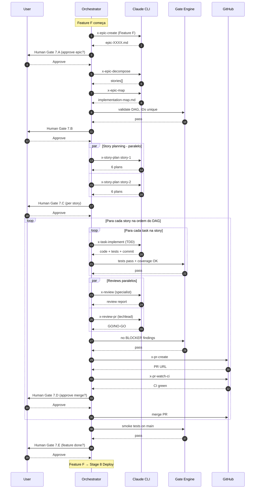
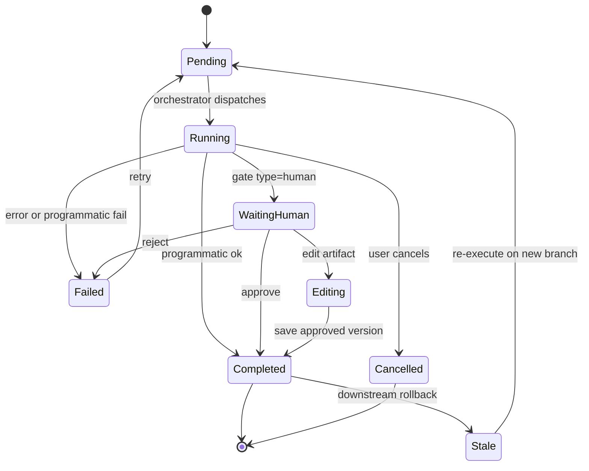
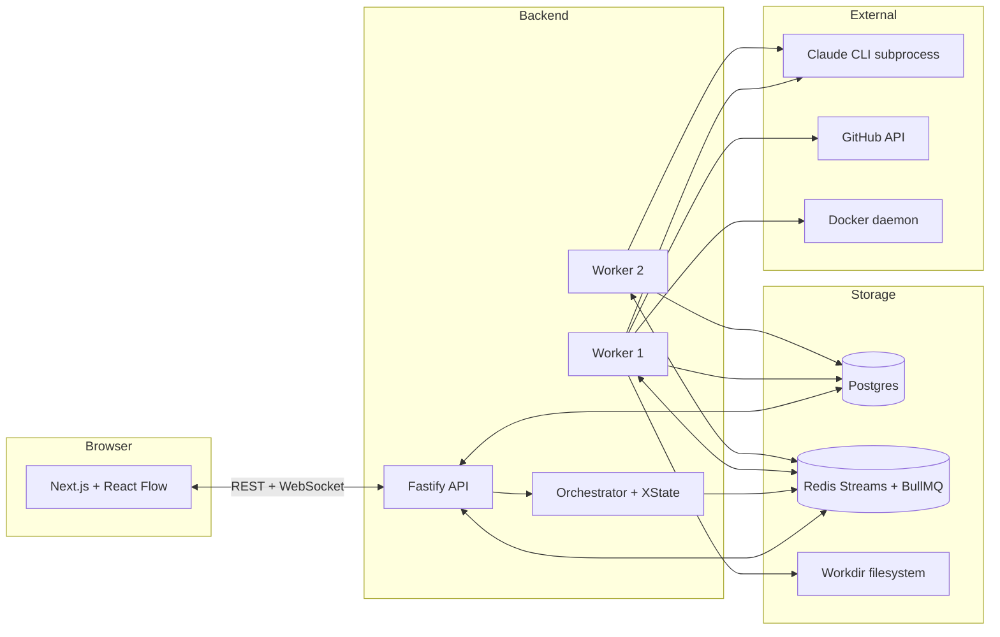

# MVP_V1 — 0 to Production AI Software Factory

> **Escopo:** Plano profundo do MVP V1 da plataforma "0 to Production". Considera **Opção A** (Claude Code CLI subprocess + subscription pessoal) como modo de execução de LLM. Documento vivo — atualizar a cada sessão de detalhamento. Produto não viverá neste repositório.

---

## 1. Visão do produto

Plataforma visual end-to-end que pega uma **ideia** e leva até **produção em cloud**, com IA assistindo cada etapa e **decisão humana obrigatória** em todos os gates. Inspiração visual: N8N (canvas com nodes/edges), mas voltado a SDLC completo.

### O que diferencia de competidores (Devin, Factory, v0, Bolt)

- **Human-in-the-loop em todos os stages** — não autônomo. Claude propõe, humano decide.
- **Reentrância em qualquer ponto** — voltar do Deploy pra Ideação se precisar.
- **Orquestração programática, não LLM-driven** — gates determinísticos entre stages eliminam o problema "LLM pula etapas".
- **Visual e auditável** — todo step, custo, tempo, decisão, artefato é persistido e visualizado.
- **Catálogo de skills maduro** — 80+ skills do `ia-dev-environment` viram prompt templates reutilizáveis.
- **Compliance modes** (futuro) — Rules viram modos selecionáveis (PCI, SOC2, ISO 27001).

---

## 2. Princípios arquiteturais

| # | Princípio | Implicação |
|---|---|---|
| P1 | **Orquestrador é código, não LLM.** | State machine determinístico. LLM só é chamada em nodes específicos. |
| P2 | **Toda decisão humana é persistida.** | Audit trail completo: quem aprovou o quê, quando, com qual justificativa. |
| P3 | **Toda etapa é reversível.** | Rollback pra qualquer stage anterior cria nova "branch" no Run. |
| P4 | **Toda edição cria nova versão.** | Artefatos são imutáveis; mudanças geram nova versão e invalidam downstream. |
| P5 | **Gates programáticos > gates LLM.** | Validação de schema, dependências, regras de negócio em código. |
| P6 | **Streaming first.** | UI recebe eventos em tempo real (não polling). |
| P7 | **Cost tracking obrigatório.** | Cada chamada LLM mede tokens, tempo, custo, mesmo na Opção A. |
| P8 | **Feature-by-feature deploy.** | Sequencial no MVP. Detecção precoce de problemas. |
| P9 | **Stateless workers.** | Estado em Postgres/Redis, workers podem morrer e ressuscitar. |
| P10 | **MVP em Docker Compose.** | K8s só quando virar pré-produção. |

---

## 3. Stages do workflow

Macro pipeline de 8 stages. Cada stage é composto de N nodes.

| # | Stage | Output principal | Tipo predominante |
|---|---|---|---|
| 1 | **Ideation** | Idea Brief (markdown estruturado) | LLM conversacional |
| 2 | **Product Definition** | Product Spec (cobrança, público, regulatórios) | LLM + human gate |
| 3 | **Capabilities** | Catálogo de capabilities | LLM + gate programático |
| 4 | **Features** | Catálogo de features por capability | LLM + gate programático |
| 5 | **Architecture** | Arch Spec + de-para feature → serviço | LLM + gate programático |
| 6 | **Repositories** | Repos GitHub + bootstrap CI/CD | Programmatic + external API |
| 7 | **Development Cycle** | Código + testes + PRs merged por feature | Híbrido (skills + gates programáticos) |
| 8 | **Deploy** | Feature em cloud + smoke tests | Programmatic + external API |

### 3.1 Stage 1 — Ideation

Input: brief textual do usuário (uma frase ou parágrafo).

Nodes:
- **N1.1 — Brief capture** (form): texto livre.
- **N1.2 — Exploratory conversation** (LLM, multi-turn): IA faz perguntas — domínio, público, problema central, restrições. Usuário responde. Loop até IA achar que tem material.
- **N1.3 — Idea Brief generation** (LLM): consolida conversa em markdown estruturado.
- **G1 — Human Gate**: Approve / Edit / Reject.

### 3.2 Stage 2 — Product Definition

Input: Idea Brief.

Nodes:
- **N2.1 — Product Spec** (LLM): seções fixas — visão, público-alvo, persona, modelo de cobrança (SaaS / transacional / freemium), funcionalidades macro, regulatórios (LGPD, PCI, etc), concorrência, riscos.
- **N2.2 — Compliance flags** (LLM): identifica que compliance se aplica → ativa `compliance modes` que afetam stages 5–7.
- **G2 — Human Gate**: Approve / Edit / Discuss.

### 3.3 Stage 3 — Capabilities

Input: Product Spec.

Nodes:
- **N3.1 — Capability decomposition** (LLM): decompõe produto em capabilities atômicas. Ex: pagamento → [autorização, captura, estorno, cancelamento, liquidação, extrato].
- **N3.2 — Capability detail** (LLM, paralelo por capability): cada uma ganha descrição, atores, fluxos macro, dependências.
- **Gate programático G3a**: ≥1 capability; toda capability tem nome único + descrição não-vazia.
- **G3 — Human Gate**: aprova catálogo, pode adicionar/remover/editar.

### 3.4 Stage 4 — Features

Input: Capabilities.

Nodes:
- **N4.1 — Feature decomposition** (LLM, paralelo por capability): cada capability vira N features.
- **N4.2 — Feature detail** (LLM, paralelo por feature): inputs, outputs, regras de negócio, edge cases.
- **Gate programático G4a**: cada capability tem ≥1 feature; cada feature tem ID único + descrição + regras.
- **G4 — Human Gate**.

### 3.5 Stage 5 — Architecture

Input: Features + Compliance flags.

Nodes:
- **N5.1 — Architecture proposal** (LLM): número de microsserviços, linguagem por serviço, DBs, cloud provider, message broker, cache, observability stack.
- **N5.2 — Service mapping** (LLM): de-para feature → serviço (1:N permitido — várias features no mesmo serviço).
- **N5.3 — ADRs** (LLM, paralelo): um ADR por decisão técnica relevante.
- **Gate programático G5a**: cada feature mapeia pra exatamente 1 serviço; toda decisão tem ADR; stack technologies estão num catálogo permitido.
- **G5 — Human Gate**: pode editar service mapping, mudar stack.

### 3.6 Stage 6 — Repositories

Input: Architecture + Service mapping.

Nodes (loop por serviço, paralelo):
- **N6.1 — Create GitHub repo** (programático, GitHub API).
- **N6.2 — Bootstrap from template** (programático): seleciona template por linguagem (Spring Boot, NestJS, FastAPI, etc).
- **N6.3 — Configure CI/CD** (programático): GitHub Actions com pipeline de teste, build, security scan.
- **N6.4 — Configure branch protection** (programático): regras de PR, require reviews, status checks.
- **N6.5 — Seed CLAUDE.md + skills** (programático): copia subset de skills relevantes pro repo.
- **Gate programático G6a**: todos repos respondem a `gh repo view`; todos têm CI verde no commit inicial.
- **G6 — Human Gate**: confirma estrutura.

### 3.7 Stage 7 — Development Cycle

Input: Features + Repos + Service mapping.

**Iteração sequencial por feature** (P8). Cada feature passa por:

#### 7.A Epic Creation
- **N7.A.1**: skill `x-epic-create` adaptada — cria épico no repo do serviço-dono.
- **G7.A — Human Gate**.

#### 7.B Story Decomposition
- **N7.B.1**: skill `x-epic-decompose` — gera N stories.
- **N7.B.2**: skill `x-epic-map` — implementation map com dependências.
- **Gate programático G7.Ba**: stories têm ID único, dependências formam DAG (sem ciclos).
- **G7.B — Human Gate**.

#### 7.C Story Planning (paralelo por story, respeitando DAG)
- **N7.C.1**: skill `x-story-plan` (5 sub-agents paralelos: Architect, QA, Security, TechLead, PO).
- **Outputs**: arch-plan, test-plan, task-breakdown, security-assessment, compliance-assessment, plan-implementation.
- **Gate programático G7.Ca**: 6 artifacts presentes; tasks têm IDs; cada task tem TDD plan.
- **G7.C — Human Gate** por story.

#### 7.D Implementation (sequencial por story dentro da DAG)
Loop por task da story:
- **N7.D.1**: skill `x-task-implement` (TDD red-green-refactor).
- **N7.D.2**: gate programático — testes passam, coverage ≥ thresholds.
- **N7.D.3**: skill `x-test-tdd` para validação.
- **Gate programático G7.Da**: build verde, coverage ≥ 95% line / 90% branch.

Após todas tasks da story:
- **N7.D.4**: skill `x-review` (parallel specialist review — security, perf, qa, devops).
- **N7.D.5**: skill `x-review-pr` (techlead — 45-point checklist).
- **Gate programático G7.Db**: review scores ≥ threshold; sem findings BLOCKER.
- **N7.D.6**: skill `x-pr-create`.
- **Gate programático G7.Dc**: CI green via `x-pr-watch-ci` (8 exit codes).
- **G7.D — Human Gate**: aprovar merge.
- **N7.D.7**: programático — merge PR.

#### 7.E Feature Validation
Após todas stories da feature merged:
- **N7.E.1**: programático — smoke tests no branch principal.
- **N7.E.2**: programático — integração com features anteriores (se aplicável).
- **G7.E — Human Gate**.

### 3.8 Stage 8 — Deploy (por feature, sequencial)

Input: Feature pronta no repo principal.

Nodes:
- **N8.1**: programático — build container image.
- **N8.2**: programático — push para registry.
- **N8.3**: programático — deploy (Helm chart / kubectl / cloud-specific).
- **N8.4**: programático — health check + smoke test em produção.
- **N8.5**: programático — observability check (logs, métricas, traces aparecendo).
- **Gate programático G8a**: feature responde em produção; smoke OK.
- **G8 — Human Gate**: confirma feature live → libera próxima feature.

---

## 4. Diagrama macro (Mermaid)

```mermaid
flowchart TD
    Start([User: ideia inicial]) --> S1
    
    subgraph Stage1[Stage 1: Ideation]
        S1[Brief capture] --> S1B[Exploratory chat - LLM]
        S1B --> S1C[Idea Brief - LLM]
    end
    
    Stage1 --> G1{Human Gate 1}
    G1 -->|Approve| S2
    G1 -->|Edit| S1C
    G1 -->|Reject| End([End])
    
    subgraph Stage2[Stage 2: Product Definition]
        S2[Product Spec - LLM] --> S2B[Compliance flags - LLM]
    end
    
    Stage2 --> G2{Human Gate 2}
    G2 -->|Approve| S3
    G2 -->|Rollback| S1
    G2 -->|Edit| S2
    
    subgraph Stage3[Stage 3: Capabilities]
        S3[Capability decompose - LLM] --> S3B[Capability detail - LLM parallel]
        S3B --> G3a{{Programmatic Gate}}
    end
    
    G3a -->|Pass| G3{Human Gate 3}
    G3a -->|Fail| S3
    G3 -->|Approve| S4
    G3 -->|Rollback| S2
    
    subgraph Stage4[Stage 4: Features]
        S4[Feature decompose - LLM] --> S4B[Feature detail - LLM]
        S4B --> G4a{{Programmatic Gate}}
    end
    
    G4a -->|Pass| G4{Human Gate 4}
    G4a -->|Fail| S4
    G4 -->|Approve| S5
    G4 -->|Rollback| S3
    
    subgraph Stage5[Stage 5: Architecture]
        S5[Arch proposal - LLM] --> S5B[Service mapping - LLM]
        S5B --> S5C[ADRs - LLM parallel]
        S5C --> G5a{{Programmatic Gate}}
    end
    
    G5a -->|Pass| G5{Human Gate 5}
    G5a -->|Fail| S5
    G5 -->|Approve| S6
    G5 -->|Rollback| S4
    
    subgraph Stage6[Stage 6: Repositories]
        S6[Create repos - parallel] --> S6B[Bootstrap + CI/CD]
        S6B --> S6C[Branch protection]
        S6C --> S6D[Seed skills]
        S6D --> G6a{{Programmatic Gate}}
    end
    
    G6a -->|Pass| G6{Human Gate 6}
    G6a -->|Fail| S6
    G6 -->|Approve| S7
    
    subgraph Stage7[Stage 7: Dev Cycle - per feature sequential]
        direction TB
        S7Loop[Pick next feature] --> S7A[Epic Create]
        S7A --> S7B[Story Decompose]
        S7B --> S7C[Story Plan - parallel]
        S7C --> S7D[Implement TDD]
        S7D --> S7E[Review specialist]
        S7E --> S7F[Review TechLead]
        S7F --> S7G[PR Create]
        S7G --> S7H[CI Watch]
        S7H --> S7I[Merge]
        S7I --> S7J[Feature Validation]
    end
    
    G6 --> S7Loop
    S7J --> S8
    
    subgraph Stage8[Stage 8: Deploy per feature]
        S8[Build image] --> S8B[Push registry]
        S8B --> S8C[Deploy cloud]
        S8C --> S8D[Smoke prod]
        S8D --> G8a{{Programmatic Gate}}
    end
    
    G8a -->|Pass| G8{Human Gate 8}
    G8a -->|Fail| S8
    G8 -->|Approve| MoreFeatures{More features?}
    MoreFeatures -->|Yes| S7Loop
    MoreFeatures -->|No| Done([Project complete])
    
    style G1 fill:#ffd700
    style G2 fill:#ffd700
    style G3 fill:#ffd700
    style G4 fill:#ffd700
    style G5 fill:#ffd700
    style G6 fill:#ffd700
    style G8 fill:#ffd700
    style G3a fill:#90ee90
    style G4a fill:#90ee90
    style G5a fill:#90ee90
    style G6a fill:#90ee90
    style G8a fill:#90ee90
```



Legenda: **amarelo** = human gate; **verde** = programmatic gate; **cinza** = stage.

---

## 5. Diagrama detalhado — Stage 7 Dev Cycle de uma feature



---

## 6. Estados de um Node



---

## 7. Modelo conceitual de dados

### Entidades core

| Entidade | Propósito |
|---|---|
| **Project** | Raiz — uma ideia de produto (ex: "Aluguel de Carros") |
| **Run** | Uma execução completa do flow para um Project, com versão |
| **Branch** | Sub-versão de um Run quando há rollback (Run pode ter N branches) |
| **Stage** | Instância de um stage (Ideation, Product, ...) num Branch |
| **Node** | Instância de operação atômica num Stage |
| **NodeAttempt** | Cada tentativa de execução de um Node (retry cria nova) |
| **Artifact** | Output de um Node (markdown, JSON, código gerado) |
| **ArtifactVersion** | Versão imutável de um Artifact |
| **Decision** | Ação humana num gate (approve/reject/edit/rollback) |
| **LLMCall** | Telemetria de cada chamada `claude -p` (tokens, custo, duração) |
| **GateResult** | Resultado de gate programático (passed/failed + reason) |
| **Capability / Feature / Service** | Entidades de domínio do produto sendo construído (geradas nos Stages 3–5) |

### Relacionamentos chave

```
Project 1—* Run
Run 1—* Branch
Branch 1—* Stage
Stage 1—* Node
Node 1—* NodeAttempt
Node 1—* Artifact
Artifact 1—* ArtifactVersion
NodeAttempt 1—* LLMCall
NodeAttempt 1—* GateResult
Node 1—* Decision
```

### Schema Postgres (essencial — MVP)

```sql
-- Identidade
CREATE TABLE projects (
  id UUID PRIMARY KEY,
  name TEXT NOT NULL,
  created_at TIMESTAMPTZ DEFAULT NOW(),
  status TEXT NOT NULL  -- active | done | archived
);

CREATE TABLE runs (
  id UUID PRIMARY KEY,
  project_id UUID REFERENCES projects,
  version INT NOT NULL,
  status TEXT NOT NULL,  -- running | completed | failed | paused
  started_at TIMESTAMPTZ,
  ended_at TIMESTAMPTZ,
  total_cost_usd NUMERIC(10,4) DEFAULT 0,
  total_tokens_input BIGINT DEFAULT 0,
  total_tokens_output BIGINT DEFAULT 0
);

CREATE TABLE branches (
  id UUID PRIMARY KEY,
  run_id UUID REFERENCES runs,
  parent_branch_id UUID REFERENCES branches,
  rollback_from_stage_id UUID,  -- where this branch forked
  is_current BOOLEAN DEFAULT TRUE
);

-- Pipeline
CREATE TABLE stages (
  id UUID PRIMARY KEY,
  branch_id UUID REFERENCES branches,
  type TEXT NOT NULL,  -- ideation | product | capabilities | ...
  position INT NOT NULL,
  status TEXT NOT NULL,
  started_at TIMESTAMPTZ,
  ended_at TIMESTAMPTZ
);

CREATE TABLE nodes (
  id UUID PRIMARY KEY,
  stage_id UUID REFERENCES stages,
  type TEXT NOT NULL,  -- llm | programmatic | human_gate | external
  name TEXT NOT NULL,
  position INT NOT NULL,
  status TEXT NOT NULL,
  current_attempt_id UUID,
  current_artifact_version_id UUID
);

CREATE TABLE node_attempts (
  id UUID PRIMARY KEY,
  node_id UUID REFERENCES nodes,
  attempt_number INT,
  status TEXT NOT NULL,
  started_at TIMESTAMPTZ,
  ended_at TIMESTAMPTZ,
  duration_ms INT,
  error_message TEXT
);

-- Artefatos
CREATE TABLE artifacts (
  id UUID PRIMARY KEY,
  node_id UUID REFERENCES nodes,
  type TEXT NOT NULL,  -- markdown | json | code
  name TEXT NOT NULL
);

CREATE TABLE artifact_versions (
  id UUID PRIMARY KEY,
  artifact_id UUID REFERENCES artifacts,
  version INT NOT NULL,
  content TEXT NOT NULL,  -- ou ref pra blob storage se grande
  created_at TIMESTAMPTZ DEFAULT NOW(),
  created_by_attempt_id UUID,
  created_by_user_id UUID  -- se edição manual
);

-- Decisões e gates
CREATE TABLE decisions (
  id UUID PRIMARY KEY,
  node_id UUID REFERENCES nodes,
  type TEXT NOT NULL,  -- approve | reject | edit | rollback | retry | discuss
  user_id UUID,
  reason TEXT,
  created_at TIMESTAMPTZ DEFAULT NOW()
);

CREATE TABLE gate_results (
  id UUID PRIMARY KEY,
  node_attempt_id UUID REFERENCES node_attempts,
  gate_name TEXT NOT NULL,
  passed BOOLEAN NOT NULL,
  reason TEXT,
  evaluated_at TIMESTAMPTZ DEFAULT NOW()
);

-- Telemetria LLM
CREATE TABLE llm_calls (
  id UUID PRIMARY KEY,
  node_attempt_id UUID REFERENCES node_attempts,
  skill_name TEXT,
  model TEXT NOT NULL,
  input_tokens INT,
  output_tokens INT,
  cache_read_tokens INT,
  cost_usd NUMERIC(10,6),
  duration_ms INT,
  started_at TIMESTAMPTZ,
  ended_at TIMESTAMPTZ
);

-- Domínio do produto sendo construído
CREATE TABLE capabilities (
  id UUID PRIMARY KEY,
  branch_id UUID REFERENCES branches,
  name TEXT NOT NULL,
  description TEXT,
  artifact_version_id UUID
);

CREATE TABLE features (
  id UUID PRIMARY KEY,
  capability_id UUID REFERENCES capabilities,
  name TEXT NOT NULL,
  description TEXT,
  artifact_version_id UUID,
  status TEXT  -- pending | dev | merged | deployed
);

CREATE TABLE services (
  id UUID PRIMARY KEY,
  branch_id UUID REFERENCES branches,
  name TEXT NOT NULL,
  language TEXT,
  database TEXT,
  repo_url TEXT
);

CREATE TABLE feature_service_mapping (
  feature_id UUID REFERENCES features,
  service_id UUID REFERENCES services,
  PRIMARY KEY (feature_id, service_id)
);

-- Streaming de eventos pra UI
CREATE TABLE events (
  id BIGSERIAL PRIMARY KEY,
  run_id UUID REFERENCES runs,
  node_id UUID,
  type TEXT NOT NULL,  -- node.started, node.progress, node.tokens, ...
  payload JSONB,
  created_at TIMESTAMPTZ DEFAULT NOW()
);

CREATE INDEX idx_events_run_created ON events (run_id, created_at);
```

---

## 8. Tipos de Nodes

| Tipo | Quem executa | Exemplo |
|---|---|---|
| **LLMNode** | Worker spawna `claude -p` | x-arch-plan, x-story-plan |
| **ConversationNode** | Worker mantém sessão com `--resume` | Stage 1 N1.2 |
| **ProgrammaticNode** | Função TS pura no worker | gate de coverage, schema validation |
| **ExternalNode** | Worker chama API externa | GitHub create repo, kubectl deploy |
| **HumanGateNode** | Worker para, UI mostra prompt, recebe webhook | todos os G* |
| **CompositeNode** | Wrapper que dispara sub-nodes em paralelo | Story planning (5 sub-agents) |

### Contrato de execução (interface TS)

```typescript
interface NodeExecutor<TInput, TOutput> {
  type: NodeType;
  execute(ctx: ExecutionContext, input: TInput): AsyncIterable<NodeEvent>;
  cancel(ctx: ExecutionContext): Promise<void>;
}

type NodeEvent =
  | { kind: "started"; at: Date }
  | { kind: "progress"; chunk: string }
  | { kind: "tokens"; input: number; output: number; cost: number }
  | { kind: "artifact"; content: string; mimeType: string }
  | { kind: "completed"; output: TOutput }
  | { kind: "failed"; error: string }
  | { kind: "needs_human"; promptId: string };
```

---

## 9. Sistema de Gates

### Gates programáticos (catálogo MVP)

| Gate | Onde | Validação |
|---|---|---|
| `gate.capabilities.shape` | G3a | ≥1 capability, nomes únicos, descrição não-vazia |
| `gate.features.coverage` | G4a | cada capability tem ≥1 feature |
| `gate.architecture.mapping` | G5a | cada feature ↔ exatamente 1 serviço |
| `gate.architecture.stack` | G5a | stack ∈ catálogo permitido |
| `gate.repos.alive` | G6a | `gh repo view` OK pra todos |
| `gate.story.dag` | G7.Ba | dependências formam DAG sem ciclos |
| `gate.story.plans` | G7.Ca | 6 artefatos presentes |
| `gate.test.coverage` | G7.Da | line ≥ 95%, branch ≥ 90% |
| `gate.review.score` | G7.Db | sem findings BLOCKER |
| `gate.ci.green` | G7.Dc | CI verde via x-pr-watch-ci |
| `gate.smoke.pass` | G7.Ea | smoke tests passam |
| `gate.deploy.health` | G8a | health endpoint responde |
| `gate.observability.signals` | G8a | logs/métricas/traces aparecem em até N segundos |

### Cada gate é função pura

```typescript
type Gate<TInput> = (input: TInput, ctx: GateContext) => Promise<GateResult>;

interface GateResult {
  passed: boolean;
  reason: string;
  evidence?: Record<string, unknown>;
}
```

Resultado persistido em `gate_results`. Falha não corrompe estado — apenas bloqueia avanço, mostra na UI, oferece retry.

---

## 10. Stack técnica do MVP

### Backend

| Camada | Escolha | Por quê |
|---|---|---|
| Runtime | **Node.js 20 + TypeScript** | Ecossistema Claude SDK futuro; subprocess CLI trivial |
| Web framework | **Fastify** | Performance + plugin model |
| ORM | **Prisma** | Schema-first, migrations, types |
| Queue | **BullMQ** (Redis) | Jobs persistentes, retry, prioridade |
| State machine | **XState v5** | State charts visualizáveis, time-travel debug |
| Stream pub/sub | **Redis Streams** | Eventos persistentes, múltiplos consumers |
| Logs | **Pino** | Fast, structured |
| Tests | **Vitest** | Fast, ESM-native |

### Frontend

| Camada | Escolha | Por quê |
|---|---|---|
| Framework | **Next.js 14** (App Router) | SSR + RSC + API routes |
| Canvas | **React Flow** | De facto pra graph editors (N8N usa similar) |
| State client | **Zustand** + **TanStack Query** | Simples + cache de server state |
| UI kit | **Tailwind + shadcn/ui** | Velocidade de design |
| Animações | **Framer Motion** | Transitions e gestures |
| Realtime | **Socket.IO** ou **SSE** | WebSocket nativo Next |
| Markdown editor | **MDX Editor** ou **Tiptap** | Edição inline de artifacts |
| Diff viewer | **react-diff-viewer** | Mostrar mudanças entre versões de artifact |

### Integrações

| Integração | Lib | Uso |
|---|---|---|
| Claude CLI | `child_process.spawn` | Spawning + parse stream-json |
| GitHub | `Octokit` | Repos, PRs, branch protection |
| Docker | `Dockerode` | Build de containers |
| Kubernetes | `@kubernetes/client-node` | Deploy (futuro) |
| GitOps | `simple-git` | Operações git locais quando precisar |

### Infra MVP (Docker Compose)

```yaml
services:
  postgres:
    image: postgres:16
    volumes: [pgdata:/var/lib/postgresql/data]
  
  redis:
    image: redis:7-alpine
    volumes: [redisdata:/data]
  
  api:
    build: ./apps/api
    depends_on: [postgres, redis]
    environment:
      DATABASE_URL: postgres://...
      REDIS_URL: redis://...
  
  worker:
    build: ./apps/worker
    depends_on: [postgres, redis]
    deploy:
      replicas: 2
    volumes:
      - ~/.claude:/home/node/.claude:ro  # subscription auth
      - ./projects-workdir:/workdir       # repos clonados
  
  web:
    build: ./apps/web
    depends_on: [api]
    ports: ["3000:3000"]
```

K8s **não no MVP**. Vira pré-prod depois.

---

## 11. Arquitetura de componentes



### Fluxo de uma chamada

1. UI clica "Approve" → POST `/api/decisions` → API persiste Decision + emite evento.
2. Orchestrator (XState) recebe evento → transita state → enfileira próximo Node em BullMQ.
3. Worker pega job → resolve NodeExecutor → executa.
4. NodeExecutor emite eventos via Redis Streams.
5. API consome stream → push pro WebSocket → UI atualiza node em tempo real.

### Por que workers separados

- **Stateless**: workers podem morrer, BullMQ retoma.
- **Escala horizontal**: aumenta replicas conforme paralelismo do flow.
- **Isolamento**: subprocess do Claude CLI fica no worker, não polui API.
- **Recursos**: workers podem ter mais CPU/memória que API.

---

## 12. Execução de LLM via CLI subprocess (Opção A)

### Setup
- Subscription Claude Pro/Max já logada (`claude login` no host).
- Worker monta `~/.claude` read-only no container.
- Cada projeto tem workdir isolado em `/workdir/<project-id>`.

### Spawn pattern

```typescript
async function* runClaudeSkill(
  skillBody: string,
  vars: Record<string, string>,
  cwd: string
): AsyncIterable<NodeEvent> {
  const renderedPrompt = renderSkill(skillBody, vars);
  
  const child = spawn("claude", [
    "-p", renderedPrompt,
    "--output-format", "stream-json",
    "--allowedTools", "Read,Edit,Write,Bash,Glob,Grep",
    "--permission-mode", "acceptEdits",
  ], { cwd, env: { ...process.env } });
  
  yield { kind: "started", at: new Date() };
  
  for await (const line of readlines(child.stdout)) {
    const event = JSON.parse(line);
    
    if (event.type === "assistant" && event.message?.content) {
      yield { kind: "progress", chunk: extractText(event) };
    }
    
    if (event.type === "result") {
      yield { 
        kind: "tokens", 
        input: event.usage.input_tokens,
        output: event.usage.output_tokens,
        cost: estimateCost(event.usage)
      };
      yield { kind: "completed", output: event.result };
    }
  }
}
```

### Tradeoffs Opção A no MVP

| Aspecto | Como tratamos |
|---|---|
| Custo monetário | Zero (subscription) — só registramos tokens equivalentes |
| Cold start subprocess | ~500ms — aceitável pro MVP |
| Streaming | Parse de stream-json line-by-line |
| Múltiplos paralelos | N processos simultâneos (limitar via BullMQ concurrency) |
| Cache de prompt | **Não disponível via CLI subscription** — limitação real |
| Cancelamento | `child.kill("SIGTERM")` |

### Quando migrar pra SDK

Triggers:
- Validar arquitetura ✓
- Decidir virar produto comercial ✓
- Precisar de prompt caching pra escala ✓
- Precisar de múltiplas conversas no mesmo processo ✓

A migração troca **só o NodeExecutor de tipo LLM**. Resto do sistema é preservado.

---

## 13. UI/UX — canvas N8N-like

### Layout principal

```
┌──────────────────────────────────────────────────────────┐
│ Header: Project name | Run #3 | $0.00 | 47min | 62% ▓▓▓░ │
├──────────┬───────────────────────────────────┬───────────┤
│          │                                   │           │
│ Sidebar  │      Canvas (React Flow)          │  Detail   │
│          │                                   │  Panel    │
│ - Stages │      [N1.1]→[N1.2]→[N1.3]         │           │
│ - Search │              ↓                    │  Node X   │
│ - Filter │           [G1] (yellow)           │  --------  │
│          │              ↓                    │  Status   │
│          │           [N2.1]                  │  Inputs   │
│          │              ↓                    │  Outputs  │
│          │           ...                     │  Logs     │
│          │                                   │  Tokens   │
│          │  [Mini-map]                       │  Time     │
│          │                                   │  Actions  │
└──────────┴───────────────────────────────────┴───────────┘
```

### Visual states de Node

| Estado | Cor | Animação |
|---|---|---|
| Pending | Cinza | — |
| Running | Azul | Pulse |
| Streaming output | Azul | Spinner + texto fluindo |
| WaitingHuman | Amarelo | Glow pulsante |
| Completed | Verde | Check fade-in |
| Failed | Vermelho | Shake + ícone X |
| Stale (downstream de rollback) | Laranja claro | Hatched pattern |

### Edges animadas

- Pending: linha cinza estática.
- Active (dado fluindo): partículas se movendo (Framer Motion).
- Completed: sólida verde.

### Detail Panel — ações por node

Top section:
- Status, tipo, tempo, tokens, custo

Tabs:
- **Output**: artifact atual (markdown rendered ou code com syntax highlight)
- **Versions**: histórico de artifact versions com diff viewer
- **Logs**: stream do worker
- **Decisions**: histórico de aprovações/rejeições
- **LLM Calls**: lista de chamadas com tokens individuais

Botões (contextuais):
- `Approve` (gates humanos)
- `Reject` (com modal pra justificativa)
- `Edit` (abre editor markdown inline)
- `Discuss` (abre chat com Claude sobre o artifact)
- `Retry` (rerun)
- `Rollback to here` (cria nova branch a partir desse stage)
- `Cancel` (mata processo)

### Zoom levels

- Far: ver pipeline inteiro do projeto
- Mid: ver um stage com seus nodes
- Near: ver um node individual com detalhes

### Cost meter

Header global com:
- $ acumulado (ou "tokens" na Opção A)
- Tempo total
- % completo
- Burn rate ($/min)

Cor muda conforme orçamento (verde → amarelo → vermelho) se config tiver budget.

---

## 14. Reentrância e versionamento

### Quando user faz Rollback

1. Cria-se nova `Branch` no Run, parent = branch atual, fork-point = stage X.
2. Stages X+1..N do branch antigo ficam preservados (histórico).
3. Nova branch começa "fresh" do stage X com input = artifact version final do stage X-1.
4. Workers ignoram branch antiga.

### Quando user edita artifact em gate

1. Nova `ArtifactVersion` é criada com `created_by_user_id`.
2. Nodes downstream (no mesmo stage e em stages futuros) ficam `Stale`.
3. User precisa explicitamente re-rodar (botão "Re-execute downstream").

### UI mostra branches como tabs

```
[Branch main ●]  [Branch alt-arch ○]  [+ New from rollback]
```

Comparar branches: side-by-side de artifacts.

---

## 15. Catálogo de skills do MVP

Subset prioritário (nem todas as 80+ atuais entram no V1).

### Novas skills (ainda não existem)
- `x-product-ideate` — Stage 1 conversational
- `x-product-spec` — Stage 2
- `x-capability-decompose` — Stage 3
- `x-feature-decompose` — Stage 4
- `x-repo-bootstrap` — Stage 6
- `x-feature-deploy` — Stage 8

### Skills existentes adaptadas (vira prompt template puro)
- `x-arch-plan` → Stage 5 N5.1
- `x-adr-generate` → Stage 5 N5.3
- `x-epic-create` → 7.A
- `x-epic-decompose` → 7.B.1
- `x-epic-map` → 7.B.2
- `x-story-plan` → 7.C (5 sub-agents paralelos)
- `x-task-implement` → 7.D.1
- `x-test-tdd` → 7.D.3
- `x-review` → 7.D.4
- `x-review-pr` → 7.D.5
- `x-pr-create` → 7.D.6
- `x-pr-watch-ci` → 7.D.6 gate
- `x-dependency-audit` → optional gate
- `x-threat-model` → optional Stage 5

### Skills puramente programáticas (deixam de ser LLM)
Todo `x-internal-*` vira função TS no orchestrator.
- `x-git-commit`, `x-git-branch`, `x-git-merge`, `x-git-worktree` → Octokit/simple-git
- `x-internal-status-update` → Prisma update
- `x-internal-phase-gate` → gate engine
- `x-test-run`, `x-code-format`, `x-code-lint` → spawn das toolchains nativas

---

## 16. Compliance modes

Stage 2 detecta flags (PCI, LGPD, HIPAA, etc) e ativa modos que afetam:

| Compliance | Stage 5 | Stage 7 | Stage 8 |
|---|---|---|---|
| **PCI** | Stack permitida exclui certas opções; obriga TLS, secret manager | Threat-model obrigatório; pen-test gate | Network segmentation, WAF |
| **LGPD** | DB com encryption-at-rest obrigatório | Audit log gate | Data retention check |
| **HIPAA** | Stack approved-list mais restrita | PHI handling review | BAA validation |

Cada modo adiciona gates específicos. Definidos em código, não LLM.

---

## 17. Plano de implementação faseado

### Phase 0 — Setup (1 semana)
- Monorepo (Turborepo ou Nx)
- Postgres + Redis docker compose up
- Prisma schema base
- Auth simples (JWT, single user)
- Smoke test: API + Worker + UI conversam

### Phase 1 — Vertical slice mínimo (3 semanas)
**Objetivo:** Stage 1 (Ideation) ponta-a-ponta funcionando.
- Canvas com 1 node
- Spawn de `claude -p` no worker
- Streaming pro UI via WebSocket
- Persist artifact em Postgres
- Human gate clicável
- Cost tracking de tokens

### Phase 2 — Stages 2–5 (3 semanas)
**Objetivo:** sair de Ideation e chegar em Architecture.
- Implementar 4 stages (Product, Capabilities, Features, Architecture)
- Skills LLM correspondentes
- Gates programáticos (5 catálogo MVP)
- Editor de artifacts inline
- Versionamento básico

### Phase 3 — Stage 6 (2 semanas)
**Objetivo:** criar repos automaticamente.
- Octokit integration
- Templates por linguagem (3-4 starter)
- CI/CD seed
- Branch protection

### Phase 4 — Stage 7 dev cycle (4 semanas)
**Objetivo:** uma feature completa do código ao PR mergeado.
- Adaptar skills existentes pro novo runtime
- TDD loop
- Reviews paralelos
- PR creation + watch
- Sequencial por feature

### Phase 5 — Stage 8 deploy (2 semanas)
**Objetivo:** deploy real (k8s local primeiro).
- Build container
- Deploy K8s local (kind ou minikube)
- Smoke prod
- Observability check

### Phase 6 — Reentrância e UX polish (2 semanas)
- Rollback funcional
- Branches do Run
- Diff viewer
- Animações Framer Motion
- Mini-map, zoom levels

### Phase 7 — Hardening (2 semanas)
- Error recovery
- Worker crash recovery
- Long-running runs (> 24h)
- Logs e telemetria

**Total estimado: ~19 semanas (~5 meses) pra MVP completo.**

Vertical slice (Phase 0+1) entrega valor demonstrável em 4 semanas.

---

## 18. Riscos e mitigações

| Risco | Impacto | Mitigação |
|---|---|---|
| Subscription rate-limit em paralelos | Alto | Limitar BullMQ concurrency a N workers Claude simultâneos |
| Subprocess Claude CLI quebra de versão | Médio | Pin versão; smoke test ao iniciar worker |
| Artifact muito grande (>10MB) | Baixo | Mover content pra blob storage (S3/MinIO) com ref no Postgres |
| Stage 7 toma horas → user abandona UI | Alto | Notificações push (browser, email) quando gate humano aparece |
| Rollback causa estado inconsistente | Médio | Snapshot de tudo no fork point; immutability de versions |
| Skills antigas não funcionam fora do CLI Claude Code interativo | Alto | Subset MVP testado individualmente; adapter layer |
| Custos descontrolados na migração pra SDK | Alto | Budget hard cap por Run; alerta em 50%/80%/100% |
| Subscription dispara TOS por uso "automatizado" | Médio | Documentar uso interno-pessoal; migrar pra SDK rapidamente se virar produto |

---

## 19. Observabilidade

### Métricas (Prometheus + Grafana — futuro)
- Tempo médio por stage type
- Tokens médios por stage type
- Taxa de retry por node type
- Tempo médio em Human Gate (espera humana)
- Throughput de runs concluídos / dia

### Logs (Pino → file → Grafana Loki futuro)
- Estruturados em JSON
- Correlation ID por Run
- Span ID por Node

### Traces (futuro — OpenTelemetry)
- Span pai = Run
- Span filho = Stage → Node → LLM call

### Eventos NDJSON (sempre)
- Cada evento de Node persistido em `events` table
- Replay-friendly: pode reconstruir estado da UI a partir de eventos

---

## 20. Decisões abertas (próxima sessão)

1. **Auth do usuário** — single user (MVP), multi-tenant (futuro)?
2. **Where to clone repos** — host filesystem vs volume mount? E em produção?
3. **Estratégia de templates de bootstrap** — manter no monorepo ou repo separado?
4. **Lifecycle de Run** — quando arquivar?
5. **Modelo de cobrança do produto final** — flat fee, por-token, BYOK?
6. **Multi-projeto paralelo** — pode ter N runs ao mesmo tempo?
7. **Marketplace de skills** — third-party podem publicar?
8. **Compliance modes detalhados** — quais ativar no MVP?
9. **Idioma dos artifacts** — em que linguagem o produto será descrito (PT? EN?)?
10. **Estratégia de testes do próprio orquestrador** — como testar TS code que orquestra LLM?

---

## 21. Modelo de créditos e billing

> **Status:** ideias gerais para captura. Detalhamento e prioridade definidos em sessões futuras. Aplica-se primariamente ao **modo SDK + API key** (Opção B). Na Opção A (subscription), o sistema registra tokens equivalentes mas não cobra — útil pra calibrar pricing antes de virar produto.

### 21.1 Princípios

| # | Princípio |
|---|---|
| C1 | **Créditos pré-pagos.** Usuário só gasta o que carregou — sem dívida, sem cobrança surpresa. |
| C2 | **Separação dev vs deploy.** Custos de LLM (planejamento + desenvolvimento) e custos de infra (cloud) são entidades distintas, com saldos e gates independentes. |
| C3 | **Transparência total.** Cada chamada LLM tem custo visível em tempo real. Cada deploy mostra custo cloud incremental. |
| C4 | **Estimativa antes do compromisso.** Antes de iniciar um Run, mostrar faixa esperada de gasto (ex: "80–120 créditos"). |
| C5 | **Hard cap por padrão.** Sem créditos → Run pausa em human gate "recarga necessária". Sem fail silencioso. |
| C6 | **Margem e markup explícitos.** Custo Anthropic + margem da plataforma = preço por crédito. Documentado, não escondido. |

### 21.2 Modelo de créditos

**Crédito** = unidade abstrata interna. 1 crédito mapeia a uma fração de tokens, mas o usuário não precisa pensar em tokens.

Conversão:
- 1 crédito = X tokens equivalentes (mistura de input/output ponderada)
- **Markup aplicado na dedução, não na compra.** User compra créditos a preço transparente; o sistema, ao consumir, deduz `actual_cost_credits × (1 + markup_pct)`. Vantagem: pricing simples na superfície ("$X = Y créditos"), margem aplicada no consumo.
- Markup default: ex. 30% sobre o custo real Anthropic — configurável por categoria (LLM Opus / Sonnet / Haiku / cloud)
- Pacotes com desconto progressivo na **compra** (ex: 1k = preço cheio; 10k = 15% off; 100k = 25% off)
- O markup pode aparecer no painel como "Service fee: 30%" (transparência) ou ficar embutido (simplicidade) — decisão UX

**Exemplo:**
- Anthropic cobra $15 / 1M tokens output Opus
- Conversão interna: 1k tokens output = 15 millicredits ($0.015 equivalentes)
- Markup 30%: dedução real = 15 × 1.3 = 19.5 millicredits
- User vê "consumed 19.5 credits" ou "consumed 15 credits + 4.5 service fee" (configurável)

**Pacotes ilustrativos:**

| Pacote | Créditos | Equivalente em projetos | Preço hipotético |
|---|---|---|---|
| Starter | 1.000 | ~1 microsserviço pequeno | $20 |
| Pro | 10.000 | ~3-5 microsserviços | $150 |
| Team | 50.000 | ~projeto médio completo | $600 |
| Enterprise | sob consulta | uso contínuo | custom |

(Números são placeholders — calibrar com dados reais de projetos rodados na Opção A.)

### 21.3 Categorias de gasto

| Categoria | O que cobra | Pago com | Fonte de custo |
|---|---|---|---|
| **Dev/Planning** | LLM calls dos Stages 1–7 (ideation, spec, capabilities, features, arch, código, review) | Créditos | Anthropic API (Opus/Sonnet/Haiku) |
| **CI/Tooling** | Tool calls programáticos (testes, lint, format, build) | Créditos baixo custo ou grátis | Compute do worker |
| **Deploy/Infra** | Containers, k8s, banco, cache, network egress, observability | **Cobrança separada** | Cloud provider (AWS/GCP/Azure) |
| **Storage** | Repos, artefatos, blobs grandes | Cobrança separada | S3/GCS/Azure Blob |

**Por que separar deploy/infra:**
- Custos cloud são contínuos (não por-Run) — modelo de cobrança diferente
- Plataforma não pode prever custo de tráfego, picos, instâncias escaladas
- Integração direta com **Cost Explorer (AWS)**, **Cloud Billing (GCP)**, **Cost Management (Azure)** — passthrough transparente
- User pode trazer própria conta cloud (BYOC) — plataforma só orquestra

### 21.4 Recarga

| Modo | Quando |
|---|---|
| **One-time top-up** | User compra pacote pontualmente |
| **Auto-reload** | Quando saldo < threshold, recarrega automaticamente do método de pagamento salvo |
| **Auto-pause** | Sem créditos e sem auto-reload, Run pausa em "credits gate" — humano decide recarregar ou abortar |
| **Subscription** (futuro) | Plano mensal com bucket de créditos; sobra rola pro mês seguinte (com cap) |

### 21.5 Painel de custos (UI)

#### Header global
- Saldo atual em créditos (com $ equivalente)
- Burn rate ($/min ou créditos/min)
- Estimativa de quando vai esgotar (se em uso)
- Indicador visual (verde > 50% / amarelo 20–50% / vermelho < 20% do orçamento do Run)

#### Painel detalhado de billing (rota dedicada)
- **Saldo atual** + histórico de recargas
- **Consumo por período** (gráfico linha — dia/semana/mês)
- **Consumo por projeto** (pie chart)
- **Consumo por stage** (bar chart — qual stage gasta mais)
- **Consumo por feature** (drill-down)
- **Top 10 most expensive LLM calls** (debug e otimização)
- **Cloud costs separados** (vindo do Cost Explorer)
  - Por feature deployed
  - Por serviço
  - Trending (last 7d / 30d)
- **Forecast** (próximos 30 dias baseado em uso atual)

#### Por Run individual
- Estimativa antes de iniciar (faixa: pessimista–otimista)
- Real-time durante execução (com comparação contra estimativa)
- Breakdown final pós-conclusão (qual stage foi mais caro? qual modelo dominou?)

### 21.6 Hard caps e budgets

**Por usuário:**
- Saldo de créditos = cap natural

**Por Run (opt-in):**
- "Este Run não pode passar de 5.000 créditos" → para em gate quando atinge
- Permite testar projetos novos sem risco de queimar saldo

**Por projeto:**
- Budget mensal — atinge limite, projeto pausa

**Cloud budgets:**
- Configurável por feature ou por serviço
- Alerta em 50% / 80% / 100% (via cloud-native budget alerts)
- 100% atingido pode auto-scale-down ou pausar

### 21.7 Estimativa de tokens antes do Run

Heurística baseada em histórico:

```
estimated_tokens = base_per_stage[stage_type] × complexity_factor × num_features
estimated_credits = tokens_to_credits(estimated_tokens) × safety_margin (1.3×)
```

Mostrar como faixa (P10–P90) para gerenciar expectativa.

Calibração: cada Run concluído alimenta um modelo simples (regressão linear ou média móvel por tipo de projeto).

### 21.8 Schema Postgres adicional

```sql
-- Pacotes e preços
CREATE TABLE credit_packages (
  id UUID PRIMARY KEY,
  name TEXT NOT NULL,
  credits INT NOT NULL,
  price_usd NUMERIC(10,2) NOT NULL,
  active BOOLEAN DEFAULT TRUE
);

-- Saldo do usuário (snapshot — atualizado por triggers ou serviço)
CREATE TABLE credit_balances (
  user_id UUID PRIMARY KEY,
  current_credits NUMERIC(14,4) NOT NULL DEFAULT 0,
  total_purchased NUMERIC(14,4) NOT NULL DEFAULT 0,
  total_consumed NUMERIC(14,4) NOT NULL DEFAULT 0,
  updated_at TIMESTAMPTZ DEFAULT NOW()
);

-- Transações (immutable ledger — nunca delete, nunca update)
CREATE TABLE credit_transactions (
  id UUID PRIMARY KEY,
  user_id UUID NOT NULL,
  type TEXT NOT NULL,  -- purchase | consumption | refund | adjustment | grant
  amount NUMERIC(14,4) NOT NULL,  -- positivo = entrada, negativo = saída
  balance_after NUMERIC(14,4) NOT NULL,  -- snapshot pra auditoria
  source_type TEXT,  -- llm_call | cloud_cost | manual
  source_id UUID,    -- FK pra llm_calls.id ou outro
  metadata JSONB,
  created_at TIMESTAMPTZ DEFAULT NOW()
);

CREATE INDEX idx_credit_tx_user_created ON credit_transactions (user_id, created_at);

-- Budgets configurados
CREATE TABLE budgets (
  id UUID PRIMARY KEY,
  user_id UUID,
  scope TEXT NOT NULL,  -- run | project | global | cloud
  scope_id UUID,        -- run_id, project_id, etc
  limit_credits NUMERIC(14,4),
  limit_usd NUMERIC(14,4),  -- pra cloud
  alert_thresholds NUMERIC[] DEFAULT ARRAY[0.5, 0.8, 1.0],
  current_consumed NUMERIC(14,4) DEFAULT 0,
  status TEXT  -- active | exceeded | paused
);

-- Cloud cost allocations (espelho do que vem do Cost Explorer)
CREATE TABLE cloud_cost_allocations (
  id UUID PRIMARY KEY,
  feature_id UUID,
  service_id UUID,
  cloud_provider TEXT,  -- aws | gcp | azure
  resource_type TEXT,   -- compute | storage | network | db
  cost_usd NUMERIC(14,4),
  period_start DATE,
  period_end DATE,
  raw_data JSONB  -- payload original do provider
);

-- Estimativas pra calibração
CREATE TABLE run_cost_estimates (
  id UUID PRIMARY KEY,
  run_id UUID REFERENCES runs,
  estimated_credits_p10 NUMERIC(14,4),
  estimated_credits_p50 NUMERIC(14,4),
  estimated_credits_p90 NUMERIC(14,4),
  actual_credits NUMERIC(14,4),  -- preenchido pós-Run
  estimation_model_version TEXT,
  created_at TIMESTAMPTZ DEFAULT NOW()
);
```

### 21.9 Integração com Cloud Billing (Stage 8 e contínuo)

| Provider | API | Granularidade |
|---|---|---|
| AWS | Cost Explorer API + Cost Allocation Tags | Por tag (feature_id, service_id) |
| GCP | Cloud Billing API + Labels | Por label |
| Azure | Cost Management API + Tags | Por tag |

**Tagging strategy:** todo recurso provisionado pelo Stage 8 recebe tags `project_id`, `feature_id`, `service_id`, `run_id`. Cost Explorer agrega por essas tags.

Sync diário ou hourly puxa custos do provider e popula `cloud_cost_allocations`. UI mostra atualizado.

### 21.10 Modelos de pricing futuros

| Modelo | Quem paga LLM tokens | Quando faz sentido |
|---|---|---|
| **Créditos pré-pagos** (default MVP B) | Plataforma absorve, cobra créditos com markup | Mainstream — usuário não precisa de Anthropic account |
| **BYOK (Bring Your Own Key)** | User direto na Anthropic | Power users / enterprise; plataforma só cobra fee de orquestração |
| **Subscription mensal** | Plataforma absorve até cap mensal | Equipes com uso previsível |
| **Enterprise contract** | Negociado | Volumes grandes, SLAs custom |

MVP: começa com créditos pré-pagos. BYOK como segunda fase.

### 21.11 Observabilidade financeira (painel admin)

- **MRR / ARR** estimado
- **Custo Anthropic real** vs **receita de créditos consumidos** = margem
- **Cohort de usuários por consumo**
- **Churn de usuários** (quem parou de recarregar)
- **Top usuários** (consumo absoluto)
- **Reconciliação Anthropic** — custo da fatura mensal vs registrado nas `llm_calls`

### 21.12 Considerações específicas da Opção A (MVP atual)

Como subscription não tem custo por-token real:

1. **Registro fictício mas fiel.** Workers extraem `usage` dos eventos `stream-json` e populam `llm_calls.cost_usd` calculado **como se fosse via API**. Não cobra ninguém.
2. **Calibração de pricing.** Após N projetos rodados internamente, temos dados reais pra precificar pacotes.
3. **Saldo simbólico.** UI mostra "modo dev" sem painel de billing real.
4. **Migração pra Opção B ativa cobrança.** Flip de feature flag `BILLING_ENABLED=true` + Stripe/Lemon Squeezy + ativação da `credit_balances`.

### 21.13 Decisões abertas (billing)

1. **Provedor de pagamento** — Stripe? Lemon Squeezy? Paddle?
2. **Granularidade de cobrança** — por chamada LLM (immediate) ou batch end-of-Run?
3. **Refund policy** — Run falhou no Stage 7, devolve créditos consumidos no Stage 7 ou só os do Stage atual?
4. **Free tier** — quantos créditos gratuitos pra trial? (Risco de abuse)
5. **Markup exato** — 20%? 30%? 50%? Calibrar com mercado.
6. **Pacotes flexíveis ou fixos** — slider custom ou tiers pré-definidos?
7. **Taxa de câmbio multi-currency** (BRL, EUR, etc)?
8. **Cobrança de storage de artefatos** — incluir no crédito ou cobrar à parte?
9. **Worker time** — cobrar tempo de worker (CPU/RAM) além de tokens? Ou absorver?
10. **Modelo de cloud BYOC** — user conecta própria AWS account; plataforma só fee?

---

## 22. Parallel features (futuro — V2/V3)

> **Status:** capturado pra futuro. **Não entra no MVP V1** (que é sequencial feature-a-feature por P8). Roadmap dividido em duas evoluções: V2 (parallel intra-feature) e V3 (parallel inter-feature).

### 22.1 Diagnóstico do problema

Paralelismo ingênuo falha porque há **acoplamento implícito** entre features que só aparece na implementação:

- Feature A define um DTO; Feature B consome esse DTO mas não sabe a forma exata.
- Feature A publica um evento; Feature B subscreve. Schema do evento é contrato implícito.
- Feature A expõe endpoint REST; Feature B chama. Path, request/response, error model são contratos.
- Duas features modificam a mesma classe utilitária ou config compartilhada → conflito de merge.

Resultado: quando duas implementações rodam em paralelo sem contratos congelados, ou (a) uma quebra a outra, ou (b) ambas precisam refazer trabalho após integração.

### 22.2 Princípio fundamental

> **Paralelismo só funciona depois que contratos foram extraídos, definidos e congelados.**

Isso vira uma fase **obrigatória e sequencial** antes de qualquer wave paralela:

1. **Contract extraction** (sequencial, IA + humano)
2. **Contract freeze** (human gate — mudança aqui custa caro)
3. **Parallelism analysis** (programático)
4. **Parallel waves** (paralelo, com gates entre waves)
5. **Integration test** (sequencial, após cada wave)

### 22.3 Onde se encaixa no flow

Modificações nos stages existentes:

| Stage | Adição V3 |
|---|---|
| **Stage 4 — Features** | Cada feature declara `contracts_provided` + `contracts_consumed` |
| **Stage 5 — Architecture** | Skill nova `x-contracts-extract` produz catálogo de contratos compartilhados |
| **Novo Stage 5.5 — Contract Freeze** | Human gate sobre contratos (interfaces, DTOs, event schemas, API specs) |
| **Novo Stage 5.6 — Parallelism Analysis** | Skill `x-parallelism-analyze` produz waves de execução |
| **Stage 7 — Dev Cycle** | Executa por **wave** em vez de feature-a-feature; cada wave tem N features paralelas |

### 22.4 Tipos de paralelismo

| Nível | Quando | Risco |
|---|---|---|
| **L1 — Intra-feature, intra-story** | Tasks de uma story sem dependência DAG | Baixo (escopo pequeno) |
| **L2 — Intra-feature, inter-story** | Stories de uma feature em paralelo (DAG-aware) | Médio |
| **L3 — Intra-service, inter-feature** | Features no mesmo serviço mas escopos disjuntos | Alto (compartilham módulos) |
| **L4 — Inter-service, inter-feature** | Features em serviços diferentes | Médio (contratos cross-service) |

**MVP V1:** zero paralelismo (sequencial total).
**V2:** L1 + L2 (paralelismo dentro de uma feature, DAG-aware).
**V3:** L3 + L4 (paralelismo entre features após contract freeze).

### 22.5 Tipos de conflito (catálogo)

Evolui o conceito de "file footprint" do EPIC-0041 (já maduro neste repo) e estende pra contratos:

| Tipo | Definição | Resolução |
|---|---|---|
| **Hard file conflict** | 2+ features escrevem o mesmo arquivo | Serializar |
| **Regen file conflict** | 2+ features regeneram o mesmo arquivo | Serializar (mesmo se output igual) |
| **Soft file conflict** | 2+ features no mesmo módulo, arquivos diferentes | Paralelo com cuidado; integration test obrigatório |
| **Contract conflict (NEW)** | 2+ features alteram o mesmo contrato (interface, DTO, schema) | Serializar OU resolver no contract freeze |
| **Resource conflict** | 2+ features competem por recurso compartilhado (DB pool, port, fixture) | Resource pool ou serializar |
| **Hotspot** | Arquivo/contrato que SEMPRE serializa (ex: `pom.xml`, `CHANGELOG.md`, `package.json`) | Lista catalogada, sempre serializa |

### 22.6 Novas skills necessárias

| Skill | Quando | O que produz |
|---|---|---|
| `x-contracts-extract` | Após Stage 5 | Catálogo de contratos compartilhados (interfaces, DTOs, events, APIs) |
| `x-contract-define` | Stage 5.5 | Definição detalhada de cada contrato (campos, tipos, semântica, versão) |
| `x-parallelism-analyze` | Stage 5.6 | Waves + collision matrix + downgrades sugeridos |
| `x-contract-freeze-validate` | Stage 5.5 gate | Programático — todo contrato tem owner, version, schema válido |
| `x-integration-test-wave` | Após cada wave | Roda integration tests cobrindo todas features da wave |

Skill existente `x-parallel-eval` (do EPIC-0041) é base — evolui de "file footprint" pra "contract + file footprint combinados".

### 22.7 Algoritmo de parallelism analysis (esboço)

```
Input: features[], contracts[], file_footprints[]
Output: waves[]

1. Construir DAG de dependências:
   - Edge A → B se B.contracts_consumed ∩ A.contracts_provided ≠ ∅
   - Edge A → B se B.files.read ∩ A.files.write ≠ ∅
   - Edge A → B se ambas tocam um hotspot (forced serial)

2. Detectar collisions:
   - Hard: duas features escrevem mesmo arquivo, sem dependência → CONFLICT
   - Contract: duas features alteram mesmo contrato → CONFLICT
   - Resource: duas features no mesmo recurso compartilhado → CONFLICT

3. Para cada collision:
   - Se evitável (mover trabalho pro contract freeze): registrar e NÃO bloquear
   - Se inevitável: adicionar edge serial no DAG

4. Compute waves via Kahn's:
   - Wave 0 = features sem in-edges
   - Wave N+1 = features cuja únicas in-edges foram completadas em waves anteriores

5. Aplicar parallelism downgrades:
   - Se confidence < threshold → demover wave a serial com warning
   - User pode forçar paralelo (override) ou aceitar serial

6. Output: waves[] + warnings[] + estimated_speedup
```

### 22.8 Visualização no dashboard

#### Wave view (canvas alternativo)

```
Wave 1 (3 features paralelas)        Wave 2 (2 features)        Wave 3 (1 feature)
┌─────────────────────────┐         ┌──────────────────┐         ┌─────────┐
│  F1: Auth login         │ ───┐    │  F4: Order API   │ ───┐    │  F6:    │
│  F2: User profile       │ ───┼──→ │  F5: Cart API    │ ───┼──→ │  Reports│
│  F3: Email verification │ ───┘    └──────────────────┘    │    └─────────┘
└─────────────────────────┘                                 │
                                    ┌──────────────────┐    │
                                    │  Integration test│ ───┘
                                    └──────────────────┘
```

#### Indicadores na UI

- Badge "🚀 3 features in parallel" no header
- Burn-down de waves (estimated time vs actual)
- "Critical path" highlighted (a feature mais longa de cada wave)
- Click numa feature → mostra "blocked by F1, F3" (contracts/files que precisa antes)
- Botão "Why is this serial?" → modal explicando o conflito que forçou serialização

#### Toggle de modo de visualização

- **Sequential view** (padrão MVP V1)
- **Wave view** (V2/V3) — mostra paralelismo claramente
- **Critical path view** — destaca o caminho mais longo

### 22.9 Gates específicos

| Gate | Quando | Validação |
|---|---|---|
| `gate.contracts.complete` | G5.5 | Todo contrato tem owner, schema válido, versão |
| `gate.contracts.frozen` | G5.5 | User confirmou freeze (decisão registrada) |
| `gate.parallelism.safe` | G5.6 | Sem hard conflicts; collisions resolvidas ou downgraded |
| `gate.wave.boundary` | Antes de cada wave | Wave anterior completa + integration test verde |
| `gate.contract.respected` | Durante feature | Audit: nenhuma feature mudou contrato fora do declarado |
| `gate.integration.passing` | Após wave | Integration test cobrindo features da wave |

### 22.10 Schema adicional

```sql
CREATE TABLE feature_contracts (
  id UUID PRIMARY KEY,
  branch_id UUID REFERENCES branches,
  contract_type TEXT NOT NULL,  -- interface | dto | event_schema | api_spec | db_schema
  name TEXT NOT NULL,
  version TEXT NOT NULL,
  schema JSONB NOT NULL,
  owner_feature_id UUID REFERENCES features,
  status TEXT  -- draft | frozen | deprecated
);

CREATE TABLE feature_contract_consumption (
  feature_id UUID REFERENCES features,
  contract_id UUID REFERENCES feature_contracts,
  consumption_type TEXT,  -- read | write | both
  PRIMARY KEY (feature_id, contract_id)
);

CREATE TABLE feature_dependencies (
  from_feature UUID REFERENCES features,
  to_feature UUID REFERENCES features,
  dependency_type TEXT,  -- contract | file | resource | logical
  reason TEXT,
  is_blocking BOOLEAN,
  PRIMARY KEY (from_feature, to_feature, dependency_type)
);

CREATE TABLE parallel_waves (
  id UUID PRIMARY KEY,
  branch_id UUID REFERENCES branches,
  wave_number INT NOT NULL,
  features UUID[] NOT NULL,
  estimated_duration_minutes INT,
  actual_duration_minutes INT,
  status TEXT  -- pending | running | completed | failed
);

CREATE TABLE parallelism_conflicts (
  id UUID PRIMARY KEY,
  branch_id UUID REFERENCES branches,
  conflict_type TEXT,  -- hard_file | regen_file | soft_file | contract | resource | hotspot
  features_involved UUID[] NOT NULL,
  resource TEXT,  -- file path, contract name, etc
  resolution TEXT,  -- serialized | downgraded | resolved_in_freeze
  detected_at TIMESTAMPTZ DEFAULT NOW()
);

CREATE TABLE feature_file_footprints (
  feature_id UUID REFERENCES features,
  file_path TEXT NOT NULL,
  access_type TEXT,  -- read | write | regen
  PRIMARY KEY (feature_id, file_path, access_type)
);
```

### 22.11 Riscos específicos do paralelismo

| Risco | Mitigação |
|---|---|
| **Contract drift** durante execução de wave | Audit programático: nenhuma feature pode alterar contracts.frozen sem novo freeze |
| **Worker contention** (N workers paralelos competindo CPU) | Resource pool no BullMQ; cap de paralelismo via config |
| **Rollback de uma feature na wave** | Opções: rollback toda wave, ou marcar feature como falha e seguir (modo configurável) |
| **Integration test descobre incompat após wave** | Volta pro contract freeze; pode invalidar wave inteira |
| **Hotspot file ignorado por skill** | Lista hardcoded de hotspots; gate programático sempre serializa |
| **Dependência implícita não detectada** | Conservador: quando incerto, downgrade pra serial com warning visível |
| **Testes flaky em paralelo** | Isolation: containers efêmeros por feature, sem shared fixtures |

### 22.12 Aprendizados do EPIC-0041 (carry-forward)

O repo atual já contém implementação madura de file-conflict-aware parallelism. **Reaproveitar:**

- **File Footprint blocks** (`write:`, `read:`, `regen:` por task/story) — formato já estável, importar pro novo schema
- **Hotspot list** — `pom.xml`, `package.json`, `CHANGELOG.md`, `pyproject.toml`, `Cargo.toml`, `.gitignore`, golden test files
- **Collision matrix** (hard / regen / soft) — algoritmo já validado
- **Parallelism downgrade** — quando footprint desconhecido, degrada pra serial com WARN
- **ADR-0006** — decision record carrying-forward
- Skill `x-parallel-eval` — base pro futuro `x-parallelism-analyze`

### 22.13 Roadmap de evolução

| Versão | Escopo | Pre-requisitos |
|---|---|---|
| **MVP V1** | Sequencial total | — |
| **V2** | Parallel intra-feature (L1 + L2) | Story DAG validation; resource pool no worker |
| **V3** | Parallel inter-feature (L3 + L4) | Contract extraction skill; freeze gate; parallelism analyze; integration test infra |
| **V4** | Cross-project parallel | Multi-tenant resources; quotas |

### 22.14 Decisões abertas (paralelismo)

1. **Modelo de rollback em wave** — toda wave volta ou só a feature falha?
2. **Granularidade de freeze** — congelar contratos no nível de feature ou de wave?
3. **Override humano de downgrade** — user pode forçar paralelo mesmo com warning?
4. **Re-freeze cost** — quanto custa em créditos/tempo refazer freeze + analysis?
5. **Cross-language contracts** — features em Java + Node consumindo o mesmo contract — gerar code de ambos lados?
6. **Versionamento de contratos** — semver? compatibility check entre features que consomem versões diferentes?
7. **UI para conflict resolution** — interactive diff de contratos conflitantes?

---

## 23. Visual preview & design approval

> **Status:** captura para roadmap. Aplica-se a **qualquer produto com camada visual** (web, mobile, hybrid). Produtos puramente backend/API podem pular.

### 23.1 Problema

User não consegue validar **como o produto se parece** lendo Markdown e diff de código. Precisa ver:
- Layouts, cores, tipografia
- Fluxos de tela
- Comportamento responsivo
- Estados (loading, empty, error)

Sem isso, gates humanos viram "approve no escuro" — o user só descobre que não gostou quando a feature já está deployed.

### 23.2 Onde se encaixa no flow

**Dois pontos de inserção:**

| Ponto | Quando | Output |
|---|---|---|
| **Stage 4.5 — Design System macro** | Após Features (Stage 4), antes de Architecture | Identidade visual: paleta, tipografia, componentes base, mockups de telas-chave |
| **Stage 7.X — Per-feature visual approval** | Dentro do dev cycle, após implementation, antes do PR merge | Preview interativo da feature implementada |

### 23.3 Modos de preview disponíveis

| Modo | Tipo de produto | Como funciona |
|---|---|---|
| **Mockup gerado por LLM (Figma-style)** | Web/mobile início de projeto | LLM gera spec; renderiza como imagem (Excalidraw, Mermaid wireframe, ou Figma export via API) |
| **Figma file via API** | Quando há designer humano envolvido | Plataforma cria/atualiza Figma file; user aprova lá; ID volta pro artifact |
| **Storybook** | Component-level (web) | Build automático de Storybook com componentes da feature; preview em iframe |
| **Live preview deploy** | Web full-feature | Deploy efêmero (Vercel/Netlify preview / k8s ephemeral env); URL temporária |
| **Mobile simulator screenshots** | Mobile (iOS/Android) | Build app em CI; screenshots automáticos via simulator; carrossel de telas |
| **Generated HTML (v0/Bolt-style)** | Web rapid prototype | LLM gera HTML+Tailwind funcional pra preview; user vê e itera |

User escolhe modo no Stage 4.5 com sugestão da plataforma baseada no tipo de produto.

### 23.4 Stage 4.5 — Design System macro

Nodes:
- **N4.5.1 — Brand & visual identity** (LLM): paleta, tipografia, mood (minimal/playful/corporate/etc)
- **N4.5.2 — Component library spec** (LLM): inventário de componentes base + variantes
- **N4.5.3 — Key screens mockups** (LLM ou Figma): home, principais fluxos, estados críticos
- **N4.5.4 — Design tokens export** (programático): JSON com cores, spacing, typography pra consumo nos repos
- **G4.5 — Human Gate**: aprovação visual com toggle Approve/Edit/Discuss/Iterate

### 23.5 Stage 7 — Per-feature visual gate

Adicionado entre 7.D.5 (review techlead) e 7.D.6 (PR create), **somente se feature toca camada visual**:

- **N7.D.5.5 — Build visual preview** (programático): roda Storybook build OR ephemeral deploy
- **N7.D.5.6 — Capture artifacts** (programático): screenshots, video walkthrough (Playwright), URL temporária
- **G7.D.visual — Human Gate**: user vê preview e aprova / edita / pede iteração
  - "Approve" → segue pra PR
  - "Iterate" → manda comentário pro Claude que regenera o código
  - "Reject" → volta pra story planning

### 23.6 Skills novas

| Skill | Onde | Output |
|---|---|---|
| `x-design-system-create` | Stage 4.5 | Design tokens + mood board + component spec |
| `x-mockup-generate` | Stage 4.5 | Mockups das telas-chave (Figma file ou imagem) |
| `x-figma-sync` | Stage 4.5 (opcional) | Cria/atualiza Figma file via API |
| `x-storybook-build` | Stage 7.D.5.5 | Storybook estático com componentes da feature |
| `x-preview-deploy` | Stage 7.D.5.5 | Deploy efêmero (Vercel/Netlify/k8s preview) |
| `x-visual-capture` | Stage 7.D.5.6 | Screenshots automáticos via Playwright/Puppeteer |
| `x-visual-iterate` | Loop de iteração | Recebe feedback visual do user, gera diff de código |

### 23.7 Integrações de tooling

| Ferramenta | Propósito | API |
|---|---|---|
| **Figma** | Design files compartilháveis | REST API + WebSocket pra sync |
| **Storybook** | Component preview | CLI build estático |
| **Vercel / Netlify** | Web preview deploys | Deploy hooks |
| **Playwright** | Screenshots automatizados | Headless browser |
| **Excalidraw** | Wireframes rápidos | Embed library |
| **shadcn/ui generators** | Component scaffold | CLI / API |
| **v0 / Bolt-style** | LLM-to-UI rapid prototype | Custom skill |

### 23.8 UI do canvas para preview

Detail Panel ganha aba nova **"Preview"** com:
- Iframe embed do preview ativo
- Carrossel de telas (mobile)
- Botão "Open in new tab"
- Comparação side-by-side: mockup do Stage 4.5 vs implementação atual
- Comentários ancorados (click numa parte da tela → comentário)
- Histórico de iterações (mockup v1, v2, ... build atual)

### 23.9 Schema adicional

```sql
CREATE TABLE design_assets (
  id UUID PRIMARY KEY,
  branch_id UUID REFERENCES branches,
  feature_id UUID REFERENCES features,  -- null se macro (Stage 4.5)
  asset_type TEXT,  -- mockup | figma_file | storybook_url | preview_url | screenshot | video
  url TEXT,
  thumbnail_url TEXT,
  metadata JSONB,
  created_at TIMESTAMPTZ DEFAULT NOW()
);

CREATE TABLE design_tokens (
  id UUID PRIMARY KEY,
  branch_id UUID REFERENCES branches,
  category TEXT,  -- color | typography | spacing | radius | shadow
  name TEXT,
  value TEXT,
  metadata JSONB
);

CREATE TABLE visual_iterations (
  id UUID PRIMARY KEY,
  feature_id UUID REFERENCES features,
  iteration_number INT,
  user_feedback TEXT,
  generated_changes_artifact_version_id UUID,
  status TEXT,  -- pending | applied | rejected
  created_at TIMESTAMPTZ DEFAULT NOW()
);
```

### 23.10 Decisões abertas (visual)

1. **Figma obrigatório ou opcional?** — para features simples, mockup gerado por LLM basta?
2. **Quanto de iteração visual cabe em 1 feature?** — cap em N iterações pra evitar loop infinito
3. **Preview deploy custa créditos?** — ephemeral env consome cloud, deve descontar
4. **Component library shared cross-features** — versionamento de design tokens
5. **Acessibilidade gate** — auto-check WCAG no preview?
6. **Mobile native vs hybrid preview** — qual flow pra iOS/Android?
7. **Handoff designer → dev** — se cliente já tem Figma file, como importar e respeitar?

---

## 24. Deploy gate & product types

> **Status:** captura para roadmap. Refina Stage 8 — deploy é **opt-in** após desenvolvimento; nem todo produto exige deploy de infra; quando exige, cost preview gate é obrigatório antes do compromisso.

### 24.1 Princípio: deploy é opt-in, infra é determinada pela arquitetura

| Aspecto | Decisão | Por quê |
|---|---|---|
| **Cliente quer deploy?** | Opt-in explícito | User pode só querer o código e fazer deploy próprio (ou usar a plataforma só pra desenvolver) |
| **Que infra usar?** | Decidida no Stage 5 (Architecture) | É decisão técnica, não comercial — user não escolhe k8s vs serverless arbitrariamente |
| **Quanto custa?** | Cost preview obrigatório antes do go | Sem surpresa de fatura cloud |
| **Quem paga?** | Modelo separado (não créditos) | Cloud cost é passthrough + markup; pode ser BYOC |

### 24.2 Catálogo de tipos de produto

Stage 5 (Architecture) classifica o produto numa taxonomia. Cada tipo define **se** e **como** o deploy acontece.

| Tipo | Deploy necessário? | Componentes infra | Exemplo |
|---|---|---|---|
| **Mobile-only (no backend)** | Não — só app stores | Nenhuma | Calculadora, app offline |
| **Mobile + BaaS** | Configuração apenas | Firebase, Supabase, etc | App social com BaaS |
| **Mobile + custom backend** | Sim | API + DB + cache + storage | App de delivery |
| **Web SPA static** | Sim, mas trivial | Static hosting + CDN | Landing page, portfólio |
| **Web full-stack** | Sim | API + DB + cache + jobs | SaaS típico |
| **API-only** | Sim | API + DB + cache | Backend pra parceiros |
| **Background processor / Worker** | Sim | Worker + queue + DB | Pipeline de dados |
| **CLI tool** | Não — distribuição via package manager | Nenhuma | Devtool |
| **Library / SDK** | Não — publish em registry | Nenhuma | npm/pip/maven package |
| **Embedded / IoT firmware** | Não (deploy manual) | Nenhuma | Sensor firmware |
| **Serverless function** | Sim, pequeno | Functions + storage | Webhook handler |
| **ML model service** | Sim, especial | GPU compute + model registry | Inference API |

Stage 5 escolhe **um type primário** + adicionais (ex: "Web full-stack" + "Background processor").

### 24.3 Stage 5 — output expandido

Architecture node produz:
- Service mapping (já existe)
- **Product type classification** (NEW)
- **Deployment manifest** (NEW): para cada serviço, descreve como deploya (k8s, lambda, container registry, etc)
- **Inferred infra catalog** (NEW): lista de recursos cloud previstos (compute, DB, cache, network, storage, observability)

Gate programático G5a estende para validar:
- Toda service tem deployment-strategy declarada
- Inferred infra é coerente com product type

### 24.4 Pre-deploy: cost preview gate

Antes de qualquer deploy do Stage 8, novo gate:

#### Stage 7.99 — Deploy Decision Gate

Nodes:
- **N7.99.1 — Cost estimation** (programático + cloud API): consulta APIs de pricing dos providers escolhidos para calcular custo previsto baseado no `Inferred infra catalog`
- **N7.99.2 — Markup application**: aplica % markup configurado por categoria (compute / storage / network / DB / etc)
- **N7.99.3 — Render preview**: gera relatório visual com custos estimados
- **G7.99 — Human Gate**: 3 opções:
  - **Deploy now** → segue pra Stage 8
  - **Skip deploy** → finaliza Run; código fica disponível pra deploy manual ou futuro
  - **Bring own cloud (BYOC)** → user conecta própria conta cloud; markup só de orquestração

### 24.5 Cost preview UI

Modal grande mostrando:

```
┌────────────────────────────────────────────────────┐
│  Deploy Cost Preview                               │
│  Feature: Authentication API (F1)                  │
├────────────────────────────────────────────────────┤
│                                                    │
│  Cloud Provider: AWS us-east-1                     │
│  Estimated month 1: $48.20  ($37.08 + 30% fee)     │
│                                                    │
│  ▼ Breakdown by component                          │
│    ┌─ Compute (ECS Fargate, 0.5vCPU/1GB)  $14.40   │
│    ├─ Database (RDS Postgres, t4g.micro)  $13.50   │
│    ├─ Cache (ElastiCache, t4g.micro)      $10.80   │
│    ├─ Network (NAT + transfer)            $5.50    │
│    ├─ Storage (S3 + EBS)                  $1.80    │
│    └─ Observability (CloudWatch)          $1.20    │
│                                                    │
│  ▼ Assumptions                                     │
│    - 100k requests/month (low traffic estimate)    │
│    - Europe + Americas only                        │
│    - No HA / single-AZ (MVP)                       │
│                                                    │
│  Service fee: 30% on cloud cost                    │
│  Total estimated: $48.20/month                     │
│                                                    │
│  ⚠ Costs scale with usage — see assumptions        │
│                                                    │
│  [ Deploy Now ]  [ Skip Deploy ]  [ Use Own Cloud ]│
└────────────────────────────────────────────────────┘
```

### 24.6 Cloud Billing API integrations

| Provider | API pricing query | API actuals query |
|---|---|---|
| **AWS** | Pricing API (`aws pricing get-products`) | Cost Explorer (post-deploy) |
| **GCP** | Cloud Billing Catalog API | Cloud Billing API |
| **Azure** | Retail Prices API | Cost Management API |
| **Cloudflare** | Static (sem API) | Plan-based |
| **Vercel/Netlify** | Plan-based + usage docs | Account API |

Pre-deploy usa **Pricing API** (sem custo, retorna preços de tabela). Post-deploy usa **Actuals API** pra reconciliar (sync diário).

### 24.7 Markup model (cloud)

Diferente do markup de tokens (em Section 21), cloud tem nuances:

| Categoria | Markup default | Justificativa |
|---|---|---|
| Compute | 30% | Custo de orquestração + monitoring |
| Storage | 25% | Margem padrão |
| Network egress | 35% | Variabilidade alta |
| Database managed | 30% | Operação inclusa |
| Observability | 50% | Alertas + dashboards inclusos |
| Specialty (GPU, ML) | 40% | Negociação custom |

Configurável por plano (Starter / Pro / Enterprise) e por cliente (negociado).

### 24.8 Infra cost detail view (post-deploy)

Painel **"Cloud Costs"** dedicado:

- **Per feature**: F1, F2, F3 — custo mensal acumulado de cada
- **Per service**: auth-api, payment-api — custo por serviço
- **Per element**: drill-down dentro de um serviço
  - Compute (ECS task CPU/RAM)
  - Database (RDS instance + storage + IO + backup)
  - Cache (ElastiCache nodes)
  - Network (NAT, ALB, transfer)
  - Storage (S3 buckets, EBS volumes)
  - Observability (CloudWatch logs/metrics, X-Ray)
- **Trend** 30 dias com burn rate
- **Anomaly detection** (futuro): alerta se custo subiu > X%
- **Optimization suggestions** (futuro): "reduzir RDS pra t4g.nano? -$8/mês"

Tags propagadas automaticamente pelo Stage 6 (repository setup) garantem que Cost Explorer agrega corretamente.

### 24.9 BYOC (Bring Your Own Cloud)

Modo opt-in onde user conecta própria conta cloud:

- **OAuth com cloud provider** (AWS IAM role, GCP service account, Azure managed identity)
- Plataforma deploya **na conta do user**
- User paga **direto pro provider**
- Plataforma só cobra **fee de orquestração** (ex: $50/mês por projeto deployed)
- Sem markup sobre cloud (já que plataforma não é intermediária financeira)

Vantagens: enterprise-friendly, evita lock-in.
Desvantagens: complexidade de setup, suporte mais difícil, segurança (permissions cross-account).

### 24.10 Schema adicional

```sql
CREATE TABLE product_types (
  id UUID PRIMARY KEY,
  branch_id UUID REFERENCES branches,
  primary_type TEXT,  -- mobile_only | web_fullstack | api_only | ...
  additional_types TEXT[],
  requires_deploy BOOLEAN,
  inferred_at_stage INT
);

CREATE TABLE deployment_manifests (
  id UUID PRIMARY KEY,
  service_id UUID REFERENCES services,
  strategy TEXT,  -- k8s_deployment | lambda | static_hosting | container_registry | ...
  config JSONB,    -- replicas, resources, env vars, etc
  cloud_provider TEXT,
  region TEXT
);

CREATE TABLE infra_catalog (
  id UUID PRIMARY KEY,
  service_id UUID REFERENCES services,
  resource_type TEXT,  -- compute | database | cache | network | storage | observability
  resource_subtype TEXT,  -- ecs_fargate | rds_postgres | elasticache_redis | ...
  cloud_provider TEXT,
  estimated_monthly_cost_usd NUMERIC(10,2),
  config JSONB
);

CREATE TABLE cost_estimates (
  id UUID PRIMARY KEY,
  feature_id UUID REFERENCES features,
  generated_at TIMESTAMPTZ,
  cloud_provider TEXT,
  total_estimated_usd NUMERIC(10,2),
  total_with_markup_usd NUMERIC(10,2),
  markup_pct NUMERIC(5,2),
  breakdown JSONB,  -- por elemento
  assumptions JSONB,
  pricing_api_snapshot JSONB
);

CREATE TABLE byoc_connections (
  id UUID PRIMARY KEY,
  user_id UUID,
  provider TEXT,  -- aws | gcp | azure
  credential_ref TEXT,  -- ref pra vault (não armazenar credencial direta)
  account_id TEXT,
  status TEXT,  -- active | invalid | revoked
  connected_at TIMESTAMPTZ
);
```

### 24.11 Deploy sem deploy (modo "develop only")

Quando user escolhe **Skip Deploy** no G7.99:

- Run finaliza após Stage 7 (Development Cycle)
- Código está nos repos GitHub criados no Stage 6
- Plataforma fornece **deploy guide** auto-gerado com instruções (Dockerfile, k8s manifests, env vars necessárias)
- User pode voltar e clicar "Deploy Now" no futuro (dispara Stage 8 sob demanda)

Esse é o caminho default pra clientes técnicos que querem só o código.

### 24.12 Decisões abertas (deploy)

1. **Granularidade do BYOC** — por projeto ou por organização?
2. **Multi-cloud na mesma feature** — viável ou força single provider?
3. **Cost overrun policy** — auto-pause em 100% do budget? Aviso só?
4. **Forecast accuracy** — qual margem de erro aceita no preview vs realidade?
5. **Refund se deploy falhar** — devolve fee de orquestração?
6. **Spot instances / preemptibles** — ofertar como opção pra reduzir custo (com risco de churn)?
7. **Reserved capacity** — se uso é previsível, ofertar 1-year RI?
8. **Data residency / regulatórios** — Stage 5 já considera; deploy gate audita conformidade?

---

## 25. TL;DR

- **Plataforma N8N-like** pra SDLC completo, ideação → produção, com IA assistindo e humano decidindo.
- **8 stages**, 12+ gates programáticos, 1 gate humano por stage.
- **Stack:** Node.js + TS + Fastify + Prisma + XState + BullMQ + Next.js + React Flow.
- **Infra MVP:** Docker Compose (Postgres + Redis + workers + API + web).
- **LLM via Claude CLI subprocess** (Opção A — subscription).
- **Reentrância completa** — rollback cria branches do Run.
- **Versionamento de artifacts** — toda edição cria versão imutável.
- **Skills existentes** viram prompt templates carregados do DB.
- **Plano em 8 phases** — vertical slice em 4 semanas, MVP completo em ~5 meses.
- **Migração pra SDK** quando validar — só troca a camada LLMNodeExecutor.
- **Modelo de créditos pré-pagos** com separação dev/deploy; BYOK e BYOC como fases futuras; Opção A registra custos fictícios pra calibrar pricing.
- **Parallel features** entram em V2 (intra-feature) e V3 (inter-feature) — depende de contract extraction + freeze obrigatórios; reaproveita aprendizados do EPIC-0041 (file footprints, collision matrix, hotspots).
- **Markup aplicado na dedução** (não na compra) — pricing simples na superfície, margem no consumo; configurável por categoria (LLM tier / cloud component).
- **Visual preview & design** — Stage 4.5 (design system macro) + Stage 7 per-feature (Storybook / preview deploy / mockup gerado / Figma); produtos sem UI pulam.
- **Deploy é opt-in** — Stage 5 classifica produto em catálogo de tipos (mobile-only, web full-stack, API, library, etc); deploy gate com cost preview consultando Pricing APIs cloud antes de comprometer; BYOC como alternativa enterprise.

---

> **Próxima sessão:** revisar decisões abertas (Sec 20, Sec 21.13, Sec 22.14, Sec 23.10, Sec 24.12), aprofundar XState charts dos 8 stages, definir contratos exatos de cada NodeExecutor, prototipar React Flow com 3 nodes mock.
