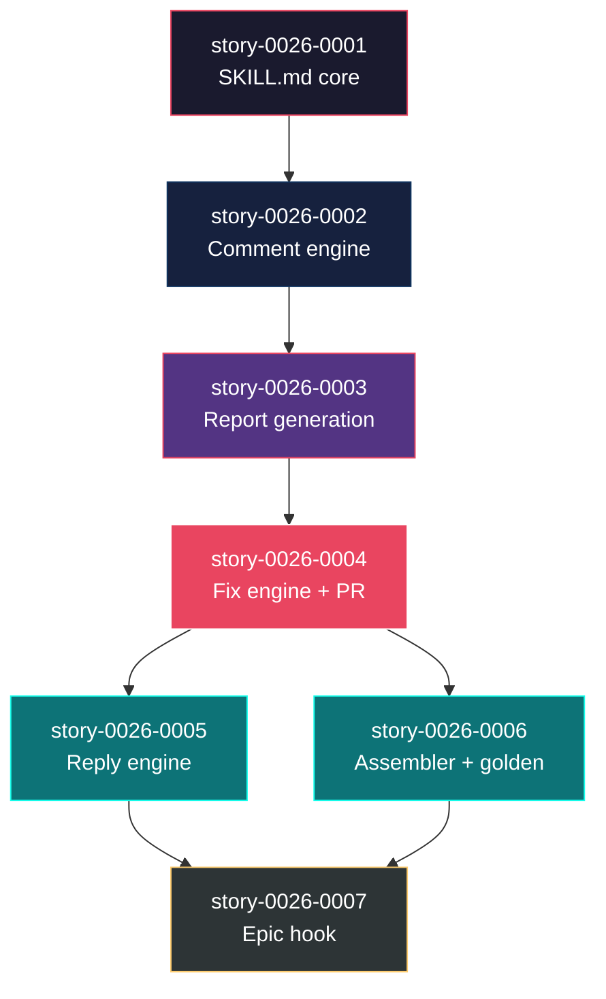

# Mapa de Implementação — Correção Automatizada de Comentários de PR por Épico (EPIC-0026)

**Gerado a partir das dependências BlockedBy/Blocks de cada história do epic-0026.**

---

## 1. Matriz de Dependências

| Story | Título | Chave Jira | Blocked By | Blocks | Status |
| :--- | :--- | :--- | :--- | :--- | :--- |
| story-0026-0001 | SKILL.md core: input parsing, prerequisitos e PR discovery | — | — | story-0026-0002 | Concluída |
| story-0026-0002 | Batch comment fetching e classificação cross-PR | — | story-0026-0001 | story-0026-0003 | Concluída |
| story-0026-0003 | Relatório consolidado de findings | — | story-0026-0002 | story-0026-0004 | Concluída |
| story-0026-0004 | Fix orchestration e criação de PR único | — | story-0026-0003 | story-0026-0005, story-0026-0006 | Concluída |
| story-0026-0005 | Reply engine e status tracking | — | story-0026-0004 | story-0026-0007 | Concluída |
| story-0026-0006 | Source template Java, assembler e golden tests | — | story-0026-0004 | story-0026-0007 | Concluída |
| story-0026-0007 | Hook no x-dev-epic-implement | — | story-0026-0005, story-0026-0006 | — | Concluída |

---

## 2. Fases de Implementação

> As histórias são agrupadas em fases. Dentro de cada fase, as histórias podem ser implementadas **em paralelo**. Uma fase só pode iniciar quando todas as dependências das fases anteriores estiverem concluídas.

```
╔══════════════════════════════════════════════════════════════╗
║          FASE 0 — Foundation: Skill Scaffold                ║
║                                                             ║
║   ┌──────────────────────────────────────────────────┐     ║
║   │  story-0026-0001                                  │     ║
║   │  SKILL.md core: input, prereqs, PR discovery      │     ║
║   └────────────────────────┬─────────────────────────┘     ║
╚════════════════════════════╪═════════════════════════════════╝
                             │
                             ▼
╔══════════════════════════════════════════════════════════════╗
║          FASE 1 — Core: Comment Engine                      ║
║                                                             ║
║   ┌──────────────────────────────────────────────────┐     ║
║   │  story-0026-0002                                  │     ║
║   │  Batch fetching + classification + dedup          │     ║
║   └────────────────────────┬─────────────────────────┘     ║
╚════════════════════════════╪═════════════════════════════════╝
                             │
                             ▼
╔══════════════════════════════════════════════════════════════╗
║          FASE 2 — Core: Report Generation                   ║
║                                                             ║
║   ┌──────────────────────────────────────────────────┐     ║
║   │  story-0026-0003                                  │     ║
║   │  Consolidated findings report + dry-run           │     ║
║   └────────────────────────┬─────────────────────────┘     ║
╚════════════════════════════╪═════════════════════════════════╝
                             │
                             ▼
╔══════════════════════════════════════════════════════════════╗
║          FASE 3 — Core: Fix Engine                          ║
║                                                             ║
║   ┌──────────────────────────────────────────────────┐     ║
║   │  story-0026-0004                                  │     ║
║   │  Fix orchestration + single PR creation           │     ║
║   └──────────┬───────────────────────┬───────────────┘     ║
╚══════════════╪═══════════════════════╪═══════════════════════╝
               │                       │
               ▼                       ▼
╔══════════════════════════════════════════════════════════════╗
║      FASE 4 — Extensions (2 paralelas)                      ║
║                                                             ║
║   ┌──────────────────────┐  ┌──────────────────────┐       ║
║   │  story-0026-0005     │  │  story-0026-0006     │       ║
║   │  Reply engine        │  │  Assembler + golden  │       ║
║   └──────────┬───────────┘  └──────────┬───────────┘       ║
╚══════════════╪══════════════════════════╪════════════════════╝
               │                          │
               └──────────┬───────────────┘
                          ▼
╔══════════════════════════════════════════════════════════════╗
║      FASE 5 — Integration: Epic Hook                        ║
║                                                             ║
║   ┌──────────────────────────────────────────────────┐     ║
║   │  story-0026-0007                                  │     ║
║   │  Hook no x-dev-epic-implement Phase 4             │     ║
║   └──────────────────────────────────────────────────┘     ║
╚══════════════════════════════════════════════════════════════╝
```

---

## 3. Caminho Crítico

> O caminho crítico (a sequência mais longa de dependências) determina o tempo mínimo de implementação do projeto.

```
story-0026-0001 ──→ story-0026-0002 ──→ story-0026-0003 ──→ story-0026-0004 ──→ story-0026-0005 ──→ story-0026-0007
   Fase 0              Fase 1              Fase 2              Fase 3              Fase 4              Fase 5
```

**6 fases no caminho crítico, 6 histórias na cadeia mais longa (0001 → 0002 → 0003 → 0004 → 0005 → 0007).**

O caminho crítico é essencialmente linear — cada fase depende da anterior. A única oportunidade de paralelismo é na Fase 4, onde story-0026-0005 (reply engine) e story-0026-0006 (assembler + golden tests) podem ser executadas simultaneamente.

---

## 4. Grafo de Dependências (Mermaid)



---

## 5. Resumo por Fase

| Fase | Histórias | Camada | Paralelismo | Pré-requisito |
| :--- | :--- | :--- | :--- | :--- |
| 0 | story-0026-0001 | Foundation (Scaffold) | 1 | — |
| 1 | story-0026-0002 | Core (Comment Engine) | 1 | Fase 0 concluída |
| 2 | story-0026-0003 | Core (Report) | 1 | Fase 1 concluída |
| 3 | story-0026-0004 | Core (Fix Engine) | 1 | Fase 2 concluída |
| 4 | story-0026-0005, story-0026-0006 | Extensions | 2 paralelas | Fase 3 concluída |
| 5 | story-0026-0007 | Integration | 1 | Fase 4 concluída |

**Total: 7 histórias em 6 fases.**

---

## 6. Observações Estratégicas

### Linearidade do Épico

O épico é predominantemente linear (fases 0-3 são sequenciais com 1 story cada). Isso é esperado para uma skill que constrói seu workflow incrementalmente — cada fase adiciona uma camada ao pipeline (discovery → fetch → report → fix → reply → distribute).

### Única Oportunidade de Paralelismo

**Fase 4** é a única com paralelismo (2 stories). story-0026-0005 (reply engine) e story-0026-0006 (assembler + golden tests) são independentes entre si — uma trabalha no GitHub API reply, outra no pipeline Java de geração. Usar worktrees paralelos para maximizar throughput.

### Bottleneck Principal

**story-0026-0004 (Fix Engine)** é a mais complexa — envolve aplicação de fixes com verificação de compilação/testes, revert granular, e criação de PR. Investir tempo extra nesta story compensa: um fix engine robusto evita retrabalho.

### Dependência Externa

A skill depende da existência de `execution-state.json` com campos `prNumber` por story. Isso é garantido pelo `x-dev-epic-implement` desde EPIC-0021. O fallback `--prs` (RULE-006) cobre casos fora do contexto de épicos.

### Validação com EPIC-0024

O EPIC-0024 com seus 16 PRs e 59 inline comments serve como caso de teste ideal. Recomenda-se usar EPIC-0024 como validação end-to-end em todas as fases.
