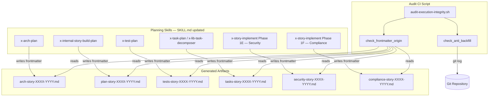
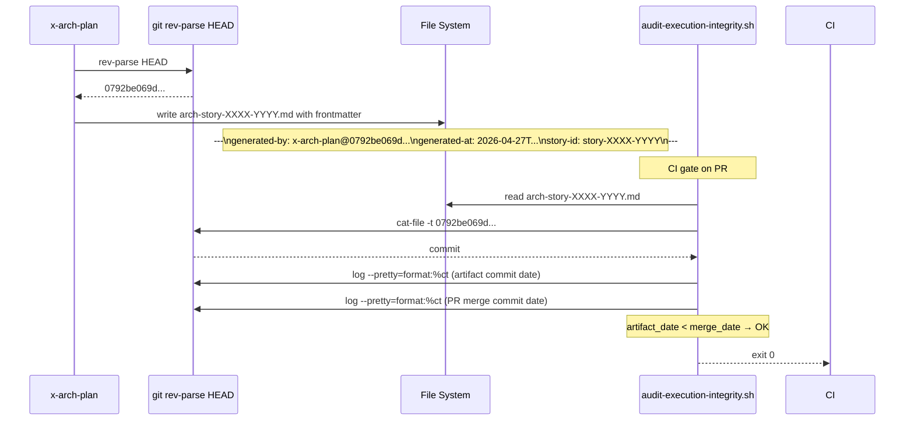

# Architecture Plan — story-0059-0002: Origin Markers in Artifacts + Anti-Backfill Audit

## Executive Summary

Story-0059-0002 introduces artifact origin markers (YAML frontmatter with `generated-by`, `generated-at`, and `story-id` fields) into all 6 Phase 1 planning skills, and extends `audit-execution-integrity.sh` with SHA authenticity validation and anti-backfill detection. The change is purely additive: existing skill SKILL.md files gain an output instruction block; the audit script gains two new check functions (`check_frontmatter_origin` and `check_anti_backfill`). No new Java classes are required — the generator copies SKILL.md files verbatim and the audit script is a Bash file already managed by `ScriptsAssembler`.

## Component Diagram



## Sequence Diagrams

### Happy Path: Skill generates artifact with valid frontmatter



### Backfill Detection Path

```mermaid
sequenceDiagram
    participant Actor as Malicious Actor
    participant FS as File System
    participant Git as Git
    participant Audit as audit-execution-integrity.sh

    Actor->>FS: POST-MERGE: add arch-story-XXXX-YYYY.md
    Actor->>Git: git commit -m "retroactive planning artifact"
    Note over Git: commit_date > merge_date

    Note over Audit: CI gate on re-run
    Audit->>FS: read arch-story-XXXX-YYYY.md
    Audit->>Git: log --pretty=format:%ct (artifact commit)
    Audit->>Git: log --pretty=format:%ct (story merge commit)
    Note over Audit: artifact_date > merge_date → BACKFILL
    Audit-->>CI: exit 1 (EIE_BACKFILL_DETECTED)
```

## Deployment Diagram

N/A - capability not enabled (no orchestrator/infrastructure deployment for CLI scripts)

## External Connections

| System | Protocol | Purpose | SLO |
| :--- | :--- | :--- | :--- |
| Git Repository | Local CLI (`git`) | SHA validation, commit timestamp comparison | < 100ms per invocation |

## Architecture Decisions

### ADR-001: Frontmatter as YAML delimited block at file top

**Status:** Accepted

**Context:**
Planning artifacts are Markdown files. We need to attach origin metadata without breaking Markdown renderers or requiring schema changes to parsers.

**Decision:**
Use standard YAML frontmatter delimited by `---` lines at the very top of the file. This is the GitHub-standard approach (Jekyll, Hugo, GitHub Docs all support it).

**Rationale:**
YAML frontmatter is parsed by existing Markdown tooling, survives `cat` + `grep` operations, and is readable by both `awk` and dedicated YAML parsers. The `---` boundary is machine-detectable in 1 line of Bash.

**Consequences:**
- Positive: Zero new dependencies; parseable by `awk`/`sed`/`python yaml.safe_load`.
- Negative: A skill that writes the file without the frontmatter block yields an invalid artifact; must update ALL 6 skill outputs.

**Story Reference:** story-0059-0002

### ADR-002: SHA captured at skill execution time via `git rev-parse HEAD`

**Status:** Accepted

**Context:**
The SHA must identify the commit at which the skill ran. This anchors the artifact to a specific point in the repository history.

**Decision:**
Each skill emits `$(git rev-parse HEAD)` inline when writing the frontmatter, not a hard-coded value.

**Rationale:**
`git rev-parse HEAD` is available in any Git-initialized directory and returns the exact commit SHA. Using `HEAD` captures the state of the repo at skill execution time, which is what we want for traceability.

**Consequences:**
- Positive: Deterministic; human-readable 40-char hex; `git cat-file -t <sha>` validates existence.
- Negative: If the skill runs in a detached HEAD state, `HEAD` still resolves to the current commit — acceptable.

**Story Reference:** story-0059-0002

### ADR-003: Anti-backfill via commit timestamp comparison

**Status:** Accepted

**Context:**
An attacker could add a planning artifact AFTER the story PR merges (as observed in EPIC-0057 commit `d460d0319`). The artifact would have a valid SHA but would be a retroactive fabrication.

**Decision:**
The audit compares `git log --pretty=format:%ct <artifact-path>` (first introduction date of the file) against the merge commit timestamp of the story PR. If the artifact was introduced after the merge, it is flagged `EIE_BACKFILL_DETECTED`.

**Rationale:**
Git's commit authorship timestamps are immutable once pushed. The merge commit of the story PR is the ground truth for "when the story was accepted". Any artifact introduced after this timestamp is retroactive backfill.

**Consequences:**
- Positive: Eliminates surface-I bypass from EPIC-0057 post-mortem.
- Negative: Requires audit to resolve the merge commit of each story PR from git log — adds ~50ms per story.

**Story Reference:** story-0059-0002

## Technology Stack

| Component | Technology | Version | Rationale |
| :--- | :--- | :--- | :--- |
| Frontmatter format | YAML | 1.2 | Standard Markdown frontmatter convention |
| SHA capture | Git CLI | ≥ 2.20 | Available in all CI environments |
| Audit script | Bash | ≥ 4.0 | Consistent with existing `audit-execution-integrity.sh` |
| Timestamp format | ISO-8601 UTC | — | Sortable, unambiguous, parseable by `date -d` |

## Non-Functional Requirements

| Metric | Target | Measurement |
| :--- | :--- | :--- |
| Audit runtime for frontmatter check | < 30s per story | `time scripts/audit-execution-integrity.sh --story-id <id>` |
| False positive rate | 0% (never reject valid artifacts) | Smoke test suite |
| False negative rate | 0% (never pass invalid/backfill artifacts) | Smoke test suite |
| Backward compatibility | 100% — grandfathered stories unaffected | `--scope=fase1` on baseline stories |

## Data Model

N/A - no database. The data model is the frontmatter schema defined in Section 5.1 of story-0059-0002.md.

## Observability Strategy

The audit script logs one line per story to stderr:
- `✅ story-XXXX-YYYY — frontmatter valid (sha=<short-sha>)` on pass
- `❌ story-XXXX-YYYY — missing generated-by frontmatter` on frontmatter absence
- `❌ story-XXXX-YYYY — SHA not found in git history: <sha>` on invalid SHA
- `❌ story-XXXX-YYYY — EIE_BACKFILL_DETECTED: artifact added after story merge` on backfill
- `⚪ story-XXXX-YYYY — audit-exempt: backfill <url>` on accepted exemption

## Resilience Strategy

- **Fail-open for `git cat-file` failures:** If `git cat-file -t <sha>` returns a non-zero exit (network/disk error), the audit logs a warning and skips the SHA check for that story (does not fail the build). This prevents transient git issues from blocking legitimate PRs.
- **Grandfathered stories:** Any story in `audits/execution-integrity-baseline.txt` skips ALL frontmatter checks. This preserves backward compatibility for pre-EPIC-0059 stories.
- **Missing frontmatter on grandfathered stories:** Treated as pass — the baseline exemption covers absence of the frontmatter block.

## Impact Analysis

**Affected files:**
- `java/src/main/resources/targets/claude/skills/core/plan/x-arch-plan/SKILL.md` — add frontmatter emission instruction
- `java/src/main/resources/targets/claude/skills/core/internal/plan/x-internal-story-build-plan/SKILL.md` — add frontmatter emission
- `java/src/main/resources/targets/claude/skills/core/test/x-test-plan/SKILL.md` — add frontmatter emission
- `java/src/main/resources/targets/claude/skills/core/plan/x-task-plan/SKILL.md` — add frontmatter emission
- `java/src/main/resources/targets/claude/skills/core/dev/x-story-implement/SKILL.md` — add frontmatter to Phase 1E/1F
- `scripts/audit-execution-integrity.sh` — add `check_frontmatter_origin` and `check_anti_backfill` functions
- `.claude/skills/x-arch-plan/SKILL.md`, `.claude/skills/x-test-plan/SKILL.md`, etc. — generated copies updated

**Migration plan:**
Pre-existing artifacts (story-0059-0001 and earlier) have no frontmatter. They are covered by the grandfathered baseline (`audits/execution-integrity-baseline.txt`). No migration of existing files needed.

**Rollback strategy:**
Revert SKILL.md changes and remove the two new audit functions. The `--scope=fase1` check reverts to presence-only (no frontmatter validation). Rollback is safe — no database migration, no schema change.
