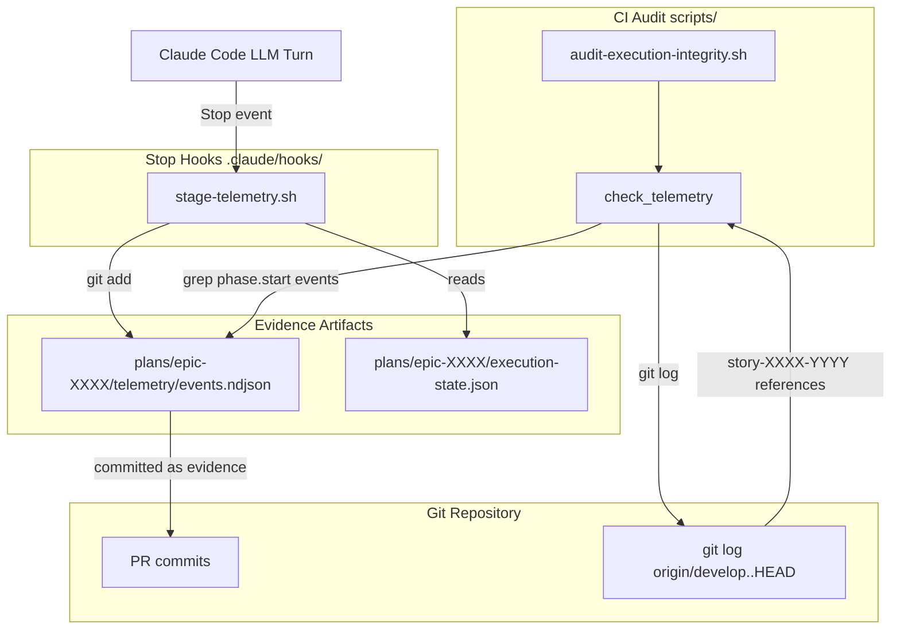
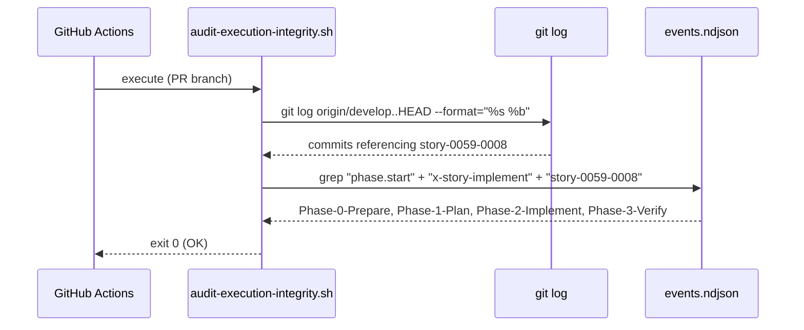
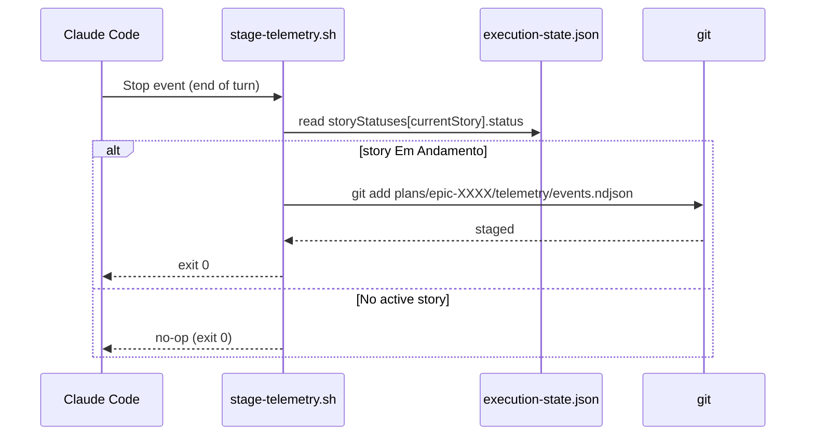
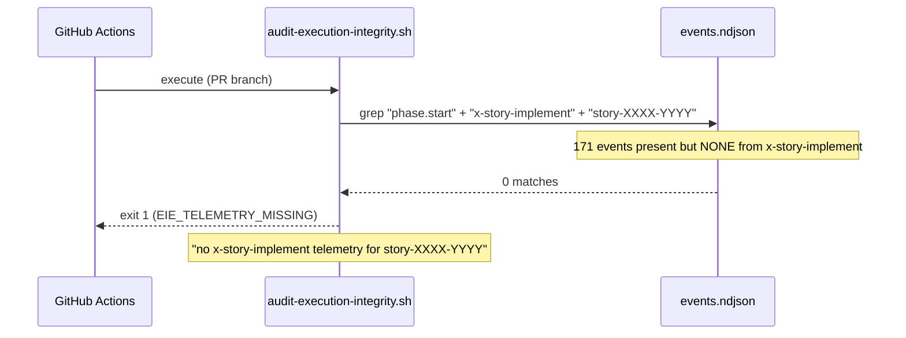

# Architecture Plan — story-0059-0008: Telemetria como Prova-de-Vida do Orquestrador

## Executive Summary

Story-0059-0008 closes bypass surfaces `A` (complete orchestrator skip) and `H` (telemetry absent for orchestrator) by promoting `plans/epic-XXXX/telemetry/events.ndjson` to a committed, auditable evidence artifact. Two changes are introduced: (1) `audit-execution-integrity.sh` is extended with a `check_telemetry()` function that validates that 4 mandatory `phase.start x-story-implement` events are present in `events.ndjson` for every `story-XXXX-YYYY` referenced in PR commits; (2) a new Stop hook `.claude/hooks/stage-telemetry.sh` ensures `events.ndjson` is git-staged at the end of each LLM turn when a story is in-progress, making the file part of the committed record. No Java code is required — both deliverables are Bash scripts.

## Component Diagram



## Sequence Diagrams

### Happy Path: Audit passes with all 4 mandatory events present



### Failure Path: Missing Phase-2-Implement event

```mermaid
sequenceDiagram
    participant CI as GitHub Actions
    participant Audit as audit-execution-integrity.sh
    participant NDJSON as events.ndjson

    CI->>Audit: execute (PR branch)
    Audit->>NDJSON: grep events for story-0059-0008
    NDJSON-->>Audit: Phase-0, Phase-1, Phase-3 found; Phase-2 absent
    Audit-->>CI: exit 1 (EIE_TELEMETRY_MISSING)
    Note over Audit: "Phase-2-Implement missing for story-0059-0008"
```

### Stop Hook: Automatic staging of events.ndjson



### EPIC-0057 Regression Scenario: Telemetry exists but no orchestrator events



## Deployment Diagram

N/A — no service deployment. Both deliverables are scripts running in the CI environment (GitHub Actions) and in the local Claude Code session (Stop hook).

## External Connections

| System | Protocol | Purpose | SLO |
| :--- | :--- | :--- | :--- |
| Git Repository | Local CLI (`git log`) | Extract story IDs from PR commits | < 500ms per PR |
| File System | `grep` / `jq` | Parse events.ndjson for mandatory events | < 200ms per story |
| `execution-state.json` | File read | Determine if story is Em Andamento (Stop hook) | < 50ms per turn |

## Architecture Decisions

### ADR-001: events.ndjson as committed evidence artifact

**Status:** Accepted

**Context:**
Before this story, `events.ndjson` was a runtime-only file — generated during execution but not committed to the repository. This meant CI could not reliably access it to verify orchestrator execution.

**Decision:**
`events.ndjson` is promoted to a committed artifact via the `stage-telemetry.sh` Stop hook. The hook adds the file to git staging at the end of each LLM turn when a story is active.

**Rationale:**
Committed files are immutable once part of a PR — they cannot be silently removed or altered without a visible git diff. This makes the telemetry record as tamper-evident as the planning artifacts protected by story-0059-0002.

**Consequences:**
- Positive: CI can grep `events.ndjson` reliably; audit is deterministic.
- Negative: Repository gains small NDJSON files per epic; acceptable given file sizes (< 100KB typical).

**Story Reference:** story-0059-0008

### ADR-002: Mandatory events defined as phase.start signals for 4 phases

**Status:** Accepted

**Context:**
`x-story-implement` emits telemetry for every numbered phase. The question is which events are mandatory versus optional.

**Decision:**
Exactly 4 `phase.start` events are mandatory: `Phase-0-Prepare`, `Phase-1-Plan` (or its PRE_PLANNED alternative), `Phase-2-Implement`, `Phase-3-Verify`. These correspond to the 4 numbered phases of `x-story-implement`.

**Rationale:**
Phase 0 (preparation) and Phase 2 (implementation) cannot be legitimately skipped — they always run. Phase 1 (plan) can be skipped when pre-planned (`PRE_PLANNED` marker). Phase 3 (verify) is the gate phase. Requiring all 4 (with the Phase 1 alternative) ensures the full orchestrator lifecycle ran.

**Consequences:**
- Positive: Eliminates both surface A (no orchestrator) and surface H (partial orchestrator) bypasses.
- Negative: An orchestrator that legitimately skips Phase 1 must emit the `[phase-1] skipped — PRE_PLANNED` marker, or it will fail the audit.

**Story Reference:** story-0059-0008

### ADR-003: STORY-ID extraction from git log commit messages

**Status:** Accepted

**Context:**
The audit must know which stories are referenced by the PR to know which `events.ndjson` files to check.

**Decision:**
Extract story IDs from commit messages via:
```bash
git log origin/develop..HEAD --format="%s %b" | grep -oP "story-\d{4}-\d{4}" | sort -u
```

**Rationale:**
Conventional Commits format (Rule 08) ensures story IDs appear in commit messages with a standardized pattern. The `grep -oP` command extracts only the pattern, preventing injection. `sort -u` deduplicates.

**Consequences:**
- Positive: Zero configuration — works for any story as long as commits follow Rule 08.
- Negative: If a commit message does not mention the story ID, the story will not be audited. This is the developer's responsibility (Conventional Commits enforcement via pre-commit hook).

**Story Reference:** story-0059-0008

## Technology Stack

| Component | Technology | Version | Rationale |
| :--- | :--- | :--- | :--- |
| Telemetry audit extension | Bash | ≥ 4.0 | Consistent with `audit-execution-integrity.sh` |
| NDJSON parsing | `grep` + `jq` (optional) | — | `grep` suffices for event field matching; `jq` used only when structured extraction needed |
| Stop hook | Bash | ≥ 4.0 | Consistent with existing `.claude/hooks/` scripts |
| Story ID extraction | `grep -oP` (PCRE) | — | Standard in CI environments (GNU grep) |
| events.ndjson staging | `git add` | ≥ 2.20 | Standard git CLI |

## Non-Functional Requirements

| Metric | Target | Measurement |
| :--- | :--- | :--- |
| Audit runtime for telemetry check | < 30s per story | `time scripts/audit-execution-integrity.sh` |
| False positive rate (valid telemetry rejected) | 0% | Smoke test AT-01 |
| False negative rate (missing telemetry accepted) | 0% | Smoke test AT-02 + EPIC-0057 regression AT-06 |
| Stop hook latency | < 200ms per turn | `time stage-telemetry.sh` |
| Backward compatibility | 100% — grandfathered stories unaffected | Baseline file checks |

## Data Model

The `events.ndjson` canonical event format (from story Section 5.1):

| Field | Type | Required | Validation | Example |
| :--- | :--- | :--- | :--- | :--- |
| `event` | String | M | `phase.start` \| `phase.end` | `"phase.start"` |
| `skill` | String | M | skill name | `"x-story-implement"` |
| `phase` | String | M | `Phase-N-Name` | `"Phase-0-Prepare"` |
| `storyId` | String | M | `story-\d{4}-\d{4}` | `"story-0059-0008"` |
| `timestamp` | String | M | ISO-8601 UTC | `"2026-04-27T14:00:00Z"` |

The mandatory event set per story (from story Section 5.2):

| Phase identifier | Alternative accepted? |
| :--- | :--- |
| `Phase-0-Prepare` | No |
| `Phase-1-Plan` | Yes: `[phase-1] skipped — PRE_PLANNED` |
| `Phase-2-Implement` | No |
| `Phase-3-Verify` | No |

## Observability Strategy

`audit-execution-integrity.sh` will log one line per story-phase check to stderr:
- `OK story-XXXX-YYYY — telemetry: all 4 phase.start events present` on pass
- `EIE_TELEMETRY_MISSING: story-XXXX-YYYY — Phase-2-Implement missing` on missing event
- `EIE_TELEMETRY_MISSING: story-XXXX-YYYY — no x-story-implement telemetry found` on complete absence
- `WARN story-XXXX-YYYY — events.ndjson not found, skipping telemetry check` when file absent + story is grandfathered

`stage-telemetry.sh` logs to stderr only on staging failure (git add non-zero exit).

## Resilience Strategy

- **Grandfathered stories:** Stories in `audits/execution-integrity-baseline.txt` skip the telemetry check. Preserves backward compatibility for pre-EPIC-0059 stories.
- **events.ndjson absent:** If the file does not exist for a non-grandfathered story, the check fails with `EIE_TELEMETRY_MISSING` — absence of evidence IS evidence of absence.
- **Stop hook failure:** If `stage-telemetry.sh` fails (git add error), it logs to stderr and exits 0 (fail-open) — hook failures must not interrupt the LLM turn.
- **execution-state.json not found:** Stop hook exits 0 with no-op — cannot determine active story, skip staging.

## Impact Analysis

**Affected files:**

- `scripts/audit-execution-integrity.sh` — add `check_telemetry()` function, integrate into main flow
- `.claude/hooks/stage-telemetry.sh` — new Stop hook script
- `.claude/settings.json` — register `stage-telemetry.sh` as Stop hook
- `java/src/main/resources/targets/claude/skills/core/dev/x-story-implement/SKILL.md` — document `events.ndjson` as committed evidence
- `CHANGELOG.md` — entry for telemetry as proof-of-life

**No changes to:**
- Java source code
- Maven build configuration
- Existing planning artifacts
- Other hook scripts (additive only)

**Migration plan:**
Pre-existing stories (story-0059-0001 through story-0059-0007 and all earlier epics) are covered by the grandfathered baseline. No retroactive telemetry required.

**Rollback strategy:**
Remove `check_telemetry()` from the audit script and deregister `stage-telemetry.sh` from `settings.json`. No database changes, no schema changes.
