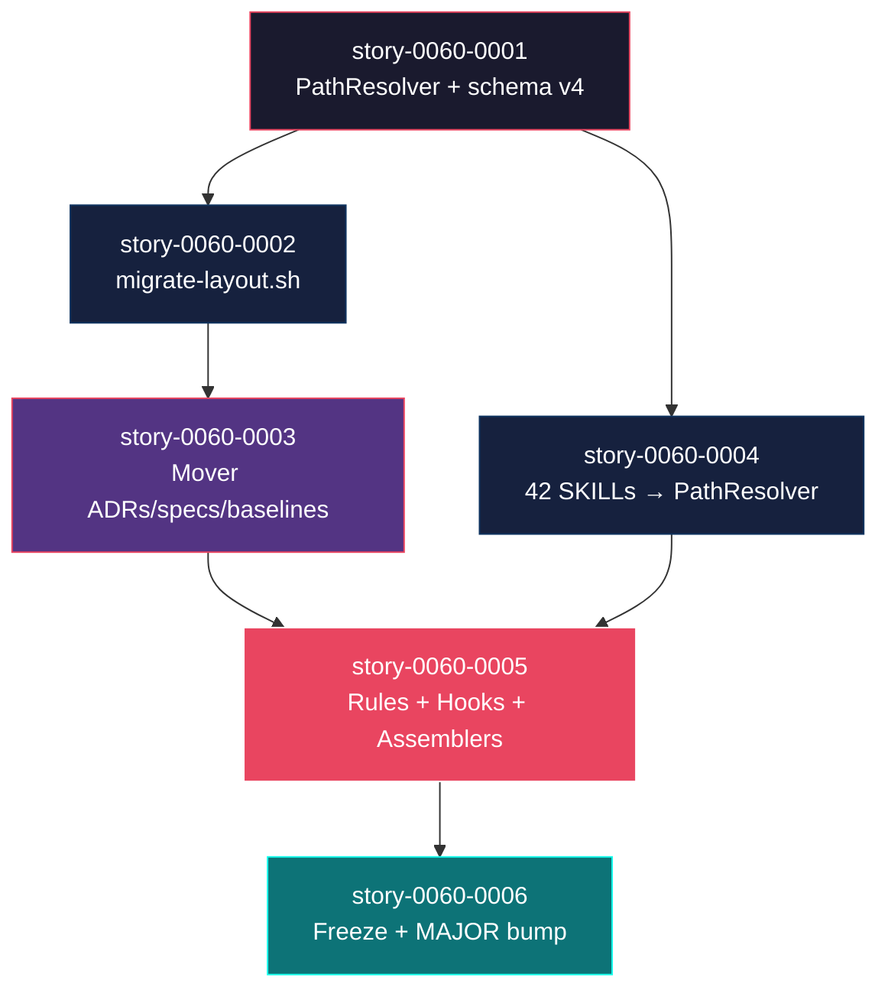
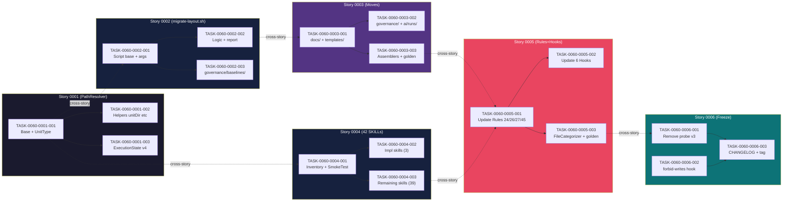

# Mapa de Implementação — EPIC-0060: Reorganização de Pastas v4

**Gerado a partir das dependências BlockedBy/Blocks de cada história do epic-0060.**

---

## 1. Matriz de Dependências

| Story | Título | Chave Jira | Blocked By | Blocks | Status |
| :--- | :--- | :--- | :--- | :--- | :--- |
| story-0060-0001 | PathResolver helper + schema v4 | — | — | story-0060-0002, story-0060-0004, story-0060-0005 | Concluída |
| story-0060-0002 | Script `migrate-layout.sh` idempotente | — | story-0060-0001 | story-0060-0003 | Concluída |
| story-0060-0003 | Mover ADRs, specs, templates, baselines, steering, contracts e results | — | story-0060-0002 | story-0060-0005 | Concluída |
| story-0060-0004 | Atualizar 42 SKILLs para usar PathResolver | — | story-0060-0001 | story-0060-0005 | Concluída |
| story-0060-0005 | Atualizar Rules, Hooks e Java Assemblers para layout v4 | — | story-0060-0003, story-0060-0004 | story-0060-0006 | Concluída |
| story-0060-0006 | Compat layer cleanup + congelamento de `plans/` | — | story-0060-0005 | — | Concluída |

> **Valores de Status:** `Pendente` (padrão) · `Em Andamento` · `Concluída` · `Falha` · `Bloqueada` · `Parcial`

> **Nota:** A dependência implícita mais crítica é story-0060-0005 ← {story-0060-0003, story-0060-0004}: ambas devem estar concluídas para que regras e hooks possam ser atualizados com segurança (os baselines físicos precisam existir em `governance/baselines/` e as skills precisam usar PathResolver antes de atualizar os hooks que verificam os artefatos). Esta convergência é o único ponto de serialização forçada no Diagrama (Fase 3 é sequencial, não paralela).

---

## 2. Fases de Implementação

> As histórias são agrupadas em fases. Dentro de cada fase, as histórias podem ser implementadas **em paralelo**. Uma fase só pode iniciar quando todas as dependências das fases anteriores estiverem concluídas.

```
╔══════════════════════════════════════════════════════════════════════════╗
║             FASE 0 — Foundation: PathResolver (serial)                 ║
║                                                                        ║
║   ┌──────────────────────────────────────────────────────────────────┐  ║
║   │  story-0060-0001  PathResolver helper + schema v4               │  ║
║   │  (Sem dependências — fundação de toda a migração)               │  ║
║   └───────────────────────────────┬──────────────────────────────────┘  ║
╚═══════════════════════════════════╪══════════════════════════════════════╝
                                    │
                           ┌────────┴────────┐
                           ▼                 ▼
╔══════════════════════════════════════════════════════════════════════════╗
║             FASE 1 — Migration + Skills (paralelo)                     ║
║                                                                        ║
║  ┌──────────────────────────────────┐  ┌───────────────────────────┐   ║
║  │  story-0060-0002                 │  │  story-0060-0004          │   ║
║  │  Script migrate-layout.sh        │  │  42 SKILLs → PathResolver │   ║
║  │  (← story-0060-0001)             │  │  (← story-0060-0001)      │   ║
║  └────────────────────┬─────────────┘  └───────────────────────────┘   ║
╚═══════════════════════╪════════════════════════════════════════════════╝
                        │
                        ▼
╔══════════════════════════════════════════════════════════════════════════╗
║             FASE 2 — Physical Moves (serial)                           ║
║                                                                        ║
║   ┌──────────────────────────────────────────────────────────────────┐  ║
║   │  story-0060-0003  Mover ADRs, specs, templates, baselines       │  ║
║   │  (← story-0060-0002 — baselines fisicamente movidos)            │  ║
║   └───────────────────────────────┬──────────────────────────────────┘  ║
╚═══════════════════════════════════╪══════════════════════════════════════╝
                                    │
                         ───────────┘  (+ story-0060-0004 concluída)
                                    ▼
╔══════════════════════════════════════════════════════════════════════════╗
║             FASE 3 — Governance Update (serial)                        ║
║                                                                        ║
║   ┌──────────────────────────────────────────────────────────────────┐  ║
║   │  story-0060-0005  Rules, Hooks e Java Assemblers                │  ║
║   │  (← story-0060-0003 AND story-0060-0004 — ambas necessárias)   │  ║
║   └───────────────────────────────┬──────────────────────────────────┘  ║
╚═══════════════════════════════════╪══════════════════════════════════════╝
                                    │
                                    ▼
╔══════════════════════════════════════════════════════════════════════════╗
║             FASE 4 — Finalization: Freeze + MAJOR bump (serial)        ║
║                                                                        ║
║   ┌──────────────────────────────────────────────────────────────────┐  ║
║   │  story-0060-0006  Compat layer cleanup + freeze plans/          │  ║
║   │  (← story-0060-0005 — 2 sprints de co-existência concluídos)   │  ║
║   └──────────────────────────────────────────────────────────────────┘  ║
╚══════════════════════════════════════════════════════════════════════════╝
```

---

## 3. Caminho Crítico

```
story-0060-0001 ──────────────────────────────────────────────────────────────┐
                                                                               │
story-0060-0001 → story-0060-0002 → story-0060-0003 ──────────────────────────┤
                                                                               ├──→ story-0060-0005 → story-0060-0006
story-0060-0001 → story-0060-0004 ─────────────────────────────────────────────┘

   Fase 0           Fase 1(A)           Fase 2         (+Fase 1B)    Fase 3        Fase 4
```

**5 fases no caminho crítico, cadeia mais longa: story-0060-0001 → story-0060-0002 → story-0060-0003 → story-0060-0005 → story-0060-0006 (5 stories sequenciais).**

Qualquer atraso em story-0060-0001 atrasa TODO o projeto. Qualquer atraso em story-0060-0003 atrasa a Fase 3 inteira independente de story-0060-0004 terminar.

---

## 4. Grafo de Dependências (Mermaid)



---

## 5. Resumo por Fase

| Fase | Histórias | Camada | Paralelismo | Pré-requisito |
| :--- | :--- | :--- | :--- | :--- |
| 0 | story-0060-0001 | Infrastructure (PathResolver) | 1 (serial) | — |
| 1 | story-0060-0002, story-0060-0004 | Infrastructure (script + skills) | 2 paralelas | Fase 0 concluída |
| 2 | story-0060-0003 | Application + Infrastructure | 1 (serial) | story-0060-0002 concluída |
| 3 | story-0060-0005 | Application + Infrastructure | 1 (serial) | story-0060-0003 AND story-0060-0004 concluídas |
| 4 | story-0060-0006 | Infrastructure | 1 (serial) | Fase 3 + 2 sprints de co-existência |

**Total: 6 histórias em 5 fases.**

> **Nota:** A Fase 1 é o único ponto de paralelismo real (stories 0002 e 0004 são independentes). A Fase 4 tem uma pré-condição temporal (2 sprints de co-existência) que não é capturável apenas em dependências de story — deve ser gerenciada pelo operador.

---

## 6. Detalhamento por Fase

### Fase 0 — Foundation: PathResolver

| Story | Escopo Principal | Artefatos Chave |
| :--- | :--- | :--- |
| story-0060-0001 | Classe PathResolver com probe v3/v4 automático. UnitType enum. Schema v4 em ExecutionState. | `PathResolver.java`, `UnitType.java`, `PathResolverTest.java` |

**Entregas da Fase 0:**

- `PathResolver.java` com 9 métodos públicos e probe automático
- `UnitType` enum com STORY, BUG, SPIKE, CHORE
- `ExecutionState.java` com `flowVersion: "4"` como padrão para epics novos
- Suite de testes com ≥ 6 cenários; 100% line coverage

### Fase 1 — Migration Script + Skills Update (paralelo)

| Story | Escopo Principal | Artefatos Chave |
| :--- | :--- | :--- |
| story-0060-0002 | Script migrate-layout.sh idempotente. Tag pre-layout-v4. Relatório de migração. | `scripts/migrate-layout.sh`, `governance/baselines/migration-report-2026.md` |
| story-0060-0004 | Substituição de 42 paths hardcoded em SKILL.md por placeholders PathResolver. Gate CI de smoke test. | ~42 SKILL.md, `SkillPathResolverSmokeTest.java` |

**Entregas da Fase 1:**

- Script de migração pronto para `--apply` em produção
- Tag `pre-layout-v4` disponível como ponto de rollback
- 42 skills sem paths hardcoded em corpo de execução
- `SkillPathResolverSmokeTest` como gate CI permanente

### Fase 2 — Physical Moves

| Story | Escopo Principal | Artefatos Chave |
| :--- | :--- | :--- |
| story-0060-0003 | git mv de 20 ADRs, 10 SPECs, 4 assemblers atualizados, baselines em governance/, templates centralizados. | `docs/adr/`, `docs/specs/`, `governance/baselines/`, `.claude/templates/{adr,spec}/`, shim `adr/README.md` |

**Entregas da Fase 2:**

- Todos os artefatos raiz no novo lar conforme mapeamento v3→v4
- 4 Java assemblers emitindo em novos paths; `mvn verify` verde
- Shim de compatibilidade de links externos por 1 release
- `plans/unknown/` removido

### Fase 3 — Governance Update

| Story | Escopo Principal | Artefatos Chave |
| :--- | :--- | :--- |
| story-0060-0005 | Rules 24/26/27/45 com paths v4. 6 hooks com PathResolver wrapper Bash. FileCategorizer atualizado. Golden fixtures. Smoke E2E. | 4 rules atualizadas, `telemetry-lib.sh` com `resolve_epic_dir()`, golden fixtures atualizadas |

**Entregas da Fase 3:**

- CI audit scripts verificam evidências em `ai/epics/` para epics v4
- Hooks de stop detectam evidência nos novos paths automaticamente
- `audit-execution-integrity.sh --self-check` exit 0
- Smoke E2E: 12 surfaces de evidência Rule 27 produzidos em v4

### Fase 4 — Finalization

| Story | Escopo Principal | Artefatos Chave |
| :--- | :--- | :--- |
| story-0060-0006 | Remoção do probe v3. Pre-commit hook de freeze. CHANGELOG MAJOR bump. Tag layout-v4-frozen. | `forbid-writes-to-legacy-plans.sh`, `CHANGELOG.md`, `pom.xml` bumped |

**Entregas da Fase 4:**

- PathResolver sem probe: v4 apenas para novos + read-only legacy
- Pre-commit hook bloqueando writes em `plans/` para arquivos novos
- CHANGELOG com `BREAKING CHANGE: layout v4` e link para migration guide
- Tag `layout-v4-frozen` como marco de finalização

---

## 7. Observações Estratégicas

### Gargalo Principal

**story-0060-0001 (PathResolver)** é o maior gargalo — bloqueia stories 0002 e 0004 em paralelo, que por sua vez bloqueiam 0003 e 0005. Qualquer atraso em 0001 atrasa todo o projeto. Investir em revisão de design (probe automático, API de métodos, UnitType enum) antes de codar elimina retrabalho de múltiplas stories dependentes.

**story-0060-0005 (Rules + Hooks)** é o segundo gargalo — converge as duas threads paralelas (0003 e 0004) antes de 0006. Se 0004 atrasar mas 0003 terminar cedo, 0005 ainda fica bloqueada.

### Histórias Folha (sem dependentes)

- **story-0060-0006** é a única folha do DAG. Pode absorver atrasos sem impacto em outras stories (não existe downstream). Tem pré-condição temporal (2 sprints) — mesmo sem atrasos técnicos, só pode iniciar após o período de observação.

### Otimização de Tempo

- **Paralelismo máximo na Fase 1:** story-0060-0002 e story-0060-0004 podem ser trabalhadas por dois desenvolvedores simultaneamente logo após story-0060-0001 ser mergeada.
- **Não há paralelismo nas Fases 2, 3 e 4** — cada fase tem exatamente 1 story.
- **Hotspot CHANGELOG.md:** Tanto story-0060-0003 quanto story-0060-0006 tocam CHANGELOG. Devem ser coordenadas para evitar conflito de merge. A Story 3 só adiciona entradas de changelog para os movimentos; a Story 6 faz o MAJOR bump.

### Dependências Cruzadas

A convergência mais crítica é **story-0060-0005 ← {story-0060-0003, story-0060-0004}**: dois ramos independentes convergem em um único ponto. O risco é que um ramo termine muito antes do outro, criando tempo ocioso para o desenvolvedor da Story 5. Mitigação: iniciar a Story 5 em `--dry-run` ou em branch experimental enquanto o ramo mais lento ainda não terminou.

### Marco de Validação Arquitetural

**story-0060-0001** é o marco arquitetural que valida o design da abstração antes de escalar. O `PathResolverTest` com probe em fixtures de temp dir é o checkpoint que confirma que o probe funciona em ambos os layouts antes de 42 skills e 6 hooks dependerem dele. Se story-0060-0001 revelar que o design do probe está errado, apenas essa story precisa ser refeita — não o conjunto inteiro.

---

## 8. Dependências entre Tasks (Cross-Story)

### 8.1 Dependências Cross-Story entre Tasks

| Task | Depends On | Story Source | Story Target | Tipo |
| :--- | :--- | :--- | :--- | :--- |
| TASK-0060-0002-001 | TASK-0060-0001-001 | story-0060-0001 | story-0060-0002 | interface (PathResolver.epicDir) |
| TASK-0060-0004-002 | TASK-0060-0001-001 | story-0060-0001 | story-0060-0004 | interface (PathResolver placeholders) |
| TASK-0060-0003-001 | TASK-0060-0002-002 | story-0060-0002 | story-0060-0003 | data (governance/baselines/ existe) |
| TASK-0060-0005-001 | TASK-0060-0003-003 | story-0060-0003 | story-0060-0005 | data (baselines físicos movidos) |
| TASK-0060-0005-001 | TASK-0060-0004-003 | story-0060-0004 | story-0060-0005 | interface (skills sem hardcoded paths) |
| TASK-0060-0006-001 | TASK-0060-0005-003 | story-0060-0005 | story-0060-0006 | schema (PathResolver sem probe em prod) |

> **Validação RULE-012:** Dependências cross-story são consistentes com dependências de histórias. Nenhuma task de story downstream depende de task de story upstream que não esteja na cadeia de dependências da história pai.

### 8.2 Ordem de Merge (Topological Sort)

| Ordem | Task ID | Story | Parallelizável Com | Fase |
| :--- | :--- | :--- | :--- | :--- |
| 1 | TASK-0060-0001-001 | story-0060-0001 | — | 0 |
| 2 | TASK-0060-0001-002 | story-0060-0001 | TASK-0060-0001-003 | 0 |
| 3 | TASK-0060-0001-003 | story-0060-0001 | TASK-0060-0001-002 | 0 |
| 4 | TASK-0060-0002-001 | story-0060-0002 | TASK-0060-0004-001 | 1 |
| 5 | TASK-0060-0004-001 | story-0060-0004 | TASK-0060-0002-001 | 1 |
| 6 | TASK-0060-0002-002 | story-0060-0002 | TASK-0060-0004-002, TASK-0060-0004-003 | 1 |
| 7 | TASK-0060-0004-002 | story-0060-0004 | TASK-0060-0002-002, TASK-0060-0004-003 | 1 |
| 8 | TASK-0060-0004-003 | story-0060-0004 | TASK-0060-0002-002, TASK-0060-0004-002 | 1 |
| 9 | TASK-0060-0002-003 | story-0060-0002 | — | 1 |
| 10 | TASK-0060-0003-001 | story-0060-0003 | — | 2 |
| 11 | TASK-0060-0003-002 | story-0060-0003 | TASK-0060-0003-003 | 2 |
| 12 | TASK-0060-0003-003 | story-0060-0003 | TASK-0060-0003-002 | 2 |
| 13 | TASK-0060-0005-001 | story-0060-0005 | — | 3 |
| 14 | TASK-0060-0005-002 | story-0060-0005 | TASK-0060-0005-003 | 3 |
| 15 | TASK-0060-0005-003 | story-0060-0005 | TASK-0060-0005-002 | 3 |
| 16 | TASK-0060-0006-001 | story-0060-0006 | TASK-0060-0006-002 | 4 |
| 17 | TASK-0060-0006-002 | story-0060-0006 | TASK-0060-0006-001 | 4 |
| 18 | TASK-0060-0006-003 | story-0060-0006 | — | 4 |

**Total: 18 tasks em 5 fases de execução.**

### 8.3 Grafo de Dependências entre Tasks (Mermaid)



---

## 8.5 Restrições de Paralelismo

> Análise de colisão de file footprint entre stories dentro das fases paralelas.

**Conflitos detectados:** 1 regen (CHANGELOG.md entre story-0060-0003 e story-0060-0006), 0 hard, 0 soft

### 8.5.1 Pares Serializados Dentro da Fase

| Fase | A | B | Categoria | Motivo |
| :--- | :--- | :--- | :--- | :--- |
| N/A (são fases diferentes) | story-0060-0003 | story-0060-0006 | regen | CHANGELOG.md: Story 3 adiciona entradas de movimentos; Story 6 faz MAJOR bump — sequencial por design de fases |

### 8.5.2 Recomendação de Reagrupamento

A única colisão (CHANGELOG.md) é entre stories em fases diferentes (2 e 4), portanto não impacta o paralelismo da Fase 1 (a única fase com 2 stories paralelas). As stories 0002 e 0004 na Fase 1 não compartilham nenhum arquivo. Paralelismo máximo disponível na Fase 1 é seguro.
