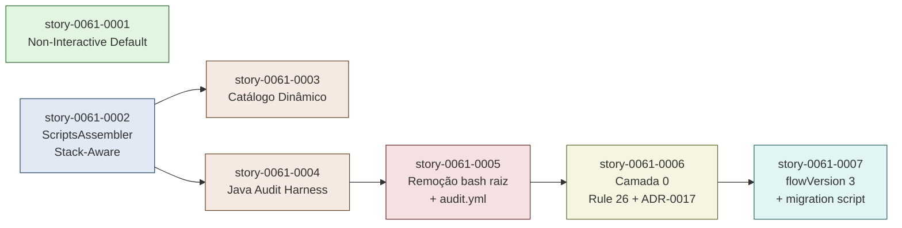

# IMPLEMENTATION MAP — EPIC-0061: Local-First Lifecycle & Stack-Aware Governance

**Epic:** EPIC-0061
**Total Stories:** 7
**Phases:** 7 (Phase 0 + Phase 1 paralelas; demais sequenciais)
**Critical Path Length:** 6 phases sequenciais

---

## 1. Dependency Matrix

| Story | Title | Blocked By | Blocks |
| :--- | :--- | :--- | :--- |
| story-0061-0001 | Non-Interactive Default + Working-Tree Guard | — | — (independente) |
| story-0061-0002 | ScriptsAssembler Stack-Aware + Templates por Stack | — | 0003, 0004 |
| story-0061-0003 | Catálogo Dinâmico + DocsAssembler | 0002 | — |
| story-0061-0004 | Java Audit Harness + Smoke Equivalência | 0002 | 0005 |
| story-0061-0005 | Migração: Remoção de `scripts/audit-*.sh` + `audit.yml` | 0004 | 0006 |
| story-0061-0006 | Camada 0 + Rule 26 Amendment + ADR-0017 | 0005 | 0007 |
| story-0061-0007 | flowVersion `"3"` + Migration Script para Legados | 0006 | — (terminal) |

---

## 2. Dependency Graph (Mermaid)



---

## 3. Phase Computation (Kahn)

| Phase | Stories | Critical? | Justificativa |
| :--- | :--- | :--- | :--- |
| **Phase 0** | story-0061-0001 | Não — paralela com Phase 1 | Toca apenas `targets/claude/rules/20-interactive-gates.md` + skills orchestradores. Footprint disjunto de Phase 1. |
| **Phase 1** | story-0061-0002 | Sim | Funda `ScriptsAssembler` stack-aware. Bloqueia 0003 e 0004. |
| **Phase 2** | story-0061-0003, story-0061-0004 | Sim — 0004 no critical path | 0003 e 0004 podem rodar em paralelo (footprints disjuntos: docs/ vs java/audit/). |
| **Phase 3** | story-0061-0005 | Sim | Remove bash raiz e workflow. Demanda 0004 (Java audit substituto) verde. |
| **Phase 4** | story-0061-0006 | Sim | Documenta nova taxonomia. Demanda 0005 já mergeada para refletir estado real. |
| **Phase 5** | story-0061-0007 | Sim | Discriminador final + migration script. Demanda 0006 publicada. |

**Wave de paralelismo possível:** Phase 0 ‖ Phase 1 (executam simultaneamente — sem colisão de footprint, ver §6 abaixo).
**Phase 2 interna:** 0003 ‖ 0004 (executam simultaneamente — sem colisão).

---

## 4. ASCII Phase Diagram

```
Sprint 1                                                  Sprint 2
─────────────────────────────────────────────────────────│──────────────────────────────
                                                         │
Phase 0 ─[S1]──────────────►                             │
                                                         │
Phase 1 ─[S2]────►                                       │
                  │                                      │
Phase 2          ─┴─►[S3]────────►                       │
                  │                                      │
                  └─►[S4]────────►                       │
                                  │                      │
Phase 3                          ─┴─►[S5]──────────►     │
                                                    │    │
Phase 4                                            ─┴─►[S6]──────────►
                                                                     │
Phase 5                                                              ├─►[S7]──►
                                                                     │
                                                                     ▼
                                                              tag: local-first-
                                                              lifecycle-frozen
```

---

## 5. Critical Path Analysis

**Critical Path:** S2 → S4 → S5 → S6 → S7
**Length:** 5 stories sequenciais (Phase 1 + Phase 2 (0004) + Phase 3 + Phase 4 + Phase 5)

**Stories paralelas ao critical path:**
- S1 (Non-Interactive) — solta em Phase 0, pode mergear a qualquer momento
- S3 (Catálogo Dinâmico) — solta em Phase 2 paralela com S4

**Bottleneck identificado:** Story 4 (Java Audit Harness). É a única story com 8 classes a implementar + smoke equivalence test. Estimativa de esforço: ~40% do épico.

**Estratégia de mitigação:** subdividir as 8 classes em 2 waves (5 markdown audits primeiro, 3 runtime audits depois), cada wave produzindo um sub-PR para o branch da story. Ver §3.2 da story-0061-0004 para detalhes.

---

## 6. File-Conflict Matrix (EPIC-0041 Parallelism Evaluation)

| Stories paralelizáveis | Status | Hotspots compartilhados? | Recomendação |
| :--- | :--- | :--- | :--- |
| S1 ‖ S2 (Phase 0 ‖ Phase 1) | Verde | Não — S1 toca `targets/claude/rules/20*` + `targets/claude/skills/x-{epic,story,release,review}-*/SKILL.md`; S2 toca `framework/src/main/java/dev/iadev/application/assembler/ScriptsAssembler.java` + `targets/claude/scripts/**` | **Paralelo OK** |
| S3 ‖ S4 (dentro de Phase 2) | Verde | Não — S3 toca `framework/src/main/java/.../DocsAssembler.java` + `shared/templates/_TEMPLATE-AUDIT-GATES-CATALOG.md`; S4 toca `framework/src/main/java/dev/iadev/audit/**` + `framework/src/test/java/dev/iadev/audit/**` | **Paralelo OK** |

**Soft conflicts em hotspots Rule 04 (parallelism heuristics):**
- `CHANGELOG.md` — apenas Story 7 escreve (Rule 19 §SemVer MINOR bump)
- `CLAUDE.md` — apenas Story 7 escreve
- `pom.xml` — não tocado por este épico
- `.gitignore` — não tocado por este épico
- Golden files (`framework/src/test/resources/golden/`) — múltiplas stories regeram, mas nunca em paralelo (S2/S3/S4 estão em fases diferentes do mesmo critical path)

**Conclusão:** **paralelismo seguro** entre S1 ‖ S2 e S3 ‖ S4. Demais transições são sequenciais por dependência lógica.

---

## 7. Phase Summary Table

| Phase | Story | Output principal | Smoke test | Tag git pós-merge |
| :--- | :--- | :--- | :--- | :--- |
| 0 | S1 | Rule 20 default flipped + `WorktreePrecheck` skill | `WorktreePrecheckTest`, `Rule20DefaultFlipSmokeIT` | — |
| 1 | S2 | `ScriptsAssembler` stack-aware + 7 diretórios de templates | `ScriptsAssemblerStackAwareTest`, `Stack{X}AuditSmokeIT` | — |
| 2 | S3 | `_TEMPLATE-AUDIT-GATES-CATALOG.md` + `DocsAssembler.renderCatalog()` | `DocsAssemblerCatalogTest` | — |
| 2 | S4 | 8× `*Auditor.java` + `AuditEquivalenceSmokeIT` | `*AuditorTest`, `AuditEquivalenceSmokeIT` | — |
| 3 | S5 | `scripts/audit-*.sh` removidos do raiz; `.github/workflows/audit.yml` deletado | `CiPipelineLeanSmokeIT` | `pre-local-first-lifecycle` (antes do apply) |
| 4 | S6 | Rule 26 com Camada 0 + ADR-0017 publicado | `Rule26CamadaZeroSmokeIT` | — |
| 5 | S7 | `flowVersion: "3"` em `ExecutionState`; `migrate-to-local-first.sh` | `FlowVersionV3MigrationSmokeIT` | `local-first-lifecycle-frozen` (após merge) |

---

## 8. Strategic Observations

1. **Custo de duplicação bash↔Java é amortizado pelo CI.** RULE-004 (Equivalência) demanda atualização sincronizada das duas implementações em todo PR. O `AuditEquivalenceSmokeIT` falha o build se uma das duas for esquecida — barreira mecânica suficiente para evitar drift.

2. **Stacks "long tail" usam `_default/`.** Se o operador gerar para uma stack que não está nos 6 suportados (java-maven, java-gradle, spring-boot, node, python, go), o `ScriptsAssembler` aplica `_default/` (apenas os 5 audits markdown — os 3 runtime audits exigem conhecimento de stack). Catálogo lista "no runtime audits configured for stack X — provide custom templates under `targets/claude/scripts/X/`".

3. **Working-tree guard fecha o loop de "agente em modo defensivo".** Operador relatou que o agente trava ao detectar branch divergente / dirty tree. Story 1 (`x-internal-worktree-precheck`) emite exit code estável (`WORKTREE_AMBIGUOUS=15`), permitindo que orchestrators dispatch para erro rápido em vez de menu interativo. Combinado com `--allow-dirty` opt-in, dá total controle ao operador.

4. **Não há janela de freeze.** Mudanças são additive (Rule 19 §additive contract): epics em flight (flowVersion `"1"` ou `"2"`) continuam funcionando inalterados. Apenas epics novos com `flowVersion: "3"` engajam o lifecycle local-first. Pode-se mergear o épico durante desenvolvimento ativo de outros épicos.

5. **CI do gerador encolhe ~38% em compute.** Antes do épico: `ci.yml` (~5min) + `audit.yml` (~3min) = ~8min runner-time. Após: apenas `ci.yml` (~5min, incluindo Java audit tests). Wall-clock por PR cai de ~5min para ~4min (eliminação de paralelo desnecessário).

6. **Reduz pontos de falha de 8 audits bash flaky para 1 job Java.** Histórico recente do `audit.yml` (verificável via `gh run list --workflow audit.yml`) mostra ~5% de PRs com falha por jq missing, gh auth expirada, ou shell escape errado. Pós-épico, esse failure rate vira zero no CI do gerador.

7. **Story 1 é o quick-win.** Standalone, pode mergear em ~2 dias. Resolve a dor mais visível do operador (sessões LLM travadas). Recomendação: priorizar S1 + S2 em paralelo no início do sprint.
