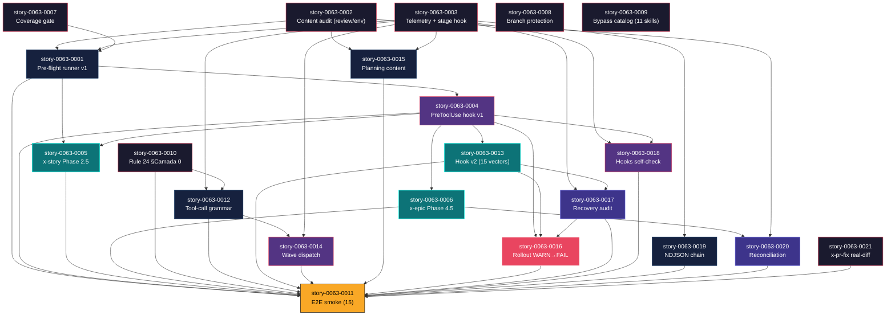

# Mapa de Implementação — EPIC-0063 Local-First Pre-Flight Gates

**Gerado a partir das dependências BlockedBy/Blocks de cada história do epic-0063 (v2 — pós-expansão de 11 → 21 stories).**

---

## 1. Matriz de Dependências

| Story | Título | Chave Jira | Blocked By | Blocks | Status |
| :--- | :--- | :--- | :--- | :--- | :--- |
| story-0063-0001 | Pre-Flight Runner Script (gates 1-12, integração incremental) | — | 0002, 0003, 0007 (para v1, gates 1-6) | 0004, 0005, 0011 | Concluída |
| story-0063-0002 | Content-Quality Audits (review + envelope) | — | — | 0001, 0015 | Concluída |
| story-0063-0003 | Telemetry-as-Evidence Audit + Stage Hook | — | — | 0001, 0012, 0014, 0015, 0017, 0018, 0019 | Concluída |
| story-0063-0004 | PreToolUse Blocking Hook (v1) | — | 0001 | 0005, 0006, 0011, 0013, 0016, 0018 | Concluída |
| story-0063-0005 | x-story-implement Phase Shift | — | 0001, 0004 | 0011 | Concluída |
| story-0063-0006 | x-epic-implement Phase 4.5 | — | 0004 | 0011, 0020 | Concluída |
| story-0063-0007 | Local Coverage Gate | — | — | 0001 | Concluída |
| story-0063-0008 | Branch Protection Automation | — | — | — | Concluída |
| story-0063-0009 | Bypass-Skill Catalog | — | — | — | Concluída |
| story-0063-0010 | Rule 24 §Camada 0 + CLAUDE.md | — | — | 0011, 0012 | Concluída |
| story-0063-0011 | E2E Smoke Test (15 cenários) | — | 0001, 0004, 0005, 0006, 0010, 0012, 0013, 0014, 0015, 0016, 0017, 0018, 0019, 0020, 0021 | — | Concluída |
| story-0063-0012 | SKILL.md Tool-Call Grammar (Rule 28) | — | 0003, 0010 | 0001 (integração gate 7), 0011, 0014 | Concluída |
| story-0063-0013 | PreToolUse Hook v2 (15 vetores) | — | 0004 | 0011, 0016, 0017 | Concluída |
| story-0063-0014 | Sub-Skill Wave Dispatch Audit | — | 0003, 0012 | 0001 (integração gate 8), 0011 | Concluída |
| story-0063-0015 | Planning-Content Audits | — | 0002, 0003 | 0001 (integração gate 9), 0011 | Concluída |
| story-0063-0016 | Rollout WARN→FAIL Execution | — | 0004, 0013, 0017 | (terminal) | Concluída |
| story-0063-0017 | Recovery-Mode Periodic Audit + Dashboard | — | 0003, 0013 | 0011, 0016 | Concluída |
| story-0063-0018 | Hooks `--self-check` Contract | — | 0003, 0004 | 0001 (integração gate 10), 0011 | Concluída |
| story-0063-0019 | NDJSON Integrity Hash Chain | — | 0003 | 0001 (integração gate 11), 0011 | Concluída |
| story-0063-0020 | Epic-Review Reconciliation | — | 0002, 0006 | 0011 | Concluída |
| story-0063-0021 | x-pr-fix Real-Diff Gate | — | — | 0011 | Concluída |

> **Valores de Status:** `Pendente` (padrão) · `Em Andamento` · `Concluída` · `Falha` · `Bloqueada` · `Parcial`

> **Nota de integração de gates em 0001:** stories 0012/0014/0015/0018/0019 cada uma tem uma TASK final "Integrate into preflight" que adiciona seu gate ao `scripts/preflight.sh`. Isso significa que **0001 ship em 2 ondas conceituais**: v1 gates 1-6 na Phase 1 (deps 0002/0003/0007), gates 7-11 integrados incrementalmente nas Phases 2-3 conforme cada audit story merge. Gate 12 (phase-gates da Rule 25) é reuso direto sem nova story. Topologicamente, o "ship" de 0001 é em Phase 1; integrações são commits aditivos em PRs das audit stories.

---

## 2. Fases de Implementação

> As histórias são agrupadas em fases. Dentro de cada fase, as histórias podem ser implementadas **em paralelo**.

```
╔═════════════════════════════════════════════════════════════════════════════════════╗
║              FASE 0 — Foundations (paralelo, 7 stories)                             ║
║                                                                                     ║
║   ┌──────┐ ┌──────┐ ┌──────┐ ┌──────┐ ┌──────┐ ┌──────┐ ┌──────┐                    ║
║   │ 0002 │ │ 0003 │ │ 0007 │ │ 0008 │ │ 0009 │ │ 0010 │ │ 0021 │                    ║
║   │ rev/ │ │ tele │ │ cov  │ │ brnh │ │ ctlg │ │ rule │ │ pr-  │                    ║
║   │ env  │ │ mtry │ │ gate │ │ prot │ │ 11sk │ │ 24/  │ │ fix  │                    ║
║   │ aud  │ │ stge │ │      │ │      │ │      │ │ md   │ │ diff │                    ║
║   └──┬───┘ └──┬───┘ └──┬───┘ └──────┘ └──────┘ └──┬───┘ └──┬───┘                    ║
╚══════╪════════╪════════╪══════════════════════════╪════════╪═════════════════════════╝
       │        │        │                          │        │
       ▼        ▼        ▼                          ▼        ▼
╔═════════════════════════════════════════════════════════════════════════════════════╗
║          FASE 1 — Core Runner v1 + Static Audits Wave A (paralelo, 4 stories)       ║
║                                                                                     ║
║   ┌────────────┐  ┌────────────┐  ┌────────────┐  ┌────────────┐                    ║
║   │   0001     │  │   0012     │  │   0015     │  │   0019     │                    ║
║   │ preflight  │  │ tool-call  │  │ planning   │  │ ndjson     │                    ║
║   │ runner v1  │  │ grammar    │  │ content    │  │ chain      │                    ║
║   │ (gates 1-6)│  │ (Rule 28)  │  │ audit      │  │            │                    ║
║   └─────┬──────┘  └─────┬──────┘  └────────────┘  └────────────┘                    ║
╚═════════╪════════════════╪═════════════════════════════════════════════════════════╝
          │                │
          ▼                ▼
╔═════════════════════════════════════════════════════════════════════════════════════╗
║       FASE 2 — Hook + Wave Audit + Hook Self-Check (paralelo, 3 stories)            ║
║                                                                                     ║
║   ┌────────────┐  ┌────────────┐  ┌────────────┐                                    ║
║   │   0004     │  │   0014     │  │   0018     │                                    ║
║   │ PreToolUse │  │ wave       │  │ hooks      │                                    ║
║   │ hook v1    │  │ dispatch   │  │ self-check │                                    ║
║   │            │  │ audit      │  │            │                                    ║
║   └─────┬──────┘  └────────────┘  └────────────┘                                    ║
╚═════════╪═════════════════════════════════════════════════════════════════════════════╝
          │
          ▼
╔═════════════════════════════════════════════════════════════════════════════════════╗
║       FASE 3 — Hook v2 + Phase Shifts (paralelo, 3 stories)                         ║
║                                                                                     ║
║   ┌────────────┐  ┌────────────┐  ┌────────────┐                                    ║
║   │   0005     │  │   0006     │  │   0013     │                                    ║
║   │ x-story-   │  │ x-epic-    │  │ hook v2    │                                    ║
║   │ implement  │  │ implement  │  │ (15        │                                    ║
║   │ Phase 2.5  │  │ Phase 4.5  │  │ vectors)   │                                    ║
║   └────────────┘  └─────┬──────┘  └─────┬──────┘                                    ║
╚════════════════════════╪═════════════════╪══════════════════════════════════════════╝
                         │                 │
                         ▼                 ▼
╔═════════════════════════════════════════════════════════════════════════════════════╗
║       FASE 4 — Recovery Audit + Epic Reconciliation (paralelo, 2 stories)           ║
║                                                                                     ║
║   ┌────────────┐  ┌────────────┐                                                    ║
║   │   0017     │  │   0020     │                                                    ║
║   │ recovery   │  │ epic-review│                                                    ║
║   │ audit +    │  │ reconcili- │                                                    ║
║   │ dashboard  │  │ ation      │                                                    ║
║   └─────┬──────┘  └────────────┘                                                    ║
╚═════════╪═════════════════════════════════════════════════════════════════════════════╝
          │
          ▼
╔═════════════════════════════════════════════════════════════════════════════════════╗
║       FASE 5 — Rollout (1 story)                                                    ║
║                                                                                     ║
║   ┌────────────┐                                                                    ║
║   │   0016     │                                                                    ║
║   │ WARN→FAIL  │                                                                    ║
║   │ rollout    │                                                                    ║
║   │ + ADR-0016 │                                                                    ║
║   └─────┬──────┘                                                                    ║
╚═════════╪═════════════════════════════════════════════════════════════════════════════╝
          │
          ▼
╔═════════════════════════════════════════════════════════════════════════════════════╗
║       FASE 6 — E2E Smoke Test (1 story, terminal)                                   ║
║                                                                                     ║
║   ┌────────────┐                                                                    ║
║   │   0011     │                                                                    ║
║   │ Epic0063   │                                                                    ║
║   │ LocalFirst │                                                                    ║
║   │ SmokeTest  │                                                                    ║
║   │ (15 cen.)  │                                                                    ║
║   └────────────┘                                                                    ║
╚═════════════════════════════════════════════════════════════════════════════════════╝
```

---

## 3. Caminho Crítico

> O caminho crítico (sequência mais longa de dependências) determina o tempo mínimo de implementação.

```
0003 → 0001 → 0004 → 0013 → 0017 → 0016 → 0011
 F0    F1     F2     F3     F4     F5     F6

   7 fases no caminho crítico, 7 histórias na cadeia mais longa.
```

Cadeias secundárias relevantes (todas convergem em 0011 / 0016):

- `0010 → 0012 → 0014 → 0011` (cobertura: grammar + wave dispatch)
- `0002 → 0015 → 0011` (cobertura: planning content)
- `0003 → 0019 → 0011` (cobertura: NDJSON chain)
- `0006 → 0020 → 0011` (cobertura: epic-review reconciliation)
- `0004 → 0018 → 0011` (cobertura: hook self-check)

A cadeia primária (`0003 → 0001 → 0004 → 0013 → 0017 → 0016 → 0011`) é o limite — atrasos em qualquer story dela atrasam o épico inteiro. **Foco operacional:** priorizar revisão de 0001 (gargalo central, integração de 12 gates) e de 0004 (checkpoint arquitetural — hook v1 funcional viabiliza fases 3-5).

---

## 4. Grafo de Dependências (Mermaid)



---

## 5. Resumo por Fase

| Fase | Histórias | Camada | Paralelismo | Pré-requisito |
| :--- | :--- | :--- | :--- | :--- |
| 0 | 0002, 0003, 0007, 0008, 0009, 0010, 0021 | Foundation (audits + docs + rules + pr-fix) | 7 paralelas | — |
| 1 | 0001, 0012, 0015, 0019 | Core runner v1 + static audits wave A | 4 paralelas | Fase 0 (parcial: 0002/0003/0007/0010) |
| 2 | 0004, 0014, 0018 | Hook v1 + dependent audits | 3 paralelas | Fase 1 |
| 3 | 0005, 0006, 0013 | Phase shifts + hook v2 | 3 paralelas | Fase 2 |
| 4 | 0017, 0020 | Recovery audit + reconciliation | 2 paralelas | Fase 3 |
| 5 | 0016 | Rollout governance | 1 | Fase 4 |
| 6 | 0011 | Validation E2E | 1 | Fases 1-5 (todas) |

**Total: 21 histórias em 7 fases.**

> **Nota sobre paralelismo:** Fase 0 tem o paralelismo máximo (7 stories independentes). Fases 1, 2, 3 têm 3-4 paralelas cada. Fases 5 e 6 são strict-sequential (1 story cada).

---

## 6. Detalhamento por Fase

### Fase 0 — Foundations (7 stories)

| Story | Escopo Principal | Artefatos Chave |
| :--- | :--- | :--- |
| story-0063-0002 | Content audits (review + envelope) | `audit-review-content.sh`, `audit-verify-envelope.sh`, `review-content-baseline.txt` |
| story-0063-0003 | Telemetry + stage hook | `stage-telemetry.sh`, `audit-execution-integrity.sh --scope=telemetry` |
| story-0063-0007 | Coverage gate | `audit-coverage-local.sh` |
| story-0063-0008 | Branch protection | `setup-branch-protection.sh --apply-strict`, `docs/branch-protection.md` |
| story-0063-0009 | Bypass catalog | `docs/audit-bypass-catalog.md`, `AuditBypassCatalogTest` |
| story-0063-0010 | Rule 24 §Camada 0 | `.claude/rules/24-execution-integrity.md`, `CLAUDE.md` |
| story-0063-0021 | x-pr-fix real-diff | `audit-pr-fix-diff.sh`, template extensions |

### Fase 1 — Core Runner v1 + Static Audits Wave A (4 stories)

| Story | Escopo Principal | Artefatos Chave |
| :--- | :--- | :--- |
| story-0063-0001 | Pre-flight runner v1 (gates 1-6) | `scripts/preflight.sh` |
| story-0063-0012 | Tool-call grammar (Rule 28) | `audit-tool-call-grammar.sh`, Rule 28, markers em 8 orquestradores |
| story-0063-0015 | Planning content audit (6 artefatos) | `audit-planning-content.sh` |
| story-0063-0019 | NDJSON hash chain | `telemetry-emit.sh` extends, `audit-execution-integrity.sh --check-chain` |

### Fase 2 — Hook + Wave Audit + Hooks Self-Check (3 stories)

| Story | Escopo Principal | Artefatos Chave |
| :--- | :--- | :--- |
| story-0063-0004 | PreToolUse hook v1 | `enforce-preflight-gates.sh` (v1 matchers) |
| story-0063-0014 | Wave dispatch audit | `audit-wave-dispatch.sh`, Rule 13 §Wave Convention |
| story-0063-0018 | Hooks `--self-check` | `verify-hooks-integrity.sh`, Rule 26 §Hooks Self-Check |

### Fase 3 — Phase Shifts + Hook v2 (3 stories)

| Story | Escopo Principal | Artefatos Chave |
| :--- | :--- | :--- |
| story-0063-0005 | x-story-implement Phase 2.5 | SKILL.md modified |
| story-0063-0006 | x-epic-implement Phase 4.5 | SKILL.md modified |
| story-0063-0013 | PreToolUse hook v2 (15 vetores) | matchers v2, `docs/preflight-bypass-vectors.md` |

### Fase 4 — Recovery Audit + Epic Reconciliation (2 stories)

| Story | Escopo Principal | Artefatos Chave |
| :--- | :--- | :--- |
| story-0063-0017 | Recovery audit + dashboard | `audit-recovery-mode.sh`, `recovery-mode-dashboard.md`, nightly cron |
| story-0063-0020 | Epic-review reconciliation | `audit-review-reconciliation.sh`, template extensions |

### Fase 5 — Rollout (1 story)

| Story | Escopo Principal | Artefatos Chave |
| :--- | :--- | :--- |
| story-0063-0016 | WARN→FAIL rollout | `CLAUDE_PREFLIGHT_PHASE` toggle, `audit-rollout-readiness.sh`, ADR-0016 |

### Fase 6 — Validation (1 story, terminal)

| Story | Escopo Principal | Artefatos Chave |
| :--- | :--- | :--- |
| story-0063-0011 | E2E smoke (15 cenários) | `Epic0063LocalFirstSmokeTest.java`, sandbox fixtures |

---

## 7. Observações Estratégicas

### Gargalo Principal

**story-0063-0001 (Pre-Flight Runner)** continua sendo o gargalo conceitual: integra 12 gates. O ship "v1" (gates 1-6) ocorre em Fase 1, mas as integrações de gates 7-11 são commits aditivos durante Fases 2-3 (cada audit story tem TASK final de wire-up). Investir em qualidade de 0001 (testes shell robustos, mensagens de erro claras, ordering fail-fast) compensa porque downstream depende.

**story-0063-0004 (PreToolUse hook v1)** é o checkpoint arquitetural crítico — após sua conclusão, todo o stack de bloqueio físico está operacional. Stories 0005, 0006, 0013, 0016, 0017, 0018 dependem direta ou indiretamente. Calibrar e estabilizar o hook em Fase 2 é vital.

### Histórias Folha (sem dependentes)

- story-0063-0008 (branch protection) — pode ser feita a qualquer momento durante Fase 0-5
- story-0063-0009 (catalog) — totalmente independente
- story-0063-0016 (rollout) — última a entrar; só bloqueia via 0011

### Otimização de Tempo

- **Paralelismo máximo Fase 0:** 7 stories simultâneas (0002, 0003, 0007, 0008, 0009, 0010, 0021)
- **Stories que podem começar imediatamente:** todas as 7 da Fase 0 — nenhum blocker entre elas
- **Alocação de equipe ideal:** 7 devs paralelos em Fase 0 → 4 em Fase 1 → 3 em Fase 2 → 3 em Fase 3 → 2 em Fase 4 → 1 em Fase 5 → 1 em Fase 6
- **Tempo mínimo (paralelismo total):** 7 fases × tempo médio. Story média ~1-2 dias de implementação + review → epic ~12-18 dias com paralelismo, ~25-35 dias sequencial

### Dependências Cruzadas

- **story-0063-0011 (E2E test) depende de TODAS as outras 20 stories** — é o ponto de convergência maior. Concentrar revisão crítica e cuidado de calibração aqui.
- story-0063-0017 (recovery audit) é input de **0016 (rollout readiness)** — tendo o dataset, 0016 sabe se é seguro virar FAIL.
- story-0063-0019 (NDJSON chain) ROBUSTECE story-0063-0012 (grammar audit dynamic check) — chain garante que telemetria não foi forjada antes do cross-check.

### Marcos de Validação Arquitetural

1. **Após Fase 1:** preflight v1 funcional + 4 audits estáticos disponíveis. Operadores já podem invocar `preflight.sh` manualmente.
2. **Após Fase 2:** hook v1 + auditoria de hooks. PreToolUse intercepta entrypoints externos. Hooks têm self-check.
3. **Após Fase 3:** reviews/verify pré-PR + 15 vetores de bypass cobertos. PR é "publicação validada".
4. **Após Fase 4:** evidência semanal/mensal disponível via dashboard. Findings de stories rastreáveis em epic-review.
5. **Após Fase 5:** rollout governance ativo — operadores têm caminho explícito WARN→FAIL.
6. **Após Fase 6:** validação E2E completa. Epic pode ser mergeado para develop.

---

## 8. Dependências entre Tasks (Cross-Story)

### 8.1 Dependências Cross-Story Críticas (interface-level)

| Task | Depends On | Story Source | Story Target | Tipo |
| :--- | :--- | :--- | :--- | :--- |
| TASK-0063-0001-002 | TASK-0063-0002-003 | 0001 | 0002 | interface (preflight invoca audit-review-content) |
| TASK-0063-0001-002 | TASK-0063-0003-002 | 0001 | 0003 | interface (preflight invoca telemetry audit) |
| TASK-0063-0001-002 | TASK-0063-0007-001 | 0001 | 0007 | interface (preflight invoca coverage audit) |
| TASK-0063-0001-005 | TASK-0063-0012-005 | 0012 | 0001 | integração (gate 7 wired no preflight) |
| TASK-0063-0001-005 | TASK-0063-0014-003 | 0014 | 0001 | integração (gate 8) |
| TASK-0063-0001-005 | TASK-0063-0015-004 | 0015 | 0001 | integração (gate 9) |
| TASK-0063-0001-005 | TASK-0063-0018-004 | 0018 | 0001 | integração (gate 10) |
| TASK-0063-0001-005 | TASK-0063-0019-003 | 0019 | 0001 | integração (gate 11) |
| TASK-0063-0004-005 | TASK-0063-0001-004 | 0004 | 0001 | interface (hook invoca preflight) |
| TASK-0063-0006-* | TASK-0063-0020-002 | 0006 | 0020 | interface (Phase 4.5 step 4 invoca audit-review-reconciliation) |
| TASK-0063-0011-002 | TASK-* | 0011 | (todas) | integration (smoke exercita tudo) |

> **Validação RULE-012:** Todas dependências cross-story são interface-level (one script invokes another) ou integration-level (smoke test exercises composition). Nenhuma duplicação de schema ou data. PASS.

### 8.2 Ordem de Merge (Topological Sort, resumido)

| Ordem | Story | Fase | Notas |
| :--- | :--- | :--- | :--- |
| 1-7 | 0002, 0003, 0007, 0008, 0009, 0010, 0021 | F0 | Paralelas |
| 8-11 | 0001, 0012, 0015, 0019 | F1 | Paralelas (deps F0) |
| 12-14 | 0004, 0014, 0018 | F2 | Paralelas (deps F1) |
| 15-17 | 0005, 0006, 0013 | F3 | Paralelas (deps F2) |
| 18-19 | 0017, 0020 | F4 | Paralelas (deps F3) |
| 20 | 0016 | F5 | Sequencial |
| 21 | 0011 | F6 | Terminal |

---

## 8.5 Restrições de Paralelismo

> Análise gerada por /x-parallel-eval — extensão da v1 para 21 stories.

**Conflitos detectados:** 4 hard, 2 regen, 4 soft

### 8.5.1 Pares Serializados Dentro / Entre Fases

| Fase | A | B | Categoria | Motivo |
| :--- | :--- | :--- | :--- | :--- |
| 0 / 1 | 0003 | 0019 | hard | `.claude/hooks/telemetry-emit.sh` + `telemetry-lib.sh` write conflict — 0003 introduz hook, 0019 estende com hash chain |
| 0 / 2 | 0003 | 0004, 0018 | hard | `.claude/settings.json` write conflict — 0003 registra Stop hook, 0004 registra PreToolUse hook, 0018 modifica registros para self-check |
| 1 / 2 | 0012 | 0014 | hard | Ambas modificam SKILL.md de orquestradores Anexo B — 0012 aplica markers, 0014 aplica wave markers; rebase obrigatório |
| 1 / 2 | 0019 | 0018 | hard | Ambas modificam `.claude/hooks/stage-telemetry.sh` — 0019 popula hash chain, 0018 adiciona `--self-check`. Rebase obrigatório |
| 1 / 2 / 3 | 0001 | 0012, 0014, 0015, 0018, 0019 | regen | Cada audit story toca `scripts/preflight.sh` (gate integration). Sequencial garante diff limpo |
| 0 / 1 / 2 | 0010 | 0012 | regen | 0010 publica Rule 24 §Camada 0; 0012 publica Rule 28; ambas tocam `.claude/rules/`. Sequencial OK (paths diferentes) |
| 3 | 0005 | 0006 | soft | Ambas tocam SKILL.md de orquestradores em paths diferentes; tooling de regeneração compartilhado |
| 3 | 0006 | 0013 | soft | Ambas modificam x-epic-implement / hook respectively; integração feita via PR sequencial |
| 4 | 0017 | 0020 | soft | Não conflitam diretamente; ambos produzem reports/dashboards distintos |
| 0 | 0008 | 0009 | soft | Ambas docs only; sem path overlap |

### 8.5.2 Recomendação de Reagrupamento

- **Hard conflicts (4):**
  1. **0003 ↔ 0019** (telemetry-emit.sh): 0019 deve **rebase em cima de 0003**. Phase ordering (0003 em F0, 0019 em F1) já garante.
  2. **0003 ↔ 0004 ↔ 0018** (settings.json): merge order **0003 → 0004 → 0018**. Cada uma rebase em cima da anterior. Phase ordering (F0 → F2 → F2) garante.
  3. **0012 ↔ 0014** (SKILL.md markers): 0012 primeiro, 0014 rebase em cima.
  4. **0019 ↔ 0018** (stage-telemetry.sh): 0018 rebase em cima de 0019.

- **Regen conflicts (2):** sequenciais já pelo phase ordering. preflight.sh recebe integrações em ordem natural F1 → F2 → F3.

- **Soft conflicts (4):** podem rodar paralelos; tooling de regeneração precisa rodar uma vez ao final de cada fase.

> **Hotspot crítico:** `scripts/preflight.sh` é tocado por 6 stories diferentes (0001, 0012, 0014, 0015, 0018, 0019). Mitigação: integração feita via task final de cada audit story com PR pequena/focada de wire-up apenas; teste smoke em cada PR valida que o gate integrado não quebrou os anteriores.

> **Hotspot secundário:** `.claude/settings.json` é tocado por 0003, 0004, 0018. Use o `SettingsAssembler` (RULE-004 EPIC-0041) para garantir merge consistente; rebase obrigatório.

> **Hotspot terciário:** `.claude/hooks/stage-telemetry.sh` é tocado por 0003 (criação), 0019 (hash chain), 0018 (self-check). Order: 0003 → 0019 → 0018. Ordering natural já garantida.
