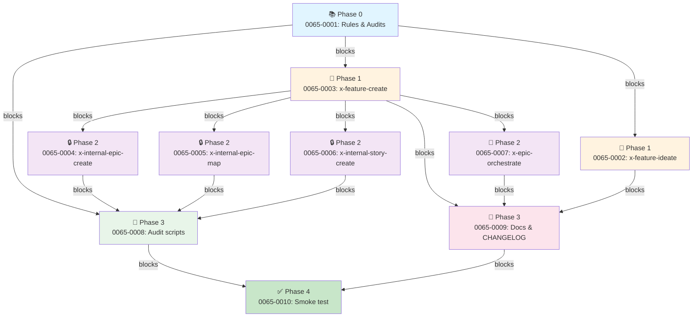

# EPIC-0065 — Implementation Map

> **Epic:** EPIC-0065 — Feature Creation Chain Refactor  
> **Base:** develop (pós-EPIC-0062)  
> **Gerado em:** 2026-04-28

---

## 1. Matriz de Dependências

| Story | Título | Layer | Fase | Bloqueadores | Bloqueia | Status |
|-------|--------|-------|------|--------------|----------|--------|
| **0065-0001** | Rules & Audits | 0 | 0 | — | 0002, 0003, 0008 | Pendente |
| **0065-0002** | x-feature-ideate | 1 | 1 | 0001 | 0009 | Pendente |
| **0065-0003** | x-feature-create rename | 1 | 1 | 0001 | 0004, 0005, 0006, 0007, 0008, 0009 | Pendente |
| **0065-0004** | x-internal-epic-create | 2 | 2 | 0003 | 0008 | Pendente |
| **0065-0005** | x-internal-epic-map | 2 | 2 | 0003 | 0008 | Pendente |
| **0065-0006** | x-internal-story-create | 2 | 2 | 0003 | 0008 | Pendente |
| **0065-0007** | x-epic-orchestrate update | 3 | 2 | 0003 | 0009 | Pendente |
| **0065-0008** | Audit scripts | 3 | 3 | 0001, 0004, 0005, 0006 | 0010 | Pendente |
| **0065-0009** | Templates & docs | 4 | 3 | 0002, 0003, 0007 | 0010 | Pendente |
| **0065-0010** | Smoke test E2E | 5 | 4 | 0001..0009 | — | Pendente |

---

## 2. Diagrama de Fases (ASCII Box Drawing)

```
┌─────────────────────────────────────────────────────────────────┐
│                        PHASE 0 (Foundation)                    │
│  ┌──────────────────┐                                           │
│  │  0065-0001       │                                           │
│  │  Rules & Audits  │                                           │
│  │  (Layer 0)       │                                           │
│  └──────────────────┘                                           │
└─────────────────────────────────────────────────────────────────┘
              ↓ (blockers: 0002, 0003, 0008)

┌─────────────────────────────────────────────────────────────────┐
│                    PHASE 1 (Core Skills)                        │
│  ┌──────────────────┐         ┌──────────────────────────┐     │
│  │  0065-0002       │         │  0065-0003               │     │
│  │  x-feature-      │         │  x-epic-decompose →      │     │
│  │  ideate (Layer 1)│         │  x-feature-create rename │     │
│  │                  │         │  (Layer 1)               │     │
│  └──────────────────┘         └──────────────────────────┘     │
│  (blocks: 0009)               (blocks: 0004-0009)              │
└─────────────────────────────────────────────────────────────────┘
              ↓ (0003 gates 4-9)

┌─────────────────────────────────────────────────────────────────┐
│                   PHASE 2 (Sub-skills & Clarify)                │
│  ┌──────────────┐  ┌──────────────┐  ┌──────────────┐  ┌──────┐
│  │ 0065-0004    │  │ 0065-0005    │  │ 0065-0006    │  │0065- │
│  │ x-internal-  │  │ x-internal-  │  │ x-internal-  │  │0007  │
│  │ epic-create  │  │ epic-map     │  │ story-create │  │x-epic│
│  │ (Layer 2)    │  │ (Layer 2)    │  │ (Layer 2)    │  │orch. │
│  │              │  │              │  │              │  │update│
│  └──────────────┘  └──────────────┘  └──────────────┘  └──────┘
│  (blocks: 0008)    (blocks: 0008)    (blocks: 0008)    (blocks:
│                                                         0009)
└─────────────────────────────────────────────────────────────────┘
   ↓ (0004-0006 gate 0008; 0007 gates 0009)

┌─────────────────────────────────────────────────────────────────┐
│                  PHASE 3 (Docs & Audits)                        │
│  ┌────────────────────┐         ┌───────────────────┐          │
│  │   0065-0008        │         │   0065-0009       │          │
│  │ Audit scripts &    │         │ Templates &       │          │
│  │ cleanup branches   │         │ CHANGELOG & README│          │
│  │  (Layer 3)         │         │   (Layer 4)       │          │
│  │ blocks: 0010       │         │  blocks: 0010     │          │
│  └────────────────────┘         └───────────────────┘          │
│  (parallelizable)               (parallelizable)               │
└─────────────────────────────────────────────────────────────────┘
            ↓ (0008 + 0009 gate 0010)

┌─────────────────────────────────────────────────────────────────┐
│                    PHASE 4 (Verification)                       │
│  ┌──────────────────────────────┐                              │
│  │  0065-0010                   │                              │
│  │  Smoke test E2E              │                              │
│  │  (Layer 5)                   │                              │
│  │  blocks: NONE (terminal)     │                              │
│  └──────────────────────────────┘                              │
└─────────────────────────────────────────────────────────────────┘
```

---

## 3. Caminho Crítico

**Cadeia mais longa:** 0001 → 0003 → (0004|0005|0006) → 0008 → 0010

**Comprimento:** 5 fases (Phase 0, 1, 2, 3, 4)

**Histórias no caminho crítico:**
1. Phase 0: story-0065-0001 (Rules & Audits)
2. Phase 1: story-0065-0003 (x-feature-create rename)
3. Phase 2: story-0065-0004/0005/0006 (Sub-skills, qualquer uma, paralellizáveis)
4. Phase 3: story-0065-0008 (Audit scripts)
5. Phase 4: story-0065-0010 (Smoke test)

**Tempo mínimo:** Depende da duração real de cada story (1-3 sprints cada).

---

## 4. Grafo de Dependências (Mermaid)



---

## 5. Resumo de Fases

| Fase | Histórias | Parallelizáveis? | Duração Estimada | Caminho Crítico? |
|------|-----------|------------------|-------------------|-----------------|
| **0** | 0001 | — | 1-2 sprints | ✓ SIM |
| **1** | 0002, 0003 | Sim (2 paralelas) | 2-3 sprints | ✓ SIM (0003) |
| **2** | 0004, 0005, 0006, 0007 | Sim (4 paralelas) | 2-3 sprints | ✓ SIM (0004-0006) |
| **3** | 0008, 0009 | Sim (2 paralelas) | 1-2 sprints | ✓ SIM (0008) |
| **4** | 0010 | — | 1 sprint | ✓ SIM |

**Paralelismo máximo:** Phase 2 com até 4 stories simultâneas  
**Risco:** Nenhum (paralelismo bem-definido via DAG)

---

## 6. Observações Estratégicas

### Gargalo Principal
**Phase 2 (story-0065-0008: Audit scripts)** é o gargalo porque:
- Depende de 4 stories completarem (0001, 0004, 0005, 0006)
- Bloqueia Phase 4 (smoke test)
- Sem isso, CI falha com false positives

**Mitigação:** Executar 0004-0006 em paralelo; 0008 começa tão logo 0001 complete.

### Folhas (Stories sem dependentes além de 0010)
- story-0065-0002 (x-feature-ideate) → somente 0009 depende
- Pode ser implementado em paralelo sem impacto crítico

### Convergências
- Phase 2 → Phase 3: todos os sub-skills (0004-0006) convergem em 0008
- Phase 3 → Phase 4: 0008 + 0009 convergem em 0010 (teste final)

### Validação Milestone
**story-0065-0010 (Smoke test E2E)** é o único validador fim-a-fim. Sucesso aqui = epic completo.

---

## 7. Plano de Risco & Contigência

| Risco | Probabilidade | Impacto | Mitigação |
|-------|--------------|--------|-----------|
| Hard-cut quebra CI (0001 falha) | Média | **Crítico** | STORY-0001 roda audits antes de 0003-0006 |
| Worktree-by-orchestrator em re-entrancy | Baixa | Médio | Testar Rule 14 §3 early (em 0002) |
| Specs de audit divergem entre stories | Baixa | Médio | Smoke test 0010 apanha divergência |
| Paralelismo em Phase 2 exaure CI | Muito baixa | Baixo | CI já escalável (EPIC-0041) |

---

## 8. Entrega e Validação

**DoD Global (antes de PR final epic/0065 → develop):**
- ✓ 10 stories completadas
- ✓ Todos os audits verdes (audit-skill-visibility, audit-epic-branches, etc.)
- ✓ `mvn verify` verde (Epic0065SmokeTest pass)
- ✓ 4 PRs `docs/0065-*` mergeados em `epic/0065`
- ✓ CHANGELOG entry com hard-cuts documentados
- ✓ `.claude/skills/` regenerado; diff somente em skills da epic

---

## Próximos Passos

1. Aprovar este IMPLEMENTATION-MAP
2. Executar stories em ordem de fase (respeitando DAG)
3. Por cada story completa, validar audits + testes
4. Executar story-0065-0010 (smoke test) uma vez que todas as 9 anteriores completarem
5. Criar PR final: epic/0065 → develop com consolidado de mudanças
