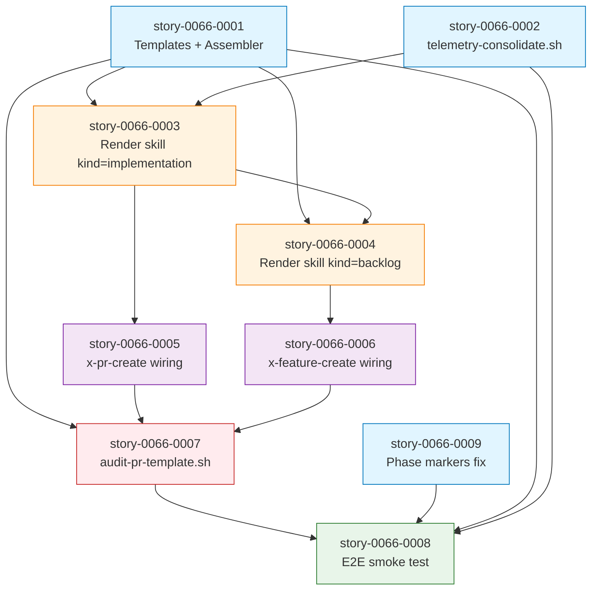

# IMPLEMENTATION-MAP — EPIC-0066 (PR Body Templates & Telemetry-Aware Review Visibility)

**Epic:** EPIC-0066
**Slug:** `pr-body-templates`
**flowVersion:** `4`
**Generated:** 2026-04-28
**Stories:** 9
**Phases:** 4
**Critical path length:** 5 stories (0001 → 0003 → 0005 → 0007 → 0008)
**Maximum parallelism:** 3 stories (Phase 0)

---

## 1. Phase Computation

| Phase | Stories | Notes |
| :--- | :--- | :--- |
| **Phase 0 — Foundation (parallel ×3)** | 0066-0001, 0066-0002, 0066-0009 | All foundational; no inter-dependencies among themselves |
| **Phase 1 — Core (sequential ×2)** | 0066-0003 → 0066-0004 | 0004 modifies same SKILL.md as 0003 — sequential |
| **Phase 2 — Integration (parallel ×2)** | 0066-0005, 0066-0006 | Different SKILL.md files — parallel-safe |
| **Phase 3 — Audit + Verify (sequential ×2)** | 0066-0007 → 0066-0008 | 0008 smoke test depends on 0007 audit existing |

---

## 2. Dependency Matrix

| Story | Blocked by | Blocks |
| :--- | :--- | :--- |
| 0066-0001 | (none — Phase 0 root) | 0066-0003, 0066-0004, 0066-0007, 0066-0008 |
| 0066-0002 | (none — Phase 0 root) | 0066-0003, 0066-0008 |
| 0066-0009 | (none — Phase 0 root) | 0066-0008 |
| 0066-0003 | 0066-0001, 0066-0002 | 0066-0004, 0066-0005, 0066-0008 |
| 0066-0004 | 0066-0003 | 0066-0006, 0066-0008 |
| 0066-0005 | 0066-0003 | 0066-0007, 0066-0008 |
| 0066-0006 | 0066-0004 (+ EPIC-0065 merged) | 0066-0007, 0066-0008 |
| 0066-0007 | 0066-0001, 0066-0005, 0066-0006 | 0066-0008 |
| 0066-0008 | 0066-0001..0066-0007, 0066-0009 | (terminal — verify gate) |

---

## 3. Critical Path

```
0066-0001 ──→ 0066-0003 ──→ 0066-0005 ──→ 0066-0007 ──→ 0066-0008
(Foundation)  (Core)         (Integration) (Audit)       (Verify)
```

**Length:** 5 stories.
**Estimated duration:** ~6h LLM time on critical path; ~9h total epic effort with parallelism in Phase 0 and Phase 2.

---

## 4. ASCII Phase Diagram

```
═══════════════════════════════════════════════════════════════════════════════
PHASE 0 — Foundation (parallel ×3)
═══════════════════════════════════════════════════════════════════════════════
  ┌──────────────────┐  ┌──────────────────┐  ┌──────────────────┐
  │  story-0066-0001 │  │  story-0066-0002 │  │  story-0066-0009 │
  │   Templates +    │  │  Telemetry       │  │  Phase markers   │
  │   Assembler      │  │  consolidator    │  │  fix             │
  └──────────────────┘  └──────────────────┘  └──────────────────┘
              │                  │                       │
              └──────────────┐   │   ┌───────────────────┘
                             ▼   ▼   ▼
═══════════════════════════════════════════════════════════════════════════════
PHASE 1 — Core (sequential ×2)
═══════════════════════════════════════════════════════════════════════════════
                ┌──────────────────────┐
                │  story-0066-0003     │
                │  Render skill        │
                │  --kind=implementation│
                └──────────────────────┘
                          │
                          ▼
                ┌──────────────────────┐
                │  story-0066-0004     │
                │  Render skill        │
                │  --kind=backlog      │
                └──────────────────────┘
                     │            │
                     ▼            ▼
═══════════════════════════════════════════════════════════════════════════════
PHASE 2 — Integration (parallel ×2)
═══════════════════════════════════════════════════════════════════════════════
  ┌──────────────────────────┐  ┌──────────────────────────────┐
  │  story-0066-0005         │  │  story-0066-0006             │
  │  x-pr-create wiring      │  │  x-feature-create wiring     │
  │  (Pattern 1 INLINE-SKILL)│  │  (depends on EPIC-0065)      │
  └──────────────────────────┘  └──────────────────────────────┘
              │                              │
              └──────────────┐  ┌────────────┘
                             ▼  ▼
═══════════════════════════════════════════════════════════════════════════════
PHASE 3 — Audit + Verify (sequential ×2)
═══════════════════════════════════════════════════════════════════════════════
                ┌──────────────────────────┐
                │  story-0066-0007         │
                │  audit-pr-template.sh    │
                │  (hard gate — D5)        │
                └──────────────────────────┘
                          │
                          ▼
                ┌──────────────────────────┐
                │  story-0066-0008         │
                │  Epic0066SmokeTest       │
                │  (E2E)                   │
                └──────────────────────────┘
                          │
                          ▼
                       [Done]
```

---

## 5. Mermaid Dependency Graph



---

## 6. Phase Summary Table

| Phase | Wall-clock estimate | Parallelism | Risk | Notes |
| :--- | :--- | :--- | :--- | :--- |
| **0 — Foundation** | ~2h with 3-way parallel | 3 stories | Low | Independent file footprints; only collision is golden file regen (EPIC-0064 hotspot) |
| **1 — Core** | ~3h sequential | 1 (sequential) | Medium | Same SKILL.md modified twice — explicit dep chain in 0066-0004 |
| **2 — Integration** | ~2h with 2-way parallel | 2 stories | Low | Different SKILL.md files; 0066-0006 also depends on EPIC-0065 |
| **3 — Audit + Verify** | ~2h sequential | 1 (sequential) | Medium | 0066-0008 depends on everything — final smoke must run after all wires connected |
| **TOTAL** | **~9h LLM effort** | up to 3 simultaneous | Low/Med | Acceptable for 9-story epic |

---

## 7. File-Overlap Matrix (RULE-004 of EPIC-0041)

Two stories collide when their `write` / `modify` / `regen` sets intersect on the same physical file.

| Story A | Story B | Overlap | Type | Resolution |
| :--- | :--- | :--- | :--- | :--- |
| 0066-0003 | 0066-0004 | `x-internal-pr-body-render/SKILL.md` | HARD (write/modify) | Sequential (already declared) |
| 0066-0001 | 0066-0009 | `src/test/resources/golden/**` | REGEN | Auto-resolved by golden file machinery on rebuild |
| 0066-0001 | 0066-0007 | `PlanTemplatesAssembler.java` (no — only 0001 touches), `ScriptsAssembler.java` (only 0007 touches) | None | No collision |
| 0066-0001 | 0066-0002 | `src/test/resources/golden/**` | REGEN | Same as above — auto-resolved |
| 0066-0002 | 0066-0007 | `ScriptsAssembler.java` | HARD (modify) | **Sequential — phase ordering enforces it (0007 in Phase 3, 0002 in Phase 0)** |

**No additional serialization needed** beyond the phase ordering already declared.

---

## 8. Restrições de Paralelismo (output of `/x-parallel-eval`)

```yaml
hard_collisions: []
regen_overlaps:
  - story_a: story-0066-0001
    story_b: story-0066-0002
    files: [src/test/resources/golden/**]
    severity: low
    rationale: golden regen é determinístico; conflito é resolvido pela rebuild final
  - story_a: story-0066-0001
    story_b: story-0066-0009
    files: [src/test/resources/golden/**]
    severity: low
    rationale: idem
soft_warnings:
  - story_id: story-0066-0001
    file: PlanTemplatesAssembler.java
    note: "EPIC-0064 também modifica este arquivo. Coordenar timing pós-merge."
  - story_id: story-0066-0007
    file: ScriptsAssembler.java
    note: "EPIC-0064 e EPIC-0058 já tocam este arquivo. Sequenciar pós-merges."
serialization_recommendation: none
```

---

## 9. Coordenação com Epics em Andamento

| Epic | Estado em 2026-04-28 | Hot files compartilhados | Risco | Mitigação |
| :--- | :--- | :--- | :--- | :--- |
| EPIC-0063 (Pre-Flight Gates) | In progress (`epic/0063`) | nenhum compartilhado diretamente; depende lógica (Phase 2.5) | Médio | EPIC-0066 sequencial após 0063 mergear (D3) |
| EPIC-0065 (Feature Creation Chain Refactor) | **Pendente** em 2026-04-28 — sem `epic/0065`, sem skill `x-feature-create` em `develop` | `x-feature-create/SKILL.md` (story 0066-0006 depende do rename) | **Alto** | Bloqueia 0066-0006. **Plano B (story-0066-0006 §9.1.1):** se 0065 não mergear antes de Phase 2 iniciar, serializar Phase 2 com apenas 0066-0005; deferir 0066-0006 até 0065 mergear. Registrar downgrade em `execution-state.json.parallelismDowngrades`. |
| EPIC-0067 (Review YAML Frontmatter) | A ser planejado em paralelo | reviews mds (0067 produz YAML; 0066 consome) | Alto | Sequencial: 0067 mergeia → 0066 inicia |
| EPIC-0064 (Capability-Driven Composition) | In progress (`epic/0064`) | `PlanTemplatesAssembler.java`, `ScriptsAssembler.java`, golden files | Médio | EPIC-0066 inicia depois de 0064 mergear OU coordenar timing de regen |

**Cadeia de dependências:** `develop → epic/0063 → epic/0065 → epic/0067 → epic/0066`.

---

## 10. Strategic Observations

1. **Phase markers (story 0066-0009) é "low-hanging fruit" de Rule 13 compliance.** O contrato existe há 4 epics (EPIC-0040), mas nenhum executor de skill o respeita em produção. Esta story é um valor secundário do epic — paga dívida técnica acumulada.

2. **Hard gate em 0066-0007 só é viável APÓS 0066-0005 e 0066-0006 produzirem PRs com marker.** Tentar habilitar o gate antes deixaria todos os PRs históricos em violação. Baseline file mitiga, mas é grandfathering — preferível habilitar após a forma estar visível em 100% dos PRs novos.

3. **Render skill (`x-internal-pr-body-render`) é candidato natural para futuro EPIC-Render-Skill-Polish** — após este epic, melhorias incrementais (mais data sources, melhor handling de YAML, suporte a partials) viram PRs isolados.

4. **EPIC-0067 (Review YAML) é pré-requisito explícito (D8 do plan).** Sem ele, render skill faria parse heurístico de prosa Markdown (`grep "Verdict: GO"`) — frágil. Este epic ASSUME que 0067 já mergeou e reviews emitem frontmatter YAML estruturado validado por `audit-review-frontmatter.sh`.

5. **Telemetry consolidator (0066-0002) duplica parcialmente lógica do Java `TelemetryAnalyzeCli`.** Decisão consciente (Rule 14 §Forbidden — Java telemetry analysis fora do escopo do gerador). Smoke test (0066-0008) compara saídas para detectar drift entre os dois.

6. **`audit-pr-template.sh` é a 11ª audit gate da CI matrix** (após audit-flow-version, audit-epic-branches, audit-skill-visibility, audit-execution-integrity, audit-task-hierarchy, audit-phase-gates, audit-model-selection, audit-bypass-flags, audit-pr-evidence, audit-skill-visibility-script-refs). Documentado em `docs/audit-gates-catalog.md` (Rule 26 §Catalog-before-Add — story 0066-0007 inclui a entrada).

---

## Histórico

- **2026-04-28** — Criação. DAG e phasing derivados das 9 stories planejadas no epic-0066.md.
