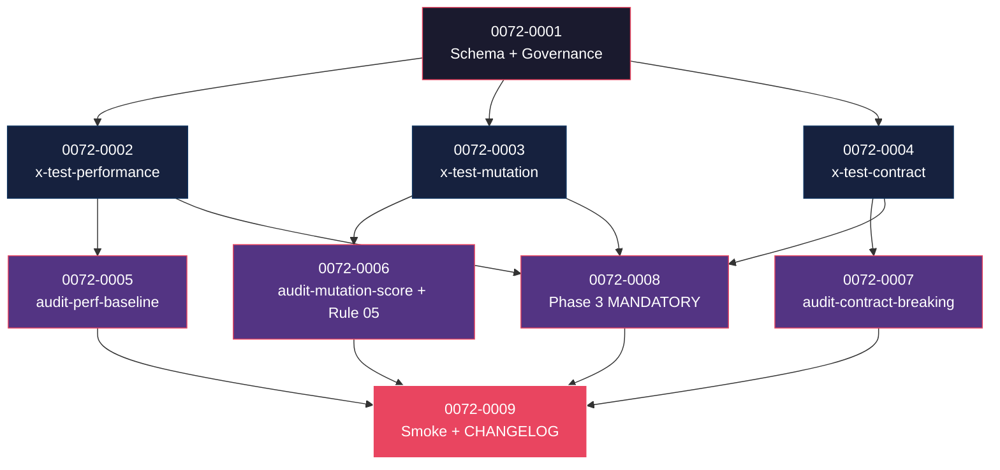

# Mapa de Implementação — EPIC-0072 (Comprehensive Test Strategy)

---

## 1. Matriz de Dependências

| Story | Título | Blocked By | Blocks | Status |
| :--- | :--- | :--- | :--- | :--- |
| story-0072-0001 | Schema YAML `quality:` + `QualityConfig.java` + capabilities + ADR-0021 | — | 0002, 0003, 0004 | Pendente |
| story-0072-0002 | Skill `/x-test-performance` (REST/gRPC/CLI/GraphQL) + template + KP | 0001 | 0005, 0008 | Pendente |
| story-0072-0003 | Skill `/x-test-mutation` (PIT/Stryker/mutmut/go-mutesting) + template + KP | 0001 | 0006, 0008 | Pendente |
| story-0072-0004 | Skill `/x-test-contract` (openapi-diff/Pact/buf/SCC) + template + KP | 0001 | 0007, 0008 | Pendente |
| story-0072-0005 | CI script `audit-perf-baseline.sh` | 0002 | 0009 | Pendente |
| story-0072-0006 | CI script `audit-mutation-score.sh` + Rule 05 estendida | 0003 | 0009 | Pendente |
| story-0072-0007 | CI script `audit-contract-breaking.sh` | 0004 | 0009 | Pendente |
| story-0072-0008 | Phase 3 MODIFIED — MANDATORY conditional dos 3 testes | 0002, 0003, 0004 | 0009 | Pendente |
| story-0072-0009 | Smoke E2E + CHANGELOG MAJOR | 0005, 0006, 0007, 0008 | — | Pendente |

---

## 2. Fases de Implementação

```
FASE 0 — Governance + Schema (sequencial)
  └─ 0072-0001  Schema YAML quality + QualityConfig + capabilities families + ADR
       │
       ▼
FASE 1 — 3 Skills sibling (paralelo, 3 stories)
  ├─ 0072-0002  x-test-performance (stack-aware: Newman/ghz/k6/hyperfine/Artillery)
  ├─ 0072-0003  x-test-mutation (PIT/Stryker/mutmut/go-mutesting)
  └─ 0072-0004  x-test-contract (openapi-diff/Pact/buf/SCC)
       │
       ▼
FASE 2 — CI scripts + Phase 3 (paralelo, 4 stories)
  ├─ 0072-0005  audit-perf-baseline.sh
  ├─ 0072-0006  audit-mutation-score.sh + Rule 05 atualizada
  ├─ 0072-0007  audit-contract-breaking.sh
  └─ 0072-0008  Phase 3 MANDATORY conditional invocations
       │
       ▼
FASE 3 — Smoke + Release
  └─ 0072-0009  E2E smoke (8 cenários) + CHANGELOG MAJOR
```

---

## 3. Caminho Crítico

```
0072-0001 → 0072-0002 (ou 0003 ou 0004) → 0072-0008 → 0072-0009
```

**4 fases.** Caminho longo: 4 stories.

---

## 4. Grafo de Dependências (Mermaid)



---

## 5. Resumo por Fase

| Fase | Stories | Camada | Paralelismo | Pré-requisito |
| :--- | :--- | :--- | :--- | :--- |
| 0 | 0001 | Governance + Domain | 1 | — |
| 1 | 0002, 0003, 0004 | Skills + Templates + KPs | 3 paralelas | Fase 0 |
| 2 | 0005, 0006, 0007, 0008 | CI scripts + Phase 3 mod | 4 paralelas | Fase 1 |
| 3 | 0009 | Test + Release | 1 | Fase 2 |

**Total: 9 histórias em 4 fases.**

---

## 6. Detalhamento por Fase

### Fase 0
- **0072-0001**: schema YAML novo `quality.{performance,mutation,contract}` em `dev.iadev.config.QualityConfig` (`java/src/main/java/dev/iadev/config/QualityConfig.java`); 3 famílias de capabilities sob `capabilities/quality/{performance,mutation,contract}/*.yaml` (D-R7 — `capabilities/` directory contingente ao avanço de EPIC-0064 P2); ADR `ADR-NNNN-comprehensive-test-strategy.md` (NNNN TBD — D-R4).

### Fase 1
- **0072-0002**: skill stack-aware em `java/src/main/resources/targets/claude/skills/core/test/x-test-performance/SKILL.md` (path D-R1 — categoria `core/test/`); template `_TEMPLATE-PERFORMANCE-PLAN.md` em `java/src/main/resources/shared/templates/` (path D-R2); 5 KPs `knowledge/testing/performance-{rest,grpc,cli,graphql,socket}.md`. Frontmatter v3.0 + capabilities `requires-any` (D-R6).
- **0072-0003**: skill stack-aware `core/test/x-test-mutation/SKILL.md` (D-R1); template `_TEMPLATE-MUTATION-PLAN.md` (D-R2); 4 KPs.
- **0072-0004**: skill stack-aware `core/test/x-test-contract/SKILL.md` (D-R1); template `_TEMPLATE-CONTRACT-PLAN.md` (D-R2); 3 KPs.

### Fase 2
- **0072-0005, 0006, 0007**: 3 CI scripts (Camada 2 — Rule 26 §Taxonomy) em `java/src/main/resources/targets/claude/scripts/audit-{perf-baseline,mutation-score,contract-breaking}.sh` (path consistente com Rule 26); cada um com `--self-check`, exit codes 0/1/2/3 (D-R5), entry simultânea em `docs/audit-gates-catalog.md` (RULE-004). `ScriptsAssembler.AUDIT_SCRIPTS` ganha 3 entries (5 → 8 totais; ver D-R5).
- **0072-0006**: também estende `targets/claude/rules/05-quality-gates.md` IN-PLACE (D-R3 — sem Rule número novo) adicionando §"Mutation Score Threshold" + §"Performance Budget".
- **0072-0008**: Phase 3 de `core/dev/x-story-implement/SKILL.md` ganha 3 MANDATORY conditional invocations (Rule 24 §Camada-1; D-R11 — sequência sequencial perf→mutation→contract com fast-fail). Rule 24 §Mandatory Evidence Artifacts ganha 3 entries condicionais.

### Fase 3
- **0072-0009**: smoke E2E `Epic0072TestStrategySmokeIT.java` (8 cenários — perf-fail/perf-ok/mutation-fail/mutation-ok/contract-fail-no-doc/contract-ok-with-doc/opt-out/stack-awareness); CHANGELOG entry **sem pinar versão** (D-R10 — `x-release` materializa MAJOR em release-time conforme Rule 08); update CLAUDE.md root + `ai/memory/epic-0072-summary.md`.

---

## 7. Observações Estratégicas

### Gargalo Principal
**story-0072-0008** consolida 3 skills em Phase 3 do orquestrador canônico (`x-story-implement`). Bug aqui afeta TODOS os projetos cliente — code-review extra (tech-lead + sre + qa em x-review-pr).

### Histórias Folha
**0072-0009**.

### Otimização de Tempo
- Fase 1: **3 paralelas** (skills independentes — files distintos sob `core/test/<name>/`).
- Fase 2: **4 paralelas** (CI scripts + Phase 3 modify em arquivos distintos; story-0006 toca Rule 05, story-0008 toca `x-story-implement/SKILL.md` — sem colisão).

### Marco de Validação Arquitetural
**story-0072-0001** define schema do YAML `quality:` + classes Java + capabilities families. Drift aqui é caro pra reverter porque os 3 sibling skills (0002/0003/0004) o consomem. Spike + revisão por tech-lead/sre antes de prosseguir.

---

## 8. Cross-Story Task Dependencies (populadas pós-refinement)

| De → Para | Razão | Bloqueio? |
| :--- | :--- | :--- |
| task-0072-0001-005..007 (3 capabilities families) → task-0072-0002-001 / 0003-001 / 0004-001 | Skills declaram `requires-any:` apontando para esses YAMLs; sem eles, frontmatter v3.0 quebra `audit-capability-graph.sh` (quando EPIC-0064 P2 entregar) | HARD |
| task-0072-0001-002 (ADR NNNN) → task-0072-0002/0003/0004 (SKILL.md descriptions) | SKILL.md description pode citar a ADR; pinar antes evita rework | SOFT |
| task-0072-0001-003 (`QualityConfig.java`) → task-0072-0002-002 / 0003-002 / 0004-002 (SKILL.md body lê QualityConfig) | Skills delegam o parse do bloco `quality:` para `QualityConfig` | HARD |
| task-0072-0002-005 (formato baseline JSON) → task-0072-0005-003 (audit valida o formato) | Audit precisa do schema antes de implementar parse + validação | HARD |
| task-0072-0003-002 (mutation-report formato) → task-0072-0006-003 (audit consome o report) | Mesma razão acima | HARD |
| task-0072-0004-005 (classificação breaking) → task-0072-0007-003 (audit usa mesma classificação) | Defesa em profundidade (Camada 3 + Camada 2) deve ter mesmo critério | HARD |
| task-0072-0008-003 (Rule 24 update — 3 artefatos esperados) → task-0072-0008-004 (audit-execution-integrity verifica condicionalmente) | Sequência local dentro da story | HARD |
| task-0072-0009-006 (Status: Backlog→Concluída) é a ÚNICA tarefa em todo o épico que muda §Status do epic | Convenção EPIC-0063+ — gate normativo em `x-review-pr` | HARD |

## 8.5 Restrições de Paralelismo (EPIC-0041 — File Footprint)

**Hotspots de colisão (regen / hard / soft):**

| Arquivo | Categoria | Stories que tocam | Decisão |
| :--- | :--- | :--- | :--- |
| `targets/claude/rules/05-quality-gates.md` | regen | 0006 (extensão in-place) | Sem colisão — única story que toca |
| `CHANGELOG.md` | hard | 0009 (entry final) | Sem colisão — única story que toca |
| 3 SKILL.md novos (`x-test-performance/SKILL.md`, `x-test-mutation/SKILL.md`, `x-test-contract/SKILL.md`) | independentes | 0002 / 0003 / 0004 (1 por story) | **3 paralelas seguras** — files distintos |
| 3 CI scripts (`audit-*.sh`) | independentes | 0005 / 0006 / 0007 (1 por story) | **3 paralelas seguras** — files distintos |
| `dev.iadev.application.assembler.ScriptsAssembler.AUDIT_SCRIPTS` | regen | 0005, 0006, 0007 (cada uma adiciona 1 entry) | Hard conflict — **serializar via `x-parallel-eval`** ou rebase incremental |
| `core/dev/x-story-implement/SKILL.md` (Phase 3 modify) | hard | 0008 (única story que toca) | Sem colisão |
| `targets/claude/rules/24-execution-integrity.md` | regen | 0008 (artefatos condicionais) | Sem colisão |
| `java/src/main/resources/shared/templates/_TEMPLATE-AUDIT-GATES-CATALOG.md` (template do catálogo — `docs/audit-gates-catalog.md` final é renderizado no projeto gerado, NÃO existe estaticamente neste repo) | hard | 0001 (reservas precoces opcionais) + 0005 + 0006 + 0007 (entries finais) | Append-only; serializar via `x-parallel-eval` ou rebase incremental |
| `capabilities/_index.yaml` (regen — quando EPIC-0064 P2 entregar) | regen | 0001 (entries para 3 families) | Contingente; sem colisão hoje |

**Recomendação:** Fase 2 roda 3 stories paralelas **mas com rebase incremental** entre elas devido a `ScriptsAssembler.AUDIT_SCRIPTS` e `audit-gates-catalog.md` serem append-only. Alternativa: serializar 0005 → 0006 → 0007 (custo +1 wave, ganho de simplicidade no rebase).
