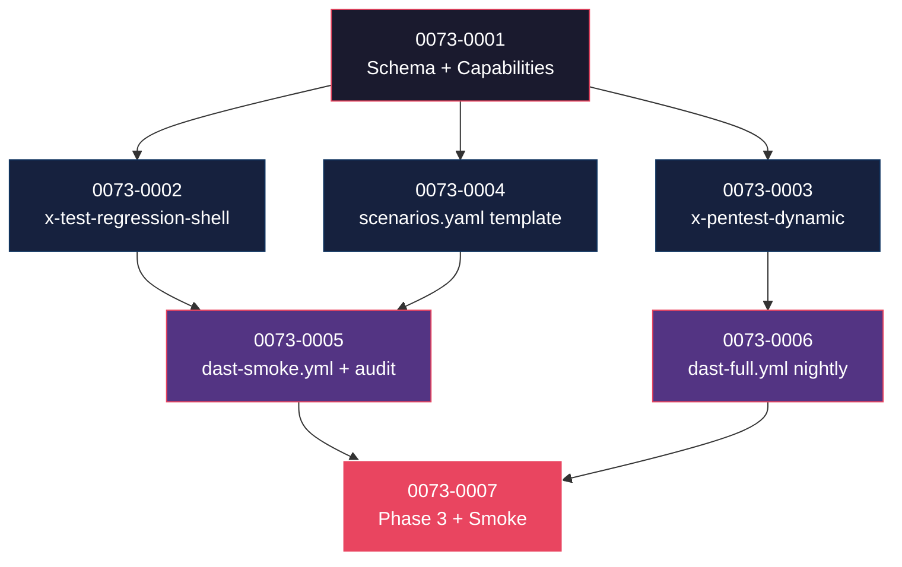

# Mapa de Implementação — EPIC-0073 (Regression Shell + DAST)

---

## 1. Matriz de Dependências

| Story | Título | Blocked By | Blocks | Status |
| :--- | :--- | :--- | :--- | :--- |
| story-0073-0001 | Schema `quality.regression` + `quality.dast` + capabilities + ADR (NNNN TBD — D-R4) | — | 0002, 0003, 0004 | Pendente |
| story-0073-0002 | Skill `/x-test-regression-shell` (modo self + service) + template + KP | 0001 | 0005, 0007 | Pendente |
| story-0073-0003 | Skill `/x-pentest-dynamic` (tier smoke + full) + template + KP DAST | 0001 | 0006, 0007 | Pendente |
| story-0073-0004 | `tests/regression/scenarios.yaml.template` stack-aware + `ScriptsAssembler` | 0001 | 0005 | Pendente |
| story-0073-0005 | CI workflow `dast-smoke.yml` (PR) + `audit-regression-shell.sh` | 0002, 0004 | 0007 | Pendente |
| story-0073-0006 | CI workflow `dast-full.yml` (nightly cron) | 0003 | 0007 | Pendente |
| story-0073-0007 | Phase 3 MODIFIED + Smoke E2E `Epic0073RegressionDastSmokeIT` + CHANGELOG | 0005, 0006 | — | Pendente |

---

## 2. Fases de Implementação

```
FASE 0 — Governance + Schema (sequencial)
  └─ 0073-0001  Schema YAML + 5 capabilities atomic + ADR (NNNN TBD — D-R4)
       │
       ▼
FASE 1 — Skills + Template (paralelo, 3 stories)
  ├─ 0073-0002  x-test-regression-shell (modo self + service)
  ├─ 0073-0003  x-pentest-dynamic (tier smoke + full)
  └─ 0073-0004  scenarios.yaml.template + ScriptsAssembler integration
       │
       ▼
FASE 2 — CI Workflows (paralelo, 2 stories)
  ├─ 0073-0005  dast-smoke.yml (PR) + audit-regression-shell.sh
  └─ 0073-0006  dast-full.yml (nightly cron)
       │
       ▼
FASE 3 — Phase 3 + Smoke + Release
  └─ 0073-0007  Phase 3 MANDATORY conditional + smoke E2E + CHANGELOG MINOR
```

---

## 3. Caminho Crítico

```
0073-0001 → 0073-0002 → 0073-0005 → 0073-0007
```

**4 fases.** Cadeia: 4 stories.

---

## 4. Grafo de Dependências (Mermaid)



---

## 5. Resumo por Fase

| Fase | Stories | Camada | Paralelismo | Pré-requisito |
| :--- | :--- | :--- | :--- | :--- |
| 0 | 0001 | Governance + Domain | 1 | — |
| 1 | 0002, 0003, 0004 | Skills + Templates + Infra | 3 paralelas | Fase 0 |
| 2 | 0005, 0006 | CI Workflows + Audit | 2 paralelas | Fase 1 |
| 3 | 0007 | Phase 3 + Test + Release | 1 | Fase 2 |

**Total: 7 histórias em 4 fases.**

---

## 6. Detalhamento por Fase

### Fase 0 — Governance + Schema (sequencial)

- **0073-0001** — Fundação contratual:
  - Schema YAML `quality.regression.*` + `quality.dast.*` (com `quality.dast.target` enum — D-R9; `production` rejeitado em ConfigLoader).
  - Sub-records Java `RegressionConfig.java` + `DastConfig.java` em `QualityConfig` (coordenação D-R6 com EPIC-0072 — extend ou greenfield conforme `git log --merges --grep='EPIC-0072'`).
  - **5 capability files atomic** publicados em `capabilities/quality/{regression,dast}/*.yaml` (D-R7) + entrada em `capabilities/_index.yaml`.
  - **ADR `ADR-NNNN-regression-shell-and-dast.md`** (NNNN TBD na execução — D-R4; palpite vigente 0022).
  - **Decisão D-R3 (Rule nova vs dispensar)** registrada no ADR — default = dispensar (Rules 06/24/26/28 cobrem invariantes).
  - **Tooling pinning policy** (D-R8): aceita `vN.x` (faixa) ou `vN.M.P` (estrito); rejeita `latest`/`master`/`HEAD`.

### Fase 1 — Skills + Templates + Infra (3 paralelas — file footprint isolado)

- **0073-0002** — Skill `/x-test-regression-shell` modo dual:
  - Path source-of-truth `java/src/main/resources/targets/claude/skills/core/test/x-test-regression-shell/SKILL.md` (D-R1 — taxonomy EPIC-0036 com `core/<categoria>/`).
  - Frontmatter v3.0 `model: sonnet` + `requires-capabilities: [quality.regression.*]` (D-R6).
  - `--self` gera 9 perfis canônicos em sandbox + diff bytewise vs golden + smoke pós-geração.
  - `--service` consome `tests/regression/scenarios.yaml` + executa cURL/grpcurl/wscat conforme `interfaces[]`.
  - Template canônico do report: `_TEMPLATE-REGRESSION-SHELL.md` em `shared/templates/`.
  - KP em `targets/claude/knowledge/testing/regression-shell-playbook.md`.
- **0073-0003** — Skill `/x-pentest-dynamic` tier dual:
  - Path source-of-truth `targets/claude/skills/core/security/x-pentest-dynamic/SKILL.md` (D-R1).
  - Frontmatter v3.0 `model: sonnet` + `requires-capabilities: [quality.dast.*]` (D-R6).
  - `--smoke` = ZAP passive + Nuclei lightweight (top-50 CVE) — gate de PR (HIGH/CRITICAL falham PR).
  - `--full` = ZAP active scan + Nuclei full templates — informativo nightly.
  - Output: SARIF 2.1.0 + Markdown via `_TEMPLATE-PENTEST-PLAN.md`.
  - KP em `targets/claude/knowledge/security/dast-playbook.md`.
- **0073-0004** — `scenarios.yaml.template` stack-aware:
  - Template em `java/src/main/resources/shared/templates/scenarios.yaml.template` + sub-snippets por interface (rest, grpc, socket, cli).
  - `ScriptsAssembler.renderRegressionScenarios()` — produz `tests/regression/scenarios.yaml` em projetos novos quando `RegressionConfig.enabled && !interfaces.isEmpty()`.
  - Não-overwrite por default; `--force-regen-regression-scenarios` opt-in destrutiva com backup.
  - **Coordenação cruzada com 0073-0002:** schema do `scenarios.yaml` é definido em `_TEMPLATE-REGRESSION-SHELL.md` (story 0002) e materializado aqui (story 0004). Convergência antes de ambas mergearem.

### Fase 2 — CI Workflows + Audit (2 paralelas — file footprint isolado)

- **0073-0005** — `dast-smoke.yml` (gate de PR) + `audit-regression-shell.sh`:
  - Workflow trigger: `pull_request: opened|synchronize`. Timeout 10min. Concurrency-group cancela superseded.
  - DAST target injection (D-R9): switch `local-container | preview-env | staging` via env-var `DAST_TARGET_URL`.
  - CI script Camada 2 (D-R5 — Rule 26 §Standardized Exit Codes 0/1/2/3 + `--self-check` mandatório).
  - Validação: `quality.regression.enabled=true && mode=service` → `tests/regression/scenarios.yaml` presente E `/x-test-regression-shell` invocado no PR.
  - Entry simultâneo em `docs/audit-gates-catalog.md` (RULE-004 Catalog-before-Add).
- **0073-0006** — `dast-full.yml` (nightly cron + manual dispatch + workflow_call):
  - Triple trigger: `schedule: cron 0 2 * * *` (02:00 UTC) + `workflow_dispatch` + `workflow_call`.
  - Outputs (workflow_call): `findings-count-high`, `sarif-artifact-id` — consumível por `x-release` para validação pré-tag.
  - Slack webhook **opcional** (secret `SLACK_DAST_WEBHOOK`).
  - Artifact retention 30 dias.
  - Comparison-between-runs (stretch): diff de findings vs últimas 7 runs.

### Fase 3 — Phase 3 + Smoke E2E + Release (1 sequencial)

- **0073-0007** — Encerramento:
  - Phase 3 de `x-story-implement` ganha **MANDATORY TOOL CALL conditional** para `/x-test-regression-shell --service` quando `quality.regression.enabled=true` (Rule 24 §Non-inlining Contract).
  - DAST permanece **CI-only** (não em Phase 3 — separação documentada §6.3 do epic).
  - Smoke E2E `Epic0073RegressionDastSmokeIT.java` cobre 5 cenários canônicos com **mock target** (não ZAP real — wiring é o objetivo).
  - **CHANGELOG entry MINOR sem versão fixa** (D-R10) — `x-release` materializa o número.
  - **CLAUDE.md** (root) ganha bloco "In progress / Concluded — EPIC-0073".
  - **Coordenação com EPIC-0072:** se 0072 mergeou primeiro com Phase 3 mod, este épico **estende** a lista de invocações conditional; ordem determinística (regression primeiro, fail-fast).

---

## 7. Observações Estratégicas

### Gargalo Principal
**story-0073-0003** (DAST skill) é o gargalo — depende de tooling externo (ZAP, Nuclei) versionado e configurado corretamente. **Mitigação:** D-R8 obriga pinning policy explícito; D-R9 normaliza target enum; KP DAST documenta troubleshooting.

### Histórias Folha
**0073-0007** — story de fechamento (Phase 3 mod + smoke + CHANGELOG). Sem dependentes downstream dentro do épico; é onde o épico "termina".

### Otimização de Tempo
- **Fase 1:** 3 paralelas (0002 + 0003 + 0004) — file footprint **isolado** (skill REGRESSION ≠ skill DAST ≠ scenarios.yaml template; cada story toca `targets/claude/skills/core/<diferente>/`, `shared/templates/<diferente>`, `targets/claude/knowledge/<diferente>`).
- **Fase 2:** 2 paralelas (0005 + 0006) — workflows YAML independentes (`dast-smoke.yml` ≠ `dast-full.yml`); `audit-regression-shell.sh` é só story 0005.

### Marco de Validação Arquitetural
**story-0073-0001** — decidir 4 itens críticos antes de Phase 1 começar:
1. **DAST target enum (D-R9):** local-container vs preview-env vs staging. Erro aqui torna DAST ineficaz.
2. **Tooling pinning policy (D-R8):** faixa vs estrito. Erro aqui causa flakiness em CI.
3. **Capability families granularity (D-R7):** atomic vs bundle. Erro aqui força refactor de frontmatter em todas as Stories de Phase 1.
4. **ADR vs Rule (D-R3):** Rule nova vs dispensar. Erro aqui adiciona Rule desnecessária à manutenção.

### Riscos

| Risco | Severidade | Mitigação | Story de mitigação |
| :--- | :--- | :--- | :--- |
| **ZAP/Nuclei versionamento drift** — templates evoluem rapidamente; flakiness se não pinado | ALTA | Pinning policy obrigatória (D-R8); cache GitHub Actions com chave derivada de `templates-version` | 0001 + 0005 + 0006 |
| **DAST full runtime > 30min** — nightly cap pode ser excedido em projetos grandes | MÉDIA | Hard timeout 35min com SARIF parcial uploaded; sumário lista endpoints não cobertos | 0006 |
| **mock target em smoke E2E não cobre wiring real** — falsos verdes | MÉDIA | DAST baseline manual em release pré-rollout (DoD §4.3); ZAP real validado off-CI | 0007 |
| **Coordenação com EPIC-0072 (Phase 3 conflict)** — ambos modificam SKILL.md de x-story-implement | MÉDIA | Decisão extend vs greenfield no kickoff (D-R6); ordem determinística documentada | 0001 + 0007 |
| **Coordenação com EPIC-0070 (system.md)** — sinérgico mas não bloqueante | BAIXA | 0073 é entregue independentemente; integração com system.md é responsabilidade de `x-arch-system-update` (épico 0070) | — |
| **scenarios.yaml schema drift entre 0002 e 0004** — duas stories em paralelo definem o mesmo schema | MÉDIA | Schema **definido** em 0002 (`_TEMPLATE-REGRESSION-SHELL.md`) e **materializado** em 0004; convergência antes de ambas mergearem | 0002 + 0004 |
| **OWASP/Compliance custom payloads (LGPD/PCI) não-genéricos** — esforço subestimado | BAIXA | Story 0003 entrega default policies; custom-pci/custom-lgpd ficam como stretch (KP DAST documenta como adicionar) | 0003 |

---

## 8. Cross-Story Task Dependencies

| De → Para | Tipo | Descrição |
| :--- | :--- | :--- |
| 0001 → {0002, 0003, 0004} | Hard | `RegressionConfig.java` + `DastConfig.java` + capabilities têm que existir antes das skills declararem `requires-capabilities`. |
| 0001 → 0007 | Soft | ADR (NNNN) referenciado em CHANGELOG e CLAUDE.md update. |
| 0002 ↔ 0004 | Convergência | Schema `scenarios.yaml` definido em 0002 e materializado em 0004; **convergência simultânea** antes de ambas mergearem (validação cruzada via smoke test compartilhado em 0007). |
| 0002 → 0005 | Hard | Workflow `dast-smoke.yml` invoca `/x-pentest-dynamic` (não regression-shell); mas `audit-regression-shell.sh` (story 0005) valida que `/x-test-regression-shell` rodou no PR — depende do skill operacional. |
| 0003 → 0006 | Hard | Workflow `dast-full.yml` invoca `/x-pentest-dynamic --full` — depende do skill operacional. |
| 0004 → 0005 | Hard | `audit-regression-shell.sh` valida presença de `tests/regression/scenarios.yaml` em projetos novos — depende do template stack-aware estar em `ScriptsAssembler`. |
| 0005 → 0007 | Hard | Smoke E2E exercita `dast-smoke.yml` em mock CI; precisa do workflow gerado. |
| 0006 → 0007 | Soft | CHANGELOG cita workflow nightly; smoke E2E referencia mas não exercita o full tier (apenas wiring). |

## 8.5. Restrições de Paralelismo (EPIC-0041 — File-Conflict-Aware)

**Hotspots catalogados (RULE-004) tocados por este épico:**

| Hotspot | Stories que tocam | Tipo de colisão | Recomendação |
| :--- | :--- | :--- | :--- |
| `CHANGELOG.md` | 0007 | Single-writer | Sem colisão (apenas 0007). |
| `CLAUDE.md` (root) | 0007 | Single-writer | Sem colisão. |
| `capabilities/_index.yaml` | 0001 | Single-writer | Sem colisão. |
| `pom.xml` | — | — | Não tocado por este épico. |
| `.gitignore` | — | — | Não tocado por este épico. |
| `targets/claude/skills/core/dev/x-story-implement/SKILL.md` | 0007 | Possível colisão com EPIC-0072 (Phase 3 mod simultâneo) | **Coordenação cross-épico:** decisão extend vs greenfield no kickoff conforme D-R6. |
| `application/assembler/CicdAssembler.java` | 0005, 0006 | Multi-writer dentro do épico | Sequencial dentro do épico (uma story de cada vez no PR review), mas Fase 2 das duas stories pode rodar em paralelo se PRs forem em branches separadas com merge sequencial. |
| `application/assembler/ScriptsAssembler.java` | 0001 (AUDIT_SCRIPTS), 0004 (renderRegressionScenarios), 0005 (audit-regression-shell entry) | Multi-writer | Stories de Phase 0/1/2 tocam métodos diferentes; testar pós-merge da última. |
| `governance/baselines/*` | 0007 (eventual) | Soft | DAST baseline opcional; não é golden. |
| `src/test/resources/golden/**` | 0001, 0004, 0005, 0006 | Regen-cascata | Goldens regenerados a cada PR; conflict é mecânico, não lógico. |

**Conclusão:** Fases 1 e 2 podem rodar em paralelo total (zero hotspot lógico compartilhado entre as stories internas a cada fase). Hotspots multi-writer (`CicdAssembler`, `ScriptsAssembler`) são sequenciais por mecânica de PR (cada story = 1 PR).

**Coordenação cross-épico monitorada:** EPIC-0072 (Phase 3 mod simultâneo em x-story-implement) — convergência registrada em D-R6 + ADR conjunto se ambos em flight.
