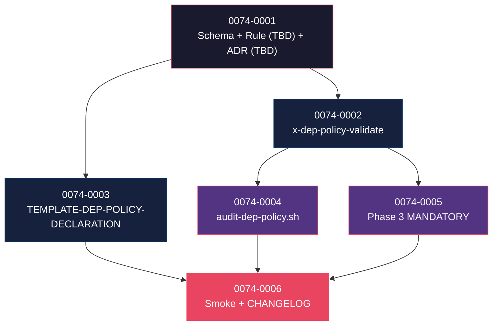

# Mapa de Implementação — EPIC-0074 (Dependency Policy & SCA Final Gate)

---

## 1. Matriz de Dependências

| Story | Título | Blocked By | Blocks | Status |
| :--- | :--- | :--- | :--- | :--- |
| story-0074-0001 | Schema YAML `dependencies.policy` + `DependencyPolicyConfig.java` + capabilities + Rule (NN TBD — D-R3) + ADR (NNNN TBD — D-R4) + KP | — | 0002, 0003 | Pendente |
| story-0074-0002 | Skill `/x-dep-policy-validate` + `_TEMPLATE-DEP-POLICY-REPORT.md` + modificação `x-dependency-audit --policy` | 0001 | 0004, 0006 | Pendente |
| story-0074-0003 | `_TEMPLATE-DEP-POLICY-DECLARATION.md` (sub-template do system.md) + `DocsAssembler` | 0001 | 0006 | Pendente |
| story-0074-0004 | CI script `audit-dep-policy.sh` + entry no audit-gates-catalog | 0002 | 0006 | Pendente |
| story-0074-0005 | Phase 3 MODIFIED — MANDATORY conditional + Rule 27 surface (NN TBD — D-R7) | 0002 | 0006 | Pendente |
| story-0074-0006 | Smoke E2E `Epic0074DepPolicySmokeIT` (6 cenários) + CHANGELOG MINOR (sem versão pinada — D-R12) | 0003, 0004, 0005 | — | Pendente |

> **Valores de Status:** `Pendente` · `Refinada` · `Em Andamento` · `Concluída` · `Falha` · `Bloqueada` · `Parcial`
> **Refinement note:** decisões D-R1..D-R12 consolidadas em `epic-0074.md §10`. Status das stories permanece `Pendente` — refinement não muda status.

---

## 2. Fases de Implementação

```
FASE 0 — Governance + Schema + KP (sequencial)
  └─ 0074-0001  Schema + Java config + capabilities sub-families + Rule (NN TBD — D-R3) + ADR (NNNN TBD — D-R4) + KP
       │
       ▼
FASE 1 — Skill + Template (paralelo, 2 stories)
  ├─ 0074-0002  /x-dep-policy-validate + report template + x-dependency-audit modificada
  └─ 0074-0003  TEMPLATE-DEP-POLICY-DECLARATION (sub-template system.md)
       │
       ▼
FASE 2 — CI + Phase 3 (paralelo, 2 stories)
  ├─ 0074-0004  audit-dep-policy.sh
  └─ 0074-0005  Phase 3 MANDATORY conditional + Rule 27 surface (NN TBD — D-R7) nova
       │
       ▼
FASE 3 — Smoke + Release
  └─ 0074-0006  E2E smoke + CHANGELOG MINOR
```

---

## 3. Caminho Crítico

```
0074-0001 → 0074-0002 → 0074-0005 → 0074-0006
```

**4 fases.** Cadeia: 4 stories.

---

## 4. Grafo de Dependências (Mermaid)



---

## 5. Resumo por Fase

| Fase | Stories | Camada | Paralelismo | Pré-requisito |
| :--- | :--- | :--- | :--- | :--- |
| 0 | 0001 | Governance + Domain + KP | 1 | — |
| 1 | 0002, 0003 | Skill + Template | 2 paralelas | Fase 0 |
| 2 | 0004, 0005 | CI script + Phase 3 mod | 2 paralelas | Fase 1 |
| 3 | 0006 | Test + Release | 1 | Fase 2 |

**Total: 6 histórias em 4 fases.**

---

## 6. Detalhamento por Fase

### Fase 0 — Governance + Schema + KP
| Story | Escopo Principal | Artefatos Chave |
| :--- | :--- | :--- |
| 0074-0001 | Schema YAML `dependencies.policy` (D-R9 cross-stack syntax + D-R10 default block-on + D-R11 scope handling); `DependencyPolicyConfig.java` + sub-records; capability mãe `governance.dependency-policy` + 5 sub-families; Rule (NN TBD — D-R3); ADR (NNNN TBD — D-R4); KP playbook | `capabilities/governance/dependency-policy{,.maven,.gradle,.npm,.pip,.gomod}.yaml`, `java/src/main/resources/targets/claude/rules/<NN>-dependency-policy-gate.md` (D-R2), `docs/adr/ADR-<NNNN>-dependency-policy-gate.md`, `java/src/main/resources/targets/claude/knowledge/security/dependency-policy-playbook.md`, `DependencyPolicyConfig.java` + sub-records |

### Fase 1 — Skill + Template (paralelo, 2 stories)
| Story | Escopo Principal | Artefatos Chave |
| :--- | :--- | :--- |
| 0074-0002 | Skill `/x-dep-policy-validate` (path D-R1: `targets/claude/skills/core/security/`) + frontmatter v3.0 (D-R6) + `_TEMPLATE-DEP-POLICY-REPORT.md` + modificação aditiva `x-dependency-audit --policy` | `java/src/main/resources/targets/claude/skills/core/security/x-dep-policy-validate/SKILL.md`, `java/src/main/resources/shared/templates/_TEMPLATE-DEP-POLICY-REPORT.md`, edits em `x-dependency-audit/SKILL.md` |
| 0074-0003 | Sub-template `_TEMPLATE-DEP-POLICY-DECLARATION.md` (system.md §8) + `DocsAssembler.renderSystemArchitecture` extension; soft-dependency em EPIC-0070 (fallback stand-alone se 0070 não merged) | `java/src/main/resources/shared/templates/_TEMPLATE-DEP-POLICY-DECLARATION.md`, edits em `DocsAssembler.java`, `java/src/test/resources/golden/<perfil>/system.md.golden` (2 perfis: Java/Maven + Node/npm) |

### Fase 2 — CI + Phase 3 (paralelo, 2 stories)
| Story | Escopo Principal | Artefatos Chave |
| :--- | :--- | :--- |
| 0074-0004 | CI script `audit-dep-policy.sh` Rule 26-compliant (D-R5: exit codes 0/1/2/3 + `--self-check`); baseline `audits/dep-policy-baseline.txt`; entry catálogo (RULE-004); workflow CI integration | `java/src/main/resources/targets/claude/scripts/audit-dep-policy.sh`, `audits/dep-policy-baseline.txt`, edits em `docs/audit-gates-catalog.md`, `.github/workflows/*.yml` |
| 0074-0005 | Phase 3 de `x-story-implement` ganha MANDATORY TOOL CALL conditional (`dependencies.policy.enabled=true`); Rule 27 ganha surface (NN TBD — D-R7) com artefato evidência; Rule 24 + Stop hook ajustados | edits em `x-story-implement/SKILL.md` Phase 3, `27-zero-bypass-lifecycle.md` (surface table), `24-execution-integrity.md` (mandatory artifacts), `verify-story-completion.sh`, `audit-execution-integrity.sh` |

### Fase 3 — Smoke + Release
| Story | Escopo Principal | Artefatos Chave |
| :--- | :--- | :--- |
| 0074-0006 | Smoke E2E `Epic0074DepPolicySmokeIT` (6 cenários parametrizados); CHANGELOG MINOR sem versão pinada (D-R12) + Highlights pré-redigido; CLAUDE.md update; coverage ≥ 95/90 (Rule 05) | `java/src/test/java/dev/iadev/epic0074/Epic0074DepPolicySmokeIT.java`, `java/src/test/resources/fixtures/epic-0074/<6-subdirs>/`, edits em `CHANGELOG.md`, `CLAUDE.md`, `docs/audit-gates-catalog.md` |

---

## 7. Observações Estratégicas

### Gargalo Principal
**story-0074-0001** — schema mal-modelado (sintaxe cross-stack ambígua) custa caro corrigir depois. Spike pode ser necessário antes de finalizar.

### Histórias Folha
**0074-0006**.

### Otimização de Tempo
- Fase 1: **2 paralelas**.
- Fase 2: **2 paralelas**.

### Marco de Validação Arquitetural
**story-0074-0002** — skill de validação. Validação errônea (false positive ou false negative) erode confiança no gate. Validar contra 5+ projetos históricos antes de Fase 2.

### Riscos
- Cross-stack syntax (Maven groupId+artifactId vs npm name vs Go module path): KP playbook precisa documentar bem.
- License whitelist conservadora vs permissiva — decisão vai bater em compliance.

---

## 8. Dependências entre Tasks (Cross-Story)

Cross-story task dependencies a serem detalhadas durante Phase 0 do `x-epic-implement` quando cada story for decomposta em tasks (`x-task-plan`). Pontos conhecidos pós-refinement:

- **task-0074-0001-005** (criar Rule NN) → **task-0074-0002-001** (skill `x-dep-policy-validate` declara `requires-capabilities: [governance.dependency-policy.*]` no frontmatter — precisa do capability ID estável da Rule).
- **task-0074-0001-004** (capabilities) → **task-0074-0002-001** (skill frontmatter v3.0 conforme D-R6 referencia capability families).
- **task-0074-0002-001** (skill SKILL.md) → **task-0074-0004-001** (CI script invoca a skill — precisa do path de dispatch estável).
- **task-0074-0001-003** (`DependencyPolicyConfig.java`) → **task-0074-0002-003** (`x-dependency-audit --policy` consome `DependencyPolicyConfig` para cross-check de findings).
- **task-0074-0001-008** (parser `ProjectConfig`) → **task-0074-0005-004** (`audit-execution-integrity.sh` faz lookup do YAML para decidir se exige o artefato evidência conditional).
- **task-0074-0003-003** (integração `_TEMPLATE-ARCHITECTURE-SYSTEM.md`) ↔ EPIC-0070 story-0070-0004 cross-epic. Soft-dep: se 0070 mergeado → integration full; se não → stand-alone (D-R §10.1).
- **task-0074-0005-002** (Rule 27 surface) ↔ EPIC-0075 story que reserva surface 14 — cross-epic coordenação D-R7.
- **task-0074-0006-001** (smoke E2E) consome o conjunto de stories 0001..0005 já merged em `epic/0074` — natural sequência da folha do DAG.

Refinement-driven deps acima foram derivadas das D-R1..D-R12 do `epic-0074.md §10`.

---

## 8.5 Restrições de Paralelismo

**Hotspots esperados:**
- `Rule 27` (regen) — story-0074-0005 (surface NN nova — D-R7).
- `Rule 24` (regen) — story-0074-0005 (mandatory artifact entry nova).
- `CHANGELOG.md` — story-0074-0006.
- `CLAUDE.md` — story-0074-0006 (bloco "Concluded — EPIC-0074").
- `capabilities/_index.yaml` (regen) — story-0074-0001.
- `_TEMPLATE-ARCHITECTURE-SYSTEM.md` (regen, soft) — story-0074-0003 (cross-epic com 0070).
- `docs/audit-gates-catalog.md` — stories 0074-0001 (reserva), 0074-0004 (definitivo), 0074-0006 (production status).
- `x-dependency-audit/SKILL.md` (regen leve) — story-0074-0002 modifica para aceitar `--policy`.
- `audit-execution-integrity.sh` — story-0074-0005 estende lookup conditional.
- `verify-story-completion.sh` — story-0074-0005 estende Camada 2.

**Recomendação:** Fases 1 e 2 paralelizam 2+2 stories (zero colisão entre 0074-0002↔0074-0003 e 0074-0004↔0074-0005). Stories 0074-0005 e 0074-0006 sequenciais por dependência direta (folha do DAG).

**Cross-epic coordination required:**
- 0074-0003 ↔ EPIC-0070 (system.md template).
- 0074-0005 ↔ EPIC-0075 (Rule 27 surface 13/14 numbering — D-R7).
- 0074-0005 ↔ EPIC-0072 (ordem em Phase 3 — dep-policy ANTES de testes pesados — D-R §10.1).
