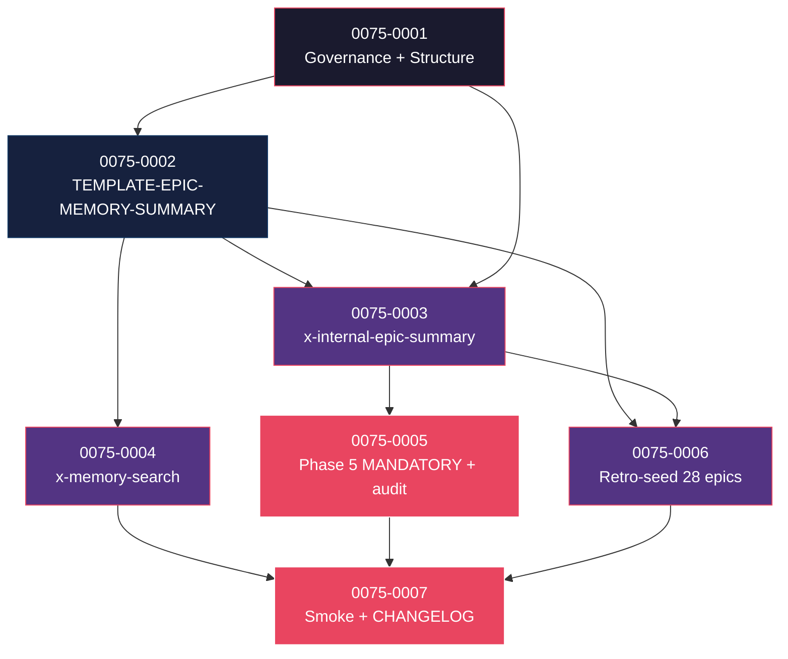

# Mapa de Implementação — EPIC-0075 (AI Memory Layer)

---

## 1. Matriz de Dependências

| Story | Título | Blocked By | Blocks | Status |
| :--- | :--- | :--- | :--- | :--- |
| story-0075-0001 | Capability + Rule 33 + ADR-0024 + KP playbook + estrutura `ai/memory/` + `_index.yaml` schema | — | 0002, 0003 | Pendente |
| story-0075-0002 | `_TEMPLATE-EPIC-MEMORY-SUMMARY.md` + frontmatter v3.0 (tags, capabilities, rules, patterns, antipatterns) | 0001 | 0003, 0006 | Pendente |
| story-0075-0003 | Skill interna `/x-internal-epic-summary` (model: haiku, determinística) | 0001, 0002 | 0005, 0007 | Pendente |
| story-0075-0004 | Skill `/x-memory-search` (user-invocable, grep+frontmatter index) | 0002 | 0007 | Pendente |
| story-0075-0005 | Phase 5 de `x-epic-implement` MODIFIED + Rule 27 surface 14 + CI script `audit-memory-coverage.sh` | 0003 | 0007 | Pendente |
| story-0075-0006 | Retro-seed: gerar `ai/memory/epic-XXXX-summary.md` para 28 epics (0040–0068) | 0003 | 0007 | Pendente |
| story-0075-0007 | Smoke E2E `Epic0075MemoryLayerSmokeIT` + CHANGELOG MINOR | 0004, 0005, 0006 | — | Pendente |

---

## 2. Fases de Implementação

```
FASE 0 — Governance + Estrutura (sequencial)
  └─ 0075-0001  Capability + Rule 33 + ADR-0024 + KP + ai/memory/ skeleton + _index.yaml
       │
       ▼
FASE 1 — Template (sequencial — bloqueia tudo)
  └─ 0075-0002  TEMPLATE-EPIC-MEMORY-SUMMARY (frontmatter v3.0 + body)
       │
       ▼
FASE 2 — Skills + Retro-seed (paralelo, 3 stories)
  ├─ 0075-0003  x-internal-epic-summary (haiku determinístico)
  ├─ 0075-0004  x-memory-search (5 modos de retrieval)
  └─ 0075-0006  Retro-seed batch (28 epics 0040–0068)
       │
       ▼
FASE 3 — Phase 5 + Smoke + Release (paralelo, 2 stories)
  ├─ 0075-0005  Phase 5 MANDATORY + Rule 27 surface 14 + audit-memory-coverage.sh
  └─ 0075-0007  Smoke E2E + CHANGELOG MINOR
```

---

## 3. Caminho Crítico

```
0075-0001 → 0075-0002 → 0075-0003 → 0075-0005 → 0075-0007
```

**5 fases (a fase 1 isolada porque template bloqueia tudo).** Cadeia mais longa: 5 stories.

---

## 4. Grafo de Dependências (Mermaid)



---

## 5. Resumo por Fase

| Fase | Stories | Camada | Paralelismo | Pré-requisito |
| :--- | :--- | :--- | :--- | :--- |
| 0 | 0001 | Governance + Estrutura | 1 | — |
| 1 | 0002 | Template | 1 (bloqueia tudo) | Fase 0 |
| 2 | 0003, 0004, 0006 | Skills + Retro-seed | 3 paralelas | Fase 1 |
| 3 | 0005, 0007 | Phase 5 mod + Smoke + Release | 2 paralelas | Fase 2 |

**Total: 7 histórias em 4 fases.**

---

## 6. Detalhamento por Fase

### Fase 0
- **0075-0001**: capability `governance.ai-memory`, Rule 33, ADR-0024, KP playbook, estrutura `ai/memory/{README.md,_index.yaml}`.

### Fase 1
- **0075-0002**: template do summary com frontmatter v3.0 (epic-id, tags, capabilities-affected, rules-affected, patterns-introduced, antipatterns-rejected, dependencies-of/for, indexable). Body ≤ 200 linhas (cap forçado).

### Fase 2 (paralelo)
- **0075-0003**: skill interna determinística que extrai decisões + alternativas + padrões do épico v2 e compõe summary. Invocada automaticamente pós-Phase 5.
- **0075-0004**: skill user-invocable de busca (5 modos: --by-tag, --by-capability, --by-rule, --by-pattern, --by-epic). Implementação grep + parse frontmatter.
- **0075-0006**: retro-seed batch para 28 epics históricos (0040–0068). Trabalho intensivo mas pragmático: gera todos de uma vez, revisão humana spot-check.

### Fase 3 (paralelo)
- **0075-0005**: Phase 5 de `x-epic-implement` ganha invocação MANDATORY de `/x-internal-epic-summary`; Rule 27 ganha surface 14; CI script `audit-memory-coverage.sh`.
- **0075-0007**: smoke E2E (5 cenários) + CHANGELOG MINOR.

---

## 7. Observações Estratégicas

### Gargalo Principal
**story-0075-0002** (template). Frontmatter mal-modelado quebra retrieval no `x-memory-search` (story 0004) e na seed retroativa (story 0006). Modelar com cuidado, validar com 1-2 épicos manuais antes de prosseguir.

### Histórias Folha
**0075-0007**.

### Otimização de Tempo
- Fase 2: **3 paralelas** (skills + retro-seed independentes).
- Fase 3: **2 paralelas**.
- Retro-seed (story 0006) é a história mais longa em wallclock — pode ser feita em background da Fase 2.

### Marco de Validação Arquitetural
**story-0075-0003** (skill de geração). Se determinismo falhar (resultados diferentes entre runs), o `_index.yaml` fica inconsistente e busca quebra. Smoke específico antes de Fase 3.

### Riscos
- Retro-seed gerando summaries ruins (épicos antigos têm decisões implícitas, difíceis de extrair). Spot-check humano mitiga, mas alguns summaries podem precisar refinamento manual.
- Volume cresce — em 2 anos talvez 200 entries. Reavaliar índice/RAG nesse ponto (decisão 6.2 do épico).

---

## 8 + 8.5

**Hotspots esperados:**
- `ai/memory/_index.yaml` — stories 3, 4, 5, 6 todas tocam (mas em modos diferentes: 3 escreve, 4 lê, 5 valida, 6 popula). Recomendação: serializar 3 → 6 → 5; 4 paralelo a 6.
- `targets/claude/skills/x-epic-implement/SKILL.md` (regen) — story 5.
- `Rule 27` (regen) — story 5.
- `CHANGELOG.md` — story 7.

**Recomendação:** rodar 0003 antes de 0006; depois 0004 paralelo a 0006; depois 0005 e 0007 paralelos.
