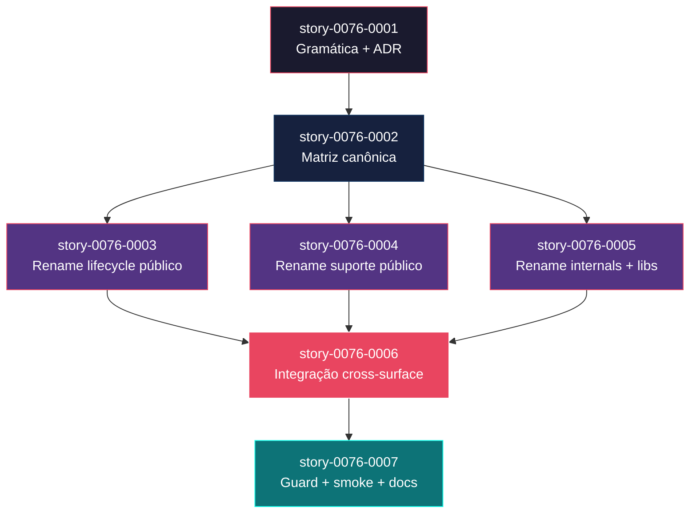

# Implementation Map — EPIC-0076

**Epic:** Verb-First Skill Naming Refactor  
**Branch:** `epic/0076`  
**Total stories:** 7  
**Total waves:** 5  
**Critical path:** A → B → C → D → E (5 hops)

---

## 0. Cross-Epic Landscape

### Recent Epics Status (snapshot 2026-04-29)

| Epic ID | Title | Status atual | Safe to Cite? |
| :--- | :--- | :--- | :--- |
| EPIC-0064 | Capability-Driven Composition Refactor | Concluída | Sim — baseline atual |
| EPIC-0065 | Feature Creation Chain Refactor | Pendente | Não — baseline futura |
| EPIC-0066 | PR Body Templates | Backlog | Não — baseline futura |
| EPIC-0069 | Refinement and DoR Gate | Backlog | Não — baseline futura |
| EPIC-0072 | Comprehensive Test Strategy | Backlog | Não — baseline futura |
| EPIC-0073 | Regression Shell and DAST | Backlog | Não — baseline futura |
| EPIC-0075 | AI Memory Layer | Backlog | Não — baseline futura |

> EPIC-0076 depende da conclusão dos épicos acima que alteram ou ampliam o catálogo de skills. A decomposição já os considera como baseline funcional futura.

---

## 1. Matriz de Dependências

| Story | Título | Chave Jira | Blocked By | Blocks | Status |
| :--- | :--- | :--- | :--- | :--- | :--- |
| story-0076-0001 | Gramática verb-first e ADR do rename | — | — | story-0076-0002 | Pendente |
| story-0076-0002 | Inventário e matriz canônica pós-EPIC-0075 | — | story-0076-0001 | story-0076-0003, story-0076-0004, story-0076-0005 | Pendente |
| story-0076-0003 | Renomear skills públicas de criação, planejamento, refinement e implementação | — | story-0076-0002 | story-0076-0006 | Pendente |
| story-0076-0004 | Renomear skills públicas de suporte, review, teste, segurança, git, PR, Jira e operações | — | story-0076-0002 | story-0076-0006 | Pendente |
| story-0076-0005 | Renomear skills internas e libs | — | story-0076-0002 | story-0076-0006 | Pendente |
| story-0076-0006 | Atualizar source of truth, Java, templates, docs e testes | — | story-0076-0003, story-0076-0004, story-0076-0005 | story-0076-0007 | Pendente |
| story-0076-0007 | Guard anti-legado, smoke tests e documentação de migração | — | story-0076-0006 | — | Pendente |

> **Nota:** a convergência crítica do épico é story-0076-0006. Qualquer atraso em 0003, 0004 ou 0005 bloqueia a integração cross-surface.

---

## 2. Fases de Implementação

```text
╔══════════════════════════════════════════════════════════════════════════╗
║                    FASE 0 — Convenção e ADR (serial)                   ║
║                                                                        ║
║   ┌──────────────────────────────────────────────────────────────────┐  ║
║   │  story-0076-0001  Gramática verb-first + ADR                    │  ║
║   └───────────────────────────────┬──────────────────────────────────┘  ║
╚═══════════════════════════════════╪══════════════════════════════════════╝
                                    │
                                    ▼
╔══════════════════════════════════════════════════════════════════════════╗
║                    FASE 1 — Matriz Canônica (serial)                   ║
║                                                                        ║
║   ┌──────────────────────────────────────────────────────────────────┐  ║
║   │  story-0076-0002  Inventário + matriz pós-EPIC-0075            │  ║
║   └───────────────────────────────┬──────────────────────────────────┘  ║
╚═══════════════════════════════════╪══════════════════════════════════════╝
                                    │
                                    ▼
╔══════════════════════════════════════════════════════════════════════════╗
║                  FASE 2 — Renames por Cluster (paralelo)              ║
║                                                                        ║
║  ┌──────────────────────────────┐  ┌──────────────────────────────┐    ║
║  │ story-0076-0003             │  │ story-0076-0004             │    ║
║  │ lifecycle público           │  │ suporte público             │    ║
║  └──────────────────────────────┘  └──────────────────────────────┘    ║
║                     ┌──────────────────────────────┐                    ║
║                     │ story-0076-0005             │                    ║
║                     │ internals + libs            │                    ║
║                     └──────────────────────────────┘                    ║
╚══════════════════════════════════════╪═══════════════════════════════════╝
                                       │
                                       ▼
╔══════════════════════════════════════════════════════════════════════════╗
║                 FASE 3 — Integração Cross-Surface (serial)             ║
║                                                                        ║
║   ┌──────────────────────────────────────────────────────────────────┐  ║
║   │  story-0076-0006  Java + docs + templates + tests              │  ║
║   └───────────────────────────────┬──────────────────────────────────┘  ║
╚═══════════════════════════════════╪══════════════════════════════════════╝
                                    │
                                    ▼
╔══════════════════════════════════════════════════════════════════════════╗
║             FASE 4 — Guard, Smoke e Migração Documental (serial)      ║
║                                                                        ║
║   ┌──────────────────────────────────────────────────────────────────┐  ║
║   │  story-0076-0007  Guard anti-legado + smokes + docs            │  ║
║   └──────────────────────────────────────────────────────────────────┘  ║
╚══════════════════════════════════════════════════════════════════════════╝
```

---

## 3. Caminho Crítico

```text
story-0076-0001 → story-0076-0002 → story-0076-0003 → story-0076-0006 → story-0076-0007
   Phase 0           Phase 1           Phase 2           Phase 3           Phase 4
```

**5 fases no caminho crítico, 5 histórias na cadeia mais longa.**

Story-0076-0004 e story-0076-0005 ficam fora do caminho crítico, mas continuam bloqueando a convergência da story-0076-0006.

---

## 4. Grafo de Dependências (Mermaid)



---

## 5. Resumo por Fase

| Fase | Histórias | Camada | Paralelismo | Pré-requisito |
| :--- | :--- | :--- | :--- | :--- |
| 0 | story-0076-0001 | Convenção | 1 | — |
| 1 | story-0076-0002 | Análise | 1 | Fase 0 concluída |
| 2 | story-0076-0003, 0004, 0005 | Rename por cluster | 3 paralelas | Fase 1 concluída |
| 3 | story-0076-0006 | Integração | 1 | Fase 2 concluída |
| 4 | story-0076-0007 | Verificação e rollout | 1 | Fase 3 concluída |

**Total: 7 histórias em 5 fases.**

---

## 6. Detalhamento por Fase

### Fase 0 — Convenção

| Story | Escopo Principal | Artefatos Chave |
| :--- | :--- | :--- |
| story-0076-0001 | Gramática, critérios de exceção, ADR | `docs/adr/ADR-0025-verb-first-skill-naming.md` |

### Fase 1 — Matriz

| Story | Escopo Principal | Artefatos Chave |
| :--- | :--- | :--- |
| story-0076-0002 | Inventário real + futura baseline + tabela canônica | `docs/specs/SPEC-verb-first-skill-naming-v1.md` |

### Fase 2 — Rename por Cluster

| Story | Escopo Principal | Artefatos Chave |
| :--- | :--- | :--- |
| story-0076-0003 | Creation / planning / refinement / implementation | SKILL.md públicos de lifecycle |
| story-0076-0004 | Support clusters públicos | git / pr / review / test / security / ops / jira / docs |
| story-0076-0005 | Internals e libs | `skills/core/internal/**`, `skills/core/lib/**` |

### Fase 3 — Integração

| Story | Escopo Principal | Artefatos Chave |
| :--- | :--- | :--- |
| story-0076-0006 | Java, docs, templates, testes, goldens, generated output | `java/src/**`, `.claude/**`, `README.md`, `CLAUDE.md` |

### Fase 4 — Rollout

| Story | Escopo Principal | Artefatos Chave |
| :--- | :--- | :--- |
| story-0076-0007 | Guard anti-legado, smoke tests, changelog e migração | guard script + smoke suite + docs |

---

## 7. Observações Estratégicas

### Gargalo Principal

**story-0076-0006** é o gargalo do épico. Ela converge os três ramos paralelos de rename e é a única história capaz de validar consistência cross-surface.

### Histórias Folha

- **story-0076-0007** é a folha final
- **story-0076-0004** e **story-0076-0005** podem absorver atraso moderado sem alongar o caminho crítico, desde que terminem antes da convergência em 0006

### Otimização de Tempo

- paralelismo máximo na Fase 2
- revisão antecipada da matriz em 0002 reduz retrabalho nas três histórias paralelas

### Marco de Validação Arquitetural

**story-0076-0002** é o marco arquitetural. Quando a matriz canônica estiver estável, o restante do épico vira execução controlada por cluster.

---

## 8. Restrições de Paralelismo

- `README.md`, `CLAUDE.md`, `CHANGELOG.md` e generated `.claude/**` são hotspots: serializar escrita final em 0006/0007.
- `java/src/main/resources/targets/claude/skills/**` pode paralelizar por cluster desde que cada story toque subárvores distintas.
