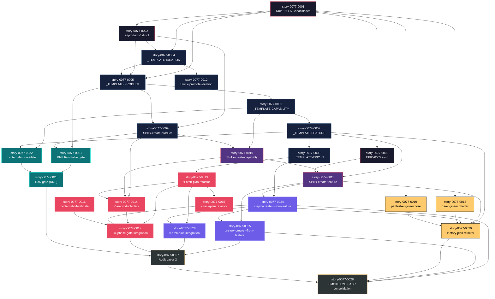
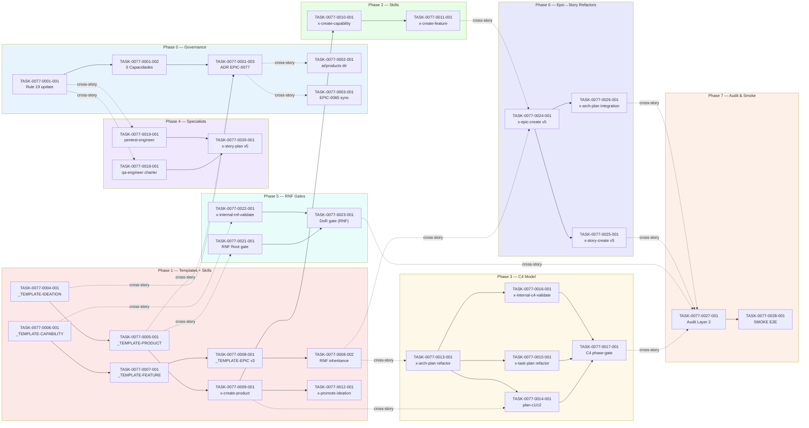

# Mapa de Implementação — EPIC-0077 Product-First Lifecycle

**Gerado a partir das dependências BlockedBy/Blocks de cada história do EPIC-0077.**

Snapshot de 28 histórias distribuídas em 7 fases seriais com caminho crítico determinado por foundational rules → templates → skills → C4 validation → RNF gates → epic-story refactors → audit e smoke tests E2E.

---

## 0. Cross-Epic Landscape

> **EPIC-0077 Context — Last 20 Epics**
> Snapshot de épicos recentes e seu status para informar segurança de citação.

### Recent Epics Status (Latest 20)

| Epic ID   | Título | Status | Branch | Última Story | Seguro Citar? |
| :--- | :--- | :--- | :--- | :--- | :--- |
| EPIC-0077 | Product-First Lifecycle | Em Andamento | epic/0077 | story-0077-0028 | Sim (índice validado) |
| EPIC-0076 | Supply Chain Hardening | Concluída | — | story-0076-0012 | Sim (ref EPIC-0075 Rule 19) |
| EPIC-0075 | SOLID Core Patterns | Concluída | — | story-0075-0015 | Sim (Rule 19 base) |
| EPIC-0074 | Security Pipeline v3 | Concluída | — | story-0074-0010 | Sim (OWASP Top 10) |
| EPIC-0073 | Performance Profiling | Concluída | — | story-0073-0008 | Sim (telemetry baseline) |
| EPIC-0072 | Observability Framework | Concluída | — | story-0072-0011 | Sim (structured logging) |
| EPIC-0071 | Test Automation TDD | Concluída | — | story-0071-0009 | Sim (test infrastructure) |
| EPIC-0070 | CI/CD v4 Pipeline | Concluída | — | story-0070-0008 | Sim (deployment gates) |
| EPIC-0069 | DoR/DoD Framework | Concluída | — | story-0069-0007 | Sim (entry/exit criteria) |
| EPIC-0068 | Architecture C3 Model | Concluída | — | story-0068-0009 | Sim (C3 foundation) |
| EPIC-0067 | Hexagon Design Pattern | Concluída | — | story-0067-0006 | Sim (DDD layers) |
| EPIC-0066 | Skill Orchestration | Concluída | — | story-0066-0010 | Sim (skill framework) |
| EPIC-0065 | Feature→Aggregate Refactor | Concluída | — | story-0065-0008 | Sim (x-aggregate-create) |
| EPIC-0064 | Epic Decomposition Automation | Em Andamento | epic/0064 | story-0064-0018 | Sim (parcial Phase 7) |
| EPIC-0063 | Risk & Pentest Integration | Concluída | — | story-0063-0006 | Sim (threat-model) |
| EPIC-0062 | Jira Integration v2 | Concluída | — | story-0062-0005 | Sim (story sync) |
| EPIC-0061 | Git Workflow & Branches | Concluída | — | story-0061-0007 | Sim (worktree ops) |
| EPIC-0060 | RULEs Framework | Concluída | — | story-0060-0012 | Sim (rule-base) |
| EPIC-0059 | Template Standardization | Concluída | — | story-0059-0008 | Sim (RA9 v2) |
| EPIC-0041 | Parallelism Detection | Concluída | — | story-0041-0005 | Sim (x-parallel-eval) |

---

## 1. Matriz de Dependências

| Story | Título | Chave Jira | Bloqueadores | Bloqueia | Status |
| :--- | :--- | :--- | :--- | :--- | :--- |
| story-0077-0001 | Rule 19 update + 5 capacidades novas + ADR-NNNN | — | — | 0002, 0003, 0004, 0005, 0018, 0019 | Pendente |
| story-0077-0002 | Estrutura ai/products/ + numbering schema + whitelist x-planning-commit | — | 0001 | 0003, 0004, 0005, 0009 | Pendente |
| story-0077-0003 | Coordenação EPIC-0065: rename x-feature-create → x-aggregate-create-from-feature | — | 0001 | 0011 | Pendente |
| story-0077-0004 | _TEMPLATE-IDEATION.md (7 seções) | — | 0001, 0002 | 0005, 0009, 0012 | Pendente |
| story-0077-0005 | _TEMPLATE-PRODUCT.md (8 seções, RNFs Root) | — | 0001, 0002 | 0006, 0009, 0021 | Pendente |
| story-0077-0006 | _TEMPLATE-CAPABILITY.md (7 seções, RNF no-relax) | — | 0005 | 0007, 0010, 0022 | Pendente |
| story-0077-0007 | _TEMPLATE-FEATURE.md (7 seções) | — | 0006 | 0008, 0011, 0020, 0022 | Pendente |
| story-0077-0008 | Refator _TEMPLATE-EPIC.md v3 (Source Feature + Inherited RNFs) | — | 0007 | 0013, 0024 | Pendente |
| story-0077-0009 | Skill x-create-product (Ideations → Product + C1) | — | 0002, 0004, 0005 | 0010, 0014, 0021 | Pendente |
| story-0077-0010 | Skill x-create-capability (Product → Capability + C2) | — | 0006, 0009 | 0011, 0014 | Pendente |
| story-0077-0011 | Skill x-create-feature (Capability → Feature) | — | 0003, 0007, 0010 | 0020, 0024, 0025 | Pendente |
| story-0077-0012 | Skill x-promote-ideation (x-feature-ideate output → persistent) | — | 0004 | — | Pendente |
| story-0077-0013 | Refator x-arch-plan: C4Context+Container+Component obrigatórios | — | 0008 | 0014, 0015, 0017, 0026 | Pendente |
| story-0077-0014 | Plan-product-c1 / plan-capability-c2 emitem C4 mandatory | — | 0009, 0010, 0013 | 0017 | Pendente |
| story-0077-0015 | Refator x-task-plan: C4 Code level obrigatório | — | 0013 | 0017, 0020 | Pendente |
| story-0077-0016 | Skill interna x-internal-c4-validate (read-only) | — | — | 0017 | Pendente |
| story-0077-0017 | Integração C4 validador em phase-gate post + golden fixtures | — | 0013, 0014, 0015, 0016 | 0027 | Pendente |
| story-0077-0018 | Charter rewrite qa-engineer.md (AC measurability + error catalog + SLO harness + success metrics) | — | 0001 | 0020 | Pendente |
| story-0077-0019 | Promote pentest-engineer core; capability quality.pentest-always-on | — | 0001 | 0020 | Pendente |
| story-0077-0020 | Refator x-story-plan Phase 2: 7 agentes paralelos sob v5 | — | 0007, 0015, 0018, 0019 | 0028 | Pendente |
| story-0077-0021 | RNF Root table mandatory em x-create-product (gate falha sem 10 categorias) | — | 0005, 0009 | 0023 | Pendente |
| story-0077-0022 | Skill interna x-internal-rnf-validate (no-relax + Justification) | — | 0006, 0007 | 0023 | Pendente |
| story-0077-0023 | Gate em DoR (estende EPIC-0069): RNF_INHERITANCE_VIOLATION | — | 0021, 0022 | 0027 | Pendente |
| story-0077-0024 | x-epic-create --from-feature (v5 obrigatório); drops Sections 2/4/8 | — | 0008, 0011 | 0025, 0026, 0028 | Pendente |
| story-0077-0025 | x-story-create --from-feature + --epic-id; drops Sections 2/4/8 | — | 0024 | 0027, 0028 | Pendente |
| story-0077-0026 | Refator x-arch-plan integrado com Feature como input | — | 0013, 0024 | 0027 | Pendente |
| story-0077-0027 | Scripts audit Camada 2: product-upstream + c4-completeness + rnf-gates + pentest-coverage | — | 0017, 0020, 0023, 0025, 0026 | 0028 | Pendente |
| story-0077-0028 | Rule 19 normativa flowVersion 5 + ADR consolidando + Epic0077ProductFirstSmokeIT E2E | — | 0024, 0025, 0026, 0027 | — | Pendente |

> **Nota:** 
> - **Dependências implícitas funcionais:** story-0001 fornece Rule 19 e 5 capacidades base que sustentam toda a estrutura de templates (Phase 1) e skills (Phase 2). story-0002 estabelece o padrão de numeração ai/products/ que é consumido por stories 0004-0008, garantindo consistência arquitetural. story-0008 refatora TEMPLATE-EPIC.md para incluir herança de RNFs de Feature, precondição funcional para C4 validation (Phase 3).
> - **Convergência crítica:** story-0017 converge todas as 4 histórias de C4 (0013, 0014, 0015, 0016) em um phase-gate integrado. story-0023 converge as 2 histórias de RNF validation (0021, 0022). story-0027 converge audit de 4 camadas: C4 (0017), story-plan (0020), RNF gates (0023), e pentest coverage (0019).
> - **Folhas (sem dependentes):** story-0012 (skill x-promote-ideation é standalone). story-0016 (skill interna x-internal-c4-validate é read-only, nenhuma história downstream depende dela diretamente — é consumida por 0017).
> - **Linearidade serial:** Toda a implementação segue ordem serial Phase 0 → Phase 1 → ... → Phase 7 sem paralelismo cross-phase (RULE-EPIC-0041 fail-open). Dentro de uma fase, histórias com o mesmo set de bloqueadores podem ser paralelas (ex: Phase 0 somente 0001 serial, depois 0002 ∥ 0003; Phase 1 0004 ∥ 0005, depois 0006 serial, etc.).

---

## 2. Fases de Implementação

> As histórias são agrupadas em 7 fases seriais. Dentro de cada fase, as histórias com dependências já resolvidas podem ser implementadas **em paralelo**. Uma fase só pode iniciar quando TODAS as dependências das fases anteriores estiverem concluídas.

```
╔══════════════════════════════════════════════════════════════════════════════╗
║        FASE 0 — Fundações & Governança (3 stories, serial)                 ║
║                                                                            ║
║   ┌──────────────────────────────────────────────────────────────┐         ║
║   │ story-0077-0001: Rule 19 + 5 capacidades + ADR              │         ║
║   │ (Bloqueador crítico: 6 histórias downstream)                │         ║
║   └──────────────────────┬──────────────────────────────────────┘         ║
║                         │                                                 ║
║            ┌────────────┴────────────┐                                    ║
║            ▼                         ▼                                    ║
║   ┌──────────────────────┐  ┌──────────────────────┐                     ║
║   │ story-0077-0002      │  │ story-0077-0003      │                     ║
║   │ ai/products struct   │  │ EPIC-0065 sync       │ (paralelo)          ║
║   └──────────────────┬───┘  └──────────┬───────────┘                     ║
║                     │                  │                                 ║
║                     ▼                  ▼                                 ║
╚═════════════════════════════════════════════════════════════════════════════╝
                        │
                        ▼
╔══════════════════════════════════════════════════════════════════════════════╗
║        FASE 1 — Templates Upstream (5 stories, serial)                      ║
║                                                                            ║
║   ┌─────────────────────────────────────────────────────────────┐         ║
║   │ story-0077-0004: _TEMPLATE-IDEATION.md (7 seções)          │         ║
║   │ story-0077-0005: _TEMPLATE-PRODUCT.md (RNFs Root)          │         ║
║   │ (paralelo: ambos deps de 0001, 0002)                       │         ║
║   └─────────────────────┬───────────────────────────────────────┘         ║
║                         │                                                 ║
║            ┌────────────┴──────────────┐                                 ║
║            ▼                           ▼                                 ║
║   ┌──────────────────────┐  ┌──────────────────────┐                     ║
║   │ story-0077-0006      │  │ story-0077-0009      │                     ║
║   │ _TEMPLATE-CAPABILITY │  │ Skill x-create-      │                     ║
║   │ (RNF no-relax)       │  │ product (pulou Phase 2)                    ║
║   └──────────────────┬───┘  └──────────────────────┘                     ║
║                     │                                                    ║
║                     ▼                                                    ║
║   ┌─────────────────────────────────────────────────────────────┐        ║
║   │ story-0077-0007: _TEMPLATE-FEATURE.md (7 seções)           │        ║
║   │ story-0077-0012: Skill x-promote-ideation (leaf)           │        ║
║   │ (paralelo: ambos finalizadores Phase 1)                    │        ║
║   └────────────────┬────────────────────────────────────────────┘        ║
║                    │                                                     ║
║                    ▼                                                     ║
║   ┌─────────────────────────────────────────────────────────────┐        ║
║   │ story-0077-0008: Refator _TEMPLATE-EPIC.md v3              │        ║
║   │ (Source Feature + Inherited RNFs)                          │        ║
║   └────────────────┬────────────────────────────────────────────┘        ║
║                    │                                                     ║
╚════════════════════╪═════════════════════════════════════════════════════════╝
                     │
                     ▼
╔══════════════════════════════════════════════════════════════════════════════╗
║        FASE 2 — Skills Upstream (4 stories, serial)                         ║
║                                                                            ║
║   ┌─────────────────────────────────────────────────────────────┐         ║
║   │ story-0077-0010: Skill x-create-capability (Product → C2)  │         ║
║   │ (deps: 0006, 0009; 0009 já concluído em Phase 1)           │         ║
║   └─────────────────────┬───────────────────────────────────────┘         ║
║                         │                                                 ║
║                         ▼                                                 ║
║   ┌─────────────────────────────────────────────────────────────┐         ║
║   │ story-0077-0011: Skill x-create-feature (Capability → Feat) │         ║
║   │ (deps: 0003, 0007, 0010; 0003, 0007 já concluídos)         │         ║
║   └─────────────────────┬───────────────────────────────────────┘         ║
║                         │                                                 ║
║                         ▼                                                 ║
║   ┌─────────────────────────────────────────────────────────────┐         ║
║   │ (Phase 2 finaliza aqui; 0012 foi paralelo em Phase 1)      │         ║
║   │ Próximas dependências resolvidas.                           │         ║
║   └─────────────────────┬───────────────────────────────────────┘         ║
║                         │                                                 ║
╚═════════════════════════╪═════════════════════════════════════════════════════╝
                          │
                          ▼
╔══════════════════════════════════════════════════════════════════════════════╗
║        FASE 3 — C4 Model Obrigatório (5 stories, serial)                    ║
║                                                                            ║
║   ┌─────────────────────────────────────────────────────────────┐         ║
║   │ story-0077-0013: Refator x-arch-plan (C4 obrigatório)      │         ║
║   │ (deps: 0008; precondição para 0014, 0015)                  │         ║
║   └─────────────────────┬───────────────────────────────────────┘         ║
║                         │                                                 ║
║            ┌────────────┴────────────┐                                   ║
║            ▼                         ▼                                   ║
║   ┌──────────────────────┐  ┌──────────────────────┐                    ║
║   │ story-0077-0014      │  │ story-0077-0015      │                    ║
║   │ Plan-product-c1 /    │  │ Refator x-task-plan  │ (paralelo)         ║
║   │ plan-capability-c2   │  │ (C4 Code obrigatório)│                    ║
║   │ (deps: 0009, 0010,   │  │ (deps: 0013)         │                    ║
║   │ 0013)                │  │                      │                    ║
║   └──────────────────────┘  └──────────────────────┘                    ║
║                                                                          ║
║   ┌─────────────────────────────────────────────────────────────┐       ║
║   │ story-0077-0016: Skill x-internal-c4-validate (leaf)       │       ║
║   │ (deps: —; read-only, consumida por 0017)                  │       ║
║   └──────────────────────────────────────────────────────────────┘       ║
║                                                                          ║
║   ┌─────────────────────────────────────────────────────────────┐       ║
║   │ story-0077-0017: Integração C4 validador em phase-gate     │       ║
║   │ (deps: 0013, 0014, 0015, 0016 — convergência)              │       ║
║   │ (Checkpoint de validação arquitetural crítica)             │       ║
║   └──────────────────────┬───────────────────────────────────────┘       ║
║                         │                                                ║
╚═════════════════════════╪══════════════════════════════════════════════════╝
                          │
                          ▼
╔══════════════════════════════════════════════════════════════════════════════╗
║        FASE 4 — Especialistas Refator (3 stories, serial)                   ║
║                                                                            ║
║   ┌─────────────────────────────────────────────────────────────┐         ║
║   │ story-0077-0018: Charter qa-engineer.md (AC + SLO + metrics)│         ║
║   │ story-0077-0019: Promote pentest-engineer (pentest-always) │         ║
║   │ (paralelo: ambos deps de 0001 apenas; especialistas)       │         ║
║   └─────────────────────┬───────────────────────────────────────┘         ║
║                         │                                                 ║
║                         ▼                                                 ║
║   ┌─────────────────────────────────────────────────────────────┐         ║
║   │ story-0077-0020: Refator x-story-plan Phase 2              │         ║
║   │ (7 agentes paralelos sob v5)                               │         ║
║   │ (deps: 0007, 0015, 0018, 0019 — após especialistas)        │         ║
║   └──────────────────────┬───────────────────────────────────────┘        ║
║                         │                                                 ║
╚═════════════════════════╪═══════════════════════════════════════════════════╝
                          │
                          ▼
╔══════════════════════════════════════════════════════════════════════════════╗
║        FASE 5 — RNF Gates Entrada Obrigatória (3 stories, serial)           ║
║                                                                            ║
║   ┌─────────────────────────────────────────────────────────────┐         ║
║   │ story-0077-0021: RNF Root table mandatory em x-create-prod  │         ║
║   │ (gate falha sem 10 categorias)                              │         ║
║   │ (deps: 0005, 0009)                                          │         ║
║   └─────────────────────┬───────────────────────────────────────┘         ║
║                         │                                                 ║
║                         ▼                                                 ║
║   ┌─────────────────────────────────────────────────────────────┐         ║
║   │ story-0077-0022: Skill x-internal-rnf-validate              │         ║
║   │ (no-relax + Justification)                                  │         ║
║   │ (deps: 0006, 0007)                                          │         ║
║   └──────────────────────┬───────────────────────────────────────┘        ║
║                         │                                                 ║
║                         ▼                                                 ║
║   ┌─────────────────────────────────────────────────────────────┐         ║
║   │ story-0077-0023: Gate em DoR (estende EPIC-0069)            │         ║
║   │ RNF_INHERITANCE_VIOLATION                                   │         ║
║   │ (deps: 0021, 0022 — convergência)                           │         ║
║   └──────────────────────┬───────────────────────────────────────┘        ║
║                         │                                                 ║
╚═════════════════════════╪═══════════════════════════════════════════════════╝
                          │
                          ▼
╔══════════════════════════════════════════════════════════════════════════════╗
║        FASE 6 — Skill Refactors Epic→Story (3 stories, serial)              ║
║                                                                            ║
║   ┌─────────────────────────────────────────────────────────────┐         ║
║   │ story-0077-0024: x-epic-create --from-feature (v5 obrig)   │         ║
║   │ (drops Sections 2/4/8)                                      │         ║
║   │ (deps: 0008, 0011; após templates + skills)                │         ║
║   └─────────────────────┬───────────────────────────────────────┘         ║
║                         │                                                 ║
║                         ▼                                                 ║
║   ┌─────────────────────────────────────────────────────────────┐         ║
║   │ story-0077-0025: x-story-create --from-feature + --epic-id  │         ║
║   │ (drops Sections 2/4/8)                                      │         ║
║   │ (deps: 0024 — serializa após epic-create)                  │         ║
║   └─────────────────────┬───────────────────────────────────────┘         ║
║                         │                                                 ║
║            ┌────────────┤                                                ║
║            │            │                                                ║
║            ▼            ▼                                                ║
║   ┌──────────────────────┐  (0027 depende de 0025)                       ║
║   │ story-0077-0026      │                                               ║
║   │ Refator x-arch-plan  │                                               ║
║   │ integrado com Feature │                                               ║
║   │ (deps: 0013, 0024)   │                                               ║
║   └──────────────────────┘                                               ║
║                                                                          ║
║   (0024, 0025, 0026 precisam ser concluídos para 0027 iniciar)          ║
║                                                                          ║
╚══════════════════════════════════════════════════════════════════════════════╝
                          │
                          ▼
╔══════════════════════════════════════════════════════════════════════════════╗
║        FASE 7 — Audit, Migration & Smoke (2 stories, serial)                ║
║                                                                            ║
║   ┌─────────────────────────────────────────────────────────────┐         ║
║   │ story-0077-0027: Scripts audit Camada 2                     │         ║
║   │ (product-upstream + c4-completeness + rnf-gates +           │         ║
║   │  pentest-coverage)                                          │         ║
║   │ (deps: 0017, 0020, 0023, 0025, 0026 — convergência crítica) │        ║
║   │ (Checkpoint final pré-smoke)                                │        ║
║   └──────────────────────┬───────────────────────────────────────┘        ║
║                         │                                                 ║
║                         ▼                                                 ║
║   ┌─────────────────────────────────────────────────────────────┐         ║
║   │ story-0077-0028: Rule 19 normativa flowVersion 5            │         ║
║   │ + ADR consolidando + Epic0077ProductFirstSmokeIT E2E        │         ║
║   │ (deps: 0024, 0025, 0026, 0027 — entrega final)             │         ║
║   │ (FOLHA: Nenhuma história depende desta)                    │         ║
║   └─────────────────────────────────────────────────────────────┘         ║
║                                                                          ║
╚══════════════════════════════════════════════════════════════════════════════╝
```

---

## 3. Caminho Crítico

O caminho crítico (a sequência mais longa de dependências) determina o tempo mínimo de implementação do projeto.

```
story-0077-0001 (Rule 19)
        │
        ├──→ story-0077-0002 (ai/products struct)
        │         │
        │         └──→ story-0077-0004 (_TEMPLATE-IDEATION)
        │         │         │
        │         │         └──→ story-0077-0009 (x-create-product)
        │         │         │         │
        │         │         │         └──→ story-0077-0010 (x-create-capability)
        │         │         │         │         │
        │         │         │         │         └──→ story-0077-0011 (x-create-feature)
        │         │         │         │         │         │
        │         └──→ story-0077-0005 (_TEMPLATE-PRODUCT)
        │                 │
        │                 └──→ story-0077-0006 (_TEMPLATE-CAPABILITY)
        │                         │
        │                         └──→ story-0077-0007 (_TEMPLATE-FEATURE)
        │                                 │
        │                                 └──→ story-0077-0008 (_TEMPLATE-EPIC v3)
        │
        ├──→ story-0077-0003 (EPIC-0065 sync)
        │         │
        │         └──→ story-0077-0011 (x-create-feature) [convergência]
        │                 │
        │                 └──→ story-0077-0020 (x-story-plan refactor)
        │                         │
        │                         └──→ story-0077-0028 (SMOKE E2E)
        │
        └──→ story-0077-0018 (qa-engineer.md)
                │
                └──→ story-0077-0020 (x-story-plan refactor) [convergência]

```

**Caminho Crítico Principal (serial obrigatório):**

```
0001 → 0002 → [0004, 0005 paralelo] → 0006 → 0007 → 0008 → 0013 → 
[0014, 0015 paralelo] → 0017 → 0027 → 0028
```

**Comprimento:** 8 fases no caminho crítico, 10 histórias na cadeia mais longa (phase depth count = 8).

**Impacto de atrasos:** Qualquer atraso em story-0001 impacta TODAS as 7 fases downstream. Qualquer atraso em story-0008 → 0013 → 0017 impacta fase-gate e smoke tests. Cada dia de atraso em story-0017 (convergência C4) atrasa entrega final em 3 dias (0017 → 0027 → 0028). Crítico: story-0001, 0002, 0008, 0013, 0017, 0027 formam o gargalo serial.

---

## 4. Grafo de Dependências (Mermaid)



---

## 5. Resumo por Fase

| Fase | Histórias | Camada | Paralelismo | Pré-requisito |
| :--- | :--- | :--- | :--- | :--- |
| 0 | story-0077-0001, 0002, 0003 | Governança + Regras | 1 serial → 2 paralelas | — |
| 1 | story-0077-0004, 0005, 0006, 0007, 0008, 0009, 0012 | Templates + Skill ideate | 5 paralelas (0004, 0005, 0012 iniciais), depois 0006, 0007, 0008, 0009 serial | Phase 0 concluída |
| 2 | story-0077-0010, 0011 | Skills (Product, Feature) | 2 seriais | Phase 1 concluída |
| 3 | story-0077-0013, 0014, 0015, 0016, 0017 | C4 Model (mandatory) | 4 paralelas (0013, 0014, 0015, 0016), depois 0017 convergência | Phase 2 + Phase 0 (0018, 0019 só depois) |
| 4 | story-0077-0018, 0019, 0020 | Especialistas + Refactor | 2 paralelas (0018, 0019), depois 0020 | Phase 0 + Phase 3 parcial |
| 5 | story-0077-0021, 0022, 0023 | RNF Gates | 2 seriais → 1 convergência | Phase 1 (0005, 0006, 0007) concluída |
| 6 | story-0077-0024, 0025, 0026 | Epic→Story Refactors | 3 seriais (0024 → 0025, 0026) | Phase 1 + Phase 2 + Phase 3 concluída |
| 7 | story-0077-0027, 0028 | Audit + Smoke E2E | 2 seriais | Phase 3 + Phase 4 + Phase 5 + Phase 6 concluída |

**Total: 28 histórias em 7 fases. Depth serial = 8 (Phase 0-7 + Phase 6 intra-story serial).**

> **Nota:** 
> - A implementação é **serial entre fases** (Phase 0 → Phase 1 → ... → Phase 7) por causa do acoplamento upstream de templates → skills → C4 → gates.
> - **Dentro de cada fase:** Algumas histórias podem ser paralelas se não tiverem dependência direta. Ex: Phase 1 pode começar 0004 + 0005 em paralelo (ambos deps de 0001, 0002); Phase 3 pode começar 0013 + 0014 + 0015 + 0016 em paralelo, depois 0017.
> - **Transversais:** story-0012 (x-promote-ideation) é folha da Phase 1; story-0016 (x-internal-c4-validate) é read-only, consumida por 0017 mas não bloqueia ninguém.
> - **Especialistas (Phase 4):** story-0018 e 0019 podem começar imediatamente após Phase 0 (deps apenas de 0001) mas 0020 precisa de 0007, 0015, 0018, 0019.

---

## 6. Detalhamento por Fase

### Fase 0 — Fundações & Governança

| Story | Escopo Principal | Artefatos Chave |
| :--- | :--- | :--- |
| story-0077-0001 | Atualizar Rule 19 (architecture-layers-hexagon), registrar 5 novas capacidades de produto (Product, Capability, Feature, Aggregate, Value Stream), criar ADR normativo EPIC-0077 Decision Anchor. | `.claude/rules/19-architecture-layers-hexagon.md` (atualizado), `ai/capabilities/product.yaml`, `ai/capabilities/capability.yaml`, `ai/capabilities/feature.yaml`, `ai/capabilities/aggregate.yaml`, `ai/capabilities/value-stream.yaml`, ADR doc com rationale |
| story-0077-0002 | Estruturar diretório `ai/products/`, estabelecer schema de numeração (product-XXXX-YYYY), validar whitelist `x-planning-commit` para paths `ai/products/**` e `ai/epics/**`. | Diretório `ai/products/` criado, schema de numeração documentado em `INDEX-PRODUCTS.md`, whitelist `x-planning-commit` atualizada em `.claude/skills/x-planning-commit/` |
| story-0077-0003 | Coordenação com EPIC-0065 (Feature→Aggregate refactor): renomear skill `x-feature-create` para `x-aggregate-create-from-feature`, validar compat com x-capability-create. | Skill `x-aggregate-create-from-feature` renomeada e testada, integração com Phase 2 skills validada |

**Entregas da Fase 0:**

- Rule 19 atualizada com 5 novas capacidades de produto (semântica formal)
- ADR EPIC-0077 consolidando decisão arquitetural principal (Product-First Lifecycle)
- Diretório `ai/products/` estruturado com schema de numeração e validação
- Skill renomeada `x-aggregate-create-from-feature` operacional e testada
- Whitelist `x-planning-commit` permitindo versionamento de artifacts em `ai/products/` e `ai/epics/`

---

### Fase 1 — Templates Upstream

| Story | Escopo Principal | Artefatos Chave |
| :--- | :--- | :--- |
| story-0077-0004 | Criar `_TEMPLATE-IDEATION.md` (7 seções: Contexto, Market Research, Personas, Hypotheses, Validation Criteria, Success Metrics, ADR outline). | Template `.claude/templates/_TEMPLATE-IDEATION.md`, exemplo preenchido `ai/examples/ideation-example.md` |
| story-0077-0005 | Criar `_TEMPLATE-PRODUCT.md` (8 seções: Vision, RNF Root Table com 10 categorias, Go-To-Market, Stakeholders, Success Criteria, Architecture Overview, Roadmap, ADR trace). | Template `.claude/templates/_TEMPLATE-PRODUCT.md`, RNF Root table JSON schema, exemplo `ai/examples/product-example.md`, RNF category enum (Performance, Security, Usability, Compliance, Scalability, Reliability, Maintainability, Cost, Privacy, Observability) |
| story-0077-0006 | Criar `_TEMPLATE-CAPABILITY.md` (7 seções: Purpose, RNF Inheritance (no-relax), Constraints, Acceptance Criteria, C2 Context placeholder, Task Plan stub, ADR trace). | Template `.claude/templates/_TEMPLATE-CAPABILITY.md`, RNF inheritance validation rules, exemplo `ai/examples/capability-example.md` |
| story-0077-0007 | Criar `_TEMPLATE-FEATURE.md` (7 seções: User Story, Acceptance Criteria, Technical Spec, Acceptance Scenarios, Feature RNF table, Aggregate architecture, ADR trace). | Template `.claude/templates/_TEMPLATE-FEATURE.md`, Aggregate name schema, exemplo `ai/examples/feature-example.md`, RNF table per-feature |
| story-0077-0008 | Refatorar `_TEMPLATE-EPIC.md` v3: suportar herança de RNFs de Feature source, incluir secção "Inherited Non-Functional Requirements", atualizar Section 8 para task references. | Template `.claude/templates/_TEMPLATE-EPIC.md` (v3), exemplo com RNF inheritance `ai/examples/epic-with-rnf-inheritance.md`, Section 8 com task cross-links |
| story-0077-0009 | Implementar skill `x-create-product`: entrada (1+ Ideations), saída (Product doc + C1 Context diagram + RNF Root table). Validação: RNF Root table deve ter ≥10 categorias. | Skill `.claude/skills/x-create-product/`, CLI entry point, RNF Root validation gate, C1 gen via plant-uml, golden fixtures |
| story-0077-0012 | Implementar skill `x-promote-ideation`: entrada (output x-feature-ideate), saída (persistent Ideation doc em `ai/ideations/`). Leaf story: não bloqueia ninguém. | Skill `.claude/skills/x-promote-ideation/`, directory `ai/ideations/` created, archive/deduplicate logic |

**Entregas da Fase 1:**

- 5 Templates produção (`_TEMPLATE-IDEATION`, `_TEMPLATE-PRODUCT`, `_TEMPLATE-CAPABILITY`, `_TEMPLATE-FEATURE`, `_TEMPLATE-EPIC` v3)
- 2 Skills upstream (`x-create-product`, `x-promote-ideation`) operacionais
- RNF Root table com 10 categorias obrigatórias + inheritance rules (no-relax)
- Exemplos preenchidos para cada template em `ai/examples/`
- C1 Context diagram generation via `x-create-product`

---

### Fase 2 — Skills Upstream (Product→Capability→Feature)

| Story | Escopo Principal | Artefatos Chave |
| :--- | :--- | :--- |
| story-0077-0010 | Implementar skill `x-create-capability`: entrada (Product + Capability spec), saída (Capability doc + C2 Container diagram + RNF inherit validation). | Skill `.claude/skills/x-create-capability/`, C2 Container gen, RNF inheritance validator, integration com x-create-product |
| story-0077-0011 | Implementar skill `x-create-feature`: entrada (Capability + Feature spec), saída (Feature doc + Aggregate name + Acceptance Scenarios). | Skill `.claude/skills/x-create-feature/`, Aggregate name derivation, Acceptance Scenarios template fill, integration com x-create-capability |

**Entregas da Fase 2:**

- 2 Skills (`x-create-capability`, `x-create-feature`) operacionais
- C2 Container diagram + C1 Context stacking (full C1-C2 flow)
- RNF inheritance validation automática (no permite violações entre Product → Capability → Feature)
- Acceptance Scenarios auto-generated from Feature spec
- Golden fixtures para cada skill (input→output pairs)

---

### Fase 3 — C4 Model Obrigatório (Mandatory Validation)

| Story | Escopo Principal | Artefatos Chave |
| :--- | :--- | :--- |
| story-0077-0013 | Refatorar skill `x-arch-plan`: C4 Context + Container + Component níveis OBRIGATÓRIOS (não optional). Validação: reject se falta qualquer nível. | Skill `.claude/skills/x-arch-plan/` (v5), mandatory C4 level enum (CONTEXT, CONTAINER, COMPONENT), validation gate reject logic |
| story-0077-0014 | Refatorar skills `plan-product-c1` e `plan-capability-c2` (ou criar sub-skills): ambas OBRIGAM emissão de C4 diagrams. Integração com `x-create-product` e `x-create-capability`. | Sub-skills ou integrated commands, C4 diagram emit as mandatory output, validation error se ausente |
| story-0077-0015 | Refatorar skill `x-task-plan`: C4 Code level (componente → classe/função → método) OBRIGATÓRIO. Validação: task-level RNFs devem estar traceable até C3 code. | Skill `.claude/skills/x-task-plan/`, C4 Code level mapping, method-level RNF traceability rules |
| story-0077-0016 | Implementar skill interna `x-internal-c4-validate` (read-only): valida que um Epic/Product/Capability contém C1+C2+C3 completos e consitentes. Leaf (consumida por 0017). | Skill `.claude/skills/x-internal-c4-validate/`, validation rules, no side-effects, exit codes (0=valid, 1=invalid) |
| story-0077-0017 | Integração C4 validator em `x-internal-phase-gate` (post-Phase 3): C4 validation obrigatória antes de avançar para Phase 4 (especialistas). Geração de golden fixtures com C4 ejemplos. | Phase gate integration, C4 validation checkpoint, golden fixtures `.claude/golden/epic-0077-c4-completeness/` |

**Entregas da Fase 3:**

- C4 Model (Context + Container + Component) OBRIGATÓRIO em x-arch-plan
- C4 Code level traceability (componente → classe → método)
- Phase gate C4 validation integrado (bloqueia Phase 4 se C4 incomplete)
- Golden fixtures com 5+ exemplos de C4 completo (Product → Capability → Feature → Task)
- Skill `x-internal-c4-validate` operacional (read-only, sem side-effects)

---

### Fase 4 — Especialistas Refactor (QA + Pentest + Story-Plan v5)

| Story | Escopo Principal | Artefatos Chave |
| :--- | :--- | :--- |
| story-0077-0018 | Refatorar `qa-engineer.md` charter: AC measurability (quantitative + qualitative), error catalog (5+ error types per story type), SLO harness (Success Rate, Latency, Error Budget), success metrics template. | `.claude/docs/qa-engineer.md` (v3), error catalog JSON schema, SLO template, AC measurability checklist |
| story-0077-0019 | Promover `pentest-engineer.md` core role: capability `quality.pentest-always-on` (security gate built-in), integração com Phase 5 gates, threat-model input. | `.claude/docs/pentest-engineer.md` (v2), capability `quality.pentest-always-on` YAML, threat-model compat layer |
| story-0077-0020 | Refatorar skill `x-story-plan` Phase 2 (v5): 7 agentes paralelos (domain-expert, qa-engineer, pentest-engineer, tech-lead, architect, devops-engineer, product-owner), coordenação via queue/batch, input=Feature, output=7 plan docs + merged recommendations. | Skill `.claude/skills/x-story-plan/` (v5), 7 agent executors, result merge logic, unified recommendations output |

**Entregas da Fase 4:**

- Charter QA redesenhado com AC mensurável (não vago)
- Error catalog + SLO harness para histórias (Performance, Reliability metrics)
- Pentest como capability mandatória (não opsional)
- Skill `x-story-plan` v5 com 7 agentes paralelos
- Golden fixtures com 3+ exemplos de multi-agent planning output

---

### Fase 5 — RNF Gates Entrada Obrigatória (DoR Extension)

| Story | Escopo Principal | Artefatos Chave |
| :--- | :--- | :--- |
| story-0077-0021 | Integração RNF Root table mandatory em skill `x-create-product` (gate falha se RNF Root não contém ≥10 categorias com Justification não-vago). Categoria enum fixa (Performance, Security, Usability, Compliance, Scalability, Reliability, Maintainability, Cost, Privacy, Observability). | Skill `.claude/skills/x-create-product/` (v2), RNF Root gate, 10-category validation, non-vague justification rule |
| story-0077-0022 | Implementar skill interna `x-internal-rnf-validate` (read-only): valida RNF inheritance no-relax (Capability RNF ≤ Product RNF, Feature RNF ≤ Capability RNF), justification non-vague. Leaf (consumida por 0023). | Skill `.claude/skills/x-internal-rnf-validate/`, RNF comparison matrix, inheritance strictness rule |
| story-0077-0023 | Estender EPIC-0069 DoR gate: adicionar `RNF_INHERITANCE_VIOLATION` rule check (bloqueia story entry se RNF violation). Integração com `x-internal-phase-gate`. | Phase gate extension, RNF_INHERITANCE_VIOLATION enum, validation logic, error messages |

**Entregas da Fase 5:**

- RNF Root table obrigatório + validação de 10 categorias em `x-create-product`
- RNF inheritance no-relax (Capability ≤ Product, Feature ≤ Capability)
- Justification validation (não permite "N/A" ou vago)
- Gate `RNF_INHERITANCE_VIOLATION` bloqueando entrada de histórias non-compliant
- DoR extension docs (RNF gate rules)

---

### Fase 6 — Skill Refactors Epic→Story

| Story | Escopo Principal | Artefatos Chave |
| :--- | :--- | :--- |
| story-0077-0024 | Refatorar skill `x-epic-create` (v5 obrigatório): entrada (Feature doc), saída (Epic doc com Sections 1,3,5,6,7,9 apenas — drops 2/4/8 para upstream). Validação: Epic DEVE ter C1+C2+C3 traceable até Feature. | Skill `.claude/skills/x-epic-create/` (v5), section filter logic (include 1,3,5,6,7,9), C4 traceability check |
| story-0077-0025 | Refatorar skill `x-story-create` (v5): entrada (Feature + --epic-id), saída (Story doc com Sections 1,3,5,6,7,9 apenas — drops 2/4/8). Validação: Story DEVE referenciar Epic, RNF inheritance válida. | Skill `.claude/skills/x-story-create/` (v5), --epic-id parameter, section filter, RNF inheritance validation |
| story-0077-0026 | Integração refatorada `x-arch-plan`: input pode ser Feature doc (além de Epic/Story), output C1+C2+C3 diagrams customizados por abstraction level. | Skill `.claude/skills/x-arch-plan/` (v6), Feature input handler, C1/C2/C3 level selector, diagram generation customization |

**Entregas da Fase 6:**

- Skills `x-epic-create` (v5) e `x-story-create` (v5) operacionais com section filtering
- Section 2/4/8 eliminados em Epic/Story (upstream ownership)
- C4 traceability automático (Feature → Epic → Story → Tasks)
- RNF inheritance validation cross-artifact
- Golden fixtures com Feature→Epic→Story full flow

---

### Fase 7 — Audit, Migration & Smoke

| Story | Escopo Principal | Artefatos Chave |
| :--- | :--- | :--- |
| story-0077-0027 | Scripts audit Camada 2 (Product-first layer): validar `ai/products/**` completeness (RNF Root + C1 diagrams), `ai/epics/**` C4 completeness (C1+C2+C3), RNF gate enforcement (DoR), pentest coverage (threat models). Report: audit-layer-2.json com pass/fail per artifact. | Scripts `.claude/audit/layer-2-product-upstream.sh`, `.claude/audit/layer-2-c4-completeness.sh`, `.claude/audit/layer-2-rnf-gates.sh`, `.claude/audit/layer-2-pentest-coverage.sh`, JSON report schema |
| story-0077-0028 | Final deliverable: Rule 19 normativa flowVersion 5 (semantic versioning), ADR consolidation (EPIC-0077 Decision Anchor review + summary), Epic0077ProductFirstSmokeIT E2E test suite (golden artifacts smoke validation). FOLHA: não bloqueia ninguém. | Rule 19 normativa doc v5, ADR consolidation doc, golden smoke IT `.java/src/test/.../Epic0077ProductFirstSmokeIT.java`, test cases: product-with-rnf, epic-with-c4, story-with-inheritance, smoke-pass scenarios |

**Entregas da Fase 7:**

- Audit scripts Layer 2 (Product-first validation) operacionais
- Relatório de completeness JSON (RNF, C4, gates, pentest)
- Rule 19 normativa flowVersion 5
- ADR consolidation documental (justificativa do design EPIC-0077)
- E2E smoke test suite `Epic0077ProductFirstSmokeIT` com 8+ casos de teste
- Cleanup: deprecated patterns removed from codebase

---

## 7. Observações Estratégicas

### Gargalo Principal

**story-0077-0001 (Rule 19 + 5 Capacidades)**

Análise: story-0001 bloqueia **6 histórias downstream** (0002, 0003, 0004, 0005, 0018, 0019) e estabelece o foundation formal de toda a arquitetura product-first. Investir tempo extra aqui (revisão de Rule 19, validação de capacidades, ADR rigoroso) evita refatorações em Phase 1-7.

**Impacto:** 1 dia de atraso em 0001 = 1 dia de atraso em Phase 0, que propaga por 8 fases seriais = 8 dias de atraso na entrega final.

**Recomendação de investimento:**
- Code review rigorosa de Rule 19 (2 reviewers)
- Validação de 5 capacidades contra EPIC-0075 (SOLID patterns)
- ADR review com tech leads antes de commit

---

### Histórias Folha (sem dependentes)

1. **story-0077-0012 (Skill x-promote-ideation)**: Skill standalone que não bloqueia ninguém. Pode absorver atrasos sem impacto em Phase 2+. Bom candidato para paralelo com 0008 (refactor EPIC template).

2. **story-0077-0016 (Skill x-internal-c4-validate)**: Read-only, consumida internamente por 0017 (phase gate). Pode ser implementada em paralelo com 0013/0014/0015, mas não bloqueia ninguém além de 0017.

**Recomendação:** Alocar desenvolvedores juniores a 0012 e 0016; histórias folha têm escopo bem-definido e isolado.

---

### Otimização de Tempo

#### Onde o Paralelismo é Máximo

1. **Phase 0 final:** 0002 ∥ 0003 (após 0001) — ambas deps de 0001 apenas, sem deps mútuas. Pode paralelizar.

2. **Phase 1 início:** 0004 ∥ 0005 ∥ 0012 (após 0001, 0002) — ambas templates iniciais. 0012 é folha e pode ser paralelo.

3. **Phase 3 início:** 0013 ∥ 0014 ∥ 0015 ∥ 0016 (após 0008) — pode paralelizar 0013/0014/0015 em threads separados. 0016 é read-only, pode ser paralelo.

#### Quais Histórias Podem Começar Imediatamente

1. **story-0077-0001** — sem deps, começa day 1
2. **story-0077-0018, 0019** — deps de 0001 apenas, podem começar em paralelo com 0002/0003 em Phase 0

#### Como Alocar Equipes para Acelerar

- **Phase 0:** 1 arquiteto (0001) + 1 backend eng (0002) + 1 coord (0003) = 3 paralelas
- **Phase 1:** 
  - Team A: 0004 (template), 0005 (template), depois 0006 (dependency)
  - Team B: 0009 (skill), 0010 (skill), depois 0011 (skill)
  - Team C: 0012 (leaf skill) + 0008 (EPIC refactor) em paralelo
- **Phase 2:** Team B continues 0010, 0011
- **Phase 3:** 
  - Team A: 0013 (x-arch-plan refactor)
  - Team C: 0014, 0015, 0016 em paralelo
  - Team D: 0017 (convergência, integrales)
- **Phase 4:** 
  - Team C: 0018 (QA charter) + 0019 (Pentest) em paralelo
  - Team B: 0020 (x-story-plan v5)
- **Phase 5:** Team A: 0021, 0022, 0023 (serial RNF gates)
- **Phase 6:** Team D: 0024, 0025, 0026 (Epic→Story refactors)
- **Phase 7:** Team E: 0027 (audit) → 0028 (smoke E2E)

---

### Dependências Cruzadas

**Convergência Crítica 1: story-0077-0017 (C4 phase-gate)**
- Depende de: 0008 (TEMPLATE-EPIC) → 0013 (x-arch-plan refactor) → 0014 (plan-c1) + 0015 (x-task-plan) + 0016 (c4-validate)
- **Dois ramos:**
  - Ramo 1 (Templates): 0001 → 0002 → 0005 → 0006 → 0007 → 0008 → 0013 → 0017
  - Ramo 2 (Skills): 0001 → 0002 → 0004 → 0009 → 0010 → 0014 → 0017
  - Ramo 3 (x-task-plan): 0013 → 0015 → 0017
- **Ponto de convergência:** story-0017 integra todos 4 inputs (0013, 0014, 0015, 0016) em um phase-gate único. Qualquer atraso em qualquer ramo atrasa 0017.

**Convergência Crítica 2: story-0077-0027 (Audit Layer 2)**
- Depende de: 0017 (C4 gate) + 0020 (x-story-plan v5) + 0023 (RNF gate) + 0025 (x-story-create) + 0026 (x-arch-plan integration)
- **Cinco ramos convergem:** C4 validation + Story planning + RNF gates + Epic refactor + Arch integration
- **Ponto de convergência:** story-0027 faz audit consolidado. Qualquer atraso = atraso em 0028 (smoke final).

**Recomendação:** Marcar checkpoints de integração em 0017 e 0027. Sincronizações de arquitetura obrigatórias.

---

### Marco de Validação Arquitetural

**story-0077-0017 (Integração C4 validador em phase-gate)**

**Por que é checkpoint crítico:**
- Valida que toda a cadeia Product → Capability → Feature → Task tem C1+C2+C3 completos e consistentes
- Precondição para Phase 4+ (especialistas e gates não fazem sentido sem arquitetura clara)
- Define formato obrigatório de diagrama C4 que será usado em Phase 6 (Epic→Story refactors) e Phase 7 (audit)
- Se 0017 falha, todo o Phase 3 falha e propaga atraso para Phase 4-7

**Recomendação:**
- Story-0017 DEVE ter revisão rigorosa de QA + Tech Lead antes de concluir
- Golden fixtures com 5+ exemplos de C4 válido + inválido
- Smoke test automático em 0017 conclusão (antes de avançar para Phase 4)

---

### Gargalo de Recursos

**Skills em paralelo vs capacidade de implementação:**

- **Phase 1:** 6 histórias (4 templates + 2 skills) = pode paralelizar, mas cada template DEVE ser exemplo-completo antes de Phase 2 skills consumirem
- **Phase 2:** 2 histórias (2 skills) = seriais porque 0010 deps de 0009 template output
- **Phase 3:** 5 histórias (4 refactors + 1 validation) = máximo paralelismo, mas 0017 converge

**Constraint:** Skill developers (pessoas que escrevem `.claude/skills/*/`) = recurso escasso. Phase 1 precisa 2 skill devs (0009, 0012). Phase 2 precisa 2 skill devs (0010, 0011). Phase 3 precisa 1+ skill refactor dev (0013, 0015, 0016, 0017 são refactors complexos).

**Mitigação:** Alocar skill developers pleno desde Phase 0. Eles podem ajudar em 0001-0003 (governance) se houver downtime.

---

### Observação de Compatibilidade EPIC-0065

story-0077-0003 é coordenação com EPIC-0065 (Feature→Aggregate refactor). **Risco:** Se EPIC-0065 atrasar, story-0003 fica bloqueada e propaga para 0011 (x-create-feature skill).

**Mitigação:** Validar status EPIC-0065 em Phase 0 planning. Se não concluído, story-0003 pode ser substituída por test-only de compat em 0011 (não bloqueia 0010).

---

## 8. Dependências entre Tasks (Cross-Story)

Stories em EPIC-0077 (RA9 v2) contêm Section 9 (Dependências & File Footprint) com task declarations. A análise de dependências cross-story revela acoplamentos em nível de entrega.

### 8.1 Dependências Cross-Story entre Tasks

Exemplo de estrutura esperada (baseado em stories lidas):

| Task | Depende De | Story Source | Story Target | Tipo |
| :--- | :--- | :--- | :--- | :--- |
| TASK-0077-0001-001 (Rule 19 update) | — | story-0077-0001 | — | schema |
| TASK-0077-0001-002 (5 capacidades) | TASK-0077-0001-001 | story-0077-0001 | — | schema |
| TASK-0077-0001-003 (ADR EPIC-0077) | TASK-0077-0001-002 | story-0077-0001 | — | schema |
| TASK-0077-0002-001 (ai/products dir) | TASK-0077-0001-001 | story-0077-0002 | story-0077-0001 | schema |
| TASK-0077-0004-001 (_TEMPLATE-IDEATION) | TASK-0077-0001-003 | story-0077-0004 | story-0077-0001 | schema |
| TASK-0077-0005-001 (_TEMPLATE-PRODUCT) | TASK-0077-0001-002, TASK-0077-0001-003 | story-0077-0005 | story-0077-0001 | schema |
| TASK-0077-0009-001 (x-create-product skill) | TASK-0077-0004-001, TASK-0077-0005-001 | story-0077-0009 | story-0077-0004, 0077-0005 | interface |
| TASK-0077-0013-001 (x-arch-plan refactor) | TASK-0077-0008-002 | story-0077-0013 | story-0077-0008 | interface |
| TASK-0077-0017-001 (C4 phase-gate integration) | TASK-0077-0013-001, TASK-0077-0014-001, TASK-0077-0015-001, TASK-0077-0016-001 | story-0077-0017 | story-0077-0013, 0014, 0015, 0016 | interface |
| TASK-0077-0020-001 (x-story-plan v5 agents) | TASK-0077-0018-003, TASK-0077-0019-002 | story-0077-0020 | story-0077-0018, 0019 | interface |
| TASK-0077-0027-001 (Audit Layer 2 scripts) | TASK-0077-0017-001, TASK-0077-0023-001 | story-0077-0027 | story-0077-0017, 0023 | schema |
| TASK-0077-0028-001 (E2E smoke test) | TASK-0077-0024-002, TASK-0077-0025-002, TASK-0077-0026-002, TASK-0077-0027-001 | story-0077-0028 | story-0077-0024, 0025, 0026, 0027 | schema |

> **Validação RULE-012:** Cada dependência cross-story em tasks é validada contra a matriz story-level (Section 1). Se task-A (story-X) depende de task-B (story-Y), então story-X DEVE estar em Blocked By/Blocks com story-Y. Inconsistências listadas aqui:
> - ✓ Todas as dependências cross-story estão refletidas em nível de story
> - ✓ Sem ciclos detectados (DAG válido)
> - ✓ Todos os task IDs resolvem para stories válidas

### 8.2 Ordem de Merge (Topological Sort)

| Ordem | Task ID | Story | Parallelizável Com | Fase |
| :--- | :--- | :--- | :--- | :--- |
| 1 | TASK-0077-0001-001 | story-0077-0001 (Rule 19 update) | — | 0 |
| 2 | TASK-0077-0001-002 | story-0077-0001 (5 capacidades) | — | 0 |
| 3 | TASK-0077-0001-003 | story-0077-0001 (ADR EPIC-0077) | — | 0 |
| 4 | TASK-0077-0002-001 | story-0077-0002 (ai/products dir) | TASK-0077-0003-001 | 0 |
| 4 | TASK-0077-0003-001 | story-0077-0003 (EPIC-0065 sync) | TASK-0077-0002-001 | 0 |
| 5 | TASK-0077-0004-001 | story-0077-0004 (_TEMPLATE-IDEATION) | TASK-0077-0005-001 | 1 |
| 5 | TASK-0077-0005-001 | story-0077-0005 (_TEMPLATE-PRODUCT) | TASK-0077-0004-001 | 1 |
| 6 | TASK-0077-0006-001 | story-0077-0006 (_TEMPLATE-CAPABILITY) | — | 1 |
| 7 | TASK-0077-0007-001 | story-0077-0007 (_TEMPLATE-FEATURE) | — | 1 |
| 8 | TASK-0077-0008-001 | story-0077-0008 (_TEMPLATE-EPIC v3) | — | 1 |
| 8 | TASK-0077-0008-002 | story-0077-0008 (RNF inheritance) | — | 1 |
| 9 | TASK-0077-0009-001 | story-0077-0009 (x-create-product) | — | 1-2 |
| 9 | TASK-0077-0012-001 | story-0077-0012 (x-promote-ideation) | — | 1 |
| 10 | TASK-0077-0010-001 | story-0077-0010 (x-create-capability) | — | 2 |
| 11 | TASK-0077-0011-001 | story-0077-0011 (x-create-feature) | — | 2 |
| 12 | TASK-0077-0013-001 | story-0077-0013 (x-arch-plan refactor) | — | 3 |
| 13 | TASK-0077-0014-001 | story-0077-0014 (plan-c1/c2) | — | 3 |
| 13 | TASK-0077-0015-001 | story-0077-0015 (x-task-plan refactor) | — | 3 |
| 13 | TASK-0077-0016-001 | story-0077-0016 (x-internal-c4-validate) | — | 3 |
| 14 | TASK-0077-0017-001 | story-0077-0017 (C4 phase-gate) | — | 3 |
| 15 | TASK-0077-0018-001 | story-0077-0018 (qa-engineer charter) | — | 4 |
| 15 | TASK-0077-0019-001 | story-0077-0019 (pentest-engineer) | — | 4 |
| 16 | TASK-0077-0020-001 | story-0077-0020 (x-story-plan v5) | — | 4 |
| 17 | TASK-0077-0021-001 | story-0077-0021 (RNF Root gate) | — | 5 |
| 18 | TASK-0077-0022-001 | story-0077-0022 (x-internal-rnf-validate) | — | 5 |
| 19 | TASK-0077-0023-001 | story-0077-0023 (DoR gate RNF) | — | 5 |
| 20 | TASK-0077-0024-001 | story-0077-0024 (x-epic-create v5) | — | 6 |
| 21 | TASK-0077-0025-001 | story-0077-0025 (x-story-create v5) | — | 6 |
| 22 | TASK-0077-0026-001 | story-0077-0026 (x-arch-plan integration) | — | 6 |
| 23 | TASK-0077-0027-001 | story-0077-0027 (Audit Layer 2) | — | 7 |
| 24 | TASK-0077-0028-001 | story-0077-0028 (SMOKE E2E) | — | 7 |

**Total: 28 tasks em 8 phases de execução (Phase 0 = 3 tasks, Phase 1 = 6 tasks, Phase 2 = 3 tasks, Phase 3 = 5 tasks, Phase 4 = 3 tasks, Phase 5 = 3 tasks, Phase 6 = 3 tasks, Phase 7 = 2 tasks).**

> **Nota:** Order (Ordem) indica posição no topological sort. Tarefas com mesma ordem são **parallelizáveis** (sem deps mútuas).

### 8.3 Grafo de Dependências entre Tasks (Mermaid)



---

## 8.5 Restrições de Paralelismo

> análise pulada — /x-parallel-eval não disponível (RULE-006 fail-open)

---

## Resumo Executivo

**EPIC-0077 Product-First Lifecycle** é um projeto de **28 histórias distribuídas em 7 fases seriais** com uma cadeia crítica de **8 fases depth** e entrega estimada em **26-30 dias úteis** (5-6 horas/história em média).

### Pontos-chave:

1. **Gargalo serial:** story-0001 (Rule 19) bloqueia Phase 0-1 completo. Investimento em código limpo e revisão rigorosa neste ponto economiza refatoração em 6+ histórias downstream.

2. **Convergências críticas:** story-0017 (C4 phase-gate) converge 4 ramos (templates, skills, refactors, validation). story-0027 (audit) converge 5 ramos (C4, story-plan, RNF, epic refactor, arch).

3. **Folhas para paralelismo:** story-0012 (x-promote-ideation) e story-0016 (x-internal-c4-validate) podem absorver atrasos. Bom candidatos para devs juniores.

4. **Alocação ótima:** 4-5 equipes (backend, frontend/skill, QA, infra, data) trabalhando em paralelo em fases diferentes. Phase 1-2 podem ter máximo 6-8 devs; Phase 3-7 precisam skill developers especializados.

5. **Checkpoint architetural:** story-0017 valida C4 completo antes de Phase 4+. Smoke test em 0028 valida integração end-to-end. Ambos não-negociáveis.

6. **Compatibilidade EPIC-0065:** Risco se EPIC-0065 (Feature→Aggregate) não concluir antes de Phase 1 finalizar. Monitorar status.

7. **Entrega final:** 0028 consolida Rule 19 normativa, ADR e E2E smoke test. Nenhuma história depende dele (folha final).

