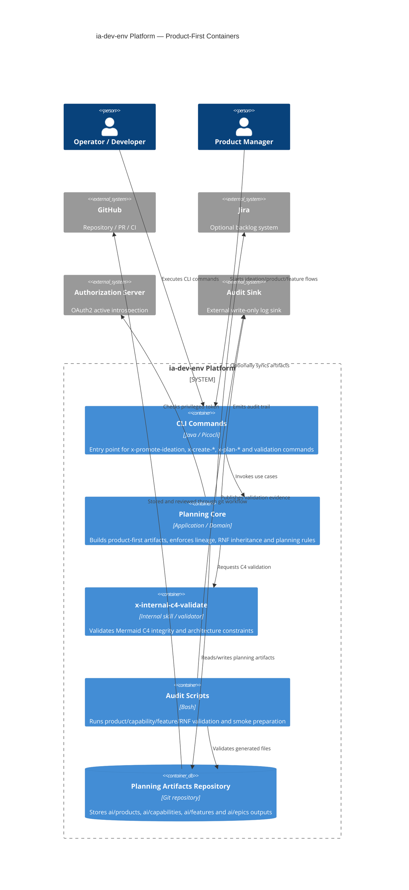

# C4 Containers — EPIC-0077 Product-First Lifecycle

```mermaid
C4Container
  title ia-dev-env Platform — Product-First Containers

  Person(operator, "Operator / Developer")
  Person(pm, "Product Manager")

  System_Ext(github, "GitHub", "Repository / PR / CI")
  System_Ext(jira, "Jira", "Optional backlog system")
  System_Ext(auth, "Authorization Server", "OAuth2 active introspection")
  System_Ext(audit, "Audit Sink", "External write-only log sink")

  System_Boundary(platform, "ia-dev-env Platform") {
    Container(cli, "CLI Commands", "Java / Picocli", "Entry point for x-promote-ideation, x-create-*, x-plan-* and validation commands")
    Container(planningCore, "Planning Core", "Application / Domain", "Builds product-first artifacts, enforces lineage, RNF inheritance and planning rules")
    Container(c4Validator, "x-internal-c4-validate", "Internal skill / validator", "Validates Mermaid C4 integrity and architecture constraints")
    Container(auditScripts, "Audit Scripts", "Bash", "Runs product/capability/feature/RNF validation and smoke preparation")
    ContainerDb(repoArtifacts, "Planning Artifacts Repository", "Git repository", "Stores ai/products, ai/capabilities, ai/features and ai/epics outputs")
  }

  Rel(operator, cli, "Executes CLI commands")
  Rel(pm, cli, "Starts ideation/product/feature flows")
  Rel(cli, planningCore, "Invokes use cases")
  Rel(planningCore, repoArtifacts, "Reads/writes planning artifacts")
  Rel(planningCore, c4Validator, "Requests C4 validation")
  Rel(planningCore, auth, "Checks privileged token")
  Rel(planningCore, audit, "Emits audit trail")
  Rel(auditScripts, repoArtifacts, "Validates generated files")
  Rel(auditScripts, audit, "Publishes validation evidence")
  Rel(repoArtifacts, github, "Stored and reviewed through git workflow")
  Rel(planningCore, jira, "Optionally syncs artifacts")
```
