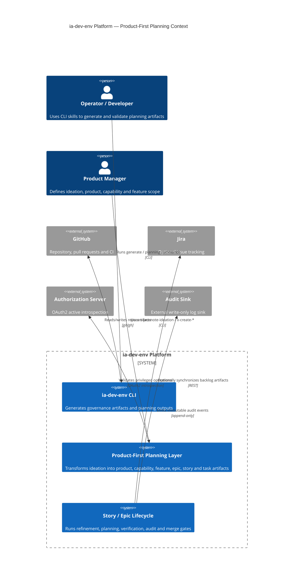

# C4 System Context — EPIC-0077 Product-First Lifecycle

```mermaid
C4Context
  title ia-dev-env Platform — Product-First Planning Context

  Person(operator, "Operator / Developer", "Uses CLI skills to generate and validate planning artifacts")
  Person(pm, "Product Manager", "Defines ideation, product, capability and feature scope")

  System_Boundary(platform, "ia-dev-env Platform") {
    System(generator, "ia-dev-env CLI", "Generates governance artifacts and planning outputs")
    System(planning, "Product-First Planning Layer", "Transforms ideation into product, capability, feature, epic, story and task artifacts")
    System(lifecycle, "Story / Epic Lifecycle", "Runs refinement, planning, verification, audit and merge gates")
  }

  System_Ext(github, "GitHub", "Repository, pull requests and CI")
  System_Ext(jira, "Jira", "Optional issue tracking")
  System_Ext(auth, "Authorization Server", "OAuth2 active introspection")
  System_Ext(audit, "Audit Sink", "External write-only log sink")

  Rel(operator, generator, "Runs generate / planning commands", "CLI")
  Rel(pm, planning, "Uses x-promote-ideation / x-create-*", "CLI")
  Rel(generator, github, "Reads/writes repo artifacts", "git/gh")
  Rel(planning, auth, "Validates privileged operations", "OAuth2 introspection")
  Rel(lifecycle, audit, "Emits immutable audit events", "append-only")
  Rel(lifecycle, jira, "Optionally synchronizes backlog artifacts", "REST")
```

