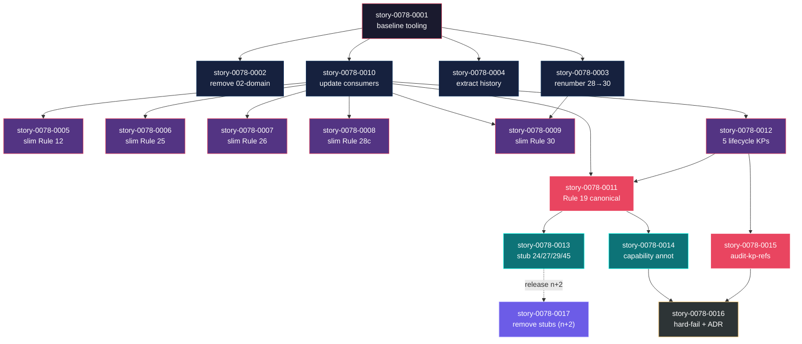

# Mapa de Implementação — EPIC-0078 Context Budget Optimization

**Gerado a partir das dependências BlockedBy/Blocks de cada história do epic-0078.**

---

## 0. Cross-Epic Landscape

> **EPIC-0078 Context — Last 10 Epics**

### Recent Epics Status (Latest 10)

| Epic ID   | Title                                          | Status      | Branch        | Last Story          | Safe to Cite? |
| :-------- | :--------------------------------------------- | :---------- | :------------ | :------------------ | :------------ |
| EPIC-0077 | (registered placeholder)                        | Em Andamento | epic/0077    | TBD                 | Citar apenas via Rule/ADR mergeada em develop |
| EPIC-0076 | Cross-Epic Dependency Awareness                 | Em Andamento | epic/0076    | TBD                 | Section 0.5 of `_TEMPLATE-EPIC.md` é fonte canônica |
| EPIC-0075 | (in progress)                                   | Em Andamento | epic/0075    | TBD                 | — |
| EPIC-0069 | Story Refinement & DoR Gate                     | Concluída   | merged       | story-0069-0007     | Rule 29 + `enforce-refinement-gate.sh` (mergeados) |
| EPIC-0068 | Continuous-Flow Heartbeat Hook                  | Concluída   | merged       | story-0068-0001     | `enforce-continuous-flow.sh` referenciável |
| EPIC-0066 | PR-body backlog rendering                       | Concluída   | merged       | story-0066-0007     | `audit-pr-template.sh` + `x-internal-pr-body-render` |
| EPIC-0065 | Feature Creation Chain Refactor                 | Concluída   | merged       | story-0065-0009     | Rule 19 §Hard-cut, Rule 22 internals |
| EPIC-0064 | Capability-Driven Composition Refactor          | Em Andamento | epic/0064    | story-0064-0408    | Phase 2 in flight — story-0078-0014 gated nesta epic |
| EPIC-0063 | Local-First Pre-Flight Gates                    | Concluída   | merged       | story-0063-0021     | Rule 24 §Camada 0, `enforce-preflight-gates.sh` |
| EPIC-0061 | Local-First Lifecycle                           | Concluída   | merged       | story-0061-0006     | Rule 26 Camada 0, `flowVersion: "3"` |

---

## 1. Matriz de Dependências

| Story            | Título                                                                              | Chave Jira | Blocked By                          | Blocks                                          | Status   |
| :--------------- | :---------------------------------------------------------------------------------- | :--------- | :---------------------------------- | :---------------------------------------------- | :------- |
| story-0078-0001  | Baseline tooling: measure-context-budget.sh + audit advisory                         | TBD        | —                                   | 0002, 0003, 0004, 0010                          | Pendente |
| story-0078-0002  | Remove `02-domain.md` from `RulesAssembler`                                          | TBD        | 0001                                | —                                               | Pendente |
| story-0078-0003  | Renumerar `30-tool-call-grammar.md` → `30-tool-call-grammar.md` (atomic)            | TBD        | 0001                                | 0009                                            | Pendente |
| story-0078-0004  | Extrair histórico de epics do CLAUDE.md → `docs/epics-history.md`                   | TBD        | 0001                                | —                                               | Pendente |
| story-0078-0005  | Slim Rule 12 → KP `knowledge/security/anti-patterns/`                                | TBD        | 0010                                | —                                               | Pendente |
| story-0078-0006  | Slim Rule 25 → KP `knowledge/lifecycle/task-hierarchy.md`                            | TBD        | 0010                                | —                                               | Pendente |
| story-0078-0007  | Slim Rule 26 → KP `knowledge/governance/audit-gate-lifecycle.md`                    | TBD        | 0010                                | —                                               | Pendente |
| story-0078-0008  | Slim Rule 28-capability → KP `knowledge/governance/capability-composition.md`        | TBD        | 0010                                | —                                               | Pendente |
| story-0078-0009  | Slim Rule 30 → KP `knowledge/governance/tool-call-grammar.md`                        | TBD        | 0003, 0010                          | —                                               | Pendente |
| story-0078-0010  | Update consumer skills com `Read <KP-path>` explícito                               | TBD        | 0001                                | 0005, 0006, 0007, 0008, 0009, 0011, 0012        | Pendente |
| story-0078-0011  | Reescrever Rule 19 como Lifecycle Integrity Contract canônico                        | TBD        | 0010, 0012                          | 0013, 0014                                      | Pendente |
| story-0078-0012  | Criar 5 KPs lifecycle                                                               | TBD        | 0010                                | 0011, 0013, 0015                                | Pendente |
| story-0078-0013  | Stub Rules 24/27/29/45 com deprecation window                                        | TBD        | 0011                                | 0017                                            | Pendente |
| story-0078-0014  | Anotar `requires-capabilities` em rules; pruning advisory                            | TBD        | 0011, EPIC-0064 P2 stable           | 0016                                            | Pendente |
| story-0078-0015  | `audit-kp-references.sh` (KP órfão)                                                  | TBD        | 0012                                | 0016                                            | Pendente |
| story-0078-0016  | Hard-fail `audit-context-budget.sh` + ADR + `_TEMPLATE-RULE.md`                     | TBD        | 0014, 0015                          | —                                               | Pendente |
| story-0078-0017  | Remover stubs de Rules 24/27/29/45 (release n+2)                                     | TBD        | 0013 + 2 releases elapsed           | —                                               | Pendente |

> **Valores de Status:** `Pendente` (padrão) · `Em Andamento` · `Concluída` · `Falha` · `Bloqueada` · `Parcial`

> **Nota:** story-0078-0017 carrega gate temporal ("release n+2 reached"). Implementação só pode iniciar após 2 releases tagged em `main` contendo story-0078-0013. Pre-flight verification documentada no DoR de story-0078-0017.

---

## 2. Fases de Implementação

```
╔══════════════════════════════════════════════════════════════════════════╗
║                   FASE 0 — Instrumentação (1 paralela)                  ║
║                                                                          ║
║   ┌────────────────────┐                                                 ║
║   │  story-0078-0001   │  measure-context-budget.sh + audit advisory    ║
║   └─────────┬──────────┘                                                 ║
╚═════════════╪════════════════════════════════════════════════════════════╝
              │
              ▼
╔══════════════════════════════════════════════════════════════════════════╗
║                   FASE 1 — Cleanup Imediato (4 paralelas)               ║
║                                                                          ║
║   ┌────────────────────┐  ┌────────────────────┐  ┌────────────────────┐║
║   │  story-0078-0002   │  │  story-0078-0003   │  │  story-0078-0004   │║
║   │  remove domain.md  │  │  renumerar 28→30   │  │  extrair history   │║
║   └────────────────────┘  └─────────┬──────────┘  └────────────────────┘║
║                                                                          ║
║                          ┌────────────────────┐                         ║
║                          │  story-0078-0010   │                         ║
║                          │  update consumers  │                         ║
║                          └─────────┬──────────┘                         ║
╚════════════════════════════════════╪═════════════════════════════════════╝
                                     │
                                     ▼
╔══════════════════════════════════════════════════════════════════════════╗
║                   FASE 2 — Slim Rules + KPs (6 paralelas)               ║
║                                                                          ║
║   ┌──────────┐ ┌──────────┐ ┌──────────┐ ┌──────────┐ ┌──────────┐    ║
║   │   0005   │ │   0006   │ │   0007   │ │   0008   │ │   0009   │    ║
║   │ Rule 12  │ │ Rule 25  │ │ Rule 26  │ │ Rule 28c │ │ Rule 30  │    ║
║   └──────────┘ └──────────┘ └──────────┘ └──────────┘ └──────────┘    ║
║                                                                          ║
║                          ┌────────────────────┐                         ║
║                          │  story-0078-0012   │                         ║
║                          │  5 lifecycle KPs   │                         ║
║                          └─────────┬──────────┘                         ║
╚════════════════════════════════════╪═════════════════════════════════════╝
                                     │
                                     ▼
╔══════════════════════════════════════════════════════════════════════════╗
║                   FASE 3 — Lifecycle Consolidation (2 paralelas)        ║
║                                                                          ║
║   ┌────────────────────┐                ┌────────────────────┐          ║
║   │  story-0078-0011   │                │  story-0078-0015   │          ║
║   │  Rule 19 canonical │                │  audit-kp-refs.sh  │          ║
║   └─────────┬──────────┘                └─────────┬──────────┘          ║
╚═════════════╪═══════════════════════════════════════╪═══════════════════╝
              │                                       │
              ▼                                       │
╔══════════════════════════════════════════════════════════════════════════╗
║                   FASE 4 — Stubs + Capability (2 paralelas)             ║
║                                                                          ║
║   ┌────────────────────┐                ┌────────────────────┐          ║
║   │  story-0078-0013   │                │  story-0078-0014   │          ║
║   │  stub 24/27/29/45  │                │  capability annot. │          ║
║   └─────────┬──────────┘                └─────────┬──────────┘          ║
╚═════════════╪═══════════════════════════════════════╪═══════════════════╝
              │                                       │
              │                                       ▼
              │                          ╔═══════════════════════════════╗
              │                          ║ FASE 5 — Hardening (1)       ║
              │                          ║                              ║
              │                          ║  ┌────────────────────────┐ ║
              │                          ║  │  story-0078-0016       │ ║
              │                          ║  │  hard-fail + ADR + tpl │ ║
              │                          ║  └────────────────────────┘ ║
              │                          ╚═══════════════════════════════╝
              │
              ▼ (after release n+2)
╔══════════════════════════════════════════════════════════════════════════╗
║              FASE 6 — Sunset (1, gated temporal)                        ║
║                                                                          ║
║                          ┌────────────────────┐                         ║
║                          │  story-0078-0017   │                         ║
║                          │  remove stubs      │                         ║
║                          └────────────────────┘                         ║
╚══════════════════════════════════════════════════════════════════════════╝
```

---

## 3. Caminho Crítico

```
0001 ──→ 0010 ──→ 0012 ──→ 0011 ──→ 0013 ──→ (2 releases) ──→ 0017
                                ╲
                                 ╲──→ 0014 ──→ 0016
   Fase 0   Fase 1   Fase 2    Fase 3    Fase 4         Fase 6
```

**6 fases no caminho crítico (sem contar gate temporal), 7 histórias na cadeia mais longa: `0001 → 0010 → 0012 → 0011 → 0013 → (release window) → 0017`.**

A cadeia 0001→0010→0012→0011→0014→0016 (até o hardening) é a entrega mensurável de redução de tokens. Atrasos em qualquer um desses 6 nós empurram o ganho de –30k tokens.

A finalização total (release de –48k tokens) só fecha após story-0078-0017 — gated em duas releases reais (n+2). Atrasos em story-0078-0013 puxam a janela inteira: cada semana de atraso em 0013 desloca 0017 em ≥2 semanas (uma release ≈ 1-2 semanas no projeto).

---

## 4. Grafo de Dependências (Mermaid)



---

## 5. Resumo por Fase

| Fase | Histórias                                                  | Camada                              | Paralelismo | Pré-requisito                                  |
| :--- | :--------------------------------------------------------- | :---------------------------------- | :---------- | :--------------------------------------------- |
| 0    | 0001                                                       | Instrumentação / Baseline           | 1           | —                                              |
| 1    | 0002, 0003, 0004, 0010                                     | Cleanup + Skills update             | 4 paralelas | Fase 0 concluída                               |
| 2    | 0005, 0006, 0007, 0008, 0009, 0012                         | Slim Rules / KPs criação            | 6 paralelas | Fase 1 concluída                               |
| 3    | 0011, 0015                                                 | Lifecycle consolidation / KP audit  | 2 paralelas | Fase 2 concluída                               |
| 4    | 0013, 0014                                                 | Stubs + Capability annotation       | 2 paralelas | Fase 3 (0011) concluída + EPIC-0064 P2 stable  |
| 5    | 0016                                                       | Hardening                            | 1           | Fase 4 (0014) + Fase 3 (0015) concluídas       |
| 6    | 0017                                                       | Sunset (gated temporal)             | 1           | Fase 4 (0013) + 2 releases tagged              |

**Total: 17 histórias em 7 fases (Fase 6 com gate temporal).**

> **Nota:** story-0078-0009 tem dependência cruzada de Fase 1 (0003) e de Fase 1 (0010). Ambas terminam na mesma fase, então 0009 entra naturalmente em Fase 2. story-0078-0014 depende externamente de EPIC-0064 Phase 2 — se EPIC-0064 atrasar, 0014 e por consequência 0016 ficam blocked. Mitigação: 0014 pode entrar em modo `warn-only` antecipado declarando capability `[]` em todas rules até EPIC-0064 estabilizar (RULE-006 fail-open).

---

## 6. Detalhamento por Fase

### Fase 0 — Instrumentação

| Story            | Escopo Principal                                                      | Artefatos Chave                                                                                          |
| :--------------- | :-------------------------------------------------------------------- | :------------------------------------------------------------------------------------------------------- |
| story-0078-0001  | Mensurar baseline e estabelecer audit advisory antes de qualquer slim. | `scripts/measure-context-budget.sh`, `scripts/audit-context-budget.sh`, `governance/baselines/context-budget.json`, `ContextBudgetAuditorTest.java`. |

**Entregas da Fase 0:**

- Baseline numérica reprodutível (~52k tokens always-loaded, em JSON).
- Audit advisory rodando em CI (warn-only).
- Java audit harness para validação.

### Fase 1 — Cleanup + Skills update

| Story            | Escopo Principal                                          | Artefatos Chave                                                                                  |
| :--------------- | :-------------------------------------------------------- | :----------------------------------------------------------------------------------------------- |
| story-0078-0002  | Remover template não-preenchido `02-domain.md`.            | `RulesAssembler.java` (skip), deleção em `targets/claude/rules/`, profile YAMLs atualizados.    |
| story-0078-0003  | Renumeração atômica 28→30.                                 | `30-tool-call-grammar.md` (renomeada), sed em todos refs, goldens regenerados.                  |
| story-0078-0004  | Extrair histórico de epics do CLAUDE.md.                   | `docs/epics-history.md` (novo), `targets/claude/CLAUDE.md` (slim, ≤200 linhas).                 |
| story-0078-0010  | Adicionar `Read <KP-path>` em skills consumidoras.         | SKILL.md de `x-review-security`, `x-owasp-scan`, `x-threat-model`, etc. Smoke test.             |

**Entregas da Fase 1:**

- –9k tokens always-loaded mensurados via `audit-context-budget.sh` (advisory).
- Numeração de rules higienizada (zero ambiguidade 28).
- Skills consumidoras prontas para o slim das rules na Fase 2 (RULE-007 satisfeito).

### Fase 2 — Slim Rules + Criação de KPs

| Story            | Escopo Principal                                                                  | Artefatos Chave                                                                                                       |
| :--------------- | :-------------------------------------------------------------------------------- | :-------------------------------------------------------------------------------------------------------------------- |
| story-0078-0005  | Migrar 8 anti-patterns Java para `knowledge/security/anti-patterns/j{1..8}-*.md`. | KP files novos, Rule 12 reduzida ≤30 linhas, `KnowledgePacksAssembler` nova categoria.                               |
| story-0078-0006  | BNF + tabelas de Rule 25 → `knowledge/lifecycle/task-hierarchy.md`.                | KP novo, Rule 25 ≤60 linhas.                                                                                           |
| story-0078-0007  | Decision tree + naming completo de Rule 26 → `knowledge/governance/audit-gate-lifecycle.md`. | KP novo, Rule 26 ≤50 linhas.                                                                                           |
| story-0078-0008  | YAML examples de Rule 28-capability → `knowledge/governance/capability-composition.md`. | KP novo, Rule 28-capability ≤60 linhas.                                                                                |
| story-0078-0009  | BNF + exemplos de Rule 30 → `knowledge/governance/tool-call-grammar.md`.            | KP novo, Rule 30 ≤50 linhas.                                                                                           |
| story-0078-0012  | Hospedar matrizes de Rules 19/24/27/29/45 em 5 KPs.                                 | `knowledge/lifecycle/{backward-compatibility,execution-integrity,zero-bypass,refinement-gate,ci-watch-integrity}.md`. |

**Entregas da Fase 2:**

- –12k tokens always-loaded adicionais mensurados.
- Todos os KPs criados sob convenção `knowledge/{security,lifecycle,governance}/`.

### Fase 3 — Lifecycle consolidation + KP audit

| Story            | Escopo Principal                                              | Artefatos Chave                                                                          |
| :--------------- | :------------------------------------------------------------ | :--------------------------------------------------------------------------------------- |
| story-0078-0011  | Rule 19 reescrita como Lifecycle Integrity Contract canônico. | `19-lifecycle-integrity.md` (≤80 linhas), `RulesAssembler` ajustado, goldens regenerados. |
| story-0078-0015  | `audit-kp-references.sh` para detectar KP órfãos.              | Script novo + `KpReferencesAuditorTest.java` + entrada em audit catalog.                  |

**Entregas da Fase 3:**

- Fonte única para 12 superfícies + 5 camadas de lifecycle.
- Garantia mecânica de que todo KP é referenciado.

### Fase 4 — Stubs + Capability annotation

| Story            | Escopo Principal                                                       | Artefatos Chave                                                                  |
| :--------------- | :--------------------------------------------------------------------- | :------------------------------------------------------------------------------- |
| story-0078-0013  | Reduzir Rules 24/27/29/45 a stubs de 10 linhas.                         | 4 rules editadas, audit catalog atualizado, smoke test de hooks/audits green.   |
| story-0078-0014  | `requires-capabilities` em rules + advisory pruning no `CapabilityAwareComposer`. | Frontmatter de rules atualizado, composer ajustado, profile YAMLs validados.    |

**Entregas da Fase 4:**

- Deprecation window iniciada (Rules 24/27/29/45 em sunset).
- Pruning advisory ativo (warn-only) para rules condicionais.

### Fase 5 — Hardening

| Story            | Escopo Principal                                                                       | Artefatos Chave                                                              |
| :--------------- | :------------------------------------------------------------------------------------- | :--------------------------------------------------------------------------- |
| story-0078-0016  | Hard-fail `audit-context-budget.sh` (limite 25.000), ADR, `_TEMPLATE-RULE.md`.         | Script atualizado, `docs/adr/ADR-NNNN`, `_TEMPLATE-RULE.md`, CHANGELOG.md.   |

**Entregas da Fase 5:**

- Cristalização permanente da convenção via ADR.
- Bloqueio mecânico contra regressão futura.

### Fase 6 — Sunset (gated temporal)

| Story            | Escopo Principal                                                          | Artefatos Chave                                                              |
| :--------------- | :------------------------------------------------------------------------ | :--------------------------------------------------------------------------- |
| story-0078-0017  | Remoção definitiva dos stubs após release n+2.                             | 4 stub files deletados, `RulesAssembler` ajustado, goldens regenerados.      |

**Entregas da Fase 6:**

- –18k tokens always-loaded liberados permanentemente.
- Total cumulativo: –30k tokens (de 52k para 22k, alvo do epic atingido).

---

## 7. Observações Estratégicas

### Gargalo Principal

**story-0078-0010 (Update consumer skills)** é o gargalo dominante. Ela bloqueia 7 stories (todas as de slim na Fase 2 + 0011 + 0012). Investir tempo em torná-la robusta — com automação para descobrir consumidores via `grep` e gerar PRs incrementais por skill — paga dividendo em paralelismo da Fase 2.

**story-0078-0011 (Rule 19 rewrite)** é o segundo gargalo. Ela bloqueia 0013 e 0014 (toda a Fase 4). Se estourar SLA, atrasa também 0016 e empurra 0017 fora da janela de release n+2.

### Histórias Folha (sem dependentes)

- story-0078-0002 (remove 02-domain.md) — dispensável paralelizar; entrega isolada.
- story-0078-0004 (extract history) — independente; pode rodar paralelo.
- story-0078-0005, 0006, 0007, 0008, 0009 — todas folhas após 0010. Idealmente paralelas em uma única fase.
- story-0078-0016 — folha do ramo de hardening.

Histórias folha absorvem atraso sem impacto no caminho crítico.

### Otimização de Tempo

- **Paralelismo máximo:** Fase 2 com 6 stories paralelas (0005, 0006, 0007, 0008, 0009, 0012). Requer 6 worktrees ou execução serial bem-orquestrada.
- **Que pode começar imediatamente:** story-0078-0001 sozinha em Fase 0. Sem ela, todo o resto é especulativo.
- **Alocação:** dedicar 1 dev sênior a 0010 + 0011 + 0012 (caminho crítico); demais stories podem ir para devs juniores ou agentes em paralelo após 0010.

### Dependências Cruzadas

- **0009 cruza ramos:** depende de 0003 (renumeração) AND 0010 (skills update). Convergência em Fase 2.
- **0011 cruza ramos:** depende de 0010 (skills) AND 0012 (KPs). Convergência em Fase 3.
- **0016 cruza ramos:** depende de 0014 (capability) AND 0015 (kp-refs audit). Convergência em Fase 5.
- **EPIC-0064 P2 stable:** dependência externa real para 0014. Mitigação documentada (warn-only inicial).

### Marco de Validação Arquitetural

**story-0078-0011 (Rule 19 canonical)** é o checkpoint crítico. Após sua merge, a estrutura "rules curtas + KPs lazy" está provada em produção para o caso mais complexo (5 rules consolidadas). Se este marco passa com smoke tests green, todos os outros slims (Fase 2) ganham confiança. Falha aqui exige revisão da estratégia antes de continuar Fase 4.

---

## 8. Dependências entre Tasks (Cross-Story)

> Esta seção é gerada automaticamente quando as histórias contêm tasks formais com IDs `TASK-XXXX-YYYY-NNN`. As 17 histórias deste épico contêm tasks formais — análise cruzada parcial:

### 8.1 Dependências Cross-Story entre Tasks

| Task                       | Depends On                | Story Source     | Story Target     | Tipo       |
| :------------------------- | :------------------------ | :--------------- | :--------------- | :--------- |
| TASK-0078-0009-002         | TASK-0078-0003-002        | story-0078-0009  | story-0078-0003  | config     |
| TASK-0078-0011-001         | TASK-0078-0012-002        | story-0078-0011  | story-0078-0012  | data       |
| TASK-0078-0013-001         | TASK-0078-0011-003        | story-0078-0013  | story-0078-0011  | interface  |
| TASK-0078-0016-001         | TASK-0078-0014-003        | story-0078-0016  | story-0078-0014  | config     |
| TASK-0078-0016-002         | TASK-0078-0015-002        | story-0078-0016  | story-0078-0015  | schema     |
| TASK-0078-0017-001         | TASK-0078-0013-002        | story-0078-0017  | story-0078-0013  | interface  |

> **Validação RULE-012:** Todas as dependências cross-story estão alinhadas com as dependências de história declaradas na seção 1. Não há dependências de task que violem o DAG da story.

### 8.2 Ordem de Merge (Topological Sort)

> Detalhamento completo de ordem de merge será produzido por `x-epic-orchestrate` ou `x-epic-implement` Phase 1 a partir do parsing dos blocos `### 9.2 Tasks` de cada history. Aqui registramos apenas a fase de cada story para referência rápida:

| Ordem | Story            | Fase | Parallelizável Com                                          |
| :---- | :--------------- | :--- | :---------------------------------------------------------- |
| 1     | story-0078-0001  | 0    | —                                                           |
| 2-5   | 0002, 0003, 0004, 0010 | 1    | entre si                                                    |
| 6-11  | 0005, 0006, 0007, 0008, 0009, 0012 | 2    | entre si                                                    |
| 12-13 | 0011, 0015       | 3    | entre si                                                    |
| 14-15 | 0013, 0014       | 4    | entre si (0014 sujeita a EPIC-0064 P2)                       |
| 16    | 0016             | 5    | —                                                           |
| 17    | 0017             | 6    | gated temporal                                              |

**Total: 17 stories em 7 fases (~50-65 tasks estimadas no total agregado).**

---

## 8.5 Restrições de Paralelismo

<!--
  Seção gerada por estimativa manual baseada em File Footprints declarados.
  A análise final será re-executada por /x-parallel-eval --scope=epic durante
  Phase 0.5 de x-epic-implement.
-->

> Análise estimada manualmente em 2026-04-30. `/x-parallel-eval --scope=epic` deve re-validar antes da execução.

**Conflitos detectados (estimativa):** 3 hard, 1 regen, 0 soft

### 8.5.1 Pares Serializados Dentro da Fase

| Fase    | A                | B                | Categoria | Motivo                                                                                                |
| :------ | :--------------- | :--------------- | :-------- | :---------------------------------------------------------------------------------------------------- |
| Fase 1  | story-0078-0002  | story-0078-0003  | hard      | Ambas tocam `RulesAssembler.java` (one removes domain skip, other touches rule numbering refs).        |
| Fase 1  | story-0078-0002  | story-0078-0010  | regen     | Ambas regeneram `src/test/resources/golden/**/.claude/rules/` para 11 profiles.                        |
| Fase 2  | story-0078-0005  | story-0078-0012  | hard      | Ambas tocam `KnowledgePacksAssembler.java` (nova categoria `security/anti-patterns` vs `lifecycle`).   |
| Fase 4  | story-0078-0013  | story-0078-0014  | hard      | Ambas tocam frontmatter de Rules 24/27/29/45 (stub vs `requires-capabilities` annotation).            |

### 8.5.2 Recomendação de Reagrupamento

**Fase 1:** serializar (0002 → 0003 → 0010), depois 0004 paralela (não toca assembler). Subordem por blast radius: 0002 primeiro (delete + assembler skip), 0003 atomic rename, 0010 mass skill edits (touch ~10 SKILL.md).

**Fase 2:** serializar (0005 → 0012) em pair, demais (0006, 0007, 0008, 0009) paralelas — só tocam rule files individuais sem assembler change.

**Fase 4:** serializar (0013 → 0014). 0013 transforma rules em stubs, 0014 anota frontmatter — é frágil paralelizar edits no mesmo arquivo.

**Fase 0/3/5/6:** sem conflitos detectados.
