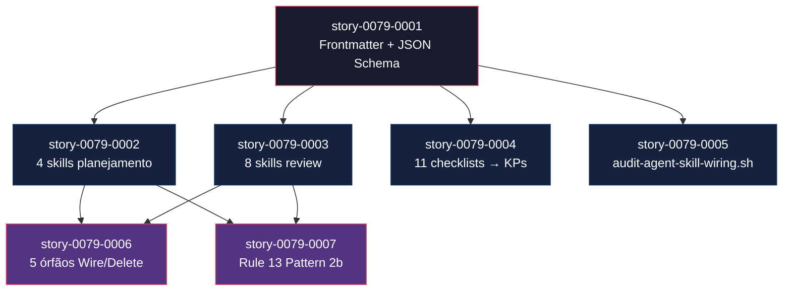

# Mapa de Implementação — EPIC-0079 Native Agent–Skill Wiring & Cleanup

**Gerado a partir das dependências BlockedBy/Blocks de cada história do epic-0079.**

---

## 0. Cross-Epic Landscape

### Recent Epics Status (Latest 5 relevantes)

| Epic ID | Title | Status | Safe to Cite? |
| :--- | :--- | :--- | :--- |
| EPIC-0078 | Context Budget Optimization | Concluída | Sim |
| EPIC-0077 | Product-First Lifecycle | Concluída | Sim |
| EPIC-0064 | Capability-Driven Composition | Concluída | Sim — frontmatter v3.0 |
| EPIC-0050 | Model Selection & Token Optimization | Concluída | Sim — Rule 23 |
| EPIC-0058 | Audit Gate Lifecycle | Concluída | Sim — Rule 26 patterns |

---

## 1. Matriz de Dependências

| Story | Título | Blocked By | Blocks | Status |
| :--- | :--- | :--- | :--- | :--- |
| story-0079-0001 | Formalizar frontmatter e JSON Schema | — | 0002, 0003, 0004, 0005, 0006 | Pendente |
| story-0079-0002 | Migrar 4 skills planejamento paralelo | 0001 | 0006, 0007 | Pendente |
| story-0079-0003 | Migrar 8 skills review especializado | 0001 | 0006, 0007 | Pendente |
| story-0079-0004 | Reclassificar 11 checklists como KPs | 0001 | — | Pendente |
| story-0079-0005 | Adicionar audit-agent-skill-wiring.sh | 0001 | — | Pendente |
| story-0079-0006 | Resolver 5 agentes órfãos | 0001, 0002, 0003 | — | Pendente |
| story-0079-0007 | Atualizar Rule 13 KP Pattern 2b | 0002, 0003 | — | Pendente |

---

## 2. Fases de Implementação

```
╔══════════════════════════════════════════════════════════════════════════╗
║           FASE 0 — Foundation (1 story, sequential)                    ║
║                                                                        ║
║   ┌────────────────────────────────────────────────────────────┐       ║
║   │  story-0079-0001 — Frontmatter + JSON Schema + audit script│       ║
║   │  (base obrigatória para todas as stories seguintes)        │       ║
║   └────────────────────────────┬───────────────────────────────┘       ║
╚════════════════════════════════╪═══════════════════════════════════════╝
                                 │
                ┌────────────────┼────────────────────────┐
                │                │                        │
                ▼                ▼                        ▼
╔══════════════════════════════════════════════════════════════════════════╗
║           FASE 1 — Migration Wave (4 stories, paralelo)                ║
║                                                                        ║
║  ┌────────────┐  ┌────────────┐  ┌────────────┐  ┌────────────┐      ║
║  │ story-0002 │  │ story-0003 │  │ story-0004 │  │ story-0005 │      ║
║  │  4 skills  │  │  8 skills  │  │ 11 checks  │  │  CI gate   │      ║
║  │ plan/refine│  │  review/*  │  │  → KPs     │  │  audit.sh  │      ║
║  └─────┬──────┘  └──────┬─────┘  └────────────┘  └────────────┘      ║
╚════════╪════════════════╪════════════════════════════════════════════╝
         │                │
         └────────┬────────┘
                  │
     ┌────────────┼────────────────┐
     │                             │
     ▼                             ▼
╔══════════════════════════════════════════════════════════════════════════╗
║           FASE 2 — Closure Wave (2 stories, paralelo)                  ║
║                                                                        ║
║   ┌──────────────────────────┐   ┌──────────────────────────┐         ║
║   │ story-0079-0006          │   │ story-0079-0007          │         ║
║   │ Resolver 5 órfãos        │   │ Rule 13 KP Pattern 2b    │         ║
║   │ (Wire ou Delete)         │   │ documentação normativa   │         ║
║   └──────────────────────────┘   └──────────────────────────┘         ║
╚══════════════════════════════════════════════════════════════════════════╝
```

---

## 3. Caminho Crítico

```
story-0079-0001 → story-0079-0002 ─┐
                                    ├──→ story-0079-0006
story-0079-0001 → story-0079-0003 ─┘
                                    
story-0079-0001 → story-0079-0002 ─┐
                                    ├──→ story-0079-0007
story-0079-0001 → story-0079-0003 ─┘

   Fase 0             Fase 1                Fase 2
```

**3 fases no caminho crítico. Cadeia mais longa: 0001 → 0002 → 0006 (ou 0007). Comprimento: 3 stories.**

O gargalo principal é story-0079-0001 (Fase 0): nenhuma outra story pode iniciar sem que o frontmatter e o schema estejam prontos. Investir tempo extra em 0001 tem retorno direto no paralelismo da Fase 1.

---

## 4. Grafo de Dependências (Mermaid)



---

## 5. Resumo por Fase

| Fase | Histórias | Camada | Paralelismo | Pré-requisito |
| :--- | :--- | :--- | :--- | :--- |
| 0 | story-0079-0001 | Doc / Config / Test | 1 (sequential) | — |
| 1 | story-0079-0002, 0003, 0004, 0005 | Config / Doc / Test | 4 paralelas | Fase 0 concluída |
| 2 | story-0079-0006, 0007 | Doc / Config | 2 paralelas | Fase 1: 0002 + 0003 concluídas |

**Total: 7 histórias em 3 fases.**

> **Nota:** As stories de Fase 1 podem iniciar em paralelo assim que story-0079-0001 for mergeada. Stories 0004 e 0005 são independentes de 0002 e 0003 entre si — paralelismo máximo de 4 na Fase 1.

---

## 6. Detalhamento por Fase

### Fase 0 — Foundation

| Story | Escopo Principal | Artefatos Chave |
| :--- | :--- | :--- |
| story-0079-0001 | Audit + schema + frontmatter de 17 agentes + audit script | `governance/schemas/agent-frontmatter-1.0.json`, `scripts/audit-agent-frontmatter.sh`, 17 `.md` atualizados |

**Entregas da Fase 0:**

- 17 agentes core/conditional/developers com frontmatter canônico completo
- JSON Schema validando contrato de frontmatter
- Script CI Camada 2 que detecta campos ausentes

### Fase 1 — Migration Wave

| Story | Escopo Principal | Artefatos Chave |
| :--- | :--- | :--- |
| story-0079-0002 | 4 skills planejamento migradas (~25 Agent() calls) | SKILL.md de x-plan-story, x-refine-epic, x-refine-story, x-internal-build-story-plan |
| story-0079-0003 | 8 skills review migradas (personas eliminadas) | SKILL.md de x-review-qa, performance, database, devops, security, api, observability, events |
| story-0079-0004 | 11 checklists reclassificados e generator atualizado | `knowledge/checklists/*.md` (11), golden files atualizados |
| story-0079-0005 | Gate CI de regressão implementado | `scripts/audit-agent-skill-wiring.sh`, `audits/agent-skill-wiring-baseline.txt` |

**Entregas da Fase 1:**

- Zero personas inline em todas as 12 skills migradas
- 11 knowledge packs corretos em `knowledge/checklists/`
- Gate CI previne regressão de persona inline

### Fase 2 — Closure Wave

| Story | Escopo Principal | Artefatos Chave |
| :--- | :--- | :--- |
| story-0079-0006 | 5 órfãos Wire ou Delete com razão documentada | Agentes wire: SKILL.md com callsite adicionado; agentes delete: commit com razão |
| story-0079-0007 | Rule 13 com Pattern 2b documentado | `rules/13-skill-invocation-protocol.md` atualizado |

**Entregas da Fase 2:**

- Zero agentes órfãos sem decisão documentada
- Rule 13 normaliza named dispatch como variante oficial

---

## 7. Observações Estratégicas

### Gargalo Principal

**story-0079-0001** é o gargalo: bloqueia 4 stories em paralelo na Fase 1. Deve ser priorizada e minimizada em escopo — o objetivo é apenas definir o schema e atualizar frontmatter, sem migrar skills. Garantir que a task de inventário (TASK-0079-0001-001) seja concluída rapidamente libera o planejamento detalhado das stories subsequentes.

### Histórias Folha (sem dependentes)

- **story-0079-0004**: Não bloqueia nenhuma outra story — pode ser distribuída para um engenheiro separado em paralelo com 0002/0003 sem risco de conflito de arquivo
- **story-0079-0005**: Igualmente folha — pode ser trabalhada em paralelo com qualquer story da Fase 1

### Otimização de Tempo

- **Paralelismo máximo (Fase 1):** Alocar 4 engenheiros simultâneos: um para 0002, um para 0003, um para 0004, um para 0005
- **Stories que podem começar imediatamente após 0001:** todas as 4 da Fase 1
- **Fase 2 pode iniciar parcialmente:** story-0079-0007 pode iniciar assim que 0002 E 0003 mergearem, sem esperar 0004 e 0005

### Dependências Cruzadas

- Stories 0006 e 0007 convergem nos resultados de 0002 e 0003 — ambas dependem que a migração de dispatch esteja completa para avaliar órfãos e documentar o padrão
- Story 0004 é completamente independente de 0002, 0003, 0006 e 0007 — pode ser trabalhada por uma track paralela sem conflito de arquivo

### Marco de Validação Arquitetural

**story-0079-0001** serve como checkpoint arquitetural antes da Migration Wave: após o merge, o team deve verificar que `audit-agent-frontmatter.sh --strict` retorna 17/17 agentes válidos antes de iniciar qualquer migração de skill. Esta verificação previne que skills migradas referenciem agentes com frontmatter incompleto.

---

## 8. Dependências entre Tasks (Cross-Story)

### 8.1 Dependências Cross-Story entre Tasks

| Task | Depends On | Story Source | Story Target | Tipo |
| :--- | :--- | :--- | :--- | :--- |
| TASK-0079-0002-002 | TASK-0079-0001-003 | story-0079-0001 | story-0079-0002 | schema/config |
| TASK-0079-0003-002 | TASK-0079-0001-003 | story-0079-0001 | story-0079-0003 | schema/config |
| TASK-0079-0005-002 | TASK-0079-0002-004 | story-0079-0002 | story-0079-0005 | baseline/config |
| TASK-0079-0005-002 | TASK-0079-0003-003 | story-0079-0003 | story-0079-0005 | baseline/config |
| TASK-0079-0006-001 | TASK-0079-0002-004 | story-0079-0002 | story-0079-0006 | data/interface |
| TASK-0079-0006-001 | TASK-0079-0003-003 | story-0079-0003 | story-0079-0006 | data/interface |

### 8.2 Ordem de Merge (Topological Sort)

| Ordem | Story | Parallelizável Com | Fase |
| :--- | :--- | :--- | :--- |
| 1 | story-0079-0001 | — | 0 |
| 2 | story-0079-0002 | 0003, 0004, 0005 | 1 |
| 2 | story-0079-0003 | 0002, 0004, 0005 | 1 |
| 2 | story-0079-0004 | 0002, 0003, 0005 | 1 |
| 2 | story-0079-0005 | 0002, 0003, 0004 | 1 |
| 3 | story-0079-0006 | 0007 | 2 |
| 3 | story-0079-0007 | 0006 | 2 |

**Total: 7 stories em 3 fases de execução. Máximo de 4 stories em paralelo (Fase 1).**

---

## 8.5 Restrições de Paralelismo

> Análise de colisão de arquivos entre stories paralelas da Fase 1.

**Conflitos detectados:** 0 hard, 0 regen, 1 soft

### 8.5.1 Pares Serializados Dentro da Fase

| Fase | A | B | Categoria | Motivo |
| :--- | :--- | :--- | :--- | :--- |
| 1 | story-0079-0002 | story-0079-0003 | soft | Ambas atualizam SKILL.md files mas em diretórios separados (`plan/` vs `review/`) — sem conflito real |

> Nenhum par requer serialização forçada. A colisão soft entre 0002 e 0003 é apenas observacional — os arquivos modificados são em diretórios distintos e não compartilhados.

### 8.5.2 Recomendação de Reagrupamento

Nenhuma colisão hard detectada. Paralelismo máximo da Fase 1 (4 simultâneas) é seguro.
