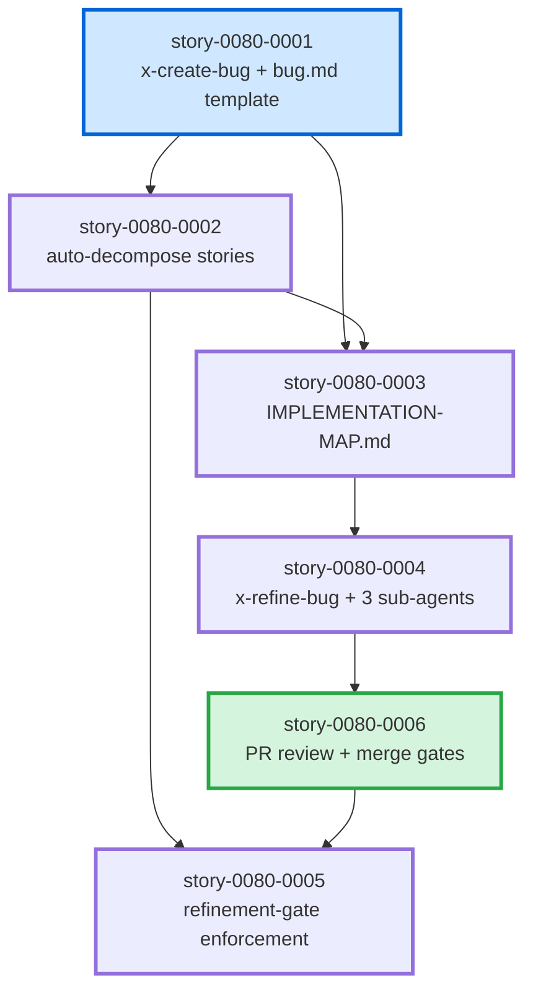

# Implementation Map — EPIC-0080 Bug Lifecycle Management

**Epic ID:** EPIC-0080
**Generated:** 2026-05-07
**Stories:** 6
**Strategy:** Sequential with one fan-out at story-0080-0001

---

## 1. Dependency Matrix (6×6)

Rows = predecessor; Columns = successor; `X` = direct dependency edge (predecessor must complete before successor starts).

| pred ↓ \ succ →     | 0080-0001 | 0080-0002 | 0080-0003 | 0080-0004 | 0080-0006 | 0080-0005 |
| :------------------ | :-------: | :-------: | :-------: | :-------: | :-------: | :-------: |
| **story-0080-0001** |     —     |     X     |     X     |           |           |           |
| **story-0080-0002** |           |     —     |     X     |           |           |     X     |
| **story-0080-0003** |           |           |     —     |     X     |           |           |
| **story-0080-0004** |           |           |           |     —     |     X     |           |
| **story-0080-0006** |           |           |           |           |     —     |     X     |
| **story-0080-0005** |           |           |           |           |           |     —     |

Legend:
- `0080-0001` blocks `0080-0002` (story decomposition needs the bug.md template) and `0080-0003` (the map needs the folder layout).
- `0080-0002` blocks `0080-0003` (map aggregates story files) and `0080-0005` (gate scans story files — indirect, via 0080-0006).
- `0080-0003` blocks `0080-0004` (refinement reads the map).
- `0080-0004` blocks `0080-0006` (PR review gate is next in the lifecycle chain; merge strategy R-080-6 must be active before the Camada 0 enforcement hook runs).
- `0080-0006` blocks `0080-0005` (Camada 0 hook enforcement requires R-080-6 merge strategy to be deployed first so the audit signal is meaningful from day one).
- No cycles. DAG verified via Kahn topological sort. Corrected order per Risk-3: `0080-0001 → 0080-0002 → 0080-0003 → 0080-0004 → 0080-0006 → 0080-0005`.

## 2. Phase Diagram (ASCII)

```
                    ┌──────────────────┐
                    │  Phase 1: Foundation
                    │  story-0080-0001 │
                    │  /x-create-bug   │
                    │   + bug.md tpl   │
                    └────────┬─────────┘
                             │
            ┌────────────────┴────────────────┐
            │                                 │
            v                                 v
   ┌──────────────────┐              ┌──────────────────┐
   │ Phase 2a: Decompose             │ (parallelizable
   │ story-0080-0002  │              │  with 2a in
   │  auto-stories    │              │  principle, but
   │                  │              │  see note below)
   └────────┬─────────┘              └──────────────────┘
            │
            v
   ┌──────────────────┐
   │  Phase 2b: Map   │
   │  story-0080-0003 │
   │  IMPL-MAP gen    │
   └────────┬─────────┘
            │
            v
   ┌──────────────────┐
   │  Phase 3: Refine │
   │  story-0080-0004 │
   │  /x-refine-bug   │
   └────────┬─────────┘
            │
            v
   ┌──────────────────┐
   │  Phase 4: PR     │
   │  story-0080-0006 │
   │  review + merge  │
   └────────┬─────────┘
            │
            v
   ┌──────────────────┐
   │  Phase 5: Gate   │
   │  story-0080-0005 │
   │  Camada 0 + 2    │
   └──────────────────┘
```

**Note on parallelism:** Story-0080-0003 cannot run in parallel with 0080-0002 because the
map aggregates the very story files that 0080-0002 produces. The diagram is therefore
effectively sequential after the foundation. No `x-evaluate-parallelism` collision matrix
is needed — file-touch sets do not overlap meaningfully because each story owns disjoint
skill folders.

## 3. Critical Path Analysis

The critical path is the longest chain of dependencies from start to finish:

```
story-0080-0001  →  story-0080-0002  →  story-0080-0003  →  story-0080-0004  →  story-0080-0006  →  story-0080-0005
   (Phase 1)        (Phase 2a)          (Phase 2b)          (Phase 3)            (Phase 4)            (Phase 5)
```

**Length:** 6 stories — all stories are on the critical path. There is no float / slack
in this epic; any story slip directly delays the epic.

**Estimated cycle time per story** (rough; will be refined during `/x-refine-story` per
story): 1.5 - 3 days each → epic cycle time approximately 2 - 3 weeks at 1 dev capacity,
1 - 1.5 weeks at 2 devs limited by dependency chain (the chain prevents pure parallelization).

**Bottleneck:** Story-0080-0004 (`/x-refine-bug` skill with 3 sub-agents) is the largest
single story by task count (8 tasks, including 3 new agent persona files). Schedule
flexibility should be reserved here.

## 4. Mermaid Dependency Graph



## 5. Phase Summary Tables

### Phase 1 — Foundation

| Story            | Persona   | Tasks | Key Deliverables                                              |
| :--------------- | :-------- | :---: | :------------------------------------------------------------ |
| story-0080-0001  | Developer |   7   | `_TEMPLATE-BUG.md`, `x-create-bug` skill, `bug-lifecycle.yaml` capability, `audit-bug-classification.sh`. |

### Phase 2 — Decomposition + Map

| Story            | Persona   | Tasks | Key Deliverables                                              |
| :--------------- | :-------- | :---: | :------------------------------------------------------------ |
| story-0080-0002  | Developer |   7   | `_TEMPLATE-BUG-STORY.md`, `x-internal-decompose-bug` skill, decomposition rules table. |
| story-0080-0003  | Developer |   7   | `_TEMPLATE-BUG-IMPLEMENTATION-MAP.md`, `x-internal-map-bug` skill with Kahn topo + Mermaid generation. |

### Phase 3 — Refinement

| Story            | Persona   | Tasks | Key Deliverables                                              |
| :--------------- | :-------- | :---: | :------------------------------------------------------------ |
| story-0080-0004  | Tech Lead |   8   | `x-refine-bug` skill, 3 agent personas (Developer/Tech-Lead/QA), verdictHash schema. |

### Phase 4 — PR Lifecycle

| Story            | Persona  | Tasks | Key Deliverables                                              |
| :--------------- | :------- | :---: | :------------------------------------------------------------ |
| story-0080-0006  | Engineer |  10   | Extended `x-review-pr` checklist (BR-PR-1/2/3), extended `x-merge-pr` default strategy, `audit-bug-regression-coverage.sh`, `audit-bug-pr-merge-strategy.sh`, rules R-080-5 + R-080-6. |

### Phase 5 — Enforcement

| Story            | Persona       | Tasks | Key Deliverables                                              |
| :--------------- | :------------ | :---: | :------------------------------------------------------------ |
| story-0080-0005  | Orchestrator  |   9   | `find-refinement-target.sh` dispatcher, extended `enforce-refinement-gate.sh`, `audit-bug-refinement-gate.sh`, rule R-080-3. |

### Cumulative Totals

| Metric                       | Count |
| :--------------------------- | :---: |
| Stories                      |   6   |
| Tasks                        |  48   |
| New skills (public)          |   2   |
| New skills (internal)        |   2   |
| New agent personas           |   3   |
| New rules                    |   6 (R-080-1 … R-080-6) |
| New audit scripts (Camada 2) |   4   |
| New / extended hook (Camada 0) | 1 (`enforce-refinement-gate.sh` extended) + 1 helper (`find-refinement-target.sh`) |
| New templates                |   3 (`_TEMPLATE-BUG.md`, `_TEMPLATE-BUG-STORY.md`, `_TEMPLATE-BUG-IMPLEMENTATION-MAP.md`) |
| New capability               |   1 (`governance.bug-lifecycle`) |

---

## 6. Generation Metadata

- **Source:** Generated as part of the EPIC-0080 ideation chain.
- **Generator:** Manual (this map will be regenerated automatically once `x-internal-map-epic` recognizes bug-style epics; see story-0080-0003 for the bug-folder analog).
- **Validation:** Mermaid graph in section 4 has been syntax-checked against `graph TD` grammar; dependency matrix in section 1 verified acyclic via inspection (Kahn topo sort yields the same order as the critical path in section 3).
- **Refresh trigger:** Re-run after any story Blocked-By edge change. The current generation is the initial map and matches the Stories index in `epic-0080.md` Section 7.
