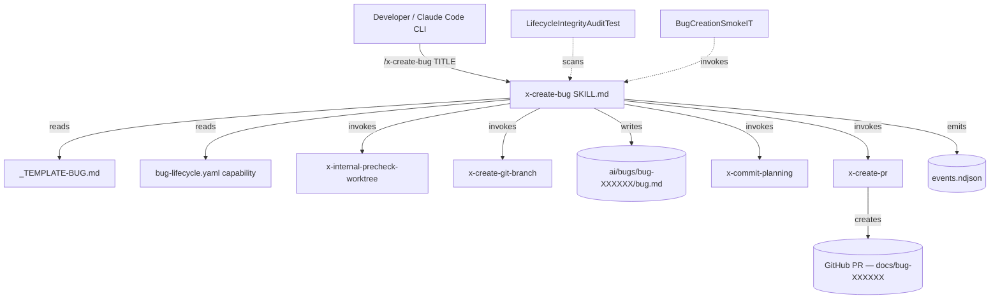
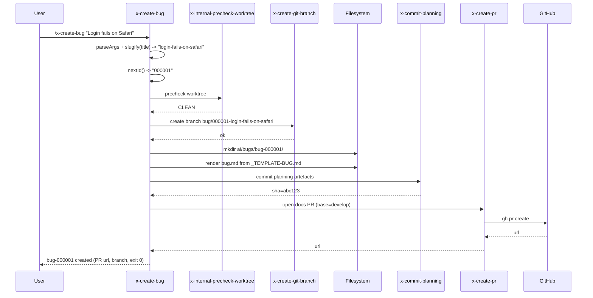
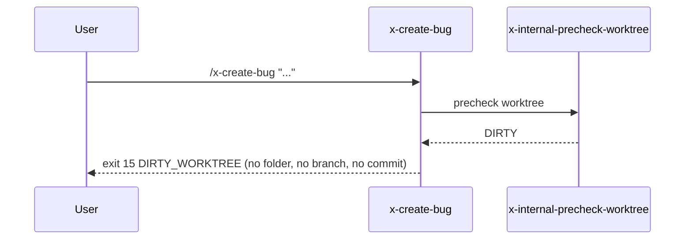

# Architecture Plan — story-0080-0001: /x-create-bug Skill Scaffolding

## Executive Summary

Story-0080-0001 introduces the entry point for EPIC-0080 Bug Lifecycle Management: the `/x-create-bug` skill, the `_TEMPLATE-BUG.md` artefact, and a v3.0 capability descriptor (`bug-lifecycle.yaml`). The skill is a pure-Markdown orchestrator (no Java code) that composes existing internal skills (`x-internal-precheck-worktree`, `x-create-git-branch`, `x-commit-planning`, `x-create-pr`) to scaffold an `ai/bugs/bug-XXXXXX/` folder, render `bug.md` from the template, open a `bug/XXXXXX-<slug>` branch, and produce a docs PR. The template extends RA9 with bug-specific sections (reproduction recipe, observed-vs-expected, root-cause hypothesis, regression-test slot). Slug generation is the only non-trivial logic and lives in the skill body as a deterministic shell pipeline; it is hardened against CWE-22 (path traversal) by stripping path separators and constraining to `[a-z0-9-]{1,40}`. The work is generator-source-tree only (`java/src/main/resources/targets/claude/...`) plus golden updates; no production Java code paths change. Risk surface is small, contained to the skill body and template; CI gating is the LifecycleIntegrityAuditTest baseline plus a new BugCreationSmokeIT.

## Component Diagram

## Sequence Diagrams

### Happy Path (AC-1)

### Error Path — Dirty Tree (AC-2)

## Deployment Diagram

**N/A** — `/x-create-bug` is a skill artefact loaded by the Claude Code CLI on the developer workstation. No service, container, or orchestrator is deployed. Distribution path: generator (`ia-dev-env`) emits `.claude/skills/x-create-bug/SKILL.md` from `java/src/main/resources/targets/claude/skills/dev/x-create-bug/SKILL.md` into the consuming repository's `.claude/` tree.

## External Connections

| System | Protocol | Purpose | SLO |
|---|---|---|---|
| Local filesystem | POSIX FS | Create `ai/bugs/bug-XXXXXX/bug.md`, read template | < 100 ms wall |
| Local git | git CLI subprocess | Branch creation, commit | < 2 s wall per op |
| GitHub API | HTTPS via `gh` CLI | PR creation | ≤ 10 s P95 (gh default) |
| Telemetry sink | Append-only NDJSON file | Skill lifecycle events | Best-effort, non-blocking |

## Architecture Decisions

### mini-ADR-001 — Skill is Markdown-only, not Java

**Context:** Existing skill orchestrators (`x-create-git-branch`, `x-create-pr`) compose other skills via Markdown SKILL.md. Adding a Java entry point would duplicate orchestration logic and bypass Rule 13.
**Decision:** `x-create-bug` ships as `SKILL.md` only. Slug generation is a deterministic shell pipeline embedded in the skill body. Java unit tests target the generator's golden output, not a runtime class.
**Consequences:** Zero new Java production code. Test surface = template golden + slug regex assertions in an existing test class.

### mini-ADR-002 — `bug-XXXXXX` 6-digit zero-padded ID with filesystem-scan allocator

**Context:** Need a monotonic, collision-free bug ID without a database.
**Decision:** Allocator scans `ai/bugs/bug-*/` and picks `max(id)+1`, padded to 6 digits. Race is mitigated by branch-name collision detection in `x-create-git-branch` (idempotent retry on TOCTOU).
**Consequences:** Capacity 999,999 bugs (sufficient). No DB. TOCTOU window closed at branch creation, not allocation.

### mini-ADR-003 — Slug regex `^[a-z0-9-]{1,40}$`, separators stripped before lowercasing

**Context:** AC-4 demands CWE-22 hardening; user titles may contain `../`, `\`, control chars, unicode.
**Decision:** Pipeline: NFKD-normalize → drop combining marks → replace any non-`[A-Za-z0-9]` with `-` → lowercase → collapse `-+` → trim leading/trailing `-` → truncate 40 → fallback to `untitled` if empty. `/` and `\` are eliminated by step 3 before any path resolution touches the slug.
**Consequences:** Branch name regex `^bug/[0-9]{6}-[a-z0-9-]{1,40}$` is enforced by `x-create-git-branch`'s validator. Path-traversal class of attacks is structurally impossible.

### mini-ADR-004 — Reuse existing skills; no new infra

**Context:** Precheck, branch, commit, PR are solved problems.
**Decision:** Compose `x-internal-precheck-worktree` (CLEAN/DIRTY classification, exit 15 on DIRTY), `x-create-git-branch`, `x-commit-planning` (whitelisted for `ai/bugs/**` — see Impact Analysis), `x-create-pr`.
**Consequences:** One whitelist update needed in `x-commit-planning` to accept `ai/bugs/**` paths (mirrors `ai/epics/**` pattern). Tracked as a sub-task of this story.

## Technology Stack

| Layer | Technology |
|---|---|
| Skill runtime | Claude Code CLI (Markdown SKILL.md) |
| Capability schema | YAML frontmatter v3.0 |
| Template engine | Inline string substitution in skill body |
| Slug pipeline | POSIX `tr` / `sed` (portable, no Python/Node dep) |
| Git operations | `git` ≥ 2.40, `gh` ≥ 2.40 |
| Tests (unit) | JUnit 5 (golden-file assertions on generator output) |
| Tests (smoke) | BugCreationSmokeIT (Java IT, sandboxed git tempdir) |
| Audit | LifecycleIntegrityAuditTest (existing) |

## Non-Functional Requirements

| ID | NFR | Target | Measurement |
|---|---|---|---|
| NFR-1 | Wall-clock latency (AC-3) | ≤ 90 s P95 end-to-end | BugCreationSmokeIT timer over 20 runs |
| NFR-2 | Zero side effects on DIRTY (AC-2) | 0 files written, 0 branches, exit 15 | IT asserts pre/post tree equality |
| NFR-3 | Path-traversal safety (AC-4) | 100% of injection vectors stripped | Parametrized unit test: 12 CWE-22 payloads |
| NFR-4 | Idempotency on branch collision | Re-run yields same bug-id or next-free | IT runs skill twice in same tree |
| NFR-5 | Telemetry completeness | `skill_start`, `skill_end`, phase events present | Assert NDJSON line count ≥ 4 |
| NFR-6 | Audit clean | LifecycleIntegrityAuditTest passes with no new baseline | CI gate |
| NFR-7 | Slug determinism | Same title → same slug across OSes | Parametrized test |

## Data Model

**N/A** — No database, no schema. Sole persistent artefact is a Markdown file at `ai/bugs/bug-XXXXXX/bug.md` whose structure is governed by `_TEMPLATE-BUG.md`. Section list (informative):

- RA9 sections 1–9 (inherited from `planning-standards-kp`)
- Bug subsection: Reproduction Recipe (preconditions, steps, env)
- Bug subsection: Observed vs. Expected
- Bug subsection: Root-Cause Hypothesis
- Bug subsection: Regression Test Slot (test name + path placeholder)
- Frontmatter: `bug-id`, `created-at`, `severity` (TBD enum), `status: open`

## Observability Strategy

- **Telemetry events:** emit `skill_start`, `phase_start{name=precheck|allocate|scaffold|commit|pr}`, `phase_end`, `skill_end{exit_code, bug_id, branch, pr_url}` to `ai/epics/<active-epic>/telemetry/events.ndjson` (or `ai/bugs/bug-XXXXXX/telemetry/events.ndjson` if no active epic — TBD by allocator).
- **Logs:** human-readable progress lines to stdout; errors to stderr with exit code.
- **Metrics:** post-hoc via `x-analyze-telemetry` aggregating `skill_end` durations; P95 trends consumed by `x-analyze-telemetry-trends`.
- **Audit trail:** Git commit message follows Conventional Commits — `chore(bug-XXXXXX): scaffold bug folder` — providing an immutable record.

## Resilience Strategy

| Failure mode | Detection | Response |
|---|---|---|
| Dirty worktree | precheck exit ≠ CLEAN | Abort early, exit 15, no side effects (AC-2) |
| Branch already exists | `x-create-git-branch` returns conflict | Increment ID, retry once; on second collision, exit 16 |
| `gh pr create` network failure | non-zero exit from PR step | Folder + branch + commit retained; print recovery hint (`gh pr create` manual command); exit 17 |
| Template missing | File-not-found at SKILL load | Audit fails at CI; runtime exit 18 |
| Slug becomes empty after sanitize | regex check post-pipeline | Fallback slug `untitled`; emit WARNING event |
| Telemetry sink unwritable | append fails | Swallow error, continue (best-effort) |
| Concurrent invocation | flock on allocator dir | Second invocation waits ≤ 5 s, then exit 19 BUSY |

No retries with backoff are needed beyond the single branch-collision retry; all other failures are deterministic and user-correctable.

## Impact Analysis

**Files added (generator source):**
- `java/src/main/resources/targets/claude/skills/dev/x-create-bug/SKILL.md`
- `java/src/main/resources/targets/claude/templates/_TEMPLATE-BUG.md`
- `java/src/main/resources/targets/claude/capabilities/governance/bug-lifecycle.yaml`

**Files added (tests):**
- `java/src/test/java/.../skills/CreateBugSlugGenerationTest.java` (parametrized, AC-4 vectors)
- `java/src/test/java/.../skills/CreateBugFrontmatterAssemblyTest.java`
- `java/src/test/java/.../it/BugCreationSmokeIT.java`

**Files modified:**
- `java/src/main/resources/targets/claude/skills/git/x-commit-planning/SKILL.md` — extend whitelist to include `ai/bugs/**` (mirrors `ai/epics/**`).
- `src/test/resources/golden/...` — regenerate goldens for the three new artefacts.
- `audits/lifecycle-integrity-baseline.txt` — no change expected; audit must pass clean.

**Files NOT touched:**
- Any production Java under `application/`, `domain/`, `adapter/`.
- Existing skills outside `x-commit-planning`.
- Build configuration (`pom.xml`).

**Backward compatibility:** Additive only. No existing skill, capability, or template changes shape. Whitelist extension in `x-commit-planning` is a superset; no callers regress.

**Risk score:** LOW. Surface = 3 new artefacts + 1 whitelist line + 3 test files. No runtime Java changes. Reversible via revert of a single PR.

**Downstream stories:** story-0080-0002 through story-0080-0006 depend on the `bug-XXXXXX` ID format and template shape locked here. Any post-merge change to the slug regex or ID width is a breaking change for the epic.
