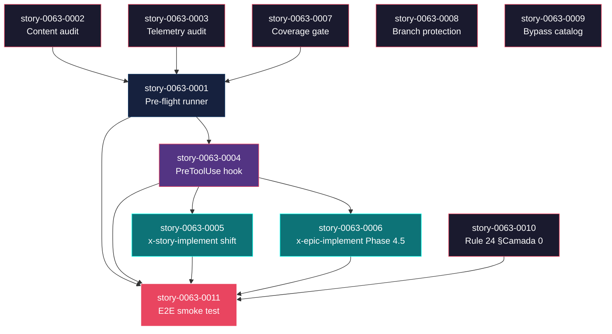
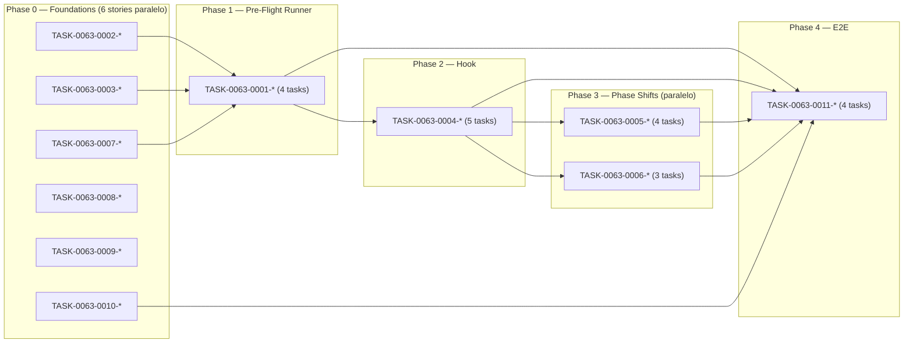

# Mapa de Implementação — EPIC-0063 Local-First Pre-Flight Gates

**Gerado a partir das dependências BlockedBy/Blocks de cada história do epic-0063.**

---

## 1. Matriz de Dependências

| Story | Título | Chave Jira | Blocked By | Blocks | Status |
| :--- | :--- | :--- | :--- | :--- | :--- |
| story-0063-0001 | Pre-Flight Runner Script | — | story-0063-0002, story-0063-0003, story-0063-0007 | story-0063-0004, story-0063-0011 | Pendente |
| story-0063-0002 | Content-Quality Audits | — | — | story-0063-0001 | Pendente |
| story-0063-0003 | Telemetry-as-Evidence Audit + Stage Hook | — | — | story-0063-0001 | Pendente |
| story-0063-0004 | PreToolUse Blocking Hook | — | story-0063-0001 | story-0063-0005, story-0063-0006, story-0063-0011 | Pendente |
| story-0063-0005 | x-story-implement Phase Shift | — | story-0063-0001, story-0063-0004 | story-0063-0011 | Pendente |
| story-0063-0006 | x-epic-implement Phase 4.5 | — | story-0063-0004 | story-0063-0011 | Pendente |
| story-0063-0007 | Local Coverage Gate | — | — | story-0063-0001 | Pendente |
| story-0063-0008 | Branch Protection Automation | — | — | — | Pendente |
| story-0063-0009 | Bypass-Skill Catalog | — | — | — | Pendente |
| story-0063-0010 | Rule 24 §Camada 0 + CLAUDE.md | — | — | story-0063-0011 | Pendente |
| story-0063-0011 | E2E Smoke Test | — | story-0063-0001, story-0063-0004, story-0063-0005, story-0063-0006, story-0063-0010 | — | Pendente |

> **Valores de Status:** `Pendente` (padrão) · `Em Andamento` · `Concluída` · `Falha` · `Bloqueada` · `Parcial`

> **Nota:** Stories 0063-0008 (branch protection) e 0063-0009 (catalog) são totalmente independentes — podem ser implementadas em qualquer fase em paralelo. Story 0063-0010 (Rule 24) é independente em conteúdo mas é blocker do smoke test final.

---

## 2. Fases de Implementação

> As histórias são agrupadas em fases. Dentro de cada fase, as histórias podem ser implementadas **em paralelo**.

```
╔══════════════════════════════════════════════════════════════════════════╗
║              FASE 0 — Foundations (paralelo, 6 stories)                  ║
║                                                                          ║
║   ┌───────────────┐   ┌───────────────┐   ┌───────────────┐              ║
║   │ story-0063-   │   │ story-0063-   │   │ story-0063-   │              ║
║   │     0002      │   │     0003      │   │     0007      │              ║
║   │ Content audit │   │ Telemetry     │   │ Coverage gate │              ║
║   └───────┬───────┘   └───────┬───────┘   └───────┬───────┘              ║
║           │                   │                   │                      ║
║   ┌───────────────┐   ┌───────────────┐   ┌───────────────┐              ║
║   │ story-0063-   │   │ story-0063-   │   │ story-0063-   │              ║
║   │     0008      │   │     0009      │   │     0010      │              ║
║   │ Branch prot   │   │ Catalog       │   │ Rule 24 §C0   │              ║
║   └───────────────┘   └───────────────┘   └───────────────┘              ║
╚══════════╤═══════════════════╤═══════════════════╤══════════════════════╝
           │                   │                   │
           ▼                   ▼                   ▼
╔══════════════════════════════════════════════════════════════════════════╗
║              FASE 1 — Pre-Flight Runner (sequencial, 1 story)            ║
║                                                                          ║
║   ┌─────────────────────────────────────────────────────────────────┐    ║
║   │              story-0063-0001 (Pre-flight runner)                │    ║
║   │   (consumes: audit-review-content, audit-coverage-local,        │    ║
║   │              audit-execution-integrity --scope=telemetry)       │    ║
║   └────────────────────────┬────────────────────────────────────────┘    ║
╚════════════════════════════╪═════════════════════════════════════════════╝
                             │
                             ▼
╔══════════════════════════════════════════════════════════════════════════╗
║              FASE 2 — PreToolUse Hook (sequencial, 1 story)              ║
║                                                                          ║
║   ┌─────────────────────────────────────────────────────────────────┐    ║
║   │       story-0063-0004 (enforce-preflight-gates.sh)              │    ║
║   │       (consumes: preflight.sh)                                  │    ║
║   └────────────────────────┬────────────────────────────────────────┘    ║
╚════════════════════════════╪═════════════════════════════════════════════╝
                             │
                             ▼
╔══════════════════════════════════════════════════════════════════════════╗
║              FASE 3 — Skill Phase Shifts (paralelo, 2 stories)           ║
║                                                                          ║
║   ┌──────────────────────┐         ┌──────────────────────┐              ║
║   │   story-0063-0005    │         │   story-0063-0006    │              ║
║   │ x-story-implement    │         │ x-epic-implement     │              ║
║   │ Phase 2.5 shift      │         │ Phase 4.5 add        │              ║
║   └──────────┬───────────┘         └──────────┬───────────┘              ║
╚══════════════╪═════════════════════════════════╪══════════════════════════╝
               │                                 │
               ▼                                 ▼
╔══════════════════════════════════════════════════════════════════════════╗
║              FASE 4 — E2E Smoke Test (sequencial, 1 story)               ║
║                                                                          ║
║   ┌─────────────────────────────────────────────────────────────────┐    ║
║   │   story-0063-0011 (Epic0063LocalFirstSmokeTest — 5 cenários)    │    ║
║   └─────────────────────────────────────────────────────────────────┘    ║
╚══════════════════════════════════════════════════════════════════════════╝
```

---

## 3. Caminho Crítico

> O caminho crítico (sequência mais longa de dependências) determina o tempo mínimo de implementação.

```
story-0063-0002 ─┐
                 ├──→ story-0063-0001 ─→ story-0063-0004 ─→ story-0063-0005 ─→ story-0063-0011
story-0063-0003 ─┤                                       └→ story-0063-0006 ──┘
                 │
story-0063-0007 ─┘

   Fase 0           Fase 1            Fase 2             Fase 3            Fase 4
```

**5 fases no caminho crítico, 5 histórias na cadeia mais longa (0063-0002 → 0001 → 0004 → 0005 → 0011).**

A cadeia secundária (0063-0006 ao invés de 0063-0005) é equivalente em comprimento. Ambas convergem em 0063-0011.

Atrasos em qualquer story do caminho crítico atrasam o epic todo. Foco operacional: priorizar review e completion das stories 0001, 0004, e qualquer uma de 0005/0006 (a outra é paralela).

---

## 4. Grafo de Dependências (Mermaid)



---

## 5. Resumo por Fase

| Fase | Histórias | Camada | Paralelismo | Pré-requisito |
| :--- | :--- | :--- | :--- | :--- |
| 0 | 0063-0002, 0063-0003, 0063-0007, 0063-0008, 0063-0009, 0063-0010 | Foundation (audits + docs + rules) | 6 paralelas | — |
| 1 | 0063-0001 | Core (preflight runner) | 1 | Fase 0 (parcial: 0002, 0003, 0007) |
| 2 | 0063-0004 | Core (PreToolUse hook) | 1 | Fase 1 |
| 3 | 0063-0005, 0063-0006 | Extension (skill phase shifts) | 2 paralelas | Fase 2 |
| 4 | 0063-0011 | Validation (E2E smoke) | 1 | Fase 3 (+ 0063-0010 do Fase 0) |

**Total: 11 histórias em 5 fases.**

> **Nota sobre paralelismo:** Fase 0 tem o paralelismo máximo (6 stories independentes). Fase 3 tem 2 paralelas. Fases 1, 2 e 4 são strict-sequential.

---

## 6. Detalhamento por Fase

### Fase 0 — Foundations

| Story | Escopo Principal | Artefatos Chave |
| :--- | :--- | :--- |
| story-0063-0002 | Content audits (review + envelope) | `scripts/audit-review-content.sh`, `scripts/audit-verify-envelope.sh`, `audits/review-content-baseline.txt` |
| story-0063-0003 | Telemetry-as-evidence + stage hook | `.claude/hooks/stage-telemetry.sh` (re-introduced), `audit-execution-integrity.sh --scope=telemetry` (extended) |
| story-0063-0007 | Local coverage gate | `scripts/audit-coverage-local.sh` |
| story-0063-0008 | Branch protection automation | `scripts/setup-branch-protection.sh --apply-strict`, `docs/branch-protection.md` |
| story-0063-0009 | Bypass-skill catalog | `docs/audit-bypass-catalog.md`, `AuditBypassCatalogTest` |
| story-0063-0010 | Rule 24 §Camada 0 | `.claude/rules/24-execution-integrity.md`, `CLAUDE.md` updates |

**Entregas da Fase 0:**

- 4 audit scripts novos/estendidos (rule 26-compliant: prefixo `audit-`, `--self-check`, exit codes 0..3)
- 1 Stop hook re-introduzido (stage-telemetry)
- 1 documento de catálogo (11 skills bypassáveis com plano de blindagem)
- 1 rule atualizada (Rule 24 §Camada 0) + CLAUDE.md

### Fase 1 — Core Runner

| Story | Escopo Principal | Artefatos Chave |
| :--- | :--- | :--- |
| story-0063-0001 | Pre-Flight runner (1 entry-point unificado) | `scripts/preflight.sh`, exit codes 0..6 |

**Entregas da Fase 1:**

- 1 runner CLI consolidando 5 gates (format, tests, coverage, content, telemetry)
- Modo `--scope=story\|epic` + `--changed-only` filter
- Self-check Rule 26 contract

### Fase 2 — Hook Layer

| Story | Escopo Principal | Artefatos Chave |
| :--- | :--- | :--- |
| story-0063-0004 | PreToolUse blocking hook | `.claude/hooks/enforce-preflight-gates.sh`, settings.json registration |

**Entregas da Fase 2:**

- Hook intercepta `git push`, `gh pr create`, `Skill x-pr-create`
- Bloqueia bypass commands (`git commit -n`, `--no-verify`, `gh pr merge --admin`)
- Implementa `CLAUDE_RECOVERY_MODE=1` whitelist (RULE-004)

### Fase 3 — Skill Phase Shifts

| Story | Escopo Principal | Artefatos Chave |
| :--- | :--- | :--- |
| story-0063-0005 | x-story-implement Phase 2.5 (reviews pré-PR) | SKILL.md modified (java/.../core/dev/x-story-implement/SKILL.md) + regenerated |
| story-0063-0006 | x-epic-implement Phase 4.5 (epic-level review) | SKILL.md modified + regenerated |

**Entregas da Fase 3:**

- Reviews especialistas + tech-lead executam ANTES do PR (FR11-12)
- Epic-level review consolida findings (FR13-14)
- Telemetry markers preservados (Rule 13 contract)

### Fase 4 — Validation

| Story | Escopo Principal | Artefatos Chave |
| :--- | :--- | :--- |
| story-0063-0011 | E2E smoke test (5 cenários) | `Epic0063LocalFirstSmokeTest.java`, sandbox fixture helpers |

**Entregas da Fase 4:**

- 5 cenários do AC12 cobertos (push sem review, stub, completos, PR sem epic review, recovery)
- CI gate: epic não pode ser mergeado se test falha
- Demonstração executável da Camada 0 funcionando ponta-a-ponta

---

## 7. Observações Estratégicas

### Gargalo Principal

**story-0063-0001 (Pre-Flight Runner)** é o gargalo single-point: bloqueia 0063-0004 e 0063-0011. Se atrasa, atrasa o epic todo. Investir em qualidade desta story (testes shell robustos, mensagens de erro claras, calibração do P95 < 5min) compensa porque 0063-0004 e 0063-0011 dependem de runner sólido.

Stories 0063-0002, 0063-0003 e 0063-0007 são pré-requisitos PARCIAIS de 0063-0001 — runner precisa que ELES existam (e tenham `--self-check` green) para invocá-los. Pode-se ter mock implementations dessas auditorias enquanto 0063-0001 é desenvolvida em paralelo, mas integration final requer todos prontos.

### Histórias Folha (sem dependentes)

- story-0063-0008 (branch protection)
- story-0063-0009 (catalog)

Ambas são totalmente independentes e podem ser realizadas a qualquer momento durante Fase 0-3 sem impacto no caminho crítico.

### Otimização de Tempo

- **Paralelismo máximo Fase 0:** 6 stories simultâneas (0002, 0003, 0007, 0008, 0009, 0010)
- **Stories que podem começar imediatamente:** todas as 6 da Fase 0 — nenhum blocker entre elas
- **Alocação de equipe ideal:** 6 devs paralelos em Fase 0 → 1 dev sequencial em Fase 1 → 1 dev em Fase 2 → 2 devs paralelos em Fase 3 → 1 dev em Fase 4
- **Tempo mínimo (paralelismo total):** 5 fases × tempo médio por fase. Story média ~1-2 dias de implementação + review → epic ~7-10 dias com paralelismo, ~20-25 dias sequencial

### Dependências Cruzadas

- story-0063-0011 (E2E test) depende de stories de 4 fases diferentes (0001, 0004, 0005, 0006, 0010) — é o ponto de convergência maior
- story-0063-0010 (Rule 24) é independente de implementação mas é blocker direto do smoke test (porque o test referencia §Camada 0 na sua doc)

### Marco de Validação Arquitetural

**story-0063-0004 (PreToolUse hook)** é o checkpoint arquitetural crítico. Após sua conclusão, todo o stack de Camada 0 está operacional (preflight + hook). Stories 0063-0005 e 0063-0006 apenas integram o hook em SKILLs específicas. O smoke test (0063-0011) valida o stack ponta-a-ponta.

Se o hook não funcionar conforme esperado em 0063-0004 (ex: falsos positivos, P95 overhead > 100ms), todos os fluxos downstream sofrem. Calibrar e estabilizar o hook antes de proceder para Fase 3 é vital.

---

## 8. Dependências entre Tasks (Cross-Story)

### 8.1 Dependências Cross-Story entre Tasks

| Task | Depends On | Story Source | Story Target | Tipo |
| :--- | :--- | :--- | :--- | :--- |
| TASK-0063-0001-002 | TASK-0063-0002-003 | story-0063-0001 | story-0063-0002 | interface (preflight invokes audit-review-content) |
| TASK-0063-0001-002 | TASK-0063-0003-002 | story-0063-0001 | story-0063-0003 | interface (preflight invokes audit-execution-integrity --scope=telemetry) |
| TASK-0063-0001-002 | TASK-0063-0007-001 | story-0063-0001 | story-0063-0007 | interface (preflight invokes audit-coverage-local) |
| TASK-0063-0004-005 | TASK-0063-0001-004 | story-0063-0004 | story-0063-0001 | interface (hook invokes preflight) |
| TASK-0063-0011-002 | TASK-0063-0001-004, TASK-0063-0004-005 | story-0063-0011 | stories 0001, 0004 | integration (smoke test exercises both) |

> **Validação RULE-012:** Todas dependências cross-story são interface-level (one script invokes another) ou integration-level (smoke test exercises composition). Nenhuma duplicação de schema ou data. PASS.

### 8.2 Ordem de Merge (Topological Sort)

| Ordem | Task ID | Story | Parallelizável Com | Fase |
| :--- | :--- | :--- | :--- | :--- |
| 1 | TASK-0063-0002-001 | story-0063-0002 | 0003-001, 0007-001, 0008-001, 0009-001, 0010-001 | 0 |
| 2 | TASK-0063-0003-001 | story-0063-0003 | (paralelo) | 0 |
| 3 | TASK-0063-0007-001 | story-0063-0007 | (paralelo) | 0 |
| 4 | TASK-0063-0008-001 | story-0063-0008 | (paralelo) | 0 |
| 5 | TASK-0063-0009-001 | story-0063-0009 | (paralelo) | 0 |
| 6 | TASK-0063-0010-001 | story-0063-0010 | (paralelo) | 0 |
| 7 | TASK-0063-0001-001 | story-0063-0001 | — | 1 |
| 8 | TASK-0063-0001-002 | story-0063-0001 | — | 1 |
| ... | ... | ... | ... | ... |
| N | TASK-0063-0011-004 | story-0063-0011 | — | 4 (final) |

**Total: 38 tasks em 5 fases de execução.**

### 8.3 Grafo de Dependências entre Tasks (Mermaid)



---

## 8.5 Restrições de Paralelismo

> Análise gerada por /x-parallel-eval em <timestamp omitido para determinismo>.

**Conflitos detectados:** 1 hard, 0 regen, 1 soft

### 8.5.1 Pares Serializados Dentro da Fase

| Fase | A | B | Categoria | Motivo |
| :--- | :--- | :--- | :--- | :--- |
| 0 | story-0063-0003 | story-0063-0004 (Phase 2) | hard | `.claude/settings.json` write conflict — story 0003 registra Stop hook (stage-telemetry), story 0004 registra PreToolUse hook (enforce-preflight-gates) |
| 3 | story-0063-0005 | story-0063-0006 | soft | Ambos modificam SKILL.md fontes em `java/src/main/resources/targets/claude/skills/core/dev/`, paths diferentes mas tooling de regeneração compartilhado |

### 8.5.2 Recomendação de Reagrupamento

- **Fase 0 conflict (settings.json):** Story 0063-0003 (Fase 0) e story 0063-0004 (Fase 2) são executadas em fases diferentes — conflito é de leitura/escrita do mesmo arquivo, mas como 0063-0004 ocorre depois (Fase 2), o conflito é resolvido naturalmente pela ordem topológica. Story 0063-0004 task 005 (settings.json registration) deve ler a versão atualizada por story 0063-0003 (também tocando settings.json). Recomendação: rebase story-0063-0004 em cima de story-0063-0003 antes de merge.
- **Fase 3 soft conflict:** Stories 0063-0005 e 0063-0006 podem rodar paralelas (paths diferentes), mas regeneração de `.claude/skills/` deve ser sequencial (uma de cada vez para evitar diff confuso). Recomendação: merge sequencial (0005 primeiro, 0006 rebase em cima).
