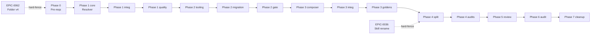

# Implementation Map — EPIC-0064

**Epic:** Capability-Driven Composition Refactor
**Branch:** `epic/0064`
**Total stories:** 79 (Phase 0 materialized; Phases 1-7 entries TBD via `x-story-create`)
**Total waves:** 15
**Critical path:** A→B→C→D→E→F→G→H→I→J→K→L→M→N→O (15 hops)

---

## DAG Visual

---

## Phase 0 — Pré-requisitos & Contratos (8 stories)

| Story | Título | Sz | Pred | Wave | File footprint (write) |
| :--- | :--- | :--- | :--- | :--- | :--- |
| story-0064-0001 | ADR-0016 draft | S | — | A | `adr/ADR-0016-capability-driven-composition.md` |
| story-0064-0002 | SPEC-capability-composition-v1 | M | 0001 | A | `docs/specs/SPEC-capability-composition-v1.md` |
| story-0064-0003 | Schema 3.0 frontmatter | S | 0002 | A | `governance/schemas/frontmatter-3.0.json` |
| story-0064-0004 | Schema 1.0 capabilities.yaml | S | 0002 | A | `governance/schemas/capabilities-1.0.json` |
| story-0064-0005 | Rule 28 — Capability Frontmatter Contract | S | 0003 | A | `.claude/rules/28-capability-frontmatter-contract.md` |
| story-0064-0006 | Sync com EPIC-0062 (rebase paths v4) | M | externo | A | — (rebase op) |
| story-0064-0007 | LifecycleIntegrity para artefatos novos | S | 0005 | A | `LifecycleIntegrityAuditTest.java` |
| story-0064-0008 | CHANGELOG seed `[Unreleased] [Breaking]` | S | 0001 | A | `CHANGELOG.md` |

---

## Phase 1 — Modelo + Resolver Java (12 stories)

| Story | Título | Sz | Pred | Wave |
| :--- | :--- | :--- | :--- | :--- |
| story-0064-0101 | Domain types (`Capability`, `Profile`, `CapabilityGraph` records) | M | 0003,0004 | B |
| story-0064-0102 | YAML parser `capabilities.yaml` (Jackson) | M | 0101 | B |
| story-0064-0103 | Cycle detector (Tarjan SCC) | S | 0101 | B |
| story-0064-0104 | Mutex validator (excludes simétrico) | S | 0101 | B |
| story-0064-0105 | Prerequisite resolver (transitivo, topológico) | M | 0103 | C |
| story-0064-0106 | Profile loader + ProfileExpander | M | 0102 | C |
| story-0064-0107 | `CapabilityResolver` fachada | M | 0103,0104,0105,0106 | C |
| story-0064-0108 | Erros tipados (`CapabilityError` sealed) | S | 0107 | D |
| story-0064-0109 | `Epic0064CapabilityResolutionSmokeTest` | M | 0107 | D |
| story-0064-0110 | Property-based generators (jqwik) | M | 0107 | D |
| story-0064-0111 | Property suite — 4 invariantes, 10K casos | M | 0110 | D |
| story-0064-0112 | Telemetria do resolver | S | 0107 | D |

---

## Phase 2 — Frontmatter Migration (15 stories)

| Story | Título | Sz | Pred | Wave |
| :--- | :--- | :--- | :--- | :--- |
| story-0064-0201 | `FrontmatterValidator` Java + schema gate | M | 0107 | E |
| story-0064-0202 | Skill `/x-frontmatter-migrate` (heurística + AI) | M | 0201 | E |
| story-0064-0203 | Migrar skills `plan/*` | M | 0202 | F |
| story-0064-0204 | Migrar skills `dev/*` | M | 0202 | F |
| story-0064-0205 | Migrar skills `test/*` | M | 0202 | F |
| story-0064-0206 | Migrar skills `review/*` | M | 0202 | F |
| story-0064-0207 | Migrar skills `git/*`, `pr/*`, `code/*` | M | 0202 | F |
| story-0064-0208 | Migrar skills `internal/*` (~12 internas) | L | 0202 | F |
| story-0064-0209 | Migrar skills `release/*`, `epic/*`, `ops/*` | M | 0202 | F |
| story-0064-0210 | Migrar 21 rules | L | 0202 | F |
| story-0064-0211 | Migrar 33 KPs | L | 0202 | F |
| story-0064-0212 | Migrar 16 agents | L | 0202 | F |
| story-0064-0213 | Migrar ~10 hooks | M | 0202 | F |
| story-0064-0214 | Migrar 12 templates `_TEMPLATE-*` | M | 0202 | F |
| story-0064-0215 | Hard-fail em `audit-capability-coverage.sh` | S | 0203-0214 | G |

---

## Phase 3 — Composer Engine + Integration (10 stories)

| Story | Título | Sz | Pred | Wave |
| :--- | :--- | :--- | :--- | :--- |
| story-0064-0301 | `CapabilityAwareComposer` core | L | 0215 | H |
| story-0064-0302 | `OutputPruner` | M | 0301 | H |
| story-0064-0303 | `CompositionEngine` (slots + each) | M | 0301 | H |
| story-0064-0304 | Hook integration no pipeline existente | M | 0302,0303 | I |
| story-0064-0305 | `--dry-run` flag | S | 0301 | H |
| story-0064-0306 | Regen golden Spring REST + Postgres | M | 0304 | J |
| story-0064-0307 | Regen golden Quarkus | M | 0304 | J |
| story-0064-0308 | **Regen golden Java Picocli sem DB (alvo crítico)** | M | 0304 | J |
| story-0064-0309 | Regen demais 6 perfis | L | 0304 | J |
| story-0064-0310 | `Epic0064ComposerIntegrationSmokeTest` E2E | M | 0309 | J |

---

## Phase 4 — Stack-Specific Content Split (12 stories) — **HARD FENCE: EPIC-0036 mergeado**

| Story | Título | Sz | Pred | Wave |
| :--- | :--- | :--- | :--- | :--- |
| story-0064-0401 | Inventário Spring vs Quarkus vs Picocli vs Helidon | S | 0310 | K |
| story-0064-0402 | Split `stack-patterns/` em subdirs por framework | L | 0401 | K |
| story-0064-0403 | KP `db-jpa` → fragmentos por DB engine | M | 0402 | K |
| story-0064-0404 | KP `db-r2dbc` (reactive) | M | 0402 | K |
| story-0064-0405 | Skill `dev/spring-controller` (exclusiva Spring) | M | 0402 | K |
| story-0064-0406 | Skill `dev/quarkus-resource` (exclusiva Quarkus) | M | 0402 | K |
| story-0064-0407 | Skill `dev/picocli-command` (exclusiva CLI) | M | 0402 | K |
| story-0064-0408 | Scaffold Helidon (perfil novo) | M | 0402 | K |
| story-0064-0409 | Scaffold Micronaut (perfil novo) | M | 0402 | K |
| story-0064-0410 | `audit-fragment-coherence.sh` | S | 0402 | L |
| story-0064-0411 | `audit-output-pruning.sh` | S | 0402 | L |
| story-0064-0412 | `Epic0064FrameworkSplitSmokeTest` | M | 0410,0411 | L |

---

## Phase 5 — x-review e Composite Artifacts (8 stories)

| Story | Título | Sz | Pred | Wave |
| :--- | :--- | :--- | :--- | :--- |
| story-0064-0501 | Refactor `x-review` para composição (8 fragmentos) | L | 0412 | M |
| story-0064-0502 | CLAUDE.md compositional | M | 0412 | M |
| story-0064-0503 | Agents condicionais | M | 0412 | M |
| story-0064-0504 | Hook chain capability-aware | M | 0412 | M |
| story-0064-0505 | `Epic0064ReviewCompositionSmokeTest` | M | 0501 | M |
| story-0064-0506 | Property test idempotência composer | M | 0501 | M |
| story-0064-0507 | Telemetria do composer | S | 0501 | M |
| story-0064-0508 | Atualizar SKILL.md de `x-review` | S | 0501 | M |

---

## Phase 6 — Audit, Tests, Golden Regen (8 stories)

| Story | Título | Sz | Pred | Wave |
| :--- | :--- | :--- | :--- | :--- |
| story-0064-0601 | `audit-capability-graph.sh` | M | 0107 | N |
| story-0064-0602 | `audit-capability-coverage.sh` consolidação | S | 0215 | N |
| story-0064-0603 | `audit-frontmatter-schema.sh` consolidação | S | 0201 | N |
| story-0064-0604 | `audit-output-pruning.sh` consolidação (9 perfis) | S | 0411 | N |
| story-0064-0605 | `audit-fragment-coherence.sh` consolidação | S | 0410 | N |
| story-0064-0606 | `audit-capability-determinism.sh` (3 builds = mesmo SHA) | M | 0506 | N |
| story-0064-0607 | Property suite expandida (10K casos, 4 invariantes) | L | 0506 | N |
| story-0064-0608 | Test matrix shrinking via pairwise covering (≤50 combos) | M | 0607 | N |

---

## Phase 7 — Cleanup, Docs, ADR-Final (6 stories)

| Story | Título | Sz | Pred | Wave |
| :--- | :--- | :--- | :--- | :--- |
| story-0064-0701 | Remover copy cego legacy | M | 0310 | O |
| story-0064-0702 | CLAUDE.md — bloco "Capability Composition" | S | 0502 | O |
| story-0064-0703 | `.claude/README.md` — seção "Capabilities ativas" | S | 0502 | O |
| story-0064-0704 | ADR-0016 → `Accepted` | S | 0701 | O |
| story-0064-0705 | CHANGELOG entry final `[Breaking]` + bump major | S | 0701 | O |
| story-0064-0706 | Baseline grandfathered (vazio + rationale) | S | 0701 | O |

---

## Waves & Paralelismo

| Wave | Conteúdo | Stories paralelas | Pre-condition |
| :--- | :--- | :--- | :--- |
| A | Phase 0 (8 stories) | 5 paralelas + 0006 espera externo | EPIC-0062 mergeado |
| B | Phase 1 core (4) | 4 paralelas | A done |
| C | Phase 1 integração (3) | 0105+0106 paralelas; 0107 serial | B done |
| D | Phase 1 qualidade (5) | 5 paralelas | C done |
| E | Phase 2 tooling (2) | 0201 → 0202 serial | D done |
| F | Phase 2 migração massiva (12) | **12 paralelas** | E done |
| G | Phase 2 gate (1) | Serial | F done; EPIC-0036 mergeado |
| H | Phase 3 composer (4) | 0301 → 0302+0303; 0305 paralela | G done |
| I | Phase 3 integration (1) | Serial | H done |
| J | Phase 3 goldens (5) | 5 paralelas | I done |
| K | Phase 4 split (9) | 0401 → 0402 → (6 paralelas) | J done; **EPIC-0036 mergeado** |
| L | Phase 4 audits (3) | 3 paralelas | K done |
| M | Phase 5 (8) | 0501 → (4 paralelas) → 0505-0508 paralelas | L done |
| N | Phase 6 (8) | 6 paralelas + 0607→0608 serial | M done |
| O | Phase 7 (6) | 0701 → 5 paralelas | N done |

**Parallelism index:** `n=4` agentes cobrem 95% das waves; `n=12` cobre Wave F (migração) sem fila.

---

## File Overlap Matrix (ADR-0006)

> Matriz de hot files por story; usada por `x-parallel-eval` (Phase 0.5.0 do x-epic-implement).

### Hot files cross-phase (HARD CONFLICTS — sempre serial)

| File | Phases que tocam |
| :--- | :--- |
| `pom.xml` | 0, 1, 6 (jqwik dependency) |
| `CHANGELOG.md` | 0 (seed), 7 (final) |
| `CLAUDE.md` | 7 |
| `.claude/rules/28-*.md` | 0 (criação), 7 (referências cruzadas) |
| `governance/schemas/*.json` | 0 (criação), 6 (audit consume) |

### Hot files intra-phase (REGEN — pode paralelizar com cuidado)

| File | Phase | Stories |
| :--- | :--- | :--- |
| `setup-config.*.yaml` (9 perfis) | 3 (goldens) | 0306-0309 (perfis distintos, sem overlap) |
| `targets/claude/skills/x-review/SKILL.md` | 5 | 0501, 0508 (serial: 0501→0508) |
| `targets/claude/agents/database-engineer.md` | 2 (frontmatter), 5 (refactor) | 0212, 0503 (Phase 5 espera Phase 2) |

### Soft conflicts (paralelo OK)

- 12 stories Phase 2 (migração por categoria) tocam diretórios disjuntos: `skills/plan/`, `skills/dev/`, etc.
- 5 stories Phase 3 goldens tocam `tests/golden/<profile>/` distintos.
- 6 stories Phase 4 split tocam `stack-patterns/{spring,quarkus,picocli,helidon,...}/` distintos.

**Recomendação para `x-epic-implement --parallel`:** habilitar Wave F com 12 agentes, Wave J com 5 agentes; serializar wave G (gate único), wave I (mesmo arquivo), wave M-Phase5-0501 (predecessor de outras).

---

## Restrições de Paralelismo (RULE-004 hotspots)

Hotspots cruzando o epic — **sempre serial**:

- `SettingsAssembler.java` (não tocado por 0064)
- `HooksAssembler.java` (não tocado por 0064 — substituído por `CapabilityAwareAssembler`)
- `CLAUDE.md` (touched only by Phase 7 — not paralleled)
- `CHANGELOG.md` (touched by 0008 + 0705 — sequential by phase)
- `pom.xml` (touched only by Phase 1 + 6 — sequential by phase)
- `.gitignore` (não tocado)
- `src/test/resources/golden/**` (touched only by Phase 3 — paralelizável por perfil)

Stories Phase 4 (split de stack-patterns) tocam `targets/claude/knowledge/stack-patterns/` que é hot file da EPIC-0036 — **garantia: Phase 4 só inicia após EPIC-0036 mergeado em develop**.

---

## Status & Telemetria

- **Status atual:** `Em Refinamento`
- **Stories materializadas:** 8 (Phase 0)
- **Stories TBD:** 71 (Phase 1-7) — materializadas por `x-story-create` em waves subsequentes
- **`execution-state.json`:** inicializado em `ai/epics/epic-0064-*/` com `flowVersion: "2"`, `taskTracking.enabled: true`.
