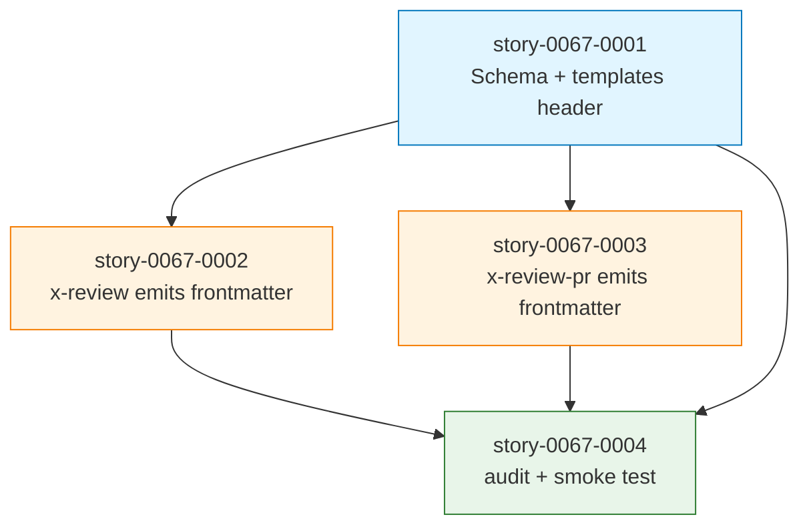

# IMPLEMENTATION-MAP — EPIC-0067 (Review YAML Frontmatter)

**Epic:** EPIC-0067
**Slug:** `review-yaml-frontmatter`
**flowVersion:** `4`
**Generated:** 2026-04-28
**Stories:** 4
**Phases:** 3
**Critical path length:** 3 stories (0001 → 0002 → 0004)
**Maximum parallelism:** 2 stories (Phase 1 — 0002 + 0003)

---

## 1. Phase Computation

| Phase | Stories | Notes |
| :--- | :--- | :--- |
| **Phase 0 — Foundation (single)** | 0067-0001 | Schema + templates header — pré-requisito de todos demais |
| **Phase 1 — Skills emission (parallel ×2)** | 0067-0002, 0067-0003 | Different SKILL.md files — parallel-safe |
| **Phase 2 — Audit + Verify (single)** | 0067-0004 | Hard gate + E2E smoke — depende de tudo |

---

## 2. Dependency Matrix

| Story | Blocked by | Blocks |
| :--- | :--- | :--- |
| 0067-0001 | (none — Phase 0 root) | 0067-0002, 0067-0003, 0067-0004 |
| 0067-0002 | 0067-0001 | 0067-0004 |
| 0067-0003 | 0067-0001 | 0067-0004 |
| 0067-0004 | 0067-0001, 0067-0002, 0067-0003 | (terminal — verify gate) |

---

## 3. Critical Path

```
0067-0001 ──→ 0067-0002 ──→ 0067-0004
(Foundation)  (Specialist)  (Audit + Verify)
```

**Length:** 3 stories.
**Estimated duration:** ~4h LLM time on critical path; ~5h total epic effort with parallelism in Phase 1.

---

## 4. ASCII Phase Diagram

```
═══════════════════════════════════════════════════════════════════════════════
PHASE 0 — Foundation (single)
═══════════════════════════════════════════════════════════════════════════════
                ┌──────────────────────┐
                │  story-0067-0001     │
                │  Schema 1.0          │
                │  + templates header  │
                └──────────────────────┘
                     │            │
                     ▼            ▼
═══════════════════════════════════════════════════════════════════════════════
PHASE 1 — Skills emission (parallel ×2)
═══════════════════════════════════════════════════════════════════════════════
  ┌──────────────────────┐  ┌──────────────────────────┐
  │  story-0067-0002     │  │  story-0067-0003         │
  │  x-review emits      │  │  x-review-pr emits       │
  │  frontmatter         │  │  frontmatter (checklist) │
  └──────────────────────┘  └──────────────────────────┘
              │                    │
              └────────┐  ┌────────┘
                       ▼  ▼
═══════════════════════════════════════════════════════════════════════════════
PHASE 2 — Audit + Verify (single)
═══════════════════════════════════════════════════════════════════════════════
                ┌──────────────────────────┐
                │  story-0067-0004         │
                │  audit + smoke test      │
                │  (hard gate)             │
                └──────────────────────────┘
                          │
                          ▼
                       [Done]
```

---

## 5. Mermaid Dependency Graph



---

## 6. Phase Summary Table

| Phase | Wall-clock estimate | Parallelism | Risk | Notes |
| :--- | :--- | :--- | :--- | :--- |
| **0 — Foundation** | ~1.5h sequential | 1 | Low | Schema + templates; clean foundation |
| **1 — Skills emission** | ~2h with 2-way parallel | 2 stories | Low | Different SKILL.md files; no collision |
| **2 — Audit + Verify** | ~2h sequential | 1 | Medium | Smoke test depends on schema + skills; integrates everything |
| **TOTAL** | **~5h LLM effort** | up to 2 simultaneous | Low | Acceptable for 4-story epic |

---

## 7. File-Overlap Matrix (RULE-004 of EPIC-0041)

| Story A | Story B | Overlap | Type | Resolution |
| :--- | :--- | :--- | :--- | :--- |
| 0067-0001 | 0067-0002 | golden files (REGEN) | REGEN | Auto-resolved |
| 0067-0001 | 0067-0003 | golden files (REGEN) | REGEN | Auto-resolved |
| 0067-0002 | 0067-0003 | golden files (REGEN) | REGEN | Auto-resolved |
| 0067-0002 | 0067-0003 | (no SKILL.md collision — different files) | None | No issue |

**No hard collisions.** Phase 1 parallelism is safe.

---

## 8. Restrições de Paralelismo (output of `/x-parallel-eval`)

```yaml
hard_collisions: []
regen_overlaps:
  - story_a: story-0067-0001
    story_b: story-0067-0002
    files: [src/test/resources/golden/**]
    severity: low
  - story_a: story-0067-0001
    story_b: story-0067-0003
    files: [src/test/resources/golden/**]
    severity: low
soft_warnings:
  - story_id: story-0067-0004
    file: ScriptsAssembler.java
    note: "EPIC-0058/0064/0066 também tocam este arquivo. Coordenar timing pós-merge."
serialization_recommendation: none
```

---

## 9. Coordenação com Epics em Andamento

| Epic | Estado em 2026-04-28 | Impact em EPIC-0067 |
| :--- | :--- | :--- |
| EPIC-0066 (PR Body Templates) | Backlog (PR #758) | EPIC-0067 é PRÉ-REQUISITO para iniciar implementação de EPIC-0066 (D8 do plan) |
| EPIC-0064 (Capability-Driven Composition) | In progress (`epic/0064`) | Compartilha `ScriptsAssembler.java` (story 0067-0004) — coordenar timing |
| EPIC-0058 (Audit Scripts Lifecycle) | Concluded | Provê `ScriptsAssembler` que story 0067-0004 estende ✓ |
| EPIC-0063 (Pre-Flight Gates) | In progress | Não bloqueia; revisões legacy continuam funcionando durante deprecation |

**EPIC-0067 não tem epic bloqueador** — é foundational e pode ser desenvolvido em paralelo.

---

## 10. Strategic Observations

1. **Epic enxuto (4 stories) por desenho.** Decisão consciente em §8.4 do epic-0067.md: scope mínimo para destravar EPIC-0066 sem aumentar débito.

2. **Pre-requisito explícito de EPIC-0066.** Sem este epic, render skill (EPIC-0066 story 0066-0003) faria parse heurístico de prosa Markdown — frágil e propenso a falhas silenciosas.

3. **Schema 1.0 versionado para evolução futura.** Se findings ganharem campos (ex: `cwe`, `cve`, `affected-component`), schema bumpa para 1.1 (backward-compat) ou 2.0 (breaking). Audit script aceita schema-version superior se semver-compat.

4. **Audit script segue o padrão Rule 26 §CI script** (prefixo `audit-`, exit 0/1/2/3, `--self-check` mandatório, entrada catalogada em `docs/audit-gates-catalog.md`). A contagem total de gates da CI matrix é volátil — vários epics em flight (0063, 0064, 0066) também adicionam gates; consulte `docs/audit-gates-catalog.md` na hora do merge para a contagem corrente.

5. **Baseline empty by design.** Reviews legacy ficam não-grandfathered — qualquer review novo precisa ter frontmatter. Justificado em §8.3 do epic-0067.md.

6. **Risco baixo de regressão.** Skills `x-review` e `x-review-pr` ganham apenas Phase final adicional — corpo prosa permanece intacto.

---

## Histórico

- **2026-04-28** — Criação. DAG e phasing derivados das 4 stories planejadas no epic-0067.md.
