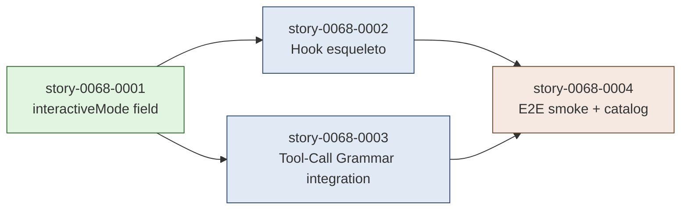

# IMPLEMENTATION MAP — EPIC-0068: Continuous-Flow Heartbeat Hook

**Epic:** EPIC-0068
**Total Stories:** 4
**Phases:** 3 (Phase 0, Phase 1 com paralelismo interno, Phase 2)
**Critical Path Length:** 3 phases sequenciais

---

## 1. Dependency Matrix

| Story | Title | Layer | Phase | Blocked By | Blocks | Status |
| :--- | :--- | :--- | :--- | :--- | :--- | :--- |
| story-0068-0001 | Field `interactiveMode` em `execution-state.json` | 0 | 0 | — | 0002, 0003 | Pendente |
| story-0068-0002 | Hook `enforce-continuous-flow.sh` (esqueleto + smoke) | 1 | 1 | 0001 | 0004 | Pendente |
| story-0068-0003 | Integração Tool-Call Grammar — `derive_next_mandatory_call` (EPIC-0063 `story-0063-0012`; rule number TBD) | 1 | 1 | 0001 | 0004 | Pendente |
| story-0068-0004 | E2E smoke test + catalog entry + CHANGELOG | 2 | 2 | 0001, 0002, 0003 | — | Pendente |

---

## 2. Dependency Graph (Mermaid)



---

## 3. Phase Computation (Kahn)

| Phase | Stories | Critical? | Justificativa |
| :--- | :--- | :--- | :--- |
| **Phase 0** | story-0068-0001 | Sim | Field é foundation — bloqueia 0002 e 0003. |
| **Phase 1** | story-0068-0002, story-0068-0003 | 0002 sim, 0003 paralelo | 0002 entrega hook esqueleto; 0003 estende função interna. Footprints disjuntos no hook script (story-0068-0003 adiciona função à mesma file mas em region distinta). Risco de colisão: BAIXO (sequencializar se EPIC-0041 collision matrix indicar). |
| **Phase 2** | story-0068-0004 | Sim | Test E2E + catalog + CHANGELOG dependem de hook completo (0002 + 0003 mergeadas). |

**Wave de paralelismo possível:** Phase 1 interna (0002 ‖ 0003) sob EPIC-0041 análise de footprint.

**Limitação de paralelismo:** se `enforce-continuous-flow.sh` for editado simultaneamente por 0002 (criação) e 0003 (modificação da mesma file), deve sequencializar. Recomendação default: 0002 → 0003 sequencial até EPIC-0041 analysis indicar safety.

---

## 4. ASCII Phase Diagram

```
Sprint 1                              Sprint 2
─────────────────────────────────────│──────────────────────────────

╔════════════════════╗
║  PHASE 0           ║
║  ┌──────────┐      ║
║  │   0001   │      ║   Foundation
║  │interactive│     ║   (interactiveMode field)
║  │ Mode     │      ║
║  └──────────┘      ║
╚══════════╦═════════╝
           ↓
╔══════════╩═════════════════════╗
║  PHASE 1                       ║
║  ┌──────────┐  ┌──────────┐    ║
║  │   0002   │  │   0003   │    ║   Hook + Tool-Call
║  │ Hook     │‖│ Grammar  │    ║   Grammar integration
║  │ skeleton │  │ deriv.   │    ║   (paralelo se EPIC-0041 ok)
║  └──────────┘  └──────────┘    ║
╚════════════════╦═══════════════╝
                 ↓
╔════════════════╩═══════════════╗
║  PHASE 2                       ║
║  ┌──────────────────┐          ║
║  │      0004        │          ║   E2E smoke + catalog
║  │ Smoke + Catalog  │          ║   + CHANGELOG
║  │ + CHANGELOG      │          ║
║  └──────────────────┘          ║
╚════════════════════════════════╝
```

---

## 5. Critical Path

`0001 → 0002 → 0004` (3 stories, ~3-3.5 dias sequencial)

Caminho alternativo via 0003: `0001 → 0003 → 0004` (3 stories, ~2 dias).

Wallclock total se 0002 ‖ 0003 viáveis: ~2.5 dias.

---

## 6. File Footprint Matrix (EPIC-0041 contract)

### Hotspots tocados

| Hotspot | Story | Tipo | Risco |
| :--- | :--- | :--- | :--- |
| `19-backward-compatibility.md` | 0001 | write (extension) | BAIXO — única story tocando |
| `settings.json` (golden + source) | 0002 | regen (HooksAssembler) | BAIXO — append-only via HooksAssembler |
| `CHANGELOG.md` | 0004 | write (append `[Unreleased]`) | BAIXO — append entry single line |
| `enforce-continuous-flow.sh` | 0002 + 0003 | write (0002 cria), MODIFIED (0003 estende) | MÉDIO — sequencializar |

### Recomendação de Paralelismo

- Phase 0: serial (single story).
- Phase 1: **default sequencial** (0002 → 0003) por colisão direta no `enforce-continuous-flow.sh`. EPIC-0041 `x-parallel-eval` deve confirmar análise antes de promover a paralelo.
- Phase 2: serial (single story dependente de ambas).

---

## 7. Restrições de Paralelismo (EPIC-0041 — informativo)

```yaml
parallelism-constraints:
  phase-1:
    mode: sequential
    reason: "Stories 0002 and 0003 both write to enforce-continuous-flow.sh"
    overrideable: false
```

---

## 8. Métricas de Sucesso (Epic-Level)

| Métrica | Target |
| :--- | :--- |
| Cobertura test E2E | line ≥ 95%, branch ≥ 90% |
| Smoke cenários verdes | 7/7 (5 matriz + 2 self-check) |
| Hook latency (P95) | < 100ms (mede via telemetria do hook em smoke test) |
| Falsos positivos em 30d pós-rollout | 0 (target qualitativo) |
| "Estamos travados?" reports operacionais pós-rollout | 0 (target qualitativo) |

---

## 9. Coordenação com Epics em Andamento

| Epic | Status | Interação com EPIC-0068 |
| :--- | :--- | :--- |
| EPIC-0061 (Non-Interactive Default) | Concluída (`story-0061-0001` mergeada em 2026-04-28 — PRs #755/#756/#757) | **Pré-requisito conceitual satisfeito.** Default-flip ativo em `develop`, hook agora faz sentido para 100% das invocações sem `--interactive`. |
| EPIC-0063 (Local-First Pre-Flight Gates) | Scaffold mergeado (PR #752); 21 stories implementação `PENDING` | **Complementar.** EPIC-0063 fechará boundaries; EPIC-0068 fecha gap intra-fase. `story-0068-0003` espera `story-0063-0012` (Tool-Call Grammar; rule number TBD) mergeada para grammar parsing — fallback genérico documentado em `story-0068-0002` §3.4 se não. |
| EPIC-0064 (Capability-Driven Composition) | Em Refinamento | Sem interação direta. EPIC-0068 não toca capabilities. |
| EPIC-0065 (Feature Creation Chain) | Concluída (PR #754) | Sem interação direta. |
| EPIC-0066 (PR Body Templates) | Backlog | Sem interação direta. EPIC-0068 não modifica PR creation flow. |
| EPIC-0067 (Review YAML Frontmatter) | Backlog | Sem interação direta. |

---

## 10. Observações Estratégicas

### 10.1 Por que apenas 4 stories

Escopo deliberadamente reduzido. Cada story tem entregável concreto e testável isoladamente. Não há story "esqueleto + tudo" — separação por SRP (Rule 03) facilita revisão e rollback.

### 10.2 Por que Phase 0 explícita para o field

Adicionar campo a `execution-state.json` toca 8 SKILL.md + 1 rule + 1 test. É o trabalho mais "horizontal" do epic — separá-lo permite que reviews 0002/0003/0004 foquem na lógica do hook, não em propagação de campo.

### 10.3 Risco residual identificado

Após este epic, ainda há um cenário não coberto: **LLM trava ANTES da primeira tool call** do orquestrador (e.g., parou na leitura inicial do SKILL.md). Esse caso não tem `taskTracking.openTasks` populado ainda — hook resolve para "no orchestrator active" e exit 0. Mitigação parcial: feedback memory `feedback_continuous_flow.md` cobre esse cenário no nível normativo. Se virar problema operacional pós-rollout, abrir EPIC-0069 com Stop hook adicional que detecta "started but no first call".
