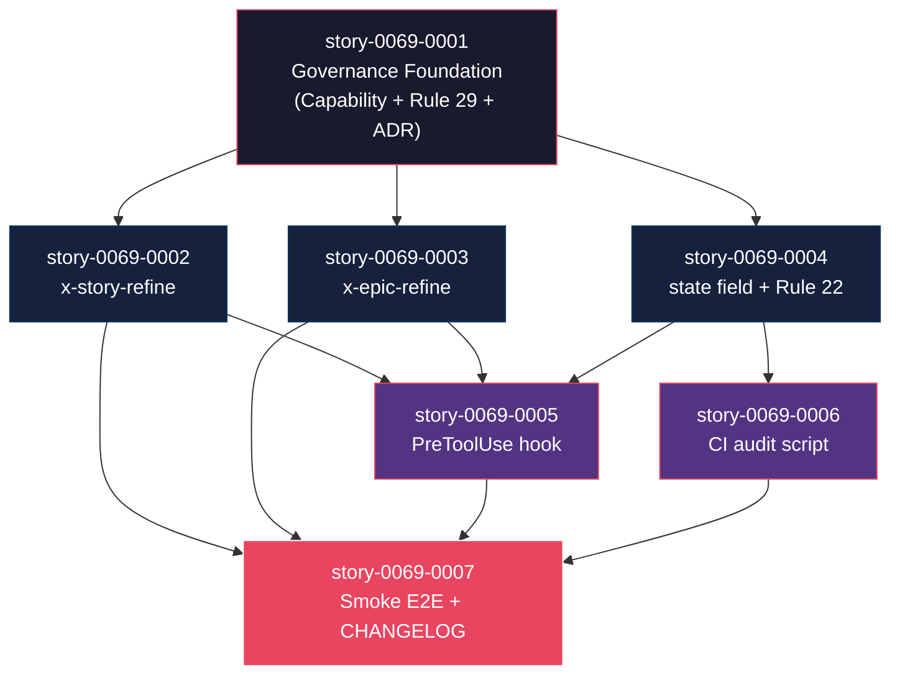

# Mapa de Implementação — EPIC-0069 (Story Refinement & DoR Gate)

**Gerado a partir das dependências BlockedBy/Blocks de cada história do epic-0069.**

> ℹ️ **Refinamento cross-cutting aplicado em 2026-04-28** — paths e referências atualizados conforme epic-0069.md §10 (D-R1..D-R11). Principais correções: D-R3 (Rule 29 publica máquina de estados, não Rule 22); D-R4 (skills em `plan/`, não `refine/`); D-R6 (Rule/ADR numbers são working-titles).

---

## 1. Matriz de Dependências

| Story | Título | Chave Jira | Blocked By | Blocks | Status |
| :--- | :--- | :--- | :--- | :--- | :--- |
| story-0069-0001 | Capability `governance.refinement-gate` + Rule 29 + ADR-0018 | — | — | 0002, 0003, 0004 | Pendente |
| story-0069-0002 | Skill `/x-story-refine` (interativa, 6 dimensões) | — | 0001 | 0005, 0007 | Pendente |
| story-0069-0003 | Skill `/x-epic-refine` (interativa, 7 dimensões) | — | 0001 | 0005, 0007 | Pendente |
| story-0069-0004 | Field `refinementVerdict` em `execution-state.json` + status `Refinada` na Rule 22 | — | 0001 | 0005, 0006 | Pendente |
| story-0069-0005 | PreToolUse hook `enforce-refinement-gate.sh` + exit code `33` | — | 0002, 0003, 0004 | 0007 | Pendente |
| story-0069-0006 | CI audit `audit-refinement-gate.sh` + entry no audit-gates-catalog | — | 0004 | 0007 | Pendente |
| story-0069-0007 | Smoke test E2E `Epic0069RefinementGateSmokeIT` (6 cenários) + CHANGELOG | — | 0002, 0003, 0005, 0006 | — | Pendente |

> **Valores de Status:** `Pendente` (padrão) · `Refinada` · `Em Andamento` · `Concluída` · `Falha` · `Bloqueada` · `Parcial`

> **Nota:** Dependência implícita — story-0007 (smoke) precisa que rule normativa (story-0001) esteja documentada para validação cross-reference, mas via 0005/0006 a dependência é satisfeita transitivamente.

---

## 2. Fases de Implementação

```
╔══════════════════════════════════════════════════════════════════════════╗
║                   FASE 0 — Governance Foundation (sequencial)            ║
║                                                                          ║
║   ┌──────────────────────────────────────────────────────┐               ║
║   │  story-0069-0001  Capability + Rule 29 + ADR-0018    │               ║
║   └──────────────────────┬───────────────────────────────┘               ║
╚══════════════════════════╪═══════════════════════════════════════════════╝
                           │
                           ▼
╔══════════════════════════════════════════════════════════════════════════╗
║                   FASE 1 — Skills + Domain Model (paralelo, 3 stories)   ║
║                                                                          ║
║   ┌─────────────────┐   ┌─────────────────┐   ┌─────────────────┐        ║
║   │ story-0069-0002 │   │ story-0069-0003 │   │ story-0069-0004 │        ║
║   │ x-story-refine  │   │ x-epic-refine   │   │ state field +   │        ║
║   │ (Adapter In)    │   │ (Adapter In)    │   │ Rule 22 update  │        ║
║   └────────┬────────┘   └────────┬────────┘   └────────┬────────┘        ║
╚════════════╪═════════════════════╪═════════════════════╪═════════════════╝
             │                     │                     │
             └─────────────┬───────┴─────────────────────┘
                           ▼
╔══════════════════════════════════════════════════════════════════════════╗
║                   FASE 2 — Infrastructure (paralelo, 2 stories)          ║
║                                                                          ║
║   ┌─────────────────────────┐   ┌────────────────────────────┐           ║
║   │ story-0069-0005         │   │ story-0069-0006            │           ║
║   │ enforce-refinement-     │   │ audit-refinement-gate.sh   │           ║
║   │ gate.sh (PreToolUse)    │   │ (CI script + catalog)      │           ║
║   └─────────────┬───────────┘   └────────────┬───────────────┘           ║
╚═════════════════╪════════════════════════════╪══════════════════════════╝
                  │                            │
                  └────────────┬───────────────┘
                               ▼
╔══════════════════════════════════════════════════════════════════════════╗
║                   FASE 3 — Verification & Release                        ║
║                                                                          ║
║   ┌──────────────────────────────────────────────────────────────┐       ║
║   │  story-0069-0007  Smoke test E2E (6 cenários) + CHANGELOG    │       ║
║   └──────────────────────────────────────────────────────────────┘       ║
╚══════════════════════════════════════════════════════════════════════════╝
```

---

## 3. Caminho Crítico

```
story-0069-0001 → story-0069-0004 → story-0069-0005 → story-0069-0007
   Phase 0          Phase 1            Phase 2            Phase 3
```

**4 fases no caminho crítico, 4 stories na cadeia mais longa (0001 → 0004 → 0005 → 0007).**

Atrasos em qualquer ponto da cadeia atrasam o épico inteiro. Stories 0002, 0003 e 0006 são paralelizáveis dentro de suas fases e absorvem buffer.

---

## 4. Grafo de Dependências (Mermaid)



---

## 5. Resumo por Fase

| Fase | Histórias | Camada | Paralelismo | Pré-requisito |
| :--- | :--- | :--- | :--- | :--- |
| 0 | 0001 | Governance | 1 (sequencial — fundação) | — |
| 1 | 0002, 0003, 0004 | Adapter Inbound + Domain Model | 3 paralelas | Fase 0 concluída |
| 2 | 0005, 0006 | Infrastructure (hook + CI) | 2 paralelas | Fase 1 concluída |
| 3 | 0007 | Test + Documentation | 1 (sequencial) | Fase 2 concluída |

**Total: 7 histórias em 4 fases.**

---

## 6. Detalhamento por Fase

### Fase 0 — Governance Foundation

| Story | Escopo Principal | Artefatos Chave |
| :--- | :--- | :--- |
| 0069-0001 | Capability declarativa, Rule 29 normativa (working-title — D-R6) com **§State Machine Extension** publicando o status `Refinada` (D-R3 (b)), ADR-0018 decision record, KP playbook de refinement | `capabilities/governance/refinement-gate.yaml`, `java/src/main/resources/targets/claude/rules/29-refinement-gate.md` (D-R3 (a) — layout plano vigente), `docs/adr/ADR-0018-refinement-gate.md`, `java/src/main/resources/targets/claude/knowledge/refinement/dimensions.md` |

**Entregas da Fase 0:**
- Fundação normativa pronta para skills, hooks e auditoria consumirem.
- Capabilities families declaradas em `capabilities/_index.yaml`.

### Fase 1 — Skills + Domain Model

| Story | Escopo Principal | Artefatos Chave |
| :--- | :--- | :--- |
| 0069-0002 | Skill interativa de refinamento de história (6 dimensões: persona/valor, AC Gherkin, contratos, métricas, alternativas, riscos) com `model: sonnet` (D-R8) e 6 TaskCreate (D-R10) | `java/src/main/resources/targets/claude/skills/plan/x-story-refine/SKILL.md` (D-R4), KP shared `targets/claude/knowledge/refinement/dimensions.md` |
| 0069-0003 | Skill interativa de refinamento de épico (7 dimensões: problema, persona ampla, hipótese, OKRs, alternativas estratégicas, riscos de produto, escopo) com `model: sonnet` e 7 TaskCreate | `java/src/main/resources/targets/claude/skills/plan/x-epic-refine/SKILL.md` (D-R4) |
| 0069-0004 | Field `refinementVerdict` (com `verdictHash` sha256) em ExecutionState; status `Refinada` na **§State Machine Extension da Rule 29** (NÃO Rule 22 — D-R3 (b)); `_TEMPLATE-REFINEMENT-VERDICT.md` | `domain/model/ExecutionState.java`, `domain/model/RefinementVerdict.java` (record imutável domain-pure), `java/src/main/resources/targets/claude/rules/29-refinement-gate.md` (extended pela story-0001), `java/src/main/resources/shared/templates/_TEMPLATE-REFINEMENT-VERDICT.md` |

**Entregas da Fase 1:**
- Skills user-invocáveis prontas para uso (independentes do gate runtime — gate vem na Fase 2).
- Modelo de domínio + máquina de estados extendidos.

### Fase 2 — Infrastructure (Hook + CI)

| Story | Escopo Principal | Artefatos Chave |
| :--- | :--- | :--- |
| 0069-0005 | PreToolUse hook que bloqueia `x-story-implement` / `x-epic-implement` / `x-task-implement` / `x-epic-orchestrate` quando `refinementVerdict.status != "approved"` (Camada 0 — Rule 26); exit code dedicado (working-default 33 — verificação de não-colisão é primeira task — D-R7) | `java/src/main/resources/targets/claude/hooks/PreToolUse/enforce-refinement-gate.sh`, registro em `settings.json` via `HooksAssembler`, mensagens em PT-BR (Rule 02), bypass único `CLAUDE_RECOVERY_MODE=1` |
| 0069-0006 | CI script consolida verificação de PRs merged sem refinement aprovado (Camada 2 — Rule 26); exit codes 0/1/2/3 padrão; detecção de divergência state↔markdown via `verdictHash` | `java/src/main/resources/targets/claude/scripts/_default/audit-refinement-gate.sh` (D-R2), `governance/baselines/refinement-gate-baseline.txt` (immutable post-merge), entry em `docs/audit-gates-catalog.md` (RULE-004 catalog-before-add) |

**Entregas da Fase 2:**
- Gate runtime (Camada 0) ativo.
- Gate CI (Camada 2) ativo.

### Fase 3 — Verification & Release

| Story | Escopo Principal | Artefatos Chave |
| :--- | :--- | :--- |
| 0069-0007 | Smoke test E2E cobrindo 6 cenários (aprovação, bloqueio, refinement parcial, opt-out legacy, hotfix bypass, refinement de épico vs story); CHANGELOG entry MINOR (versão TBD — não pinada); CLAUDE.md ganha bloco "REFINEMENT GATE — INEGOCIÁVEL" | `java/src/test/java/dev/iadev/skills/Epic0069RefinementGateSmokeIT.java` (D-R11 — suffix `IT` integration), `java/src/test/resources/fixtures/epic-0069/`, `CHANGELOG.md`, `CLAUDE.md`, dogfood pós-merge (PR follow-up) |

**Entregas da Fase 3:**
- Smoke verde em CI.
- CHANGELOG documenta mudança.
- CLAUDE.md ganha bloco "REFINEMENT GATE — INEGOCIÁVEL".

---

## 7. Observações Estratégicas

### Gargalo Principal

**story-0069-0001** é o gargalo absoluto — bloqueia todo o resto. Investir tempo extra em design da capability + rule + ADR compensa porque define o contrato que as 6 stories seguintes implementam.

### Histórias Folha (sem dependentes)

**story-0069-0007** é a única folha — natural, é o smoke test final.

### Otimização de Tempo

- Fase 1: 3 paralelas — alocar 3 sub-agents/devs simultaneamente.
- Fase 2: 2 paralelas — alocar 2 simultaneamente.
- Fase 0 e 3: sequenciais por natureza.
- Tempo mínimo (paralelismo perfeito): 4 fases × tempo médio de story.

### Dependências Cruzadas

- story-0005 depende de 0002 + 0003 + 0004 (3 entradas) — é o ponto de convergência do épico.
- story-0007 (smoke) depende de 0002, 0003, 0005, 0006 — natural para teste E2E.

### Marco de Validação Arquitetural

**story-0069-0004** (state field + §State Machine Extension da Rule 29 — D-R3 (b)) é o checkpoint arquitetural. Se a §State Machine Extension da Rule 29 estiver mal-modelada (transição `Refinada` ambígua), todo o resto sofre. Gate de revisão extra recomendado nesta story antes de Fase 2 começar.

> **Correção do scaffold:** o scaffold original referenciava "Rule 22 — lifecycle-integrity" para a máquina de estados. Isso é incorreto — Rule 22 é "Skill Visibility". Cohesion: a máquina de estados foi movida para dentro da Rule 29 (que é nascente e define o estado `Refinada`).

---

## 8. Dependências entre Tasks (Cross-Story)

> Section gerada quando histórias contiverem tasks formais. Como as stories deste épico estão em `Pendente` (a serem refinadas via EPIC-0069 dogfood), tasks ainda não foram detalhadas e esta seção é placeholder.

A ser populada quando `/x-story-refine` rodar sobre cada story do EPIC-0069 — meta: o próprio épico de refinement será o primeiro a usar a skill que entrega.

---

## 8.5 Restrições de Paralelismo

> Análise gerada por `/x-parallel-eval` (a executar quando stories estiverem refinadas com File Footprint blocks).

**Conflitos detectados:** desconhecido (footprint a ser registrado pós-refinement).

**Hotspot esperado por análise prévia:**
- `settings.json` (regen) — story-0005 toca para registrar hook.
- `capabilities/_index.yaml` (regen) — story-0001 toca.
- `CHANGELOG.md` (regen) — story-0007 toca.
- `docs/audit-gates-catalog.md` (regen) — story-0006 (entry para o novo CI script `audit-refinement-gate.sh`). Story-0001 publica Rule 29 + ADR-0018, mas a Rule por si não tem entry no catálogo de audit gates (catálogo lista gates executáveis: hooks, CI scripts, Java tests, workflows — não rules).

Recomendação preliminar: zero colisão hard prevista; story-0001 e story-0006 podem rodar em paralelo dentro de suas respectivas fases sem conflito sobre o catálogo.
