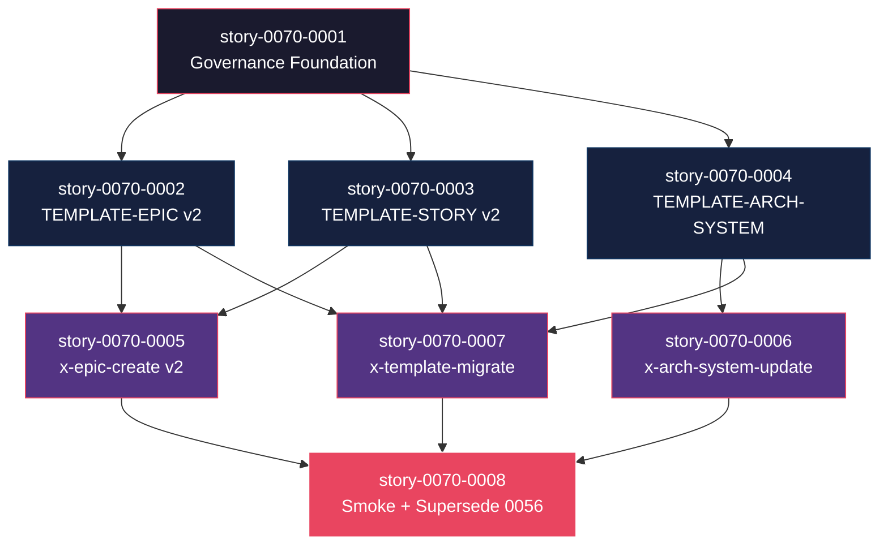

# Mapa de Implementação — EPIC-0070 (Value-Driven Templates v2)

**Gerado a partir das dependências BlockedBy/Blocks de cada história do epic-0070.**

---

## 1. Matriz de Dependências

| Story | Título | Chave Jira | Blocked By | Blocks | Status |
| :--- | :--- | :--- | :--- | :--- | :--- |
| story-0070-0001 | Capability + Rule 30 + ADR-0019 + decisão template v2 | — | — | 0002, 0003, 0004 | Pendente |
| story-0070-0002 | Reescrever `_TEMPLATE-EPIC.md` v2 | — | 0001 | 0005, 0007, 0008 | Pendente |
| story-0070-0003 | Reescrever `_TEMPLATE-STORY.md` v2 | — | 0001 | 0005, 0007, 0008 | Pendente |
| story-0070-0004 | `_TEMPLATE-ARCHITECTURE-SYSTEM.md` (auto-fill via YAML) | — | 0001 | 0006, 0007, 0008 | Pendente |
| story-0070-0005 | Atualizar `x-epic-create`/`x-story-create` para v2 | — | 0002, 0003 | 0008 | Pendente |
| story-0070-0006 | Skill `/x-arch-system-update` | — | 0004 | 0008 | Pendente |
| story-0070-0007 | Skill `/x-template-migrate` (v1→v2) | — | 0002, 0003, 0004 | 0008 | Pendente |
| story-0070-0008 | Smoke + audit + CHANGELOG + supersede EPIC-0056 | — | 0005, 0006, 0007 | — | Pendente |

> **Valores de Status:** `Pendente` · `Refinada` · `Em Andamento` · `Concluída` · `Falha` · `Bloqueada` · `Parcial`

> **Nota:** EPIC-0056 (RA9) é marcado superseded em story-0070-0008 — dependência cross-epic implícita.

---

## 2. Fases de Implementação

```
╔══════════════════════════════════════════════════════════════════════════╗
║                   FASE 0 — Governance + Decisão de Substituição          ║
║                                                                          ║
║   ┌──────────────────────────────────────────────────────┐               ║
║   │  story-0070-0001  Capability + Rule 30 + ADR-0019    │               ║
║   └──────────────────────┬───────────────────────────────┘               ║
╚══════════════════════════╪═══════════════════════════════════════════════╝
                           │
                           ▼
╔══════════════════════════════════════════════════════════════════════════╗
║                   FASE 1 — Templates v2 (paralelo, 3 stories)            ║
║                                                                          ║
║   ┌─────────────────┐   ┌─────────────────┐   ┌────────────────────┐     ║
║   │ story-0070-0002 │   │ story-0070-0003 │   │ story-0070-0004    │     ║
║   │ TEMPLATE-EPIC   │   │ TEMPLATE-STORY  │   │ TEMPLATE-           │     ║
║   │ v2 (foco valor) │   │ v2 (foco valor) │   │ ARCHITECTURE-       │     ║
║   │                 │   │                 │   │ SYSTEM (YAML auto-  │     ║
║   │                 │   │                 │   │ fill)               │     ║
║   └────────┬────────┘   └────────┬────────┘   └────────┬───────────┘     ║
╚════════════╪═════════════════════╪═════════════════════╪═════════════════╝
             │                     │                     │
             ▼                     ▼                     ▼
╔══════════════════════════════════════════════════════════════════════════╗
║                   FASE 2 — Skills (paralelo, 3 stories)                  ║
║                                                                          ║
║   ┌─────────────────────┐   ┌─────────────────────┐   ┌──────────────┐   ║
║   │ story-0070-0005     │   │ story-0070-0006     │   │ story-0070-  │   ║
║   │ x-epic-create /     │   │ x-arch-system-      │   │ 0007         │   ║
║   │ x-story-create v2   │   │ update              │   │ x-template-  │   ║
║   │                     │   │                     │   │ migrate      │   ║
║   └─────────┬───────────┘   └─────────┬───────────┘   └─────┬────────┘   ║
╚═════════════╪═════════════════════════╪═════════════════════╪════════════╝
              │                         │                     │
              └─────────────┬───────────┴─────────────────────┘
                            ▼
╔══════════════════════════════════════════════════════════════════════════╗
║                   FASE 3 — Verification + Supersedência                  ║
║                                                                          ║
║   ┌──────────────────────────────────────────────────────────────┐       ║
║   │  story-0070-0008  Smoke + audit + CHANGELOG + EPIC-0056      │       ║
║   │                   marked Superseded                          │       ║
║   └──────────────────────────────────────────────────────────────┘       ║
╚══════════════════════════════════════════════════════════════════════════╝
```

---

## 3. Caminho Crítico

```
story-0070-0001 → story-0070-0004 → story-0070-0006 → story-0070-0008
   Phase 0          Phase 1            Phase 2            Phase 3
```

**4 fases no caminho crítico.** Cadeia mais longa (4 stories): 0001 → 0004 (system template) → 0006 (skill que atualiza system.md) → 0008 (smoke).

---

## 4. Grafo de Dependências (Mermaid)



---

## 5. Resumo por Fase

| Fase | Histórias | Camada | Paralelismo | Pré-requisito |
| :--- | :--- | :--- | :--- | :--- |
| 0 | 0001 | Governance | 1 (sequencial) | — |
| 1 | 0002, 0003, 0004 | Templates | 3 paralelas | Fase 0 |
| 2 | 0005, 0006, 0007 | Skills (Adapter Inbound) | 3 paralelas | Fase 1 |
| 3 | 0008 | Test + Doc + Supersedência | 1 (sequencial) | Fase 2 |

**Total: 8 histórias em 4 fases.**

---

## 6. Detalhamento por Fase

### Fase 0 — Governance Foundation
| Story | Escopo Principal | Artefatos Chave |
| :--- | :--- | :--- |
| 0070-0001 | Capability `governance.value-driven-templates`, Rule 30, ADR-0019, decisão sobre rule compartilhada com EPIC-0071 | `capabilities/governance/value-driven-templates.yaml`, `rules/core/30-value-driven-templates.md`, `docs/adr/ADR-0019-...md` |

### Fase 1 — Templates v2
| Story | Escopo Principal | Artefatos Chave |
| :--- | :--- | :--- |
| 0070-0002 | TEMPLATE-EPIC v2: 9 seções pivotadas (Visão, Persona, Hipótese, Alternativas, Escopo, Riscos, Stories, Quality Gates, Origem) | `shared/templates/_TEMPLATE-EPIC.md` (rewrite) |
| 0070-0003 | TEMPLATE-STORY v2: 9 seções (Visão, Persona, Entrega, AC Gherkin, Contratos, Tasks, Dependências, Decision Rationale, Refinement Verdict) | `shared/templates/_TEMPLATE-STORY.md` (rewrite) |
| 0070-0004 | TEMPLATE-ARCHITECTURE-SYSTEM: 11 seções, auto-fill via YAML (stack, persistência, comunicação, observabilidade, resilience, perf budget, security baseline, dep policy, doc targets, integrações, decision log) | `shared/templates/_TEMPLATE-ARCHITECTURE-SYSTEM.md` (NEW) |

### Fase 2 — Skills
| Story | Escopo Principal | Artefatos Chave |
| :--- | :--- | :--- |
| 0070-0005 | `x-epic-create` e `x-story-create` emitem v2 por padrão; flag `--legacy-template-v1` para opt-out (deprecation 2 releases) | SKILL.md modificadas |
| 0070-0006 | `/x-arch-system-update` atualiza `docs/architecture/system.md` incrementalmente (lê épico recém-implementado + ADRs novos + diff YAML) | NEW `targets/claude/skills/plan/x-arch-system-update/SKILL.md` |
| 0070-0007 | `/x-template-migrate` assistida v1→v2 com diff + perguntas por bloco técnico | NEW `targets/claude/skills/plan/x-template-migrate/SKILL.md` |

### Fase 3 — Verification + Supersedência
| Story | Escopo Principal | Artefatos Chave |
| :--- | :--- | :--- |
| 0070-0008 | Smoke E2E (gerar epic v2, gerar story v2, atualizar system.md, migrar epic v1) + audit `audit-template-version.sh` + EPIC-0056 marked Superseded + CHANGELOG MAJOR | `Epic0070ValueTemplatesSmokeIT.java`, `audit-template-version.sh`, `epic-0056.md` (marker), `CHANGELOG.md` |

---

## 7. Observações Estratégicas

### Gargalo Principal
**story-0070-0001** define decisões fundadoras (Rule única ou compartilhada com 0071). Investimento extra em design vale.

### Histórias Folha
**story-0070-0008** é a única folha (smoke + supersedência).

### Otimização de Tempo
- Fase 1: 3 paralelas (templates independentes).
- Fase 2: 3 paralelas (skills independentes — cada uma consome templates próprios).
- Total mínimo: 4 fases.

### Dependências Cruzadas
- story-0007 depende de 0002+0003+0004 (3 entradas) — concentra integração de templates.
- story-0008 (smoke) depende de 0005+0006+0007 — natural.

### Marco de Validação Arquitetural
**story-0070-0004** é o checkpoint — se TEMPLATE-ARCHITECTURE-SYSTEM ficar mal-modelado (auto-fill confuso, seções erradas), o `system.md` produzido nos projetos cliente fica ruim para sempre. Code-review extra recomendado.

---

## 8. Dependências entre Tasks (Cross-Story)

A ser populada pós-refinement (EPIC-0069).

---

## 8.5 Restrições de Paralelismo

**Hotspots esperados:**
- `shared/templates/_TEMPLATE-*.md` — múltiplos arquivos novos/reescritos; sem colisão entre 0002/0003/0004 (arquivos diferentes).
- `targets/claude/skills/plan/*/SKILL.md` — 3 SKILLs distintas em Fase 2 (sem colisão).
- `CHANGELOG.md` (regen) — story-0008.
- `epic-0056.md` (write) — story-0008 toca para supersedência.
- Goldens regenerados (regen) — afeta os 9 perfis canônicos.

**Recomendação:** 3 paralelas em Fase 1 e Fase 2 são seguras (zero colisão entre stories).
