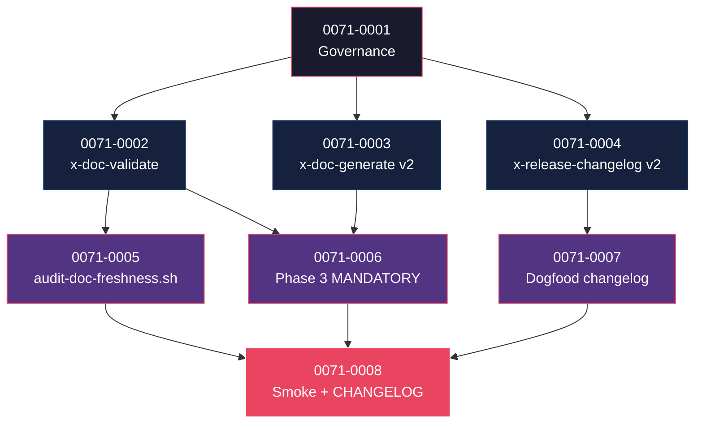

# Mapa de Implementação — EPIC-0071 (Documentation as DoD)

**Gerado a partir das dependências BlockedBy/Blocks de cada história do epic-0071.**

---

## 1. Matriz de Dependências

| Story | Título | Blocked By | Blocks | Status |
| :--- | :--- | :--- | :--- | :--- |
| story-0071-0001 | Capability + Rule 31 + ADR-0020 + parse YAML `documentation.targets` | — | 0002, 0003, 0004 | Pendente |
| story-0071-0002 | Skill `/x-doc-validate` (target stack-aware) | 0001 | 0006, 0008 | Pendente |
| story-0071-0003 | `x-doc-generate` v2 (target-stack-aware + integração com x-arch-system-update) | 0001 | 0006, 0008 | Pendente |
| story-0071-0004 | `x-release-changelog` v2 (formato híbrido) + `_TEMPLATE-CHANGELOG-ENTRY.md` | 0001 | 0007, 0008 | Pendente |
| story-0071-0005 | CI script `audit-doc-freshness.sh` | 0002 | 0008 | Pendente |
| story-0071-0006 | Phase 3 de x-story-implement MODIFIED (MANDATORY doc-generate + doc-validate) | 0002, 0003 | 0008 | Pendente |
| story-0071-0007 | Regenerar primeiro changelog híbrido para release atual (dogfood) | 0004 | 0008 | Pendente |
| story-0071-0008 | Smoke E2E + CHANGELOG MAJOR | 0005, 0006, 0007 | — | Pendente |

---

## 2. Fases de Implementação

```
FASE 0 — Governance (sequencial)
  └─ story-0071-0001  Capability + Rule 31 + ADR + YAML schema
       │
       ▼
FASE 1 — Skills + Template (paralelo, 3 stories)
  ├─ story-0071-0002  x-doc-validate (target stack-aware)
  ├─ story-0071-0003  x-doc-generate v2
  └─ story-0071-0004  x-release-changelog v2 + TEMPLATE-CHANGELOG-ENTRY
       │
       ▼
FASE 2 — Infra + Integration + Dogfood (paralelo, 3 stories)
  ├─ story-0071-0005  audit-doc-freshness.sh (CI script)
  ├─ story-0071-0006  Phase 3 MANDATORY contract change
  └─ story-0071-0007  Dogfood: changelog híbrido para release atual
       │
       ▼
FASE 3 — Smoke + Release (sequencial)
  └─ story-0071-0008  E2E smoke + CHANGELOG MAJOR
```

---

## 3. Caminho Crítico

```
story-0071-0001 → story-0071-0002 → story-0071-0006 → story-0071-0008
                  (skill validate)   (Phase 3 mod)       (smoke)
```

**4 fases.** Cadeia mais longa: 0001 → 0002 → 0006 → 0008.

---

## 4. Grafo de Dependências (Mermaid)



---

## 5. Resumo por Fase

| Fase | Histórias | Camada | Paralelismo | Pré-requisito |
| :--- | :--- | :--- | :--- | :--- |
| 0 | 0001 | Governance + Domain | 1 | — |
| 1 | 0002, 0003, 0004 | Skills + Templates | 3 paralelas | Fase 0 |
| 2 | 0005, 0006, 0007 | Infra + Integration + Dogfood | 3 paralelas | Fase 1 |
| 3 | 0008 | Test + Release | 1 | Fase 2 |

**Total: 8 histórias em 4 fases.**

---

## 6. Detalhamento por Fase

### Fase 0
- **0071-0001**: Schema YAML novo (`documentation.targets`), capability `governance.doc-as-dod`, Rule 31, ADR-0020.

### Fase 1
- **0071-0002**: skill `/x-doc-validate` valida 6 targets (README, OpenAPI, asyncapi, gRPC proto, ADR, skill-docs, system.md).
- **0071-0003**: `x-doc-generate` v2 stack-aware + integração com `x-arch-system-update` (EPIC-0070).
- **0071-0004**: `x-release-changelog` v2 formato híbrido (Highlights + Keep-a-Changelog) + template novo.

### Fase 2
- **0071-0005**: CI script `audit-doc-freshness.sh`.
- **0071-0006**: Phase 3 de `x-story-implement` ganha invocação MANDATORY de `x-doc-generate` + `x-doc-validate`.
- **0071-0007**: dogfood — gerar primeiro changelog híbrido para a release que vai entregar o épico (auto-referencial intencional).

### Fase 3
- **0071-0008**: smoke E2E + CHANGELOG entry MAJOR (Phase 3 contract change).

---

## 7. Observações Estratégicas

### Gargalo Principal
**story-0071-0006** (Phase 3 MANDATORY) é onde o gate trava. Erro aqui bloqueia projetos novos. Code-review extra.

### Histórias Folha
**story-0071-0008**.

### Otimização de Tempo
- Fase 1: 3 paralelas.
- Fase 2: 3 paralelas. Story 0007 (dogfood) é independente das outras duas — pode rodar simultaneamente sem conflito.

### Dependências Cruzadas
- 0006 depende de 0002+0003 (skills prontas).
- 0008 depende de 0005+0006+0007.

### Marco de Validação Arquitetural
**story-0071-0002** (x-doc-validate) — se freshness check tiver false-positives, gate vira ruído. Validar com 3-5 PRs históricos antes de Fase 2.

---

## 8. Dependências entre Tasks (Cross-Story)

A ser populada pós-refinement.

---

## 8.5 Restrições de Paralelismo

**Hotspots:**
- `targets/claude/skills/x-doc-generate/SKILL.md` (regen) — só story 0003.
- `targets/claude/skills/x-story-implement/SKILL.md` (regen) — só story 0006.
- `CHANGELOG.md` — stories 0007 e 0008. Recomendação: rodar 0007 antes de 0008 (mesmo arquivo).
- `_index.yaml` capabilities — story 0001.

**Recomendação:** 3 paralelas em Fase 1 são seguras. Em Fase 2, 0007 toca CHANGELOG; rodar antes de 0008 (mesma fase, ordem matters).
