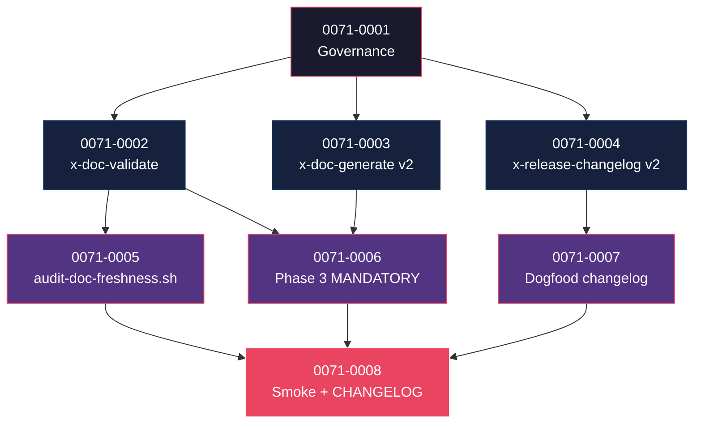

# Mapa de Implementação — EPIC-0071 (Documentation as DoD)

**Gerado a partir das dependências BlockedBy/Blocks de cada história do epic-0071.**

---

## 1. Matriz de Dependências

| Story | Título | Blocked By | Blocks | Status |
| :--- | :--- | :--- | :--- | :--- |
| story-0071-0001 | Capability + Rule 31 + ADR-0020 + parse YAML `documentation.targets` | — | 0002, 0003, 0004 | Pendente |
| story-0071-0002 | Skill `/x-doc-validate` (target stack-aware) | 0001 | 0006, 0008 | Pendente |
| story-0071-0003 | `x-doc-generate` v2 (target-stack-aware + integração com x-arch-system-update) | 0001 | 0006, 0008 | Pendente |
| story-0071-0004 | `x-release-changelog` v2 (formato híbrido) + `_TEMPLATE-CHANGELOG-ENTRY.md` | 0001 | 0007, 0008 | Pendente |
| story-0071-0005 | CI script `audit-doc-freshness.sh` | 0002 | 0008 | Pendente |
| story-0071-0006 | Phase 3 de x-story-implement MODIFIED (MANDATORY doc-generate + doc-validate) | 0002, 0003 | 0008 | Pendente |
| story-0071-0007 | Regenerar primeiro changelog híbrido para release atual (dogfood) | 0004 | 0008 | Pendente |
| story-0071-0008 | Smoke E2E + CHANGELOG MAJOR | 0005, 0006, 0007 | — | Pendente |

---

## 2. Fases de Implementação

```
FASE 0 — Governance (sequencial)
  └─ story-0071-0001  Capability + Rule 31 + ADR + YAML schema
       │
       ▼
FASE 1 — Skills + Template (paralelo, 3 stories)
  ├─ story-0071-0002  x-doc-validate (target stack-aware)
  ├─ story-0071-0003  x-doc-generate v2
  └─ story-0071-0004  x-release-changelog v2 + TEMPLATE-CHANGELOG-ENTRY
       │
       ▼
FASE 2 — Infra + Integration + Dogfood (paralelo, 3 stories)
  ├─ story-0071-0005  audit-doc-freshness.sh (CI script)
  ├─ story-0071-0006  Phase 3 MANDATORY contract change
  └─ story-0071-0007  Dogfood: changelog híbrido para release atual
       │
       ▼
FASE 3 — Smoke + Release (sequencial)
  └─ story-0071-0008  E2E smoke + CHANGELOG MAJOR
```

---

## 3. Caminho Crítico

```
story-0071-0001 → story-0071-0002 → story-0071-0006 → story-0071-0008
                  (skill validate)   (Phase 3 mod)       (smoke)
```

**4 fases.** Cadeia mais longa: 0001 → 0002 → 0006 → 0008.

---

## 4. Grafo de Dependências (Mermaid)



---

## 5. Resumo por Fase

| Fase | Histórias | Camada | Paralelismo | Pré-requisito |
| :--- | :--- | :--- | :--- | :--- |
| 0 | 0001 | Governance + Domain | 1 | — |
| 1 | 0002, 0003, 0004 | Skills + Templates | 3 paralelas | Fase 0 |
| 2 | 0005, 0006, 0007 | Infra + Integration + Dogfood | 3 paralelas | Fase 1 |
| 3 | 0008 | Test + Release | 1 | Fase 2 |

**Total: 8 histórias em 4 fases.**

---

## 6. Detalhamento por Fase

### Fase 0
- **0071-0001**: Schema YAML novo (`documentation.targets`), capability `governance.doc-as-dod`, Rule (NN TBD — palpite 31; **D-R3**), ADR (NNNN TBD — palpite 0020; **D-R4**), `DocumentationConfig.java`. Path Rule via **D-R2**; capability dir via **D-R9**.

### Fase 1 (3 paralelas — toleráveis)
- **0071-0002**: skill `/x-doc-validate` valida 6 targets (README, OpenAPI, asyncapi, gRPC proto, ADR, skill-docs, system.md). Path source-of-truth via **D-R1** (`core/ops/`). Frontmatter v3.0 via **D-R6**.
- **0071-0003**: `x-doc-generate` v2 stack-aware + integração com `x-arch-system-update` (EPIC-0070). Modo degradado quando EPIC-0070 indisponível. Frontmatter v3.0 via **D-R6**.
- **0071-0004**: `x-release-changelog` v2 formato híbrido (Highlights + Keep-a-Changelog) + `_TEMPLATE-CHANGELOG-ENTRY.md`. Modo degradado D-R10 quando EPIC-0070 indisponível.

### Fase 2 (3 paralelas com ressalva — ver §8.5)
- **0071-0005**: CI script `audit-doc-freshness.sh` em `targets/claude/scripts/_default/`; entry simultânea em `audit-gates-catalog.md` (RULE-004); registro em `ScriptsAssembler.AUDIT_SCRIPTS`. Exit codes Rule 26 §Standardized via **D-R5**.
- **0071-0006**: Phase 3 de `x-story-implement` ganha invocação MANDATORY de `x-doc-generate` + `x-doc-validate`. `--skip-doc` restrito a `## Recovery` (Rule 27 Exception 1) ou hotfix (Exception 2) via **D-R11**. `audit-bypass-flags.sh` estendido.
- **0071-0007**: dogfood — gerar primeiro changelog híbrido para release que entrega EPIC-0071 (auto-referencial intencional). Versão TBD via **D-R12**.

### Fase 3
- **0071-0008**: smoke E2E `Epic0071DocAsDoDSmokeIT` (5 cenários) + CHANGELOG entry MAJOR (Phase 3 contract change; versão pinada em release-time conforme **D-R12**).

---

## 7. Observações Estratégicas

### Gargalo Principal
**story-0071-0006** (Phase 3 MANDATORY) é onde o gate trava. Erro aqui bloqueia projetos novos. Code-review extra.

### Histórias Folha
**story-0071-0008**.

### Otimização de Tempo
- Fase 1: 3 paralelas.
- Fase 2: 3 paralelas. Story 0007 (dogfood) é independente das outras duas — pode rodar simultaneamente sem conflito.

### Dependências Cruzadas
- 0006 depende de 0002+0003 (skills prontas).
- 0008 depende de 0005+0006+0007.

### Marco de Validação Arquitetural
**story-0071-0002** (x-doc-validate) — se freshness check tiver false-positives, gate vira ruído. Validar com 3-5 PRs históricos antes de Fase 2.

---

## 8. Dependências entre Tasks (Cross-Story)

| Cross-story dependency | Origem | Destino | Motivo |
| :--- | :--- | :--- | :--- |
| `governance/baselines/doc-freshness-baseline.txt` | story-0071-0005 task-004 (cria initial empty) | story-0071-0008 task-002 (verifica consistência) | Mesmo arquivo; 0005 cria, 0008 valida. |
| `docs/audit-gates-catalog.md` entry | story-0071-0001 task-009 (reserva opcional) → story-0071-0005 task-006 (entry simultâneo com script) → story-0071-0008 task-003 (consolida com link final) | encadeamento RULE-004 Catalog-before-Add | 0001 reserva precoce; 0005 cria entry junto com script; 0008 consolida e pode editar. |
| `targets/claude/rules/24-execution-integrity.md` §Mandatory Evidence Artifacts | story-0071-0006 task-002 (adiciona entry para `x-doc-validate`) | story-0071-0008 task-008 (sincroniza/valida) | Mesmo arquivo; ambas stories editam — rodar 0006 ANTES de 0008. |
| `CHANGELOG.md` | story-0071-0007 task-004 (dogfood entry) | story-0071-0008 task-004 (consolida MAJOR placeholder) | Mesmo arquivo; ordem mandatória 0007 → 0008. |
| `audit-bypass-flags.sh` extension | story-0071-0006 task-003 (estende para `--skip-doc`) | story-0071-0008 (smoke valida) | 0006 modifica script; 0008 valida via cenário 5 do smoke. |
| `ScriptsAssembler.AUDIT_SCRIPTS` | story-0071-0005 task-007 (adiciona `audit-doc-freshness.sh`) | story-0071-0008 (smoke valida instalação determinística) | 0005 wire; 0008 valida. |
| `epic-0071.md` Status field | story-0071-0008 task-006 (marca Concluída) | — | Final do épico; só após Phase 3 completa. |

---

## 8.5 Restrições de Paralelismo

**Hotspots:**
- `java/src/main/resources/targets/claude/skills/core/ops/x-doc-generate/SKILL.md` (regen) — só story 0003 (D-R1 paths).
- `java/src/main/resources/targets/claude/skills/core/ops/x-release-changelog/SKILL.md` (regen) — só story 0004.
- `java/src/main/resources/targets/claude/skills/core/dev/x-story-implement/SKILL.md` (regen) — só story 0006.
- `CHANGELOG.md` — stories 0007 e 0008. **Ordem mandatória:** 0007 ANTES de 0008.
- `targets/claude/rules/24-execution-integrity.md` — stories 0006 e 0008. **Ordem mandatória:** 0006 ANTES de 0008.
- `docs/audit-gates-catalog.md` — stories 0001 (reserva opcional), 0005 (entry com script), 0008 (consolida). Sequencial: 0001 → 0005 → 0008.
- `governance/baselines/doc-freshness-baseline.txt` — story 0005 cria; 0008 valida. Sequencial.
- `capabilities/governance/doc-as-dod.yaml` — story 0001 cria. Single-writer.
- `ScriptsAssembler.AUDIT_SCRIPTS` (Java) — story 0005 wire. Single-writer.

**Recomendação:**
- **Fase 1 (3 paralelas):** seguras — stories 0002, 0003, 0004 tocam arquivos disjuntos.
- **Fase 2 (3 paralelas):** seguras com ressalva — 0007 toca `CHANGELOG.md`; 0008 também tocará. Ordem: 0007 ANTES de 0008. Stories 0005, 0006 podem rodar concorrentes com 0007.
- **Fase 3 (1 sequencial):** 0008 final, depois de todas demais.

---

## 9. Refinement Consolidado (PR `chore/refine-epic-0071 → develop`)

> Sumariza o passe de refinement aplicado sobre o épico-0071 e suas 8 stories. Refere-se ao bloco **§10. Decisões de Refinement (D-R1..D-R12)** do `epic-0071.md`. **Status das stories permanece `Pendente`** — refinement não muda status (mesma convenção dos refinements EPIC-0063/0064/0065/0067/0069/0070).

### 9.1 Decisões aplicadas

| ID | Resumo | Stories afetadas |
| :--- | :--- | :--- |
| D-R1 | Path source-of-truth `core/<categoria>/` (não `core/doc/`). | 0002, 0003, 0004, 0006 |
| D-R2 | Path Rule plano vigente em `targets/claude/rules/`. | 0001 |
| D-R3 | Numeração Rule TBD (palpite Rule 31). | 0001 |
| D-R4 | Numeração ADR TBD (palpite ADR-0020). | 0001 |
| D-R5 | Exit codes Rule 26 §Standardized + `--self-check`. | 0005 |
| D-R6 | Frontmatter v3.0 obrigatório nos artefatos novos/modificados. | 0001..0006 |
| D-R7 | Critério Rule fundida vs separada com EPIC-0070 (≥30% sobreposição → fundir; default = separada). | 0001 |
| D-R8 | `flowVersion=4` + `taskTracking.enabled=true`; exit code Phase 3 abort TBD. | epic + 0001..0008, especialmente 0006 |
| D-R9 | EPIC-0064 Phase 2 (capabilities directory + schemas) é hard prereq. | 0001 |
| D-R10 | EPIC-0070 hard prereq + modo degradado documentado para Highlights. | 0004 |
| D-R11 | `--skip-doc` restrito a `## Recovery`/hotfix (Rule 27 Exceptions 1+2). | 0006 |
| D-R12 | CHANGELOG MAJOR sem versão pinada (release-time materializa). | 0007, 0008 |

### 9.2 Próximo passo após merge deste refinement

1. `Skill(skill: "x-internal-epic-branch-ensure", args: "--epic-id 0071 --layout v4")` cria/garante `epic/0071`.
2. `/x-epic-implement EPIC-0071` orquestra Phase 0..3 conforme caminho crítico §3.

### 9.3 Bloqueios externos a destravar antes do kickoff

- **EPIC-0064 Phase 2** (capabilities directory + schemas) — D-R9. Hard.
- **EPIC-0070** (Templates v2) — D-R10. Hard prereq para Highlights; modo degradado é fallback aceito.
- **EPIC-0069** (Refinement Gate) — soft prereq; refinement manual atual cobre o gap.
