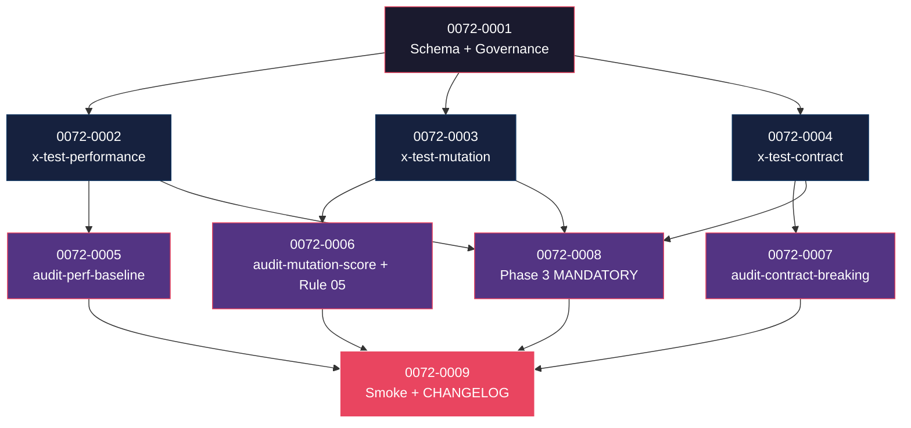

# Mapa de Implementação — EPIC-0072 (Comprehensive Test Strategy)

---

## 1. Matriz de Dependências

| Story | Título | Blocked By | Blocks | Status |
| :--- | :--- | :--- | :--- | :--- |
| story-0072-0001 | Schema YAML `quality:` + `QualityConfig.java` + capabilities + ADR-0021 | — | 0002, 0003, 0004 | Pendente |
| story-0072-0002 | Skill `/x-test-performance` (REST/gRPC/CLI/GraphQL) + template + KP | 0001 | 0005, 0008 | Pendente |
| story-0072-0003 | Skill `/x-test-mutation` (PIT/Stryker/mutmut/go-mutesting) + template + KP | 0001 | 0006, 0008 | Pendente |
| story-0072-0004 | Skill `/x-test-contract` (openapi-diff/Pact/buf/SCC) + template + KP | 0001 | 0007, 0008 | Pendente |
| story-0072-0005 | CI script `audit-perf-baseline.sh` | 0002 | 0009 | Pendente |
| story-0072-0006 | CI script `audit-mutation-score.sh` + Rule 05 estendida | 0003 | 0009 | Pendente |
| story-0072-0007 | CI script `audit-contract-breaking.sh` | 0004 | 0009 | Pendente |
| story-0072-0008 | Phase 3 MODIFIED — MANDATORY conditional dos 3 testes | 0002, 0003, 0004 | 0009 | Pendente |
| story-0072-0009 | Smoke E2E + CHANGELOG MAJOR | 0005, 0006, 0007, 0008 | — | Pendente |

---

## 2. Fases de Implementação

```
FASE 0 — Governance + Schema (sequencial)
  └─ 0072-0001  Schema YAML quality + QualityConfig + capabilities families + ADR
       │
       ▼
FASE 1 — 3 Skills sibling (paralelo, 3 stories)
  ├─ 0072-0002  x-test-performance (stack-aware: Newman/ghz/k6/hyperfine/Artillery)
  ├─ 0072-0003  x-test-mutation (PIT/Stryker/mutmut/go-mutesting)
  └─ 0072-0004  x-test-contract (openapi-diff/Pact/buf/SCC)
       │
       ▼
FASE 2 — CI scripts + Phase 3 (paralelo, 4 stories)
  ├─ 0072-0005  audit-perf-baseline.sh
  ├─ 0072-0006  audit-mutation-score.sh + Rule 05 atualizada
  ├─ 0072-0007  audit-contract-breaking.sh
  └─ 0072-0008  Phase 3 MANDATORY conditional invocations
       │
       ▼
FASE 3 — Smoke + Release
  └─ 0072-0009  E2E smoke (8 cenários) + CHANGELOG MAJOR
```

---

## 3. Caminho Crítico

```
0072-0001 → 0072-0002 (ou 0003 ou 0004) → 0072-0008 → 0072-0009
```

**4 fases.** Caminho longo: 4 stories.

---

## 4. Grafo de Dependências (Mermaid)



---

## 5. Resumo por Fase

| Fase | Stories | Camada | Paralelismo | Pré-requisito |
| :--- | :--- | :--- | :--- | :--- |
| 0 | 0001 | Governance + Domain | 1 | — |
| 1 | 0002, 0003, 0004 | Skills + Templates + KPs | 3 paralelas | Fase 0 |
| 2 | 0005, 0006, 0007, 0008 | CI scripts + Phase 3 mod | 4 paralelas | Fase 1 |
| 3 | 0009 | Test + Release | 1 | Fase 2 |

**Total: 9 histórias em 4 fases.**

---

## 6. Detalhamento por Fase

### Fase 0
- **0072-0001**: schema YAML novo `quality.{performance,mutation,contract}`, classes Java sub-records, capabilities families, KP-base shared.

### Fase 1
- **0072-0002**: skill stack-aware (REST→Newman, gRPC→ghz, CLI→hyperfine, GraphQL→Artillery, Socket→custom).
- **0072-0003**: skill stack-aware (Java→PIT, JS/TS→Stryker, Python→mutmut, Go→go-mutesting).
- **0072-0004**: skill stack-aware (REST→openapi-diff, gRPC→buf, Spring→SCC, opt-in Pact).

### Fase 2
- **0072-0005, 0006, 0007**: 3 CI scripts (Camada 2 — Rule 26).
- **0072-0006**: também atualiza Rule 05 com mutation threshold + perf budget.
- **0072-0008**: Phase 3 ganha 3 MANDATORY conditional invocations.

### Fase 3
- **0072-0009**: smoke E2E 8 cenários + CHANGELOG MAJOR (mudança de contrato de Phase 3).

---

## 7. Observações Estratégicas

### Gargalo Principal
**story-0072-0008** consolida 3 skills em Phase 3. Bug aqui afeta todos os projetos cliente — code-review extra.

### Histórias Folha
**0072-0009**.

### Otimização de Tempo
- Fase 1: **3 paralelas** (skills independentes).
- Fase 2: **4 paralelas** (CI scripts + Phase 3 mod independentes em arquivos distintos).

### Marco de Validação Arquitetural
**story-0072-0001** define schema do YAML — drift aqui é caro pra reverter. Spike + revisão antes de prosseguir.

---

## 8 + 8.5

A ser populadas pós-refinement.

**Hotspots esperados:**
- `Rule 05` (regen) — story 0006.
- `CHANGELOG.md` — story 0009.
- 3 SKILL.md novos (independentes entre si).
- 3 CI scripts novos (independentes).
- `capabilities/_index.yaml` (regen) — story 0001.
