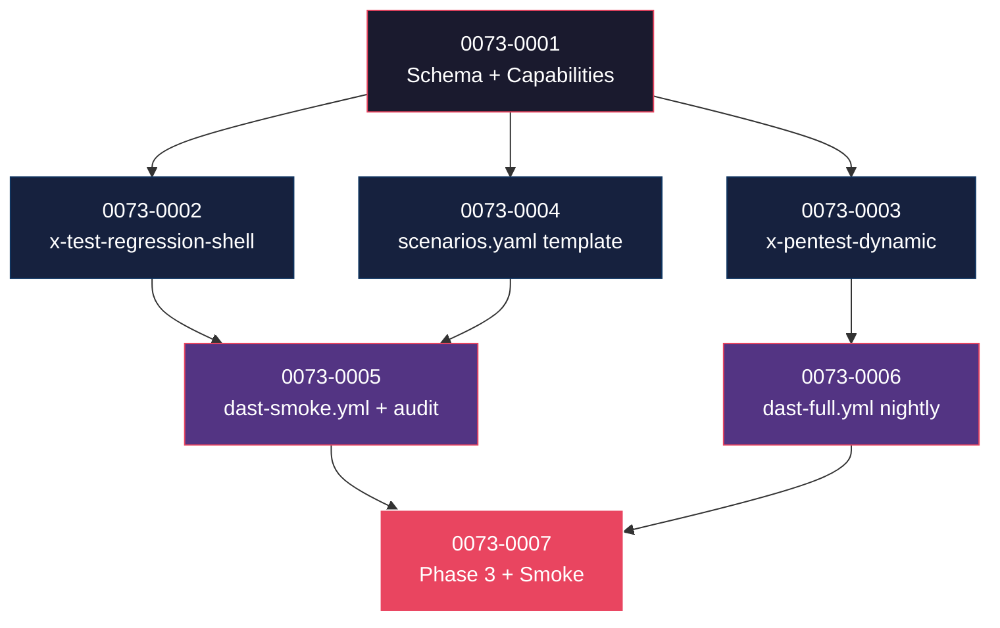

# Mapa de Implementação — EPIC-0073 (Regression Shell + DAST)

---

## 1. Matriz de Dependências

| Story | Título | Blocked By | Blocks | Status |
| :--- | :--- | :--- | :--- | :--- |
| story-0073-0001 | Schema `quality.regression` + `quality.dast` + capabilities + ADR-0022 | — | 0002, 0003 | Pendente |
| story-0073-0002 | Skill `/x-test-regression-shell` (modo self + service) + template + KP | 0001 | 0005, 0007 | Pendente |
| story-0073-0003 | Skill `/x-pentest-dynamic` (tier smoke + full) + template + KP DAST | 0001 | 0006, 0007 | Pendente |
| story-0073-0004 | `tests/regression/scenarios.yaml.template` stack-aware + `ScriptsAssembler` | 0001 | 0005 | Pendente |
| story-0073-0005 | CI workflow `dast-smoke.yml` (PR) + `audit-regression-shell.sh` | 0002, 0004 | 0007 | Pendente |
| story-0073-0006 | CI workflow `dast-full.yml` (nightly cron) | 0003 | 0007 | Pendente |
| story-0073-0007 | Phase 3 MODIFIED + Smoke E2E `Epic0073RegressionDastSmokeIT` + CHANGELOG | 0005, 0006 | — | Pendente |

---

## 2. Fases de Implementação

```
FASE 0 — Governance + Schema (sequencial)
  └─ 0073-0001  Schema YAML + capabilities + ADR-0022
       │
       ▼
FASE 1 — Skills + Template (paralelo, 3 stories)
  ├─ 0073-0002  x-test-regression-shell (modo self + service)
  ├─ 0073-0003  x-pentest-dynamic (tier smoke + full)
  └─ 0073-0004  scenarios.yaml.template + ScriptsAssembler integration
       │
       ▼
FASE 2 — CI Workflows (paralelo, 2 stories)
  ├─ 0073-0005  dast-smoke.yml (PR) + audit-regression-shell.sh
  └─ 0073-0006  dast-full.yml (nightly cron)
       │
       ▼
FASE 3 — Phase 3 + Smoke + Release
  └─ 0073-0007  Phase 3 MANDATORY conditional + smoke E2E + CHANGELOG MINOR
```

---

## 3. Caminho Crítico

```
0073-0001 → 0073-0002 → 0073-0005 → 0073-0007
```

**4 fases.** Cadeia: 4 stories.

---

## 4. Grafo de Dependências (Mermaid)



---

## 5. Resumo por Fase

| Fase | Stories | Camada | Paralelismo | Pré-requisito |
| :--- | :--- | :--- | :--- | :--- |
| 0 | 0001 | Governance + Domain | 1 | — |
| 1 | 0002, 0003, 0004 | Skills + Templates + Infra | 3 paralelas | Fase 0 |
| 2 | 0005, 0006 | CI Workflows + Audit | 2 paralelas | Fase 1 |
| 3 | 0007 | Phase 3 + Test + Release | 1 | Fase 2 |

**Total: 7 histórias em 4 fases.**

---

## 6. Detalhamento por Fase

### Fase 0
- **0073-0001**: schema YAML, sub-records Java (`RegressionConfig`, `DastConfig` em `QualityConfig`), capabilities families.

### Fase 1
- **0073-0002**: skill regression-shell modo dual (self gera 9 perfis e diff vs golden; service consome `tests/regression/scenarios.yaml`).
- **0073-0003**: skill pentest-dynamic tier dual (smoke = ZAP passive + Nuclei lightweight; full = ZAP active + Nuclei full).
- **0073-0004**: template `scenarios.yaml` stack-aware + `ScriptsAssembler` instala em projetos novos.

### Fase 2
- **0073-0005**: workflow `dast-smoke.yml` em PR; CI script `audit-regression-shell.sh`.
- **0073-0006**: workflow `dast-full.yml` em nightly cron (informativo, não blocker).

### Fase 3
- **0073-0007**: Phase 3 ganha invocação MANDATORY conditional de `x-test-regression-shell` (DAST permanece CI-only); smoke E2E; CHANGELOG MINOR.

---

## 7. Observações Estratégicas

### Gargalo Principal
**story-0073-0003** (DAST skill) é o gargalo — depende de tooling externo (ZAP, Nuclei) versionado e configurado corretamente.

### Histórias Folha
**0073-0007**.

### Otimização de Tempo
- Fase 1: **3 paralelas**.
- Fase 2: **2 paralelas**.

### Marco de Validação Arquitetural
**story-0073-0001** — decidir target environment para DAST (preview env, staging, container local). Erro aqui torna DAST ineficaz.

### Riscos
- ZAP/Nuclei versionamento: Nuclei templates evoluem rápido; pin de versão é defesa.
- Tempo de DAST full: 10-15min — nightly aceita; PR rejeitaria.

---

## 8 + 8.5

**Hotspots esperados:**
- `.github/workflows/dast-*.yml` — stories 5 e 6 (arquivos diferentes, sem colisão).
- `tests/regression/scenarios.yaml.template` — só story 4.
- 2 SKILL.md novos (independentes).
- `CHANGELOG.md` — story 7.
- `capabilities/_index.yaml` (regen) — story 1.

**Recomendação:** Fase 1 e Fase 2 podem rodar em paralelo total (zero hotspot compartilhado entre stories).
