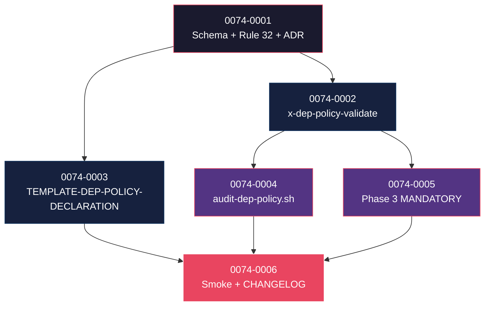

# Mapa de Implementação — EPIC-0074 (Dependency Policy & SCA Final Gate)

---

## 1. Matriz de Dependências

| Story | Título | Blocked By | Blocks | Status |
| :--- | :--- | :--- | :--- | :--- |
| story-0074-0001 | Schema YAML `dependencies.policy` + `DependencyPolicyConfig.java` + capabilities + Rule 32 + ADR-0023 + KP | — | 0002, 0003 | Pendente |
| story-0074-0002 | Skill `/x-dep-policy-validate` + `_TEMPLATE-DEP-POLICY-REPORT.md` + modificação `x-dependency-audit --policy` | 0001 | 0004, 0006 | Pendente |
| story-0074-0003 | `_TEMPLATE-DEP-POLICY-DECLARATION.md` (sub-template do system.md) + `DocsAssembler` | 0001 | 0006 | Pendente |
| story-0074-0004 | CI script `audit-dep-policy.sh` + entry no audit-gates-catalog | 0002 | 0006 | Pendente |
| story-0074-0005 | Phase 3 MODIFIED — MANDATORY conditional + Rule 27 surface 13 | 0002 | 0006 | Pendente |
| story-0074-0006 | Smoke E2E `Epic0074DepPolicySmokeIT` (6 cenários) + CHANGELOG MINOR | 0003, 0004, 0005 | — | Pendente |

---

## 2. Fases de Implementação

```
FASE 0 — Governance + Schema + KP (sequencial)
  └─ 0074-0001  Schema + Java config + capabilities sub-families + Rule 32 + ADR + KP
       │
       ▼
FASE 1 — Skill + Template (paralelo, 2 stories)
  ├─ 0074-0002  /x-dep-policy-validate + report template + x-dependency-audit modificada
  └─ 0074-0003  TEMPLATE-DEP-POLICY-DECLARATION (sub-template system.md)
       │
       ▼
FASE 2 — CI + Phase 3 (paralelo, 2 stories)
  ├─ 0074-0004  audit-dep-policy.sh
  └─ 0074-0005  Phase 3 MANDATORY conditional + Rule 27 surface 13 nova
       │
       ▼
FASE 3 — Smoke + Release
  └─ 0074-0006  E2E smoke + CHANGELOG MINOR
```

---

## 3. Caminho Crítico

```
0074-0001 → 0074-0002 → 0074-0005 → 0074-0006
```

**4 fases.** Cadeia: 4 stories.

---

## 4. Grafo de Dependências (Mermaid)



---

## 5. Resumo por Fase

| Fase | Stories | Camada | Paralelismo | Pré-requisito |
| :--- | :--- | :--- | :--- | :--- |
| 0 | 0001 | Governance + Domain + KP | 1 | — |
| 1 | 0002, 0003 | Skill + Template | 2 paralelas | Fase 0 |
| 2 | 0004, 0005 | CI script + Phase 3 mod | 2 paralelas | Fase 1 |
| 3 | 0006 | Test + Release | 1 | Fase 2 |

**Total: 6 histórias em 4 fases.**

---

## 6. Detalhamento por Fase

### Fase 0
- **0074-0001**: schema YAML novo (`dependencies.policy`), `DependencyPolicyConfig.java`, sub-capabilities por build tool (maven/gradle/npm/pip/gomod), Rule 32, ADR-0023, KP playbook.

### Fase 1
- **0074-0002**: skill nova `/x-dep-policy-validate` + modificação de `x-dependency-audit` para aceitar `--policy`. Skill aplica matriz `block-on` aos findings.
- **0074-0003**: sub-template do `docs/architecture/system.md` (EPIC-0070) — declaração humana da policy antes de codificar no YAML.

### Fase 2
- **0074-0004**: CI script `audit-dep-policy.sh` (Camada 2) — defesa em profundidade (re-roda validation no PR).
- **0074-0005**: Phase 3 ganha invocação MANDATORY conditional + Rule 27 ganha surface 13 (dep-policy-validation-report).

### Fase 3
- **0074-0006**: smoke E2E (6 cenários: min/max/license/CVE/denied-cve/opt-out) + CHANGELOG MINOR.

---

## 7. Observações Estratégicas

### Gargalo Principal
**story-0074-0001** — schema mal-modelado (sintaxe cross-stack ambígua) custa caro corrigir depois. Spike pode ser necessário antes de finalizar.

### Histórias Folha
**0074-0006**.

### Otimização de Tempo
- Fase 1: **2 paralelas**.
- Fase 2: **2 paralelas**.

### Marco de Validação Arquitetural
**story-0074-0002** — skill de validação. Validação errônea (false positive ou false negative) erode confiança no gate. Validar contra 5+ projetos históricos antes de Fase 2.

### Riscos
- Cross-stack syntax (Maven groupId+artifactId vs npm name vs Go module path): KP playbook precisa documentar bem.
- License whitelist conservadora vs permissiva — decisão vai bater em compliance.

---

## 8 + 8.5

**Hotspots esperados:**
- `Rule 27` (regen) — story 5 (surface 13 nova).
- `CHANGELOG.md` — story 6.
- `capabilities/_index.yaml` (regen) — story 1.
- `_TEMPLATE-ARCHITECTURE-SYSTEM.md` (regen) — story 3 estende seção 8.

**Recomendação:** Fases 1 e 2 podem paralelizar (2 + 2 stories).
