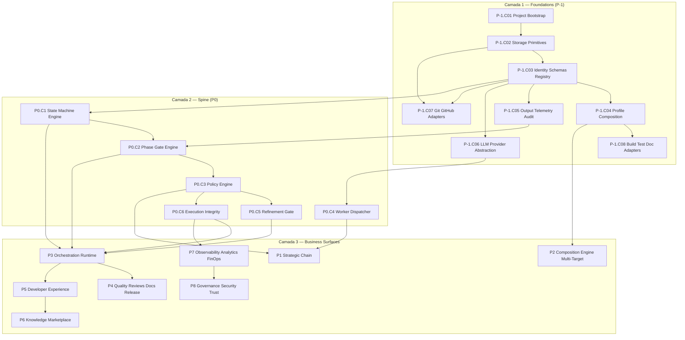
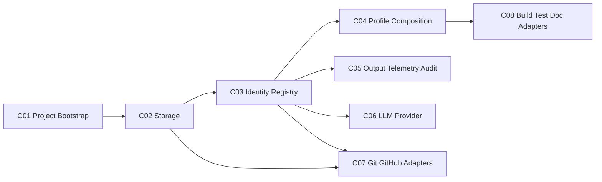
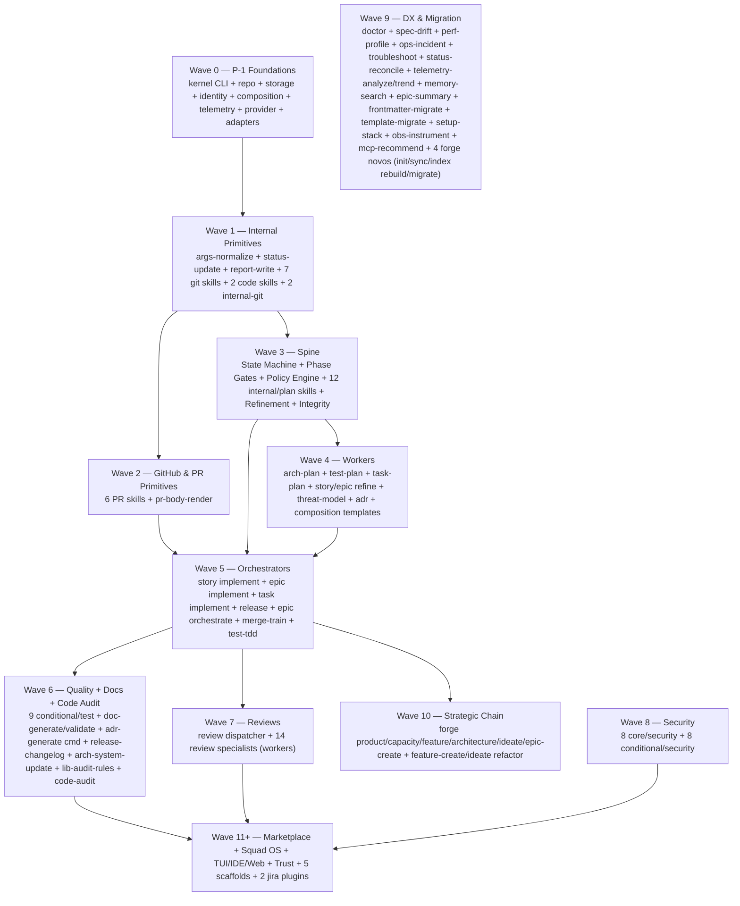

# Forge Implementation Roadmap — Plano Detalhado de Execução

> **Status:** Plano operacional derivado de [`forge-strategic-plan-v3.md`](forge-strategic-plan-v3.md).
> **Origem:** Resposta à pergunta "qual a ordem profunda de execução das funcionalidades, considerando interdependências entre skills, refactor delas, e a hipótese de que existem capacidades core antes das capacidades de negócio?".
> **Objetivo:** Decompor a V0 do Forge em ondas executáveis, classificar todas as 123 skills atuais por destino e onda alvo, mapear rules / KPs / templates / hooks / scripts ao seu lugar no Forge, e identificar o caminho crítico de implementação.
> **Audiência:** Engenharia de plataforma, tech leads e Product Owner do Forge — antes do refinement final que decompõe em épicos.

---

## §1. Propósito e relação com `forge-strategic-plan-v3.md`

O `forge-strategic-plan-v3.md` é a **fonte estratégica** do Forge: define visão, posicionamento, contratos canônicos (state machines, schemas, policies, error taxonomy) e o roadmap de produtos P0 → P6.

Este documento (`forge-implementation-roadmap.md`) é o **plano operacional**. Ele responde a perguntas que o v3 deliberadamente deixa abertas:

| Pergunta | Onde responde |
| --- | --- |
| Qual a ordem real de implementação dos produtos do v3? | §4 DAG global, §19 Wave Plan |
| Existe uma camada anterior a P0 (Strategic Chain)? | §5 Produto P-1 — Foundations |
| Cada uma das 123 skills atuais — para onde vai no Forge? | §15 Skill Refactor Matrix |
| Cada uma das 32 rules atuais — vira policy executável, KP ou doutrina? | §16 Rule → Policy Migration Matrix |
| Cada hook bash atual — vira gate runtime, CI check, telemetry ou retirado? | §17 Hook/Script Migration Matrix |
| Quais são as skills bloqueadoras críticas que travam o catálogo? | §19 Caminho Crítico |
| Como rodar `ia-dev-env` legacy e Forge em paralelo durante a migração? | §20 Estratégia Dual-Mode |

**Regra de precedência:** quando este roadmap conflitar com o v3 sobre **ordem ou agrupamento** de capacidades (ex.: o v3 distribui Foundations entre P1.C2, P2.C1-C4 e P6.C1; o roadmap promove para P-1), o roadmap prevalece. O v3 prevalece sobre **conteúdo estratégico** (tese, contratos canônicos, schemas).

---

## §2. Modelo mental de 3 camadas

A V0 inteira do Forge se decompõe em três camadas com dependência estrita:

```text
+---------------------------------------------------------------+
| CAMADA 3 — BUSINESS SURFACES                                  |
|   - Strategic Chain (Product/Capacity/Feature/Architecture)   |
|   - Orchestration Runtime (story/epic/task/release)           |
|   - Quality, Reviews, Docs, Squad OS                          |
|   - Marketplace, Analytics, Trust avançado, IDE/TUI/Web       |
+---------------------------------------------------------------+
                            ^
                            |
+---------------------------------------------------------------+
| CAMADA 2 — SPINE (Runtime + Governance as code)               |
|   - State Machine Engine                                      |
|   - Phase Gate Engine                                         |
|   - Policy Engine (refinement, integrity, zero-bypass, ...)   |
|   - Worker Dispatcher (LLM as worker)                         |
|   - Artifact Registry tipado                                  |
+---------------------------------------------------------------+
                            ^
                            |
+---------------------------------------------------------------+
| CAMADA 1 — FOUNDATIONS                                        |
|   - Project Bootstrap (forge init, layout, doctor)            |
|   - Storage (Git canonical + SQLite + blob store + locking)   |
|   - Identity, Schemas, Artifact Kinds                         |
|   - Profile + Capability Composition                          |
|   - Output, Telemetry, Audit Log                              |
|   - LLM Provider Abstraction                                  |
|   - Git + GitHub Adapters                                     |
|   - Build, Test, Doc Adapters                                 |
+---------------------------------------------------------------+
```

**Insight central:** o v3 trata Foundations como features espalhadas entre P1.C1/C2/C4 (Core Engine), P2.C3 (LLM Abstraction), P5.C1 (Telemetry) e P6.C1 (Audit). O resultado é que cada uma dessas features parece igualmente prioritária dentro de seu produto. Esta visão horizontal mascara uma realidade vertical: **sem o Spine, o Strategic Chain (P0 do v3) e o Orchestration Runtime (P2 do v3) reproduzem o problema atual** (markdown editado à mão + LLM tentando orquestrar).

A solução do roadmap: promover Foundations a um produto explícito **P-1** com 8 capacidades, o Spine a um produto explícito **P0**, e renumerar os produtos restantes (P1 = Strategic Chain, P2 = Composition Engine, P3 = Orchestration Runtime, P4 = Quality/Reviews/Docs, P5 = DX/Squad OS, P6 = Knowledge/Marketplace, P7 = Observability/FinOps, P8 = Trust avançado).

---

## §3. Inventário consolidado dos ativos atuais

| Categoria | Total | Onde estão hoje |
| --- | ---: | --- |
| Skills (`SKILL.md`) | **123** | `src/main/resources/targets/claude/skills/**` |
| Rules | **32** | `src/main/resources/targets/claude/rules/**` |
| Knowledge Packs (incl. internal services com `user-invocable: false`) | **22** | `src/main/resources/targets/claude/skills/**` (nomeados) + `targets/claude/knowledge/**` (markdown extra) |
| Templates `_TEMPLATE-*` | **55** | `src/main/resources/shared/templates/` |
| Hooks bash | **21** | `src/main/resources/targets/claude/hooks/` |
| Audit/preflight/telemetry scripts | **35+** | `src/main/resources/targets/claude/scripts/` |
| Stack-specific script templates | **~65** | `src/main/resources/targets/claude/scripts/{stack}/*.sh.tpl` |

### §3.1. Skills — distribuição por categoria

| Categoria | Qtd |
| --- | ---: |
| `core/internal/*` (todos subcategorias) | 19 |
| `core/plan` | 15 |
| `core/dev` | 12 |
| `core/ops` | 11 |
| `conditional/review` | 11 |
| `conditional/test` | 9 |
| `core/security` | 8 |
| `conditional/security` | 8 |
| `core/git` | 7 |
| `core/pr` | 6 |
| `core/review` | 5 |
| `core/test` | 3 |
| `core/lib` | 3 |
| `core/code` | 2 |
| `core/jira` | 2 |
| `conditional/ops` | 1 |
| `conditional/dev` | 1 |

### §3.2. Top 10 skills bloqueadoras (por grau de entrada — quantos a invocam)

| # | Skill | Invocadores | Onda alvo | Justificativa |
| --- | --- | ---: | :---: | --- |
| 1 | `x-implement-story` | 44 | W5 | Hub central; depende de TODOS os Waves anteriores |
| 2 | `x-implement-epic` | 26 | W5 | Compõe `x-implement-story` em loop |
| 3 | `x-internal-update-status` | 22 | W1 | Primitiva de estado (flock); base do runtime |
| 4 | `x-commit-changes` | 16 | W1 | Adapter git base |
| 5 | `x-internal-write-report` | 14 | W1 | Renderer base de templates |
| 6 | `x-implement-task` | 14 | W5 | Chamado por story-implement em loop |
| 7 | `x-manage-worktrees` | 13 | W1 | Adapter git base |
| 8 | `x-push-branch` | 11 | W1 | Adapter git base |
| 9 | `x-internal-normalize-args` | 10 | W1 | Parser tipado de argv |
| 10 | `x-internal-ensure-epic-branch` | 10 | W1 | Branch policy service |

**Implicação:** atrasar qualquer um dos itens 3, 5 e 9 (`x-internal-update-status`, `x-internal-write-report`, `x-internal-normalize-args`) quebra >70% do catálogo.

### §3.3. Top 10 skills com maior fan-out (que mais invocam outras)

| # | Skill | Invoca | Implicação |
| --- | --- | ---: | --- |
| 1 | `x-implement-story` | 27 | Maior coordenador; refactor exige todas as primitivas prontas |
| 2 | `x-internal-verify-phase-gates` | 16 | Gate central; precisa do State Machine Engine |
| 3 | `x-review-codebase` | 14 | Fan-out de specialist workers |
| 4 | `x-implement-epic` | 13 | Compõe story-implement |
| 5 | `x-create-feature` | 13 | Cria epic+story+map em uma chamada |
| 6 | `x-internal-write-story-report` | 11 | Compõe verify+report writer |
| 7 | `x-generate-security-dashboard` | 11 | Agrega 8 security skills |
| 8 | `x-plan-task` | 11 | Disparo paralelo de planning |
| 9 | `x-orchestrate-epic` | 10 | Orquestrador multi-story |
| 10 | `x-internal-build-story-plan` | 10 | Disparo paralelo de 5 sub-skills |

---

## §4. DAG global de dependências (visão panorâmica)



**Leitura:** P-1 e P0 são pré-requisitos absolutos. P1 (Strategic Chain), P2 (Composition) e P3 (Orchestration) podem evoluir em paralelo após Spine pronto, **mas** P3 não entrega valor real sem P1 (sem feature/architecture aprovada não há epic real para implementar). P4-P8 são todos descendentes de P3.

---

## §5. Produto P-1 — Forge Foundations (NOVO, 8 capacidades)

Produto inédito no v3. Engloba toda a fundação que precede o Strategic Chain. **Sem este produto, todas as features `[V0]` do v3 reproduzem o problema atual** (markdown editado + bash compensando + LLM orquestrando).

### §5.1. P-1.C01 — Project Bootstrap

| Feature | Resumo | Substitui / herda |
| --- | --- | --- |
| `forge` CLI binário | Picocli + GraalVM native-image (ou JVM com `--enable-preview`) com subcomandos `init`, `doctor`, `sync`, `index`, `migrate`, `version` | Substrato novo |
| `forge init` | Cria control repo (`projects/`, `ai/`, `.forge/`), profile YAML inicial, `.gitignore`, README, e detecta stack | Parte de `x-setup-env` (Wave 9) |
| Layout canônico | `projects/project-XXXX/products/.../capacities/.../features/.../epics/...` (§3.5.1 do v3) | Substrato novo |
| Detecção automática de stack | Inspeciona `pom.xml`, `package.json`, `go.mod`, `requirements.txt`, `Cargo.toml` | Herda de `x-setup-env` |
| `forge doctor` | Health check de pré-requisitos: git, gh, jq, build tool, profile válido, control repo íntegro | Substitui `x-setup-env` |

### §5.2. P-1.C02 — Storage Primitives

| Feature | Resumo | Substitui / herda |
| --- | --- | --- |
| Git canonical | Working tree é a fonte de verdade; commits semânticos em eventos de lifecycle | Substrato novo |
| SQLite operational index | `.forge/state/index.sqlite` reconstruível; FTS para `forge explain`/`forge memory search` | Substrato novo |
| Blob store local | `.forge/blobs/sha256/<aa>/<sha256>.zst` (zstd comprimido, dedup por SHA) | Substrato novo |
| `forge sync` | Reindex incremental do working tree | Substrato novo |
| `forge index rebuild` | Recriação completa do índice (recovery) | Substrato novo |
| Atomic write + flock | Substitui `flock` shell de `x-internal-update-status` | Migra invariante |
| Sync journal | `.forge/state/sync-journal.ndjson` para resume cross-machine | Substrato novo |

### §5.3. P-1.C03 — Identity, Schemas & Artifact Registry

| Feature | Resumo | Substitui / herda |
| --- | --- | --- |
| Frontmatter v4 | Schema YAML obrigatório em todo artefato com `artifact_kind`, `schema_version`, `id`, `slug`, `title`, `status`, `parent`, `lineage`, `body_contract`, `llm_context`, `remote_checkpoint` | Hospeda Rule 28 (capability frontmatter contract) |
| Artifact Registry | Catálogo tipado de `artifact_kind` (forge.product, forge.capacity, forge.feature, forge.epic, forge.story, forge.task, forge.architecture-plan, forge.adr, forge.review, forge.verify-envelope, forge.telemetry-event, ...) | Hospeda Rule 28 (tool-call grammar) |
| Registry linter | Valida schemas, ids, lineage, broken refs, duplicate slugs | Migra `x-lib-audit-rules` |
| Lineage graph | DAG navegável de produtos → features → epics → stories → tasks → commits → PRs | Migra `audit-capability-graph.sh`, `audit-frontmatter-schema.sh` |
| `forge explain <id>` | Render do artefato com lineage, dependências e consumidores | Substrato novo |

### §5.4. P-1.C04 — Profile & Capability Composition

| Feature | Resumo | Substitui / herda |
| --- | --- | --- |
| Profile schema v3 | YAML versionado com JSON Schema; herança e overlays | Herda `ProjectConfig` Java |
| Capability Resolver | Resolve `requires-capabilities` em `ResolvedCapabilitySet` | Herda `CapabilityResolver` Java |
| Capability Aware Composer | Compõe artefatos baseado em capabilities resolvidas | Herda `CapabilityAwareComposer` Java |
| Output Pruner | Remove arquivos de capabilities desativadas | Herda `OutputPruner` Java |
| Template Registry | `template_id`, `schema_version`, input schema (JSON Schema), output schema, consumidores declarados | Migra todos os 28+ templates de plan |
| KP Loader | Carrega knowledge packs sob demanda por fase/worker | Substrato novo |
| Migration assistant | `forge migrate --from-iadev` | Substrato novo, hospeda Rule 19 |

### §5.5. P-1.C05 — Output, Telemetry & Audit Log

| Feature | Resumo | Substitui / herda |
| --- | --- | --- |
| Output abstraction | `--output text|json|ndjson`; cada command declara schema de saída | Herda Rule 13 invocation protocol |
| In-process telemetry | Events `session.start`, `phase.start/end`, `subagent.start/end`, `tool.call`, `mcp.start/end` em NDJSON | Substitui `telemetry-*.sh` (8 hooks) |
| OTel adapter | Exportação opcional para OTLP/Datadog | Migra de `x-analyze-telemetry` parcial |
| Audit log local imutável | `.forge/audit/audit-log.ndjson` (hash chain SHA-256) | Migra `audit-ndjson-hash-chain.sh` |
| Telemetry queries | `forge telemetry analyze`, `forge telemetry trend` | Migra `x-analyze-telemetry`, `x-analyze-telemetry-trends` (Wave 9) |
| Session resume | Estado da sessão recuperável de `events.ndjson` | Substrato novo |

### §5.6. P-1.C06 — LLM Provider Abstraction

| Feature | Resumo | Substitui / herda |
| --- | --- | --- |
| Provider interface | `LlmProvider` com `complete()`, `stream()`, `tool_use()`, `function_call()` | Substrato novo |
| Anthropic adapter | Claude 3.5/4 (Haiku/Sonnet/Opus) | Hospeda Rule 23 model selection |
| OpenAI adapter | GPT-4/5 series | Substrato novo |
| Gemini adapter | Google Gemini Pro/Flash | Substrato novo |
| Local provider | Ollama / llama.cpp para LLM local | Substrato novo |
| Model router | Routing dinâmico baseado em capability (Haiku/Sonnet/Opus) e custo | Migra Rule 23 + `audit-model-selection.sh` |
| Fallback automático | Provider B se provider A falha | Substrato novo |
| Cost tracker | Custo por skill/story/epic em real-time | Substrato novo (P7 expande) |
| Output schema validation | Worker outputs validados contra JSON Schema | Substrato novo |

### §5.7. P-1.C07 — Git & GitHub Adapters

| Feature | Resumo | Substitui / herda |
| --- | --- | --- |
| `GitAdapter.branch()` | Cria branch idempotente, validação de naming | Migra `x-create-git-branch` |
| `GitAdapter.commit()` | Conventional commits + pre-commit chain (format → lint → compile) | Migra `x-commit-changes` |
| `GitAdapter.push()` | Push idempotente com retry tipado | Migra `x-push-branch` |
| `GitAdapter.merge()` | Merge com strategy (merge/squash/rebase) e rollback automático em conflito | Migra `x-merge-branches` |
| `GitAdapter.worktree()` | Cria/lista/remove worktrees sob `.claude/worktrees/` ou `.forge/worktrees/` | Migra `x-manage-worktrees` |
| `GitAdapter.cleanup()` | Cleanup batch: prune origin + remove worktrees + branches obsoletas | Migra `x-cleanup-git-branches` |
| `GitAdapter.precheck()` | Classifica working tree em CLEAN/DIRTY/DIVERGENT/AMBIGUOUS | Migra `x-internal-precheck-worktree` |
| `GitAdapter.epicBranch()` | Idempotência da convenção `epic/<ID>` | Migra `x-internal-ensure-epic-branch` |
| `GithubAdapter.prCreate()` | Cria PR com title formatado, labels, body estruturado | Migra `x-create-pr` (parte) |
| `GithubAdapter.prMerge()` | Merge via gh CLI com strategy + idempotência | Migra `x-merge-pr` |
| `GithubAdapter.prWatchCi()` | Polling de checks + Copilot review com 8 exit codes | Migra `x-watch-pr-ci`, hospeda Rule 45 |
| `GithubAdapter.prComments()` | Fetch + classify comments (actionable/suggestion/question/praise) | Migra `x-fix-pr` (parte) |

### §5.8. P-1.C08 — Build, Test & Doc Adapters

| Feature | Resumo | Substitui / herda |
| --- | --- | --- |
| `BuildAdapter` por stack | maven, gradle, npm, pip, poetry, go, cargo | Migra `post-compile-check.sh` + `audit-coverage-local.sh` |
| `TestAdapter.run()` | Run tests com coverage filtering | Migra `x-execute-tests` (parte) |
| `FormatAdapter` | Spotless/prettier/black/gofmt por stack | Migra `x-format-code` |
| `LintAdapter` | Checkstyle/eslint/ruff/golangci-lint por stack | Migra `x-lint-code` |
| `DocAdapter` | OpenAPI lint, asyncapi, gRPC proto, README freshness | Migra parte de `x-validate-docs` |
| Stack catalog | Catálogo oficial de stacks suportadas + `x-recommend-mcp` | Migra `x-recommend-mcp` parte |

### §5.9. Dependências internas P-1



**Paralelização possível:** C05/C06/C07 podem ser desenvolvidas em paralelo após C03 estar pronta.

---

## §6. Produto P0 — Spine: Runtime Engine & Governance Policies (6 capacidades)

Cobre o "miolo" determinístico que o v3 trata como features espalhadas (P1.C2 capability composition, P2.C1 agent lifecycle, P2.C2 task hierarchy, P2.C4 reliability, P6.C1 audit, P6.C2 refinement). Aqui é consolidado em um produto único.

### §6.1. P0.C1 — State Machine Engine

| Feature | Resumo | Migra |
| --- | --- | --- |
| Entity state enums | `Project`, `Product`, `Capacity`, `Feature`, `ArchitecturePlan`, `Epic`, `Story`, `Task`, `PR`, `Run` (§5.3 v3) | v3 §5.3 |
| Transition validator | Cada transição declara comando autorizado, pré-condições e evidências | v3 §5.3 |
| State persistence | Estado em frontmatter YAML (canonical) + projeção SQLite (cache) | Migra `execution-state.json` |
| Resume engine | Cross-machine resume baseado em sync journal | Migra `x-internal-resume-story`, `x-internal-build-epic-plan` partes |
| Pause/resume | `forge pause`, `forge resume` em qualquer command de longa duração | Substrato novo |

### §6.2. P0.C2 — Phase Gate Engine

| Feature | Resumo | Migra |
| --- | --- | --- |
| `PhaseGateService` | 4 modos: `pre`, `post`, `wave`, `final` | Migra `x-internal-verify-phase-gates` |
| Pre-conditions | Predecessor phase completed + child tasks completed + artifacts on disk | Migra `verify-phase-gates.sh`, `enforce-phase-sequence.sh` |
| Wave gates | Verificação de paralelismo seguro por onda | Migra `audit-wave-dispatch.sh` |
| Final gate | Composição com `x-internal-verify-epic-integrity` | Migra `x-internal-verify-epic-integrity` |
| Rule 25 hospedagem | Task hierarchy + phase gate contract como policy | Hospeda Rule 25 |

### §6.3. P0.C3 — Policy Engine

| Feature | Resumo | Migra |
| --- | --- | --- |
| `Policy` interface | `policy_id`, `version`, `enforcement_point`, `evidence_kind`, `test()` | Substrato novo |
| Policy registry | Catálogo de policies versionadas | Substrato novo |
| Enforcement matrix | Mapa policy_id → runtime/CI/doctrine | v3 §5.7 |
| Policy tests | Cada policy tem suite de testes obrigatória | Hospeda Rule 26 |
| Policies migradas | 14, 21, 22, 24, 27, 28a, 28b, 29, 31, 32, 45, 11 (todas executable) | §16 detalha |

### §6.4. P0.C4 — Worker Dispatcher

| Feature | Resumo | Migra |
| --- | --- | --- |
| Prompt template registry | `prompt_id`, `version`, system/user blocks, JSON Schema de saída | Migra prompts inline de skills atuais |
| Provider routing | Por capability (haiku/sonnet/opus) usando model router de C06 | Hospeda Rule 23 enforcement |
| Output validation | Saída do LLM validada contra schema; retry tipado em falha | Substrato novo |
| Cost attribution | Cada chamada anota custo no audit log | Substrato novo |
| Fan-out/fan-in declarativo | Dispatch paralelo de N workers + agregação tipada | Migra padrão de `x-internal-build-story-plan` (5 sub-skills paralelos) |

### §6.5. P0.C5 — Refinement Gate (built-in)

| Feature | Resumo | Migra |
| --- | --- | --- |
| Pré-condição nativa | `forge story implement` falha com `REFINEMENT_REQUIRED` se verdict ≠ approved | Migra `enforce-refinement-gate.sh`, hospeda Rule 29 |
| Refinement verdict schema | `refinementVerdict.status`, `verdictHash` | Migra `_TEMPLATE-REFINEMENT-VERDICT.md` |
| Hash divergence detection | Detecta divergência state ↔ markdown | Migra `audit-refinement-gate.sh` |
| Recovery escape | `CLAUDE_RECOVERY_MODE=1` → policy logged but bypassed | Migra `audit-recovery-mode.sh` |

### §6.6. P0.C6 — Execution Integrity (built-in)

| Feature | Resumo | Migra |
| --- | --- | --- |
| Camada A — runtime gate | `forge` runtime bloqueia operação ilegal in-process | Substitui Camadas 0-1 atuais |
| Camada B — CI verify | `forge ci verify` valida evidências post-merge | Substitui Camadas 2-4 atuais |
| Zero-bypass property | Sem flag `--skip-*` no caminho oficial; recovery exige variable explícita | Migra `enforce-no-bypass-flags.sh`, hospeda Rule 27 |
| Continuous flow | Stop hook quando fase aberta sem progresso | Migra `enforce-continuous-flow.sh` |
| Evidence Ledger | Catálogo tipado de `verify-envelope`, `story-completion-report`, etc. | Hospeda Rule 24 + 12 surfaces |
| 13 surfaces enforcement | Catálogo das obrigações por superfície | Migra Rule 24 §Mandatory Evidence Artifacts |

---

## §7. Produto P1 — Strategic Chain (rebrand do P0 do v3)

Após Foundations (P-1) e Spine (P0) prontos, P1 implementa a cadeia `Project → Product → Capacity → Feature → Architecture → Epic`. **Importante:** este produto NÃO é o P0 do v3; é uma versão depurada que assume Spine como dado.

### §7.1. P1.C1 — Project & Product Lifecycle

| Feature | Origem v3 | Skills atuais relacionadas |
| --- | --- | --- |
| `forge project create|approve` | NOVO no roadmap (v3 trata project como dado) | NOVO |
| `forge product create|approve` | P0.C2.F1 v3 | NOVO |
| `forge product propose-capacities` | P0.C2.F2 v3 | NOVO + worker |

### §7.2. P1.C2 — Capacity & Feature Lifecycle

| Feature | Origem v3 | Skills atuais relacionadas |
| --- | --- | --- |
| `forge capacity create|approve` | P0.C2.F3 | NOVO |
| `forge feature create|approve` | P0.C2.F4 | Refactor de `x-create-feature` |
| Predecessor remote gate | P0.C2.F5 | Migra `enforce-preflight-gates.sh` |
| `forge ideate --kind ...` | P0.C1.F1, F4 | Refactor de `x-ideate-feature` (multi-kind, multi-round, personas) |

### §7.3. P1.C3 — Architecture Planning (3 níveis)

| Feature | Origem v3 | Skills atuais relacionadas |
| --- | --- | --- |
| `forge architecture plan product` | P0.C3.F1, F2 | Refactor de `x-plan-architecture` (worker prompt) |
| `forge architecture plan capacity` | P0.C3.F3 | Refactor de `x-plan-architecture` |
| `forge architecture plan feature` | P0.C3.F4 | Refactor de `x-plan-architecture` |
| Architecture decision log | P0.C3.F5 | Refactor de `x-generate-adr` |
| Feature → Epic gate | P0.C3.F6, P0.C4.F1 | Migra `x-create-feature` Phase 4 |
| `forge arch system update` | NOVO inline | Refactor de `x-update-system-architecture` |

### §7.4. P1.C4 — Feature → Epic Generation

| Feature | Origem v3 | Skills atuais relacionadas |
| --- | --- | --- |
| `forge epic create <FEATURE>` | P0.C4.F1 | Refactor de `x-internal-create-epic`, `x-internal-create-story`, `x-internal-map-epic` |
| Bidirectional linking | P0.C4.F2 | Migra parte de `x-create-feature` |
| Backlog versioning | P0.C4.F3 | Substrato novo |
| Replanning incremental | P0.C4.F4 | Substrato novo |
| Bug/change → epic | P0.C4.F5, F6 | Substrato novo (Post-Delivery Lifecycle do v3 §9) |
| Effort scoring | P0.C4.F7 | Substrato novo (Squad OS do v3 §10) |

---

## §8. Produto P2 — Composition Engine & Multi-Target

Rebrand de P1.C1/C3/C4 do v3. Herda diretamente do gerador Java atual. Já parcialmente implementado.

### §8.1. P2.C1 — Profile Management v6

| Feature | Origem v3 |
| --- | --- |
| Schema unificado JSON-Schema versionado | P1.C1.F1 |
| `forge migrate --from-iadev` | P1.C1.F2 |
| Inheritance & overlays | P1.C1.F3 |
| Detecção automática de stack | P1.C1.F4 |

### §8.2. P2.C2 — Capability Composition v2

| Feature | Origem v3 |
| --- | --- |
| Resolver com cache local | P1.C2.F1 |
| Frontmatter v4 com `provides:` | P1.C2.F2 (do v3) → renumerar como v5 (já que v4 vem do P-1.C03) |
| Plug-in capabilities externas | P1.C2.F3 |
| Composition diff & dry-run | P1.C2.F4 |

### §8.3. P2.C3 — Multi-Target Adapters

| Feature | Origem v3 |
| --- | --- |
| Target adapter `claude-code` | P1.C3.F1 |
| Target adapter `cursor` | P1.C3.F2 |
| Targets `windsurf`/`aider`/`gemini-cli`/`codex-cli` | P1.C3.F3 |
| Target adapter `generic-mcp` | P1.C3.F4 |
| Overlay system para regen | P1.C3.F5 |

### §8.4. P2.C4 — Multi-Stack & Polyglot

| Feature | Origem v3 |
| --- | --- |
| Catálogo de stacks oficial | P1.C4.F1 |
| Stack templates community | P1.C4.F2 |
| Polyglot monorepos | P1.C4.F3 |
| Reutilização de KPs | P1.C4.F4 |

---

## §9. Produto P3 — Orchestration Runtime (rebrand do P2 do v3)

Os comandos públicos que substituem os orquestradores skill-based. Cada um é um Picocli command que compõe primitivas das Waves anteriores.

### §9.1. P3.C1 — Story / Epic / Task Implementation

| Comando Forge | Skill atual | Onda |
| --- | --- | :---: |
| `forge story implement <ID>` | `x-implement-story` | W5 |
| `forge epic implement <ID>` | `x-implement-epic` | W5 |
| `forge task implement <ID>` | `x-implement-task` | W5 |
| `forge story refine <ID>` | `x-refine-story` (worker) | W4 |
| `forge epic refine <ID>` | `x-refine-epic` (worker) | W4 |
| `forge story plan <ID>` | `x-plan-story` (worker dispatcher) | W4 |
| `forge task plan <ID>` | `x-plan-task` (worker) | W4 |
| `forge test tdd <TASK>` | `x-drive-tdd` | W5 |

### §9.2. P3.C2 — Release & Merge Train

| Comando Forge | Skill atual | Onda |
| --- | --- | :---: |
| `forge release` | `x-release` | W5 |
| `forge merge-train` | `x-manage-pr-merge-train` | W5 |
| `forge epic orchestrate <ID>` | `x-orchestrate-epic` | W5 |
| `forge feature create` | `x-create-feature` | W10 |
| `forge feature ideate` | `x-ideate-feature` | W10 |

### §9.3. P3.C3 — PR Lifecycle Commands

| Comando Forge | Skill atual | Onda |
| --- | --- | :---: |
| `forge pr create` | `x-create-pr` | W2 |
| `forge pr fix <PR>` | `x-fix-pr` | W2 |
| `forge pr fix --epic` | `x-fix-epic-pr` | W2 |
| `forge pr merge <PR>` | `x-merge-pr` | W2 |
| `forge pr watch <PR>` | `x-watch-pr-ci` | W2 |

### §9.4. P3.C4 — Reliability & Replay

| Feature | Origem v3 |
| --- | --- |
| Determinismo controlado | P2.C4.F1 |
| Snapshot de contexto local | P2.C4.F2 |
| Idempotência por comando | P2.C4.F3 |
| File locking local | P2.C4.F4 (já em P-1.C02) |

---

## §10. Produto P4 — Quality, Reviews, Docs & Release

Engloba quality gates conditional (test/security), reviews especialistas, docs e changelog.

### §10.1. P4.C1 — Quality Gates

| Feature | Skill atual | Onda |
| --- | --- | :---: |
| `forge test run` | `x-execute-tests` | W6 |
| `forge test plan` | `x-plan-tests` (worker) | W4 |
| `forge test e2e` | `x-execute-e2e-tests` | W6 |
| `forge test contract` | `x-execute-contract-tests`, `x-lint-contract-tests` | W6 |
| `forge test mutation` | `x-execute-mutation-tests` | W6 |
| `forge test performance` | `x-execute-performance-tests`, `x-run-perf-tests` | W6 |
| `forge test regression-shell` | `x-execute-shell-regression-tests` | W6 |
| `forge test smoke api/socket` | `x-execute-api-smoke-tests`, `x-execute-socket-smoke-tests` | W6 |
| `forge code format` | `x-format-code` | W1 |
| `forge code lint` | `x-lint-code` | W1 |
| `forge code audit` | `x-audit-code` | W6 |

### §10.2. P4.C2 — Review Workers

| Feature | Skill atual | Onda |
| --- | --- | :---: |
| `forge review <STORY>` (parallel) | `x-review-codebase` (dispatcher) | W7 |
| `forge review pr <PR>` (Tech Lead) | `x-review-pr` (worker) | W7 |
| Specialist workers (11 conditional) | `x-review-{api,compliance,data-modeling,db,devops,events,gateway,graphql,grpc,obs,security}` | W7 |
| Specialist workers (3 core) | `x-review-{perf,qa}` (`x-review-pr` é o tech lead) | W7 |

### §10.3. P4.C3 — Documentation

| Feature | Skill atual | Onda |
| --- | --- | :---: |
| `forge doc generate` | `x-generate-docs` | W6 |
| `forge doc validate` | `x-validate-docs` (hospeda Rule 31) | W6 |
| `forge adr generate` | `x-generate-adr` | W4 (worker) + W6 (command) |
| `forge release changelog` | `x-generate-release-changelog` | W6 |
| `forge arch update` | `x-update-architecture` | W4 (worker) |
| `forge arch system update` | `x-update-system-architecture` | W6 |

### §10.4. P4.C4 — Security Suite

| Feature | Skill atual | Onda |
| --- | --- | :---: |
| `forge security owasp` | `x-scan-owasp` | W8 |
| `forge security dependency` | `x-audit-dependencies` (hospeda Rule 32) | W8 |
| `forge security supply-chain` | `x-audit-supply-chain` | W8 |
| `forge security dashboard` | `x-generate-security-dashboard` | W8 |
| `forge security pipeline` | `x-generate-security-pipeline` | W8 |
| `forge security hardening` | `x-evaluate-hardening` | W8 |
| `forge security runtime` | `x-evaluate-runtime` | W8 |
| `forge security pentest` | `x-run-dynamic-pentest`, `x-run-pentest` | W8 |
| Conditional adapters (7) | `x-security-{container,dast,infra,sast,secrets,sonar}` + `x-validate-dependency-policy` | W8 |
| `forge threat model` | `x-model-threats` | W4 (worker) |

---

## §11. Produto P5 — Developer Experience (CLI / TUI / IDE / Squad OS)

Rebrand do P3 do v3.

### §11.1. P5.C1 — CLI v2 (Wave 1+ progressivo)

Já coberto por P-1.C01. Aqui são as features avançadas:

| Feature | Origem v3 | Onda |
| --- | --- | :---: |
| `forge` CLI unificado | P3.C1.F1 | W0 |
| Saída estruturada `--output json|ndjson` | P3.C1.F2 | W0 |
| `forge repl` | P3.C1.F3 | W11 |
| `forge migrate` (já em P-1.C04) | P3.C1.F4 | W9 |
| `forge init` (já em P-1.C01) | P3.C1.F5 | W0 |

### §11.2. P5.C2 — TUI & Local Web UI

| Feature | Origem v3 | Onda |
| --- | --- | :---: |
| `forge tui` | P3.C2.F1 | W11 |
| `forge watch` | P3.C2.F2 | W11 |
| `forge ui` (local web console) | P3.C2.F3 | W11 |
| Editor visual de rules/skills | P3.C2.F4 | W11 |

### §11.3. P5.C3 — IDE Extensions

| Feature | Origem v3 | Onda |
| --- | --- | :---: |
| Extensão VS Code | P3.C3.F1 | W11 |
| Extensão JetBrains | P3.C3.F2 | W11 |
| Painel inline de evidências | P3.C3.F3 | W11 |
| Auto-complete profile/capabilities | P3.C3.F4 | W11 |

### §11.4. P5.C4 — Onboarding & Time-to-Value

| Feature | Origem v3 | Onda |
| --- | --- | :---: |
| `forge init` 5-7 perguntas | P3.C4.F1 | W0 |
| Templates por persona | P3.C4.F2 | W11 |
| Tutorial guiado in-IDE | P3.C4.F3 | W11 |
| `forge doctor` | P3.C4.F4 | W0 |

### §11.5. P5.C5 — Squad Operating System

| Feature | Origem v3 | Onda |
| --- | --- | :---: |
| `forge intake` | P3.C5.F1 | W11 |
| `forge backlog groom`/`item ready-check` | P3.C5.F2 | W11 |
| `forge backlog score` | P3.C5.F3 | W11 |
| `forge sprint plan|start|close` | P3.C5.F4 | W11 |
| `forge review queue|assign|nudge` | P3.C5.F5 | W11 |
| `forge daily`, `forge status report`, `forge squad health`, `forge release readiness` | P3.C5.F6 | W11 |
| `forge metrics flow|quality|ai` | P3.C5.F7 | W11 |

---

## §12. Produto P6 — Knowledge & Marketplace

Rebrand do P4 do v3.

### §12.1. P6.C1 — Skill Marketplace

| Feature | Origem v3 | Onda |
| --- | --- | :---: |
| Registry central / self-hosted | P4.C1.F1 | W11 |
| SemVer obrigatório | P4.C1.F2 | W11 |
| Dependency resolution | P4.C1.F3 | W11 |
| Trust model + assinatura + sandbox | P4.C1.F4 | W11 |
| Compatibility matrix por modelo | P4.C1.F5 | W11 |

### §12.2. P6.C2 — Rule & Governance Library

| Feature | Origem v3 | Onda |
| --- | --- | :---: |
| Rule packs por domínio | P4.C2.F1 | W11 |
| Rule simulator | P4.C2.F2 | W11 |
| Rule conflict detector | P4.C2.F3 | W11 |
| Custom rule authoring | P4.C2.F4 | W11 |

### §12.3. P6.C3 — Template & Profile Catalog

| Feature | Origem v3 | Onda |
| --- | --- | :---: |
| Catálogo profiles oficial/community | P4.C3.F1 | W11 |
| Rating e usage stats | P4.C3.F2 | W11 |
| `forge profile fork` | P4.C3.F3 | W11 |
| Profile lineage | P4.C3.F4 | W11 |

### §12.4. P6.C4 — Cross-Project Intelligence

| Feature | Origem v3 | Onda |
| --- | --- | :---: |
| Padrões agregados anonimizados | P4.C4.F1 | W11 |
| Recommendation engine | P4.C4.F2 | W11 |
| Drift detection cross-repo | P4.C4.F3 | W11 |
| Knowledge graph navegável | P4.C4.F4 | W11 |

### §12.5. P6.C5 — Plugins V0 (Jira, GitHub Apps, MCP)

| Feature | Skill atual / origem | Onda |
| --- | --- | :---: |
| `forge jira create-epic` | `x-create-jira-epic` | W11 |
| `forge jira create-stories` | `x-create-jira-stories` | W11 |
| `forge mcp recommend` | `x-recommend-mcp` | W9 |
| MCP marketplace cache | NOVO | W11 |

---

## §13. Produto P7 — Observability, Analytics & FinOps

Rebrand do P5 do v3.

| Capacity | Features (origem v3) | Onda |
| --- | --- | :---: |
| P7.C1 Local & Real-Time Telemetry | P5.C1.F1-F5 | W11 (após streaming) |
| P7.C2 Quality & Compliance Metrics | P5.C2.F1-F4 | W11 |
| P7.C3 FinOps & Cost Insights | P5.C3.F1-F4 | W11 |
| P7.C4 Research & Benchmarking | P5.C4.F1-F4 | W11 |

Skills atuais migradas: `x-analyze-telemetry`, `x-analyze-telemetry-trends`, `x-profile-performance`, `x-search-memory`, `x-internal-summarize-epic`.

---

## §14. Produto P8 — Governance, Security & Trust avançado

Rebrand do P6 do v3 (apenas o que NÃO migrou para Spine P0).

| Capacity | Features (origem v3) | Onda |
| --- | --- | :---: |
| P8.C1 Audit & Compliance Engine | P6.C1.F1-F5 (P6.C1.F5 `forge ci verify` já em Spine) | W11 |
| P8.C2 Refinement & Quality Gates v2 | P6.C2.F1-F4 (built-in básico já em Spine) | W11 |
| P8.C3 Security Posture & Threat Modeling | P6.C3.F1-F4 | W11 |
| P8.C4 Privacy, Multi-Tenancy & RBAC | P6.C4.F1-F4 | W11 |

---

## §15. Skill Refactor Matrix (TODAS as 123 skills)

Legenda das classificações:

- `service` → vira classe/serviço Java interno (não exposto na CLI)
- `adapter` → vira adapter Java para sistema externo (git, github, build, llm)
- `command` → vira `forge <subcommand>` exposto ao usuário
- `worker-prompt` → vira prompt template versionado + JSON Schema (não código)
- `policy` → vira `policy_id` versionada com testes
- `template` → vira template no Template Registry com schema
- `kp` → vira knowledge pack carregado sob demanda
- `merge:<X>` → colapsado em outro destino
- `plugin` → V0 opt-in plugin
- `retire` → eliminado, substituído por propriedade arquitetural

### §15.1. `core/internal/ops` (3 skills) → Wave 1

| Skill | Classificação | Wave | Bloqueia | Observações |
| --- | --- | :---: | --- | --- |
| `x-internal-normalize-args` | `service` (`ArgsNormalizer`) | W1 | TODOS orquestradores | Schema de flags tipado, mutex groups, deprecation; consumido por toda CLI |
| `x-internal-update-status` | `service` (`StateRepository`) | W1 | 22 skills | Atomic flock → atomic write+lock em P-1.C02; idempotency tracking |
| `x-internal-write-report` | `service` (`TemplateRenderer`) | W1 | 14 skills | Hospeda Template Registry rendering; `--append` com dedup por `## ID:` marker |

### §15.2. `core/internal/git` (2 skills) → Wave 1

| Skill | Classificação | Wave | Bloqueia | Observações |
| --- | --- | :---: | --- | --- |
| `x-internal-ensure-epic-branch` | `service` (`EpicBranchPolicy`) | W1 | 10 skills | Hospeda Rule 21 (epic branch model); idempotência local + origin |
| `x-internal-precheck-worktree` | `service` (`WorktreeClassifier`) | W1 | feature-create | CLEAN/DIRTY/DIVERGENT/AMBIGUOUS; exit 15 sem `--allow-dirty` |

### §15.3. `core/git` (7 skills) → Wave 1

| Skill | Classificação | Wave | Bloqueia | Observações |
| --- | --- | :---: | --- | --- |
| `x-create-git-branch` | `adapter`+`command` (`GitAdapter.branch()` + `forge git branch`) | W1 | x-merge-branches, epic-branch-ensure | Naming validation; idempotente |
| `x-commit-changes` | `adapter`+`command` (`GitAdapter.commit()` + `forge git commit`) | W1 | 16 skills | Pre-commit chain: format→lint→compile; Conventional Commits |
| `x-push-branch` | `adapter`+`command` (`GitAdapter.push()` + `forge git push`) | W1 | 11 skills | Idempotency + retry tipado |
| `x-merge-branches` | `adapter`+`command` (`GitAdapter.merge()` + `forge git merge`) | W1 | epic-implement | Strategy + rollback automático em conflito |
| `x-manage-worktrees` | `adapter`+`command` (`GitAdapter.worktree()` + `forge git worktree`) | W1 | 13 skills | Lifecycle Rule 14; `.forge/worktrees/` |
| `x-cleanup-git-branches` | `adapter`+`command` (`forge git cleanup`) | W1 | — | Destructive default; `--dry-run`, `--yes` |
| `x-commit-planning` | `adapter`+`command` (`forge planning commit`) | W1 | story-plan, task-plan | Sibling de git-commit sem pre-commit chain (só docs/markdown) |

### §15.4. `core/code` (2 skills) → Wave 1

| Skill | Classificação | Wave | Bloqueia | Observações |
| --- | --- | :---: | --- | --- |
| `x-format-code` | `adapter`+`command` (`FormatAdapter` + `forge code format`) | W1 | x-commit-changes | Stack-aware: Spotless/prettier/black/gofmt |
| `x-lint-code` | `adapter`+`command` (`LintAdapter` + `forge code lint`) | W1 | x-commit-changes | Stack-aware: Checkstyle/eslint/ruff/golangci |

### §15.5. `core/internal/pr` (1 skill) → Wave 2

| Skill | Classificação | Wave | Bloqueia | Observações |
| --- | --- | :---: | --- | --- |
| `x-internal-render-pr-body` | `service` (`PrBodyRenderer`) | W2 | x-create-pr, x-create-feature | Two kinds: implementation/backlog; fail-open com placeholders |

### §15.6. `core/pr` (6 skills) → Wave 2

| Skill | Classificação | Wave | Bloqueia | Observações |
| --- | --- | :---: | --- | --- |
| `x-create-pr` | `adapter`+`command` (`GithubAdapter.prCreate()` + `forge pr create`) | W2 | epic-implement, feature-create | Title formatado, labels, body via `x-internal-render-pr-body` |
| `x-merge-pr` | `adapter`+`command` (`GithubAdapter.prMerge()` + `forge pr merge`) | W2 | merge-train | Strategy + idempotência; auto-merge mode |
| `x-watch-pr-ci` | `adapter`+`command` (`GithubAdapter.prWatchCi()` + `forge pr watch`) | W2 | story-implement, release | 8 exit codes tipados; hospeda Rule 45 |
| `x-fix-pr` | `command` (`forge pr fix`) | W2 | release, review-pr | Classifica comments; aplica fixes; commit estruturado |
| `x-fix-epic-pr` | `command` (`forge pr fix --epic`) | W2 | epic-implement | Discovery via execution-state.json; consolidated PR |
| `x-manage-pr-merge-train` | `command` (`forge merge-train`) | W2 | release | Topological order; pre-merge validation; dry-run |

### §15.7. `core/internal/plan` (12 skills) → Wave 3

| Skill | Classificação | Wave | Bloqueia | Observações |
| --- | --- | :---: | --- | --- |
| `x-internal-verify-phase-gates` | `service` (`PhaseGateService`) | W3 | 16 skills | 4 modes: pre/post/wave/final; hospeda Rule 25; exit 12/13/14 |
| `x-internal-load-story-context` | `service` (`StoryContextLoader`) | W3 | story-implement | Mtime staleness, scope classification, planning mode detection |
| `x-internal-build-story-plan` | `service` (`StoryPlanBuilder`) | W3 | story-implement | Fan-out paralelo de 5 sub-skills (arch/test/task/security/compliance) |
| `x-internal-resume-story` | `service` (`StoryResumeService`) | W3 | story-implement, epic-implement | Read-only; detecta resumePoint e stale warnings |
| `x-internal-verify-story` | `service` (`StoryVerifyGate`) | W3 | story-implement | Coverage filtering; cross-file consistency; AC matching |
| `x-internal-write-story-report` | `service` (`StoryReportRenderer`) | W3 | story-implement | Compõe verify+coverage+findings → completion report |
| `x-internal-build-epic-plan` | `service` (`EpicPlanBuilder`) | W3 | epic-implement | DAG + Kahn's algorithm + cycle detection + critical path |
| `x-internal-verify-epic-integrity` | `service` (`EpicIntegrityGate`) | W3 | epic-implement | mvn clean test + jacoco + DoD checklist |
| `x-internal-create-epic` | `service`+ shared with `forge epic create` (`EpicFactory`) | W3 | feature-create | Hoje invocado por `x-create-feature` Phase 2 |
| `x-internal-create-story` | `service`+`StoryFactory` | W3 | feature-create | Hoje invocado por `x-create-feature` Phase 3 |
| `x-internal-map-epic` | `service` (`ImplementationMapBuilder`) | W3 | feature-create | DAG + phase computation + Mermaid render |
| `x-migrate-frontmatter` | `command` (`forge frontmatter migrate`) | W9 | — | Migrator v2 → v3 com path heuristics + AI fallback |

### §15.8. `core/internal/memory` (1 skill) → Wave 9

| Skill | Classificação | Wave | Bloqueia | Observações |
| --- | --- | :---: | --- | --- |
| `x-internal-summarize-epic` | `service` (`EpicSummaryRenderer`) | W9 | — | AI memory production; hospeda Rule 33 |

### §15.9. `core/lib` (3 skills) → Wave 1+3+6

| Skill | Classificação | Wave | Bloqueia | Observações |
| --- | --- | :---: | --- | --- |
| `x-lib-decompose-task` | `service`+`worker-prompt` (`TaskDecomposer` + prompt) | W3 | story-build-plan | Test-scenario-driven; fallback para Layer Task Catalog |
| `x-lib-verify-group` | `service` (`WaveVerifier`) | W3 | story-implement, task-implement | Build gate entre grupos; classify errors; retry vs escalate |
| `x-lib-audit-rules` | `command` (`forge lint policy`) | W6 | — | Audit compliance de rules+KPs; substitui Rule 26 audit script |

### §15.10. `core/plan` workers (10 worker-prompts + 1 KP + 4 services) → Wave 4

| Skill | Classificação | Wave | Bloqueia | Observações |
| --- | --- | :---: | --- | --- |
| `planning-standards-kp` | `kp` (RA9 model) | W4 | task-plan, story-plan, feature-create | Já é KP; só adiciona frontmatter v4 |
| `x-plan-architecture` | `worker-prompt` + `service` | W4 | story-build-plan | Worker para componentes/sequence/topology/mini-ADRs/NFRs |
| `x-update-architecture` | `worker-prompt` | W4 | adr-generate, story-implement | Incremental update do service architecture doc |
| `x-update-system-architecture` | `command` (`forge arch system update`) | W6 | doc-validate | Idempotente; usa `--append` do report writer |
| `x-plan-task` | `worker-prompt` | W4 | task-implement | TPP order; file impact analysis; security checklist |
| `x-plan-tests` | `worker-prompt` | W4 | story-build-plan, task-plan | Double-Loop TDD; TPP-ordered |
| `x-plan-story` | `service` (`StoryPlanDispatcher`) | W4 | epic-orchestrate | Dispatcher de 5 specialist workers |
| `x-refine-story` | `worker-prompt` (4-phase multi-persona) | W4 | story-implement | 5-7 specialists + consolidated questions + verdict |
| `x-refine-epic` | `worker-prompt` (4-phase strategic) | W4 | epic-implement | 5-6 specialists; verdict scope=epic |
| `x-model-threats` | `worker-prompt` | W4 | arch-plan, owasp-scan | STRIDE; severity classification |
| `x-generate-adr` | `worker-prompt`+`command` | W4+W6 | doc-generate | Worker extrai mini-ADRs; command numera + indexa |
| `x-create-feature` | `command` (`forge feature create`) | W10 | epic-orchestrate | Compõe internal-epic-create + internal-story-create + internal-epic-map |
| `x-ideate-feature` | `command` (`forge feature ideate`) | W10 | feature-create | Multi-kind, multi-round, personas |
| `x-evaluate-parallelism` | `service` (`ParallelEvaluator`) | W3 | epic-build-plan, epic-map | Collision matrix; soft/hard/regen classification |
| `x-migrate-templates` | `command` (`forge template migrate`) | W9 | — | v1 → v2 assistant; PARSER_ERROR abort |

### §15.11. `core/dev` (12 skills) → mistos

| Skill | Classificação | Wave | Bloqueia | Observações |
| --- | --- | :---: | --- | --- |
| `helidon-scaffold` | `template` + `forge scaffold helidon` | W11 | — | Stack-specific template |
| `micronaut-scaffold` | `template` + `forge scaffold micronaut` | W11 | — | Stack-specific template |
| `picocli-command` | `template` + `forge scaffold cli-command` | W11 | — | Stack-specific template |
| `quarkus-resource` | `template` + `forge scaffold quarkus-resource` | W11 | — | Stack-specific template |
| `spring-controller` | `template` + `forge scaffold spring-controller` | W11 | — | Stack-specific template |
| `x-generate-ci` | `command` (`forge ci generate`) | W6 | — | Detect language + actionlint + monorepo triggers |
| `x-implement-epic` | `command` (`forge epic implement`) | W5 | 26 skills | Compõe epic-build-plan, epic-integrity-gate, story-implement, pr-fix-epic |
| `x-recommend-mcp` | `command` (`forge mcp recommend`) | W9 | — | Catálogo + matching; KP-based |
| `x-setup-env` | `command` (`forge doctor`) | W9 / W0 (parte) | — | Health check; já em P-1.C01 |
| `x-detect-spec-drift` | `command` (`forge spec drift`) | W9 | — | Compara story contracts vs código; standalone + inline modes |
| `x-implement-story` | `command` (`forge story implement`) | W5 | 44 skills | Hub central; compõe TODAS as primitivas |
| `x-implement-task` | `command` (`forge task implement`) | W5 | 14 skills | TDD double-loop; v1 e v2 schema-aware |

### §15.12. `core/ops` (11 skills) → Waves 4-9

| Skill | Classificação | Wave | Bloqueia | Observações |
| --- | --- | :---: | --- | --- |
| `x-generate-docs` | `command` (`forge doc generate`) | W6 | — | Stack-aware; consome `documentation.targets` |
| `x-validate-docs` | `command` (`forge doc validate`) | W6 | — | Hospeda Rule 31 (doc freshness gate) |
| `x-search-memory` | `command` (`forge memory search`) | W9 | — | Query ai/memory/ |
| `x-handle-incident` | `command` (`forge ops incident`) | W9 | — | SEV1-SEV4 checklist |
| `x-troubleshoot-operations` | `command` (`forge troubleshoot`) | W9 | ci-generate (?) | Diagnose errors; reproduce-locate-understand-fix |
| `x-profile-performance` | `command` (`forge perf profile`) | W9 | — | Detect runtime + profiler + flamegraph |
| `x-release` | `command` (`forge release`) | W5 | — | Release flow completo: bump, branch, validation, PR, tag, back-merge |
| `x-generate-release-changelog` | `command` (`forge release changelog`) | W6 | release | v2 hybrid format (Highlights + Keep-a-Changelog) |
| `x-reconcile-status` | `command` (`forge status reconcile`) | W9 | — | Recovery/admin; reconcile state.json ↔ markdown |
| `x-analyze-telemetry` | `command` (`forge telemetry analyze`) | W9 | — | Markdown report + Mermaid Gantt |
| `x-analyze-telemetry-trends` | `command` (`forge telemetry trend`) | W9 | — | Cross-epic P95 regression detector |

### §15.13. `core/test` (3 skills) → Wave 4-6

| Skill | Classificação | Wave | Bloqueia | Observações |
| --- | --- | :---: | --- | --- |
| `x-plan-tests` | `worker-prompt` | W4 | story-build-plan, task-plan | (já em §15.10) |
| `x-execute-tests` | `adapter`+`command` (`TestAdapter.run()` + `forge test run`) | W6 | — | Coverage filtering |
| `x-drive-tdd` | `command` (`forge test tdd`) | W5 | task-implement | RED/GREEN/REFACTOR cycles |

### §15.14. `core/review` (5 skills) → Wave 7

| Skill | Classificação | Wave | Bloqueia | Observações |
| --- | --- | :---: | --- | --- |
| `x-review-codebase` | `command` (`forge review`) (dispatcher) | W7 | — | Dispatch parallel specialists; consolidação |
| `x-review-pr` | `worker-prompt` (Tech Lead) | W7 | release | 45-point checklist; GO/NO-GO |
| `x-review-performance` | `worker-prompt` | W7 | review | Performance specialist |
| `x-review-qa` | `worker-prompt` | W7 | review | QA specialist |
| `x-audit-code` | `command` (`forge code audit`) | W6 | review-pr | Full codebase review parallel |

### §15.15. `core/security` (8 skills) → Wave 8

| Skill | Classificação | Wave | Bloqueia | Observações |
| --- | --- | :---: | --- | --- |
| `x-audit-dependencies` | `command` (`forge security dependency`) | W8 | dep-policy-validate | Hospeda Rule 32 base |
| `x-evaluate-hardening` | `command` (`forge security hardening`) | W8 | — | CIS + OWASP benchmarks; SARIF |
| `x-scan-owasp` | `command` (`forge security owasp`) | W8 | — | OWASP Top 10 (2021); ASVS; SARIF |
| `x-run-dynamic-pentest` | `command` (`forge security pentest dynamic`) | W8 | — | DAST gate; ZAP + Nuclei |
| `x-evaluate-runtime` | `command` (`forge security runtime`) | W8 | — | Rate limit/WAF/bot/CSP/permissions |
| `x-generate-security-dashboard` | `command` (`forge security dashboard`) | W8 | — | Aggregator; never executes scans |
| `x-generate-security-pipeline` | `command` (`forge security pipeline`) | W8 | — | CI/CD config generator (GH Actions, GitLab CI, ADO) |
| `x-audit-supply-chain` | `command` (`forge security supply-chain`) | W8 | — | Maintainer risk + typosquatting + EPSS + SLSA |

### §15.16. `core/jira` (2 skills) → Wave 11 (plugin)

| Skill | Classificação | Wave | Bloqueia | Observações |
| --- | --- | :---: | --- | --- |
| `x-create-jira-epic` | `plugin` (`forge jira create-epic`) | W11 | — | V0 opt-in plugin |
| `x-create-jira-stories` | `plugin` (`forge jira create-stories`) | W11 | — | V0 opt-in plugin |

### §15.17. `conditional/test` (9 skills) → Wave 6

| Skill | Classificação | Wave | Bloqueia | Observações |
| --- | --- | :---: | --- | --- |
| `x-execute-contract-tests` | `command` (`forge test contract`) | W6 | story-implement (gate) | Stack-aware; openapi-diff/buf/SCC/schema-registry |
| `x-lint-contract-tests` | `command` (`forge test contract lint`) | W6 | story-implement | OpenAPI/AsyncAPI/Protobuf lint |
| `x-execute-e2e-tests` | `adapter`+`command` (`forge test e2e`) | W6 | story-verify | Real database integration |
| `x-execute-mutation-tests` | `command` (`forge test mutation`) | W6 | story-implement (gate) | PIT/Stryker/mutmut/go-mutesting |
| `x-run-perf-tests` | `command` (`forge test perf`) | W6 | perf-profile | Latency SLAs + throughput + sustained |
| `x-execute-performance-tests` | `command` (`forge test performance`) | W6 | story-implement (gate) | Newman/ghz/hyperfine/Artillery |
| `x-execute-shell-regression-tests` | `command` (`forge test regression-shell`) | W6 | story-implement | Curated scenario scripts vs baseline |
| `x-execute-api-smoke-tests` | `command` (`forge test smoke api`) | W6 | — | Newman/Postman |
| `x-execute-socket-smoke-tests` | `command` (`forge test smoke socket`) | W6 | — | TCP socket smoke |

### §15.18. `conditional/security` (8 skills) → Wave 8

| Skill | Classificação | Wave | Bloqueia | Observações |
| --- | --- | :---: | --- | --- |
| `x-validate-dependency-policy` | `command` (`forge security dep-policy validate`) | W8 | story-implement (gate) | Hospeda Rule 32 enforcement |
| `x-scan-container-security` | `command` (`forge security container`) | W8 | — | Trivy/Grype/Snyk |
| `x-run-dast` | `adapter` (`DastAdapter`) | W8 | — | Componente de pentest dynamic |
| `x-assess-infrastructure-security` | `command` (`forge security infra`) | W8 | — | K8s/Terraform/Helm/Compose CIS |
| `x-run-pentest` | `command` (`forge security pentest`) | W8 | — | Multi-phase orchestrator |
| `x-run-sast` | `command` (`forge security sast`) | W8 | — | SARIF + OWASP mapping |
| `x-scan-secrets` | `command` (`forge security secrets`) | W8 | — | Git history secret scan |
| `x-run-sonar-security` | `adapter` (`SonarAdapter`) | W8 | — | SonarQube/SonarCloud integration |

### §15.19. `conditional/review` (11 skills) → Wave 7

Todos workers especialistas. Cada um tem prompt versionado consumindo KPs e policies declarativos.

| Skill | Classificação | Wave | KP consumido (proposto) |
| --- | --- | :---: | --- |
| `x-review-api` | `worker-prompt` | W7 | api-design + protocols (REST) |
| `x-review-compliance` | `worker-prompt` | W7 | compliance overlays (PCI/HIPAA/LGPD/SOC2) |
| `x-review-data-modeling` | `worker-prompt` | W7 | architecture + DDD patterns |
| `x-review-database` | `worker-prompt` | W7 | architecture + protocols (DB) |
| `x-review-devops` | `worker-prompt` | W7 | infrastructure + dockerfile |
| `x-review-events` | `worker-prompt` | W7 | protocols (event) |
| `x-review-gateway` | `worker-prompt` | W7 | api-design + security |
| `x-review-graphql` | `worker-prompt` | W7 | protocols (graphql) |
| `x-review-grpc` | `worker-prompt` | W7 | protocols (grpc) |
| `x-review-observability` | `worker-prompt` | W7 | observability |
| `x-review-security` | `worker-prompt` | W7 | security + compliance |

### §15.20. `conditional/dev` (1 skill) → Wave 9

| Skill | Classificação | Wave | Observações |
| --- | --- | :---: | --- |
| `x-setup-stack` | `adapter`+`command` (`forge setup stack`) | W9 | Container orchestrator + DB + build tools |

### §15.21. `conditional/ops` (1 skill) → Wave 9

| Skill | Classificação | Wave | Observações |
| --- | --- | :---: | --- |
| `x-instrument-observability` | `worker-prompt`+`adapter` | W9 | Reviews/adds OTel tracing/metrics/logs |

### §15.22. `core/plan` services (revisão) → Wave 3-4

| Skill | Classificação | Wave |
| --- | --- | :---: |
| `x-orchestrate-epic` | `command` (`forge epic orchestrate`) | W5 |

### §15.23. Agregado de classificações

| Classificação | Quantidade |
| --- | ---: |
| `service` (interno) | 16 |
| `adapter` (sistema externo) | 12 |
| `command` (Forge CLI público) | 50 |
| `worker-prompt` (LLM, sem código) | 21 |
| `template` (registrado em Template Registry) | 5 |
| `kp` (knowledge pack) | 1 |
| `plugin` (V0 opt-in) | 2 |
| **Total classificado** | **107** |

Diferença para 123: ~16 skills têm classificação **dupla** (ex.: `x-create-git-branch` vira tanto adapter quanto command). Cada uma aparece nas linhas correspondentes acima.

---

## §16. Rule → Policy Migration Matrix (TODAS as 32 rules)

Legenda:

- `policy_executable` → vira `policy_id` versionada com testes; runtime e/ou CI a aplica
- `policy+kp` → policy + KP de doutrina sobre o "porquê"
- `kp_doctrine` → apenas KP/doutrina humana, sem enforcement automático
- Enforcement points: `Spine.runtime`, `Spine.policy-engine`, `Camada-A` (runtime in-process), `Camada-B` (CI verify), `compose-time` (gerador), `doctrine` (humano)

| # | Rule | Título | Classificação | `policy_id` proposto | Enforcement | Wave |
| --- | --- | --- | --- | --- | --- | :---: |
| 01 | `01-project-identity.md` | Project Identity & Language Policy | `kp_doctrine` | — | doctrine | — |
| 03 | `03-coding-standards.md` | Coding Standards (Quick Reference) | `policy+kp` | `forge.policy.coding-standards.limits@1` | Camada-A (lint) + Camada-B + KP | W1 |
| 04 | `04-architecture-summary.md` | Architecture Summary | `kp_doctrine` | — | KP `architecture` | — |
| 06 | `06-security-baseline.md` | Security Baseline | `policy+kp` | `forge.policy.security-baseline@1` | Camada-B + KP `security` | W6/W8 |
| 07 | `07-operations-baseline.md` | Operations Baseline | `kp_doctrine` | — | KP `observability`+`infrastructure` | — |
| 08 | `08-release-process.md` | Release Process | `policy+kp` | `forge.policy.release-process@1` | Camada-A (release machine) + KP | W5 |
| 09 | `09-branching-model.md` | Branching Model (Git Flow) | `policy+kp` | `forge.policy.branching-model@1` | Camada-A (GitAdapter) + Camada-B | W1 |
| 11 | `conditional/11-security-pci.md` | PCI-DSS Security Prohibitions | `policy_executable` | `forge.policy.pci-prohibitions@1` | Camada-A (worker) + Camada-B | W7/W8 |
| 13 | `13-skill-invocation-protocol.md` | Skill Invocation Protocol | `policy+kp` | `forge.policy.tool-call-grammar@1` | Spine.policy-engine + KP | W3 |
| 14 | `14-project-scope.md` | Project Scope Guard | `policy_executable` | `forge.policy.project-scope@1` | Camada-A | W3 |
| 19 | `19-backward-compatibility.md` | Backward Compatibility | `policy+kp` | `forge.policy.backward-compat@1` | compose-time + Camada-B | W4 (P-1.C04) |
| 20 | `20-interactive-gates.md` | Interactive Gates Convention | `policy+kp` | `forge.policy.interactive-gates@1` | Camada-A (PROCEED/FIX-PR/ABORT) | W5 |
| 21 | `21-epic-branch-model.md` | Epic Branch Model | `policy_executable` | `forge.policy.epic-branch-model@1` | Camada-A (EpicBranchPolicy) | W1 |
| 22 | `22-skill-visibility.md` | Skill Visibility | `policy+kp` | `forge.policy.skill-visibility@1` | compose-time + KP | W4 |
| 23 | `23-model-selection.md` | Model Selection Strategy | `policy+kp` | `forge.policy.model-selection@1` | Camada-A (ModelRouter) + KP | W4 (P-1.C06) |
| 24 | `24-execution-integrity.md` | Execution Integrity | `policy_executable` | `forge.policy.execution-integrity@1` | Camada-A + Camada-B (master) | W3 (P0.C6) |
| 25 | `25-task-hierarchy.md` | Task Hierarchy & Phase Gate | `policy_executable` | `forge.policy.task-hierarchy@1` | Camada-A (PhaseGateService) + Camada-B | W3 (P0.C2) |
| 26 | `26-audit-gate-lifecycle.md` | Audit Gate Lifecycle | `policy+kp` | `forge.policy.audit-gate-lifecycle@1` | Camada-B (master taxonomy) + KP | W3 (P0.C3) |
| 27 | `27-zero-bypass-lifecycle.md` | Zero-Bypass Lifecycle | `policy_executable` | `forge.policy.zero-bypass@1` | Camada-A (sem `--skip-*`) + Camada-B (audit-bypass-flags) | W3 (P0.C6) |
| 28a | `28-capability-frontmatter-contract.md` | Capability Frontmatter Contract | `policy_executable` | `forge.policy.capability-frontmatter@1` | compose-time + Camada-B | W3 (P-1.C03) |
| 28b | `28-tool-call-grammar.md` | Tool-Call Grammar | `policy_executable` | `forge.policy.tool-call-grammar@1` | Camada-A + Camada-B | W3 |
| 29 | `29-refinement-gate.md` | Refinement Gate | `policy_executable` | `forge.policy.refinement-gate@1` | Camada-A (built-in dos commands) + Camada-B | W3 (P0.C5) |
| 30 | `30-value-driven-templates.md` | Value-Driven Templates | `policy+kp` | `forge.policy.value-driven-templates@1` | compose-time + Camada-B + KP | W4 (P-1.C04) |
| 31 | `31-documentation-freshness-gate.md` | Documentation Freshness Gate | `policy_executable` | `forge.policy.doc-freshness@1` | Camada-A (forge doc validate) + Camada-B | W6 |
| 32 | `32-dependency-policy-gate.md` | Dependency Policy Gate | `policy_executable` | `forge.policy.dependency-policy@1` | Camada-A (forge security dep-policy) + Camada-B | W8 |
| 33 | `33-ai-memory-production.md` | AI Memory Production | `policy+kp` | `forge.policy.ai-memory@1` | Camada-A (epic summary) + KP | W9 |
| 45 | `45-ci-watch-integrity.md` | CI-Watch Integrity | `policy_executable` | `forge.policy.ci-watch@1` | Camada-A (PrWatchService) | W2 |
| 09c | `conditional/09-data-management.md` | Data Management (conditional) | `kp_doctrine` | — | KP por capability `data-mgmt` | — |
| 10a | `conditional/anti-patterns/10-anti-patterns.java-spring-boot.md` | Anti-Patterns Spring Boot | `kp_doctrine` | — | KP `coding-standards` (overlay Spring) | — |
| 10b | `conditional/anti-patterns/10-anti-patterns.java-quarkus.md` | Anti-Patterns Quarkus | `kp_doctrine` | — | KP `coding-standards` (overlay Quarkus) | — |
| 12 | `conditional/security-anti-patterns/12-security-anti-patterns.java.md` | Security Anti-Patterns Java | `kp_doctrine` | — | KP `security` (overlay Java) | — |

### §16.1. Agregado de rules

| Classificação | Total |
| --- | ---: |
| `policy_executable` | 12 |
| `policy+kp` | 13 |
| `kp_doctrine` | 7 |
| **Total** | **32** |

---

## §17. Hook/Script Migration Matrix

### §17.1. Hooks bash (21 arquivos) — `targets/claude/hooks/`

| Hook | Trigger | Invariante | Classificação | Destino Forge | Wave |
| --- | --- | --- | --- | --- | :---: |
| `telemetry-session.sh` | `SessionStart` | Abre trilha telemetria | `telemetry` | `TelemetryService.startSession()` | W0 (P-1.C05) |
| `telemetry-pretool.sh` | `PreToolUse` | Mede início tool call | `telemetry` | `TelemetryService.beforeToolUse()` | W0 |
| `telemetry-posttool.sh` | `PostToolUse` | Mede fim tool call | `telemetry` | `TelemetryService.afterToolUse()` | W0 |
| `telemetry-subagent.sh` | `SubagentStop` | Encerramento subagente | `telemetry` | `TelemetryService.subagentEnd()` | W0 |
| `telemetry-stop.sh` | `Stop` | Fim sessão | `telemetry` | `TelemetryService.stopSession()` | W0 |
| `telemetry-emit.sh` | helper | Emite evento NDJSON | `telemetry` | `TelemetryService.emit()` (private) | W0 |
| `telemetry-lib.sh` | helper | Lib comum bash | `telemetry` | RETIRE (substituída por Java service) | W0 |
| `telemetry-phase.sh` | invocado por skills | Marca phase start/end | `telemetry` | `TelemetryService.phase()` chamado por commands | W0 |
| `stage-telemetry.sh` | `Stop` | Stage NDJSON em git | `telemetry` | `TelemetryService.stage()` (auto via git adapter) | W0 |
| `enforce-phase-sequence.sh` | `PreToolUse` | Sequência de fases (Rule 25) | `runtime_gate` | `PhaseGateService.assertSequence()` | W3 (P0.C2) |
| `enforce-no-bypass-flags.sh` | `PreToolUse` | Bypass flags só em recovery (Rule 27) | `runtime_gate` | `BypassPolicy.assertNoBypass()` | W3 (P0.C6) |
| `enforce-refinement-gate.sh` | `PreToolUse` | Refinement aprovado (Rule 29) | `runtime_gate` | `RefinementGate.assertApproved()` | W3 (P0.C5) |
| `enforce-preflight-gates.sh` | `PreToolUse` | Preflight pre-remote ops | `runtime_gate` | `PreflightService.assertReady()` | W3 (P0.C6) |
| `enforce-preflight-gates-v2.sh` | `PreToolUse` | v2 (Camada 0) | `runtime_gate` | Idem (versão consolidada) | W3 |
| `enforce-continuous-flow.sh` | `Stop` | Stall detection | `runtime_gate` | `ContinuousFlowMonitor` | W3 |
| `verify-phase-gates.sh` | `Stop` | Phase gates passados (Rule 25) | `runtime_gate` | `PhaseGateService.verifyAll()` | W3 |
| `verify-story-completion.sh` | `Stop` | Evidência de story completa (Rule 24) | `dual` | `StoryVerifyGate` (runtime) + `forge ci verify` (CI) | W3 |
| `post-compile-check.sh` (java-maven) | `PostToolUse Write\|Edit` | Recompile pós-edição | `dual` | `BuildAdapter.afterEdit()` (runtime) + `forge ci verify` | W1 (P-1.C08) |
| `post-compile-check.sh` (java-gradle) | idem | idem | `dual` | idem | W1 |
| `post-compile-check.sh` (default) | idem | idem | `dual` | idem | W1 |
| `TELEMETRY-README.md` | doc | — | `retire` | Substituída pela doc do `TelemetryService` | W0 |

### §17.2. Audit/preflight scripts (35 arquivos) — `targets/claude/scripts/`

Quase todos viram CI Camada B (`forge ci verify`). Os marcados `dual` também têm contraparte runtime.

| Script | Invariante | Classificação | Destino Forge | Wave |
| --- | --- | --- | --- | :---: |
| `audit-capability-coverage.sh` | Cobertura grafo capabilities | `ci_check` | `forge ci verify --capability-coverage` | W4 |
| `audit-capability-determinism.sh` | Determinismo resolver | `ci_check` | `forge ci verify --capability-determinism` | W4 |
| `audit-capability-graph.sh` | Grafo capabilities | `ci_check` | `forge ci verify --capability-graph` | W4 |
| `audit-contract-breaking.sh` | Contract breaking changes | `ci_check` | `forge ci verify --contract-breaking` | W6 |
| `audit-coverage-local.sh` | Cobertura local | `dual` | `BuildAdapter.test() + coverage check` (runtime) + `forge ci verify` (CI) | W1 |
| `audit-dast-gate.sh` | Gate DAST | `ci_check` | `forge ci verify --dast` | W8 |
| `audit-dep-policy.sh` | Policy de dependências | `ci_check` | `forge ci verify --dep-policy` | W8 |
| `audit-doc-freshness.sh` | Freshness de docs (Rule 31) | `ci_check` | `forge ci verify --doc-freshness` | W6 |
| `audit-epic-branches.sh` | Branches `epic/<ID>` (Rule 21) | `ci_check` | `forge ci verify --epic-branches` | W3 |
| `audit-epic-review-reconciliation.sh` | Review reconciliation | `ci_check` | `forge ci verify --epic-review` | W7 |
| `audit-execution-integrity.sh` | Integrity master (Rule 24) | `dual` | `ExecutionIntegrityService` (runtime) + `forge ci verify --integrity` | W3 |
| `audit-flow-version.sh` | flowVersion compat (Rule 19) | `ci_check` | `forge ci verify --flow-version` | W4 |
| `audit-fragment-coherence.sh` | Coerência fragmentos | `ci_check` | `forge ci verify --fragment-coherence` | W4 |
| `audit-frontmatter-schema.sh` | Schema v3 (Rule 28a) | `ci_check` | `forge ci verify --frontmatter-schema` | W3 |
| `audit-hooks-self-check.sh` | Self-check hooks | `ci_check` | RETIRE (Forge não tem hooks bash) | — |
| `audit-model-selection.sh` | Model selection (Rule 23) | `ci_check` | `forge ci verify --model-selection` | W4 |
| `audit-mutation-score.sh` | Mutation testing | `ci_check` | `forge ci verify --mutation-score` | W6 |
| `audit-ndjson-hash-chain.sh` | Hash chain telemetria | `ci_check` | `forge ci verify --ndjson-hash-chain` | W0 (P-1.C05) |
| `audit-output-pruning.sh` | Pruning de output | `ci_check` | `forge ci verify --output-pruning` | W4 |
| `audit-perf-baseline.sh` | Baseline perf | `ci_check` | `forge ci verify --perf-baseline` | W6 |
| `audit-planning-content.sh` | Conteúdo planos | `ci_check` | `forge ci verify --planning-content` | W3 |
| `audit-pr-fix-diff.sh` | PR fix diff | `ci_check` | `forge ci verify --pr-fix-diff` | W2 |
| `audit-pr-template.sh` | Template PR | `ci_check` | `forge ci verify --pr-template` | W2 |
| `audit-recovery-mode.sh` | Modo recovery (Rule 27) | `ci_check` | `forge ci verify --recovery-mode` | W3 |
| `audit-refinement-gate.sh` | Refinement gate (Rule 29) | `ci_check` | `forge ci verify --refinement-gate` | W3 |
| `audit-regression-shell.sh` | Regression shell | `ci_check` | `forge ci verify --regression-shell` | W6 |
| `audit-review-content.sh` | Review content | `ci_check` | `forge ci verify --review-content` | W7 |
| `audit-review-frontmatter.sh` | Review frontmatter | `ci_check` | `forge ci verify --review-frontmatter` | W7 |
| `audit-rollout-status.sh` | Rollout status | `ci_check` | `forge ci verify --rollout-status` | W4 |
| `audit-skill-visibility.sh` | Visibility (Rule 22) | `ci_check` | `forge ci verify --skill-visibility` | W4 |
| `audit-template-version.sh` | Templates v2 (Rule 30) | `ci_check` | `forge ci verify --template-version` | W4 |
| `audit-tool-call-grammar.sh` | Tool-call grammar (Rule 28b) | `ci_check` | `forge ci verify --tool-call-grammar` | W3 |
| `audit-verify-envelope.sh` | Verify envelope | `ci_check` | `forge ci verify --verify-envelope` | W3 |
| `audit-wave-dispatch.sh` | Wave dispatch | `ci_check` | `forge ci verify --wave-dispatch` | W3 |
| `telemetry-consolidate.sh` | Consolidação telemetria | `telemetry` | `TelemetryService.consolidate()` | W0 |

### §17.3. Stack-specific `.sh.tpl` (~65 templates)

Classificação: **`dual`** (espelham runtime + CI). Migram para `BuildAdapter`/`TestAdapter` por stack em P-1.C08, com Camada B opcional via `forge ci verify --stack-checks`.

### §17.4. Agregado hooks/scripts

| Classificação | Total |
| --- | ---: |
| `telemetry` | 9 hooks + 1 script |
| `runtime_gate` | 7 hooks |
| `dual` | 4 hooks (3 post-compile + 1 verify-story) + 2 scripts |
| `ci_check` | 32 scripts |
| `retire` | 1 hook (TELEMETRY-README) + 1 script (audit-hooks-self-check) |
| **Total estimado** | **~56 ativos** |

---

## §18. Template Migration Matrix (55 templates)

### §18.1. Plan templates → `Template Registry` em P-1.C04 (28+1 templates) — Wave 4

Cada template ganha `template_id`, `schema_version`, JSON Schema de input, JSON Schema de output, e consumidores declarados. Renderer único é `TemplateRenderer` (sucessor de `x-internal-write-report`).

| Template | template_id proposto | Consumidor primário |
| --- | --- | --- |
| `_TEMPLATE-IMPLEMENTATION-PLAN.md` | `forge.template.story.implementation-plan@1` | `StoryPlanBuilder` |
| `_TEMPLATE-TEST-PLAN.md` | `forge.template.story.test-plan@1` | `x-plan-tests` worker |
| `_TEMPLATE-ARCHITECTURE-PLAN.md` | `forge.template.story.architecture-plan@1` | `x-plan-architecture` worker |
| `_TEMPLATE-TASK-BREAKDOWN.md` | `forge.template.story.task-breakdown@1` | `x-lib-decompose-task` |
| `_TEMPLATE-SECURITY-ASSESSMENT.md` | `forge.template.story.security-assessment@1` | `StoryPlanBuilder` 1E |
| `_TEMPLATE-COMPLIANCE-ASSESSMENT.md` | `forge.template.story.compliance-assessment@1` | `StoryPlanBuilder` 1F |
| `_TEMPLATE-SPECIALIST-REVIEW.md` | `forge.template.review.specialist@1` | `forge review` |
| `_TEMPLATE-TECH-LEAD-REVIEW.md` | `forge.template.review.tech-lead@1` | `forge review pr` |
| `_TEMPLATE-CONSOLIDATED-REVIEW-DASHBOARD.md` | `forge.template.review.dashboard@1` | `forge review` |
| `_TEMPLATE-REVIEW-REMEDIATION.md` | `forge.template.review.remediation@1` | `forge review` |
| `_TEMPLATE-EPIC-EXECUTION-PLAN.md` | `forge.template.epic.execution-plan@1` | `EpicPlanBuilder` |
| `_TEMPLATE-PHASE-COMPLETION-REPORT.md` | `forge.template.epic.phase-completion@1` | `EpicIntegrityGate` |
| `_TEMPLATE-STORY-COMPLETION-REPORT.md` | `forge.template.story.completion-report@1` | `StoryReportRenderer` |
| `_TEMPLATE-TASK-PLAN.md` | `forge.template.task.plan@1` | `x-plan-task` worker |
| `_TEMPLATE-STORY-PLANNING-REPORT.md` | `forge.template.story.planning-report@1` | `StoryPlanDispatcher` |
| `_TEMPLATE-TASK.md` | `forge.template.task.spec@1` | `x-internal-create-story`, `x-plan-task` |
| `_TEMPLATE-TASK-IMPLEMENTATION-MAP.md` | `forge.template.task.implementation-map@1` | `StoryPlanDispatcher` |
| `_TEMPLATE-DOR-CHECKLIST.md` | `forge.template.story.dor@1` | `StoryPlanDispatcher` |
| `_TEMPLATE-EPIC.md` | `forge.template.epic.spec@1` | `EpicFactory` |
| `_TEMPLATE-STORY.md` | `forge.template.story.spec@1` | `StoryFactory` |
| `_TEMPLATE-IMPLEMENTATION-MAP.md` | `forge.template.epic.implementation-map@1` | `ImplementationMapBuilder` |
| `_TEMPLATE-PERFORMANCE-PLAN.md` | `forge.template.quality.performance-plan@1` | `x-execute-performance-tests` |
| `_TEMPLATE-MUTATION-PLAN.md` | `forge.template.quality.mutation-plan@1` | `x-execute-mutation-tests` |
| `_TEMPLATE-CONTRACT-PLAN.md` | `forge.template.quality.contract-plan@1` | `x-execute-contract-tests` |
| `_TEMPLATE-DEP-POLICY-REPORT.md` | `forge.template.security.dep-policy-report@1` | `x-validate-dependency-policy` |
| `_TEMPLATE-DEP-POLICY-DECLARATION.md` | `forge.template.security.dep-policy-declaration@1` | `x-validate-dependency-policy` |
| `_TEMPLATE-PR-BACKLOG.md` | `forge.template.pr.backlog@1` | `PrBodyRenderer` |
| `_TEMPLATE-PR-IMPLEMENTATION.md` | `forge.template.pr.implementation@1` | `PrBodyRenderer` |
| `_TEMPLATE-EPIC-MEMORY-SUMMARY.md` | `forge.template.memory.epic-summary@1` (condicional) | `EpicSummaryRenderer` |

### §18.2. Pebble templates → composition engine (P2.C2) — Wave 4

Permanecem no engine Pebble do gerador. Apenas migrados para frontmatter v4.

| Template | Assembler atual | Wave |
| --- | --- | :---: |
| `_TEMPLATE-SERVICE-ARCHITECTURE.md` | `DocsAssembler` | W4 |
| `_TEMPLATE-AUDIT-GATES-CATALOG.md` | `DocsAssembler.renderCatalog` | W4 |
| `_TEMPLATE-ARCHITECTURE-SYSTEM.md` | `DocsAssembler` / `SystemArchAssembler` | W4 |
| `_TEMPLATE-GRPC-REFERENCE.md` | `GrpcDocsAssembler` | W4 |
| `_TEMPLATE-DEPLOY-RUNBOOK.md` | `RunbookAssembler` | W4 |
| `_TEMPLATE-RELEASE-CHECKLIST.md` | `ReleaseChecklistAssembler` | W4 |
| `_TEMPLATE-OPERATIONAL-RUNBOOK.md` | `OperationalRunbookAssembler` | W4 |
| `_TEMPLATE-SLO-SLI-DEFINITION.md` | `SloSliTemplateAssembler` | W4 |
| `_TEMPLATE-CONTRIBUTING.md` | `DocsContributingAssembler` | W4 |
| `_TEMPLATE-DATA-MIGRATION-PLAN.md` | `DataMigrationPlanAssembler` | W4 |
| `_TEMPLATE-EPIC-EXECUTION-REPORT.md` | `EpicReportAssembler` | W4 |

### §18.3. Verbatim copy → P2.C2 (3 templates)

| Template | Wave | Observação |
| --- | :---: | --- |
| `_TEMPLATE-INCIDENT-RESPONSE.md` | W4 | Copia direta para `results/runbooks/` |
| `_TEMPLATE-POSTMORTEM.md` | W4 | Copia direta |
| `_TEMPLATE-ADR.md` | W4 | Copia direta para `docs/adr/` |

### §18.4. Schemas tipados → JSON Schema validators

| Template | Destino Forge | Wave |
| --- | --- | :---: |
| `_TEMPLATE-EXECUTION-STATE.json` | JSON Schema validado pelo `StateRepository` | W3 (P0.C1) |
| `_TEMPLATE-TELEMETRY-EVENT.json` (+ README) | JSON Schema validado pelo `TelemetryService` | W0 (P-1.C05) |
| `_TEMPLATE-REFINEMENT-VERDICT.md` | Frontmatter YAML schema validado pelo `RefinementGate` | W3 (P0.C5) |

### §18.5. Authoring / referência (não-renderizáveis)

| Template | Destino Forge | Wave |
| --- | --- | :---: |
| `_TEMPLATE-SKILL.md` | RETIRE — substituído por catálogo de commands/services Java | W11 |
| `_TEMPLATE-TELEMETRY-REPORT.md` | `forge.template.report.telemetry@1` | W9 |
| `_TEMPLATE-CHANGELOG-ENTRY.md` | `forge.template.release.changelog-entry@1` | W6 |
| `_TEMPLATE-DOC-VALIDATE-REPORT.md` | `forge.template.report.doc-validate@1` | W6 |
| `_TEMPLATE-PENTEST-PLAN.md` | `forge.template.security.pentest-plan@1` | W8 |
| `_TEMPLATE-THREAT-MODEL.md` | `forge.template.security.threat-model@1` | W4 |
| `_TEMPLATE-REGRESSION-SHELL.md` | `forge.template.quality.regression-shell@1` | W6 |
| `_TEMPLATE-PERFORMANCE-BASELINE.md` | `forge.template.quality.performance-baseline@1` | W6 |

### §18.6. Agregado de templates

| Classificação | Total |
| --- | ---: |
| `registry-with-schema` (Plan + auxiliares) | 38 |
| `pebble-engine` (composition) | 11 |
| `verbatim-copy` | 3 |
| `json-schema-validator` | 3 |
| `retire` | 1 (`_TEMPLATE-SKILL.md`) |
| **Total** | **56** |

(Diferença para 55 reportado: 1 inclui o `_TEMPLATE-EPIC-MEMORY-SUMMARY` condicional como template separado.)

---

## §19. Wave / Critical Path Plan

### §19.1. Visão de blocos por wave



### §19.2. Caminho crítico — 10 skills bloqueadoras

A ordem em que estas 10 skills precisam ser refatoradas determina o lead time da V0:

```text
1. x-internal-normalize-args         (W1) — sem ele, nenhum command parseia argv
2. x-internal-update-status          (W1) — sem ele, nenhum runtime persiste estado
3. x-internal-write-report           (W1) — sem ele, nenhum artefato é renderizado
4. x-commit-changes/push/branch/worktree (W1) — sem GitAdapter, nenhum lifecycle commita
5. x-internal-ensure-epic-branch     (W1) — sem ele, Rule 21 não enforça
6. x-internal-load-story-context     (W3) — sem ele, story-implement não inicia
7. x-internal-build-story-plan       (W3) — sem ele, planning paralelo não dispara
8. x-internal-verify-story           (W3) — sem ele, story-verify gate falta
9. x-implement-task                  (W5) — sem ele, story-implement não fecha tarefa
10. x-implement-story                 (W5) — hub central; bloqueador de 44 outras skills
```

**Conclusão:** atrasar qualquer item da Wave 1 ou Wave 3 da lista acima atrasa W5 inteira, que por sua vez bloqueia W6/W7/W10. Itens da Wave 1 são alvos prioritários do primeiro spike (v3 §4 sugere `forge story refine` ou `forge story implement` como primeiro spike — este roadmap concorda mas exige Wave 1 e 3 completas antes).

### §19.3. Paralelização segura por onda

| Wave | Pode paralelizar com | Não pode paralelizar com |
| --- | --- | --- |
| W0 | — (gate inicial) | Tudo |
| W1 | Internamente: 14 skills viáveis em ≤4 streams | Não pode pular para W3+ |
| W2 | W3 (independentes — git/github vs planning) | W5 |
| W3 | W2, W4 (workers) | W5 |
| W4 | W3, W2 | W5 |
| W5 | — (gate de capability completa) | W6/W7 — eles consomem W5 |
| W6 | W7, W8 (depois de W5) | — |
| W7 | W6, W8 | — |
| W8 | W6, W7 | — |
| W9 | Qualquer (low risk) | — |
| W10 | W9, W11 partes (squad OS) | — |
| W11+ | Maior parte paralela | — |

### §19.4. Estimativa de épicos por wave (granularidade indicativa)

| Wave | Épicos estimados | Observação |
| --- | ---: | --- |
| W0 | 8-10 | 1 por capacidade de P-1 + bootstrap meta-epic |
| W1 | 6-8 | Primitivas; alta paralelização |
| W2 | 3-4 | 6 PR skills + 1 pr-body |
| W3 | 8-10 | Spine completo |
| W4 | 6-8 | Workers + composition templates |
| W5 | 5-6 | Orchestrators (largos) |
| W6 | 6-8 | Quality + docs |
| W7 | 3-4 | Reviews (workers) |
| W8 | 4-5 | Security suite |
| W9 | 5-7 | DX + migration |
| W10 | 4-6 | Strategic Chain |
| W11+ | 15-20+ | Marketplace + Squad OS + TUI/IDE/Web + Trust |
| **Total V0** | **73-96 épicos** | Comparável ao histórico atual (~80 epics 0001-0074) |

---

## §20. Estratégia Dual-Mode de Migração

### §20.1. Princípio

Por **1 release inteira** (chamemos de `0.1`) o `ia-dev-env` legacy e o `forge` rodam **lado a lado** no mesmo repositório. Cada execução de orquestrador escolhe um dos dois caminhos via flag explícita ou variável de ambiente.

### §20.2. Critérios de corte (`forge migrate finalize`)

Forge só vira runtime primário quando:

1. Wave 0-3 (Foundations + Spine) ≥ 99% migrada e 100% sob testes.
2. Wave 5 (Orchestration Runtime) ≥ 1 orquestrador (story-implement OU epic-implement) com **paridade comportamental medida** contra o `ia-dev-env`:
   - tempo total: Forge ≤ 1.2× legacy
   - taxa de bypass: Forge = 0 fora de recovery
   - evidências produzidas: Forge ≥ legacy
   - retomabilidade: Forge passa em `--resume` em ≥ 95% dos cenários
3. CI Camada B (`forge ci verify`) tem cobertura ≥ legacy `audit-*.sh` (todas as 32 invariantes).
4. ≥ 5 usuários reais (Próximos Passos do v3 §13.3) executaram lifecycle completo no Forge sem recovery.

### §20.3. Comandos de migração

| Comando | Saída |
| --- | --- |
| `forge doctor --from-iadev` | Inventário rules/skills/hooks/templates/epics + riscos detectados |
| `forge migrate --from-iadev --dry-run` | Plano de renomes, importações, dual-mode (sem write) |
| `forge migrate --from-iadev` | Registry inicial + artifacts importados com `source_system`, `source_path`, `source_sha`, `imported_at`, `compatibility` |
| `forge ci verify --dual-mode` | Compara invariantes legacy vs Forge por uma release |
| `forge migrate finalize` | Marca Forge como runtime primário; legacy vira opt-in via env |

### §20.4. Plan de retirada do legacy

1. Após `migrate finalize`, hooks bash, audit scripts e skills markdown ficam **read-only** (deprecated).
2. CI legacy roda em paralelo por 2 sprints como segurança; falhas comparativas viram bugs do Forge.
3. Após 2 sprints sem regressão: remove hooks, audit scripts e markdown skills do golden output.
4. Knowledge packs (markdown) **permanecem** — são consumidos pelo KP loader do Forge.

---

## §21. Riscos específicos da ordem de implementação

### §21.1. Riscos de sequenciamento

| Risco | Probabilidade | Impacto | Mitigação |
| --- | --- | --- | --- |
| Pular W0/W1 e começar por W5 (`forge story implement`) | ALTA (sedutor) | CRÍTICO — reproduz problema atual | Gate explícito: nenhum épico W5 entra em sprint sem W0+W1+W3 ≥ 90% verde |
| Workers (W4) antes de Provider Abstraction (P-1.C06) | MÉDIA | ALTO — prende a Anthropic | `LlmProvider` interface deve ser entregue na primeira épica de W4 |
| Strategic Chain (W10) antes do Spine (W3) completo | MÉDIA | ALTO — markdown editado à mão volta | Phase gate: W10 só entra após W3 e W4 mergeadas em main |
| State Machine sem schemas tipados (W3 sem W0.C03) | MÉDIA | ALTO — `execution-state.json` continua frágil | Schemas v4 (P-1.C03) são pré-requisito explícito de W3 |
| Migration big-bang (sem dual-mode) | BAIXA (já mitigado) | CATASTRÓFICO — perde evidência histórica | §20 obriga 1 release dual-mode |
| Hooks bash desligados antes do runtime cobrir invariantes | MÉDIA | ALTO — gates regridem | §17 mapeia 1:1; cada hook só desliga após teste do Forge cobrir |
| Templates virarem registry sem validação de input/output | BAIXA | MÉDIO — drift entre worker e renderer | Cada template ganha JSON Schema obrigatório em P-1.C04 |

### §21.2. Riscos de concorrência (paralelização)

| Risco | Probabilidade | Impacto | Mitigação |
| --- | --- | --- | --- |
| W6/W7/W8 começam antes de W5 fechar | ALTA (tentação de paralelizar tudo) | MÉDIO — reviews/quality sem caso de uso real | Phase gate: W6/W7/W8 só após W5 com ≥ 1 orquestrador feature-complete |
| Múltiplos engenheiros editam `core/internal/*` em paralelo | MÉDIA | MÉDIO — merge conflicts | Aplicar `x-evaluate-parallelism` (já existe!) ao plano para detectar collisions; serializar cycles |
| Workers (W4) e Spine (W3) divergem em schema | MÉDIA | ALTO — workers produzem output que Spine não aceita | Schemas de saída de worker validados em CI (Camada B) desde dia 1 |

### §21.3. Riscos de adoção interna

| Risco | Probabilidade | Impacto | Mitigação |
| --- | --- | --- | --- |
| Engenheiros continuam usando `x-implement-story` markdown após W5 | MÉDIA | MÉDIO — Forge não recebe feedback real | Marca skill markdown como `deprecated:` desde primeira versão de `forge story implement` |
| Telemetria de migração (W0) não captura comparação fiel | BAIXA | ALTO — não há dados para `migrate finalize` | TelemetryService instrumentado para emitir `runtime.kind: forge|legacy` em todo evento |

---

## §22. Open questions a resolver em refinement (antes de decompor em épicos)

### §22.1. Questões de plataforma

1. **Linguagem do `forge` CLI binário:** Java/Picocli (continuidade) com GraalVM native-image, ou migração para Go/Rust? Java acelera reutilização do `CapabilityResolver`, `Composer`, assemblers; Go/Rust dá binário leve sem JVM startup. **Decisão impacta P-1.C01-C08.**

2. **Storage de control repo concorrente:** SQLite operational index é por-máquina; quando 2+ engenheiros editam o mesmo control repo simultaneamente, como resolver lineage? Distributed lock via Git refs? Sync journal append-only? **Decisão impacta P-1.C02.**

3. **Provider Abstraction surface:** unifica streaming + function calling + tool use desde W0, ou começa com sync request-reply e expande? Streaming é difícil de schema-validar mas crítico para UX. **Decisão impacta P-1.C06 e todos os workers em W4.**

4. **Spine event-bus:** runtime tem barramento interno de eventos (pub/sub) desde W3, ou só depois de Marketplace? Event-bus simplifica audit log e permite plugins observarem; mas adiciona complexidade. **Decisão impacta P0.C1 e P6.C1.**

5. **Workers e persistência:** workers escrevem direto em disco, ou retornam payload tipado para o runtime persistir? Direto é mais simples; via runtime é mais auditável e permite dry-run. **Decisão impacta P0.C4 e todos os workers de W4.**

### §22.2. Questões de produto

6. **`forge product` vs `forge project`:** o v3 §3.5 diz `Project → Product → Capacity → Feature`, mas hoje `ia-dev-env` trata "project" como sinônimo de repo. O Forge precisa reconciliar esses conceitos antes de W10. **Decisão impacta P1.C1.**

7. **Strategic Chain ideation worker:** é um único `WorkerPrompt` parametrizado por `--kind product|capacity|feature`, ou três prompts distintos? Parametrização compartilha contexto; separação melhora qualidade. **Decisão impacta P1.C2 e §22.3.**

8. **Architecture Plan templates:** os 3 níveis (product/capacity/feature) têm `_TEMPLATE-ARCHITECTURE-PRODUCT.md` etc. ou um único `_TEMPLATE-ARCHITECTURE.md` parametrizado? **Decisão impacta P1.C3 e P-1.C04 (Template Registry).**

### §22.3. Questões de migração

9. **Skills atuais como deprecation surface:** mantemos os SKILL.md atuais como redirects (`This skill is now forge story implement`), ou removemos cleanly após dual-mode? Redirects ajudam adoption; remoção limpa o catálogo. **Decisão impacta §20.4.**

10. **Plugins V0 — Jira e MCP:** o v3 lista P4 (Marketplace) na V0. Mas plugins precisam de SemVer + signing + sandbox antes de funcionarem. Eles são V0 mesmo, ou opt-in pós-V0? **Decisão impacta P6.**

11. **Conditional rules (10, 11, 12) — overlay ou rules separadas?** Hoje são markdown separados; no Forge viram overlays do KP `coding-standards`/`security`? Overlay simplifica autoria; separação preserva governança regulatória. **Decisão impacta §16 e P-1.C04.**

### §22.4. Questões de governança

12. **`forge ci verify` é monolítico ou modular?** Um único comando que roda 32+ checks, ou subcomandos por capability (`forge ci verify --dep-policy`, etc.)? Monolítico é mais simples para CI; modular permite SaaS billing por check. **Decisão impacta P0.C6 e P8.**

13. **Audit log local imutável (Camada A) vs CI (Camada B):** mesmo schema NDJSON ou estruturas distintas? Mesmo schema permite replay; estruturas distintas permitem evoluir independentemente. **Decisão impacta P-1.C05.**

14. **Refinement Verdict — quem assina?** Hoje é o LLM que escreve verdict; humano só lê. Forge mantém isso (LLM como rubber-stamp), exige humano explícito ou híbrido (LLM gera, humano confirma)? **Decisão impacta P0.C5 e Rule 29.**

---

## §23. Próximos passos imediatos (antes de virar épicos)

1. **Validar este roadmap com PO + Tech Lead + Architect + Security + QA + SRE/DevOps** via refinement multi-persona (`x-refine-epic` ou equivalente externo).
2. **Resolver as 14 open questions de §22**, criando ADRs para cada decisão.
3. **Spike de inversão de controle** (v3 §13.4) usando o caminho crítico: implementar `x-internal-normalize-args` + `x-internal-update-status` + `x-internal-write-report` em Java + um command stub `forge story refine` que use os três. Medir: tempo, taxa de bypass, qualidade do output, debuggability vs `x-refine-story` markdown.
4. **Spike de target adapter Cursor** (v3 §13.5) — paralelo ao item 3, em P2.C3.
5. **Decompor Wave 0 + Wave 1 em épicos concretos** usando este roadmap como entrada para `forge epic create` (mesmo que execute via skill atual `x-epic-create`).
6. **Atualizar `CLAUDE.md` raiz** com link para este roadmap como referência operacional adicional ao v3.

---

## §24. Notas de processo e versionamento

- Este documento é versionado como **`forge-implementation-roadmap.md` v1.0**.
- Mudanças que afetem **ordem de waves** ou **classificação de skills** exigem ADR explícito.
- Mudanças que apenas **detalhem** ou **corrijam** (typos, links, novas skills criadas após v1.0) podem ser inline.
- Quando este roadmap for executado em ≥ 50%, o conteúdo das §15-§18 vira **dado vivo no SQLite operational index**, e o markdown passa a ser apenas projeção legível para humanos.

> **Decisão estratégica:** este roadmap NÃO substitui o `forge-strategic-plan-v3.md`. Ele responde "como" implementar a V0 que o v3 descreve "o que" entrega. Os dois evoluem juntos: o v3 ganha um novo P-1 e P0 explícitos quando este roadmap for aprovado; este roadmap herda contratos canônicos do v3 §5 sem redefini-los.
