# Plano Estratégico v3 — Evolução do `ia-dev-environment` para Forge

> **Status:** Rascunho estratégico reorganizado (pré-refinement) com cadeia completa de planejamento antes do épico.
> **Origem:** Cópia da v2 com inclusão do fluxo `Project → Product → Capacity → Feature → Architecture Plan → Epic`.
> **Objetivo:** Servir como fonte de entrada para planejar o futuro produto, suas capacidades, features e épicos.
> **Hierarquia-alvo:** `Project → Product → Capacity → Feature`. Épicos, Stories e Tasks ficam para a próxima etapa de refinement.
> **Nome do produto:** `Forge`.

---

## 0. Como ler esta versão

A versão anterior acumulou informação de forma incremental: primeiro princípios, depois produtos, depois migração, depois inventários. Isso foi útil para descobrir fatos, mas deixou duplicações: skills aparecem por tipo, por papel, por grupo canônico e por destino; hooks aparecem tanto como problema de governança quanto como artefatos; templates e artefatos aparecem próximos, mas representam camadas diferentes.

Esta v3 reorganiza a história em uma sequência mais natural para tomada de decisão:

1. **Tese do produto:** o que o Forge é e quais decisões são inegociáveis.
2. **Diagnóstico:** como o `ia-dev-environment` funciona hoje e por que precisa evoluir.
3. **Modelo futuro:** como a inversão de controle muda runtime, LLM, policies, telemetria e artefatos.
4. **Inventário canônico:** o que existe hoje, classificado uma única vez por papel: commands/workers, policies, KPs, templates, artefatos e integrações.
5. **Taxonomia de domínio:** como esses ativos entram em grupos coerentes de produto.
6. **Roadmap:** Products, Capacities e Features.
7. **Riscos e próximos passos:** o que precisa ser provado antes de transformar isso em épicos.

Regra editorial desta versão: inventários detalhados continuam presentes porque são contexto estratégico, mas cada lista tem uma função clara. A lista de skills diz **qual papel cada skill terá no Forge**. A taxonomia diz **em qual domínio do produto esse papel vive**. Templates dizem **como artefatos são renderizados**. Artefatos dizem **o que aparece no disco e quem consome**.

---

## 1. Tese do Produto

### 1.1. Princípio fundador — local-first, CLI-first

O Forge é, em primeiro lugar, uma ferramenta que roda 100% local na máquina do desenvolvedor. A V0 é uma CLI, como o `ia-dev-env` é hoje. Toda interface gráfica (TUI, web console, dashboards, IDE extensions, SaaS) é pós-V0 e não bloqueia nenhuma capacidade do core.

| Decisão | Consequência |
| --- | --- |
| Local-first por padrão | Código-fonte, telemetria, audit log e estado de execução vivem no disco do desenvolvedor. Nada é enviado para nuvem sem opt-in explícito. |
| V0 = CLI | A primeira release entregável é `forge ...`, sem servidor, sem login e sem dependência de rede no caminho feliz. |
| UI é v1+ | TUI, IDE panels e web console consomem o mesmo core da CLI. Nenhuma regra de negócio vive apenas na UI. |
| Headless friendly | Todo comando core precisa ser scriptável, com `--output json`, `--output text` e, quando fizer sentido, `--output ndjson`. |
| Network como opt-in | Marketplace, telemetria remota, analytics cross-project e multi-tenancy são desligados por padrão. |
| Sem vendor lock-in cloud | Cloud é serviço opcional sobre o core, não pré-requisito. |

Roadmap de interfaces:

```text
V0  -> CLI (forge <command>)                      -> single source of truth
V1  -> TUI (forge tui) e IDE panel mínimo         -> melhora UX, mesmo core
V2  -> Web console local (forge ui, localhost)    -> dashboard offline opcional
V3+ -> SaaS multi-tenant e marketplace remoto   -> opt-in, separado do core
```

A CLI permanece canônica em todas as versões. Nenhuma feature do core pode existir apenas na UI.

### 1.2. Princípio de inversão de controle — o Forge é o orquestrador

A mudança mais importante não é trocar templates, renomear skills ou criar outro gerador. A mudança é inverter quem controla a execução.

Modelo atual:

```text
Usuário -> Claude Code -> lê SKILL.md -> LLM tenta executar passo a passo
                                      -> hooks bash e audit scripts tentam impedir bypass
```

O LLM é o orquestrador. Ele decide quais skills chamar, em qual ordem e com quais argumentos. As camadas de gates existem porque o LLM pode pular etapas, simular resultados e declarar sucesso sem gerar evidência.

Modelo Forge:

```text
Usuário -> forge story implement STORY-0072-0001
             |
             v
          Forge controla state machine, fases, gates, evidências, git, PR e telemetria
             |
             v
          LLM é chamado apenas como worker criativo quando necessário
```

O Forge é o orquestrador determinístico. O LLM é um worker invocado para tarefas pontuais que exigem julgamento ou geração: refinar story, gerar plano, escrever código, revisar, redigir ADR. Tudo que é determinístico — ordem de fases, criação de branch, commit, PR, validação de artefatos, telemetria, retry, resume e gates — vira código do Forge.

### 1.3. Consequências práticas

| Efeito | Decisão de produto |
| --- | --- |
| Skills orquestradoras viram comandos CLI | `x-story-implement` vira `forge story implement`; `x-epic-implement` vira `forge epic implement`; `x-release` vira `forge release`. |
| Hooks e scripts shell deixam de ser mecanismo primário | Invariantes passam para funções do runtime e `forge ci verify`. |
| Camadas 0-4 colapsam em duas | **Camada A:** Forge runtime bloqueia em processo. **Camada B:** CI valida o que o Forge produziu. |
| Zero-bypass vira propriedade arquitetural | O fluxo oficial começa no comando Forge; o comando não oferece caminho feliz sem evidência. |
| Refinement gate vira pré-condição do comando | `forge story implement` falha com código tipado se o refinement não estiver aprovado. |
| Tool-call grammar vira tipo | O que hoje é regex contra markdown vira schema, enum e contrato de comando. |
| Telemetria é in-process | NDJSON/OTel nasce no runtime que controla a execução, não em hooks externos. |
| Rules críticas viram policies | Rules deixam de ser apenas prosa para LLM e passam a ter `policy_id`, versão, testes e ponto de execução. |

### 1.4. Posicionamento

O Forge não compete em "a IA faz tudo sozinha". O diferencial é: **a IA faz certo, com governança, evidência e execução auditável, localmente, em qualquer IDE e com múltiplos LLMs**.

---

## 2. Diagnóstico do Estado Atual

### 2.1. O que o `ia-dev-environment` é hoje

O `ia-dev-environment` é um gerador CLI Java que materializa um ambiente `.claude/` opinativo a partir de um profile YAML. Ele possui:

| Camada | O que existe hoje | Limite percebido |
| --- | --- | --- |
| Núcleo de geração | `CapabilityResolver`, `CapabilityAwareComposer`, `OutputPruner`, templates Pebble e goldens. | Composição é file-system + templates; não há runtime de execução. |
| Governança | Rules 01-31, audit scripts, hooks, zero-bypass, refinement gate, doc-as-DoD. | Governança forte, mas espalhada em markdown, bash, Java tests e CI. |
| Orquestração | Skills como `x-story-implement`, `x-epic-implement`, `x-task-implement`, `x-review`, `x-release`. | O LLM interpreta markdown e tenta executar a state machine. |
| Observabilidade | `ai/epics/*/telemetry/events.ndjson`, `x-telemetry-analyze`, `x-telemetry-trend`. | Local e útil, mas não é runtime-native nem OTel-compliant. |
| Lifecycle | Local-first, folder layout v4, templates v2, task hierarchy, phase gates. | A aplicação real das regras depende de hooks e disciplina do agente. |
| Distribuição | Ativos copiados para cada repositório gerado. | Sem marketplace, SemVer de pacote, patching declarativo ou update centralizado. |

### 2.2. Problemas estruturais

| Problema | Por que importa |
| --- | --- |
| Mono-LLM e mono-IDE | O sistema assume Claude Code e modelos Anthropic. O próximo produto precisa suportar Cursor, Claude Code, Windsurf, Aider, Codex/Gemini CLI e LLMs locais. |
| Governança como texto | Rules são interpretadas pelo LLM; poucas são policies executáveis com testes. |
| Runtime ausente | Não há engine nativo controlando fases, resume, retries, locking e evidências. |
| Hooks como compensação | Hooks bloqueiam sintomas, não a causa. Eles existem porque o LLM controla o fluxo. |
| Artefatos por convenção | `plans/`, `reports/`, `execution-state.json` e `events.ndjson` têm semântica rica, mas não têm registry tipado comum. |
| Duplicação de conhecimento | O mesmo critério aparece em Rule, KP, SKILL.md, template e audit script. |
| Onboarding pesado | Para entender o sistema atual, o usuário precisa aprender dezenas de rules, skills e exceções. |
| Cada repo é uma ilha | Telemetria, learnings, skills e rules não evoluem como produto compartilhado. |

### 2.3. A leitura estratégica

O sistema atual já provou valor: ele tem uma gramática de governança, um catálogo grande de skills, um lifecycle de evidências, telemetry local e uma cultura de zero-bypass. O Forge não deve jogar isso fora. O que deve mudar é **onde a responsabilidade vive**.

O que hoje é espalhado como texto e shell deve virar:

- runtime determinístico;
- registry de ativos versionados;
- policies executáveis;
- KPs carregados sob demanda;
- templates com schema;
- artefatos com `artifact_kind`;
- telemetria e audit log nativos;
- comandos CLI que escondem complexidade operacional do usuário.

---

## 3. Modelo Futuro do Forge

### 3.1. Arquitetura conceitual

```text
Profile / repo / command args
        |
        v
Forge CLI
        |
        v
Runtime determinístico
  - state machine
  - gates
  - artifact registry
  - policy engine
  - telemetry/audit log
  - provider/router de LLM
        |
        +--> adapters determinísticos (git, build, test, docs, security, PR)
        |
        +--> workers LLM (prompts versionados + schema de saída)
```

### 3.2. Tipos canônicos de ativo

| Tipo | Responsabilidade | Exemplo atual | Forma no Forge |
| --- | --- | --- | --- |
| `command` | Entrada pública de produto. | `x-story-implement`, `x-release`, `x-pr-watch-ci`. | `forge story implement`, `forge release`, `forge pr watch`. |
| `internal-service` | Componente chamado por commands; não precisa ser exposto. | `x-internal-status-update`, `x-internal-phase-gate`. | Classe/serviço testável. |
| `worker-prompt` | Produz conteúdo criativo com LLM. | `x-arch-plan`, `x-test-plan`, review specialists. | Prompt versionado + schema de saída. |
| `adapter` | Executa tooling determinístico. | `x-test-run`, `x-code-lint`, `x-git-commit`. | Adapter local para git/build/test/PR. |
| `policy` | Regra executável ou gate. | Rules 24/27/29/31, audit scripts. | `policy_id`, schema, runtime gate, CI check. |
| `knowledge-pack` | Contexto, padrões, heurísticas e checklists. | `architecture`, `testing`, `security`, `planning-standards-kp`. | KP versionado carregado por fase/worker. |
| `template` | Estrutura renderizável. | `_TEMPLATE-STORY.md`, `_TEMPLATE-PR-IMPLEMENTATION.md`. | Template registry + input schema + renderer. |
| `artifact-kind` | Tipo de evidência persistida. | `verify-envelope`, `story-completion-report`, `events.ndjson`. | Schema + gerador autorizado + consumidores declarados. |
| `plugin` | Integração opcional fora do core offline. | Jira, MCP marketplace, SaaS observability. | Pacote opt-in com permissões claras. |

### 3.3. Contrato de registry

Todo ativo precisa declarar identidade, tipo, domínio, versão, dependências e outputs. Exemplo:

```yaml
id: forge.story.implement
kind: command
domain: execution-governance
version: 1.0.0
requires-policies:
  - forge.policy.refinement-gate@1
  - forge.policy.execution-integrity@1
  - forge.policy.task-hierarchy@1
requires-context:
  - forge.kp.story-planning@1
  - forge.kp.testing.tdd@1
  - forge.kp.security.baseline@1
produces:
  - forge.artifact.story-completion-report@1
  - forge.artifact.verify-envelope@1
  - forge.artifact.telemetry-run@1
```

### 3.4. Regra de ouro de classificação

| Se o ativo... | Então vira... |
| --- | --- |
| Decide ordem, fases, retries, commits, PRs ou resume | `command` ou `internal-service` do runtime. |
| Gera julgamento ou conteúdo com LLM | `worker-prompt`. |
| Roda uma ferramenta local determinística | `adapter` ou comando utilitário. |
| Define o que sempre deve ser verdade | `policy`. |
| Ensina contexto ou critérios, sem side effects | `knowledge-pack`. |
| Define a forma de um documento/código | `template`. |
| É arquivo persistido com evidência | `artifact-kind`. |

### 3.5. Cadeia inicial — Project, Product, Capacity, Feature e Architecture Plan

Antes de existir um épico implementável, o Forge precisa garantir que existe uma linha de rastreabilidade estratégica mínima:

```text
Project -> Product -> Capacity -> Feature -> Architecture Plans -> Epic -> Stories -> Tasks
```

Essa cadeia resolve um gap do fluxo atual: hoje o épico pode nascer diretamente de uma spec ou ideia, mas o produto, a capacidade e a feature que justificam aquele épico nem sempre existem como artefatos versionados. Na v3, o épico só nasce depois que a feature existe e possui um plano de arquitetura sistêmica aprovado.

#### 3.5.1. Repositório principal de planejamento

O Forge deve operar sobre um **control repository** local-first e versionado no GitHub. Esse repositório é a fonte oficial de produto, capacidades, features, arquitetura, épicos, stories, status e evidências. Ele pode ser o próprio repositório do projeto quando o time é pequeno, ou um repositório dedicado de planejamento quando há múltiplos serviços.

Layout proposto:

```text
  projects/
    project-XXXX/
      project-XXXX.md
      products/
        product-XXXX.md
        architecture/
          architecture-product-XXXX.md
        capacities/
          capacity-XXXX-YYYY.md
          architecture/
            architecture-capacity-XXXX-YYYY.md
          features/
            feature-XXXX-YYYY-ZZZZ.md
            architecture/
              architecture-feature-XXXX-YYYY-ZZZZ.md
            epics/
              epic-XXXX/
                epic-XXXX.md
                story-XXXX-0001.md
                IMPLEMENTATION-MAP.md
                tasks/
                  task-TASK-XXXX-0001-001.md
                plans/
                reports/
                telemetry/
```

Glossário operacional:

| Elemento | Papel no processo | O que precisa conter | O que não deve conter |
| --- | --- | --- | --- |
| `Project` | Guarda-chuva estratégico e organizacional. É a raiz de planejamento que agrupa um ou mais produtos relacionados a um objetivo maior. | Visão estratégica, patrocinadores, contexto de negócio, restrições globais, repos envolvidos, políticas de governança. | Detalhe de implementação, backlog granular ou desenho de microserviço. |
| `Product` | Produto a ser construído ou evoluído dentro do project. | Problema que resolve, público-alvo, proposta de valor, canais, métricas de sucesso, restrições comerciais, compliance e modelo operacional. | Tasks técnicas, histórias individuais ou decisões de código. |
| `Capacity` | Capacidade de negócio ou plataforma dentro do produto. Representa um conjunto coerente de funcionalidades que habilita valor recorrente. | Domínio, processos, dependências, eventos principais, usuários impactados, fronteiras funcionais e indicadores. | Uma entrega pontual demais; isso é feature. |
| `Feature` | Entrega concreta dentro de uma capacity. É a menor unidade estratégica que justifica arquitetura, épico e stories. | Escopo, fluxo de usuário/sistema, hipótese, valor, NFRs, integrações, critérios de sucesso e restrições. | Plano de task ou desenho de classe. |
| `architecture-product-*` | Arquitetura sistêmica do produto. Define a visão macro de canais, plataformas, domínios, padrões técnicos e restrições transversais. | Canais (CLI/web/mobile/API), macrocomponentes, auth global, regiões, compliance, observabilidade, integração entre capacities. | Detalhamento de uma feature específica. |
| `architecture-capacity-*` | Arquitetura da capacidade. Traduz a arquitetura do produto para um domínio/capability específico. | Subdomínios, fluxos, dados principais, integrações, eventos, APIs, dependências entre serviços e constraints da capability. | Stories/tasks ou decisões locais de uma única feature. |
| `architecture-feature-*` | Arquitetura sistêmica da feature. Define o desenho necessário para entregar aquela feature específica, considerando produto e capacidade. | Componentes necessários, serviços, dados, cache, filas, gateways, LLM provider, NFRs, riscos e mini-ADRs. | Arquitetura de um microserviço isolado ou design de classe. |
| `Epic` | Pacote implementável gerado a partir da feature e do architecture plan aprovado. | Escopo técnico, story index, regras transversais, DoR/DoD, relação com feature e arquitetura. | Ideação livre sem feature aprovada. |
| `Story` | Fatia implementável e testável do epic. Deve entregar valor verificável ou uma fundação técnica necessária para valor. | Critérios de aceite, contratos, dependências, dados, riscos, referência ao epic/feature, plano de validação. | Várias entregas independentes misturadas ou task técnica sem comportamento observável. |
| `Task` | Unidade de execução atômica dentro da story. É o item que o TDD loop implementa e comita. | Entrada/saída, arquivos esperados, dependências, critérios de conclusão, plano TDD quando aplicável. | Coordenação de várias stories ou decisão de produto. |

Decisões:

- `project`, `product`, `capacity`, `feature`, `epic`, `story` e `task` formam uma cadeia de rastreabilidade, não apenas uma estrutura de pastas.
- Arquitetura existe em três níveis: produto, capacidade e feature. Cada nível tem escopo próprio e evita que uma feature precise redescobrir decisões globais.
- `epic` só pode ser criado quando existe feature aprovada e `architecture-feature-*` aprovado.
- `story` só pode ser criada dentro de um epic aprovado ou em geração controlada pelo `forge epic create`.
- `task` só pode ser criada a partir de uma story aprovada ou durante o planejamento da story.
- Todos esses artefatos têm branch, commit, PR e estado remoto, como os artefatos de implementação.

#### 3.5.2. Invariantes de versionamento antes de criar descendentes

Nenhum artefato filho pode ser criado se o predecessor não estiver remoto e limpo.

| Ação | Pré-condição obrigatória |
| --- | --- |
| Criar Product | Project aprovado, commitado e sincronizado no GitHub; worktree limpo. |
| Planejar arquitetura do Product | Product aprovado, commitado e sincronizado no GitHub; worktree limpo. |
| Criar Capacity | Product aprovado, `architecture-product-*` aprovado, commitado e sincronizado no GitHub; worktree limpo. |
| Planejar arquitetura da Capacity | Capacity aprovada, commitada e sincronizada no GitHub; worktree limpo. |
| Criar Feature | Capacity aprovada, `architecture-capacity-*` aprovado, commitado e sincronizado no GitHub; worktree limpo. |
| Planejar arquitetura da Feature | Feature aprovada, `architecture-product-*` e `architecture-capacity-*` disponíveis; worktree limpo. |
| Criar Epic | `architecture-feature-*` aprovado, commitado e sincronizado no GitHub; worktree limpo. |
| Criar Story | Epic aprovado, story index definido, `IMPLEMENTATION-MAP.md` inexistente ou em modo regeneração controlada; worktree limpo. |
| Criar Implementation Map | Epic e stories aprovados; todas as dependências de story declaradas; worktree limpo. |
| Criar Task | Story aprovada ou story planning em andamento; `IMPLEMENTATION-MAP.md` ou `task-implementation-map` consistente; worktree limpo. |
| Implementar Epic | Epic aprovado, stories/mapa gerados, architecture plan da feature disponível; worktree limpo. |
| Implementar Story | Epic aprovado, story aprovada, `IMPLEMENTATION-MAP.md` aprovado, architecture plan da feature disponível; worktree limpo. |
| Implementar Task | Story aprovada, task aprovada ou planejada, task plan disponível, dependências de task satisfeitas; worktree limpo. |

O Forge deve tratar “commitado no GitHub” como um checkpoint verificável:

- branch local sem alterações (`git status --porcelain` vazio);
- commit local presente no remote (`origin/<branch>` contém o SHA);
- PR criado ou mergeado conforme política do artefato;
- artefato com status `APPROVED`;
- `execution-state.json` ou registry local apontando para o SHA remoto aprovado.

Relações obrigatórias:

| Relação | Regra |
| --- | --- |
| Product -> Capacity | Toda capacity referencia exatamente um product. |
| Capacity -> Feature | Toda feature referencia exatamente uma capacity. |
| Feature -> Architecture Plans | Toda feature herda `architecture-product-*` e `architecture-capacity-*`, e possui exatamente um `architecture-feature-*` aprovado para cada ciclo de epic creation. |
| Feature -> Epic | Todo epic referencia uma feature aprovada e o SHA do `architecture-feature-*` usado para sua decomposição. |
| Epic -> Story | Toda story referencia exatamente um epic e deve aparecer no story index do epic. |
| Epic -> Implementation Map | Todo epic implementável possui um `IMPLEMENTATION-MAP.md` coerente com o story index. |
| Implementation Map -> Story | Toda story do mapa existe em disco; nenhuma story fora do mapa pode ser implementada sem regeneração controlada. |
| Story -> Task | Toda task referencia exatamente uma story e aparece no task breakdown ou task implementation map da story. |
| Task -> Task Plan | Toda task implementável possui task plan ou plano de fallback aprovado. |
| Task -> Commit/PR | Toda task implementada produz commit rastreável e, quando em modo PR, evidência de PR/CI. |

#### 3.5.3. Commands novos de planejamento

| Command | Entrada mínima | Saída | Observação |
| --- | --- | --- | --- |
| `forge ideate --kind product` | Ideia livre ou briefing | Draft de product template | Não aprova; só transforma ideia em estrutura. |
| `forge product create <PROJECT-CODE>` | Project aprovado | `product-*.md` draft | Pode consumir output do ideation. |
| `forge product approve <PRODUCT-CODE>` | Product draft | Product aprovado | Pode exigir revisão humana/personas. |
| `forge product propose-capacities <PRODUCT-CODE>` | Product aprovado | Lista de capacities propostas | Automático, mas cada capacity ainda precisa aprovação. |
| `forge ideate --kind capacity` | Ideia livre + product | Draft de capacity template | Útil para capacidade manual não proposta. |
| `forge capacity create <PRODUCT-CODE>` | Product aprovado | `capacity-*.md` draft | Pode usar proposta automática ou ideation. |
| `forge capacity approve <CAPACITY-CODE>` | Capacity draft | Capacity aprovada | Libera criação de features. |
| `forge ideate --kind feature` | Ideia livre + capacity | Draft de feature template | Feature pode nascer manualmente. |
| `forge feature create <CAPACITY-CODE>` | Capacity aprovada | `feature-*.md` draft | Pode usar ideation ou proposta derivada. |
| `forge feature approve <FEATURE-CODE>` | Feature draft | Feature aprovada | Libera arquitetura. |
| `forge architecture plan product <PRODUCT-CODE>` | Product aprovado + contexto macro | `architecture-product-*.md` | Define arquitetura macro do produto. |
| `forge architecture plan capacity <CAPACITY-CODE>` | Capacity aprovada + arquitetura do product | `architecture-capacity-*.md` | Define arquitetura da capability/domínio. |
| `forge architecture plan feature <FEATURE-CODE>` | Feature aprovada + arquiteturas product/capacity + NFRs | `architecture-feature-*.md` | Define arquitetura sistêmica necessária para a feature. |
| `forge epic create <FEATURE-CODE>` | Architecture Plan aprovado | Epic + stories + implementation map | Só depois disso `forge epic implement <EPIC-CODE>` entra. |

#### 3.5.4. Dados mínimos para Architecture Plan

O planejamento de arquitetura possui três arquivos complementares. O plano de feature continua sendo o gatilho direto para criar épico, mas ele não deve carregar sozinho todas as decisões sistêmicas.

| Arquivo | Escopo | Pergunta que responde |
| --- | --- | --- |
| `architecture-product-*` | Produto inteiro. | Qual é a arquitetura macro do produto, seus canais, boundaries, padrões, integrações globais e restrições transversais? |
| `architecture-capacity-*` | Capacidade específica. | Como essa capability se encaixa no produto e quais domínios, dados, eventos, APIs e dependências ela exige? |
| `architecture-feature-*` | Feature concreta. | Qual desenho sistêmico mínimo entrega esta feature, respeitando as arquiteturas de produto e capacidade? |

O objetivo não é desenhar classe, pacote ou microserviço específico. É decidir a arquitetura base necessária para entregar valor com rastreabilidade e sem redescobrir decisões globais a cada feature.

Dados mínimos:

| Fonte | Dados esperados |
| --- | --- |
| Product | objetivo do produto, público-alvo, canais esperados, modelo operacional, restrições comerciais, regiões, compliance. |
| Capacity | capability de negócio/plataforma, processos envolvidos, dependências, domínio, eventos principais. |
| Feature | fluxo de usuário, valor esperado, escopo, integrações, NFRs específicos, hipóteses e critérios de sucesso. |
| Métricas/NFRs | usuários totais, usuários simultâneos, RPS esperado, latência alvo, disponibilidade, RTO/RPO, retenção, volume de dados, crescimento esperado. |
| Segurança | autenticação, autorização, dados sensíveis, auditoria, threat model inicial, compliance. |
| Canais | CLI, web, mobile, API pública, integrações, workers, backoffice. |

Saídas esperadas dos Architecture Plans:

- `architecture-product-*`: estilo arquitetural macro, canais (CLI/web/mobile/API), auth global, regiões, compliance, observabilidade, padrões de integração, plataforma de dados e restrições transversais.
- `architecture-capacity-*`: domínio/capability, serviços ou módulos candidatos, eventos, APIs, dados, dependências com outras capacities, ownership e riscos de integração.
- `architecture-feature-*`: componentes necessários para a feature, banco(s), cache, filas/eventos, gateways, provedores LLM/Claude provider quando houver IA, NFRs específicos, deployment topology, mini-ADRs e checklist para `forge epic create`.

#### 3.5.5. Sequência — `forge ideate` para Product, Capacity ou Feature

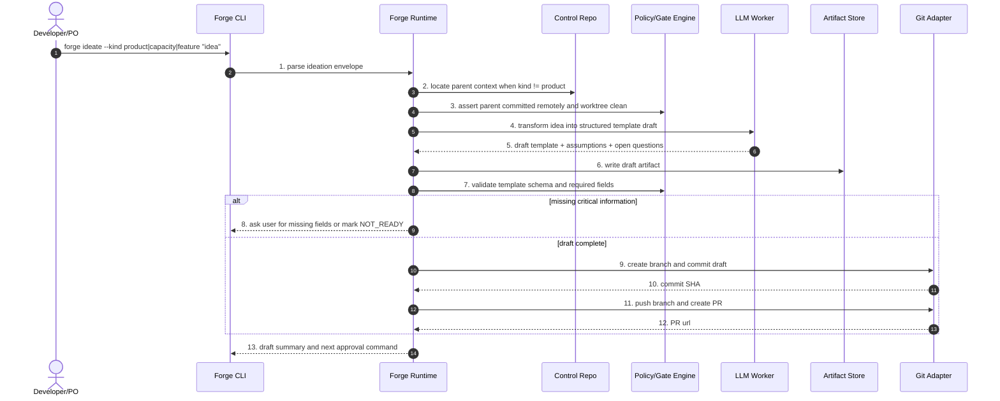

Etapas:

1. **Parse do envelope de ideation.** Identifica se a ideia vira product, capacity ou feature.
2. **Localização de contexto pai.** Capacity precisa de product; feature precisa de capacity.
3. **Gate de predecessor remoto.** Bloqueia se o pai não está aprovado, commitado e sincronizado.
4. **Transformação da ideia.** LLM converte texto livre em template estruturado.
5. **Retorno de assumptions.** O draft explicita hipóteses e perguntas abertas.
6. **Persistência do draft.** Escreve o artefato no control repo.
7. **Validação de schema.** Confere campos obrigatórios.
8. **Tratamento de lacunas.** Se faltar informação crítica, pede complemento ou marca `NOT_READY`.
9. **Commit do draft.** Cria branch e commit transacional.
10. **SHA do commit.** Registra checkpoint local.
11. **Push e PR.** Envia para GitHub para revisão.
12. **URL do PR.** Registra evidência remota.
13. **Resumo para próximo passo.** Mostra comando de aprovação ou ajustes.

#### 3.5.6. Sequência — Product planning e propostas de Capacity

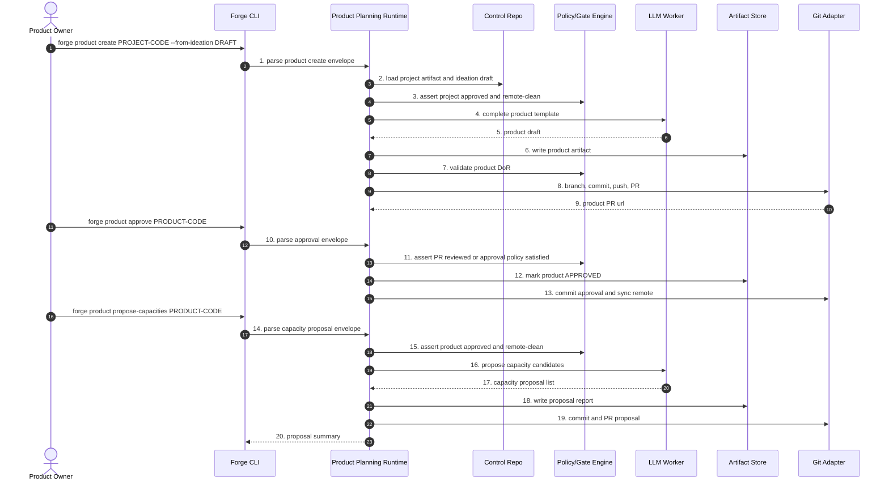

Etapas:

1. **Criação de product.** Inicia a partir de project e ideation.
2. **Carga do project.** Lê o contexto pai e o draft de ideia.
3. **Gate de project remoto.** Garante que o project é checkpoint aprovado.
4. **Completar template.** LLM transforma draft em product template completo.
5. **Product draft.** Retorna visão, público, objetivos, métricas e restrições.
6. **Persistência do product.** Grava `product-*.md`.
7. **Definition of Ready do product.** Valida campos mínimos.
8. **Versionamento.** Cria branch, commit, push e PR.
9. **PR do product.** Retorna URL para revisão.
10. **Aprovação.** Usuário inicia aprovação formal.
11. **Gate de aprovação.** Confirma review ou política de aprovação.
12. **Marcação APPROVED.** Atualiza status do product.
13. **Commit da aprovação.** Sincroniza checkpoint remoto.
14. **Proposta de capacidades.** Solicita capacidades derivadas do product.
15. **Gate de product aprovado.** Só propõe capacity se product está remoto e limpo.
16. **Geração de candidates.** LLM propõe capacidades coerentes.
17. **Lista de propostas.** Retorna candidatos com justificativa.
18. **Relatório de propostas.** Persiste material para seleção.
19. **Commit/PR das propostas.** Versiona o output.
20. **Resumo.** Mostra quais capacities podem ser criadas.

#### 3.5.7. Sequência — Capacity e Feature planning

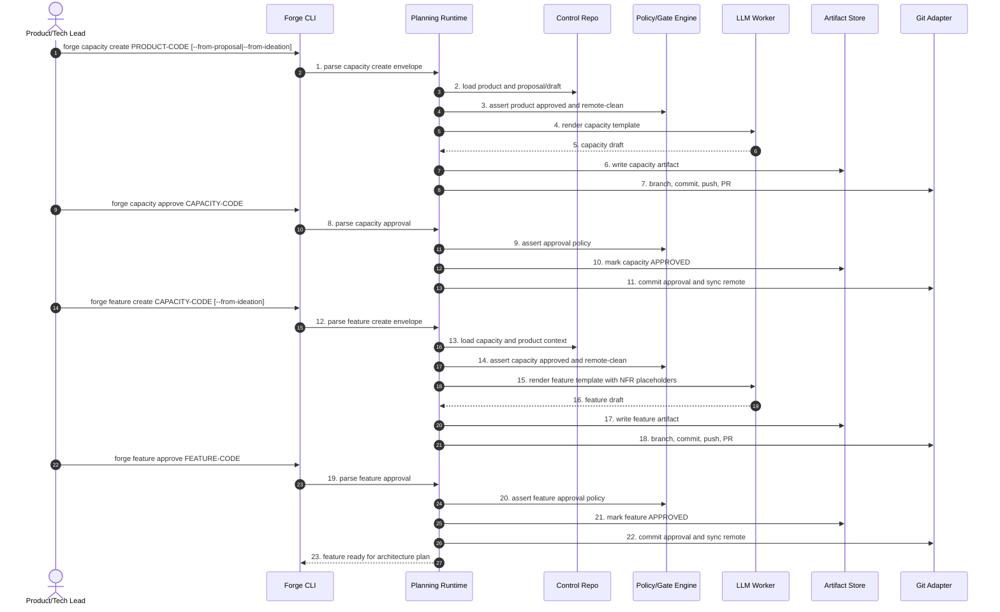

Etapas:

1. **Criação de capacity.** Começa a partir de product aprovado.
2. **Carga de contexto.** Lê product e proposta/draft.
3. **Gate do product.** Bloqueia se product não está remoto e limpo.
4. **Renderização da capacity.** LLM estrutura capacidade.
5. **Capacity draft.** Retorna escopo, domínio e dependências.
6. **Persistência da capacity.** Grava `capacity-*.md`.
7. **Versionamento da capacity.** Cria branch, commit, push e PR.
8. **Aprovação da capacity.** Inicia approval.
9. **Gate de aprovação.** Valida review e campos obrigatórios.
10. **Status APPROVED.** Atualiza artefato.
11. **Checkpoint remoto.** Commit e sync da aprovação.
12. **Criação de feature.** Começa a partir de capacity aprovada.
13. **Carga de product/capacity.** Feature herda contexto dos pais.
14. **Gate da capacity.** Bloqueia se capacity não está remota e limpa.
15. **Renderização da feature.** LLM cria feature com placeholders de NFR.
16. **Feature draft.** Retorna escopo, valor, métricas e perguntas.
17. **Persistência da feature.** Grava `feature-*.md`.
18. **Versionamento da feature.** Cria branch, commit, push e PR.
19. **Aprovação da feature.** Inicia approval.
20. **Gate de aprovação da feature.** Confirma readiness.
21. **Status APPROVED.** Atualiza feature.
22. **Checkpoint remoto.** Sincroniza aprovação.
23. **Liberação para arquitetura.** Feature pode entrar em `forge architecture plan`.

#### 3.5.8. Sequência — `forge architecture plan product|capacity|feature <CODE>`

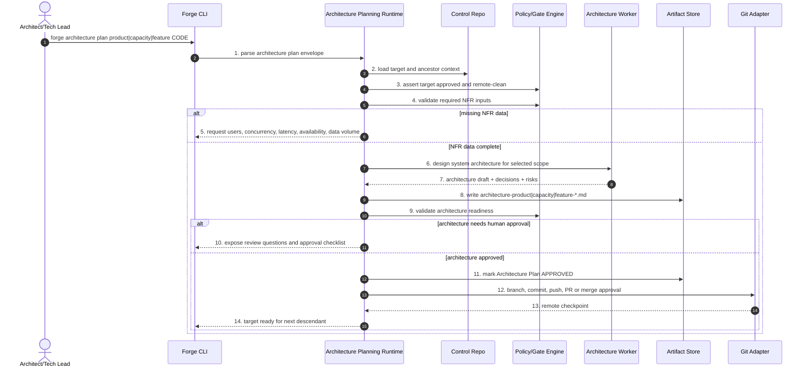

Etapas:

1. **Parse do architecture plan.** Identifica se o alvo é product, capacity ou feature.
2. **Carga de contexto completo.** Lê o alvo e seus ancestrais: product lê project; capacity lê product; feature lê capacity, product e project.
3. **Gate do alvo.** Exige alvo aprovado, remoto e worktree limpa; capacity também exige `architecture-product-*`; feature exige `architecture-product-*` e `architecture-capacity-*`.
4. **Validação de NFRs.** Confere usuários, simultaneidade, latência, disponibilidade, dados, segurança.
5. **Perguntas obrigatórias.** Se faltar dado, solicita antes de desenhar arquitetura.
6. **Desenho sistêmico.** LLM/worker propõe arquitetura no escopo correto: produto, capacidade ou feature.
7. **Draft arquitetural.** Retorna componentes, serviços, dados, segurança, riscos e decisões.
8. **Persistência do plano.** Grava `architecture-product-*`, `architecture-capacity-*` ou `architecture-feature-*`.
9. **Architecture readiness gate.** Valida completude e coerência.
10. **Review humano quando necessário.** Expõe decisões críticas.
11. **Aprovação do plano.** Marca architecture plan como aprovado.
12. **Versionamento.** Commit, push, PR ou merge conforme política.
13. **Checkpoint remoto.** Registra SHA remoto aprovado.
14. **Liberação do próximo descendente.** Product architecture libera capacity planning; capacity architecture libera feature planning; feature architecture libera epic creation.

#### 3.5.9. Sequência — `forge epic create <FEATURE-CODE>`

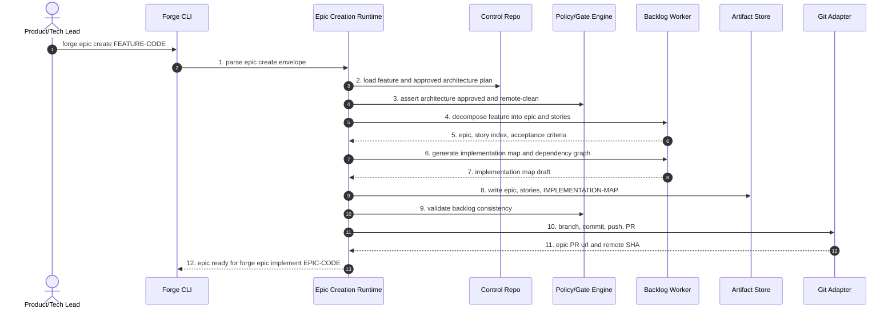

Etapas:

1. **Parse do epic create.** Identifica a feature fonte.
2. **Carga de feature e arquitetura.** Lê o plano arquitetural aprovado.
3. **Gate de arquitetura.** Bloqueia se arquitetura não está aprovada e remota.
4. **Decomposição em backlog.** LLM gera épico e stories.
5. **Draft de épico/stories.** Retorna escopo, ACs, índice e dependências.
6. **Mapa de implementação.** Gera DAG e fases.
7. **Draft do mapa.** Retorna critical path e paralelismo.
8. **Persistência do backlog.** Grava epic, stories e `IMPLEMENTATION-MAP.md`.
9. **Validação de consistência.** Confere IDs, dependências, DoR e links para arquitetura.
10. **Versionamento do épico.** Cria branch, commit, push e PR.
11. **Checkpoint remoto.** Registra SHA/PR do épico.
12. **Liberação para implementação.** Agora `forge epic implement EPIC-CODE` pode rodar.

#### 3.5.10. Implicações para a cadeia completa

- `forge epic implement` deixa de ser o começo do processo; ele vira o começo da **implementação**.
- O começo do produto é `forge ideate` ou `forge product create`.
- Product, Capacity e Feature têm lifecycle próprio: draft, review, approved, remote checkpoint.
- Architecture Plan é obrigatório entre Feature e Epic.
- Epic deve carregar link explícito para `FEATURE-CODE` e para `architecture-feature-*.md`.
- Todo command que cria artefato estratégico precisa branch/commit/PR como os commands de implementação.
- O control repo é tão importante quanto o repositório de código, porque ele guarda o histórico de decisões do produto.

### 3.6. Blueprint de sequência dos comandos de implementação

Os comandos são o ponto de entrada do produto. Por isso, a forma mais clara de entender o Forge é partir do comando mais amplo e expandir as delegações. O fluxo raiz é `forge epic implement`: ele coordena épico, histórias, tasks, PRs, reviews, gates, evidências e telemetria. Sempre que uma chamada delega para outro orquestrador e o diagrama ficaria ilegível, o detalhe aparece no diagrama seguinte.

Regra de leitura:

- `Forge Runtime` substitui a skill markdown atual como dono da state machine.
- `Policy/Gate Engine` substitui phase gates, hooks preventivos e audit checks locais.
- `Artifact Store` representa `ai/epics/*`, `ai/releases/*`, `ai/runs/*`, PR body e state local.
- `LLM Worker` só aparece quando há geração criativa ou julgamento.
- `Adapters` representam git, build, test, docs, security, GitHub/PR e CI.

Convenção de numeração: a linha em que o usuário ou comando pai invoca o command é o **gatilho**. A etapa `1` começa na primeira ação interna do Forge depois desse gatilho. Quando uma etapa chama outro comando orquestrador, o detalhe aparece no diagrama próprio desse comando.

#### 3.6.1. `forge epic implement <EPIC-CODE>` — sequência raiz

Este é o fluxo equivalente ao `x-epic-implement`, agora ajustado para receber o **código do épico** e buscar o Architecture Plan aprovado da feature vinculada. Ele preserva as seis fases atuais: args, plano, branch, loop de stories, gate de integridade e PR final.

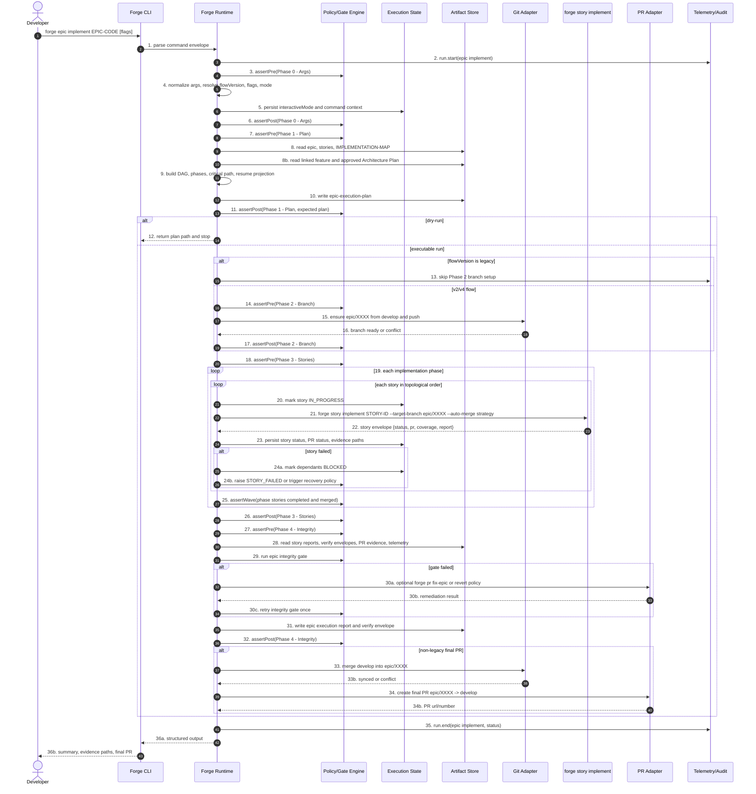

Etapas:

1. **Parse do command envelope.** A CLI transforma `forge epic implement EPIC-CODE [flags]` em um envelope tipado com epic code, feature vinculada, flags, modo de execução e destino esperado.
2. **Início de telemetria.** O runtime registra `run.start` para que toda a execução tenha correlação, duração e status final.
3. **Gate pré-args.** O runtime verifica se pode iniciar a fase de argumentos: ambiente válido, estado legível e nenhuma fase anterior pendente.
4. **Normalização de argumentos.** Flags legadas, `--resume`, `--parallel`, `--dry-run`, `flowVersion`, estratégia de merge e modo interativo são resolvidos em um contrato único.
5. **Persistência de contexto.** O runtime salva `interactiveMode` e metadados do comando em `execution-state.json`, permitindo resume e diagnósticos posteriores.
6. **Gate pós-args.** Confirma que a fase de argumentos produziu estado suficiente para continuar.
7. **Gate pré-planejamento.** Antes de ler backlog e mapas, valida que a fase de args passou e que o épico é elegível.
8. **Leitura de backlog.** Carrega épico, stories e `IMPLEMENTATION-MAP.md`; aqui aparecem gaps de arquivo ausente, story órfã ou mapa divergente.
8b. **Leitura da arquitetura da feature.** Carrega o vínculo `EPIC-CODE -> FEATURE-CODE -> architecture-feature-*.md`; se o plano arquitetural não existir, não estiver aprovado ou não estiver sincronizado no remote, a implementação do épico é bloqueada.
9. **Construção do plano de execução.** Calcula DAG, fases, critical path, projeção de resume e quais stories devem rodar.
10. **Persistência do plano.** Escreve `epic-execution-plan` para virar evidência humana e input de replay.
11. **Gate pós-planejamento.** Confirma que o plano existe, é consistente e não contém ciclos ou dependências quebradas.
12. **Saída antecipada em dry-run.** Se `--dry-run` foi usado, o comando termina aqui com o caminho do plano, sem criar branch nem executar stories.
13. **Decisão de branch por flowVersion.** Fluxos legados pulam branch de épico; fluxos novos seguem para `epic/XXXX`.
14. **Gate pré-branch.** Valida que é permitido criar/sincronizar branch antes de tocar Git remoto.
15. **Garantia da branch de épico.** Cria ou atualiza `epic/XXXX` a partir de `develop` e faz push quando aplicável.
16. **Resultado do Git.** O Git Adapter retorna branch pronta ou conflito operacional.
17. **Gate pós-branch.** Confirma que a branch de épico está pronta antes de executar stories.
18. **Gate pré-loop de stories.** Abre a fase principal de execução e garante que o plano e a branch estão válidos.
19. **Iteração por fase de implementação.** O runtime percorre fases do DAG; dentro de cada fase, respeita ordem topológica ou paralelismo permitido.
20. **Marcação da story como em progresso.** Atualiza estado antes de chamar a story, criando checkpoint recuperável.
21. **Delegação para `forge story implement`.** Chama o command de story com target branch, estratégia de auto-merge e flags propagadas. O detalhe está no diagrama 3.6.2.
22. **Recebimento do envelope da story.** Recebe status, PR, coverage, report e paths de evidência.
23. **Persistência do resultado da story.** Atualiza `execution-state.json` com status, PR, merge status e artefatos produzidos.
24. **Tratamento de falha da story.** Se falhou, marca dependentes como `BLOCKED` e decide entre abortar, recovery ou política de revert.
25. **Gate de wave/fase.** Ao fim de cada fase do DAG, valida que todas as stories esperadas concluíram e foram integradas.
26. **Gate pós-loop de stories.** Fecha a fase de execução de stories quando todas as waves elegíveis terminam.
27. **Gate pré-integridade do épico.** Garante que todas as evidências por story existem antes do gate agregado.
28. **Leitura de evidências.** Carrega reports, verify envelopes, PR evidence e telemetria.
29. **Execução do gate de integridade.** Avalia se o épico está consistente para integração final.
30. **Remediação de gate falho.** Se necessário, chama `forge pr fix-epic` ou aplica política de revert, depois tenta o gate uma vez.
31. **Persistência do relatório do épico.** Escreve relatório final e envelope de verificação do épico.
32. **Gate pós-integridade.** Confirma que o épico tem evidência agregada suficiente.
33. **Sincronização com `develop`.** Em fluxo não legado, mescla `develop` na branch `epic/XXXX` para reduzir conflito no PR final.
34. **Criação do PR final.** Abre PR `epic/XXXX -> develop` com evidências do épico.
35. **Fim de telemetria.** Registra `run.end` com status final e métricas.
36. **Saída estruturada.** Retorna para CLI e usuário um resumo com status, paths de evidência e PR final.

#### 3.6.2. `forge story implement <STORY-ID>` — ciclo de story

Este diagrama expande a chamada feita no loop do épico. Ele corresponde ao `x-story-implement`: prepara contexto, cria/valida contratos, planeja, executa tasks, cria PRs, valida, roda docs/reviews e escreve relatório final.

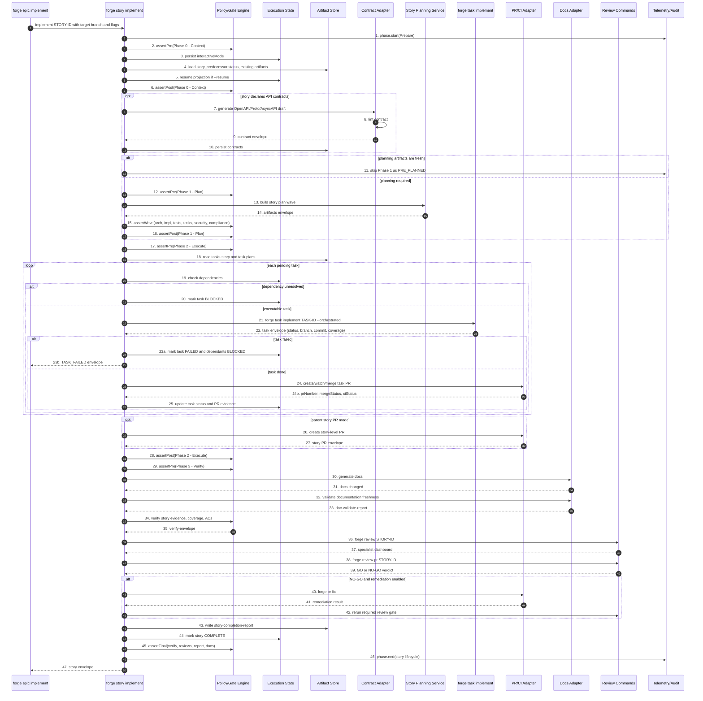

Etapas:

1. **Início da fase de preparo.** A story recebe o envelope do épico ou da CLI e abre telemetria própria.
2. **Gate pré-contexto.** Valida que a story pode iniciar: refinement, predecessores, worktree e estado básico.
3. **Persistência do modo interativo.** Salva a forma de interação para recovery, prompts e auditoria.
4. **Carga da story e evidências existentes.** Lê story, status de predecessores e artefatos já gerados.
5. **Projeção de resume.** Se `--resume`, calcula tasks concluídas, pendentes e warnings de staleness.
6. **Gate pós-contexto.** Confirma que há contexto suficiente para planejar ou executar.
7. **Geração condicional de contratos.** Se a story declara REST, gRPC, events ou websocket, gera contrato API-first.
8. **Lint de contrato.** Valida que o contrato gerado é sintaticamente e semanticamente aceitável.
9. **Envelope de contrato.** Retorna status, arquivos e eventuais warnings.
10. **Persistência de contratos.** Grava OpenAPI/Proto/AsyncAPI para implementação e review.
11. **Decisão de reuso de planejamento.** Se os artefatos estão frescos, a Phase 1 é pulada como `PRE_PLANNED`.
12. **Gate pré-plano.** Se planejamento é necessário, abre a fase de plano.
13. **Build do story planning wave.** Chama o serviço detalhado no diagrama 3.6.3.
14. **Recebimento de artefatos de planejamento.** Recebe paths e status de arch, impl, tests, tasks, security e compliance.
15. **Gate de wave de planejamento.** Confirma que todos os artefatos obrigatórios existem.
16. **Gate pós-plano.** Fecha planejamento e libera execução.
17. **Gate pré-execução.** Garante que tasks e dependências estão prontas para execução.
18. **Leitura das tasks.** Carrega `tasks-story-*` e planos por task.
19. **Checagem de dependências por task.** Antes de executar, valida se a task está desbloqueada.
20. **Bloqueio de task dependente.** Se faltar dependência, marca `BLOCKED` e segue política de propagação.
21. **Delegação para `forge task implement`.** Executa a task via loop TDD detalhado no diagrama 3.6.4.
22. **Recebimento do envelope da task.** Recebe status, branch, commit e coverage.
23. **Tratamento de task falha.** Marca falha, bloqueia dependentes e retorna `TASK_FAILED` ao épico quando necessário.
24. **Criação/watch/merge do PR da task.** Se a task passou, chama o subdomínio PR/CI detalhado no diagrama 3.6.5.
25. **Persistência do status da task.** Salva PR, CI, merge status e evidências.
26. **PR de story opcional.** Em modo parent-story branch, cria PR agregado da story.
27. **Envelope do PR de story.** Recebe número, URL e status do PR agregado.
28. **Gate pós-execução.** Confirma que as tasks esperadas estão concluídas, bloqueadas ou falharam de forma explícita.
29. **Gate pré-verificação.** Abre a fase final de verify/report.
30. **Geração de documentação.** Atualiza docs exigidos pela story.
31. **Resultado da geração de docs.** Retorna arquivos alterados ou no-op.
32. **Validação de documentation freshness.** Confere se README/API/ADR/system docs estão coerentes com o diff.
33. **Relatório de documentação.** Produz `doc-validate-report`.
34. **Verify gate da story.** Valida evidência, coverage e critérios de aceite.
35. **Verify envelope.** Persiste resultado estruturado do gate.
36. **Review especialista.** Chama `forge review`, detalhado no diagrama 3.6.6.
37. **Dashboard especialista.** Recebe achados e scores consolidados.
38. **Review Tech Lead.** Chama `forge review pr`, também detalhado no diagrama 3.6.6.
39. **Veredito GO/NO-GO.** Recebe decisão final de qualidade.
40. **Remediação automática.** Em NO-GO remediável, chama `forge pr fix`.
41. **Resultado da remediação.** Recebe patch/commit/status da correção.
42. **Revisão focada pós-remediação.** Roda novamente o gate necessário.
43. **Relatório de conclusão da story.** Escreve `story-completion-report`.
44. **Finalização de estado.** Marca story como `COMPLETE`.
45. **Gate final da story.** Confirma verify, reviews, report e docs.
46. **Fim de telemetria.** Fecha o ciclo da story.
47. **Envelope para o épico.** Retorna status e evidências para o command pai.

#### 3.6.3. Story planning wave — workers paralelos

Este diagrama detalha o subfluxo de planejamento (`x-internal-story-build-plan`). Ele é separado porque tem fan-out/fan-in e vários artefatos de Fase 1.

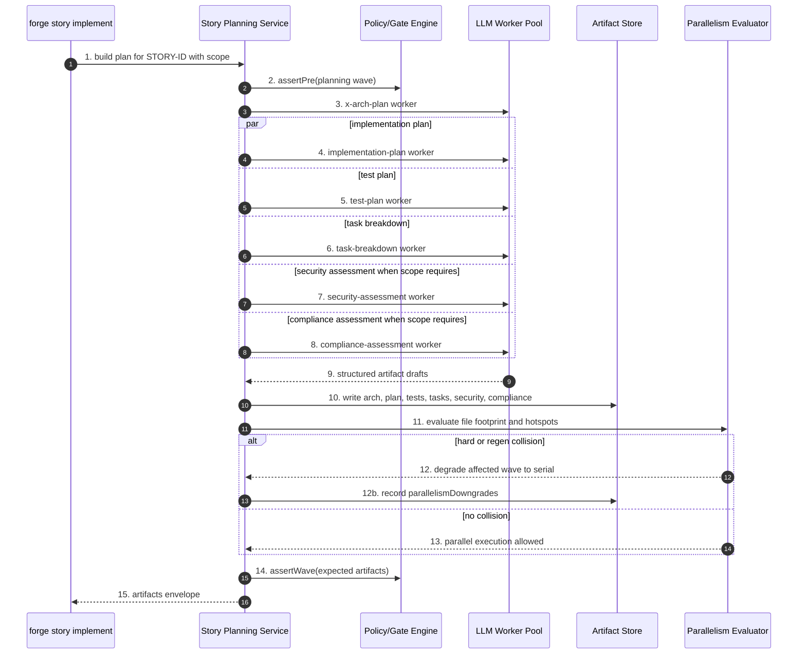

Etapas:

1. **Entrada do planejamento.** A story solicita o plano com story ID, escopo e contexto.
2. **Gate pré-wave.** Confirma que o planejamento pode iniciar e que não há artefatos obrigatórios corrompidos.
3. **Worker de arquitetura.** Chama LLM para gerar plano arquitetural.
4. **Worker de implementação.** Em paralelo, gera plano técnico de implementação.
5. **Worker de testes.** Em paralelo, gera plano TDD/TPP e cenários.
6. **Worker de decomposição.** Em paralelo, quebra a story em tasks.
7. **Worker de segurança.** Quando o escopo exige, gera avaliação de segurança.
8. **Worker de compliance.** Quando o perfil exige, gera avaliação regulatória.
9. **Coleta dos drafts.** O serviço recebe todos os outputs estruturados.
10. **Persistência dos artefatos.** Escreve planos, tasks, security e compliance em `plans/`.
11. **Avaliação de footprint.** Analisa arquivos que cada task pretende tocar para prever colisões.
12. **Degradação por colisão.** Se houver conflito hard/regen, registra que a wave deve rodar serialmente.
13. **Confirmação de paralelismo.** Se não houver colisão, preserva execução paralela permitida.
14. **Gate de artefatos esperados.** Valida que todos os outputs obrigatórios existem.
15. **Envelope para story.** Retorna paths e status para `forge story implement`.

#### 3.6.4. `forge task implement <TASK-ID>` — TDD inner loop

Este diagrama expande o menor orquestrador de implementação. Ele mantém o Double-Loop TDD em código: o runtime decide ciclo, valida RED/GREEN/REFACTOR e chama LLM apenas para gerar teste/código quando necessário.

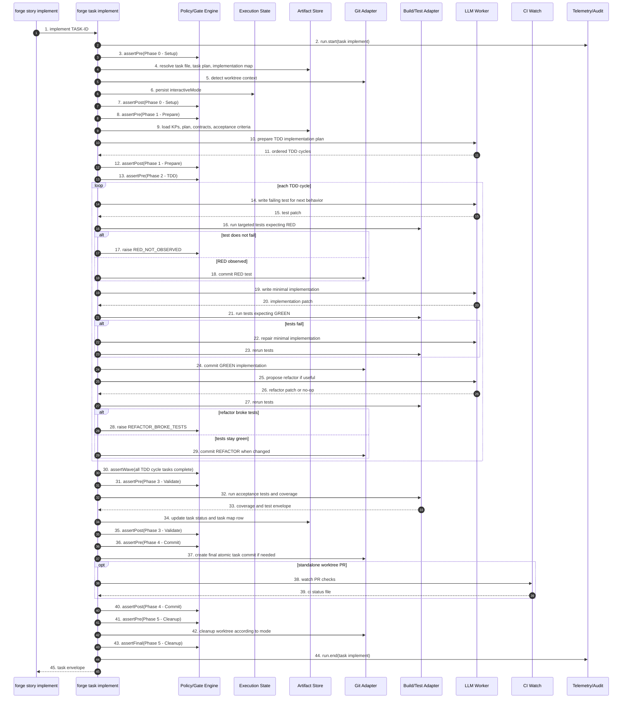

Etapas:

1. **Entrada da task.** A story chama a task com ID, target branch e flags orquestradas.
2. **Início de telemetria da task.** Abre run/span específico para medir o ciclo TDD.
3. **Gate pré-setup.** Valida se a task pode ser carregada.
4. **Resolução de artefatos.** Lê task file, task plan e task implementation map.
5. **Detecção de worktree.** Decide entre reutilizar, criar ou operar em modo legado.
6. **Persistência do modo interativo.** Salva estado para recovery e auditoria.
7. **Gate pós-setup.** Confirma que setup está consistente.
8. **Gate pré-prepare.** Abre fase de entendimento.
9. **Carga de contexto.** Lê KPs, plano, contratos e acceptance criteria.
10. **Preparação do plano TDD.** Chama LLM para ordenar ciclos e estratégia mínima.
11. **Retorno dos ciclos.** Recebe lista ordenada de comportamentos/testes.
12. **Gate pós-prepare.** Fecha preparação.
13. **Gate pré-TDD.** Abre o loop principal.
14. **Geração do teste falho.** LLM escreve o próximo teste esperado.
15. **Patch do teste.** Retorna alteração de teste.
16. **Execução esperando RED.** Build/Test Adapter roda teste alvo e espera falha.
17. **Erro se não houve RED.** Se o teste passa ou não executa, levanta `RED_NOT_OBSERVED`.
18. **Commit RED.** Se falhou corretamente, grava commit do teste.
19. **Geração da implementação mínima.** LLM escreve o menor código para passar.
20. **Patch da implementação.** Retorna alteração de produção.
21. **Execução esperando GREEN.** Testes rodam esperando sucesso.
22. **Reparo de implementação.** Se falhar, LLM tenta correção mínima.
23. **Rerun dos testes.** Confirma se o reparo ficou verde.
24. **Commit GREEN.** Grava implementação mínima.
25. **Proposta de refactor.** LLM sugere refactor ou no-op.
26. **Patch de refactor.** Retorna alteração ou nada.
27. **Rerun pós-refactor.** Testes rodam para garantir comportamento preservado.
28. **Erro se refactor quebrou.** Levanta `REFACTOR_BROKE_TESTS`.
29. **Commit REFACTOR.** Grava refactor quando houve mudança segura.
30. **Gate da wave TDD.** Confirma que todos os ciclos planejados foram concluídos.
31. **Gate pré-validação.** Abre validação final.
32. **Acceptance e coverage.** Roda testes de aceite e cobertura.
33. **Envelope de testes.** Recebe resultados e percentuais.
34. **Atualização de status da task.** Marca arquivo/mapa como concluído.
35. **Gate pós-validação.** Confirma que critérios foram provados.
36. **Gate pré-commit final.** Abre fase de commit/CI.
37. **Commit atômico final.** Cria commit consolidado se necessário.
38. **CI-watch condicional.** Em modo PR/worktree, acompanha checks remotos.
39. **Arquivo de status CI.** Persiste resultado do watch.
40. **Gate pós-commit.** Fecha fase de commit.
41. **Gate pré-cleanup.** Abre cleanup.
42. **Limpeza de worktree.** Remove ou preserva worktree conforme modo e status.
43. **Gate final da task.** Confirma fechamento completo.
44. **Fim de telemetria.** Registra duração e status.
45. **Envelope para story.** Retorna status, commit, coverage e branch.

#### 3.6.5. PR, CI-watch e auto-merge

Este diagrama detalha o fluxo que hoje é repartido entre `x-pr-create`, `x-pr-watch-ci`, `x-pr-merge` e renderização de PR body.

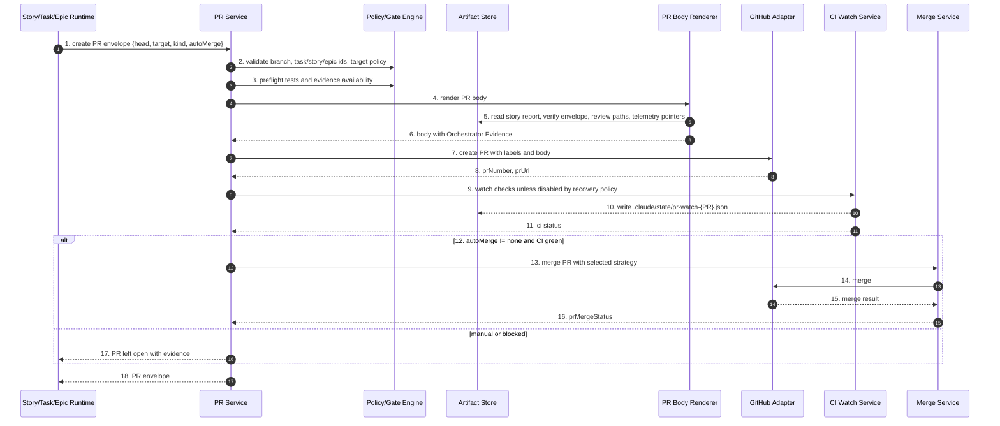

Etapas:

1. **Entrada do PR envelope.** O caller informa head, target, tipo de PR, auto-merge e contexto de task/story/epic.
2. **Validação de identidade e branch.** Confere padrões de branch, IDs, target branch e labels esperados.
3. **Preflight de testes/evidência.** Garante que o PR não será criado sem estado local consistente.
4. **Renderização do PR body.** Chama renderer para montar corpo padronizado.
5. **Leitura de evidências.** Renderer coleta report, verify envelope, review paths e telemetry pointers.
6. **Body com Orchestrator Evidence.** Retorna markdown com evidência rastreável.
7. **Criação do PR.** GitHub Adapter abre PR com labels, título e body.
8. **Envelope básico do PR.** Retorna número e URL.
9. **CI-watch.** Acompanha checks, salvo quando recovery policy permite pular.
10. **Persistência do watch.** Escreve `.claude/state/pr-watch-{PR}.json` ou equivalente Forge.
11. **Resultado do CI.** Retorna status dos checks.
12. **Decisão de auto-merge.** Se auto-merge está habilitado e CI está verde, segue para merge.
13. **Merge com estratégia selecionada.** Aplica merge/squash/rebase conforme política.
14. **Chamada ao GitHub para merge.** Executa operação remota.
15. **Resultado do merge.** Recebe sucesso ou falha.
16. **Status de merge no envelope.** Retorna `prMergeStatus`.
17. **PR manual/bloqueado.** Se não pode auto-merge, retorna PR aberto com evidências.
18. **Envelope final para caller.** Devolve URL, número, CI e merge status.

#### 3.6.6. Review gates — especialistas e Tech Lead

Este diagrama detalha as chamadas `forge review` e `forge review pr`, acionadas dentro de `story implement` e também úteis como comandos públicos.

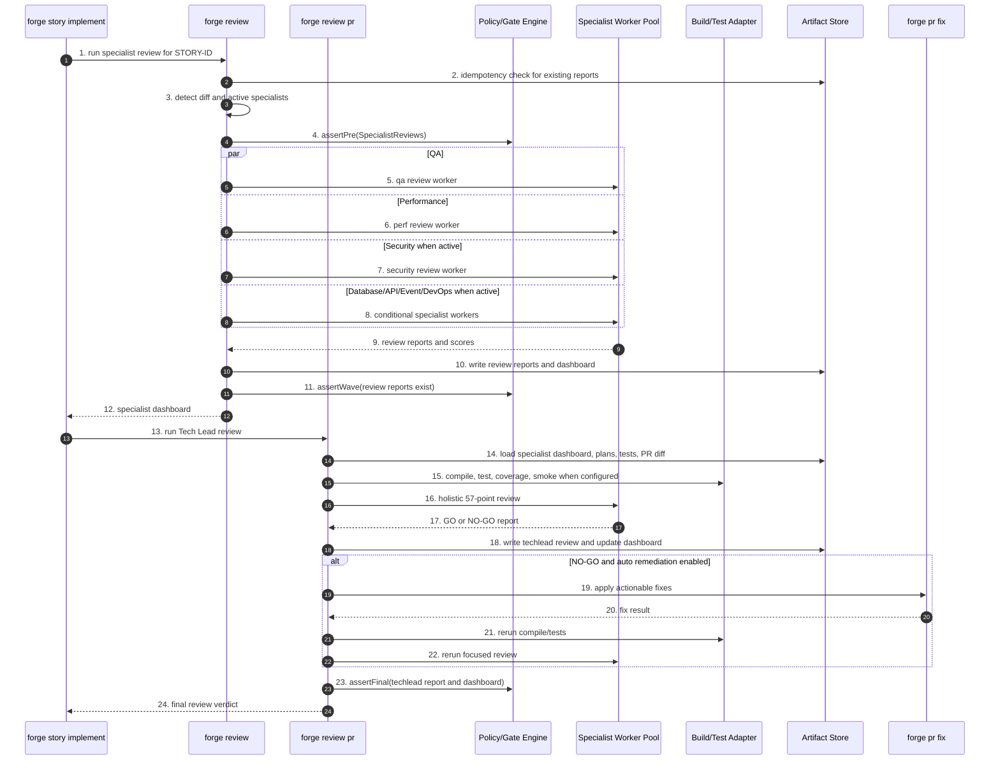

Etapas:

1. **Entrada do review especialista.** Story solicita review para a story/branch.
2. **Idempotency check.** Verifica se reports existentes ainda são válidos.
3. **Detecção de diff e especialistas ativos.** Decide quais reviewers são necessários com base no perfil e arquivos alterados.
4. **Gate pré-review.** Valida que há diff e contexto suficiente.
5. **Worker QA.** Roda review de qualidade/testes.
6. **Worker Performance.** Roda review de performance.
7. **Worker Security condicional.** Roda review de segurança quando aplicável.
8. **Workers condicionais adicionais.** Roda database, API, events, DevOps e outros quando o stack exige.
9. **Coleta de reports.** Recebe achados e scores dos especialistas.
10. **Persistência de reports e dashboard.** Grava relatórios individuais e consolidação.
11. **Gate de wave dos reviews.** Confirma que todos os reports ativos existem.
12. **Dashboard para story.** Retorna síntese de especialistas.
13. **Entrada do Tech Lead review.** Story solicita veredito holístico.
14. **Carga de contexto TL.** Lê dashboard, planos, testes e diff/PR.
15. **Build/test/coverage/smoke.** Executa validações determinísticas antes do julgamento.
16. **Review holístico.** LLM aplica rubrica Tech Lead.
17. **Report GO/NO-GO.** Retorna decisão e achados.
18. **Persistência do Tech Lead report.** Atualiza dashboard com score final.
19. **Remediação condicional.** Em NO-GO remediável, chama `forge pr fix`.
20. **Resultado da correção.** Recebe patch/status.
21. **Revalidação determinística.** Roda compile/test novamente após correção.
22. **Review focado pós-fix.** Reavalia achados afetados.
23. **Gate final de review.** Confirma report TL e dashboard.
24. **Veredito final para story.** Retorna GO/NO-GO para o lifecycle.

#### 3.6.7. Implicação para o design do runtime

Esses diagramas revelam a estrutura real do produto:

- `forge epic implement` é um **composite command** que não deve conter lógica de story/task/review inline; ele coordena envelopes e policies.
- `forge story implement` é o principal command de delivery: ele integra planejamento, task loop, docs, verify, review e report.
- `forge task implement` é o inner loop TDD, onde a maior parte da criação de código acontece.
- PR/CI/review são subdomínios reutilizáveis, não detalhes acidentais de story.
- Cada seta que escreve em disco deve produzir um `artifact_kind` tipado.
- Cada `alt` de erro/recovery deve virar exceção tipada, política de retry ou estado persistido.

---

## 4. Inventário Canônico de Ativos Atuais e Destino Forge

Esta é a seção de preservação de contexto. Ela evita duplicação separando a pergunta em camadas:

- **Skills/comandos/workers:** quem executa ou gera algo?
- **Rules/policies:** quais invariantes precisam sobreviver?
- **KPs:** qual conhecimento alimenta workers?
- **Hooks/scripts:** quais invariantes shell precisam virar runtime?
- **Templates:** quais estruturas renderizam artefatos?
- **Artefatos:** o que aparece em disco e quem consome?

### 4.1. Skills e comandos atuais, classificados uma única vez

#### 4.1.1. Orquestradoras públicas — viram comandos Forge

Estas skills controlam fluxo amplo. No Forge elas devem sair de markdown interpretado e virar comandos CLI com state machine, persistência, gates, telemetria, retries e saída estruturada.

| Skill atual | Destino Forge V0 | Motivo |
| --- | --- | --- |
| `x-epic-implement` | `forge epic implement <ID>` | Implementação de épico em fases, waves, gates e PRs. |
| `x-story-implement` | `forge story implement <ID>` | Lifecycle end-to-end de story: planning, task execution, PR, review, verify, report. |
| `x-task-implement` | `forge task implement <ID>` | TDD double-loop, validações, commits e PR/task. |
| `x-release` | `forge release [--patch\|--minor\|--major]` | Versionamento, changelog, release branch, tag e back-merge. |
| `x-epic-orchestrate` | `forge epic orchestrate <ID>` | Planejamento multi-story com checkpoints e resume. |
| `x-pr-merge-train` | `forge merge-train` | Ordenação topológica de PRs, waves, CI e merge. |
| `x-review` | `forge review <STORY>` | Fan-out/fan-in de especialistas e consolidação. |
| `x-review-pr` | `forge review pr <PR>` | Veredito Tech Lead GO/NO-GO. |
| `x-story-refine` | `forge story refine <ID>` | Refinement multi-persona com verdict persistido. |
| `x-epic-refine` | `forge epic refine <ID>` | Refinement estratégico de épico. |
| `x-story-plan` | `forge story plan <ID>` | Planning wave, task breakdown, task plans e DoR. |
| `x-feature-create` | `forge feature create <CAPACITY-CODE>` | Capacity/ideation → feature estruturada; epic/stories/map nascem depois de arquitetura aprovada. |
| `x-feature-ideate` | `forge feature ideate` | Ideia livre → spec/backlog estruturado. |
| `x-test-tdd` | `forge test tdd <TASK>` | Orquestra ciclos Red/Green/Refactor; LLM atua pontualmente. |

#### 4.1.2. Orquestradoras auxiliares — comando público, subcomando avançado ou serviço

Estas coordenam fluxo suficiente para não serem leaf prompts. A visibilidade pública deve ser decidida por UX, não por necessidade do LLM.

| Skill auxiliar | Destino provável |
| --- | --- |
| `x-code-audit` | `forge code audit` ou parte de `forge ci verify`. |
| `x-lib-audit-rules` | Serviço interno / `forge lint policy`. |
| `x-doc-generate` | `forge doc generate` e fase interna de story/release. |
| `x-template-migrate` | `forge template migrate`. |
| `x-pr-create` | `forge pr create` e serviço interno de PR. |
| `x-pr-fix` | `forge pr fix <PR>`. |
| `x-pr-fix-epic` | `forge pr fix --epic <EPIC>`. |
| `x-pr-watch-ci` | `forge pr watch <PR>` com exit codes tipados. |
| `x-pr-merge` | `forge pr merge` ou serviço interno usado por merge-train/release. |
| `x-git-push`, `x-git-commit`, `x-git-worktree`, `x-git-cleanup-branches` | Subcomandos `forge git ...` e serviços transacionais internos. |
| `x-status-reconcile` | `forge status reconcile` para recovery/admin. |
| `x-ci-generate` | `forge ci generate`. |
| `x-setup-env` | `forge setup env` ou `forge doctor`. |
| `x-perf-profile` | `forge perf profile`. |
| `x-ops-troubleshoot` | `forge troubleshoot` ou worker acionado por falhas. |
| `x-ops-incident` | Comando opcional; provável V1+ ou plugin ops. |
| `x-jira-create-epic`, `x-jira-create-stories` | Plugins `forge jira ...`, fora do core offline. |
| `x-adr-generate` | `forge adr generate` e fase interna de arquitetura. |
| `x-owasp-scan`, `x-security-dashboard`, `x-security-pentest` | `forge security ...`, alguns condicionais por capability/permissão. |

#### 4.1.3. Serviços internos — viram código testável

Estas skills existem hoje porque o LLM precisava chamar componentes internos por nome. No Forge, elas viram classes, serviços ou funções.

| Grupo interno | Skills atuais | Forma em Forge |
| --- | --- | --- |
| Gates | `x-internal-phase-gate`, `x-internal-story-verify`, `x-internal-epic-integrity-gate` | `PhaseGateService`, `StoryVerifyService`, `EpicIntegrityGate`. |
| Estado e contexto | `x-internal-status-update`, `x-internal-story-resume`, `x-internal-story-load-context`, `x-internal-args-normalize` | Repositório de estado, loader de contexto, parser tipado de args. |
| Planejamento | `x-internal-story-build-plan`, `x-internal-epic-build-plan`, `x-lib-task-decomposer` | Builders e dispatchers internos de workers. |
| Renderização | `x-internal-report-write`, `x-internal-pr-body-render`, `x-internal-story-report` | Renderers tipados com templates versionados. |
| Git/precheck | `x-internal-epic-branch-ensure`, `x-internal-worktree-precheck`, `x-lib-group-verifier` | Serviços de branch, worktree, locks e wave verification. |
| Criação interna | `x-internal-epic-create`, `x-internal-story-create`, `x-internal-epic-map` | Factories/renderers de backlog e mapa. |

#### 4.1.4. Skills puras — permanecem isoladas como workers, adapters ou comandos utilitários

Estas já têm uma responsabilidade dominante. O Forge deve portá-las sem inflar escopo. Elas não devem ganhar state machine própria nem coordenar lifecycle amplo.

| Grupo | Skills puras | Destino Forge |
| --- | --- | --- |
| `conditional/dev` | `x-setup-stack` | Adapter/comando de setup stack-specific. |
| `conditional/ops` | `x-obs-instrument` | Worker/adapter de instrumentação. |
| `conditional/review` | `x-review-api`, `x-review-compliance`, `x-review-data-modeling`, `x-review-db`, `x-review-devops`, `x-review-events`, `x-review-gateway`, `x-review-graphql`, `x-review-grpc`, `x-review-obs`, `x-review-security` | Workers especialistas que consomem KPs/policies. |
| `conditional/security` | `x-security-container`, `x-security-dast`, `x-security-infra`, `x-security-sast`, `x-security-secrets`, `x-security-sonar` | Security adapters/workers por superfície. |
| `conditional/test` | `x-test-contract-lint`, `x-test-contract`, `x-test-e2e`, `x-test-perf`, `x-test-smoke-api`, `x-test-smoke-socket` | Test adapters por categoria. |
| `core/code` | `x-code-format`, `x-code-lint` | Adapters determinísticos de format/lint. |
| `core/dev` | `helidon-scaffold`, `micronaut-scaffold`, `picocli-command`, `quarkus-resource`, `spring-controller` | Templates stack-specific + render command. |
| `core/dev` | `x-ci-generate`, `x-mcp-recommend`, `x-setup-env`, `x-spec-drift` | CI renderer, advisor command, setup/doctor, drift report. |
| `core/git` | `x-git-branch`, `x-git-cleanup-branches`, `x-git-commit`, `x-git-merge`, `x-git-push`, `x-git-worktree`, `x-planning-commit` | Git adapters transacionais. |
| `core/jira` | `x-jira-create-epic`, `x-jira-create-stories` | Plugins Jira. |
| `core/lib` | `x-lib-group-verifier`, `x-lib-task-decomposer` | Serviços internos reutilizáveis. |
| `core/ops` | `x-doc-generate`, `x-doc-validate`, `x-ops-incident`, `x-ops-troubleshoot`, `x-perf-profile`, `x-release-changelog`, `x-status-reconcile`, `x-telemetry-analyze`, `x-telemetry-trend` | Docs, ops, profiling, changelog, telemetry commands. |
| `core/plan` | `planning-standards-kp`, `x-adr-generate`, `x-arch-plan`, `x-arch-system-update`, `x-arch-update`, `x-parallel-eval`, `x-task-plan`, `x-template-migrate`, `x-threat-model` | KP, worker prompts, docs updates, validators e planners. |
| `core/pr` | `x-pr-create`, `x-pr-fix`, `x-pr-merge`, `x-pr-watch-ci` | PR commands/services. |
| `core/review` | `x-review-perf`, `x-review-pr`, `x-review-qa` | Review workers/commands. |
| `core/security` | `x-dependency-audit`, `x-hardening-eval`, `x-owasp-scan`, `x-runtime-eval`, `x-security-dashboard`, `x-security-pipeline`, `x-supply-chain-audit` | Security commands/adapters. |
| `core/test` | `x-test-plan`, `x-test-run` | Test plan worker + test runner adapter. |

#### 4.1.5. Skills candidatas a virar KP, policy ou template

| Ativo atual | Tipo-alvo provável | Justificativa |
| --- | --- | --- |
| `planning-standards-kp` | `knowledge-pack` | Já é uma fonte RA9; deve sair do catálogo de comandos. |
| `x-mcp-recommend` | KP + advisor command | O catálogo de MCPs é conhecimento; o comando só aplica matching. |
| Scaffolds (`spring-controller`, `quarkus-resource`, etc.) | `template` + render command | O valor principal é estrutura stack-specific. |
| Review specialists | `worker-prompt` + KP/policy externo | O review permanece ação, mas critérios devem sair do prompt e virar KP/policy. |
| `x-internal-phase-gate`, `x-internal-story-verify`, `x-internal-epic-integrity-gate` | `policy` / gate service | São invariantes de lifecycle. |
| `x-doc-validate` | Policy + command | O critério é policy; a execução é command/gate. |
| `x-lib-audit-rules` | Registry/policy validator | Deve validar registry, rules e policies tipadas. |
| `audit-*.sh`, `verify-*.sh`, `enforce-*.sh` | Policy executable | Não são skills; são invariantes que migram para runtime/CI. |

### 4.2. Rules e policies

| Domínio de rule atual | Exemplos atuais | Destino Forge |
| --- | --- | --- |
| Identidade, domínio e contexto | Rules 01, 02 | Doctrine humana + defaults de profile. |
| Coding standards, arquitetura, quality gates | Rules 03, 04, 05 | Thresholds/limites viram policy; explicações viram KP. |
| Segurança, operações, compliance | Rules 06, 07, conditional rules | Policy packs por domínio regulado + KP de referência. |
| Branching, release, Git Flow | Rules 08, 09, 21 | Serviços de branch/release e CI de consistência. |
| Skill invocation, visibility, capability grammar | Rules 13, 22, 28 | Registry/linter tipado; tool-call grammar vira schema/AST. |
| Model selection e custo | Rule 23 | Policy no model router. |
| Execution integrity e zero-bypass | Rules 24, 27 | Propriedade arquitetural do runtime; CI valida evidência. |
| Task hierarchy e phase gates | Rule 25 | State machine + phase gate service. |
| Audit lifecycle | Rule 26 | Biblioteca de auditoria; taxonomy curta em docs. |
| Refinement e DoR | Rule 29 | Pré-condição nativa dos comandos de implementação. |
| Documentation as DoD | Rule 31 | Policy de doc freshness + KP stack-aware. |

Decisão: rules críticas ganham `policy_id`, versão, testes e ponto de execução claro: runtime, CI Camada B ou doctrine humana.

### 4.3. Knowledge Packs

| KP/domínio | Destino Forge | Consumo típico |
| --- | --- | --- |
| `architecture`, `layer-templates`, `patterns` | KP oficial de arquitetura + templates stack-specific. | `forge arch plan`, scaffolds, code workers. |
| `coding-standards` | KP de engenharia + ponte para policies executáveis. | `forge task implement`, `forge review`, `forge code audit`. |
| `testing`, `story-planning`, `planning-standards-kp` | KP de TDD, TPP, RA9 e decomposição. | `forge story plan`, `forge task plan`, `forge test tdd`. |
| `security`, `compliance` | KP base + overlays regulados (`pci`, `hipaa`, `lgpd`, `soc2`). | `forge review security`, `forge threat model`, `forge ci verify`. |
| `observability`, `resilience`, `infrastructure`, `dockerfile` | KPs condicionais por capability runtime/infra. | `forge ops`, `forge review devops`, `forge perf profile`. |
| `api-design`, `protocols` | KP por interface (`rest`, `grpc`, `graphql`, `event`). | `forge review api`, `forge arch plan`, contract tests. |

KP não deve ter side effect nem ser invocado como comando principal. Se houver UX de consulta, ela deve ser algo como `forge explain <topic>`, não um lifecycle step.

### 4.4. Hooks e scripts de validação

Os hooks e scripts atuais são importantes porque explicitam invariantes. Eles não devem sobreviver como mecanismo primário, mas seus contratos devem sobreviver como código.

#### 4.4.1. Gatilhos atuais

| Gatilho | Hooks/scripts envolvidos | Responsabilidade |
| --- | --- | --- |
| `SessionStart` | `telemetry-session.sh` | Abre trilha de telemetria da sessão. |
| `PreToolUse` | `telemetry-pretool.sh`, `enforce-phase-sequence.sh`, `enforce-no-bypass-flags.sh`, `enforce-refinement-gate.sh`, `enforce-preflight-gates.sh` | Mede tool call e bloqueia fase inválida, bypass, ausência de refinement ou operação remota sem preflight. |
| `PostToolUse` (`Write`/`Edit`) | `post-compile-check.sh` | Compila após edição Java. |
| `PostToolUse` (`*`) | `telemetry-posttool.sh` | Fecha medição de tool call. |
| `SubagentStop` | `telemetry-subagent.sh` | Registra encerramento de subagente. |
| `Stop` | `telemetry-stop.sh`, `verify-story-completion.sh`, `verify-phase-gates.sh`, `enforce-continuous-flow.sh`, `stage-telemetry.sh` | Fecha sessão, verifica evidências, alerta gates e prepara telemetria. |
| PR/CI/`mvn verify` | `scripts/audit-*.sh`, `*AuditTest.java` | Validação detectiva no repositório. |

#### 4.4.2. Migração dos invariantes

| Script/hook/família | Invariante | Destino Forge |
| --- | --- | --- |
| `enforce-phase-sequence.sh`, `verify-phase-gates.sh`, `audit-phase-gates.sh` | Não avançar fase sem filhos/evidências/gates passados. | `PhaseGateService` + testes + `forge ci verify`. |
| `enforce-no-bypass-flags.sh`, `audit-bypass-flags.sh` | Bypass flags só em recovery. | Parser tipado de flags + policy de recovery. |
| `enforce-refinement-gate.sh`, `audit-refinement-gate.sh` | Implementação exige refinement aprovado. | Pré-condição dos commands. |
| `enforce-preflight-gates.sh`, `scripts/preflight.sh` | Operação remota exige estado local íntegro. | Preflight in-process antes de push/PR. |
| `post-compile-check.sh` | Edição Java não deve quebrar compile. | Build adapter por stack. |
| `verify-story-completion.sh`, `audit-execution-integrity.sh` | PR/story exige evidência completa. | Completion gate + CI Camada B. |
| `enforce-continuous-flow.sh` | Orquestração não deve ficar parada em fase aberta. | Scheduler/state machine do runtime. |
| `telemetry-*`, `telemetry-phase.sh`, `stage-telemetry.sh` | Eventos de sessão/tool/fase/subagente precisam ser emitidos. | Telemetria in-process + audit log local. |
| `audit-doc-freshness.sh` | Doc-as-DoD. | Documentation policy + `forge doc validate`. |
| `audit-template-version.sh`, `audit-flow-version.sh` | Templates e flowVersion precisam ser compatíveis. | Schema validators + migration assistant. |
| `audit-epic-branches.sh` | Branching de epic precisa ser consistente. | Branch policy service. |
| `audit-skill-visibility.sh`, `audit-model-selection.sh`, `audit-capability-graph.sh` | Registry, modelo e capability graph precisam ser íntegros. | Registry linter + resolver tipado. |

Decisão: nenhum hook shell deve ser mecanismo primário da V0. Para cada hook/script removido, criar teste no Forge cobrindo o mesmo invariante e rodar dual-mode por 1 release.

### 4.5. Templates

Templates são estruturas reutilizáveis. Eles não são artefatos finais; eles definem a forma dos artefatos.

| Família | Exemplos | Consumidores atuais | Destino Forge |
| --- | --- | --- | --- |
| Planning product | `_TEMPLATE-EPIC.md`, `_TEMPLATE-STORY.md`, `_TEMPLATE-TASK.md`, `_TEMPLATE-IMPLEMENTATION-MAP.md`, `_TEMPLATE-DOR-CHECKLIST.md` | Epic/story/feature creation, planning/refinement. | Template registry + schemas de backlog. |
| Execution governance | `_TEMPLATE-IMPLEMENTATION-PLAN.md`, `_TEMPLATE-TASK-BREAKDOWN.md`, `_TEMPLATE-EPIC-EXECUTION-PLAN.md`, `_TEMPLATE-STORY-COMPLETION-REPORT.md`, `_TEMPLATE-EXECUTION-STATE.json`, `_TEMPLATE-REFINEMENT-VERDICT.md` | Story/epic implement, reports, status update. | Renderer determinístico + schemas para estado/evidência. |
| Review governance | `_TEMPLATE-ARCHITECTURE-PLAN.md`, `_TEMPLATE-SPECIALIST-REVIEW.md`, `_TEMPLATE-CONSOLIDATED-REVIEW-DASHBOARD.md`, `_TEMPLATE-TECH-LEAD-REVIEW.md`, `_TEMPLATE-REVIEW-REMEDIATION.md` | Review, review-pr, remediation. | Worker review templates + structured verdicts. |
| Security, compliance, quality | `_TEMPLATE-SECURITY-ASSESSMENT.md`, `_TEMPLATE-COMPLIANCE-ASSESSMENT.md`, `_TEMPLATE-THREAT-MODEL.md`, `_TEMPLATE-SLO-SLI-DEFINITION.md`, `_TEMPLATE-TEST-PLAN.md` | Planning, threat model, test plan. | Security/testing templates tied to policies. |
| Documentation | `_TEMPLATE-ADR.md`, `_TEMPLATE-ARCHITECTURE-SYSTEM.md`, `_TEMPLATE-DOC-VALIDATE-REPORT.md`, `_TEMPLATE-CONTRIBUTING.md`, `CLAUDE.md`, `SYSTEM_SPECS.md` | Docs generation, ADR, target adapters. | Generated documentation views. |
| Observability/ops | `_TEMPLATE-TELEMETRY-EVENT.json`, `_TEMPLATE-TELEMETRY-REPORT.md`, runbooks | Telemetry hooks, telemetry analyze, ops skills. | Event schemas + report renderers. |
| Git/PR/release | `_TEMPLATE-CHANGELOG-ENTRY.md`, `_TEMPLATE-RELEASE-CHECKLIST.md`, `_TEMPLATE-PR-IMPLEMENTATION.md`, `_TEMPLATE-PR-BACKLOG.md` | Release/changelog/PR body rendering. | Strict renderers with evidence schema. |
| Meta-generator/infra | `_TEMPLATE-SKILL.md`, `constitution/*`, `domains/**`, `fragments/*`, `config-templates/*`, `cicd-templates/**/*.njk` | Generator, authoring, CI/CD assembler. | Template/profile/fragment registry. |

Decisões:

- Todo template ganha `template_id`, versão, categoria, input schema e consumidores.
- JSON templates como `_TEMPLATE-EXECUTION-STATE.json` viram schemas, não texto copiado.
- Templates `.njk`/YAML pertencem à composition engine, não ao lifecycle de skills.
- Goldens continuam testes de regressão, não fonte de verdade.

### 4.6. Artefatos padrão gerados

Artefatos são instâncias persistidas no disco. A fonte de layout v4 é `ai/README.md`: `ai/epics/epic-XXXX-<slug>/` concentra épico, stories, planos, relatórios, telemetria e estado; `ai/releases/` guarda release state; `ai/runs/` guarda artefatos por sessão/execução. Fluxos legados podem usar `plans/epic-XXXX/`, mas a semântica é a mesma.

#### 4.6.1. Raiz do épico

| Artefato | Objetivo | Quem gera | Consumidores |
| --- | --- | --- | --- |
| `epic-XXXX.md` / `EPIC-XXXX.md` | Fonte normativa do backlog do épico. | `x-epic-create`, `x-epic-decompose`, `x-feature-create`, builders internos. | Operadores, story creation, refinement, orchestrators, audits. |
| `story-XXXX-YYYY.md` | Contrato implementável da story. | `x-story-create`, `x-epic-decompose`, builders internos. | `x-story-implement`, `x-task-implement`, reviews, CI. |
| `IMPLEMENTATION-MAP.md` | DAG e fases entre stories. | `x-epic-map`, `x-feature-create`, `x-epic-decompose`. | `x-epic-implement`, `x-epic-orchestrate`, `x-parallel-eval`. |
| `execution-state.json` | Checkpoint de orquestração. | Orchestrators e status services. | Resume, phase gates, refinement gate, continuous flow, runtime Forge. |
| `epic-execution-plan.md` | Plano materializado do épico. | Epic build plan / implement. | `x-epic-implement`, relatórios, auditoria humana. |
| `epic-execution-report.md` | Encerramento agregado do épico. | `x-epic-implement`, report writer. | Release train, stakeholders, CI. |
| `spec-*.md` | Entrada de decomposição. | Humano ou feature pipeline. | Epic/story creation, refinement. |

#### 4.6.2. `plans/`

| Artefato | Objetivo | Quem gera | Consumidores |
| --- | --- | --- | --- |
| `arch-story-*.md` | Plano arquitetural. | `x-arch-plan` / build-plan. | Implementação, `x-arch-update`, reviews, Surface 07. |
| `plan-story-*.md` | Plano de implementação. | `x-internal-story-build-plan`. | Task implement, context loader, verify. |
| `tests-story-*.md` | Plano TDD/TPP. | `x-test-plan` / build-plan. | Task implement, QA, coverage. |
| `tasks-story-*.md` | Decomposição de tasks. | `x-lib-task-decomposer`. | Task implement, execution state. |
| `plan-task-*.md` / `task-plan-TASK-*.md` | Plano por task. | `x-task-plan`, `x-story-plan`. | Task implement, parallel eval. |
| `security-story-*.md` | Avaliação de segurança. | Build-plan Phase 1E. | Security review, compliance. |
| `compliance-story-*.md` | Avaliação compliance. | Build-plan Phase 1F. | Compliance gates. |
| `planning-report-story-*.md` / `story-planning-report-*.md` | Relatório de planejamento. | `x-story-plan`, `x-epic-orchestrate`. | DoR, resume, operadores. |
| `dor-story-*.md` | Definition of Ready. | `x-story-plan`. | `x-epic-orchestrate`, planning gate. |
| `review-*-story-*.md` | Review especialista. | `x-review`. | Dashboard, remediation, Surface 04. |
| `review-dashboard-story-*.md` | Consolidação de reviews. | `x-review`. | Tech lead, story owner. |
| `techlead-review-story-*.md` | Veredito GO/NO-GO. | `x-review-pr`. | Merge gate, Surface 05. |
| `remediation-story-*.md` | Plano de correções pós-review. | Story implement remediation phase. | PR fixes, implementation. |

O pacote de Fase 1 em fluxos zero-bypass é tipicamente: arch plan, implementation plan, test plan, task breakdown, security assessment e compliance assessment.

#### 4.6.3. `reports/`

| Artefato | Objetivo | Quem gera | Consumidores |
| --- | --- | --- | --- |
| `story-completion-report-STORY-ID.md` | Prova de fechamento da story. | `x-internal-story-report`. | Operadores, merge checklist, execution integrity audit. |
| `verify-envelope-STORY-ID.json` | Envelope estruturado do verify gate. | `x-internal-story-verify`. | CI, audits, Surface 03. |
| `verify-envelope-epic-XXXX.json` | Verificação de épico. | `x-internal-epic-integrity-gate`. | CI, release. |
| `dependency-audit-STORY-ID.md` | Evidência supply chain. | `x-dependency-audit`. | Security, PR evidence, Surface 08. |
| `doc-validate-report-STORY-ID.md` | Evidência doc-as-DoD. | `x-doc-validate`. | Stop hook, CI doc freshness. |
| `phase-report-epic-XXXX.md` | Relatório de fase. | `x-epic-implement`. | Epic orchestration, stakeholders. |
| `epic-planning-report-XXXX.md` | Planejamento consolidado. | `x-epic-orchestrate`. | Equipe, resume/replanning. |

#### 4.6.4. Telemetria, releases e adjacentes

| Artefato | Objetivo | Quem gera | Consumidores |
| --- | --- | --- | --- |
| `telemetry/events.ndjson` | Trilha auditável de fases/tools/subagentes. | Hooks e `telemetry-phase.sh` hoje; Forge runtime no futuro. | `x-telemetry-analyze`, `x-telemetry-trend`, audit, Surface 12. |
| `ai/releases/release-state-X.Y.Z.json` | Estado monotônico de release. | `x-release`. | Próximo release, CI, operadores. |
| `ai/runs/*` | Evidência por sessão/execução. | Ferramentas, hooks ou ops skills. | Troubleshooting/forensics. |
| `tasks/task-TASK-*.md` | Contrato task-first. | `x-story-plan`, `x-task-plan`. | `x-task-implement`. |
| `contracts/{STORY_ID}-*.yaml\|proto` | Contratos API-first. | Story implement Phase 0.5. | Contract lint, implementação, API review. |
| `.claude/state/pr-watch-{PR}.json` | Estado de CI-watch. | `x-pr-watch-ci`. | Stop hook, operadores, Surface 06. |
| PR body `## Orchestrator Evidence` | Ponte entre GitHub e evidências locais. | `x-pr-create`, PR body renderer. | Revisores, CI audit, Surface 11. |
| `governance/baselines/*.txt` | Exceções explícitas. | Humanos/scripts de baseline. | CI auditors, hotfix exceptions. |

Implicação Forge: cada artefato vira `artifact_kind` com schema, gerador autorizado e consumidores declarados. O runtime deixa de inferir por path e passa a validar contratos.

---

## 5. Taxonomia Canônica de Domínios

A taxonomia abaixo evita que o registry seja uma lista plana de skills. Um pacote pode conter policies, KPs, templates, commands e artifact kinds, desde que todos pertençam a um domínio coerente.

| Domínio | O que governa | Policies | KPs | Commands/workers/artifacts |
| --- | --- | --- | --- | --- |
| `engineering-standards` | Como código deve ser escrito e mantido. | Coding standards, quality gates, limites. | `coding-standards`, `patterns`, partes de `layer-templates`. | `x-code-format`, `x-code-lint`, `x-code-audit`, review specialists. |
| `architecture-standards` | Estrutura, camadas, APIs e decisões. | Dependency rules, architecture constraints. | `architecture`, `api-design`, `protocols`, `resilience`. | `x-arch-plan`, `x-arch-update`, scaffolds/templates. |
| `security-compliance` | Segurança mínima e regulação. | Security baseline, compliance gates, SARIF, evidence. | `security`, `compliance`, overlays. | `x-owasp-scan`, `x-dependency-audit`, `x-supply-chain-audit`. |
| `testing-quality` | Como provar comportamento. | Coverage, TDD, acceptance, smoke/contract rules. | `testing`, `story-planning`. | `x-test-plan`, `x-test-run`, `x-test-tdd`, contract/e2e/perf/smoke. |
| `planning-product` | Como transformar intenção em backlog. | Refinement gate, DoR, value-driven templates, flow version. | `story-planning`, `planning-standards-kp`. | `x-story-plan`, `x-task-plan`, `x-feature-create`, templates backlog. |
| `execution-governance` | Integridade, anti-bypass, phase gates, lifecycle. | Execution Integrity, Zero-bypass, Task Hierarchy, Audit Lifecycle. | Lifecycle guidance curta. | Orchestrators, internal gates, verify envelopes, reports. |
| `git-release-pr` | Branches, commits, PRs, release. | Branching, release process, CI-watch, PR evidence. | Git/release workflow guidance. | `x-git-*`, `x-pr-*`, `x-release`, merge train. |
| `documentation` | Documentação como DoD. | Doc freshness, ADR, changelog, system architecture. | Architecture docs, API docs, ADR/changelog knowledge. | `x-doc-generate`, `x-doc-validate`, `x-adr-generate`, reports. |
| `observability-ops` | Telemetria, operação, incidentes. | Telemetry privacy, ops baseline. | `observability`, `infrastructure`, `dockerfile`, `resilience`. | telemetry runtime, `x-telemetry-*`, `x-ops-*`, runbooks. |
| `review-governance` | Critérios e vereditos de review. | Review evidence, GO/NO-GO schema. | Security, testing, architecture, API, observability. | `x-review`, `x-review-pr`, specialist reviews, dashboards. |
| `capability-registry` | Como ativos são descritos e distribuídos. | Capability schema, visibility, model selection. | Governance authoring guidance. | registry linter, capability graph, frontmatter migration. |
| `ecosystem-integrations` | Integrações externas e limites de plugins. | Permission model, provider boundaries. | MCP/Jira/GitHub/provider docs. | `x-mcp-recommend`, Jira commands, marketplace plugins. |

Decisão de produto: essa taxonomia vira a navegação oficial do Forge para capability packaging, marketplace, documentação e `forge explain`.

---

## 6. Roadmap de Produto

### 6.1. Project

**Project:** `Forge`

Hierarquia: `Project → Product → Capacity → Feature`. A marcação indica release alvo:

- `[V0]`: CLI local-first, core obrigatório.
- `[V1+]`: expansão de UX, marketplace ou integração, depois do core.
- `[V2+]`: cloud, multi-tenancy, analytics cross-project ou interface avançada.

### 6.2. Product P0 — Product Design & Architecture Design

Camada inicial antes do épico. Garante que produto, capacidade, feature e arquitetura sistêmica existam como artefatos aprovados, versionados e sincronizados no GitHub antes de qualquer backlog técnico ser criado.

#### P0.C1 — Ideation & Strategic Templates

- P0.C1.F1 `[V0]`: `forge ideate --kind product|capacity|feature` para transformar ideia livre em template estruturado.
- P0.C1.F2 `[V0]`: Templates versionados de Project, Product, Capacity e Feature com schema.
- P0.C1.F3 `[V0]`: Approval workflow para Product, Capacity e Feature (`draft -> approved -> remote checkpoint`).
- P0.C1.F4 `[V1+]`: Multi-round ideation com personas e comparação de alternativas.

#### P0.C2 — Product/Capacity/Feature Lifecycle

- P0.C2.F1 `[V0]`: `forge product create|approve`.
- P0.C2.F2 `[V0]`: `forge product propose-capacities`.
- P0.C2.F3 `[V0]`: `forge capacity create|approve`.
- P0.C2.F4 `[V0]`: `forge feature create|approve`.
- P0.C2.F5 `[V0]`: Gate de predecessor remoto e worktree limpa antes de criar descendentes.

#### P0.C3 — System Architecture Planning

- P0.C3.F1 `[V0]`: `forge architecture plan product <PRODUCT-CODE>`.
- P0.C3.F2 `[V0]`: Coleta obrigatória de NFRs mínimos (usuários, concorrência, latência, disponibilidade, volume, segurança).
- P0.C3.F3 `[V0]`: `forge architecture plan capacity <CAPACITY-CODE>`.
- P0.C3.F4 `[V0]`: `forge architecture plan feature <FEATURE-CODE>`.
- P0.C3.F5 `[V0]`: Architecture Plans em três níveis (`architecture-product-*`, `architecture-capacity-*`, `architecture-feature-*`).
- P0.C3.F6 `[V0]`: Gate `architecture-feature approved + remote-clean` antes de `forge epic create`.

#### P0.C4 — Feature to Epic Generation

- P0.C4.F1 `[V0]`: `forge epic create <FEATURE-CODE>` gera epic, stories e implementation map a partir da feature e do Architecture Plan.
- P0.C4.F2 `[V0]`: Link bidirecional `Feature -> Architecture Plan -> Epic -> Stories`.
- P0.C4.F3 `[V0]`: Versionamento Git/PR para backlog gerado.
- P0.C4.F4 `[V1+]`: Replanejamento incremental quando arquitetura ou feature mudam.

### 6.3. Product P1 — Core Engine

Evolução direta do gerador Java. Continua sendo fonte da verdade de composition/governance, mas passa a ser multi-target e multi-LLM.

#### P1.C1 — Configuração & Profile Management

- P1.C1.F1 `[V0]`: Schema unificado de profile com JSON-Schema versionado.
- P1.C1.F2 `[V0]`: Migração assistida v5 (`ia-dev-env`) → v6 (`Forge`) com `forge migrate --from-iadev`.
- P1.C1.F3 `[V0]`: Profile inheritance & overlays.
- P1.C1.F4 `[V1+]`: Detecção automática de stack.

#### P1.C2 — Capability Composition v2

- P1.C2.F1 `[V0]`: Capability resolver com cache local.
- P1.C2.F2 `[V0]`: Frontmatter v4 com `provides:`.
- P1.C2.F3 `[V1+]`: Plug-in capabilities externas.
- P1.C2.F4 `[V0]`: Composition diff & dry-run.

#### P1.C3 — Artifact Generation Multi-Target

- P1.C3.F1 `[V0]`: Target adapter `claude-code`.
- P1.C3.F2 `[V0]`: Target adapter `cursor`.
- P1.C3.F3 `[V1+]`: Targets `windsurf`, `aider`, `gemini-cli`, `codex-cli`.
- P1.C3.F4 `[V1+]`: Target adapter `generic-mcp`.
- P1.C3.F5 `[V0]`: Overlay system para customizações sem perder regen.

#### P1.C4 — Multi-Stack & Multi-Language

- P1.C4.F1 `[V0]`: Catálogo de stacks oficial.
- P1.C4.F2 `[V1+]`: Stack templates community-contributed.
- P1.C4.F3 `[V2+]`: Polyglot monorepos.
- P1.C4.F4 `[V0]`: Reutilização de KPs via taxonomia comum.

### 6.4. Product P2 — Orchestration Runtime

Produto-âncora da V0. Substitui markdown interpretado por state machines em código.

#### P2.C0 — Comandos orquestradores nativos

- P2.C0.F1 `[V0]`: `forge epic implement <ID>`.
- P2.C0.F2 `[V0]`: `forge story implement <ID>`.
- P2.C0.F3 `[V0]`: `forge task implement <ID>`.
- P2.C0.F4 `[V0]`: `forge story refine <ID>` / `forge epic refine <ID>`.
- P2.C0.F5 `[V0]`: `forge review <STORY>` / `forge review pr <PR>`.
- P2.C0.F6 `[V0]`: `forge release`.
- P2.C0.F7 `[V0]`: `forge epic orchestrate <ID>`.
- P2.C0.F8 `[V0]`: `forge merge-train`.
- P2.C0.F9 `[V0]`: `forge pr watch <PR>`.
- P2.C0.F10 `[V0]`: `forge pr fix <PR>` / `forge pr fix-epic <EPIC>`.
- P2.C0.F11 `[V0]`: `forge pipeline run <COMMAND>`.
- P2.C0.F12 `[V0]`: Headless mode em todos os comandos.

#### P2.C1 — Agent Lifecycle Service

- P2.C1.F1 `[V0]`: State machine local.
- P2.C1.F2 `[V0]`: Pause/resume de orquestração.
- P2.C1.F3 `[V2+]`: Resume cross-machine.
- P2.C1.F4 `[V0]`: Fan-out/fan-in declarativo.

#### P2.C2 — Task Hierarchy & Phase Gates v2

- P2.C2.F1 `[V0]`: Task tree como entidade de primeira classe.
- P2.C2.F2 `[V0]`: Phase gates tipados em código.
- P2.C2.F3 `[V0]`: Pré-condições in-process antes de efeitos colaterais.
- P2.C2.F4 `[V1+]`: Gates customizáveis por org.
- P2.C2.F5 `[V0]`: Replay determinístico de execução.

#### P2.C3 — LLM Abstraction Layer

- P2.C3.F1 `[V0]`: Provider abstraction.
- P2.C3.F2 `[V0]`: Model routing dinâmico.
- P2.C3.F3 `[V0]`: Fallback automático.
- P2.C3.F4 `[V0]`: Custo por execução em tempo real.

#### P2.C4 — Reliability & Replay

- P2.C4.F1 `[V0]`: Determinismo controlado.
- P2.C4.F2 `[V0]`: Snapshot de contexto local.
- P2.C4.F3 `[V0]`: Idempotência por comando/skill.
- P2.C4.F4 `[V0]`: File locking local.

### 6.5. Product P3 — Developer Experience

CLI primária; TUI, IDE e web UI são camadas posteriores.

#### P3.C1 — CLI v2

- P3.C1.F1 `[V0]`: `forge` CLI unificado.
- P3.C1.F2 `[V0]`: Saída estruturada.
- P3.C1.F3 `[V0]`: `forge repl`.
- P3.C1.F4 `[V0]`: `forge migrate`.
- P3.C1.F5 `[V0]`: `forge init`.

#### P3.C2 — TUI & Local UI

- P3.C2.F1 `[V1+]`: `forge tui`.
- P3.C2.F2 `[V1+]`: `forge watch`.
- P3.C2.F3 `[V2+]`: `forge ui` local.
- P3.C2.F4 `[V2+]`: Editor visual de rules/skills.

#### P3.C3 — IDE Extensions

- P3.C3.F1 `[V1+]`: Extensão VS Code.
- P3.C3.F2 `[V2+]`: Extensão JetBrains.
- P3.C3.F3 `[V1+]`: Painel inline de evidências.
- P3.C3.F4 `[V1+]`: Auto-complete de profile/capabilities.

#### P3.C4 — Onboarding & Time-to-Value

- P3.C4.F1 `[V0]`: `forge init` com 5-7 perguntas.
- P3.C4.F2 `[V0]`: Templates por persona.
- P3.C4.F3 `[V1+]`: Tutorial guiado in-IDE.
- P3.C4.F4 `[V0]`: `forge doctor`.

### 6.6. Product P4 — Knowledge & Marketplace

Ecossistema compartilhado, opt-in e network-required; core funciona offline com cache embarcado.

#### P4.C1 — Skill Marketplace

- P4.C1.F1 `[V1+]`: Registry central ou self-hosted.
- P4.C1.F2 `[V1+]`: SemVer obrigatório.
- P4.C1.F3 `[V1+]`: Dependency resolution.
- P4.C1.F4 `[V1+]`: Trust model com assinatura e sandbox.
- P4.C1.F5 `[V2+]`: Compatibility matrix por modelo/provider.

#### P4.C2 — Rule & Governance Library

- P4.C2.F1 `[V1+]`: Rule packs por domínio.
- P4.C2.F2 `[V2+]`: Rule simulator.
- P4.C2.F3 `[V1+]`: Rule conflict detector.
- P4.C2.F4 `[V1+]`: Custom rule authoring.

#### P4.C3 — Template & Profile Catalog

- P4.C3.F1 `[V1+]`: Catálogo de profiles oficial/community.
- P4.C3.F2 `[V2+]`: Rating e usage stats.
- P4.C3.F3 `[V1+]`: `forge profile fork`.
- P4.C3.F4 `[V1+]`: Profile lineage.

#### P4.C4 — Cross-Project Intelligence

- P4.C4.F1 `[V2+]`: Padrões agregados anonimizados.
- P4.C4.F2 `[V2+]`: Recommendation engine.
- P4.C4.F3 `[V2+]`: Drift detection cross-repo.
- P4.C4.F4 `[V2+]`: Knowledge graph navegável.

### 6.7. Product P5 — Observability, Analytics & FinOps

V0 entrega observabilidade local; streaming remoto e dashboards são opt-in e posteriores.

#### P5.C1 — Local & Real-Time Telemetry

- P5.C1.F1 `[V0]`: Captura local NDJSON + queries CLI.
- P5.C1.F2 `[V1+]`: Streaming opt-in para OTLP/Datadog/custom HTTP.
- P5.C1.F3 `[V2+]`: Dashboard live de execução.
- P5.C1.F4 `[V1+]`: Alerting.
- P5.C1.F5 `[V1+]`: Trace OTel-compatible.

#### P5.C2 — Quality & Compliance Metrics

- P5.C2.F1 `[V0]`: Coverage longitudinal.
- P5.C2.F2 `[V0]`: Refinement quality score.
- P5.C2.F3 `[V1+]`: Doc freshness heatmap.
- P5.C2.F4 `[V1+]`: Compliance posture report.

#### P5.C3 — FinOps & Cost Insights

- P5.C3.F1 `[V0]`: Custo de LLM por skill/story/epic/org.
- P5.C3.F2 `[V1+]`: Sugestão de model downgrade.
- P5.C3.F3 `[V0]`: Budget guardrails locais.
- P5.C3.F4 `[V1+]`: Comparativo por provider.

#### P5.C4 — Research & Benchmarking

- P5.C4.F1 `[V2+]`: A/B testing de skills.
- P5.C4.F2 `[V1+]`: Benchmark suite.
- P5.C4.F3 `[V2+]`: Regression detection.
- P5.C4.F4 `[V2+]`: Public leaderboard opt-in.

### 6.8. Product P6 — Governance, Security & Trust

P6 reduz escopo porque gates básicos migram para P2. Fica com auditabilidade, compliance, threat modeling, supply chain e cloud trust.

#### P6.C1 — Audit & Compliance Engine

- P6.C1.F1 `[V0]`: Audit log local imutável.
- P6.C1.F2 `[V0]`: Evidence vault local.
- P6.C1.F3 `[V1+]`: Reports SOC2 / ISO 27001 / LGPD.
- P6.C1.F4 `[V1+]`: Forensics.
- P6.C1.F5 `[V0]`: CI Camada B com `forge ci verify`.

#### P6.C2 — Refinement & Quality Gates v2

- P6.C2.F1 `[V0]`: AI-assisted refinement.
- P6.C2.F2 `[V1+]`: Refinement memory.
- P6.C2.F3 `[V0]`: Refinement templates por domínio.
- P6.C2.F4 `[V0]`: NO-GO library.

#### P6.C3 — Security Posture & Threat Modeling

- P6.C3.F1 `[V0]`: Continuous threat modeling.
- P6.C3.F2 `[V0]`: SBOM gerado e validado.
- P6.C3.F3 `[V0]`: Secret scanning integrado.
- P6.C3.F4 `[V1+]`: Supply chain trust score.

#### P6.C4 — Privacy, Multi-Tenancy & RBAC

- P6.C4.F1 `[V2+]`: Multi-tenant.
- P6.C4.F2 `[V2+]`: RBAC.
- P6.C4.F3 `[V2+]`: Data residency.
- P6.C4.F4 `[V1+]`: PII scrubbing para telemetria remota.

---

## 7. Alterações Estruturais Necessárias

| # | Mudança | De | Para | Risco / mitigação |
| --- | --- | --- | --- | --- |
| 0 | Inversão de controle | LLM orquestra; hooks tentam bloquear bypass. | Forge orquestra; LLM é worker. | Portar 1 orquestrador por vez e validar dual-mode. |
| 1 | Harness abstraction | Claude Code only. | Claude Code, Cursor, Windsurf, Aider, generic MCP. | Começar com Claude Code + Cursor. |
| 2 | LLM abstraction | Anthropic-only. | Claude/GPT/Gemini/local. | Prompt matrix por provider. |
| 3 | Governança como código | Rules markdown. | Policies executáveis. | Começar com YAML+JSONLogic para rules críticas. |
| 4 | Output do generator | Regen-only. | Overlay system. | 3-way merge declarativo + `forge doctor`. |
| 5 | Telemetria | NDJSON via hooks. | Runtime telemetry + OTel-compatible. | Importer para histórico. |
| 6 | Distribuição de skills | Copy in-repo. | Marketplace/cache local versionado. | Assinatura, sandbox e core offline. |
| 7 | Multi-projeto | Repos isolados. | Opt-in cross-project intelligence. | Differential privacy e local-only default. |
| 8 | Multi-tenancy | N/A. | RBAC/cloud opcional V2+. | Manter V0/V1 single-user local. |
| 9 | Backward compat | Flow versions legados. | Migration assistant. | Testar contra profiles e epics canônicos. |
| 10 | OSS vs commercial | 100% OSS hoje. | Core OSS + cloud paid. | Linha clara desde o dia 1. |
| 11 | Hooks/scripts shell | `.claude/hooks`, `scripts/audit-*`. | Runtime gates + `forge ci verify`. | Um teste por invariante migrado. |
| 12 | Rules engine | Prosa interpretada. | Policy engine + CI check. | Migrar só o que é realmente enforceable primeiro. |

---

## 8. Riscos Transversais

### 8.1. Técnicos

- **Performance da composition em escala.** Com plugins externos, pode crescer de centenas para milhares de artefatos. Cache local é V0.
- **Determinismo cross-LLM.** Separar composição determinística de conteúdo criativo gerado por LLM.
- **Estado distribuído.** Para V0/V1, file-based local com lock é suficiente; cross-machine fica V2+.
- **Trace OTel.** Migrar `events.ndjson` sem quebrar análises atuais.
- **Migração de hooks.** Perda de invariante é o maior risco. Dual-mode e testes por script mitigam.

### 8.2. Produto

- **Time-to-first-value.** O usuário precisa ver valor em 5 minutos; `forge init` e `forge doctor` são centrais.
- **Adoption friction.** Usuários com histórico de epics 0001-0071 precisam migrar sem perder evidência.
- **Marketplace cold-start.** Portar todos os ativos oficiais atuais como cache local embarcado.
- **Modelo de pricing.** Core local-first deve permanecer gratuito; cloud/marketplace/observability podem ser pagos.

### 8.3. Compliance e segurança

- **LGPD/GDPR para telemetria remota.** Scrubbing client-side e opt-in granular.
- **Supply chain do marketplace.** SBOM, signing, sandbox, trust score.
- **Auditabilidade legal.** Audit log local imutável começa na V0.
- **Cost-attack vector.** Budget guardrails por skill/provider.

### 8.4. Estratégia

- **Posicionamento.** Diferenciar por governance-first, evidence-first, local-first e multi-LLM.
- **OSS strategy.** Core Apache 2.0 é bom candidato; cloud/commercial separado.
- **Contribuição.** Extension points limpos: target adapter, capability, policy pack, template pack, plugin.

---

## 9. V0 Sugerida

O núcleo mínimo da V0 precisa provar o diferencial completo: Forge controla execução localmente, chama LLM como worker e produz evidências verificáveis.

Escopo mínimo sugerido:

| Área | Features mínimas |
| --- | --- |
| Planejamento estratégico | P0.C1.F1-F3, P0.C2.F1-F5, P0.C3.F1-F6, P0.C4.F1-F3. |
| Orquestração | P2.C0.F1-F5, P2.C0.F7, P2.C0.F9, P2.C0.F12. |
| Runtime gates | P2.C2.F1-F3, P2.C4.F2-F4. |
| LLM/provider | P2.C3.F1-F4 com Claude como primeiro provider. |
| CLI/DX | P3.C1.F1-F5, P3.C4.F1, P3.C4.F4. |
| Composition/migration | P1.C1.F1-F3, P1.C2.F1-F2/F4, P1.C3.F1-F2/F5. |
| Telemetria/custos | P5.C1.F1, P5.C3.F1, P5.C3.F3. |
| Audit/evidence | P6.C1.F1-F2/F5. |
| Refinement/security | P6.C2.F1/F3/F4, P6.C3.F1-F3. |

Primeiro spike recomendado: reimplementar **um único orquestrador** como código, preferencialmente `forge story refine` ou `forge story implement` em escopo reduzido. Comparar contra a skill atual:

- tempo total;
- taxa de bypass;
- evidências produzidas;
- qualidade do output;
- quantidade de contexto que o LLM precisa receber;
- facilidade de debug/replay.

Se esse spike falhar, o plano inteiro precisa ser revisto antes de criar épicos.

---

## 10. Contratos Implementáveis da V0

Esta seção transforma a estratégia em contratos próximos de implementação. Ela não substitui o refinement futuro, mas reduz ambiguidade: cada épico derivado da V0 deve apontar para um contrato abaixo, declarar o recorte que entrega e preservar os estados, erros, evidências e invariantes definidos aqui.

### 10.1. Contrato fechado da V0

A V0 não deve tentar entregar o Forge inteiro. Ela precisa provar uma fatia vertical completa: o Forge controla um fluxo local, chama LLM como worker, persiste estado, aplica gates em código, produz evidência verificável e consegue retomar execução.

| Dimensão | Contrato V0 |
| --- | --- |
| Interface | CLI `forge`, sem UI obrigatória, com `--output text`, `--output json` e logs locais. |
| Execução | Local-first, single-user, file-based state store, locking local e Git como checkpoint remoto. |
| LLM | Um provider oficial inicial, com abstração para múltiplos providers e validação de saída por schema. |
| Orquestração | Pelo menos um fluxo end-to-end controlado pelo runtime, não por skill markdown. |
| Planejamento | Cadeia mínima `Project -> Product -> Capacity -> Feature -> Architecture Plan -> Epic`. |
| Evidência | Artifact registry tipado, audit log local, verify envelopes e PR body com evidências quando houver PR. |
| Migração | Leitura/importação do layout atual `ia-dev-env` sem exigir reescrita manual dos artefatos existentes. |
| CI | `forge ci verify` como Camada B para validar o que o runtime produziu. |

Não-goals da V0:

- SaaS, multi-tenancy, RBAC organizacional e marketplace remoto.
- Dashboard web, IDE extension completa ou TUI rica.
- Execução cross-machine ou colaboração em tempo real.
- Compatibilidade com todos os LLM providers; a arquitetura deve permitir, mas a entrega pode começar com um provider.
- Reimplementação de todas as skills atuais; V0 deve portar o caminho crítico e manter o restante em dual-mode.

Métricas de sucesso:

| Métrica | Alvo V0 |
| --- | --- |
| Time-to-first-value | Um usuário novo roda `forge init` e chega a um artefato aprovado em até 5 minutos. |
| Taxa de bypass no caminho oficial | Zero bypass possível sem entrar em modo recovery explícito. |
| Retomada | Um run interrompido é retomado sem corromper estado nem duplicar artefatos. |
| Evidência | Todo comando mutável produz artifact envelope e audit event. |
| Debuggability | Qualquer falha retorna error code tipado, fase, artifact path e próxima ação sugerida. |
| Migração | Um repo `ia-dev-env` atual passa em `forge doctor --from-iadev` com plano de migração claro. |

### 10.2. Vertical slice recomendado

O primeiro slice deve ser pequeno o suficiente para ser implementável, mas completo o suficiente para provar a tese de inversão de controle.

```text
forge init
  -> forge product create|approve
  -> forge capacity create|approve
  -> forge feature create|approve
  -> forge architecture plan feature
  -> forge epic create
  -> forge story refine ou forge story implement reduzido
  -> forge ci verify
```

Recorte sugerido:

| Slice | Inclui | Exclui |
| --- | --- | --- |
| S0 — bootstrap | `forge init`, profile mínimo, control repo detection, `forge doctor`. | Marketplace, target adapters múltiplos. |
| S1 — strategic chain | Product, Capacity, Feature, approvals e remote checkpoint. | Ideation multi-round e personas avançadas. |
| S2 — architecture intake | `architecture-feature-*` com NFR gate e mini-ADRs. | Arquitetura product/capacity profunda quando o repo ainda é simples. |
| S3 — backlog generation | `forge epic create` gera epic, stories e implementation map com links. | Replanejamento incremental automático. |
| S4 — runtime proof | `forge story refine` ou `forge story implement` reduzido com state machine real. | Todo o lifecycle de PR/review/release. |
| S5 — CI evidence | `forge ci verify` valida registry, estados, links e evidências. | Compliance reports formais. |

Critério de corte: se uma feature V0 não ajuda a provar esse slice, ela deve ir para V1+ ou virar plugin experimental.

### 10.3. State machines canônicas

Estados devem ser enums de domínio, não strings livres em markdown. Cada transição precisa declarar comando autorizado, pré-condições e evidências geradas.

| Entidade | Estados V0 | Transições principais |
| --- | --- | --- |
| `Project` | `DRAFT`, `APPROVED`, `REMOTE_CHECKPOINTED`, `SUPERSEDED` | `create`, `approve`, `checkpoint`, `supersede`. |
| `Product` | `DRAFT`, `REVIEW_READY`, `APPROVED`, `REMOTE_CHECKPOINTED`, `SUPERSEDED` | `create`, `submit-review`, `approve`, `checkpoint`, `supersede`. |
| `Capacity` | `DRAFT`, `REVIEW_READY`, `APPROVED`, `REMOTE_CHECKPOINTED`, `SUPERSEDED` | Igual a Product, sempre com parent Product aprovado. |
| `Feature` | `DRAFT`, `REVIEW_READY`, `APPROVED`, `ARCHITECTURE_REQUIRED`, `ARCHITECTURE_APPROVED`, `READY_FOR_EPIC`, `SUPERSEDED` | `create`, `approve`, `plan-architecture`, `approve-architecture`, `create-epic`. |
| `ArchitecturePlan` | `DRAFT`, `NEEDS_INPUT`, `REVIEW_READY`, `APPROVED`, `REMOTE_CHECKPOINTED`, `STALE`, `SUPERSEDED` | `plan`, `request-input`, `approve`, `checkpoint`, `mark-stale`. |
| `Epic` | `DRAFT`, `BACKLOG_READY`, `APPROVED`, `IMPLEMENTING`, `COMPLETE`, `BLOCKED`, `SUPERSEDED` | `create`, `approve`, `implement`, `complete`, `block`. |
| `Story` | `DRAFT`, `REFINEMENT_REQUIRED`, `REFINED`, `PLANNED`, `IMPLEMENTING`, `VERIFYING`, `COMPLETE`, `FAILED`, `BLOCKED` | `refine`, `plan`, `implement`, `verify`, `complete`, `fail`, `block`. |
| `Task` | `DRAFT`, `READY`, `IN_PROGRESS`, `RED`, `GREEN`, `REFACTORED`, `VALIDATED`, `COMPLETE`, `FAILED`, `BLOCKED` | `prepare`, `red`, `green`, `refactor`, `validate`, `complete`. |
| `PR` | `NOT_CREATED`, `OPEN`, `CI_PENDING`, `CI_GREEN`, `CI_FAILED`, `MERGED`, `BLOCKED`, `ABANDONED` | `create`, `watch`, `merge`, `block`, `abandon`. |
| `Run` | `CREATED`, `RUNNING`, `PAUSED`, `RECOVERING`, `SUCCEEDED`, `FAILED`, `CANCELLED` | `start`, `pause`, `resume`, `recover`, `finish`, `cancel`. |

Regras gerais:

- `SUPERSEDED` nunca é deletado; mantém link para substituto.
- `STALE` deve explicar qual ancestor SHA invalidou o artefato.
- `FAILED` precisa carregar error code tipado e fase.
- `BLOCKED` precisa declarar dependency ou policy que bloqueou.
- `REMOTE_CHECKPOINTED` exige SHA remoto verificável.

### 10.4. Schemas mínimos de artefatos estratégicos

Os exemplos abaixo são contratos de intenção. O formato final pode ser Markdown com frontmatter YAML ou JSON sidecar, mas os campos são obrigatórios para o runtime.

`product-*.md`:

```yaml
artifact_kind: forge.product
schema_version: 1
id: PRODUCT-Forge-0001
project_id: PROJECT-Forge
status: APPROVED
title: Forge
value_proposition: "Local-first orchestration for governed AI-assisted delivery."
target_users:
  - platform engineers
  - tech leads
success_metrics:
  - id: ttfv
    target: "first useful artifact in <= 5 minutes"
constraints:
  local_first: true
  network_required: false
remote_checkpoint:
  branch: product/PRODUCT-Forge-0001
  sha: "<remote-sha>"
```

`capacity-*.md`:

```yaml
artifact_kind: forge.capacity
schema_version: 1
id: CAP-Forge-RUNTIME
product_id: PRODUCT-Forge-0001
status: APPROVED
domain: orchestration-runtime
outcomes:
  - deterministic state machine controls implementation flow
dependencies:
  - CAP-Forge-REGISTRY
events:
  - forge.run.started
  - forge.run.completed
```

`feature-*.md`:

```yaml
artifact_kind: forge.feature
schema_version: 1
id: FEAT-Forge-STORY-RUNTIME
capacity_id: CAP-Forge-RUNTIME
status: READY_FOR_EPIC
hypothesis: "If Forge owns story execution, bypass and evidence gaps drop to zero."
scope:
  includes:
    - story runtime state machine
    - artifact evidence validation
  excludes:
    - full release orchestration
nfrs:
  max_resume_time_seconds: 10
  local_only: true
architecture_plan_id: ARCH-FEAT-Forge-STORY-RUNTIME
```

`architecture-feature-*.md`:

```yaml
artifact_kind: forge.architecture_plan
schema_version: 1
id: ARCH-FEAT-Forge-STORY-RUNTIME
scope: feature
feature_id: FEAT-Forge-STORY-RUNTIME
status: APPROVED
parent_architecture:
  product: ARCH-PRODUCT-Forge
  capacity: ARCH-CAP-Forge-RUNTIME
decisions:
  - id: ADR-MINI-001
    decision: "Use file-based state store for V0."
    consequence: "Cross-machine resume is V2+."
runtime_components:
  - StoryRuntime
  - PolicyEngine
  - ArtifactRegistry
  - LlmWorkerRouter
readiness_checklist:
  - state machine states declared
  - policy failures mapped to error codes
  - artifact kinds declared
```

### 10.5. Command contracts

Todo comando mutável da V0 deve ter o mesmo contrato externo: parse tipado, preflight, lock, state transition, artifact write, audit event, remote checkpoint quando aplicável e output estruturado.

Contrato comum:

| Campo | Regra |
| --- | --- |
| `--output` | `text` para humano, `json` para automação, `ndjson` para streaming quando houver progresso longo. |
| `--dry-run` | Nunca escreve artefato final nem faz operação remota; pode produzir plano temporário em `ai/runs/`. |
| `--resume` | Só permitido quando existe run anterior compatível e não stale. |
| `--recovery` | Exige motivo explícito e registra audit event; não é caminho feliz. |
| `--yes` | Remove prompts, mas não remove gates. |
| Exit code | Deve ser estável, documentado e testado. |

Exemplos de contratos V0:

| Command | Entrada | Saída JSON mínima | Erros principais |
| --- | --- | --- | --- |
| `forge init` | repo path, profile opcional | `{ "projectId", "profile", "createdArtifacts" }` | `PROFILE_INVALID`, `REPO_NOT_SUPPORTED`. |
| `forge product create <PROJECT-CODE>` | project aprovado ou bootstrap | `{ "productId", "path", "status" }` | `PARENT_NOT_APPROVED`, `SCHEMA_INVALID`. |
| `forge capacity create <PRODUCT-CODE>` | product aprovado | `{ "capacityId", "path", "parentSha" }` | `REMOTE_CHECKPOINT_REQUIRED`. |
| `forge feature create <CAPACITY-CODE>` | capacity aprovada | `{ "featureId", "path", "openQuestions" }` | `PARENT_NOT_APPROVED`, `MISSING_VALUE_HYPOTHESIS`. |
| `forge architecture plan feature <FEATURE-CODE>` | feature aprovada + NFRs | `{ "architecturePlanId", "status", "decisions" }` | `NFR_REQUIRED`, `ARCHITECTURE_NOT_READY`. |
| `forge epic create <FEATURE-CODE>` | architecture feature aprovada | `{ "epicId", "stories", "implementationMap" }` | `ARCHITECTURE_NOT_APPROVED`, `BACKLOG_INCONSISTENT`. |
| `forge story refine <STORY-ID>` | story draft/refinement required | `{ "storyId", "verdict", "blockingFindings" }` | `REFINEMENT_NO_GO`, `SCHEMA_INVALID`. |
| `forge story implement <STORY-ID>` | story refined + map aprovado | `{ "storyId", "status", "evidence", "pr" }` | `REFINEMENT_REQUIRED`, `TASK_FAILED`, `VERIFY_FAILED`. |
| `forge ci verify` | repo path | `{ "status", "checkedPolicies", "violations" }` | `POLICY_VIOLATION`, `ARTIFACT_MISSING`. |

### 10.6. Error taxonomy

Erros precisam ser parte da API do produto. O usuário deve conseguir automatizar decisões sem parsear texto.

| Categoria | Prefixo | Exemplos |
| --- | --- | --- |
| Entrada e schema | `INPUT_*` | `INPUT_MISSING_REQUIRED_FIELD`, `INPUT_SCHEMA_INVALID`. |
| Estado e lifecycle | `STATE_*` | `STATE_TRANSITION_FORBIDDEN`, `STATE_STALE_RUN`, `STATE_LOCKED`. |
| Rastreabilidade | `TRACE_*` | `TRACE_PARENT_NOT_APPROVED`, `TRACE_REMOTE_CHECKPOINT_REQUIRED`. |
| Policy/gate | `POLICY_*` | `POLICY_REFINEMENT_REQUIRED`, `POLICY_DOC_FRESHNESS_FAILED`. |
| Artefatos | `ARTIFACT_*` | `ARTIFACT_MISSING`, `ARTIFACT_STALE`, `ARTIFACT_GENERATOR_FORBIDDEN`. |
| Git/PR/CI | `VCS_*` | `VCS_BRANCH_DIRTY`, `VCS_PUSH_FAILED`, `VCS_CI_FAILED`. |
| LLM/provider | `LLM_*` | `LLM_TIMEOUT`, `LLM_SCHEMA_INVALID`, `LLM_BUDGET_EXCEEDED`. |
| Recovery | `RECOVERY_*` | `RECOVERY_NOT_ALLOWED`, `RECOVERY_REQUIRES_REASON`. |

Saída de erro mínima:

```json
{
  "status": "failed",
  "errorCode": "POLICY_REFINEMENT_REQUIRED",
  "phase": "story.preflight",
  "message": "Story must have an approved refinement verdict before implementation.",
  "artifactPath": "ai/projects/project-0001/.../story-0072-0001.md",
  "nextAction": "Run forge story refine STORY-0072-0001"
}
```

### 10.7. Policy matrix

Policies críticas da V0 devem declarar ponto de execução e evidência. Se uma regra não tem enforcement possível, ela permanece doctrine/KP, não policy runtime.

| Policy | Enforcement point | Evidence | Error code |
| --- | --- | --- | --- |
| Remote predecessor gate | Antes de criar descendente estratégico. | Parent status + remote SHA. | `TRACE_REMOTE_CHECKPOINT_REQUIRED`. |
| Refinement gate | Antes de `story implement` e `epic implement`. | `refinementVerdict.status=approved`. | `POLICY_REFINEMENT_REQUIRED`. |
| Architecture readiness | Antes de `epic create`. | `architecture-feature-*` aprovado. | `POLICY_ARCHITECTURE_REQUIRED`. |
| Worktree clean | Antes de writes remotos e comandos mutáveis. | Git status envelope. | `VCS_BRANCH_DIRTY`. |
| Artifact schema | Após cada write de artefato tipado. | Schema validation result. | `ARTIFACT_SCHEMA_INVALID`. |
| Phase gate | Entre fases do runtime. | Expected child statuses + artifacts. | `STATE_TRANSITION_FORBIDDEN`. |
| Evidence completeness | Antes de PR e `ci verify`. | Verify envelope + reports. | `ARTIFACT_MISSING`. |
| Documentation freshness | Antes de completion de story. | `doc-validate-report`. | `POLICY_DOC_FRESHNESS_FAILED`. |
| Budget guardrail | Antes e depois de chamada LLM. | Cost event + budget config. | `LLM_BUDGET_EXCEEDED`. |
| Recovery guard | Sempre que `--recovery` for usado. | Recovery reason + audit event. | `RECOVERY_REQUIRES_REASON`. |

### 10.8. Artifact kind matrix

O runtime não deve inferir semântica apenas pelo path. Cada artefato persistido precisa declarar `artifact_kind`, schema, gerador autorizado e regra de freshness.

| Artifact kind | Gerador autorizado | Consumidores | Freshness rule |
| --- | --- | --- | --- |
| `forge.product` | `forge product create\|approve` | capacity planning, roadmap, `doctor`. | Stale se Project SHA muda com breaking constraint. |
| `forge.capacity` | `forge capacity create\|approve` | feature planning, architecture capacity. | Stale se Product aprovado muda domínio/restrição. |
| `forge.feature` | `forge feature create\|approve` | architecture feature, epic create. | Stale se Capacity ou Product ancestor muda. |
| `forge.architecture_plan` | `forge architecture plan *` | epic create, review, ADR generation. | Stale se target ou parent architecture muda. |
| `forge.epic` | `forge epic create` | epic implement, story implement. | Stale se Feature/ArchitecturePlan SHA muda. |
| `forge.story` | `forge epic create`, `forge story refine` | story implement, reviews. | Stale se Epic story index muda. |
| `forge.implementation_map` | `forge epic create`, `forge epic map` | epic implement, parallel eval. | Stale se stories/dependencies mudam. |
| `forge.execution_state` | runtime commands | resume, phase gates, CI verify. | Stale se command version incompatível. |
| `forge.verify_envelope` | gate services | PR body, CI verify, reports. | Immutable for run ID. |
| `forge.audit_event` | runtime telemetry | audit log, forensics, analytics. | Append-only. |

### 10.9. Arquitetura hexagonal e bounded contexts do runtime

O Forge deve ser implementado como um conjunto de bounded contexts em arquitetura hexagonal. O objetivo é impedir que a CLI, GitHub, filesystem, provider de LLM ou templates virem o centro do produto. O centro do produto é o domínio: estados, políticas, artefatos, rastreabilidade, comandos de lifecycle e invariantes.

Regra arquitetural:

```text
Inbound adapters -> Application services -> Domain model <- Domain services
                                |
                                v
                        Outbound ports
                                |
                                v
                        Outbound adapters
```

Dependências sempre apontam para dentro:

- `domain` não importa CLI, Picocli, GitHub SDK, filesystem, HTTP, provider LLM, JSON parser específico ou template engine.
- `application` orquestra casos de uso, transações, ports e policies, mas não contém regra de negócio profunda.
- `adapters.inbound` traduz entrada externa para comandos de aplicação.
- `adapters.outbound` implementa ports para Git, filesystem, LLM, CI, PR, templates, telemetry e migration.
- `infrastructure` configura wiring, profile, clock, IDs, serialization e runtime local.

#### 10.9.1. Camadas hexagonais

| Camada | Responsabilidade | Contém | Não deve conter |
| --- | --- | --- | --- |
| `domain` | Modelar conceitos centrais e invariantes que continuam verdadeiros independentemente da interface. | Aggregates, entities, value objects, domain services, domain events, policy decisions, error codes. | IO, CLI, GitHub, filesystem, LLM calls, templates, JSON/YAML concreto. |
| `application` | Executar casos de uso e coordenar transições entre aggregates usando ports. | Use cases, command handlers, transaction scripts finos, orchestration services, DTOs de entrada/saída. | Decisão de policy hardcoded, parsing de CLI, chamadas diretas a SDKs externos. |
| `ports.inbound` | Contratos de entrada para qualquer interface. | Interfaces como `CreateFeatureUseCase`, `ImplementStoryUseCase`, `VerifyCiUseCase`. | Detalhe de Picocli, REST, TUI ou IDE. |
| `ports.outbound` | Contratos que o core precisa do mundo externo. | `ArtifactRepository`, `GitPort`, `LlmPort`, `PolicyCatalogPort`, `TelemetryPort`, `ClockPort`. | Implementação concreta, retry de SDK, path hardcoded. |
| `adapters.inbound.cli` | CLI local-first da V0. | Picocli commands, parsing de flags, output text/json/ndjson, prompts humanos. | Regra de negócio, state transition direta, bypass de use case. |
| `adapters.inbound.ci` | Entrada para `forge ci verify` e automação headless. | Comandos CI, exit code mapping, machine-readable reports. | Regras duplicadas do policy engine. |
| `adapters.outbound.fs` | Persistência local e leitura de artefatos. | Implementações de repositories, path resolver, locks, snapshots. | Interpretação semântica fora do artifact registry. |
| `adapters.outbound.git` | Operações de versionamento. | Branch, commit, push, worktree, status, remote SHA. | Decidir se uma story está pronta. |
| `adapters.outbound.llm` | Chamada a modelos e validação de resposta bruta. | Claude/GPT/local providers, schema validation, cost envelope. | Orquestrar lifecycle ou aprovar artefato por conta própria. |
| `adapters.outbound.pr_ci` | Integração com GitHub/PR/CI. | PR create/watch/merge, labels, checks, CI status. | Decidir evidência mínima; isso pertence a policies. |
| `adapters.outbound.rendering` | Renderização de documentos. | Markdown renderer, template engine, PR body renderer. | Buscar contexto ou calcular estado. |
| `infrastructure` | Wiring técnico e runtime local. | Dependency injection, config, profile loading, logging, serialization, filesystem root. | Regra de domínio. |

#### 10.9.2. Bounded contexts com linguagem ubíqua

Bounded context não é sinônimo de feature de backlog. Um bounded context é uma fronteira de linguagem, modelo e invariantes. Para closed scope com IA, cada feature implementável deve declarar **em qual bounded context vive** e quais arquivos/ports pode tocar. Assim a IA trabalha em uma fatia pequena sem quebrar a coerência do domínio.

Decisão de linguagem: evitar nomes técnicos demais como `strategicplanning`, `artifactevidence` ou `vcsprci`. O código precisa falar a mesma língua que PO, QA, engenharia e arquitetura usarão para discutir o produto.

| Bounded context | Nome de pacote | Linguagem ubíqua | Responsabilidade principal |
| --- | --- | --- | --- |
| Product Design | `productdesign` | Project, Product, Product Capability, Feature, Hypothesis, Success Metric, Approval. | Transformar intenção de produto em features aprovadas e rastreáveis. |
| Architecture Design | `architecturedesign` | Architecture Plan, NFR, Decision, Risk, Integration, Readiness. | Desenhar a arquitetura necessária para uma feature virar backlog implementável. |
| Delivery Backlog | `deliverybacklog` | Epic, Story, Task, Implementation Map, Dependency Graph, Backlog Consistency. | Converter feature aprovada em unidades de entrega planejáveis e testáveis. |
| Delivery Orchestration | `deliveryorchestration` | Run, Phase, Wave, Resume, Lock, Command Execution, Task Execution. | Controlar execução determinística de epic/story/task. |
| Delivery Governance | `deliverygovernance` | Policy, Gate, Violation, Verdict, Recovery, Phase Gate, Refinement Gate. | Garantir que a entrega siga os invariantes do Forge. |
| Evidence Ledger | `evidenceledger` | Artifact Kind, Evidence Envelope, Lineage, Freshness, Checkpoint, Superseded Artifact. | Manter o livro-razão local de evidências e rastreabilidade. |
| AI Workers | `aiworkers` | Worker, Prompt, Model Route, Structured Output, Budget, Provider Failure. | Invocar LLMs como workers criativos, sob contrato e sem controle de lifecycle. |
| Source Control | `sourcecontrol` | Branch, Commit, Pull Request, Check, Merge, Remote Checkpoint. | Encapsular Git, PR e CI como operações externas rastreáveis. |
| Telemetry & Costs | `telemetrycosts` | Audit Event, Trace, Span, Cost Event, Metric. | Registrar telemetria local, trilha auditável e custo de execução. |
| Platform Composition | `platformcomposition` | Profile, Target, Template, Plugin, Technical Capability, Package, Compatibility. | Resolver o que o Forge gera, instala, renderiza e compõe para outros ambientes. |
| Migration | `migration` | Migration Plan, Imported Artifact, Legacy Source, Dual Mode, Compatibility Report. | Migrar do `ia-dev-env` para Forge sem perder evidência histórica. |

Notas de modelagem:

- `Product Capability` substitui o uso isolado de `Capacity` dentro do código. Isso evita confusão com capacidade técnica, throughput ou capability de composição.
- `Epic` nasce a partir de Product Design e Architecture Design, mas pertence ao `Delivery Backlog`, porque já é uma embalagem de entrega.
- `Task` é planejada no `Delivery Backlog`, mas executada pelo `Delivery Orchestration`.
- `Policy` pertence ao `Delivery Governance`; o runtime apenas pede decisões e aplica o resultado.
- `Evidence Ledger` não é storage genérico. Ele é o registro confiável do que foi produzido, validado, invalidado ou substituído.
- `AI Workers` não é "o cérebro" do produto. É um contexto auxiliar que entrega output estruturado para outros contextos.

#### 10.9.3. Agrupamento por mapa de processo

O fluxo de produto vira um pipeline de contextos. Essa leitura ajuda a fechar escopo para IA e a orientar testes por persona.

```text
Product Design
  -> Product
  -> Product Capability
  -> Feature

Architecture Design
  -> Architecture Plan
  -> Decisions
  -> Readiness

Delivery Backlog
  -> Epic
  -> Story
  -> Task
  -> Implementation Map

Delivery Orchestration
  -> Run
  -> Phase
  -> Task Execution
  -> Resume

Delivery Governance
  -> Gates
  -> Policies
  -> Verdicts

Evidence Ledger
  -> Evidence
  -> Lineage
  -> Freshness
```

Regra para features implementáveis:

| Tipo de mudança | Contexto primário | Contextos que podem ser consultados | Contextos que não devem ser alterados |
| --- | --- | --- | --- |
| Criar/aprovar produto | `productdesign` | `evidenceledger`, `sourcecontrol`, `aiworkers`. | `deliveryorchestration`, `deliverybacklog`. |
| Planejar arquitetura | `architecturedesign` | `productdesign`, `aiworkers`, `evidenceledger`. | `sourcecontrol` direto, exceto via port. |
| Criar epic/stories/tasks | `deliverybacklog` | `productdesign`, `architecturedesign`, `aiworkers`, `evidenceledger`. | `deliveryorchestration`. |
| Implementar story/task | `deliveryorchestration` | `deliverybacklog`, `deliverygovernance`, `evidenceledger`, `sourcecontrol`, `aiworkers`. | `productdesign`, exceto leitura de lineage. |
| Avaliar gate/policy | `deliverygovernance` | `evidenceledger`, `deliverybacklog`, `productdesign`. | `sourcecontrol` direto. |
| Registrar evidência | `evidenceledger` | schemas e lineage publicados. | Regras de aprovação de produto ou execução. |

#### 10.9.4. Context map inicial

O mapa abaixo define como os contextos se relacionam. Ele é mais importante que a estrutura de pastas, porque evita dependências acidentais.

| Relação | Tipo | Contrato |
| --- | --- | --- |
| `Product Design` -> `Architecture Design` | Customer/Supplier | Feature aprovada fornece hipótese, escopo, Product Capability e NFRs para Architecture Plan. |
| `Architecture Design` -> `Delivery Backlog` | Conformist | Epic só nasce de `architecture-feature-*` aprovado e remoto. |
| `Delivery Backlog` -> `Delivery Orchestration` | Customer/Supplier | Implementation Map fornece DAG, fases, stories e tasks executáveis. |
| `Delivery Orchestration` -> `Delivery Governance` | Open Host Service | Orchestration pede decisões de gate; Governance retorna pass/fail/violations. |
| `Delivery Orchestration` -> `Evidence Ledger` | Open Host Service | Orchestration grava e consulta evidence envelopes por interface tipada. |
| `Delivery Orchestration` -> `AI Workers` | Anti-Corruption Layer | Orchestration envia worker request estruturado; nunca recebe decisão de lifecycle do LLM. |
| `Delivery Orchestration` -> `Source Control` | Anti-Corruption Layer | GitHub/Git/CI são detalhes externos atrás de ports. |
| `Evidence Ledger` -> `Telemetry & Costs` | Published Language | Writes, validations e freshness checks emitem eventos auditáveis. |
| `Platform Composition` -> todos | Shared Kernel controlado | Schemas, ids, templates e capability metadata são compartilhados com versionamento rígido. |
| `Migration` -> todos | Anti-Corruption Layer | Layout legado é traduzido para linguagem Forge antes de entrar no domínio. |

#### 10.9.5. Detalhamento por bounded context

`Product Design`

- Domínio: decide se `Project`, `Product`, `ProductCapability` e `Feature` estão prontos para avançar.
- Possui: visão de produto, hipótese, proposta de valor, Product Capability, Feature, métricas de sucesso, aprovação e remote checkpoint estratégico.
- Não possui: epic, story, task, implementation map ou execução.
- Use cases: `CreateProduct`, `ApproveProduct`, `ProposeProductCapabilities`, `CreateProductCapability`, `ApproveProductCapability`, `CreateFeature`, `ApproveFeature`.
- Ports de entrada: `CreateProductUseCase`, `ApproveProductUseCase`, `CreateFeatureUseCase`, `ApproveFeatureUseCase`.
- Ports de saída: `ProductDesignRepository`, `ApprovalPolicyPort`, `RemoteCheckpointPort`, `IdeationWorkerPort`.
- Eventos: `ProductApproved`, `ProductCapabilityApproved`, `FeatureApproved`, `ProductDesignArtifactSuperseded`.
- Invariante central: nenhum descendente de produto nasce se o pai não está aprovado e checkpointed.

`Architecture Design`

- Domínio: transforma feature aprovada em decisões sistêmicas mínimas para backlog.
- Possui: Architecture Plan, NFR Profile, riscos, integrações, decisões, readiness checklist e mini-ADRs.
- Não possui: story breakdown, execução de task ou merge de PR.
- Use cases: `PlanProductArchitecture`, `PlanProductCapabilityArchitecture`, `PlanFeatureArchitecture`, `ApproveArchitecturePlan`, `MarkArchitectureStale`.
- Ports de entrada: `PlanFeatureArchitectureUseCase`, `ApproveArchitecturePlanUseCase`, `MarkArchitectureStaleUseCase`.
- Ports de saída: `ArchitectureWorkerPort`, `NfrQuestionnairePort`, `ArchitecturePlanRepository`, `DecisionLogPort`.
- Eventos: `ArchitecturePlanApproved`, `ArchitecturePlanMarkedStale`, `ArchitectureDecisionRecorded`.
- Invariante central: `Epic` não pode ser criado sem `ArchitecturePlan` de feature aprovado.

`Delivery Backlog`

- Domínio: cria backlog implementável a partir de feature e arquitetura aprovadas.
- Possui: Epic, Story, Task, story index, task breakdown, Implementation Map, DAG, critical path e regras de consistência.
- Não possui: execução de testes, commits, PRs ou chamadas diretas ao LLM provider.
- Use cases: `CreateEpicFromFeature`, `CreateStories`, `CreateTasks`, `BuildImplementationMap`, `ValidateBacklogConsistency`.
- Ports de entrada: `CreateEpicUseCase`, `CreateStoryUseCase`, `CreateTaskUseCase`, `BuildImplementationMapUseCase`.
- Ports de saída: `BacklogWorkerPort`, `DeliveryBacklogRepository`, `DependencyGraphPort`, `ParallelismEvaluatorPort`.
- Eventos: `EpicCreated`, `StoryCreated`, `TaskCreated`, `ImplementationMapCreated`, `BacklogRejected`.
- Invariante central: toda story/task implementável aparece no índice e no mapa correspondente.

`Delivery Orchestration`

- Domínio: controla runs, fases, waves, locks, resume e transições de execução.
- Possui: Run, Phase, Wave, Execution State, Lock, Resume Projection, task execution state e idempotency keys.
- Não possui: regras de produto, critérios de approval ou implementação concreta de Git/CI/LLM.
- Use cases: `ImplementEpic`, `ImplementStory`, `ImplementTask`, `ResumeRun`, `CancelRun`, `RecoverRun`.
- Ports de entrada: `ImplementEpicUseCase`, `ImplementStoryUseCase`, `ImplementTaskUseCase`, `ResumeRunUseCase`.
- Ports de saída: `ExecutionStateRepository`, `PolicyDecisionPort`, `EvidenceLedgerPort`, `SourceControlPort`, `TaskWorkerPort`, `BuildTestPort`.
- Eventos: `RunStarted`, `PhaseStarted`, `WaveCompleted`, `TaskCompleted`, `RunFailed`, `RunSucceeded`.
- Invariante central: nenhum side effect ocorre antes do gate correspondente passar.

`Delivery Governance`

- Domínio: avalia regras executáveis como refinement, phase gate, doc freshness, remote predecessor e recovery.
- Possui: Policy, Gate, Violation, Verdict, Recovery Request, NO-GO reason e policy decision.
- Não possui: execução de correção, escrita de artefato final ou operação Git direta.
- Use cases: `EvaluatePolicy`, `AssertPrecondition`, `AssertPhaseGate`, `EvaluateRecoveryRequest`, `GenerateViolationReport`.
- Ports de entrada: `EvaluatePolicyUseCase`, `AssertGateUseCase`, `EvaluateRecoveryUseCase`.
- Ports de saída: `PolicyCatalogRepository`, `EvidenceReaderPort`, `ClockPort`.
- Eventos: `PolicyPassed`, `PolicyViolated`, `RecoveryApproved`, `RecoveryRejected`.
- Invariante central: policy produz decisão tipada; quem aplica a decisão é o contexto chamador.

`Evidence Ledger`

- Domínio: controla schemas, artifact kinds, lineage, freshness e evidence envelopes.
- Possui: Artifact Kind, Evidence Envelope, Lineage, Freshness Rule, Checkpoint, Superseded Artifact e generator authorization.
- Não possui: regra de aprovação de produto, decisão de gate ou renderização criativa.
- Use cases: `RegisterArtifactKind`, `WriteEvidenceEnvelope`, `ValidateArtifact`, `EvaluateFreshness`, `ResolveLineage`.
- Ports de entrada: `WriteEvidenceUseCase`, `ValidateArtifactUseCase`, `ResolveLineageUseCase`.
- Ports de saída: `ArtifactStoragePort`, `SchemaRegistryPort`, `ChecksumPort`.
- Eventos: `EvidenceWritten`, `ArtifactValidated`, `ArtifactMarkedStale`, `ArtifactSuperseded`.
- Invariante central: artefato sem schema ou gerador autorizado não entra como evidência válida.

`AI Workers`

- Domínio: trata LLM como worker com contrato, custo e saída estruturada.
- Possui: Worker, Prompt, Model Route, Structured Output, Budget, Retry Policy, Fallback Policy e provider failure.
- Não possui: lifecycle, aprovação de artifact, merge de PR ou decisão de gate.
- Use cases: `InvokeWorker`, `RouteModel`, `ValidateStructuredOutput`, `TrackCost`, `RetryOrFallback`.
- Ports de entrada: `InvokeWorkerUseCase`, `RouteModelUseCase`.
- Ports de saída: `ModelProviderPort`, `PromptCatalogPort`, `BudgetRepository`, `OutputSchemaPort`.
- Eventos: `WorkerStarted`, `WorkerOutputAccepted`, `WorkerOutputRejected`, `BudgetExceeded`.
- Invariante central: LLM nunca muda estado do lifecycle diretamente; ele apenas propõe output validável.

`Source Control`

- Domínio: encapsula Git, PR e CI como transações externas rastreáveis.
- Possui: Branch, Commit, Pull Request, Check, Merge, Remote Checkpoint, CI Status e PR Evidence Pointer.
- Não possui: regra de qualidade, aprovação de feature ou decisão de policy.
- Use cases: `EnsureBranch`, `CommitChanges`, `PushBranch`, `CreatePullRequest`, `WatchCi`, `MergePullRequest`.
- Ports de entrada: `CreatePullRequestUseCase`, `WatchCiUseCase`, `MergePullRequestUseCase`, `RemoteCheckpointUseCase`.
- Ports de saída: `GitClientPort`, `PullRequestProviderPort`, `CiProviderPort`.
- Eventos: `BranchReady`, `CommitCreated`, `PullRequestOpened`, `CiPassed`, `CiFailed`, `PullRequestMerged`.
- Invariante central: PR/merge não decide qualidade; apenas executa operação quando policies autorizam.

`Telemetry & Costs`

- Domínio: captura eventos, spans, custos e audit log local.
- Possui: Audit Event, Trace, Span, Cost Event, Metric, Run Correlation e local audit stream.
- Não possui: bloqueio de fluxo fora de policy ou interpretação de backlog.
- Use cases: `RecordAuditEvent`, `StartSpan`, `EndSpan`, `RecordCost`, `QueryTelemetry`.
- Ports de entrada: `RecordAuditEventUseCase`, `QueryTelemetryUseCase`, `RecordCostUseCase`.
- Ports de saída: `TelemetryStorePort`, `AuditLogPort`, `CostExporterPort`.
- Eventos: `AuditEventRecorded`, `CostRecorded`, `TraceCompleted`.
- Invariante central: audit log é append-only; telemetry remota é opt-in.

`Platform Composition`

- Domínio: resolve profiles, capabilities técnicas, targets, templates, plugins e compatibilidade.
- Possui: Profile, Target Adapter, Template, Plugin, Technical Capability, Package, Compatibility Matrix e Signature.
- Não possui: Product Capability de negócio; esse termo pertence ao `Product Design`.
- Use cases: `ResolveCapabilities`, `RenderTarget`, `ValidateTemplateInput`, `InstallPlugin`, `CheckCompatibility`.
- Ports de entrada: `ResolveCapabilitiesUseCase`, `RenderTargetUseCase`, `InstallPluginUseCase`.
- Ports de saída: `PackageRepositoryPort`, `TemplateStorePort`, `SignatureVerifierPort`, `TargetRendererPort`.
- Eventos: `CapabilityResolved`, `TemplateRendered`, `PluginInstalled`, `CompatibilityViolationFound`.
- Invariante central: pacote externo só entra no runtime depois de validação de versão, assinatura e permissões.

`Migration`

- Domínio: traduz o mundo legado `ia-dev-env` para a linguagem Forge.
- Possui: Migration Plan, Imported Artifact, Legacy Source, Drift, Dual Mode, Compatibility Report e source metadata.
- Não possui: nova regra de produto ou reinterpretação silenciosa de evidência.
- Use cases: `DiagnoseLegacyRepo`, `PlanMigration`, `ImportLegacyArtifacts`, `RunDualModeVerification`, `FinalizeMigration`.
- Ports de entrada: `DiagnoseLegacyRepoUseCase`, `PlanMigrationUseCase`, `ImportLegacyArtifactsUseCase`.
- Ports de saída: `LegacyLayoutReaderPort`, `MigrationWriterPort`, `DiffPort`, `CompatibilityPolicyPort`.
- Eventos: `LegacyRepoDiagnosed`, `MigrationPlanCreated`, `ArtifactImported`, `DualModeVerified`.
- Invariante central: migração não apaga nem reinterpreta evidência histórica sem lineage explícito.

#### 10.9.6. Organização sugerida de pacotes

A estrutura abaixo é sugestiva para um modular monolith. A regra obrigatória é a direção das dependências, não o nome exato dos diretórios.

```text
dev.forge
  productdesign
    domain
    application
    port.inbound
    port.outbound
    adapter.inbound.cli
    adapter.outbound.fs
  architecturedesign
    domain
    application
    port.inbound
    port.outbound
    adapter.outbound.llm
  deliverybacklog
    domain
    application
    port.inbound
    port.outbound
  deliveryorchestration
    domain
    application
    port.inbound
    port.outbound
  deliverygovernance
    domain
    application
    port.inbound
    port.outbound
  evidenceledger
    domain
    application
    port.inbound
    port.outbound
  aiworkers
    domain
    application
    port.inbound
    port.outbound
    adapter.outbound.anthropic
    adapter.outbound.openai
  sourcecontrol
    domain
    application
    port.inbound
    port.outbound
    adapter.outbound.git
    adapter.outbound.github
  telemetrycosts
    domain
    application
    port.inbound
    port.outbound
  platformcomposition
    domain
    application
    port.inbound
    port.outbound
  migration
    domain
    application
    port.inbound
    port.outbound
  bootstrap
    infrastructure
    cli
```

#### 10.9.7. Closed scope para desenvolvimento com IA

Cada story de implementação deve declarar um `AI Scope Envelope`. Esse envelope impede pesquisa ampla e deixa explícito o contrato que a IA pode alterar.

```yaml
ai_scope:
  primary_context: productdesign
  feature_slice: approve-product
  allowed_packages:
    - dev.forge.productdesign.domain
    - dev.forge.productdesign.application
    - dev.forge.productdesign.port.inbound
    - dev.forge.productdesign.port.outbound
    - dev.forge.productdesign.adapter.inbound.cli
  readonly_contexts:
    - evidenceledger
    - sourcecontrol
  forbidden_contexts:
    - deliveryorchestration
    - deliverybacklog
  inbound_ports:
    - ApproveProductUseCase
  outbound_ports:
    - ProductDesignRepository
    - RemoteCheckpointPort
  acceptance_tests:
    - ApproveProductUseCaseTest
    - ProductApproveCliIT
```

Regras para IA:

- Uma feature slice tem um contexto primário.
- Contextos de leitura são permitidos apenas por ports ou published language.
- Nenhum adapter concreto de outro contexto pode ser chamado diretamente.
- Se a feature exigir dois contextos primários, provavelmente ela deve ser quebrada.
- O plano de implementação deve listar os packages permitidos antes de código.

#### 10.9.8. Regras de implementação

- Um bounded context não acessa repository concreto de outro contexto; chama use case, port ou consome domain event.
- Value objects compartilhados só entram em `Shared Kernel` se forem estáveis: `ArtifactId`, `RunId`, `RemoteSha`, `PolicyId`, `ErrorCode`.
- `Shared Kernel` deve ser pequeno; se começar a conter regra de negócio, o contexto ainda não foi bem delimitado.
- Adapters podem depender de SDKs externos; domain e application não.
- Tests de domain não usam filesystem, Git, rede, LLM ou templates reais.
- Tests de application usam ports fake/in-memory para provar orquestração.
- Tests de adapters provam integração com filesystem, Git, provider ou template engine.
- `forge-cli` deve ser substituível por TUI, IDE ou API sem reimplementar regra de negócio.
- `AI Workers` deve ser substituível por provider local/offline sem alterar `Delivery Orchestration`.
- `Source Control` deve permitir GitHub primeiro, mas não deve impedir GitLab, Bitbucket ou provider local no futuro.

### 10.10. Fluxos adicionais obrigatórios

#### Golden path completo

```text
idea
  -> forge ideate --kind product
       -> internal: render product ideation draft
       -> internal: validate draft schema
  -> forge product create
       -> internal: create product artifact
       -> internal: validate product DoR
       -> internal: commit/push/open review checkpoint
  -> forge product approve
       -> internal: assert approval policy
       -> internal: mark product APPROVED
       -> internal: persist remote checkpoint
  -> forge product propose-capacities
       -> internal: derive capacity candidates
       -> internal: write proposal report
  -> forge capacity create
       -> internal: create capacity artifact from proposal or ideation
       -> internal: validate parent product checkpoint
  -> forge capacity approve
       -> internal: mark capacity APPROVED
       -> internal: persist remote checkpoint
  -> forge feature create
       -> internal: create feature artifact from capacity context
       -> internal: capture hypothesis, scope, NFR placeholders and success metrics
  -> forge feature approve
       -> internal: mark feature APPROVED
       -> internal: persist remote checkpoint
  -> forge architecture plan feature
       -> internal: collect required NFRs
       -> internal: generate architecture-feature-* draft
       -> internal: validate architecture readiness
       -> internal: mark architecture plan APPROVED
  -> forge epic create
       -> internal: forge story create for each story in the generated story index
       -> internal: forge epic map to build IMPLEMENTATION-MAP.md
       -> internal: validate backlog consistency
       -> internal: commit/push/open backlog PR
  -> forge story refine
       -> internal: run multi-persona refinement
       -> internal: persist refinement verdict
       -> internal: block if verdict is NO-GO
  -> forge story plan
       -> internal: generate architecture/implementation/test/security/compliance plans
       -> internal: forge task create through task breakdown
       -> internal: generate task plans and file footprints
       -> internal: evaluate parallelism and hotspots
  -> forge story implement
       -> internal: load approved story plan and task breakdown
       -> internal: forge task implement for each executable task
       -> internal: create/watch/merge task PRs when configured
       -> internal: generate docs, verify envelope and story completion report
  -> forge ci verify
       -> internal: validate artifact schemas, policies, evidence and lineage
  -> PR with Orchestrator Evidence
```

Decisão: `story create` é serviço interno de `forge epic create` no caminho feliz. `task create` é serviço interno de `forge story plan`. Ambos podem existir como comandos públicos avançados para recovery ou edição manual controlada, mas não devem aparecer como passos obrigatórios para o usuário no golden path.

#### Mudança em feature ou arquitetura

```text
feature or architecture changes
  -> forge feature amend <FEATURE-CODE> or forge architecture amend <ARCH-ID>
       -> internal: load descendants linked by lineage
       -> internal: compare old ancestor SHA vs new ancestor SHA
       -> internal: classify impact as compatible, replan-required or breaking
       -> internal: mark impacted architecture/epics/stories/tasks as STALE
       -> internal: preserve replaced artifacts as SUPERSEDED
       -> internal: write impact report
  -> forge replan <FEATURE-CODE|EPIC-CODE>
       -> internal: regenerate affected epic/story/task artifacts only
       -> internal: preserve manual decisions when compatible
       -> internal: validate implementation map and dependencies
       -> internal: require approval before implementation resumes
```

Regra: nenhum descendente stale pode ser implementado sem `--replan` ou aprovação explícita de compatibilidade.

#### Recovery e resume

```text
run interrupted
  -> forge status
       -> internal: load execution_state + audit events
       -> internal: inspect current phase, locks and last side effect
       -> internal: validate artifact freshness and idempotency keys
       -> internal: classify as safe resume, recovery needed or manual intervention
  -> forge <command> --resume
       -> internal: rebuild resume projection
       -> internal: skip completed idempotent steps
       -> internal: rerun only safe deterministic checks
       -> internal: continue from first incomplete transition
```

O resume nunca deve repetir side effects remotos sem idempotency key.

#### Policy failure

```text
gate fails
  -> runtime stops before side effect
  -> internal: write violation envelope
  -> internal: record audit event
  -> internal: mark run FAILED or BLOCKED according to policy
  -> return typed error with phase, artifact path and nextAction
  -> user runs suggested command
       -> examples:
          -> forge story refine STORY-ID
          -> forge architecture plan feature FEATURE-CODE
          -> forge doc validate STORY-ID
          -> forge replan EPIC-CODE
```

Falhas de policy são resultado esperado do produto, não exceptions genéricas.

#### LLM/provider failure

```text
LLM call fails or returns invalid schema
  -> internal: classify failure as timeout, provider-error, schema-invalid or budget-exceeded
  -> internal: retry according to provider policy
  -> internal: fallback when configured and budget allows
  -> internal: persist failed worker envelope
  -> internal: record cost and audit events
  -> internal: mark draft as NEEDS_INPUT or run as FAILED
  -> never mark artifact approved from invalid output
```

O LLM pode falhar; o runtime não pode perder rastreabilidade.

#### Marketplace/plugin opt-in

```text
forge plugin install <PACKAGE>
  -> internal: resolve package metadata
  -> internal: verify signature and SBOM
  -> internal: show permissions and required capabilities
  -> internal: require explicit approval
  -> internal: cache package locally
  -> internal: register capabilities, templates, policies or adapters
  -> internal: write plugin install checkpoint
  -> internal: allow rollback to previous registry state
```

Na V0, esse fluxo pode existir apenas como design contract; execução real fica V1+.

#### Manual story ou task creation controlado

Este fluxo não é caminho feliz, mas precisa existir para casos em que o backlog gerado precisa de ajuste humano sem quebrar rastreabilidade.

```text
forge story create --epic EPIC-CODE
  -> internal: assert epic approved or in controlled replan
  -> internal: load feature, architecture plan and existing implementation map
  -> internal: create story artifact with parent epic link
  -> internal: update epic story index
  -> internal: regenerate or patch IMPLEMENTATION-MAP.md
  -> internal: validate no orphan story exists
  -> internal: commit/push/open review checkpoint

forge task create --story STORY-ID
  -> internal: assert story refined or in story planning
  -> internal: load story plan, tests plan and file footprint
  -> internal: create task artifact with parent story link
  -> internal: update task breakdown and task implementation map
  -> internal: validate dependencies and parallelism
  -> internal: commit/push/open review checkpoint when outside active planning run
```

Regra: criação manual de story/task sempre atualiza índice/mapa no mesmo run. Uma story ou task órfã é violação de policy.

### 10.11. Migration contract

Migração deve ser assistida, reversível e auditável.

| Fase | Comando | Resultado |
| --- | --- | --- |
| Diagnóstico | `forge doctor --from-iadev` | Inventário de rules, skills, hooks, templates, epics e riscos. |
| Plano | `forge migrate --from-iadev --dry-run` | Plano de renome, importação e dual-mode sem writes finais. |
| Importação | `forge migrate --from-iadev` | Registry local inicial e artifacts importados com source metadata. |
| Dual-mode | `forge ci verify --dual-mode` | Compara invariantes atuais e Forge por uma release. |
| Corte | `forge migrate finalize` | Marca Forge como runtime primário. |

Todo artefato importado deve carregar:

```yaml
source_system: ia-dev-env
source_path: ai/epics/epic-0071/story-0071-0001.md
source_sha: "<sha>"
imported_at: "<iso-8601>"
compatibility: imported|converted|manual-review-required
```

### 10.12. Critérios de aceite para transformar este plano em épicos

Antes de decompor a V0 em épicos, o refinement deve confirmar:

- Cada feature `[V0]` aponta para um contrato desta seção ou declara por que é exceção.
- Cada command V0 tem entrada, saída, error codes e artifact kinds.
- Cada policy V0 tem enforcement point, evidence e teste planejado.
- Cada state machine tem transições autorizadas e recovery behavior.
- Cada artefato estratégico tem schema mínimo e freshness rule.
- O vertical slice está separado do backlog V0 expandido.
- Não há dependência obrigatória de cloud, UI ou marketplace para o caminho feliz.

---

## 11. Próximos Passos

1. Decidir o nome real do produto e registrar domínio/organização.
2. Definir licença do core e fronteira comercial.
3. Validar hipótese com 5-10 usuários atuais do `ia-dev-env`.
4. Rodar spike de inversão de controle com um orquestrador.
5. Rodar spike de target adapter Cursor.
6. Criar ADRs para as 12 mudanças estruturais antes de código de produção.
7. Aplicar refinement gate neste próprio plano, com personas PO, Tech Lead, Architect, Security, QA e SRE/DevOps.
8. Transformar V0 sugerida em épicos, depois stories e tasks.
9. Planejar transição dual-mode: hooks/scripts atuais e Forge rodando em paralelo por 1 release.

---

## 12. Notas de Processo

Este plano para em `Feature`. Quando aprovado, cada Feature deve passar por refinement antes de virar Epic. Cada Epic resultante deve produzir os artefatos de planejamento e evidência exigidos pelo próprio modelo que queremos vender.

O princípio local-first é vinculante para toda Feature `[V0]`: se uma Feature não puder rodar como CLI local, não é V0.

O princípio de inversão de controle também é vinculante para toda Feature `[V0]`: se uma Feature depende do LLM para orquestrar ordem, gates, commits ou validações, ela está no produto errado. O LLM pode gerar conteúdo; o Forge deve controlar o fluxo.
