# Plano Estratégico v3 — Evolução do `ia-dev-environment` para NDP

> **Status:** Rascunho estratégico reorganizado (pré-refinement) com cadeia completa de planejamento antes do épico.
> **Origem:** Cópia da v2 com inclusão do fluxo `Project → Product → Capacity → Feature → Architecture Plan → Epic`.
> **Objetivo:** Servir como fonte de entrada para planejar o futuro produto, suas capacidades, features e épicos.
> **Hierarquia-alvo:** `Project → Product → Capacity → Feature`. Épicos, Stories e Tasks ficam para a próxima etapa de refinement.
> **Codinome:** `NDP` — NextGen Dev Platform.

---

## 0. Como ler esta versão

A versão anterior acumulou informação de forma incremental: primeiro princípios, depois produtos, depois migração, depois inventários. Isso foi útil para descobrir fatos, mas deixou duplicações: skills aparecem por tipo, por papel, por grupo canônico e por destino; hooks aparecem tanto como problema de governança quanto como artefatos; templates e artefatos aparecem próximos, mas representam camadas diferentes.

Esta v2 reorganiza a história em uma sequência mais natural para tomada de decisão:

1. **Tese do produto:** o que o NDP é e quais decisões são inegociáveis.
2. **Diagnóstico:** como o `ia-dev-environment` funciona hoje e por que precisa evoluir.
3. **Modelo futuro:** como a inversão de controle muda runtime, LLM, policies, telemetria e artefatos.
4. **Inventário canônico:** o que existe hoje, classificado uma única vez por papel: commands/workers, policies, KPs, templates, artefatos e integrações.
5. **Taxonomia de domínio:** como esses ativos entram em grupos coerentes de produto.
6. **Roadmap:** Products, Capacities e Features.
7. **Riscos e próximos passos:** o que precisa ser provado antes de transformar isso em épicos.

Regra editorial desta versão: inventários detalhados continuam presentes porque são contexto estratégico, mas cada lista tem uma função clara. A lista de skills diz **qual papel cada skill terá no NDP**. A taxonomia diz **em qual domínio do produto esse papel vive**. Templates dizem **como artefatos são renderizados**. Artefatos dizem **o que aparece no disco e quem consome**.

---

## 1. Tese do Produto

### 1.1. Princípio fundador — local-first, CLI-first

O NDP é, em primeiro lugar, uma ferramenta que roda 100% local na máquina do desenvolvedor. A V0 é uma CLI, como o `ia-dev-env` é hoje. Toda interface gráfica (TUI, web console, dashboards, IDE extensions, SaaS) é pós-V0 e não bloqueia nenhuma capacidade do core.

| Decisão | Consequência |
| --- | --- |
| Local-first por padrão | Código-fonte, telemetria, audit log e estado de execução vivem no disco do desenvolvedor. Nada é enviado para nuvem sem opt-in explícito. |
| V0 = CLI | A primeira release entregável é `ndp ...`, sem servidor, sem login e sem dependência de rede no caminho feliz. |
| UI é v1+ | TUI, IDE panels e web console consomem o mesmo core da CLI. Nenhuma regra de negócio vive apenas na UI. |
| Headless friendly | Todo comando core precisa ser scriptável, com `--output json`, `--output text` e, quando fizer sentido, `--output ndjson`. |
| Network como opt-in | Marketplace, telemetria remota, analytics cross-project e multi-tenancy são desligados por padrão. |
| Sem vendor lock-in cloud | Cloud é serviço opcional sobre o core, não pré-requisito. |

Roadmap de interfaces:

```text
V0  -> CLI (ndp <command>)                      -> single source of truth
V1  -> TUI (ndp tui) e IDE panel mínimo         -> melhora UX, mesmo core
V2  -> Web console local (ndp ui, localhost)    -> dashboard offline opcional
V3+ -> SaaS multi-tenant e marketplace remoto   -> opt-in, separado do core
```

A CLI permanece canônica em todas as versões. Nenhuma feature do core pode existir apenas na UI.

### 1.2. Princípio de inversão de controle — o NDP é o orquestrador

A mudança mais importante não é trocar templates, renomear skills ou criar outro gerador. A mudança é inverter quem controla a execução.

Modelo atual:

```text
Usuário -> Claude Code -> lê SKILL.md -> LLM tenta executar passo a passo
                                      -> hooks bash e audit scripts tentam impedir bypass
```

O LLM é o orquestrador. Ele decide quais skills chamar, em qual ordem e com quais argumentos. As camadas de gates existem porque o LLM pode pular etapas, simular resultados e declarar sucesso sem gerar evidência.

Modelo NDP:

```text
Usuário -> ndp story implement STORY-0072-0001
             |
             v
          NDP controla state machine, fases, gates, evidências, git, PR e telemetria
             |
             v
          LLM é chamado apenas como worker criativo quando necessário
```

O NDP é o orquestrador determinístico. O LLM é um worker invocado para tarefas pontuais que exigem julgamento ou geração: refinar story, gerar plano, escrever código, revisar, redigir ADR. Tudo que é determinístico — ordem de fases, criação de branch, commit, PR, validação de artefatos, telemetria, retry, resume e gates — vira código do NDP.

### 1.3. Consequências práticas

| Efeito | Decisão de produto |
| --- | --- |
| Skills orquestradoras viram comandos CLI | `x-story-implement` vira `ndp story implement`; `x-epic-implement` vira `ndp epic implement`; `x-release` vira `ndp release`. |
| Hooks e scripts shell deixam de ser mecanismo primário | Invariantes passam para funções do runtime e `ndp ci verify`. |
| Camadas 0-4 colapsam em duas | **Camada A:** NDP runtime bloqueia em processo. **Camada B:** CI valida o que o NDP produziu. |
| Zero-bypass vira propriedade arquitetural | O fluxo oficial começa no comando NDP; o comando não oferece caminho feliz sem evidência. |
| Refinement gate vira pré-condição do comando | `ndp story implement` falha com código tipado se o refinement não estiver aprovado. |
| Tool-call grammar vira tipo | O que hoje é regex contra markdown vira schema, enum e contrato de comando. |
| Telemetria é in-process | NDJSON/OTel nasce no runtime que controla a execução, não em hooks externos. |
| Rules críticas viram policies | Rules deixam de ser apenas prosa para LLM e passam a ter `policy_id`, versão, testes e ponto de execução. |

### 1.4. Posicionamento

O NDP não compete em "a IA faz tudo sozinha". O diferencial é: **a IA faz certo, com governança, evidência e execução auditável, localmente, em qualquer IDE e com múltiplos LLMs**.

---

## 2. Diagnóstico do Estado Atual

### 2.1. O que o `ia-dev-environment` é hoje

O `ia-dev-environment` é um gerador CLI Java que materializa um ambiente `.claude/` opinativo a partir de um profile YAML. Ele possui:

| Camada | O que existe hoje | Limite percebido |
| --- | --- | --- |
| Núcleo de geração | `CapabilityResolver`, `CapabilityAwareComposer`, `OutputPruner`, templates Pebble e goldens. | Composição é file-system + templates; não há runtime de execução. |
| Governança | Rules 01-31, audit scripts, hooks, zero-bypass, refinement gate, doc-as-DoD. | Governança forte, mas espalhada em markdown, bash, Java tests e CI. |
| Orquestração | Skills como `x-story-implement`, `x-epic-implement`, `x-task-implement`, `x-review`, `x-release`. | O LLM interpreta markdown e tenta executar a state machine. |
| Observabilidade | `ai/epics/*/telemetry/events.ndjson`, `x-telemetry-analyze`, `x-telemetry-trend`. | Local e útil, mas não é runtime-native nem OTel-compliant. |
| Lifecycle | Local-first, folder layout v4, templates v2, task hierarchy, phase gates. | A aplicação real das regras depende de hooks e disciplina do agente. |
| Distribuição | Ativos copiados para cada repositório gerado. | Sem marketplace, SemVer de pacote, patching declarativo ou update centralizado. |

### 2.2. Problemas estruturais

| Problema | Por que importa |
| --- | --- |
| Mono-LLM e mono-IDE | O sistema assume Claude Code e modelos Anthropic. O próximo produto precisa suportar Cursor, Claude Code, Windsurf, Aider, Codex/Gemini CLI e LLMs locais. |
| Governança como texto | Rules são interpretadas pelo LLM; poucas são policies executáveis com testes. |
| Runtime ausente | Não há engine nativo controlando fases, resume, retries, locking e evidências. |
| Hooks como compensação | Hooks bloqueiam sintomas, não a causa. Eles existem porque o LLM controla o fluxo. |
| Artefatos por convenção | `plans/`, `reports/`, `execution-state.json` e `events.ndjson` têm semântica rica, mas não têm registry tipado comum. |
| Duplicação de conhecimento | O mesmo critério aparece em Rule, KP, SKILL.md, template e audit script. |
| Onboarding pesado | Para entender o sistema atual, o usuário precisa aprender dezenas de rules, skills e exceções. |
| Cada repo é uma ilha | Telemetria, learnings, skills e rules não evoluem como produto compartilhado. |

### 2.3. A leitura estratégica

O sistema atual já provou valor: ele tem uma gramática de governança, um catálogo grande de skills, um lifecycle de evidências, telemetry local e uma cultura de zero-bypass. O NDP não deve jogar isso fora. O que deve mudar é **onde a responsabilidade vive**.

O que hoje é espalhado como texto e shell deve virar:

- runtime determinístico;
- registry de ativos versionados;
- policies executáveis;
- KPs carregados sob demanda;
- templates com schema;
- artefatos com `artifact_kind`;
- telemetria e audit log nativos;
- comandos CLI que escondem complexidade operacional do usuário.

---

## 3. Modelo Futuro do NDP

### 3.1. Arquitetura conceitual

```text
Profile / repo / command args
        |
        v
NDP CLI
        |
        v
Runtime determinístico
  - state machine
  - gates
  - artifact registry
  - policy engine
  - telemetry/audit log
  - provider/router de LLM
        |
        +--> adapters determinísticos (git, build, test, docs, security, PR)
        |
        +--> workers LLM (prompts versionados + schema de saída)
```

### 3.2. Tipos canônicos de ativo

| Tipo | Responsabilidade | Exemplo atual | Forma no NDP |
| --- | --- | --- | --- |
| `command` | Entrada pública de produto. | `x-story-implement`, `x-release`, `x-pr-watch-ci`. | `ndp story implement`, `ndp release`, `ndp pr watch`. |
| `internal-service` | Componente chamado por commands; não precisa ser exposto. | `x-internal-status-update`, `x-internal-phase-gate`. | Classe/serviço testável. |
| `worker-prompt` | Produz conteúdo criativo com LLM. | `x-arch-plan`, `x-test-plan`, review specialists. | Prompt versionado + schema de saída. |
| `adapter` | Executa tooling determinístico. | `x-test-run`, `x-code-lint`, `x-git-commit`. | Adapter local para git/build/test/PR. |
| `policy` | Regra executável ou gate. | Rules 24/27/29/31, audit scripts. | `policy_id`, schema, runtime gate, CI check. |
| `knowledge-pack` | Contexto, padrões, heurísticas e checklists. | `architecture`, `testing`, `security`, `planning-standards-kp`. | KP versionado carregado por fase/worker. |
| `template` | Estrutura renderizável. | `_TEMPLATE-STORY.md`, `_TEMPLATE-PR-IMPLEMENTATION.md`. | Template registry + input schema + renderer. |
| `artifact-kind` | Tipo de evidência persistida. | `verify-envelope`, `story-completion-report`, `events.ndjson`. | Schema + gerador autorizado + consumidores declarados. |
| `plugin` | Integração opcional fora do core offline. | Jira, MCP marketplace, SaaS observability. | Pacote opt-in com permissões claras. |

### 3.3. Contrato de registry

Todo ativo precisa declarar identidade, tipo, domínio, versão, dependências e outputs. Exemplo:

```yaml
id: ndp.story.implement
kind: command
domain: execution-governance
version: 1.0.0
requires-policies:
  - ndp.policy.refinement-gate@1
  - ndp.policy.execution-integrity@1
  - ndp.policy.task-hierarchy@1
requires-context:
  - ndp.kp.story-planning@1
  - ndp.kp.testing.tdd@1
  - ndp.kp.security.baseline@1
produces:
  - ndp.artifact.story-completion-report@1
  - ndp.artifact.verify-envelope@1
  - ndp.artifact.telemetry-run@1
```

### 3.4. Regra de ouro de classificação

| Se o ativo... | Então vira... |
| --- | --- |
| Decide ordem, fases, retries, commits, PRs ou resume | `command` ou `internal-service` do runtime. |
| Gera julgamento ou conteúdo com LLM | `worker-prompt`. |
| Roda uma ferramenta local determinística | `adapter` ou comando utilitário. |
| Define o que sempre deve ser verdade | `policy`. |
| Ensina contexto ou critérios, sem side effects | `knowledge-pack`. |
| Define a forma de um documento/código | `template`. |
| É arquivo persistido com evidência | `artifact-kind`. |

### 3.5. Cadeia inicial — Project, Product, Capacity, Feature e Architecture Plan

Antes de existir um épico implementável, o NDP precisa garantir que existe uma linha de rastreabilidade estratégica mínima:

```text
Project -> Product -> Capacity -> Feature -> Architecture Plan -> Epic -> Stories -> Tasks
```

Essa cadeia resolve um gap do fluxo atual: hoje o épico pode nascer diretamente de uma spec ou ideia, mas o produto, a capacidade e a feature que justificam aquele épico nem sempre existem como artefatos versionados. Na v3, o épico só nasce depois que a feature existe e possui um plano de arquitetura sistêmica aprovado.

#### 3.5.1. Repositório principal de planejamento

O NDP deve operar sobre um **control repository** local-first e versionado no GitHub. Esse repositório é a fonte oficial de produto, capacidades, features, arquitetura, épicos, stories, status e evidências. Ele pode ser o próprio repositório do projeto quando o time é pequeno, ou um repositório dedicado de planejamento quando há múltiplos serviços.

Layout proposto:

```text
ai/
  projects/
    project-XXXX/
      project-XXXX.md
      products/
        product-XXXX.md
        capacities/
          capacity-XXXX-YYYY.md
          features/
            feature-XXXX-YYYY-ZZZZ.md
            architecture/
              architecture-feature-XXXX-YYYY-ZZZZ.md
            epics/
              epic-XXXX/
                epic-XXXX.md
                story-XXXX-0001.md
                IMPLEMENTATION-MAP.md
                plans/
                reports/
                telemetry/
```

Decisões:

- `project` é o guarda-chuva estratégico.
- `product` descreve o produto a ser construído.
- `capacity` descreve uma capacidade de negócio ou plataforma dentro do produto.
- `feature` descreve uma entrega concreta dentro da capacidade.
- `architecture-feature-*` é arquitetura **sistêmica** da feature, não arquitetura de um microserviço isolado.
- `epic` só pode ser criado quando existe feature aprovada e arquitetura aprovada.
- Todos esses artefatos têm branch, commit, PR e estado remoto, como os artefatos de implementação.

#### 3.5.2. Invariantes de versionamento antes de criar descendentes

Nenhum artefato filho pode ser criado se o predecessor não estiver remoto e limpo.

| Ação | Pré-condição obrigatória |
| --- | --- |
| Criar Product | Project aprovado, commitado e sincronizado no GitHub; worktree limpo. |
| Criar Capacity | Product aprovado, commitado e sincronizado no GitHub; worktree limpo. |
| Criar Feature | Capacity aprovada, commitada e sincronizada no GitHub; worktree limpo. |
| Planejar arquitetura | Feature aprovada, commitada e sincronizada no GitHub; worktree limpo. |
| Criar Epic | Architecture Plan aprovado, commitado e sincronizado no GitHub; worktree limpo. |
| Implementar Epic | Epic aprovado, stories/mapa gerados, architecture plan da feature disponível; worktree limpo. |

O NDP deve tratar “commitado no GitHub” como um checkpoint verificável:

- branch local sem alterações (`git status --porcelain` vazio);
- commit local presente no remote (`origin/<branch>` contém o SHA);
- PR criado ou mergeado conforme política do artefato;
- artefato com status `APPROVED`;
- `execution-state.json` ou registry local apontando para o SHA remoto aprovado.

#### 3.5.3. Commands novos de planejamento

| Command | Entrada mínima | Saída | Observação |
| --- | --- | --- | --- |
| `ndp ideate --kind product` | Ideia livre ou briefing | Draft de product template | Não aprova; só transforma ideia em estrutura. |
| `ndp product create <PROJECT-CODE>` | Project aprovado | `product-*.md` draft | Pode consumir output do ideation. |
| `ndp product approve <PRODUCT-CODE>` | Product draft | Product aprovado | Pode exigir revisão humana/personas. |
| `ndp product propose-capacities <PRODUCT-CODE>` | Product aprovado | Lista de capacities propostas | Automático, mas cada capacity ainda precisa aprovação. |
| `ndp ideate --kind capacity` | Ideia livre + product | Draft de capacity template | Útil para capacidade manual não proposta. |
| `ndp capacity create <PRODUCT-CODE>` | Product aprovado | `capacity-*.md` draft | Pode usar proposta automática ou ideation. |
| `ndp capacity approve <CAPACITY-CODE>` | Capacity draft | Capacity aprovada | Libera criação de features. |
| `ndp ideate --kind feature` | Ideia livre + capacity | Draft de feature template | Feature pode nascer manualmente. |
| `ndp feature create <CAPACITY-CODE>` | Capacity aprovada | `feature-*.md` draft | Pode usar ideation ou proposta derivada. |
| `ndp feature approve <FEATURE-CODE>` | Feature draft | Feature aprovada | Libera arquitetura. |
| `ndp architecture plan <FEATURE-CODE>` | Feature aprovada + NFRs | Architecture Plan aprovado/draft | Define arquitetura sistêmica necessária para a feature. |
| `ndp epic create <FEATURE-CODE>` | Architecture Plan aprovado | Epic + stories + implementation map | Só depois disso `ndp epic implement <EPIC-CODE>` entra. |

#### 3.5.4. Dados mínimos para Architecture Plan

O planejamento de arquitetura acontece por feature, mas herda contexto de product e capacity. O objetivo não é desenhar classe, pacote ou microserviço específico; é decidir a arquitetura base necessária para entregar aquela feature.

Dados mínimos:

| Fonte | Dados esperados |
| --- | --- |
| Product | objetivo do produto, público-alvo, canais esperados, modelo operacional, restrições comerciais, regiões, compliance. |
| Capacity | capability de negócio/plataforma, processos envolvidos, dependências, domínio, eventos principais. |
| Feature | fluxo de usuário, valor esperado, escopo, integrações, NFRs específicos, hipóteses e critérios de sucesso. |
| Métricas/NFRs | usuários totais, usuários simultâneos, RPS esperado, latência alvo, disponibilidade, RTO/RPO, retenção, volume de dados, crescimento esperado. |
| Segurança | autenticação, autorização, dados sensíveis, auditoria, threat model inicial, compliance. |
| Canais | CLI, web, mobile, API pública, integrações, workers, backoffice. |

Saídas esperadas do Architecture Plan:

- estilo arquitetural recomendado;
- componentes necessários (frontend, backend, microserviços, workers, CLI, mobile, gateways);
- banco(s) de dados e racional;
- autenticação/autorização;
- cache, filas/eventos, object storage;
- provedores LLM/Claude provider quando houver IA no fluxo;
- integrações externas;
- observabilidade;
- segurança e compliance;
- deployment topology;
- riscos e decisões em formato mini-ADR;
- impactos sobre épicos/stories;
- checklist de prontidão para `ndp epic create`.

#### 3.5.5. Sequência — `ndp ideate` para Product, Capacity ou Feature

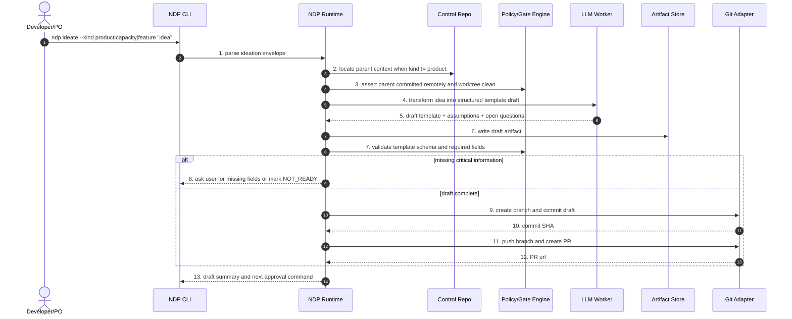

Etapas:

1. **Parse do envelope de ideation.** Identifica se a ideia vira product, capacity ou feature.
2. **Localização de contexto pai.** Capacity precisa de product; feature precisa de capacity.
3. **Gate de predecessor remoto.** Bloqueia se o pai não está aprovado, commitado e sincronizado.
4. **Transformação da ideia.** LLM converte texto livre em template estruturado.
5. **Retorno de assumptions.** O draft explicita hipóteses e perguntas abertas.
6. **Persistência do draft.** Escreve o artefato no control repo.
7. **Validação de schema.** Confere campos obrigatórios.
8. **Tratamento de lacunas.** Se faltar informação crítica, pede complemento ou marca `NOT_READY`.
9. **Commit do draft.** Cria branch e commit transacional.
10. **SHA do commit.** Registra checkpoint local.
11. **Push e PR.** Envia para GitHub para revisão.
12. **URL do PR.** Registra evidência remota.
13. **Resumo para próximo passo.** Mostra comando de aprovação ou ajustes.

#### 3.5.6. Sequência — Product planning e propostas de Capacity

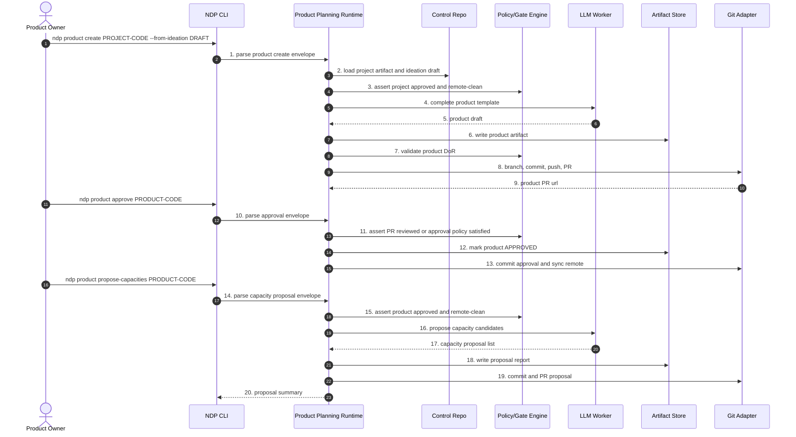

Etapas:

1. **Criação de product.** Inicia a partir de project e ideation.
2. **Carga do project.** Lê o contexto pai e o draft de ideia.
3. **Gate de project remoto.** Garante que o project é checkpoint aprovado.
4. **Completar template.** LLM transforma draft em product template completo.
5. **Product draft.** Retorna visão, público, objetivos, métricas e restrições.
6. **Persistência do product.** Grava `product-*.md`.
7. **Definition of Ready do product.** Valida campos mínimos.
8. **Versionamento.** Cria branch, commit, push e PR.
9. **PR do product.** Retorna URL para revisão.
10. **Aprovação.** Usuário inicia aprovação formal.
11. **Gate de aprovação.** Confirma review ou política de aprovação.
12. **Marcação APPROVED.** Atualiza status do product.
13. **Commit da aprovação.** Sincroniza checkpoint remoto.
14. **Proposta de capacidades.** Solicita capacidades derivadas do product.
15. **Gate de product aprovado.** Só propõe capacity se product está remoto e limpo.
16. **Geração de candidates.** LLM propõe capacidades coerentes.
17. **Lista de propostas.** Retorna candidatos com justificativa.
18. **Relatório de propostas.** Persiste material para seleção.
19. **Commit/PR das propostas.** Versiona o output.
20. **Resumo.** Mostra quais capacities podem ser criadas.

#### 3.5.7. Sequência — Capacity e Feature planning

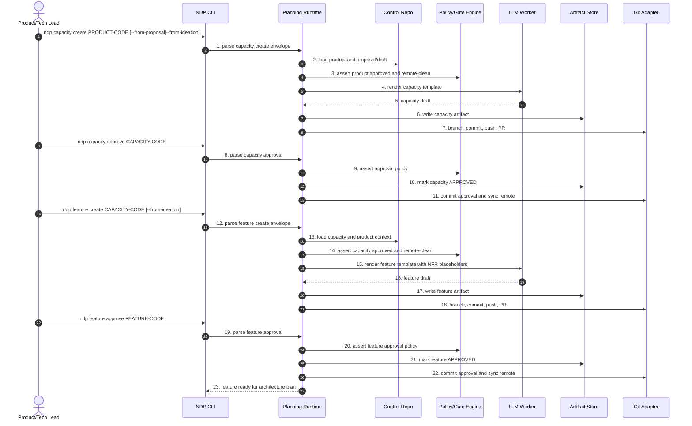

Etapas:

1. **Criação de capacity.** Começa a partir de product aprovado.
2. **Carga de contexto.** Lê product e proposta/draft.
3. **Gate do product.** Bloqueia se product não está remoto e limpo.
4. **Renderização da capacity.** LLM estrutura capacidade.
5. **Capacity draft.** Retorna escopo, domínio e dependências.
6. **Persistência da capacity.** Grava `capacity-*.md`.
7. **Versionamento da capacity.** Cria branch, commit, push e PR.
8. **Aprovação da capacity.** Inicia approval.
9. **Gate de aprovação.** Valida review e campos obrigatórios.
10. **Status APPROVED.** Atualiza artefato.
11. **Checkpoint remoto.** Commit e sync da aprovação.
12. **Criação de feature.** Começa a partir de capacity aprovada.
13. **Carga de product/capacity.** Feature herda contexto dos pais.
14. **Gate da capacity.** Bloqueia se capacity não está remota e limpa.
15. **Renderização da feature.** LLM cria feature com placeholders de NFR.
16. **Feature draft.** Retorna escopo, valor, métricas e perguntas.
17. **Persistência da feature.** Grava `feature-*.md`.
18. **Versionamento da feature.** Cria branch, commit, push e PR.
19. **Aprovação da feature.** Inicia approval.
20. **Gate de aprovação da feature.** Confirma readiness.
21. **Status APPROVED.** Atualiza feature.
22. **Checkpoint remoto.** Sincroniza aprovação.
23. **Liberação para arquitetura.** Feature pode entrar em `ndp architecture plan`.

#### 3.5.8. Sequência — `ndp architecture plan <FEATURE-CODE>`

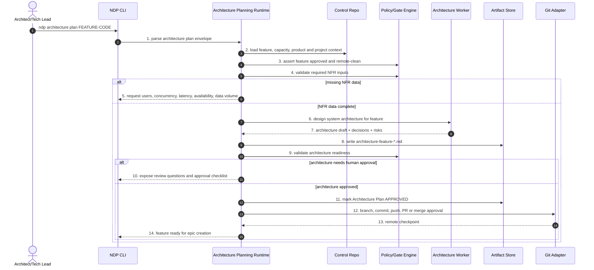

Etapas:

1. **Parse do architecture plan.** Identifica feature e flags.
2. **Carga de contexto completo.** Lê feature, capacity, product e project.
3. **Gate da feature.** Exige feature aprovada, remota e worktree limpa.
4. **Validação de NFRs.** Confere usuários, simultaneidade, latência, disponibilidade, dados, segurança.
5. **Perguntas obrigatórias.** Se faltar dado, solicita antes de desenhar arquitetura.
6. **Desenho sistêmico.** LLM/worker propõe arquitetura da feature.
7. **Draft arquitetural.** Retorna componentes, serviços, dados, segurança, riscos e decisões.
8. **Persistência do plano.** Grava `architecture-feature-*.md`.
9. **Architecture readiness gate.** Valida completude e coerência.
10. **Review humano quando necessário.** Expõe decisões críticas.
11. **Aprovação do plano.** Marca architecture plan como aprovado.
12. **Versionamento.** Commit, push, PR ou merge conforme política.
13. **Checkpoint remoto.** Registra SHA remoto aprovado.
14. **Liberação para epic.** Feature pode gerar épico/stories.

#### 3.5.9. Sequência — `ndp epic create <FEATURE-CODE>`

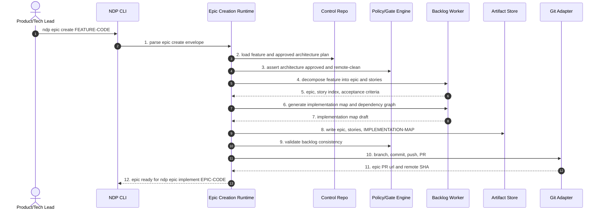

Etapas:

1. **Parse do epic create.** Identifica a feature fonte.
2. **Carga de feature e arquitetura.** Lê o plano arquitetural aprovado.
3. **Gate de arquitetura.** Bloqueia se arquitetura não está aprovada e remota.
4. **Decomposição em backlog.** LLM gera épico e stories.
5. **Draft de épico/stories.** Retorna escopo, ACs, índice e dependências.
6. **Mapa de implementação.** Gera DAG e fases.
7. **Draft do mapa.** Retorna critical path e paralelismo.
8. **Persistência do backlog.** Grava epic, stories e `IMPLEMENTATION-MAP.md`.
9. **Validação de consistência.** Confere IDs, dependências, DoR e links para arquitetura.
10. **Versionamento do épico.** Cria branch, commit, push e PR.
11. **Checkpoint remoto.** Registra SHA/PR do épico.
12. **Liberação para implementação.** Agora `ndp epic implement EPIC-CODE` pode rodar.

#### 3.5.10. Implicações para a cadeia completa

- `ndp epic implement` deixa de ser o começo do processo; ele vira o começo da **implementação**.
- O começo do produto é `ndp ideate` ou `ndp product create`.
- Product, Capacity e Feature têm lifecycle próprio: draft, review, approved, remote checkpoint.
- Architecture Plan é obrigatório entre Feature e Epic.
- Epic deve carregar link explícito para `FEATURE-CODE` e para `architecture-feature-*.md`.
- Todo command que cria artefato estratégico precisa branch/commit/PR como os commands de implementação.
- O control repo é tão importante quanto o repositório de código, porque ele guarda o histórico de decisões do produto.

### 3.6. Blueprint de sequência dos comandos de implementação

Os comandos são o ponto de entrada do produto. Por isso, a forma mais clara de entender o NDP é partir do comando mais amplo e expandir as delegações. O fluxo raiz é `ndp epic implement`: ele coordena épico, histórias, tasks, PRs, reviews, gates, evidências e telemetria. Sempre que uma chamada delega para outro orquestrador e o diagrama ficaria ilegível, o detalhe aparece no diagrama seguinte.

Regra de leitura:

- `NDP Runtime` substitui a skill markdown atual como dono da state machine.
- `Policy/Gate Engine` substitui phase gates, hooks preventivos e audit checks locais.
- `Artifact Store` representa `ai/epics/*`, `ai/releases/*`, `ai/runs/*`, PR body e state local.
- `LLM Worker` só aparece quando há geração criativa ou julgamento.
- `Adapters` representam git, build, test, docs, security, GitHub/PR e CI.

Convenção de numeração: a linha em que o usuário ou comando pai invoca o command é o **gatilho**. A etapa `1` começa na primeira ação interna do NDP depois desse gatilho. Quando uma etapa chama outro comando orquestrador, o detalhe aparece no diagrama próprio desse comando.

#### 3.6.1. `ndp epic implement <EPIC-CODE>` — sequência raiz

Este é o fluxo equivalente ao `x-epic-implement`, agora ajustado para receber o **código do épico** e buscar o Architecture Plan aprovado da feature vinculada. Ele preserva as seis fases atuais: args, plano, branch, loop de stories, gate de integridade e PR final.

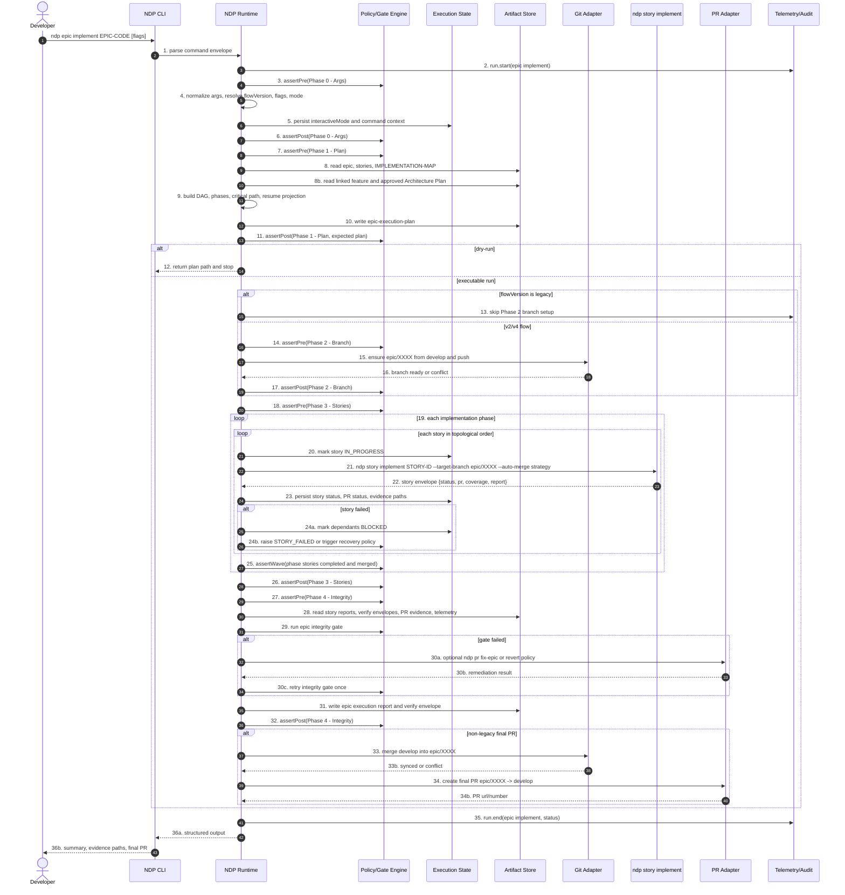

Etapas:

1. **Parse do command envelope.** A CLI transforma `ndp epic implement EPIC-CODE [flags]` em um envelope tipado com epic code, feature vinculada, flags, modo de execução e destino esperado.
2. **Início de telemetria.** O runtime registra `run.start` para que toda a execução tenha correlação, duração e status final.
3. **Gate pré-args.** O runtime verifica se pode iniciar a fase de argumentos: ambiente válido, estado legível e nenhuma fase anterior pendente.
4. **Normalização de argumentos.** Flags legadas, `--resume`, `--parallel`, `--dry-run`, `flowVersion`, estratégia de merge e modo interativo são resolvidos em um contrato único.
5. **Persistência de contexto.** O runtime salva `interactiveMode` e metadados do comando em `execution-state.json`, permitindo resume e diagnósticos posteriores.
6. **Gate pós-args.** Confirma que a fase de argumentos produziu estado suficiente para continuar.
7. **Gate pré-planejamento.** Antes de ler backlog e mapas, valida que a fase de args passou e que o épico é elegível.
8. **Leitura de backlog.** Carrega épico, stories e `IMPLEMENTATION-MAP.md`; aqui aparecem gaps de arquivo ausente, story órfã ou mapa divergente.
8b. **Leitura da arquitetura da feature.** Carrega o vínculo `EPIC-CODE -> FEATURE-CODE -> architecture-feature-*.md`; se o plano arquitetural não existir, não estiver aprovado ou não estiver sincronizado no remote, a implementação do épico é bloqueada.
9. **Construção do plano de execução.** Calcula DAG, fases, critical path, projeção de resume e quais stories devem rodar.
10. **Persistência do plano.** Escreve `epic-execution-plan` para virar evidência humana e input de replay.
11. **Gate pós-planejamento.** Confirma que o plano existe, é consistente e não contém ciclos ou dependências quebradas.
12. **Saída antecipada em dry-run.** Se `--dry-run` foi usado, o comando termina aqui com o caminho do plano, sem criar branch nem executar stories.
13. **Decisão de branch por flowVersion.** Fluxos legados pulam branch de épico; fluxos novos seguem para `epic/XXXX`.
14. **Gate pré-branch.** Valida que é permitido criar/sincronizar branch antes de tocar Git remoto.
15. **Garantia da branch de épico.** Cria ou atualiza `epic/XXXX` a partir de `develop` e faz push quando aplicável.
16. **Resultado do Git.** O Git Adapter retorna branch pronta ou conflito operacional.
17. **Gate pós-branch.** Confirma que a branch de épico está pronta antes de executar stories.
18. **Gate pré-loop de stories.** Abre a fase principal de execução e garante que o plano e a branch estão válidos.
19. **Iteração por fase de implementação.** O runtime percorre fases do DAG; dentro de cada fase, respeita ordem topológica ou paralelismo permitido.
20. **Marcação da story como em progresso.** Atualiza estado antes de chamar a story, criando checkpoint recuperável.
21. **Delegação para `ndp story implement`.** Chama o command de story com target branch, estratégia de auto-merge e flags propagadas. O detalhe está no diagrama 3.6.2.
22. **Recebimento do envelope da story.** Recebe status, PR, coverage, report e paths de evidência.
23. **Persistência do resultado da story.** Atualiza `execution-state.json` com status, PR, merge status e artefatos produzidos.
24. **Tratamento de falha da story.** Se falhou, marca dependentes como `BLOCKED` e decide entre abortar, recovery ou política de revert.
25. **Gate de wave/fase.** Ao fim de cada fase do DAG, valida que todas as stories esperadas concluíram e foram integradas.
26. **Gate pós-loop de stories.** Fecha a fase de execução de stories quando todas as waves elegíveis terminam.
27. **Gate pré-integridade do épico.** Garante que todas as evidências por story existem antes do gate agregado.
28. **Leitura de evidências.** Carrega reports, verify envelopes, PR evidence e telemetria.
29. **Execução do gate de integridade.** Avalia se o épico está consistente para integração final.
30. **Remediação de gate falho.** Se necessário, chama `ndp pr fix-epic` ou aplica política de revert, depois tenta o gate uma vez.
31. **Persistência do relatório do épico.** Escreve relatório final e envelope de verificação do épico.
32. **Gate pós-integridade.** Confirma que o épico tem evidência agregada suficiente.
33. **Sincronização com `develop`.** Em fluxo não legado, mescla `develop` na branch `epic/XXXX` para reduzir conflito no PR final.
34. **Criação do PR final.** Abre PR `epic/XXXX -> develop` com evidências do épico.
35. **Fim de telemetria.** Registra `run.end` com status final e métricas.
36. **Saída estruturada.** Retorna para CLI e usuário um resumo com status, paths de evidência e PR final.

#### 3.6.2. `ndp story implement <STORY-ID>` — ciclo de story

Este diagrama expande a chamada feita no loop do épico. Ele corresponde ao `x-story-implement`: prepara contexto, cria/valida contratos, planeja, executa tasks, cria PRs, valida, roda docs/reviews e escreve relatório final.

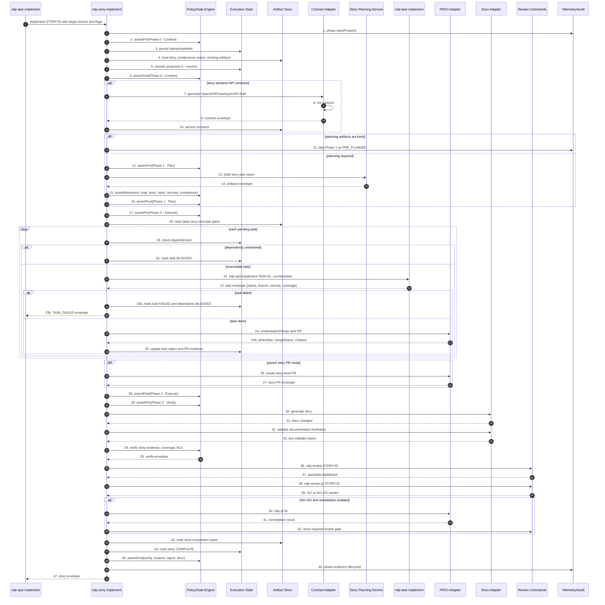

Etapas:

1. **Início da fase de preparo.** A story recebe o envelope do épico ou da CLI e abre telemetria própria.
2. **Gate pré-contexto.** Valida que a story pode iniciar: refinement, predecessores, worktree e estado básico.
3. **Persistência do modo interativo.** Salva a forma de interação para recovery, prompts e auditoria.
4. **Carga da story e evidências existentes.** Lê story, status de predecessores e artefatos já gerados.
5. **Projeção de resume.** Se `--resume`, calcula tasks concluídas, pendentes e warnings de staleness.
6. **Gate pós-contexto.** Confirma que há contexto suficiente para planejar ou executar.
7. **Geração condicional de contratos.** Se a story declara REST, gRPC, events ou websocket, gera contrato API-first.
8. **Lint de contrato.** Valida que o contrato gerado é sintaticamente e semanticamente aceitável.
9. **Envelope de contrato.** Retorna status, arquivos e eventuais warnings.
10. **Persistência de contratos.** Grava OpenAPI/Proto/AsyncAPI para implementação e review.
11. **Decisão de reuso de planejamento.** Se os artefatos estão frescos, a Phase 1 é pulada como `PRE_PLANNED`.
12. **Gate pré-plano.** Se planejamento é necessário, abre a fase de plano.
13. **Build do story planning wave.** Chama o serviço detalhado no diagrama 3.6.3.
14. **Recebimento de artefatos de planejamento.** Recebe paths e status de arch, impl, tests, tasks, security e compliance.
15. **Gate de wave de planejamento.** Confirma que todos os artefatos obrigatórios existem.
16. **Gate pós-plano.** Fecha planejamento e libera execução.
17. **Gate pré-execução.** Garante que tasks e dependências estão prontas para execução.
18. **Leitura das tasks.** Carrega `tasks-story-*` e planos por task.
19. **Checagem de dependências por task.** Antes de executar, valida se a task está desbloqueada.
20. **Bloqueio de task dependente.** Se faltar dependência, marca `BLOCKED` e segue política de propagação.
21. **Delegação para `ndp task implement`.** Executa a task via loop TDD detalhado no diagrama 3.6.4.
22. **Recebimento do envelope da task.** Recebe status, branch, commit e coverage.
23. **Tratamento de task falha.** Marca falha, bloqueia dependentes e retorna `TASK_FAILED` ao épico quando necessário.
24. **Criação/watch/merge do PR da task.** Se a task passou, chama o subdomínio PR/CI detalhado no diagrama 3.6.5.
25. **Persistência do status da task.** Salva PR, CI, merge status e evidências.
26. **PR de story opcional.** Em modo parent-story branch, cria PR agregado da story.
27. **Envelope do PR de story.** Recebe número, URL e status do PR agregado.
28. **Gate pós-execução.** Confirma que as tasks esperadas estão concluídas, bloqueadas ou falharam de forma explícita.
29. **Gate pré-verificação.** Abre a fase final de verify/report.
30. **Geração de documentação.** Atualiza docs exigidos pela story.
31. **Resultado da geração de docs.** Retorna arquivos alterados ou no-op.
32. **Validação de documentation freshness.** Confere se README/API/ADR/system docs estão coerentes com o diff.
33. **Relatório de documentação.** Produz `doc-validate-report`.
34. **Verify gate da story.** Valida evidência, coverage e critérios de aceite.
35. **Verify envelope.** Persiste resultado estruturado do gate.
36. **Review especialista.** Chama `ndp review`, detalhado no diagrama 3.6.6.
37. **Dashboard especialista.** Recebe achados e scores consolidados.
38. **Review Tech Lead.** Chama `ndp review pr`, também detalhado no diagrama 3.6.6.
39. **Veredito GO/NO-GO.** Recebe decisão final de qualidade.
40. **Remediação automática.** Em NO-GO remediável, chama `ndp pr fix`.
41. **Resultado da remediação.** Recebe patch/commit/status da correção.
42. **Revisão focada pós-remediação.** Roda novamente o gate necessário.
43. **Relatório de conclusão da story.** Escreve `story-completion-report`.
44. **Finalização de estado.** Marca story como `COMPLETE`.
45. **Gate final da story.** Confirma verify, reviews, report e docs.
46. **Fim de telemetria.** Fecha o ciclo da story.
47. **Envelope para o épico.** Retorna status e evidências para o command pai.

#### 3.6.3. Story planning wave — workers paralelos

Este diagrama detalha o subfluxo de planejamento (`x-internal-story-build-plan`). Ele é separado porque tem fan-out/fan-in e vários artefatos de Fase 1.

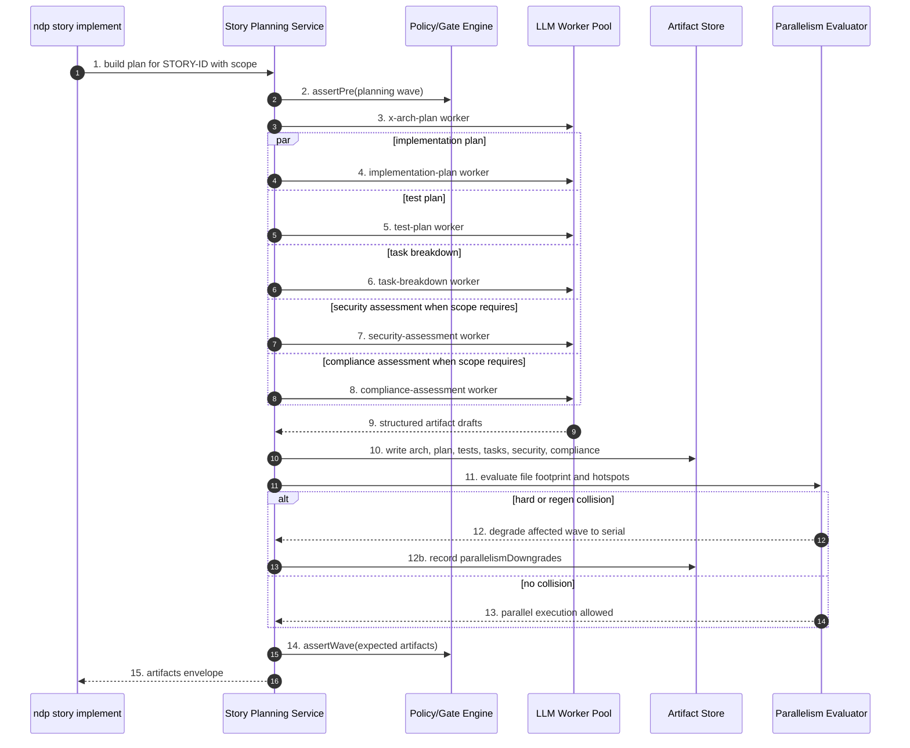

Etapas:

1. **Entrada do planejamento.** A story solicita o plano com story ID, escopo e contexto.
2. **Gate pré-wave.** Confirma que o planejamento pode iniciar e que não há artefatos obrigatórios corrompidos.
3. **Worker de arquitetura.** Chama LLM para gerar plano arquitetural.
4. **Worker de implementação.** Em paralelo, gera plano técnico de implementação.
5. **Worker de testes.** Em paralelo, gera plano TDD/TPP e cenários.
6. **Worker de decomposição.** Em paralelo, quebra a story em tasks.
7. **Worker de segurança.** Quando o escopo exige, gera avaliação de segurança.
8. **Worker de compliance.** Quando o perfil exige, gera avaliação regulatória.
9. **Coleta dos drafts.** O serviço recebe todos os outputs estruturados.
10. **Persistência dos artefatos.** Escreve planos, tasks, security e compliance em `plans/`.
11. **Avaliação de footprint.** Analisa arquivos que cada task pretende tocar para prever colisões.
12. **Degradação por colisão.** Se houver conflito hard/regen, registra que a wave deve rodar serialmente.
13. **Confirmação de paralelismo.** Se não houver colisão, preserva execução paralela permitida.
14. **Gate de artefatos esperados.** Valida que todos os outputs obrigatórios existem.
15. **Envelope para story.** Retorna paths e status para `ndp story implement`.

#### 3.6.4. `ndp task implement <TASK-ID>` — TDD inner loop

Este diagrama expande o menor orquestrador de implementação. Ele mantém o Double-Loop TDD em código: o runtime decide ciclo, valida RED/GREEN/REFACTOR e chama LLM apenas para gerar teste/código quando necessário.

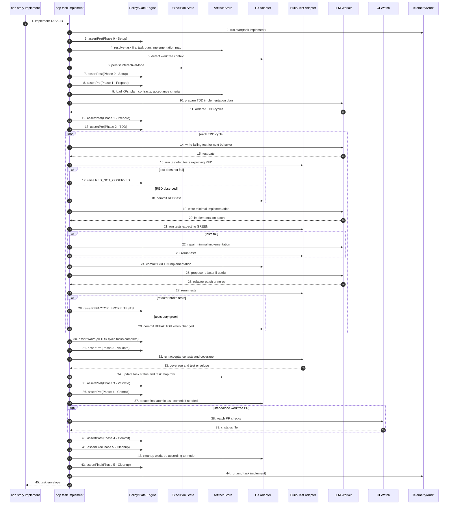

Etapas:

1. **Entrada da task.** A story chama a task com ID, target branch e flags orquestradas.
2. **Início de telemetria da task.** Abre run/span específico para medir o ciclo TDD.
3. **Gate pré-setup.** Valida se a task pode ser carregada.
4. **Resolução de artefatos.** Lê task file, task plan e task implementation map.
5. **Detecção de worktree.** Decide entre reutilizar, criar ou operar em modo legado.
6. **Persistência do modo interativo.** Salva estado para recovery e auditoria.
7. **Gate pós-setup.** Confirma que setup está consistente.
8. **Gate pré-prepare.** Abre fase de entendimento.
9. **Carga de contexto.** Lê KPs, plano, contratos e acceptance criteria.
10. **Preparação do plano TDD.** Chama LLM para ordenar ciclos e estratégia mínima.
11. **Retorno dos ciclos.** Recebe lista ordenada de comportamentos/testes.
12. **Gate pós-prepare.** Fecha preparação.
13. **Gate pré-TDD.** Abre o loop principal.
14. **Geração do teste falho.** LLM escreve o próximo teste esperado.
15. **Patch do teste.** Retorna alteração de teste.
16. **Execução esperando RED.** Build/Test Adapter roda teste alvo e espera falha.
17. **Erro se não houve RED.** Se o teste passa ou não executa, levanta `RED_NOT_OBSERVED`.
18. **Commit RED.** Se falhou corretamente, grava commit do teste.
19. **Geração da implementação mínima.** LLM escreve o menor código para passar.
20. **Patch da implementação.** Retorna alteração de produção.
21. **Execução esperando GREEN.** Testes rodam esperando sucesso.
22. **Reparo de implementação.** Se falhar, LLM tenta correção mínima.
23. **Rerun dos testes.** Confirma se o reparo ficou verde.
24. **Commit GREEN.** Grava implementação mínima.
25. **Proposta de refactor.** LLM sugere refactor ou no-op.
26. **Patch de refactor.** Retorna alteração ou nada.
27. **Rerun pós-refactor.** Testes rodam para garantir comportamento preservado.
28. **Erro se refactor quebrou.** Levanta `REFACTOR_BROKE_TESTS`.
29. **Commit REFACTOR.** Grava refactor quando houve mudança segura.
30. **Gate da wave TDD.** Confirma que todos os ciclos planejados foram concluídos.
31. **Gate pré-validação.** Abre validação final.
32. **Acceptance e coverage.** Roda testes de aceite e cobertura.
33. **Envelope de testes.** Recebe resultados e percentuais.
34. **Atualização de status da task.** Marca arquivo/mapa como concluído.
35. **Gate pós-validação.** Confirma que critérios foram provados.
36. **Gate pré-commit final.** Abre fase de commit/CI.
37. **Commit atômico final.** Cria commit consolidado se necessário.
38. **CI-watch condicional.** Em modo PR/worktree, acompanha checks remotos.
39. **Arquivo de status CI.** Persiste resultado do watch.
40. **Gate pós-commit.** Fecha fase de commit.
41. **Gate pré-cleanup.** Abre cleanup.
42. **Limpeza de worktree.** Remove ou preserva worktree conforme modo e status.
43. **Gate final da task.** Confirma fechamento completo.
44. **Fim de telemetria.** Registra duração e status.
45. **Envelope para story.** Retorna status, commit, coverage e branch.

#### 3.6.5. PR, CI-watch e auto-merge

Este diagrama detalha o fluxo que hoje é repartido entre `x-pr-create`, `x-pr-watch-ci`, `x-pr-merge` e renderização de PR body.

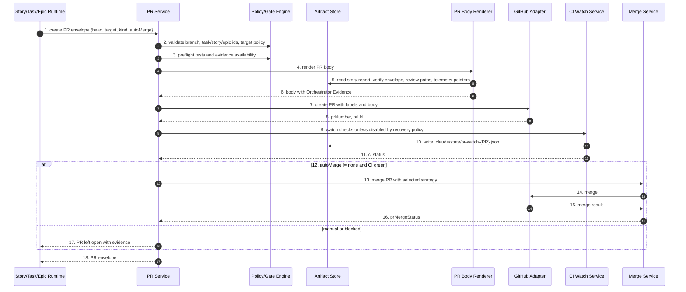

Etapas:

1. **Entrada do PR envelope.** O caller informa head, target, tipo de PR, auto-merge e contexto de task/story/epic.
2. **Validação de identidade e branch.** Confere padrões de branch, IDs, target branch e labels esperados.
3. **Preflight de testes/evidência.** Garante que o PR não será criado sem estado local consistente.
4. **Renderização do PR body.** Chama renderer para montar corpo padronizado.
5. **Leitura de evidências.** Renderer coleta report, verify envelope, review paths e telemetry pointers.
6. **Body com Orchestrator Evidence.** Retorna markdown com evidência rastreável.
7. **Criação do PR.** GitHub Adapter abre PR com labels, título e body.
8. **Envelope básico do PR.** Retorna número e URL.
9. **CI-watch.** Acompanha checks, salvo quando recovery policy permite pular.
10. **Persistência do watch.** Escreve `.claude/state/pr-watch-{PR}.json` ou equivalente NDP.
11. **Resultado do CI.** Retorna status dos checks.
12. **Decisão de auto-merge.** Se auto-merge está habilitado e CI está verde, segue para merge.
13. **Merge com estratégia selecionada.** Aplica merge/squash/rebase conforme política.
14. **Chamada ao GitHub para merge.** Executa operação remota.
15. **Resultado do merge.** Recebe sucesso ou falha.
16. **Status de merge no envelope.** Retorna `prMergeStatus`.
17. **PR manual/bloqueado.** Se não pode auto-merge, retorna PR aberto com evidências.
18. **Envelope final para caller.** Devolve URL, número, CI e merge status.

#### 3.6.6. Review gates — especialistas e Tech Lead

Este diagrama detalha as chamadas `ndp review` e `ndp review pr`, acionadas dentro de `story implement` e também úteis como comandos públicos.

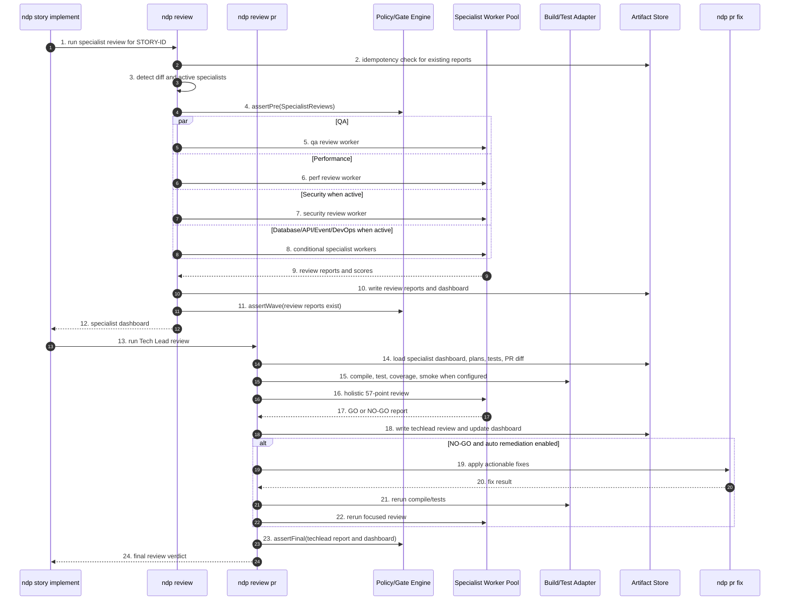

Etapas:

1. **Entrada do review especialista.** Story solicita review para a story/branch.
2. **Idempotency check.** Verifica se reports existentes ainda são válidos.
3. **Detecção de diff e especialistas ativos.** Decide quais reviewers são necessários com base no perfil e arquivos alterados.
4. **Gate pré-review.** Valida que há diff e contexto suficiente.
5. **Worker QA.** Roda review de qualidade/testes.
6. **Worker Performance.** Roda review de performance.
7. **Worker Security condicional.** Roda review de segurança quando aplicável.
8. **Workers condicionais adicionais.** Roda database, API, events, DevOps e outros quando o stack exige.
9. **Coleta de reports.** Recebe achados e scores dos especialistas.
10. **Persistência de reports e dashboard.** Grava relatórios individuais e consolidação.
11. **Gate de wave dos reviews.** Confirma que todos os reports ativos existem.
12. **Dashboard para story.** Retorna síntese de especialistas.
13. **Entrada do Tech Lead review.** Story solicita veredito holístico.
14. **Carga de contexto TL.** Lê dashboard, planos, testes e diff/PR.
15. **Build/test/coverage/smoke.** Executa validações determinísticas antes do julgamento.
16. **Review holístico.** LLM aplica rubrica Tech Lead.
17. **Report GO/NO-GO.** Retorna decisão e achados.
18. **Persistência do Tech Lead report.** Atualiza dashboard com score final.
19. **Remediação condicional.** Em NO-GO remediável, chama `ndp pr fix`.
20. **Resultado da correção.** Recebe patch/status.
21. **Revalidação determinística.** Roda compile/test novamente após correção.
22. **Review focado pós-fix.** Reavalia achados afetados.
23. **Gate final de review.** Confirma report TL e dashboard.
24. **Veredito final para story.** Retorna GO/NO-GO para o lifecycle.

#### 3.6.7. Implicação para o design do runtime

Esses diagramas revelam a estrutura real do produto:

- `ndp epic implement` é um **composite command** que não deve conter lógica de story/task/review inline; ele coordena envelopes e policies.
- `ndp story implement` é o principal command de delivery: ele integra planejamento, task loop, docs, verify, review e report.
- `ndp task implement` é o inner loop TDD, onde a maior parte da criação de código acontece.
- PR/CI/review são subdomínios reutilizáveis, não detalhes acidentais de story.
- Cada seta que escreve em disco deve produzir um `artifact_kind` tipado.
- Cada `alt` de erro/recovery deve virar exceção tipada, política de retry ou estado persistido.

---

## 4. Inventário Canônico de Ativos Atuais e Destino NDP

Esta é a seção de preservação de contexto. Ela evita duplicação separando a pergunta em camadas:

- **Skills/comandos/workers:** quem executa ou gera algo?
- **Rules/policies:** quais invariantes precisam sobreviver?
- **KPs:** qual conhecimento alimenta workers?
- **Hooks/scripts:** quais invariantes shell precisam virar runtime?
- **Templates:** quais estruturas renderizam artefatos?
- **Artefatos:** o que aparece em disco e quem consome?

### 4.1. Skills e comandos atuais, classificados uma única vez

#### 4.1.1. Orquestradoras públicas — viram comandos NDP

Estas skills controlam fluxo amplo. No NDP elas devem sair de markdown interpretado e virar comandos CLI com state machine, persistência, gates, telemetria, retries e saída estruturada.

| Skill atual | Destino NDP V0 | Motivo |
| --- | --- | --- |
| `x-epic-implement` | `ndp epic implement <ID>` | Implementação de épico em fases, waves, gates e PRs. |
| `x-story-implement` | `ndp story implement <ID>` | Lifecycle end-to-end de story: planning, task execution, PR, review, verify, report. |
| `x-task-implement` | `ndp task implement <ID>` | TDD double-loop, validações, commits e PR/task. |
| `x-release` | `ndp release [--patch\|--minor\|--major]` | Versionamento, changelog, release branch, tag e back-merge. |
| `x-epic-orchestrate` | `ndp epic orchestrate <ID>` | Planejamento multi-story com checkpoints e resume. |
| `x-pr-merge-train` | `ndp merge-train` | Ordenação topológica de PRs, waves, CI e merge. |
| `x-review` | `ndp review <STORY>` | Fan-out/fan-in de especialistas e consolidação. |
| `x-review-pr` | `ndp review pr <PR>` | Veredito Tech Lead GO/NO-GO. |
| `x-story-refine` | `ndp story refine <ID>` | Refinement multi-persona com verdict persistido. |
| `x-epic-refine` | `ndp epic refine <ID>` | Refinement estratégico de épico. |
| `x-story-plan` | `ndp story plan <ID>` | Planning wave, task breakdown, task plans e DoR. |
| `x-feature-create` | `ndp feature create <SPEC>` | Spec → epic → stories → implementation map → PR. |
| `x-feature-ideate` | `ndp feature ideate` | Ideia livre → spec/backlog estruturado. |
| `x-test-tdd` | `ndp test tdd <TASK>` | Orquestra ciclos Red/Green/Refactor; LLM atua pontualmente. |

#### 4.1.2. Orquestradoras auxiliares — comando público, subcomando avançado ou serviço

Estas coordenam fluxo suficiente para não serem leaf prompts. A visibilidade pública deve ser decidida por UX, não por necessidade do LLM.

| Skill auxiliar | Destino provável |
| --- | --- |
| `x-code-audit` | `ndp code audit` ou parte de `ndp ci verify`. |
| `x-lib-audit-rules` | Serviço interno / `ndp lint policy`. |
| `x-doc-generate` | `ndp doc generate` e fase interna de story/release. |
| `x-template-migrate` | `ndp template migrate`. |
| `x-pr-create` | `ndp pr create` e serviço interno de PR. |
| `x-pr-fix` | `ndp pr fix <PR>`. |
| `x-pr-fix-epic` | `ndp pr fix --epic <EPIC>`. |
| `x-pr-watch-ci` | `ndp pr watch <PR>` com exit codes tipados. |
| `x-pr-merge` | `ndp pr merge` ou serviço interno usado por merge-train/release. |
| `x-git-push`, `x-git-commit`, `x-git-worktree`, `x-git-cleanup-branches` | Subcomandos `ndp git ...` e serviços transacionais internos. |
| `x-status-reconcile` | `ndp status reconcile` para recovery/admin. |
| `x-ci-generate` | `ndp ci generate`. |
| `x-setup-env` | `ndp setup env` ou `ndp doctor`. |
| `x-perf-profile` | `ndp perf profile`. |
| `x-ops-troubleshoot` | `ndp troubleshoot` ou worker acionado por falhas. |
| `x-ops-incident` | Comando opcional; provável V1+ ou plugin ops. |
| `x-jira-create-epic`, `x-jira-create-stories` | Plugins `ndp jira ...`, fora do core offline. |
| `x-adr-generate` | `ndp adr generate` e fase interna de arquitetura. |
| `x-owasp-scan`, `x-security-dashboard`, `x-security-pentest` | `ndp security ...`, alguns condicionais por capability/permissão. |

#### 4.1.3. Serviços internos — viram código testável

Estas skills existem hoje porque o LLM precisava chamar componentes internos por nome. No NDP, elas viram classes, serviços ou funções.

| Grupo interno | Skills atuais | Forma em NDP |
| --- | --- | --- |
| Gates | `x-internal-phase-gate`, `x-internal-story-verify`, `x-internal-epic-integrity-gate` | `PhaseGateService`, `StoryVerifyService`, `EpicIntegrityGate`. |
| Estado e contexto | `x-internal-status-update`, `x-internal-story-resume`, `x-internal-story-load-context`, `x-internal-args-normalize` | Repositório de estado, loader de contexto, parser tipado de args. |
| Planejamento | `x-internal-story-build-plan`, `x-internal-epic-build-plan`, `x-lib-task-decomposer` | Builders e dispatchers internos de workers. |
| Renderização | `x-internal-report-write`, `x-internal-pr-body-render`, `x-internal-story-report` | Renderers tipados com templates versionados. |
| Git/precheck | `x-internal-epic-branch-ensure`, `x-internal-worktree-precheck`, `x-lib-group-verifier` | Serviços de branch, worktree, locks e wave verification. |
| Criação interna | `x-internal-epic-create`, `x-internal-story-create`, `x-internal-epic-map` | Factories/renderers de backlog e mapa. |

#### 4.1.4. Skills puras — permanecem isoladas como workers, adapters ou comandos utilitários

Estas já têm uma responsabilidade dominante. O NDP deve portá-las sem inflar escopo. Elas não devem ganhar state machine própria nem coordenar lifecycle amplo.

| Grupo | Skills puras | Destino NDP |
| --- | --- | --- |
| `conditional/dev` | `x-setup-stack` | Adapter/comando de setup stack-specific. |
| `conditional/ops` | `x-obs-instrument` | Worker/adapter de instrumentação. |
| `conditional/review` | `x-review-api`, `x-review-compliance`, `x-review-data-modeling`, `x-review-db`, `x-review-devops`, `x-review-events`, `x-review-gateway`, `x-review-graphql`, `x-review-grpc`, `x-review-obs`, `x-review-security` | Workers especialistas que consomem KPs/policies. |
| `conditional/security` | `x-security-container`, `x-security-dast`, `x-security-infra`, `x-security-sast`, `x-security-secrets`, `x-security-sonar` | Security adapters/workers por superfície. |
| `conditional/test` | `x-test-contract-lint`, `x-test-contract`, `x-test-e2e`, `x-test-perf`, `x-test-smoke-api`, `x-test-smoke-socket` | Test adapters por categoria. |
| `core/code` | `x-code-format`, `x-code-lint` | Adapters determinísticos de format/lint. |
| `core/dev` | `helidon-scaffold`, `micronaut-scaffold`, `picocli-command`, `quarkus-resource`, `spring-controller` | Templates stack-specific + render command. |
| `core/dev` | `x-ci-generate`, `x-mcp-recommend`, `x-setup-env`, `x-spec-drift` | CI renderer, advisor command, setup/doctor, drift report. |
| `core/git` | `x-git-branch`, `x-git-cleanup-branches`, `x-git-commit`, `x-git-merge`, `x-git-push`, `x-git-worktree`, `x-planning-commit` | Git adapters transacionais. |
| `core/jira` | `x-jira-create-epic`, `x-jira-create-stories` | Plugins Jira. |
| `core/lib` | `x-lib-group-verifier`, `x-lib-task-decomposer` | Serviços internos reutilizáveis. |
| `core/ops` | `x-doc-generate`, `x-doc-validate`, `x-ops-incident`, `x-ops-troubleshoot`, `x-perf-profile`, `x-release-changelog`, `x-status-reconcile`, `x-telemetry-analyze`, `x-telemetry-trend` | Docs, ops, profiling, changelog, telemetry commands. |
| `core/plan` | `planning-standards-kp`, `x-adr-generate`, `x-arch-plan`, `x-arch-system-update`, `x-arch-update`, `x-parallel-eval`, `x-task-plan`, `x-template-migrate`, `x-threat-model` | KP, worker prompts, docs updates, validators e planners. |
| `core/pr` | `x-pr-create`, `x-pr-fix`, `x-pr-merge`, `x-pr-watch-ci` | PR commands/services. |
| `core/review` | `x-review-perf`, `x-review-pr`, `x-review-qa` | Review workers/commands. |
| `core/security` | `x-dependency-audit`, `x-hardening-eval`, `x-owasp-scan`, `x-runtime-eval`, `x-security-dashboard`, `x-security-pipeline`, `x-supply-chain-audit` | Security commands/adapters. |
| `core/test` | `x-test-plan`, `x-test-run` | Test plan worker + test runner adapter. |

#### 4.1.5. Skills candidatas a virar KP, policy ou template

| Ativo atual | Tipo-alvo provável | Justificativa |
| --- | --- | --- |
| `planning-standards-kp` | `knowledge-pack` | Já é uma fonte RA9; deve sair do catálogo de comandos. |
| `x-mcp-recommend` | KP + advisor command | O catálogo de MCPs é conhecimento; o comando só aplica matching. |
| Scaffolds (`spring-controller`, `quarkus-resource`, etc.) | `template` + render command | O valor principal é estrutura stack-specific. |
| Review specialists | `worker-prompt` + KP/policy externo | O review permanece ação, mas critérios devem sair do prompt e virar KP/policy. |
| `x-internal-phase-gate`, `x-internal-story-verify`, `x-internal-epic-integrity-gate` | `policy` / gate service | São invariantes de lifecycle. |
| `x-doc-validate` | Policy + command | O critério é policy; a execução é command/gate. |
| `x-lib-audit-rules` | Registry/policy validator | Deve validar registry, rules e policies tipadas. |
| `audit-*.sh`, `verify-*.sh`, `enforce-*.sh` | Policy executable | Não são skills; são invariantes que migram para runtime/CI. |

### 4.2. Rules e policies

| Domínio de rule atual | Exemplos atuais | Destino NDP |
| --- | --- | --- |
| Identidade, domínio e contexto | Rules 01, 02 | Doctrine humana + defaults de profile. |
| Coding standards, arquitetura, quality gates | Rules 03, 04, 05 | Thresholds/limites viram policy; explicações viram KP. |
| Segurança, operações, compliance | Rules 06, 07, conditional rules | Policy packs por domínio regulado + KP de referência. |
| Branching, release, Git Flow | Rules 08, 09, 21 | Serviços de branch/release e CI de consistência. |
| Skill invocation, visibility, capability grammar | Rules 13, 22, 28 | Registry/linter tipado; tool-call grammar vira schema/AST. |
| Model selection e custo | Rule 23 | Policy no model router. |
| Execution integrity e zero-bypass | Rules 24, 27 | Propriedade arquitetural do runtime; CI valida evidência. |
| Task hierarchy e phase gates | Rule 25 | State machine + phase gate service. |
| Audit lifecycle | Rule 26 | Biblioteca de auditoria; taxonomy curta em docs. |
| Refinement e DoR | Rule 29 | Pré-condição nativa dos comandos de implementação. |
| Documentation as DoD | Rule 31 | Policy de doc freshness + KP stack-aware. |

Decisão: rules críticas ganham `policy_id`, versão, testes e ponto de execução claro: runtime, CI Camada B ou doctrine humana.

### 4.3. Knowledge Packs

| KP/domínio | Destino NDP | Consumo típico |
| --- | --- | --- |
| `architecture`, `layer-templates`, `patterns` | KP oficial de arquitetura + templates stack-specific. | `ndp arch plan`, scaffolds, code workers. |
| `coding-standards` | KP de engenharia + ponte para policies executáveis. | `ndp task implement`, `ndp review`, `ndp code audit`. |
| `testing`, `story-planning`, `planning-standards-kp` | KP de TDD, TPP, RA9 e decomposição. | `ndp story plan`, `ndp task plan`, `ndp test tdd`. |
| `security`, `compliance` | KP base + overlays regulados (`pci`, `hipaa`, `lgpd`, `soc2`). | `ndp review security`, `ndp threat model`, `ndp ci verify`. |
| `observability`, `resilience`, `infrastructure`, `dockerfile` | KPs condicionais por capability runtime/infra. | `ndp ops`, `ndp review devops`, `ndp perf profile`. |
| `api-design`, `protocols` | KP por interface (`rest`, `grpc`, `graphql`, `event`). | `ndp review api`, `ndp arch plan`, contract tests. |

KP não deve ter side effect nem ser invocado como comando principal. Se houver UX de consulta, ela deve ser algo como `ndp explain <topic>`, não um lifecycle step.

### 4.4. Hooks e scripts de validação

Os hooks e scripts atuais são importantes porque explicitam invariantes. Eles não devem sobreviver como mecanismo primário, mas seus contratos devem sobreviver como código.

#### 4.4.1. Gatilhos atuais

| Gatilho | Hooks/scripts envolvidos | Responsabilidade |
| --- | --- | --- |
| `SessionStart` | `telemetry-session.sh` | Abre trilha de telemetria da sessão. |
| `PreToolUse` | `telemetry-pretool.sh`, `enforce-phase-sequence.sh`, `enforce-no-bypass-flags.sh`, `enforce-refinement-gate.sh`, `enforce-preflight-gates.sh` | Mede tool call e bloqueia fase inválida, bypass, ausência de refinement ou operação remota sem preflight. |
| `PostToolUse` (`Write`/`Edit`) | `post-compile-check.sh` | Compila após edição Java. |
| `PostToolUse` (`*`) | `telemetry-posttool.sh` | Fecha medição de tool call. |
| `SubagentStop` | `telemetry-subagent.sh` | Registra encerramento de subagente. |
| `Stop` | `telemetry-stop.sh`, `verify-story-completion.sh`, `verify-phase-gates.sh`, `enforce-continuous-flow.sh`, `stage-telemetry.sh` | Fecha sessão, verifica evidências, alerta gates e prepara telemetria. |
| PR/CI/`mvn verify` | `scripts/audit-*.sh`, `*AuditTest.java` | Validação detectiva no repositório. |

#### 4.4.2. Migração dos invariantes

| Script/hook/família | Invariante | Destino NDP |
| --- | --- | --- |
| `enforce-phase-sequence.sh`, `verify-phase-gates.sh`, `audit-phase-gates.sh` | Não avançar fase sem filhos/evidências/gates passados. | `PhaseGateService` + testes + `ndp ci verify`. |
| `enforce-no-bypass-flags.sh`, `audit-bypass-flags.sh` | Bypass flags só em recovery. | Parser tipado de flags + policy de recovery. |
| `enforce-refinement-gate.sh`, `audit-refinement-gate.sh` | Implementação exige refinement aprovado. | Pré-condição dos commands. |
| `enforce-preflight-gates.sh`, `scripts/preflight.sh` | Operação remota exige estado local íntegro. | Preflight in-process antes de push/PR. |
| `post-compile-check.sh` | Edição Java não deve quebrar compile. | Build adapter por stack. |
| `verify-story-completion.sh`, `audit-execution-integrity.sh` | PR/story exige evidência completa. | Completion gate + CI Camada B. |
| `enforce-continuous-flow.sh` | Orquestração não deve ficar parada em fase aberta. | Scheduler/state machine do runtime. |
| `telemetry-*`, `telemetry-phase.sh`, `stage-telemetry.sh` | Eventos de sessão/tool/fase/subagente precisam ser emitidos. | Telemetria in-process + audit log local. |
| `audit-doc-freshness.sh` | Doc-as-DoD. | Documentation policy + `ndp doc validate`. |
| `audit-template-version.sh`, `audit-flow-version.sh` | Templates e flowVersion precisam ser compatíveis. | Schema validators + migration assistant. |
| `audit-epic-branches.sh` | Branching de epic precisa ser consistente. | Branch policy service. |
| `audit-skill-visibility.sh`, `audit-model-selection.sh`, `audit-capability-graph.sh` | Registry, modelo e capability graph precisam ser íntegros. | Registry linter + resolver tipado. |

Decisão: nenhum hook shell deve ser mecanismo primário da V0. Para cada hook/script removido, criar teste no NDP cobrindo o mesmo invariante e rodar dual-mode por 1 release.

### 4.5. Templates

Templates são estruturas reutilizáveis. Eles não são artefatos finais; eles definem a forma dos artefatos.

| Família | Exemplos | Consumidores atuais | Destino NDP |
| --- | --- | --- | --- |
| Planning product | `_TEMPLATE-EPIC.md`, `_TEMPLATE-STORY.md`, `_TEMPLATE-TASK.md`, `_TEMPLATE-IMPLEMENTATION-MAP.md`, `_TEMPLATE-DOR-CHECKLIST.md` | Epic/story/feature creation, planning/refinement. | Template registry + schemas de backlog. |
| Execution governance | `_TEMPLATE-IMPLEMENTATION-PLAN.md`, `_TEMPLATE-TASK-BREAKDOWN.md`, `_TEMPLATE-EPIC-EXECUTION-PLAN.md`, `_TEMPLATE-STORY-COMPLETION-REPORT.md`, `_TEMPLATE-EXECUTION-STATE.json`, `_TEMPLATE-REFINEMENT-VERDICT.md` | Story/epic implement, reports, status update. | Renderer determinístico + schemas para estado/evidência. |
| Review governance | `_TEMPLATE-ARCHITECTURE-PLAN.md`, `_TEMPLATE-SPECIALIST-REVIEW.md`, `_TEMPLATE-CONSOLIDATED-REVIEW-DASHBOARD.md`, `_TEMPLATE-TECH-LEAD-REVIEW.md`, `_TEMPLATE-REVIEW-REMEDIATION.md` | Review, review-pr, remediation. | Worker review templates + structured verdicts. |
| Security, compliance, quality | `_TEMPLATE-SECURITY-ASSESSMENT.md`, `_TEMPLATE-COMPLIANCE-ASSESSMENT.md`, `_TEMPLATE-THREAT-MODEL.md`, `_TEMPLATE-SLO-SLI-DEFINITION.md`, `_TEMPLATE-TEST-PLAN.md` | Planning, threat model, test plan. | Security/testing templates tied to policies. |
| Documentation | `_TEMPLATE-ADR.md`, `_TEMPLATE-ARCHITECTURE-SYSTEM.md`, `_TEMPLATE-DOC-VALIDATE-REPORT.md`, `_TEMPLATE-CONTRIBUTING.md`, `CLAUDE.md`, `SYSTEM_SPECS.md` | Docs generation, ADR, target adapters. | Generated documentation views. |
| Observability/ops | `_TEMPLATE-TELEMETRY-EVENT.json`, `_TEMPLATE-TELEMETRY-REPORT.md`, runbooks | Telemetry hooks, telemetry analyze, ops skills. | Event schemas + report renderers. |
| Git/PR/release | `_TEMPLATE-CHANGELOG-ENTRY.md`, `_TEMPLATE-RELEASE-CHECKLIST.md`, `_TEMPLATE-PR-IMPLEMENTATION.md`, `_TEMPLATE-PR-BACKLOG.md` | Release/changelog/PR body rendering. | Strict renderers with evidence schema. |
| Meta-generator/infra | `_TEMPLATE-SKILL.md`, `constitution/*`, `domains/**`, `fragments/*`, `config-templates/*`, `cicd-templates/**/*.njk` | Generator, authoring, CI/CD assembler. | Template/profile/fragment registry. |

Decisões:

- Todo template ganha `template_id`, versão, categoria, input schema e consumidores.
- JSON templates como `_TEMPLATE-EXECUTION-STATE.json` viram schemas, não texto copiado.
- Templates `.njk`/YAML pertencem à composition engine, não ao lifecycle de skills.
- Goldens continuam testes de regressão, não fonte de verdade.

### 4.6. Artefatos padrão gerados

Artefatos são instâncias persistidas no disco. A fonte de layout v4 é `ai/README.md`: `ai/epics/epic-XXXX-<slug>/` concentra épico, stories, planos, relatórios, telemetria e estado; `ai/releases/` guarda release state; `ai/runs/` guarda artefatos por sessão/execução. Fluxos legados podem usar `plans/epic-XXXX/`, mas a semântica é a mesma.

#### 4.6.1. Raiz do épico

| Artefato | Objetivo | Quem gera | Consumidores |
| --- | --- | --- | --- |
| `epic-XXXX.md` / `EPIC-XXXX.md` | Fonte normativa do backlog do épico. | `x-epic-create`, `x-epic-decompose`, `x-feature-create`, builders internos. | Operadores, story creation, refinement, orchestrators, audits. |
| `story-XXXX-YYYY.md` | Contrato implementável da story. | `x-story-create`, `x-epic-decompose`, builders internos. | `x-story-implement`, `x-task-implement`, reviews, CI. |
| `IMPLEMENTATION-MAP.md` | DAG e fases entre stories. | `x-epic-map`, `x-feature-create`, `x-epic-decompose`. | `x-epic-implement`, `x-epic-orchestrate`, `x-parallel-eval`. |
| `execution-state.json` | Checkpoint de orquestração. | Orchestrators e status services. | Resume, phase gates, refinement gate, continuous flow, runtime NDP. |
| `epic-execution-plan.md` | Plano materializado do épico. | Epic build plan / implement. | `x-epic-implement`, relatórios, auditoria humana. |
| `epic-execution-report.md` | Encerramento agregado do épico. | `x-epic-implement`, report writer. | Release train, stakeholders, CI. |
| `spec-*.md` | Entrada de decomposição. | Humano ou feature pipeline. | Epic/story creation, refinement. |

#### 4.6.2. `plans/`

| Artefato | Objetivo | Quem gera | Consumidores |
| --- | --- | --- | --- |
| `arch-story-*.md` | Plano arquitetural. | `x-arch-plan` / build-plan. | Implementação, `x-arch-update`, reviews, Surface 07. |
| `plan-story-*.md` | Plano de implementação. | `x-internal-story-build-plan`. | Task implement, context loader, verify. |
| `tests-story-*.md` | Plano TDD/TPP. | `x-test-plan` / build-plan. | Task implement, QA, coverage. |
| `tasks-story-*.md` | Decomposição de tasks. | `x-lib-task-decomposer`. | Task implement, execution state. |
| `plan-task-*.md` / `task-plan-TASK-*.md` | Plano por task. | `x-task-plan`, `x-story-plan`. | Task implement, parallel eval. |
| `security-story-*.md` | Avaliação de segurança. | Build-plan Phase 1E. | Security review, compliance. |
| `compliance-story-*.md` | Avaliação compliance. | Build-plan Phase 1F. | Compliance gates. |
| `planning-report-story-*.md` / `story-planning-report-*.md` | Relatório de planejamento. | `x-story-plan`, `x-epic-orchestrate`. | DoR, resume, operadores. |
| `dor-story-*.md` | Definition of Ready. | `x-story-plan`. | `x-epic-orchestrate`, planning gate. |
| `review-*-story-*.md` | Review especialista. | `x-review`. | Dashboard, remediation, Surface 04. |
| `review-dashboard-story-*.md` | Consolidação de reviews. | `x-review`. | Tech lead, story owner. |
| `techlead-review-story-*.md` | Veredito GO/NO-GO. | `x-review-pr`. | Merge gate, Surface 05. |
| `remediation-story-*.md` | Plano de correções pós-review. | Story implement remediation phase. | PR fixes, implementation. |

O pacote de Fase 1 em fluxos zero-bypass é tipicamente: arch plan, implementation plan, test plan, task breakdown, security assessment e compliance assessment.

#### 4.6.3. `reports/`

| Artefato | Objetivo | Quem gera | Consumidores |
| --- | --- | --- | --- |
| `story-completion-report-STORY-ID.md` | Prova de fechamento da story. | `x-internal-story-report`. | Operadores, merge checklist, execution integrity audit. |
| `verify-envelope-STORY-ID.json` | Envelope estruturado do verify gate. | `x-internal-story-verify`. | CI, audits, Surface 03. |
| `verify-envelope-epic-XXXX.json` | Verificação de épico. | `x-internal-epic-integrity-gate`. | CI, release. |
| `dependency-audit-STORY-ID.md` | Evidência supply chain. | `x-dependency-audit`. | Security, PR evidence, Surface 08. |
| `doc-validate-report-STORY-ID.md` | Evidência doc-as-DoD. | `x-doc-validate`. | Stop hook, CI doc freshness. |
| `phase-report-epic-XXXX.md` | Relatório de fase. | `x-epic-implement`. | Epic orchestration, stakeholders. |
| `epic-planning-report-XXXX.md` | Planejamento consolidado. | `x-epic-orchestrate`. | Equipe, resume/replanning. |

#### 4.6.4. Telemetria, releases e adjacentes

| Artefato | Objetivo | Quem gera | Consumidores |
| --- | --- | --- | --- |
| `telemetry/events.ndjson` | Trilha auditável de fases/tools/subagentes. | Hooks e `telemetry-phase.sh` hoje; NDP runtime no futuro. | `x-telemetry-analyze`, `x-telemetry-trend`, audit, Surface 12. |
| `ai/releases/release-state-X.Y.Z.json` | Estado monotônico de release. | `x-release`. | Próximo release, CI, operadores. |
| `ai/runs/*` | Evidência por sessão/execução. | Ferramentas, hooks ou ops skills. | Troubleshooting/forensics. |
| `tasks/task-TASK-*.md` | Contrato task-first. | `x-story-plan`, `x-task-plan`. | `x-task-implement`. |
| `contracts/{STORY_ID}-*.yaml\|proto` | Contratos API-first. | Story implement Phase 0.5. | Contract lint, implementação, API review. |
| `.claude/state/pr-watch-{PR}.json` | Estado de CI-watch. | `x-pr-watch-ci`. | Stop hook, operadores, Surface 06. |
| PR body `## Orchestrator Evidence` | Ponte entre GitHub e evidências locais. | `x-pr-create`, PR body renderer. | Revisores, CI audit, Surface 11. |
| `governance/baselines/*.txt` | Exceções explícitas. | Humanos/scripts de baseline. | CI auditors, hotfix exceptions. |

Implicação NDP: cada artefato vira `artifact_kind` com schema, gerador autorizado e consumidores declarados. O runtime deixa de inferir por path e passa a validar contratos.

---

## 5. Taxonomia Canônica de Domínios

A taxonomia abaixo evita que o registry seja uma lista plana de skills. Um pacote pode conter policies, KPs, templates, commands e artifact kinds, desde que todos pertençam a um domínio coerente.

| Domínio | O que governa | Policies | KPs | Commands/workers/artifacts |
| --- | --- | --- | --- | --- |
| `engineering-standards` | Como código deve ser escrito e mantido. | Coding standards, quality gates, limites. | `coding-standards`, `patterns`, partes de `layer-templates`. | `x-code-format`, `x-code-lint`, `x-code-audit`, review specialists. |
| `architecture-standards` | Estrutura, camadas, APIs e decisões. | Dependency rules, architecture constraints. | `architecture`, `api-design`, `protocols`, `resilience`. | `x-arch-plan`, `x-arch-update`, scaffolds/templates. |
| `security-compliance` | Segurança mínima e regulação. | Security baseline, compliance gates, SARIF, evidence. | `security`, `compliance`, overlays. | `x-owasp-scan`, `x-dependency-audit`, `x-supply-chain-audit`. |
| `testing-quality` | Como provar comportamento. | Coverage, TDD, acceptance, smoke/contract rules. | `testing`, `story-planning`. | `x-test-plan`, `x-test-run`, `x-test-tdd`, contract/e2e/perf/smoke. |
| `planning-product` | Como transformar intenção em backlog. | Refinement gate, DoR, value-driven templates, flow version. | `story-planning`, `planning-standards-kp`. | `x-story-plan`, `x-task-plan`, `x-feature-create`, templates backlog. |
| `execution-governance` | Integridade, anti-bypass, phase gates, lifecycle. | Execution Integrity, Zero-bypass, Task Hierarchy, Audit Lifecycle. | Lifecycle guidance curta. | Orchestrators, internal gates, verify envelopes, reports. |
| `git-release-pr` | Branches, commits, PRs, release. | Branching, release process, CI-watch, PR evidence. | Git/release workflow guidance. | `x-git-*`, `x-pr-*`, `x-release`, merge train. |
| `documentation` | Documentação como DoD. | Doc freshness, ADR, changelog, system architecture. | Architecture docs, API docs, ADR/changelog knowledge. | `x-doc-generate`, `x-doc-validate`, `x-adr-generate`, reports. |
| `observability-ops` | Telemetria, operação, incidentes. | Telemetry privacy, ops baseline. | `observability`, `infrastructure`, `dockerfile`, `resilience`. | telemetry runtime, `x-telemetry-*`, `x-ops-*`, runbooks. |
| `review-governance` | Critérios e vereditos de review. | Review evidence, GO/NO-GO schema. | Security, testing, architecture, API, observability. | `x-review`, `x-review-pr`, specialist reviews, dashboards. |
| `capability-registry` | Como ativos são descritos e distribuídos. | Capability schema, visibility, model selection. | Governance authoring guidance. | registry linter, capability graph, frontmatter migration. |
| `ecosystem-integrations` | Integrações externas e limites de plugins. | Permission model, provider boundaries. | MCP/Jira/GitHub/provider docs. | `x-mcp-recommend`, Jira commands, marketplace plugins. |

Decisão de produto: essa taxonomia vira a navegação oficial do NDP para capability packaging, marketplace, documentação e `ndp explain`.

---

## 6. Roadmap de Produto

### 6.1. Project

**Project:** `NextGen-Dev-Platform` (`NDP`)

Hierarquia: `Project → Product → Capacity → Feature`. A marcação indica release alvo:

- `[V0]`: CLI local-first, core obrigatório.
- `[V1+]`: expansão de UX, marketplace ou integração, depois do core.
- `[V2+]`: cloud, multi-tenancy, analytics cross-project ou interface avançada.

### 6.2. Product P0 — Strategic Planning & Architecture Intake

Camada inicial antes do épico. Garante que produto, capacidade, feature e arquitetura sistêmica existam como artefatos aprovados, versionados e sincronizados no GitHub antes de qualquer backlog técnico ser criado.

#### P0.C1 — Ideation & Strategic Templates

- P0.C1.F1 `[V0]`: `ndp ideate --kind product|capacity|feature` para transformar ideia livre em template estruturado.
- P0.C1.F2 `[V0]`: Templates versionados de Project, Product, Capacity e Feature com schema.
- P0.C1.F3 `[V0]`: Approval workflow para Product, Capacity e Feature (`draft -> approved -> remote checkpoint`).
- P0.C1.F4 `[V1+]`: Multi-round ideation com personas e comparação de alternativas.

#### P0.C2 — Product/Capacity/Feature Lifecycle

- P0.C2.F1 `[V0]`: `ndp product create|approve`.
- P0.C2.F2 `[V0]`: `ndp product propose-capacities`.
- P0.C2.F3 `[V0]`: `ndp capacity create|approve`.
- P0.C2.F4 `[V0]`: `ndp feature create|approve`.
- P0.C2.F5 `[V0]`: Gate de predecessor remoto e worktree limpa antes de criar descendentes.

#### P0.C3 — System Architecture Planning

- P0.C3.F1 `[V0]`: `ndp architecture plan <FEATURE-CODE>`.
- P0.C3.F2 `[V0]`: Coleta obrigatória de NFRs mínimos (usuários, concorrência, latência, disponibilidade, volume, segurança).
- P0.C3.F3 `[V0]`: Architecture Plan sistêmico por feature (componentes, dados, auth, canais, gateways, cache, filas, LLM providers, deployment).
- P0.C3.F4 `[V0]`: Gate `Architecture Plan approved + remote-clean` antes de `ndp epic create`.

#### P0.C4 — Feature to Epic Generation

- P0.C4.F1 `[V0]`: `ndp epic create <FEATURE-CODE>` gera epic, stories e implementation map a partir da feature e do Architecture Plan.
- P0.C4.F2 `[V0]`: Link bidirecional `Feature -> Architecture Plan -> Epic -> Stories`.
- P0.C4.F3 `[V0]`: Versionamento Git/PR para backlog gerado.
- P0.C4.F4 `[V1+]`: Replanejamento incremental quando arquitetura ou feature mudam.

### 6.3. Product P1 — Core Engine

Evolução direta do gerador Java. Continua sendo fonte da verdade de composition/governance, mas passa a ser multi-target e multi-LLM.

#### P1.C1 — Configuração & Profile Management

- P1.C1.F1 `[V0]`: Schema unificado de profile com JSON-Schema versionado.
- P1.C1.F2 `[V0]`: Migração assistida v5 (`ia-dev-env`) → v6 (`NDP`) com `ndp migrate --from-iadev`.
- P1.C1.F3 `[V0]`: Profile inheritance & overlays.
- P1.C1.F4 `[V1+]`: Detecção automática de stack.

#### P1.C2 — Capability Composition v2

- P1.C2.F1 `[V0]`: Capability resolver com cache local.
- P1.C2.F2 `[V0]`: Frontmatter v4 com `provides:`.
- P1.C2.F3 `[V1+]`: Plug-in capabilities externas.
- P1.C2.F4 `[V0]`: Composition diff & dry-run.

#### P1.C3 — Artifact Generation Multi-Target

- P1.C3.F1 `[V0]`: Target adapter `claude-code`.
- P1.C3.F2 `[V0]`: Target adapter `cursor`.
- P1.C3.F3 `[V1+]`: Targets `windsurf`, `aider`, `gemini-cli`, `codex-cli`.
- P1.C3.F4 `[V1+]`: Target adapter `generic-mcp`.
- P1.C3.F5 `[V0]`: Overlay system para customizações sem perder regen.

#### P1.C4 — Multi-Stack & Multi-Language

- P1.C4.F1 `[V0]`: Catálogo de stacks oficial.
- P1.C4.F2 `[V1+]`: Stack templates community-contributed.
- P1.C4.F3 `[V2+]`: Polyglot monorepos.
- P1.C4.F4 `[V0]`: Reutilização de KPs via taxonomia comum.

### 6.4. Product P2 — Orchestration Runtime

Produto-âncora da V0. Substitui markdown interpretado por state machines em código.

#### P2.C0 — Comandos orquestradores nativos

- P2.C0.F1 `[V0]`: `ndp epic implement <ID>`.
- P2.C0.F2 `[V0]`: `ndp story implement <ID>`.
- P2.C0.F3 `[V0]`: `ndp task implement <ID>`.
- P2.C0.F4 `[V0]`: `ndp story refine <ID>` / `ndp epic refine <ID>`.
- P2.C0.F5 `[V0]`: `ndp review <STORY>` / `ndp review pr <PR>`.
- P2.C0.F6 `[V0]`: `ndp release`.
- P2.C0.F7 `[V0]`: `ndp epic orchestrate <ID>`.
- P2.C0.F8 `[V0]`: `ndp merge-train`.
- P2.C0.F9 `[V0]`: `ndp pr watch <PR>`.
- P2.C0.F10 `[V0]`: `ndp pr fix <PR>` / `ndp pr fix-epic <EPIC>`.
- P2.C0.F11 `[V0]`: `ndp pipeline run <COMMAND>`.
- P2.C0.F12 `[V0]`: Headless mode em todos os comandos.

#### P2.C1 — Agent Lifecycle Service

- P2.C1.F1 `[V0]`: State machine local.
- P2.C1.F2 `[V0]`: Pause/resume de orquestração.
- P2.C1.F3 `[V2+]`: Resume cross-machine.
- P2.C1.F4 `[V0]`: Fan-out/fan-in declarativo.

#### P2.C2 — Task Hierarchy & Phase Gates v2

- P2.C2.F1 `[V0]`: Task tree como entidade de primeira classe.
- P2.C2.F2 `[V0]`: Phase gates tipados em código.
- P2.C2.F3 `[V0]`: Pré-condições in-process antes de efeitos colaterais.
- P2.C2.F4 `[V1+]`: Gates customizáveis por org.
- P2.C2.F5 `[V0]`: Replay determinístico de execução.

#### P2.C3 — LLM Abstraction Layer

- P2.C3.F1 `[V0]`: Provider abstraction.
- P2.C3.F2 `[V0]`: Model routing dinâmico.
- P2.C3.F3 `[V0]`: Fallback automático.
- P2.C3.F4 `[V0]`: Custo por execução em tempo real.

#### P2.C4 — Reliability & Replay

- P2.C4.F1 `[V0]`: Determinismo controlado.
- P2.C4.F2 `[V0]`: Snapshot de contexto local.
- P2.C4.F3 `[V0]`: Idempotência por comando/skill.
- P2.C4.F4 `[V0]`: File locking local.

### 6.5. Product P3 — Developer Experience

CLI primária; TUI, IDE e web UI são camadas posteriores.

#### P3.C1 — CLI v2

- P3.C1.F1 `[V0]`: `ndp` CLI unificado.
- P3.C1.F2 `[V0]`: Saída estruturada.
- P3.C1.F3 `[V0]`: `ndp repl`.
- P3.C1.F4 `[V0]`: `ndp migrate`.
- P3.C1.F5 `[V0]`: `ndp init`.

#### P3.C2 — TUI & Local UI

- P3.C2.F1 `[V1+]`: `ndp tui`.
- P3.C2.F2 `[V1+]`: `ndp watch`.
- P3.C2.F3 `[V2+]`: `ndp ui` local.
- P3.C2.F4 `[V2+]`: Editor visual de rules/skills.

#### P3.C3 — IDE Extensions

- P3.C3.F1 `[V1+]`: Extensão VS Code.
- P3.C3.F2 `[V2+]`: Extensão JetBrains.
- P3.C3.F3 `[V1+]`: Painel inline de evidências.
- P3.C3.F4 `[V1+]`: Auto-complete de profile/capabilities.

#### P3.C4 — Onboarding & Time-to-Value

- P3.C4.F1 `[V0]`: `ndp init` com 5-7 perguntas.
- P3.C4.F2 `[V0]`: Templates por persona.
- P3.C4.F3 `[V1+]`: Tutorial guiado in-IDE.
- P3.C4.F4 `[V0]`: `ndp doctor`.

### 6.6. Product P4 — Knowledge & Marketplace

Ecossistema compartilhado, opt-in e network-required; core funciona offline com cache embarcado.

#### P4.C1 — Skill Marketplace

- P4.C1.F1 `[V1+]`: Registry central ou self-hosted.
- P4.C1.F2 `[V1+]`: SemVer obrigatório.
- P4.C1.F3 `[V1+]`: Dependency resolution.
- P4.C1.F4 `[V1+]`: Trust model com assinatura e sandbox.
- P4.C1.F5 `[V2+]`: Compatibility matrix por modelo/provider.

#### P4.C2 — Rule & Governance Library

- P4.C2.F1 `[V1+]`: Rule packs por domínio.
- P4.C2.F2 `[V2+]`: Rule simulator.
- P4.C2.F3 `[V1+]`: Rule conflict detector.
- P4.C2.F4 `[V1+]`: Custom rule authoring.

#### P4.C3 — Template & Profile Catalog

- P4.C3.F1 `[V1+]`: Catálogo de profiles oficial/community.
- P4.C3.F2 `[V2+]`: Rating e usage stats.
- P4.C3.F3 `[V1+]`: `ndp profile fork`.
- P4.C3.F4 `[V1+]`: Profile lineage.

#### P4.C4 — Cross-Project Intelligence

- P4.C4.F1 `[V2+]`: Padrões agregados anonimizados.
- P4.C4.F2 `[V2+]`: Recommendation engine.
- P4.C4.F3 `[V2+]`: Drift detection cross-repo.
- P4.C4.F4 `[V2+]`: Knowledge graph navegável.

### 6.7. Product P5 — Observability, Analytics & FinOps

V0 entrega observabilidade local; streaming remoto e dashboards são opt-in e posteriores.

#### P5.C1 — Local & Real-Time Telemetry

- P5.C1.F1 `[V0]`: Captura local NDJSON + queries CLI.
- P5.C1.F2 `[V1+]`: Streaming opt-in para OTLP/Datadog/custom HTTP.
- P5.C1.F3 `[V2+]`: Dashboard live de execução.
- P5.C1.F4 `[V1+]`: Alerting.
- P5.C1.F5 `[V1+]`: Trace OTel-compatible.

#### P5.C2 — Quality & Compliance Metrics

- P5.C2.F1 `[V0]`: Coverage longitudinal.
- P5.C2.F2 `[V0]`: Refinement quality score.
- P5.C2.F3 `[V1+]`: Doc freshness heatmap.
- P5.C2.F4 `[V1+]`: Compliance posture report.

#### P5.C3 — FinOps & Cost Insights

- P5.C3.F1 `[V0]`: Custo de LLM por skill/story/epic/org.
- P5.C3.F2 `[V1+]`: Sugestão de model downgrade.
- P5.C3.F3 `[V0]`: Budget guardrails locais.
- P5.C3.F4 `[V1+]`: Comparativo por provider.

#### P5.C4 — Research & Benchmarking

- P5.C4.F1 `[V2+]`: A/B testing de skills.
- P5.C4.F2 `[V1+]`: Benchmark suite.
- P5.C4.F3 `[V2+]`: Regression detection.
- P5.C4.F4 `[V2+]`: Public leaderboard opt-in.

### 6.8. Product P6 — Governance, Security & Trust

P6 reduz escopo porque gates básicos migram para P2. Fica com auditabilidade, compliance, threat modeling, supply chain e cloud trust.

#### P6.C1 — Audit & Compliance Engine

- P6.C1.F1 `[V0]`: Audit log local imutável.
- P6.C1.F2 `[V0]`: Evidence vault local.
- P6.C1.F3 `[V1+]`: Reports SOC2 / ISO 27001 / LGPD.
- P6.C1.F4 `[V1+]`: Forensics.
- P6.C1.F5 `[V0]`: CI Camada B com `ndp ci verify`.

#### P6.C2 — Refinement & Quality Gates v2

- P6.C2.F1 `[V0]`: AI-assisted refinement.
- P6.C2.F2 `[V1+]`: Refinement memory.
- P6.C2.F3 `[V0]`: Refinement templates por domínio.
- P6.C2.F4 `[V0]`: NO-GO library.

#### P6.C3 — Security Posture & Threat Modeling

- P6.C3.F1 `[V0]`: Continuous threat modeling.
- P6.C3.F2 `[V0]`: SBOM gerado e validado.
- P6.C3.F3 `[V0]`: Secret scanning integrado.
- P6.C3.F4 `[V1+]`: Supply chain trust score.

#### P6.C4 — Privacy, Multi-Tenancy & RBAC

- P6.C4.F1 `[V2+]`: Multi-tenant.
- P6.C4.F2 `[V2+]`: RBAC.
- P6.C4.F3 `[V2+]`: Data residency.
- P6.C4.F4 `[V1+]`: PII scrubbing para telemetria remota.

---

## 7. Alterações Estruturais Necessárias

| # | Mudança | De | Para | Risco / mitigação |
| --- | --- | --- | --- | --- |
| 0 | Inversão de controle | LLM orquestra; hooks tentam bloquear bypass. | NDP orquestra; LLM é worker. | Portar 1 orquestrador por vez e validar dual-mode. |
| 1 | Harness abstraction | Claude Code only. | Claude Code, Cursor, Windsurf, Aider, generic MCP. | Começar com Claude Code + Cursor. |
| 2 | LLM abstraction | Anthropic-only. | Claude/GPT/Gemini/local. | Prompt matrix por provider. |
| 3 | Governança como código | Rules markdown. | Policies executáveis. | Começar com YAML+JSONLogic para rules críticas. |
| 4 | Output do generator | Regen-only. | Overlay system. | 3-way merge declarativo + `ndp doctor`. |
| 5 | Telemetria | NDJSON via hooks. | Runtime telemetry + OTel-compatible. | Importer para histórico. |
| 6 | Distribuição de skills | Copy in-repo. | Marketplace/cache local versionado. | Assinatura, sandbox e core offline. |
| 7 | Multi-projeto | Repos isolados. | Opt-in cross-project intelligence. | Differential privacy e local-only default. |
| 8 | Multi-tenancy | N/A. | RBAC/cloud opcional V2+. | Manter V0/V1 single-user local. |
| 9 | Backward compat | Flow versions legados. | Migration assistant. | Testar contra profiles e epics canônicos. |
| 10 | OSS vs commercial | 100% OSS hoje. | Core OSS + cloud paid. | Linha clara desde o dia 1. |
| 11 | Hooks/scripts shell | `.claude/hooks`, `scripts/audit-*`. | Runtime gates + `ndp ci verify`. | Um teste por invariante migrado. |
| 12 | Rules engine | Prosa interpretada. | Policy engine + CI check. | Migrar só o que é realmente enforceable primeiro. |

---

## 8. Riscos Transversais

### 8.1. Técnicos

- **Performance da composition em escala.** Com plugins externos, pode crescer de centenas para milhares de artefatos. Cache local é V0.
- **Determinismo cross-LLM.** Separar composição determinística de conteúdo criativo gerado por LLM.
- **Estado distribuído.** Para V0/V1, file-based local com lock é suficiente; cross-machine fica V2+.
- **Trace OTel.** Migrar `events.ndjson` sem quebrar análises atuais.
- **Migração de hooks.** Perda de invariante é o maior risco. Dual-mode e testes por script mitigam.

### 8.2. Produto

- **Time-to-first-value.** O usuário precisa ver valor em 5 minutos; `ndp init` e `ndp doctor` são centrais.
- **Adoption friction.** Usuários com histórico de epics 0001-0071 precisam migrar sem perder evidência.
- **Marketplace cold-start.** Portar todos os ativos oficiais atuais como cache local embarcado.
- **Modelo de pricing.** Core local-first deve permanecer gratuito; cloud/marketplace/observability podem ser pagos.

### 8.3. Compliance e segurança

- **LGPD/GDPR para telemetria remota.** Scrubbing client-side e opt-in granular.
- **Supply chain do marketplace.** SBOM, signing, sandbox, trust score.
- **Auditabilidade legal.** Audit log local imutável começa na V0.
- **Cost-attack vector.** Budget guardrails por skill/provider.

### 8.4. Estratégia

- **Posicionamento.** Diferenciar por governance-first, evidence-first, local-first e multi-LLM.
- **OSS strategy.** Core Apache 2.0 é bom candidato; cloud/commercial separado.
- **Contribuição.** Extension points limpos: target adapter, capability, policy pack, template pack, plugin.

---

## 9. V0 Sugerida

O núcleo mínimo da V0 precisa provar o diferencial completo: NDP controla execução localmente, chama LLM como worker e produz evidências verificáveis.

Escopo mínimo sugerido:

| Área | Features mínimas |
| --- | --- |
| Planejamento estratégico | P0.C1.F1-F3, P0.C2.F1-F5, P0.C3.F1-F4, P0.C4.F1-F3. |
| Orquestração | P2.C0.F1-F5, P2.C0.F7, P2.C0.F9, P2.C0.F12. |
| Runtime gates | P2.C2.F1-F3, P2.C4.F2-F4. |
| LLM/provider | P2.C3.F1-F4 com Claude como primeiro provider. |
| CLI/DX | P3.C1.F1-F5, P3.C4.F1, P3.C4.F4. |
| Composition/migration | P1.C1.F1-F3, P1.C2.F1-F2/F4, P1.C3.F1-F2/F5. |
| Telemetria/custos | P5.C1.F1, P5.C3.F1, P5.C3.F3. |
| Audit/evidence | P6.C1.F1-F2/F5. |
| Refinement/security | P6.C2.F1/F3/F4, P6.C3.F1-F3. |

Primeiro spike recomendado: reimplementar **um único orquestrador** como código, preferencialmente `ndp story refine` ou `ndp story implement` em escopo reduzido. Comparar contra a skill atual:

- tempo total;
- taxa de bypass;
- evidências produzidas;
- qualidade do output;
- quantidade de contexto que o LLM precisa receber;
- facilidade de debug/replay.

Se esse spike falhar, o plano inteiro precisa ser revisto antes de criar épicos.

---

## 10. Próximos Passos

1. Decidir o nome real do produto e registrar domínio/organização.
2. Definir licença do core e fronteira comercial.
3. Validar hipótese com 5-10 usuários atuais do `ia-dev-env`.
4. Rodar spike de inversão de controle com um orquestrador.
5. Rodar spike de target adapter Cursor.
6. Criar ADRs para as 12 mudanças estruturais antes de código de produção.
7. Aplicar refinement gate neste próprio plano, com personas PO, Tech Lead, Architect, Security, QA e SRE/DevOps.
8. Transformar V0 sugerida em épicos, depois stories e tasks.
9. Planejar transição dual-mode: hooks/scripts atuais e NDP rodando em paralelo por 1 release.

---

## 11. Notas de Processo

Este plano para em `Feature`. Quando aprovado, cada Feature deve passar por refinement antes de virar Epic. Cada Epic resultante deve produzir os artefatos de planejamento e evidência exigidos pelo próprio modelo que queremos vender.

O princípio local-first é vinculante para toda Feature `[V0]`: se uma Feature não puder rodar como CLI local, não é V0.

O princípio de inversão de controle também é vinculante para toda Feature `[V0]`: se uma Feature depende do LLM para orquestrar ordem, gates, commits ou validações, ela está no produto errado. O LLM pode gerar conteúdo; o NDP deve controlar o fluxo.
