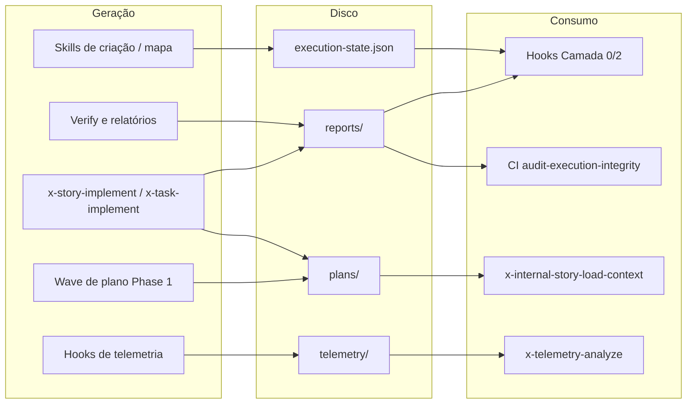

# Plano Estratégico — Evolução do `ia-dev-environment` (NextGen Dev Platform — NDP)

> **Status:** Rascunho estratégico (pré-refinement). Hierarquia: `Project → Product → Capacity → Feature`. Épicos, Stories e Tasks ficam para a próxima rodada.
> **Autor:** Eder + Claude (sessão de planejamento de 2026-05-01).
> **Codinome de trabalho:** `NDP` — NextGen Dev Platform.

---

## 0. Princípio fundador — Local-first, CLI-first

Antes de qualquer Product, Capacity ou Feature deste plano, vale a regra de delivery do projeto:

> **O NDP é, em primeiro lugar, uma ferramenta que roda 100% local na máquina do desenvolvedor. A V0 é uma CLI — exatamente como o `ia-dev-env` é hoje. Toda interface gráfica (web console, dashboards, IDE extensions, mobile, etc.) é trabalho pós-V0 e não bloqueia nenhuma capacidade do core.**

### O que isso implica

| Decisão | Consequência |
| --- | --- |
| **Local-first por padrão** | Código-fonte, telemetria, audit log e estado de execução vivem no disco do desenvolvedor. Nada é enviado para nuvem sem opt-in explícito do usuário. |
| **V0 = CLI** | A primeira release entregável é executável via terminal (`ndp ...`), análoga ao `ia-dev-env generate` / `ia-dev-env validate` de hoje. Sem servidor, sem login, sem dependência de rede para o caminho feliz. |
| **Frontend é v1+** | Web console (P3.C1), IDE extensions (P3.C2), TUI (P3.C3.F2) são trabalho **posterior**. O core precisa estar estável e auditável via CLI antes de ganhar UI. |
| **Headless friendly** | Toda Feature do core precisa ser scriptável via CLI — UI futura consome a mesma camada que a CLI consome (sem lógica de negócio na UI). |
| **Network como opt-in** | Marketplace (P4), telemetria remota (P5.C1.F1), multi-tenancy (P6.C4) — tudo desligado por padrão. Usuário sem internet tem o produto inteiro funcionando offline. |
| **Sem vendor lock-in cloud** | Não dependemos de nenhum SaaS para rodar. Cloud é serviço opcional sobre o core, não pré-requisito. |

### Roadmap de interfaces (ordem de entrega)

```
V0  ─►  CLI (ndp <command>)                      ── single source of truth
V1  ─►  + TUI (ndp tui) e IDE panel mínimo        ── melhora UX, mesmo core
V2  ─►  + Web console local (ndp ui, localhost)   ── dashboard offline opcional
V3+ ─►  + SaaS multi-tenant, marketplace remoto   ── opt-in, separado do core
```

A CLI permanece **canônica em todas as versões**. Nenhuma feature do core pode existir apenas na UI; tudo precisa ter contrapartida CLI auditável e versionável.

---

## 0.5. Princípio de inversão de controle — NDP é o orquestrador

A V0 não vai apenas substituir o `ia-dev-env`: vai **inverter o modelo de execução**.

### Modelo atual (problema-raiz)

```
Usuário → Claude Code → lê x-epic-implement.md → LLM tenta executar passo-a-passo
                                                    ↑
                                                    Hooks bash + audit scripts
                                                    tentam impedir o LLM de pular
```

O LLM é o orquestrador. Ele decide quais skills chamar, em qual ordem, com quais argumentos. As 4 camadas de gates (Rule 24/26/27) existem **justamente porque o LLM pula etapas, simula resultados e silenciosamente declara sucesso sem ter executado**. Os hooks são curativos sobre uma fragilidade estrutural — não consertam a causa, só tentam detectar o sintoma depois.

### Modelo NDP (solução)

```
Usuário → ndp epic implement EPIC-0072
            ↓
         NDP (código determinístico) controla state machine, fases, gates, evidências
            ↓ chama via CLI quando precisa de criatividade do LLM
         claude -p "<prompt focado>" → resposta → NDP valida → próxima fase
```

**O NDP é o orquestrador.** O LLM (Claude na V0; outros providers em V1+) é um *worker* invocado para tarefas pontuais que só um modelo consegue fazer: gerar código, redigir review, escrever ADR, refinar story. Tudo o que é determinístico — fluxo entre fases, criação de branches, commits, validação de artefatos, telemetria, gates — vira **código compilado do NDP**, não markdown interpretado por LLM.

### Consequências práticas

| Efeito | Detalhe |
|---|---|
| **Skills orquestradoras viram comandos do CLI** | `x-epic-implement` → `ndp epic implement <ID>`. `x-story-implement` → `ndp story implement <ID>`. `x-task-implement` → `ndp task implement <ID>`. `x-review`, `x-review-pr`, `x-release`, `x-epic-orchestrate`, `x-pr-merge-train` — todas. Ver §5.1 para o mapeamento completo. |
| **Hooks e scripts shell são eliminados** | `.claude/hooks/*.sh` (Stop, PreToolUse, PostToolUse), `scripts/audit-*.sh`, `scripts/preflight.sh`, `scripts/enforce-*.sh` — substituídos. NDP aplica os mesmos invariantes em código nativo, antes/depois de cada fase, dentro do próprio processo. |
| **Camadas 0-4 da Rule 26 colapsam em 2** | Camada 0 (preventiva), 1 (normativa), 2 (CI bash), 3 (Java test), 4 (observability) → reduzem para: **Camada A** (NDP runtime — bloqueia em processo, antes de qualquer efeito colateral) e **Camada B** (CI — valida o que o NDP produziu). Carga cognitiva cai em ~80%. |
| **Zero-bypass vira propriedade arquitetural** | Rule 27 hoje exige 4 camadas porque o LLM pode bypassar. Com NDP como entry-point, **bypass é impossível por construção**: ou você roda `ndp ...` e ele aplica os gates, ou você não usa o produto. Acabaram os "LLM pulou a etapa X" silenciosos. |
| **Refinement gate vira pré-condição da CLI** | `ndp story implement <ID>` recusa começar se `ndp story refine <ID>` não tiver gerado verdict aprovado. Sem hook PreToolUse, sem audit script. Apenas `if (!storyRefined.approved) exit 33` em código. |
| **Tool-call grammar (Rule 28) vira tipagem** | Hoje é regex contra markdown. No NDP, `[required]/[optional]/[conditional]` é declarado em código (data class / enum) e enforçado em compile-time + runtime. Lint sobre markdown desaparece. |
| **Telemetria é in-process** | NDJSON gravado pelo NDP enquanto roda; não precisa de hooks bash emitindo eventos. Trace OTel-compatible nasce nativo, sem post-processing. |
| **Determinismo total da orquestração** | Mesma input → mesmo plano de execução, mesmo grafo de fases, mesmas validações. A variação fica isolada nos *outputs criativos do LLM*, nunca na orquestração. |
| **Phase gates viram função, não script** | `x-internal-phase-gate` em bash → método `phaseGate.assertPre(phase, ctx)` em código, com tipos, testes unitários e exceções tipadas. |
| **Rules como engine, não como prosa** | Rules continuam existindo, mas viram *políticas executáveis* (YAML+JSONLogic ou DSL) que o NDP avalia, em vez de markdown que o LLM tenta interpretar. |

### O que continua sendo "skill" no NDP

Skills *narrow / leaf* que pedem criatividade do LLM permanecem como **prompts versionados** consumidos pelo NDP:

- `x-arch-plan`, `x-test-plan`, `x-task-plan`, `x-story-refine`, `x-epic-refine` → continuam como templates de prompt + schema de saída esperado; o NDP invoca `claude -p` com o template, valida o JSON/Markdown de retorno contra schema, e só então persiste o artefato.
- `x-code-format`, `x-code-lint`, `x-test-run` → 100% determinísticas, viram código NDP que chama o tooling (mvn, gradle, pytest); LLM nem é envolvido.
- `x-test-tdd` (cycle Red-Green-Refactor) → orquestração em código (NDP decide quando rodar Red, Green, Refactor); LLM é chamado pontualmente para "redigir o teste falho" e "escrever o código mínimo para passar".
- `x-review`, `x-review-pr`, `x-doc-generate`, `x-adr-generate` → prompts focados, com NDP escolhendo *quando* invocar, *quem* invocar (qual persona/modelo) e validando o resultado antes de aceitar.

### Integração com Claude Code na V0

Na V0 o usuário tem dois modos de uso, equivalentes:

1. **Terminal puro** — `ndp epic implement EPIC-0072` direto no shell. Funciona sem Claude Code instalado.
2. **Dentro do Claude Code** — usuário digita um comando (ex.: `/ndp epic implement EPIC-0072`) que dispara o CLI. O Claude Code apenas repassa o comando; **toda a orquestração, todas as chamadas LLM e todas as validações são do NDP**.

Em ambos os casos o NDP usa o `claude` CLI (Anthropic CLI ou equivalente em V1+) para invocar o modelo nas etapas que pedem criatividade. **O Claude Code não orquestra nada**; vira apenas um terminal alternativo + cliente do modelo.

### O que isso muda no plano (re-priorização)

- **P2 (Orchestration Runtime) é o coração da V0.** Antes era "um runtime ao lado das skills"; agora **é o produto inteiro sob o capô**. Todas as skills orquestradoras existentes (Anexo B da Rule 25 — 8 skills) são re-implementadas como comandos NDP.
- **P6 (Governance) encolhe drasticamente.** Várias Features de audit (Camada 0/2/3/4) viram triviais ou desnecessárias. O esforço migra para *integration tests do orquestrador* — bem mais barato que manter 4 camadas de gates externas.
- **P1 (Core Engine) muda de foco.** Continua gerando artefatos para targets externos (Claude Code, Cursor, etc.), mas o "artefato principal" da V0 passa a ser o próprio binário/CLI do NDP — não mais um diretório `.claude/` para o LLM ler e tentar interpretar.

---

## 1. Análise do estado atual (sumário executivo)

O `ia-dev-environment` hoje é um **gerador CLI Java** que materializa um diretório `.claude/` opinativo a partir de um YAML de stack. Os ativos centrais são:

| Camada | O que existe hoje | Limite percebido |
| --- | --- | --- |
| **Núcleo de geração** | `CapabilityResolver` + `CapabilityAwareComposer` + `OutputPruner` (EPIC-0064 v5) | Composição é file-system + Pebble, sem runtime; mudança = regenerar + commit |
| **Governança** | 31+ Rules (`.claude/rules/`), 4 camadas de audit gates (Rule 26), zero-bypass (Rule 27), refinement gate (Rule 29) | Carga cognitiva alta; regras são markdown estático, não programáveis |
| **Orquestração** | ~85 skills (`x-epic-implement`, `x-story-implement`, `x-task-implement`, `x-review`, …), TDD double-loop, multi-agent dispatch via `Agent(...)` | Acoplado ao Claude Code (CLI Anthropic); single-LLM (Claude Opus/Sonnet/Haiku) |
| **Observabilidade** | Telemetria NDJSON local (`ai/epics/epic-*/telemetry/events.ndjson`), `x-telemetry-analyze`, `x-telemetry-trend` | Sem stream real-time, sem dashboard, sem cross-project analytics |
| **Lifecycle** | Local-First (EPIC-0061), Camada 0 preventiva (EPIC-0063), value-driven templates v2 (EPIC-0070), doc-as-DoD (EPIC-0071) | Tudo baseado em hooks bash + scripts shell; difícil estender em outros IDEs |
| **Distribuição** | Self-contained generator → diretório `.claude/` per-projeto | Nenhum marketplace, nenhum versionamento de skills, nenhum compartilhamento entre orgs |

### Limitações estruturais (vetores de evolução)

1. **Mono-LLM, mono-IDE.** Toda a arquitetura assume Claude Code + modelos Anthropic. A próxima geração precisa abstrair o "harness" (Claude Code, Cursor, Windsurf, Aider, Gemini CLI, OpenAI Codex CLI, Copilot Workspace) e o "engine" (Claude, GPT, Gemini, modelos locais).
2. **Governança como markdown.** Rules são prosa interpretada pelo LLM. Não há *engine* de regras programável, não há simulador de políticas, não há A/B test de governance.
3. **Telemetria offline.** NDJSON local → impossível observar uma orquestração em execução em tempo real, impossível correlacionar entre repositórios, impossível alertar.
4. **Sem ecossistema.** Skills/rules/agents são copiados em cada projeto. Atualizar uma skill em 200 repos = 200 PRs. Não há canal de distribuição nem versionamento semântico de governance.
5. **Output estático.** `.claude/` é regenerado; usuário não pode customizar sem perder no próximo regen. Não há *overlay* nem *patching* declarativo.
6. **Sem visão multi-projeto.** Cada repo é uma ilha. A inteligência acumulada (telemetria, P95 regressions, padrões de drift, NO-GO recorrentes do refinement) não atravessa fronteiras.
7. **Onboarding pesado.** Para um time adotar: instala o gerador, escreve YAML, regenera, lê 31 rules, aprende ~20 skills primárias. Curva alta.

### Visão para a próxima geração

> Uma **plataforma multi-LLM, multi-IDE, multi-projeto** de engenharia assistida por IA, **executada localmente por padrão** e com **inversão de controle: o NDP é o orquestrador determinístico, o LLM é o worker invocado pontualmente**. Governança é código compilado, não markdown interpretado. Orquestração é observável em tempo real (no próprio terminal na V0; com UI opcional depois). Conhecimento é compartilhável via marketplace opt-in. Hooks e audit scripts shell são eliminados — substituídos por gates in-process. A evolução das próprias regras é guiada por IA a partir de telemetria agregada.

---

## 2. Estrutura hierárquica do plano

### Project: **NextGen-Dev-Platform** (codinome `NDP`)

> Hierarquia conforme solicitado: Project → Product → Capacity → Feature.
> Épicos, Stories e Tasks ficam para a próxima rodada de refinement.
> **Marcação `[V0]` / `[V1+]` / `[V2+]` indica a release-target de cada Feature** — V0 = CLI local-first; tudo mais é posterior.

---

### Product P1: **Core Engine** — núcleo de composição e geração multi-target

> Evolução direta do `ia-dev-env` Java. Continua sendo a fonte da verdade da governance, mas vira **multi-target** (Claude Code, Cursor, Windsurf, Aider, agentes próprios) e **multi-LLM**. **Roda 100% local; é a CLI canônica do produto.**

#### Capacity P1.C1: **Configuração & Profile Management**
- Feature P1.C1.F1 `[V0]`: Schema unificado de profile (substitui o YAML atual) com validação JSON-Schema versionada
- Feature P1.C1.F2 `[V0]`: Migração assistida v5 (ia-dev-env atual) → v6 (NDP) com `ndp migrate --from-iadev`
- Feature P1.C1.F3 `[V0]`: Profile inheritance & overlays (base profile + org overlay + repo overlay)
- Feature P1.C1.F4 `[V1+]`: Detecção automática de stack (sem precisar escrever YAML manual) — usa heurísticas + LLM advisor

#### Capacity P1.C2: **Capability Composition v2**
- Feature P1.C2.F1 `[V0]`: Capability resolver com cache local (hoje recomputa a cada `generate`)
- Feature P1.C2.F2 `[V0]`: Frontmatter v4 com `provides:` (não só `requires:`) — capabilities expõem extension points
- Feature P1.C2.F3 `[V1+]`: Plug-in capabilities — pacotes externos (npm/maven/oci) que injetam capabilities sem fork
- Feature P1.C2.F4 `[V0]`: Composition diff & dry-run (`ndp generate --dry-run --diff`) — vê o que mudaria antes de aplicar

#### Capacity P1.C3: **Artifact Generation Multi-Target**
- Feature P1.C3.F1 `[V0]`: Target adapter `claude-code` (compatibilidade com `.claude/`)
- Feature P1.C3.F2 `[V0]`: Target adapter `cursor` (`.cursor/rules/`, `.cursorrules`)
- Feature P1.C3.F3 `[V1+]`: Target adapter `windsurf` / `aider` / `gemini-cli` / `codex-cli`
- Feature P1.C3.F4 `[V1+]`: Target adapter `generic-mcp` (qualquer cliente MCP-compatível)
- Feature P1.C3.F5 `[V0]`: Overlay system — usuário pode editar artefatos gerados sem perder customização no próximo regen

#### Capacity P1.C4: **Multi-Stack & Multi-Language**
- Feature P1.C4.F1 `[V0]`: Catálogo de stacks oficial (hoje: Java/Spring/Quarkus/Helidon/Micronaut/Picocli; expandir Python, TypeScript, Go, Rust, .NET, Kotlin)
- Feature P1.C4.F2 `[V1+]`: Stack templates community-contributed com versionamento semântico
- Feature P1.C4.F3 `[V2+]`: Polyglot projects (mono-repo com múltiplos stacks coexistindo)
- Feature P1.C4.F4 `[V0]`: Reutilização de KPs (knowledge packs) entre stacks via taxonomia comum

---

### Product P2: **Orchestration Runtime** — coração da V0; o NDP É o orquestrador

> **Este é o produto-âncora da V0.** Hoje a "execução" é o LLM interpretando markdown e os hooks bash tentando consertar o que ele pula. Aqui vira um **runtime in-process determinístico**, escrito em código, que invoca o LLM apenas para tarefas pontuais via `claude` CLI. Todas as skills orquestradoras de hoje (`x-epic-implement`, `x-story-implement`, `x-task-implement`, `x-review`, `x-review-pr`, `x-release`, `x-epic-orchestrate`, `x-pr-merge-train`) viram comandos do CLI `ndp`. Hooks e audit scripts shell são substituídos por gates in-process. **Roda como processo local; bypass é impossível por construção.**

#### Capacity P2.C0: **Comandos orquestradores nativos do CLI** *(nova capacity — substitui os hooks/scripts)*
- Feature P2.C0.F1 `[V0]`: `ndp epic implement <ID>` — substitui `x-epic-implement` (state machine de 6 fases em código)
- Feature P2.C0.F2 `[V0]`: `ndp story implement <ID>` — substitui `x-story-implement` (fase 1 planning paralelo, fase 2 implementação, fase 3 verify, fase 4 report — tudo determinístico)
- Feature P2.C0.F3 `[V0]`: `ndp task implement <ID>` — substitui `x-task-implement` (TDD double-loop em código; LLM só redige teste e código mínimo)
- Feature P2.C0.F4 `[V0]`: `ndp story refine <ID>` / `ndp epic refine <ID>` — substitui `x-story-refine` / `x-epic-refine` (multi-persona dispatch em código; cada persona é uma chamada `claude -p` com prompt versionado)
- Feature P2.C0.F5 `[V0]`: `ndp review <STORY>` / `ndp review pr <PR>` — substitui `x-review` / `x-review-pr` (especialistas em paralelo, consolidação determinística)
- Feature P2.C0.F6 `[V0]`: `ndp release [--patch|--minor|--major]` — substitui `x-release` (versionamento, changelog, release branch, gates em código)
- Feature P2.C0.F7 `[V0]`: `ndp epic orchestrate <ID>` — substitui `x-epic-orchestrate` (loop sequencial determinístico sobre stories)
- Feature P2.C0.F8 `[V0]`: `ndp merge-train [--epic <ID>|--prs <list>]` — substitui `x-pr-merge-train` (ordem topológica em código)
- Feature P2.C0.F9 `[V0]`: `ndp pr watch <PR>` — substitui `x-pr-watch-ci` (polling determinístico com 8 exit codes da Rule 45 como enum tipado)
- Feature P2.C0.F10 `[V0]`: `ndp pr fix <PR>` / `ndp pr fix-epic <EPIC>` — substitui `x-pr-fix` / `x-pr-fix-epic`
- Feature P2.C0.F11 `[V0]`: `ndp pipeline run <COMMAND>` — entry point único; aceita qualquer comando orquestrador, aplica os mesmos gates, telemetria e audit log
- Feature P2.C0.F12 `[V0]`: Headless mode (`--non-interactive`, `--output json`) garantido em todos os comandos para integração CI

#### Capacity P2.C1: **Agent Lifecycle Service**
- Feature P2.C1.F1 `[V0]`: State machine de skill (Pendente → Refinada → Planejada → Em Andamento → Concluída/Falha/Bloqueada) como serviço local
- Feature P2.C1.F2 `[V0]`: Pause/resume de orquestração long-running (hoje, perder a sessão = perder o progresso)
- Feature P2.C1.F3 `[V2+]`: Resume cross-machine (começa no laptop, termina no desktop, retoma em CI) — exige sync remoto opt-in
- Feature P2.C1.F4 `[V0]`: Sub-agent fan-out/fan-in declarativo (substitui o Batch-A/Batch-B manual de Pattern 2)

#### Capacity P2.C2: **Task Hierarchy & Phase Gates v2** *(em código nativo, não bash)*
- Feature P2.C2.F1 `[V0]`: Task tree como entidade de primeira classe do NDP (substitui o pareamento `TaskCreate`/`TaskUpdate` que dependia do harness do Claude Code)
- Feature P2.C2.F2 `[V0]`: **Phase gates como funções tipadas em código** — `phaseGate.assertPre(phase, ctx)` / `phaseGate.assertPost(phase, ctx, evidence)` substituindo `x-internal-phase-gate.sh` e os scripts `enforce-*.sh` / `audit-*.sh`. Exit codes viram exceptions tipadas; baselines viram fixtures de teste.
- Feature P2.C2.F3 `[V0]`: Pré-condições in-process antes de qualquer efeito colateral (substitui Camada 0 / `enforce-preflight-gates.sh`) — `ndp story implement` falha rapidamente se refinement não foi aprovado, working tree está sujo, ou capabilities estão inválidas. Sem hook PreToolUse, sem `CLAUDE_RECOVERY_MODE`.
- Feature P2.C2.F4 `[V1+]`: Gates customizáveis per-org (org adiciona "gate de SOC2", "gate de LGPD") via plug-in compilado, não via bash
- Feature P2.C2.F5 `[V0]`: Replay determinístico de execução (`ndp replay <run-id>`) — recria o grafo de fases a partir do audit log; LLM responses ficam em cache para reprodução offline

#### Capacity P2.C3: **LLM Abstraction Layer**
- Feature P2.C3.F1 `[V0]`: Provider abstraction — Claude/GPT/Gemini/local (Llama, Qwen) atrás da mesma interface
- Feature P2.C3.F2 `[V0]`: Model routing dinâmico (Rule 23 atual é estático; aqui é por skill + custo + latência observada)
- Feature P2.C3.F3 `[V0]`: Fallback automático (Opus indisponível → Sonnet com warning visível no terminal)
- Feature P2.C3.F4 `[V0]`: Custo por execução em tempo real, mostrado no terminal antes de aprovar PROCEED

#### Capacity P2.C4: **Reliability & Replay**
- Feature P2.C4.F1 `[V0]`: Determinismo controlado (mesma input + mesma seed = mesma saída quando possível)
- Feature P2.C4.F2 `[V0]`: Snapshot de contexto local (hoje, perder a janela = perder o contexto)
- Feature P2.C4.F3 `[V0]`: Idempotência por skill (chamar `x-pr-create` 2× para o mesmo task = no-op detectado)
- Feature P2.C4.F4 `[V0]`: File-locking local (evitar 2 agentes editando o mesmo arquivo em `--parallel`)

---

### Product P3: **Developer Experience** — CLI primária + TUI + IDE + (futuro) UI

> **V0 entrega CLI + saída estruturada (JSON/text).** TUI, IDE panels e Web Console são incrementais sobre a mesma camada de comandos. Nada do core depende de UI gráfica.

#### Capacity P3.C1: **CLI v2 (canônica em todas as versões)**
- Feature P3.C1.F1 `[V0]`: `ndp` CLI unificado (substitui `ia-dev-env` + scripts bash dispersos)
- Feature P3.C1.F2 `[V0]`: Saída estruturada por padrão (`--output json`/`--output text`/`--output ndjson`) para integração com qualquer ferramenta
- Feature P3.C1.F3 `[V0]`: REPL para experimentar capabilities sem regen completo (`ndp repl`)
- Feature P3.C1.F4 `[V0]`: Migration assistant interativo (`ndp migrate`)
- Feature P3.C1.F5 `[V0]`: Onboarding interativo (`ndp init`) com 5-7 perguntas vs. YAML longo de hoje

#### Capacity P3.C2: **TUI & Local UI Auxiliar**
- Feature P3.C2.F1 `[V1+]`: Modo TUI (`ndp tui`) — interface terminal navegável (Charm/Textual-style)
- Feature P3.C2.F2 `[V1+]`: Live progress (`ndp watch`) — acompanha orquestrações em curso no próprio terminal
- Feature P3.C2.F3 `[V2+]`: Web console local (`ndp ui`, sobe localhost) — dashboard offline opcional
- Feature P3.C2.F4 `[V2+]`: Editor visual de rules / skills (markdown + preview de capability resolution)

#### Capacity P3.C3: **IDE Extensions**
- Feature P3.C3.F1 `[V1+]`: Extensão VS Code — invoca skills via CLI, mostra task tree, anexa contexto
- Feature P3.C3.F2 `[V2+]`: Extensão JetBrains
- Feature P3.C3.F3 `[V1+]`: Painel inline de evidências (`verify-envelope.json`, review-story-*, …) sem sair do editor
- Feature P3.C3.F4 `[V1+]`: Auto-complete de profile YAML / capabilities

#### Capacity P3.C4: **Onboarding & Time-to-Value**
- Feature P3.C4.F1 `[V0]`: `ndp init` interativo com 5-7 perguntas (vs. YAML longo hoje)
- Feature P3.C4.F2 `[V0]`: Templates por persona (backend Java sênior, frontend TS, fullstack Python, SRE)
- Feature P3.C4.F3 `[V1+]`: Tutorial guiado in-IDE (modo "teach")
- Feature P3.C4.F4 `[V0]`: Healthcheck de adoção (`ndp doctor`) — diagnostica setup e sugere próximos passos

---

### Product P4: **Knowledge & Marketplace** — ecossistema compartilhado (opt-in, network-required)

> **Opt-in explícito. Funciona offline com cache local.** Nenhuma feature do core depende do marketplace estar disponível.

#### Capacity P4.C1: **Skill Marketplace**
- Feature P4.C1.F1 `[V1+]`: Registry central (`registry.ndp.dev` ou self-hosted) para skills versionadas
- Feature P4.C1.F2 `[V1+]`: Versionamento semântico de skills (SemVer obrigatório, breaking changes detectados)
- Feature P4.C1.F3 `[V1+]`: Dependency resolution (skill A depende de capability X; resolver baixa skill B que provê X)
- Feature P4.C1.F4 `[V1+]`: Trust model — assinatura digital de skills oficiais; sandbox para skills community
- Feature P4.C1.F5 `[V2+]`: Skill compatibility matrix (skill X funciona com Claude 4.7, GPT-5, Gemini 2.5)

#### Capacity P4.C2: **Rule & Governance Library**
- Feature P4.C2.F1 `[V1+]`: Rule packs por domínio (`@ndp/finance-compliance`, `@ndp/healthcare-hipaa`, `@ndp/security-pci`)
- Feature P4.C2.F2 `[V2+]`: Rule simulator — testa "essa regra teria pegado X PRs do passado?"
- Feature P4.C2.F3 `[V1+]`: Rule conflict detector (rule A exige X, rule B proíbe X)
- Feature P4.C2.F4 `[V1+]`: Custom rule authoring com lint + test framework

#### Capacity P4.C3: **Template & Profile Catalog**
- Feature P4.C3.F1 `[V1+]`: Catálogo de profiles oficial e community (`spring-boot-mvp`, `quarkus-microservice`, `python-fastapi`)
- Feature P4.C3.F2 `[V2+]`: Profile rating / usage stats
- Feature P4.C3.F3 `[V1+]`: Fork & customize (`ndp profile fork @ndp/spring-boot-mvp my-org`)
- Feature P4.C3.F4 `[V1+]`: Profile lineage (rastreia de qual profile o seu derivou; herda updates de upstream)

#### Capacity P4.C4: **Cross-Project Intelligence**
- Feature P4.C4.F1 `[V2+]`: Padrões agregados (anonimizados) — "85% dos projetos Spring Boot que usam capability X também usam Y"
- Feature P4.C4.F2 `[V2+]`: Recommendation engine — "seu projeto tem perfil similar ao Z; considere skill W"
- Feature P4.C4.F3 `[V2+]`: Drift detection cross-repo — "essa capability está obsoleta em 12 dos 15 projetos da sua org"
- Feature P4.C4.F4 `[V2+]`: Knowledge graph navegável (dependências entre rules, skills, capabilities, ADRs)

---

### Product P5: **Observability, Analytics & FinOps**

> **V0 entrega observabilidade local-first** (mesma capacidade do `events.ndjson` atual + queries via CLI). Streaming remoto e dashboards SaaS são posteriores.

#### Capacity P5.C1: **Local & Real-Time Telemetry**
- Feature P5.C1.F1 `[V0]`: Captura local NDJSON (paridade com `ia-dev-env`) + queries via CLI (`ndp telemetry analyze`)
- Feature P5.C1.F2 `[V1+]`: Streaming opt-in para sinks remotos (OTLP, Datadog, custom HTTP)
- Feature P5.C1.F3 `[V2+]`: Dashboard live de execução (todos os agentes em paralelo da org agora) — UI separada
- Feature P5.C1.F4 `[V1+]`: Alerting (P95 de skill X regrediu > 30%, gate Y falhou 3× seguidas) — local hooks na V1, remoto na V2
- Feature P5.C1.F5 `[V1+]`: Trace distribuído OTel-compatible

#### Capacity P5.C2: **Quality & Compliance Metrics**
- Feature P5.C2.F1 `[V0]`: Coverage tracking longitudinal por epic / story / file (relatório CLI)
- Feature P5.C2.F2 `[V0]`: Refinement quality score (% stories aprovadas no 1º refinement vs. retrabalho)
- Feature P5.C2.F3 `[V1+]`: Doc freshness heatmap (Rule 31 visualizado por org)
- Feature P5.C2.F4 `[V1+]`: Compliance posture report (OWASP, ASVS, SOC2, LGPD) por release

#### Capacity P5.C3: **FinOps & Cost Insights**
- Feature P5.C3.F1 `[V0]`: Custo de LLM por skill / story / epic / org (registro local)
- Feature P5.C3.F2 `[V1+]`: Sugestão de model downgrade (skill X é Opus mas Sonnet entregou idêntico em 50 amostras)
- Feature P5.C3.F3 `[V0]`: Budget guardrails locais (org define teto/mês via config; gate bloqueia ao atingir 90%)
- Feature P5.C3.F4 `[V1+]`: Comparativo de custo por provedor (Claude vs. GPT vs. Gemini para a mesma skill)

#### Capacity P5.C4: **Research & Benchmarking**
- Feature P5.C4.F1 `[V2+]`: A/B testing de skills (versão A vs. B em produção, mede qualidade real)
- Feature P5.C4.F2 `[V1+]`: Benchmark suite (mesmo problema, vários modelos, tabela comparativa)
- Feature P5.C4.F3 `[V2+]`: Regression detection automática (model atualizou, qualidade caiu, alerta)
- Feature P5.C4.F4 `[V2+]`: Public leaderboard opt-in (similar a HumanEval mas para tarefas reais)

---

### Product P6: **Governance, Security & Trust** *(reduzido pela inversão de controle)*

> A governança hoje (Rules 24/27/29/30/31) é forte mas estática, e exige **4 camadas de gates externos** (hooks, audit scripts, Java tests, CI workflow) porque o LLM é o orquestrador e pode bypassar. **Com a inversão de controle (§0.5), várias dessas camadas viram desnecessárias** — o NDP simplesmente não faz a coisa errada. P6 encolhe para o que realmente precisa de produto separado: audit log imutável, threat modeling, supply chain, e (em V2+) multi-tenancy. **V0 cobre o local-first; multi-tenant é V2+.**

#### Capacity P6.C1: **Audit & Compliance Engine** *(simplificado — gates viraram código do P2)*
- Feature P6.C1.F1 `[V0]`: Audit log local imutável escrito pelo próprio NDP em-processo (cadeia hash-linked, substitui telemetria NDJSON e o conjunto inteiro de `audit-*.sh`)
- Feature P6.C1.F2 `[V0]`: Evidence vault local (artefatos de Rule 24 com retenção/lifecycle policies) — populado nativamente pelo orquestrador, sem depender de hooks bash
- Feature P6.C1.F3 `[V1+]`: Reports SOC2 / ISO 27001 / LGPD prontos do CI
- Feature P6.C1.F4 `[V1+]`: Forensics — "quem aprovou o gate, com qual modelo, em qual contexto, contra qual policy"
- Feature P6.C1.F5 `[V0]`: **CI Camada B** (substitui Camadas 2/3/4 atuais) — único script CI: `ndp ci verify` valida o que o NDP produziu. Sem `audit-execution-integrity.sh`, `audit-bypass-flags.sh`, `audit-tool-call-grammar.sh`, etc.

#### Capacity P6.C2: **Refinement & Quality Gates v2**
- Feature P6.C2.F1 `[V0]`: AI-assisted refinement (`/x-story-refine` evolui para multi-round dialogue com persona-specific feedback inline)
- Feature P6.C2.F2 `[V1+]`: Refinement memory (lembra que essa persona já vetou X risco em stories similares)
- Feature P6.C2.F3 `[V0]`: Refinement templates por domínio (refinement de feature de pagamento vs. refinement de UI cosmético)
- Feature P6.C2.F4 `[V0]`: NO-GO library (catálogo de razões de NO-GO recorrentes para shortcut)

#### Capacity P6.C3: **Security Posture & Threat Modeling**
- Feature P6.C3.F1 `[V0]`: Continuous threat modeling (não só `x-threat-model` sob demanda; roda no CI a cada PR estrutural)
- Feature P6.C3.F2 `[V0]`: SBOM gerado e validado (Rule 06 evolui para CycloneDX + assinatura)
- Feature P6.C3.F3 `[V0]`: Secret scanning integrado (não só `audit-bypass-flags`, scan completo de credenciais)
- Feature P6.C3.F4 `[V1+]`: Supply chain trust score por skill/profile importado do marketplace

#### Capacity P6.C4: **Privacy, Multi-Tenancy & RBAC** *(toda esta Capacity é V2+ — exige cloud)*
- Feature P6.C4.F1 `[V2+]`: Multi-tenant — uma instância serve N orgs com isolamento criptográfico
- Feature P6.C4.F2 `[V2+]`: RBAC (quem pode editar rules, quem pode aprovar gates, quem pode publicar skills)
- Feature P6.C4.F3 `[V2+]`: Data residency (org escolhe região; código nunca atravessa fronteira sem consent)
- Feature P6.C4.F4 `[V1+]`: PII scrubbing automático na telemetria remota (Rule 20 vira política federada) — começa local na V1

---

## 3. Pontos-chave de alteração estrutural

> **Mudança #0 (a mais importante)** está separada porque é a fundação que torna todas as outras possíveis: a **inversão de controle**. Ela está descrita em §0.5; a tabela abaixo não a repete, apenas se apoia nela.

| # | Mudança | De | Para | Risco/Mitigação |
|---|---|---|---|---|
| 0 | **Inversão de controle (§0.5)** | LLM é o orquestrador; hooks/scripts shell tentam impedir bypass | NDP é o orquestrador in-process; LLM é worker invocado via `claude` CLI; bypass é impossível por construção | Risco: re-implementar 8 orquestradores em código é grande esforço. Mitigação: portar 1 por vez (ordem sugerida: `ndp story refine` → `ndp task implement` → `ndp story implement` → `ndp epic implement` → demais), validando em paralelo com a versão markdown atual. |
| 1 | **Harness abstraction** | Acoplado a Claude Code | Pluggable (Claude Code, Cursor, Windsurf, Aider, MCP genérico) | Risco: vazamento de abstração de cada IDE. Mitigação: começar com 2 targets reais (Claude Code + Cursor), generalizar depois. |
| 2 | **LLM abstraction** | Anthropic-only (Opus/Sonnet/Haiku) | Provider-neutral (+ GPT, Gemini, locais) | Risco: prompts otimizados para Claude degradam em outros. Mitigação: matriz de prompt-by-provider versionada por skill. |
| 3 | **Governança como código** | Rules em markdown interpretadas | Rules em DSL programável (eval, simulate, A/B test) | Risco: complexidade de uma linguagem proprietária. Mitigação: começar com YAML+JSONLogic; evoluir só se necessário. |
| 4 | **Output do generator** | `.claude/` regen-only | Overlay system (gera base + permite patches mantidos) | Risco: conflito de overlay vs. upstream update. Mitigação: 3-way merge declarativo + `ndp doctor` para detectar drift. |
| 5 | **Telemetria** | NDJSON local privado | Local-first com streaming opt-in (NUNCA forçado) | Risco: privacy concerns. Mitigação: local-first como padrão, Rule 20 evolui para política federada com PII scrubbing client-side antes de qualquer envio. |
| 6 | **Distribuição de skills** | Copy in-repo via `ScriptsAssembler` | Marketplace versionado (semver, signed, sandbox) — opcional | Risco: supply chain attacks. Mitigação: assinatura, trust score, sandboxing por padrão para skills community. Marketplace é opt-in; CLI funciona sem ele. |
| 7 | **Multi-projeto** | Cada repo é ilha | Knowledge graph cross-projeto (anonimizado, opt-in) | Risco: vazamento de IP via padrões agregados. Mitigação: differential privacy em estatísticas; opt-in granular; padrão é local-only. |
| 8 | **Identidade & multi-tenancy** | N/A (single-user local) | RBAC + multi-tenant + audit log | Risco: de simples para complexo num salto. Mitigação: V0/V1 são single-user local; multi-tenant entra só em V2+ quando houver demanda. |
| 9 | **Backward compat** | EPIC-0064 já é breaking (v5) | Migration tool obrigatório de ia-dev-env → NDP | Risco: usuários abandonam na migração. Mitigação: `ndp migrate --from-iadev` end-to-end testado contra os profiles canônicos. |
| 10 | **Open-source vs commercial** | 100% OSS hoje | Core OSS + cloud paid (marketplace, observability SaaS, multi-tenancy) | Risco: comunidade percebe como bait-and-switch. Mitigação: linha clara desde o dia 1 (Apache 2.0 core; commercial license para SaaS); o core local-first sempre será gratuito. |
| 11 | **Eliminação de hooks/scripts shell** | `.claude/hooks/*.sh`, `scripts/audit-*.sh`, `scripts/preflight.sh`, `scripts/enforce-*.sh` (~30+ scripts) | Removidos. Substituídos por gates in-process do NDP (Camada A) + um único `ndp ci verify` (Camada B) | Risco: perda de invariantes durante a migração. Mitigação: para cada script removido, criar teste unitário cobrindo o mesmo invariante no orquestrador NDP, e rodar dual-mode (script + NDP) por 1 release antes de remover o script. |
| 12 | **Rules viram engine, não prosa** | 31 rules em markdown interpretadas pelo LLM | Subset crítico vira políticas executáveis (YAML+JSONLogic ou DSL); resto continua como documentação humana | Risco: criar uma DSL nova é caro. Mitigação: começar com YAML+JSONLogic (existente, testado); migrar só rules que são realmente *enforced* (Rule 24/26/27/28/29 — não Rule 03/05). |

---

## 4. Coisas a antecipar (riscos transversais)

### 4.1 Técnicos

- **Performance da composition em escala.** Hoje compõe 182 artefatos em ~2-5s. Com plug-ins externos (P1.C2.F3) e marketplace, pode chegar a 1000+. Cache local distribuído (P1.C2.F1) é crítico, não nice-to-have.
- **Determinismo cross-LLM.** A garantia "compor 2× = mesmo SHA bytewise" (audit-capability-determinism.sh do EPIC-0064) é mais difícil quando o LLM faz parte da geração. Provavelmente: split entre *deterministic composition* (artefatos) e *LLM-rendered content* (placeholders {{...}}).
- **Estado distribuído.** Pause/resume cross-machine (P2.C1.F3) exige store de estado serializado. Decidir cedo na V2: PostgreSQL? S3? Sync via git? Para V0/V1, file-based local com lock é suficiente.
- **Trace OTel completo.** O atual `events.ndjson` não é OTel-compliant. Migração precisa ser planejada para não quebrar `x-telemetry-analyze` / `x-telemetry-trend`.

### 4.2 Produto

- **Time-to-first-value.** ia-dev-env hoje exige ler 31 rules para entender o sistema. NDP precisa de "5 minutos para ver valor". Onboarding por persona (P3.C4.F2) é determinante já na V0.
- **Adoption friction de migration.** Quem já está em ia-dev-env (com epics 0001-0071 acumulados) precisa migrar sem perder histórico. Migration assistant precisa ser caso de uso central da V0, não afterthought.
- **Marketplace cold-start.** Sem skills/profiles no dia 1, ninguém adota. Estratégia: portar TODOS os ~85 skills atuais como "skills oficiais @ndp/*" no lançamento — disponibilizados também via cache local embarcado para uso offline.
- **Pricing model.** Core OSS é claro. Mas: marketplace é freemium? Observability é por seat ou por evento? FinOps é incluso ou add-on? Decidir antes de qualquer linha de código de billing — não bloqueia V0.

### 4.3 Compliance & Segurança

- **LGPD/GDPR para telemetria remota.** Mesmo opt-in, Rule 20 precisa ser federada (cliente decide o que envia, servidor não pode pedir mais).
- **Supply chain.** Marketplace cria superfície de ataque tipo `npm`. SBOM, signing, sandbox e trust score (P6.C3.F4) são day-1 do marketplace, não day-N. Local-first mitiga: usuário sem marketplace está imune.
- **Auditabilidade legal.** Audit log imutável (P6.C1.F1) com retenção configurável é obrigatório para clientes enterprise (SOC2, HIPAA) — começa local na V0.
- **Cost-attack vector.** Um skill malicioso no marketplace pode queimar US$ via LLM API. Budget guardrails (P5.C3.F3) por skill, não só por org — locais desde V0.

### 4.4 Estratégia

- **Posicionamento vs. concorrentes.** GitHub Copilot Workspace, Cursor, Sweep, Devin, etc. estão no mesmo espaço. Diferencial do NDP: governance-first + multi-IDE + multi-LLM + auditável + extensível + **local-first por princípio**. Não competir em "AI faz tudo"; competir em "AI faz certo, comprovadamente, na sua máquina".
- **OSS strategy.** Core OSS com licença permissiva (Apache 2.0) atrai contribuição. Cloud features pagas. Linha *crystal clear* desde o início para evitar reclamação de bait-and-switch — o core local-first sempre será gratuito.
- **Comunidade e contribuição.** Hoje, contribuir para ia-dev-env é entender 70k+ linhas de Java. NDP precisa de extension points limpos: novo target adapter, nova capability, nova rule pack — todos sem fork do core.

---

## 5. Considerações de migração (para não perder o que existe)

| Ativo atual | Plano de migração |
| --- | --- |
| 31 Rules (`.claude/rules/01-31`) | Portadas como `@ndp/governance-base@1.0.0` rule pack oficial. Subset enforced (24/26/27/28/29) vira engine executável (§3 #12); resto fica como doc humana. |
| **Skills orquestradoras** | Separadas em três destinos: comandos públicos do CLI, orquestradores internos do aplicativo, e auxiliares com visibilidade a decidir — ver §5.1 |
| Skills leaf restantes | Portadas como `@ndp/skills-core@1.0.0` (Apache 2.0); viram *prompts versionados* invocados pelo NDP via `claude -p`; marketplace permite forks |
| 7 capability categories (EPIC-0064) | Migram 1:1 para v6 schema; campos novos (`provides:`) opcionais até v7 |
| Profiles (`my-java-cli`, etc.) | `ndp migrate --from-iadev <profile.yaml>` gera profile NDP equivalente |
| Telemetria histórica (`events.ndjson`) | Importable via `ndp telemetry import --format ndjson-iadev` |
| **~30+ hooks/scripts shell** (`hooks/*.sh`, `scripts/audit-*.sh`, `scripts/preflight.sh`, `scripts/enforce-*.sh`) | **Eliminados.** Cada invariante migra para teste unitário do orquestrador NDP correspondente. Dual-mode (script + NDP) por 1 release antes de remover. |
| ADRs 0001-0024 | Permanecem no repositório do projeto; NDP não migra ADRs (são do projeto, não do gerador) |
| Stories/Epics em flight (0001-0071) | EPIC-0049's `flowVersion` semântica preservada; NDP entende flowVersion 1/2/3/4 + adiciona "ndp-1" |

### 5.1. Mapeamento — Skills orquestradoras → NDP

O inventário atual tem três classes de skills com comportamento de orquestração. A decisão de migração não é apenas "skill vira prompt": quando a skill decide ordem, coordena fases, valida gates, manipula estado, abre PR, comita, dispara subskills/subagents, ou consolida múltiplos workers, ela precisa sair do markdown interpretado pelo LLM e virar código NDP.

#### 5.1.1. Orquestradoras principais → comandos públicos do CLI

Estas são as candidatas diretas a comandos de primeira classe do CLI. O NDP deve controlar a state machine, persistência, gates, telemetria, retries, idempotência, permissões e saída estruturada; o LLM entra apenas como worker criativo nas etapas que exigirem geração ou julgamento.

| Skill atual | Destino NDP V0 | Nota de migração |
| --- | --- | --- |
| `x-epic-implement` | `ndp epic implement <ID>` | State machine de 6 fases tipada; substitui hooks de phase gate, execution integrity e bypass audit. |
| `x-story-implement` | `ndp story implement <ID>` | Loop end-to-end de story: planning, task execution, PR, review, verify e report. |
| `x-task-implement` | `ndp task implement <ID>` | TDD double-loop em código; LLM só redige teste, implementação mínima e refactors pontuais. |
| `x-release` | `ndp release [--patch\|--minor\|--major]` | Versionamento, changelog, release branch, PR, aprovação, tag e back-merge sob controle determinístico. |
| `x-epic-orchestrate` | `ndp epic orchestrate <ID>` | Planejamento/orquestração multi-story com ordem de dependências, checkpoints e resume. |
| `x-pr-merge-train` | `ndp merge-train [--epic <ID>\|--prs <list>]` | Merge train com descoberta, validação, ordenação, waves, smoke verify e report. |
| `x-review` | `ndp review <STORY>` | Fan-out/fan-in de especialistas em paralelo; consolidação e scoring em código. |
| `x-review-pr` | `ndp review pr <PR>` | Review Tech Lead com checklist e veredito GO/NO-GO estruturado. |
| `x-story-refine` | `ndp story refine <ID>` | Refinement multi-persona; Q&A e verdict persistidos por schema validado. |
| `x-epic-refine` | `ndp epic refine <ID>` | Refinement estratégico multi-persona de epic; verdict de escopo `epic`. |
| `x-story-plan` | `ndp story plan <ID>` | Planejamento multi-agente, task breakdown, task plans e DoR validation. |
| `x-feature-create` | `ndp feature create <SPEC>` | Pipeline completo spec → epic → stories → implementation map → branch/PR. |
| `x-feature-ideate` | `ndp feature ideate` | Prosa livre → spec RA9 + PR docs; fluxo público de entrada no backlog. |
| `x-test-tdd` | `ndp test tdd <TASK>` | Ciclos Red/Green/Refactor, validações e commits ficam em código; LLM atua por ciclo. |

#### 5.1.2. Orquestradores internos → serviços internos do aplicativo

Estas skills não devem aparecer como comandos públicos por padrão. Elas viram serviços, componentes ou métodos internos chamados pelos comandos acima. O equivalente NDP deve ser testável em unidade, tipado, idempotente e com contratos de entrada/saída estáveis.

- `x-internal-story-build-plan`
- `x-internal-epic-build-plan`
- `x-internal-phase-gate`
- `x-internal-story-verify`
- `x-internal-epic-integrity-gate`
- `x-internal-epic-branch-ensure`
- `x-internal-status-update`
- `x-internal-report-write`
- `x-internal-pr-body-render`
- `x-internal-story-load-context`
- `x-internal-story-resume`
- `x-internal-story-report`
- `x-internal-args-normalize`
- `x-internal-worktree-precheck`
- `x-lib-group-verifier`

Destino sugerido:

| Grupo interno | Forma em NDP |
| --- | --- |
| Gates (`x-internal-phase-gate`, `x-internal-story-verify`, `x-internal-epic-integrity-gate`) | Serviços de policy/gate chamados antes/depois de cada fase. |
| Estado (`x-internal-status-update`, `x-internal-story-resume`, `x-internal-story-load-context`) | Repositório de estado + state machine local com locking e schema. |
| Planejamento (`x-internal-story-build-plan`, `x-internal-epic-build-plan`) | Builders de execution plan e dispatchers internos de workers LLM. |
| Renderização (`x-internal-report-write`, `x-internal-pr-body-render`, `x-internal-story-report`) | Renderers tipados com templates versionados e golden tests. |
| Git/precheck (`x-internal-epic-branch-ensure`, `x-internal-worktree-precheck`) | Serviços internos usados pelos comandos `ndp epic`, `ndp story` e `ndp git`. |
| Build groups (`x-lib-group-verifier`) | Verificador interno entre waves paralelas. |

#### 5.1.3. Orquestradoras auxiliares → avaliar visibilidade pública

Estas skills coordenam fluxo suficiente para não serem tratadas como leaf prompts, mas nem todas precisam continuar públicas. Cada uma deve passar por uma decisão explícita: comando público, subcomando avançado, serviço interno, ou prompt/tool privado chamado por outro comando.

| Skill auxiliar | Decisão a tomar |
| --- | --- |
| `x-code-audit` | Provável comando público (`ndp code audit`) ou parte de `ndp ci verify`; mantém fan-out de dimensões em workers. |
| `x-lib-audit-rules` | Provável serviço interno de governance/audit; avaliar se precisa de modo público para autores de rules. |
| `x-doc-generate` | Provável comando público (`ndp doc generate`) e fase interna de `ndp story implement`. |
| `x-template-migrate` | Provável comando público de migração (`ndp template migrate`), mas com engine interna reutilizável. |
| `x-pr-create` | Provável comando público (`ndp pr create`) e serviço interno de PR usado por story/task/release. |
| `x-pr-fix` | Provável comando público (`ndp pr fix <PR>`). |
| `x-pr-fix-epic` | Provável comando público (`ndp pr fix-epic <EPIC>`) ou modo de `ndp pr fix --epic`. |
| `x-pr-watch-ci` | Provável comando público (`ndp pr watch <PR>`) com exit codes como enum tipado. |
| `x-pr-merge` | Avaliar: comando público avançado (`ndp pr merge`) ou serviço interno usado por merge-train/release. |
| `x-git-push` | Avaliar: pode virar subcomandos `ndp git push/commit/pr`; parte pode ser interna. |
| `x-git-commit` | Provável comando público (`ndp git commit`) e serviço interno de commit transacional. |
| `x-git-worktree` | Provável comando público (`ndp git worktree`) e serviço interno de lifecycle. |
| `x-git-cleanup-branches` | Provável comando público avançado (`ndp git cleanup-branches`) com confirmação e dry-run. |
| `x-status-reconcile` | Avaliar: comando de recovery/admin (`ndp status reconcile`) ou ferramenta interna de migração. |
| `x-ci-generate` | Provável comando público (`ndp ci generate`). |
| `x-setup-env` | Provável comando público (`ndp doctor` / `ndp setup env`). |
| `x-perf-profile` | Provável comando público (`ndp perf profile`) com adapters por stack. |
| `x-ops-troubleshoot` | Avaliar: comando público assistivo (`ndp troubleshoot`) ou prompt versionado acionado por falhas. |
| `x-ops-incident` | Avaliar: comando público opcional; pode ficar fora do core V0 se não for essencial ao fluxo local-first. |
| `x-jira-create-stories` | Avaliar: integração opcional/plugin (`ndp jira create stories`), não core offline obrigatório. |
| `x-adr-generate` | Provável comando público (`ndp adr generate`) e fase interna de arquitetura/migração. |
| `x-owasp-scan` | Provável comando público (`ndp security owasp-scan`) e entrada do `ndp ci verify`. |
| `x-security-dashboard` | Avaliar: comando público de agregação local (`ndp security dashboard`) ou recurso V1+ com UI. |
| `x-security-pentest` | Avaliar: comando público condicional por capability, com restrições fortes de ambiente. |

**Princípio invariante:** se a skill atual era principalmente *fluxo* (decidir ordem, validar, comitar, abrir PR, consolidar workers, controlar retry/resume), vira comando ou serviço NDP. Se era principalmente *criatividade* (gerar plano, redigir review, escrever ADR), continua como prompt versionado consumido pelo comando NDP correspondente. Se hoje é pública apenas porque o LLM precisava chamá-la manualmente, sua visibilidade deve ser reavaliada: no NDP, o usuário vê comandos de produto; o restante é API interna.

### 5.2. Inventário — Skills puras / não-orquestradoras

As skills abaixo já têm o nível de isolamento necessário para serem consideradas **skills puras**: cada uma possui uma responsabilidade dominante, entrada/saída relativamente delimitada e não deveria decidir o fluxo maior de implementação, release, PR, refinement ou governança. No NDP, elas podem virar prompts versionados, comandos utilitários, adapters de tooling ou serviços internos, mas **não precisam carregar state machine própria nem coordenar lifecycle amplo**.

Critério usado: uma skill pura executa um trabalho focado — formatar, validar, auditar, gerar um artefato, revisar uma dimensão, rodar uma suíte, fazer scaffold, sincronizar com uma integração ou produzir uma recomendação. Quando houver retries, chamadas auxiliares ou validações internas, isso permanece aceitável desde que a skill continue responsável por **um único resultado de produto**.

#### 5.2.1. Conditional skills

| Grupo | Skills puras | Responsabilidade isolada |
| --- | --- | --- |
| `conditional/dev` | `x-setup-stack` | Setup pontual de stack local. |
| `conditional/ops` | `x-obs-instrument` | Instrumentação de observabilidade. |
| `conditional/review` | `x-review-api`, `x-review-compliance`, `x-review-data-modeling`, `x-review-db`, `x-review-devops`, `x-review-events`, `x-review-gateway`, `x-review-graphql`, `x-review-grpc`, `x-review-obs`, `x-review-security` | Reviews especialistas por uma dimensão técnica. |
| `conditional/security` | `x-security-container`, `x-security-dast`, `x-security-infra`, `x-security-sast`, `x-security-secrets`, `x-security-sonar` | Scans e avaliações de segurança por superfície. |
| `conditional/test` | `x-test-contract-lint`, `x-test-contract`, `x-test-e2e`, `x-test-perf`, `x-test-smoke-api`, `x-test-smoke-socket` | Execução ou validação de uma categoria de teste. |

#### 5.2.2. Core code/dev/git skills

| Grupo | Skills puras | Responsabilidade isolada |
| --- | --- | --- |
| `core/code` | `x-code-format`, `x-code-lint` | Formatação e lint como operações determinísticas. |
| `core/dev` | `helidon-scaffold`, `micronaut-scaffold`, `picocli-command`, `quarkus-resource`, `spring-controller` | Scaffold ou geração pontual de componente. |
| `core/dev` | `x-ci-generate`, `x-mcp-recommend`, `x-setup-env`, `x-spec-drift` | Geração de CI, recomendação, diagnóstico de ambiente ou drift report. |
| `core/git` | `x-git-branch`, `x-git-cleanup-branches`, `x-git-commit`, `x-git-merge`, `x-git-push`, `x-git-worktree`, `x-planning-commit` | Primitivas Git isoladas, reutilizáveis pelos orquestradores. |

#### 5.2.3. Internal skills com responsabilidade única

Estas skills continuam sendo candidatas naturais a serviços internos do NDP, mas não por serem orquestradoras de produto; elas são primitivas bem delimitadas usadas por fluxos maiores.

| Grupo | Skills puras | Responsabilidade isolada |
| --- | --- | --- |
| `core/internal/git` | `x-internal-epic-branch-ensure`, `x-internal-worktree-precheck` | Garantia de branch e pré-check de worktree. |
| `core/internal/ops` | `x-internal-args-normalize`, `x-internal-report-write`, `x-internal-status-update` | Normalização de argumentos, escrita de relatório e atualização de estado. |
| `core/internal/plan` | `x-frontmatter-migrate`, `x-internal-epic-build-plan`, `x-internal-epic-create`, `x-internal-epic-integrity-gate`, `x-internal-epic-map`, `x-internal-phase-gate`, `x-internal-story-create`, `x-internal-story-load-context`, `x-internal-story-report`, `x-internal-story-resume`, `x-internal-story-verify` | Migração, geração, carga de contexto, verificação, gates e reports com um objetivo explícito por skill. |
| `core/internal/pr` | `x-internal-pr-body-render` | Renderização do corpo de PR. |

#### 5.2.4. Integrações, bibliotecas e operações

| Grupo | Skills puras | Responsabilidade isolada |
| --- | --- | --- |
| `core/jira` | `x-jira-create-epic`, `x-jira-create-stories` | Sincronização local → Jira. |
| `core/lib` | `x-lib-group-verifier`, `x-lib-task-decomposer` | Verificação de grupo ou decomposição estrutural. |
| `core/ops` | `x-doc-generate`, `x-doc-validate`, `x-ops-incident`, `x-ops-troubleshoot`, `x-perf-profile`, `x-release-changelog`, `x-status-reconcile`, `x-telemetry-analyze`, `x-telemetry-trend` | Documentação, troubleshooting, profiling, changelog, reconciliação e análise operacional. |

#### 5.2.5. Planning, PR, review, security e test

| Grupo | Skills puras | Responsabilidade isolada |
| --- | --- | --- |
| `core/plan` | `planning-standards-kp`, `x-adr-generate`, `x-arch-plan`, `x-arch-system-update`, `x-arch-update`, `x-parallel-eval`, `x-task-plan`, `x-template-migrate`, `x-threat-model` | Knowledge pack, planos, ADRs, atualização documental, avaliação de paralelismo, migração de template e threat model. |
| `core/pr` | `x-pr-create`, `x-pr-fix`, `x-pr-merge`, `x-pr-watch-ci` | Operações pontuais de PR, correção localizada, merge e watch de CI. |
| `core/review` | `x-review-perf`, `x-review-pr`, `x-review-qa` | Reviews focados em performance, checklist Tech Lead de PR ou QA. |
| `core/security` | `x-dependency-audit`, `x-hardening-eval`, `x-owasp-scan`, `x-runtime-eval`, `x-security-dashboard`, `x-security-pipeline`, `x-supply-chain-audit` | Auditorias e avaliações de segurança com saída própria. |
| `core/test` | `x-test-plan`, `x-test-run` | Plano de testes ou execução de testes/cobertura. |

**Decisão de migração:** estas 98 skills devem ser portadas sem inflar seu escopo. O NDP pode chamá-las como workers, comandos auxiliares ou serviços internos, mas a responsabilidade de coordenar ordem, retries globais, gates cross-phase, commits, PRs e evidências pertence ao runtime de orquestração (§P2), não a essas skills.

### 5.3. Inventário — Hooks e scripts de validação atuais

Os hooks e scripts atuais existem porque o Claude Code executa o fluxo por interpretação de markdown. Eles formam uma malha de defesa: alguns **bloqueiam antes** de um tool call, outros **avisam no fim do turno**, outros **detectam em CI** que uma evidência obrigatória não foi produzida. No NDP, a maior parte desse comportamento deixa de ser shell/hook e vira código do runtime (§P2), com uma única camada detectiva em CI (§P6.C1.F5).

Fonte conceitual: `HooksAssembler` gera `.claude/hooks/*.sh` e registra eventos em `.claude/settings.json`; `ScriptsAssembler` gera `scripts/audit-*.sh`. Em projetos consumidores, esses arquivos são saída gerada. A responsabilidade real vem das Rules 24, 25, 26, 27, 29, 31 e 45.

#### 5.3.1. Mapa de gatilhos

| Gatilho | Hooks/scripts envolvidos | Responsabilidade no processo |
| --- | --- | --- |
| `SessionStart` | `telemetry-session.sh` | Abre trilha de telemetria da sessão. |
| `PreToolUse` | `telemetry-pretool.sh`, `enforce-phase-sequence.sh`, `enforce-no-bypass-flags.sh`, `enforce-refinement-gate.sh`, `enforce-preflight-gates.sh` | Mede início de tool call e bloqueia bypass, fase inválida, ausência de refinement ou operação remota sem preflight. |
| `PostToolUse` (`Write\|Edit`) | `post-compile-check.sh` | Compila após edição Java para capturar quebra imediatamente. |
| `PostToolUse` (`*`) | `telemetry-posttool.sh` | Fecha medição de tool call e emite evento `tool.call`. |
| `SubagentStop` | `telemetry-subagent.sh` | Registra encerramento de subagente. |
| `Stop` | `telemetry-stop.sh`, `verify-story-completion.sh`, `verify-phase-gates.sh`, `enforce-continuous-flow.sh`, `stage-telemetry.sh` | Fecha sessão, verifica evidências, alerta phase gates falhos, detecta stall em modo não-interativo e prepara telemetria para commit. |
| PR/CI/`mvn verify` | `scripts/audit-*.sh`, `*AuditTest.java` | Validação detectiva sobre o repositório: falha o build quando o disco não contém as evidências esperadas. |

#### 5.3.2. Hooks preventivos e de verificação

| Artefato | Tipo | O que faz | Bloqueia/dispara | Skills/fluxos impactados | Destino NDP |
| --- | --- | --- | --- | --- | --- |
| `enforce-phase-sequence.sh` | PreToolUse / phase gate | Lê `execution-state.json.taskTracking.phaseGateResults` e impede avanço quando a última fase falhou. | `exit 2` bloqueia tool call; opt-out local `CLAUDE_PHASE_GATE_DISABLED=1`. | `x-epic-implement`, `x-story-implement`, `x-task-implement`, `x-release`, `x-epic-orchestrate`, `x-review`, `x-review-pr`, `x-pr-merge-train`. | `phaseGate.assertPre/assertPost` em código. |
| `enforce-no-bypass-flags.sh` | PreToolUse / anti-bypass | Intercepta `Skill(...)` e bloqueia `--skip-*` / `--no-ci-watch` fora de recovery. | `exit 1` bloqueia; `exit 2` erro operacional; `CLAUDE_RECOVERY_MODE=1` apenas bypass aceito. | `x-story-implement`, `x-task-implement`, `x-epic-implement`, `x-pr-fix-epic`, `x-release`, `x-internal-story-verify`. | Validação tipada de flags nos comandos NDP. |
| `enforce-refinement-gate.sh` | PreToolUse / DoR gate | Exige `refinementVerdict.status=approved` antes de implementar/orquestrar. | `exit 33 REFINEMENT_REQUIRED`; exceções: recovery, `hotfix/*`, `flowVersion=1`. | `x-story-implement`, `x-epic-implement`, `x-task-implement`, `x-epic-orchestrate`. | Pré-condição nativa de `ndp story/epic/task`. |
| `enforce-preflight-gates.sh` + `scripts/preflight.sh` | PreToolUse / preflight remoto | Roda checagens locais antes de `git push`, `gh pr create` e `x-pr-create`. | Bloqueia operação remota quando review, verify, coverage ou execution integrity falham. | `x-git-push`, `x-pr-create`, fluxos de release/story/task que abrem PR. | Preflight in-process antes de push/PR. |
| `post-compile-check.sh` | PostToolUse / compile gate | Após `Write`/`Edit` em `.java`, roda `compileJava` via Gradle. | `exit 2` com JSON `decision: block` se compilação quebra. | Qualquer skill que edite Java, especialmente `x-task-implement` e `x-test-tdd`. | Adapter de build por stack; Maven/Gradle tipados. |
| `verify-story-completion.sh` | Stop / evidence gate | Detecta commit/PR de story e verifica artefatos obrigatórios em `plans/`, `reports/` e `.claude/state`. | `exit 2` warning bloqueante quando falta evidência. | `x-story-implement`, `x-review`, `x-review-pr`, `x-internal-story-verify`, `x-internal-story-report`, `x-doc-validate`, `x-dependency-audit`, `x-pr-watch-ci`. | Gate de completion no runtime + espelho em CI. |
| `verify-phase-gates.sh` | Stop / phase warning | Lê gates com `passed=false` e mostra tarefas/artefatos faltantes. | `exit 2` warning; não muta estado. | Orquestradores com task hierarchy. | Diagnóstico de phase gate no runtime. |
| `enforce-continuous-flow.sh` | Stop / stall detector | Em modo não-interativo, detecta fase aberta sem próximo tool call obrigatório. | `exit 2 CONTINUOUS_FLOW_INTERRUPT` orienta o próximo tool call. | Orquestradores long-running, principalmente `x-epic-implement` e `x-story-implement`. | Scheduler/state machine do NDP; não precisa de nudge textual. |
| `stage-telemetry.sh` | Stop / staging helper | Dá `git add` em `events.ndjson` para telemetria virar evidência commitada. | Fail-open, sempre `exit 0`; usa lock para worktrees paralelos. | Fluxos com telemetria obrigatória Rule 24/27. | Telemetria escrita e anexada pelo próprio NDP. |

#### 5.3.3. Telemetria automática

| Artefato | Gatilho | O que emite | Bloqueia? | Destino NDP |
| --- | --- | --- | --- | --- |
| `telemetry-session.sh` | `SessionStart` | `session.start` | Não; fail-open. | Run/session lifecycle in-process. |
| `telemetry-pretool.sh` | `PreToolUse` | Marca início para calcular `durationMs`. | Não; fail-open. | Span start no runtime. |
| `telemetry-posttool.sh` | `PostToolUse` | `tool.call` com `tool`, `status`, `durationMs`. | Não; fail-open. | Span end no runtime. |
| `telemetry-subagent.sh` | `SubagentStop` | `subagent.end`. | Não; fail-open. | Worker lifecycle in-process. |
| `telemetry-stop.sh` | `Stop` | `session.end` e limpeza de temporários. | Não; fail-open. | Run finalization in-process. |
| `telemetry-phase.sh` | Chamado pelas skills | `phase.start`, `phase.end`, `subagent.start/end`, `mcp-start/end`. | Não; sempre deve deixar a skill continuar. | Eventos de fase emitidos diretamente pelo orquestrador NDP. |
| `telemetry-emit.sh` / `telemetry-lib.sh` | Helpers | Scrub, contexto epic/story/task e append em `events.ndjson`. | Não; fail-open. | Biblioteca de telemetria do NDP com schema OTel-compatible. |

#### 5.3.4. Scripts detectivos de CI e auditoria

Os `scripts/audit-*.sh` são a camada detectiva: eles não impedem o LLM de tentar pular uma etapa durante a sessão, mas falham PR/CI quando o resultado no disco viola o contrato. O padrão de exit code é Rule 26: `0` sucesso, `1` violação, `2` erro operacional, `3` baseline/exemption corrompido. Todos devem ter `--self-check`.

| Família/script | Responsabilidade | O que bloqueia | Skills/fluxos impactados | Destino NDP |
| --- | --- | --- | --- | --- |
| `audit-execution-integrity.sh` | Verifica as 12 superfícies Rule 24/27: evidence de verify, review, PR body, telemetry, dependency audit, doc validate, CI watch. | PR com `EIE_EVIDENCE_MISSING`, baseline inválido ou exemption inválida. | `x-story-implement`, `x-task-implement`, `x-review`, `x-review-pr`, `x-pr-create`, `x-pr-watch-ci`, `x-doc-validate`, `x-dependency-audit`. | CI Camada B: validar artefatos que o NDP prometeu gerar. |
| `audit-bypass-flags.sh` | Busca `--skip-*` e `--no-ci-watch` fora de blocos `## Recovery`. | Uso indevido de bypass no happy path. | Orquestradores e skills com flags de escape. | Lint de definição de comando/skill + CI Camada B. |
| `audit-phase-gates.sh` | Confere `phaseGateResults`, tasks concluídas e artefatos esperados. | Fase marcada como concluída sem filhos/evidências. | `x-epic-implement`, `x-story-implement`, `x-task-implement`, `x-release`, `x-review`, `x-review-pr`, `x-pr-merge-train`. | Testes do state machine + CI Camada B. |
| `audit-task-hierarchy.sh` | Valida hierarquia Epic › Story › Phase › Wave/Cycle. | Task tracking quebrado, profundidade inválida, filhos inconsistentes. | Todos os fluxos com Rule 25. | Validação de modelo de estado. |
| `audit-refinement-gate.sh` | Confirma verdict aprovado e hash consistente entre state e markdown. | Implementação sem refinement aprovado. | `x-story-refine`, `x-epic-refine`, `x-story-implement`, `x-epic-implement`, `x-task-implement`. | Pré-condição nativa + CI de consistência. |
| `audit-doc-freshness.sh` | Garante documentação atualizada como DoD. | Código alterado sem README/API/ADR/system docs quando aplicável. | `x-doc-validate`, `x-doc-generate`, `x-story-implement`, `x-release-changelog`. | Gate de documentação no runtime + CI. |
| `audit-template-version.sh` | Garante templates v2/value-driven em epics novos. | Template legado fora de baseline. | `x-template-migrate`, `x-internal-epic-create`, `x-internal-story-create`. | Validador de schema/template. |
| `audit-flow-version.sh` | Verifica semântica de `flowVersion` e fallbacks Rule 19. | Estado legado usado sem marcação/compatibilidade. | Orquestradores que leem `execution-state.json`. | Migração + schema validator. |
| `audit-epic-branches.sh` | Confere modelo de branches `epic/*`. | Branch de epic ausente/divergente ou violação de target. | `x-internal-epic-branch-ensure`, `x-epic-implement`, `x-epic-orchestrate`. | Branch policy service. |
| `audit-skill-visibility.sh` | Valida visibilidade, catálogo e referências de scripts/skills. | Skill interna exposta, referência órfã, gate sem catálogo. | Catálogo inteiro de skills/rules. | Registry/linter de pacotes NDP. |
| `audit-model-selection.sh` | Confere Rule 23/modelos permitidos por tier. | Uso de modelo fora da política. | Skills multi-agent/review/refinement. | Model router policy. |
| `audit-capability-graph.sh` | Valida grafo de capabilities e frontmatter v3+. | Capability ausente, ciclo, schema inválido. | Composition engine, skills/rules/agents/templates. | Resolver tipado + testes. |

#### 5.3.5. Leitura estratégica

Hoje os hooks/scripts compensam três riscos estruturais: o LLM pode pular uma etapa, pode simular uma skill sem gerar evidência, ou pode executar uma operação remota antes de validar o estado local. Eles também dão observabilidade porque o runtime real é o Claude Code, não o produto.

No NDP, esses riscos mudam de lugar:

- **Gates preventivos** (`enforce-*`, `verify-*`, preflight) viram funções do runtime. O comando não avança se a pré-condição falhar.
- **Audits CI** continuam existindo, mas como Camada B simples: validar no disco o que o NDP declarou ter produzido.
- **Telemetria** deixa de ser append via shell e passa a ser emitida no mesmo processo que controla a state machine.
- **Compile/test/doc/security checks** deixam de ser hooks genéricos e viram adapters por stack chamados em pontos explícitos do fluxo.
- **Bypass** deixa de depender de regex em markdown/args e vira política tipada: flags de recovery existem apenas onde o comando declarar.

**Decisão de migração:** nenhum hook shell deve sobreviver como mecanismo primário da V0. Para cada hook/script atual, o trabalho de migração é extrair o invariante, escrever teste de unidade/integração no NDP e manter no máximo um `ndp ci verify` detectivo para PRs. A existência de muitos hooks hoje é um sintoma da arquitetura atual; no NDP, o runtime deve tornar esses bypasses impossíveis por construção.

### 5.4. Fronteira — Rules, Knowledge Packs e Skills

O NDP precisa corrigir uma ambiguidade do modelo atual: parte do que hoje aparece como `SKILL.md` não é exatamente uma ação de produto; parte é política, parte é material de referência, parte é template/heurística. A migração deve separar esses papéis para evitar drift textual entre rule, KP e skill.

#### 5.4.1. Critério de classificação

| Tipo-alvo | Pergunta discriminante | Forma no NDP |
| --- | --- | --- |
| **Rule / policy** | Deve valer sempre? Pode bloquear, validar ou impor uma invariável independente do julgamento do LLM? | Policy pack versionado, função tipada, schema, gate runtime ou `ndp ci verify`. |
| **Knowledge Pack (KP)** | Serve para ensinar contexto, padrões, heurísticas, checklists ou vocabulário, sem ser dono de side effects? | Pacote de conhecimento versionado, carregado sob demanda por comandos/workers. |
| **Skill / comando / worker** | Executa uma ação com entrada/saída clara: gera artefato, roda ferramenta, abre PR, aplica mudança, cria relatório ou faz review? | Comando público, serviço interno ou prompt worker versionado. |
| **Template / snippet** | É principalmente estrutura reutilizável de código/documento? | Template renderizado por engine determinística, referenciado por capability/stack. |

**Regra prática:** checklist dentro de uma skill não torna a skill um KP. O que decide é a responsabilidade principal. Se a entrega é um artefato ou uma execução, permanece skill/worker. Se a entrega é apenas critério, política ou contexto, deve migrar para rule ou KP.

#### 5.4.2. Rules atuais — destino no NDP

| Domínio de rule | Exemplos atuais | Destino NDP |
| --- | --- | --- |
| Identidade, domínio e contexto | Rules 01, 02 | Doctrine humana + defaults de profile. Pouca execução, exceto validação de metadados. |
| Coding standards, arquitetura e quality gates | Rules 03, 04, 05 | Híbrido: thresholds e limites viram policy executável; explicações e exemplos viram KP de engenharia. |
| Segurança, operações e compliance | Rules 06, 07, conditional rules | Policy pack por domínio regulado + KP de referência. Gates SARIF/CI ficam executáveis. |
| Branching, release e Git Flow | Rules 08, 09, Rule 21 | Serviços de branch/release em código (`ndp release`, `ndp epic branch`) + CI de consistência. |
| Skill invocation, visibility e capability grammar | Rules 13, 22, 28 | Registry/linter tipado. A gramática de tool-call vira schema/AST, não regex em markdown. |
| Model selection e custo | Rule 23 | Policy executável no model router: tier, fallback, custo e provider permitidos. |
| Execution integrity e zero-bypass | Rules 24, 27 | Propriedade arquitetural do runtime NDP. CI só valida evidência pós-fato. |
| Task hierarchy e phase gates | Rule 25 | State machine tipada + phase gate service + testes de unidade. |
| Audit lifecycle | Rule 26 | Taxonomia vira documentação curta; exit codes, baselines e self-check viram biblioteca de auditoria. |
| Refinement e DoR | Rule 29 | Pré-condição nativa de `ndp story/epic/task implement`. |
| Documentation as DoD | Rule 31 | Policy executável de doc freshness + KP stack-aware explicando o que conta como documentação. |

**Decisão:** rules críticas deixam de ser prosa interpretada pelo LLM. Elas ganham `policy_id`, versão, testes e ponto de execução claro: runtime, CI Camada B, ou apenas doctrine humana quando não houver predicado determinístico.

#### 5.4.3. Knowledge Packs atuais — destino no NDP

Os KPs devem virar pacotes oficiais versionados, com binding explícito por stack/profile e consumo declarado pelos comandos. O NDP deve saber **qual KP carregar, quando carregar e para qual worker**, em vez de deixar cada skill repetir blocos grandes de contexto.

| KP/domínio | Destino NDP | Consumo típico |
| --- | --- | --- |
| `architecture`, `layer-templates`, `patterns` | KP oficial de arquitetura + templates stack-specific. | `ndp arch plan`, scaffolds, code workers. |
| `coding-standards` | KP de engenharia + ponte para policies executáveis de limites. | `ndp task implement`, `ndp review`, `ndp code audit`. |
| `testing`, `story-planning`, `planning-standards-kp` | KP de TDD, TPP, RA9 e decomposição. | `ndp story plan`, `ndp task plan`, `ndp test tdd`. |
| `security`, `compliance` | KP base + overlays regulados (`pci`, `hipaa`, `lgpd`, `soc2`). | `ndp review security`, `ndp threat model`, `ndp ci verify`. |
| `observability`, `resilience`, `infrastructure`, `dockerfile` | KPs condicionais por capability de runtime/infra. | `ndp ops`, `ndp review devops`, `ndp perf profile`. |
| `api-design`, `protocols` | KP por interface (`rest`, `grpc`, `graphql`, `event`). | `ndp review api`, `ndp arch plan`, contract tests. |

**Decisão:** KP não deve ter side effect nem ser "invocado" como comando principal. Quando o usuário quiser consultar conhecimento, o produto pode ter `ndp explain <topic>`, mas isso é UX de leitura, não lifecycle.

#### 5.4.4. Skills candidatas a virar KP, rule ou template

| Skill atual | Tipo-alvo provável | Justificativa |
| --- | --- | --- |
| `planning-standards-kp` | Knowledge Pack | Já é explicitamente uma fonte RA9; deve sair da lista de comandos e virar contexto versionado de planejamento. |
| `x-mcp-recommend` | KP + advisor command | O catálogo de MCPs é conhecimento versionado; o comando só aplica matching contra o profile. |
| `helidon-scaffold`, `micronaut-scaffold`, `picocli-command`, `quarkus-resource`, `spring-controller` | Template/snippet + render command | A maior parte do valor é template stack-specific. O comando NDP deve renderizar templates e aplicar variações, não conter conhecimento espalhado. |
| `x-review-api`, `x-review-security`, `x-review-devops`, `x-review-qa`, `x-review-perf`, demais especialistas | Worker skill + KP externo | Devem permanecer workers se produzem review estruturado, mas seus critérios precisam vir de KPs/policies, não de prosa duplicada em cada skill. |
| `x-internal-phase-gate`, `x-internal-story-verify`, `x-internal-epic-integrity-gate` | Rule/policy service | São gates normativos. No NDP viram funções do runtime e contratos de CI, não skills markdown. |
| `x-doc-validate` | Policy + command | A regra de documentação é policy; a execução continua comando/gate. Separar critério de enforcement. |
| `x-lib-audit-rules` | Policy/registry validator | Seu papel é validar rules/KPs/skills; no NDP vira `ndp lint policy` ou validação do registry. |
| `audit-*.sh` e `verify/enforce-*.sh` | Policy executable | Não são skills; seus invariantes migram para runtime e `ndp ci verify`. |

#### 5.4.5. Skills que permanecem skills, consumindo rules/KPs explicitamente

| Grupo | Permanecem como | Como consomem rule/KP |
| --- | --- | --- |
| Orquestradoras públicas | Comandos NDP (`ndp story implement`, `ndp epic implement`, `ndp release`, etc.) | Declaram `requires-policies` para gates e `requires-context` para KPs por fase. |
| Planejamento e arquitetura | Worker prompts/comandos (`x-arch-plan`, `x-task-plan`, `x-threat-model`, `x-adr-generate`) | Geram artefatos, mas carregam KPs RA9, arquitetura, segurança e testing por contrato. |
| Testes, lint, format e scans | Comandos determinísticos/adapters | Executam tooling; thresholds vêm de policies. |
| Git/PR/Jira/ops | Comandos ou plugins | Executam integração; branching/release/CI rules vêm de policies. |
| Reviews especialistas | Workers de julgamento estruturado | Critérios vêm de KPs; veredito e schema de saída vêm da policy do review. |

Contrato sugerido para o registry NDP:

```yaml
id: ndp.story.implement
kind: command
requires-policies:
  - ndp.policy.refinement-gate@1
  - ndp.policy.execution-integrity@1
  - ndp.policy.task-hierarchy@1
requires-context:
  - ndp.kp.story-planning@1
  - ndp.kp.testing.tdd@1
  - ndp.kp.security.baseline@1
produces:
  - story-completion-report
  - verify-envelope
  - telemetry-run
```

#### 5.4.6. Riscos e próximos movimentos

| Risco | Mitigação NDP |
| --- | --- |
| Drift triplo: a mesma regra em Rule markdown, KP e SKILL.md. | Uma fonte canônica por `policy_id`/`kp_id`; views markdown geradas. |
| KP gigante carregado em todo prompt. | Roteamento por capability, stack, fase e worker. Compliance pesado só entra quando o profile pede. |
| Skills virando pseudo-KP só para "ler contexto". | Separar UX de consulta (`ndp explain`) de commands com side effects. |
| Reclassificar ação como rule e perder extensibilidade. | Manter comando quando há artefato/execução; extrair apenas critérios e thresholds para policy/KP. |
| Templates de scaffold duplicados em várias skills. | Template registry por stack, com golden tests e render engine determinística. |

**Decisão de migração:** no NDP, cada ativo precisa declarar `kind` (`command`, `worker`, `policy`, `knowledge-pack`, `template`, `adapter`) e dependências explícitas. Skills deixam de carregar política e conhecimento embutidos; elas passam a consumir policies e KPs versionados. Isso reduz tokens, remove duplicação e torna possível testar governance como código.

### 5.5. Grupos canônicos — Rules, KPs e skills reclassificadas

Para o registry NDP, os ativos devem ser agrupados por domínio de responsabilidade, não pelo formato atual do arquivo (`SKILL.md`, rule markdown, KP ou shell script). O agrupamento abaixo define o vocabulário inicial para `policy_id`, `kp_id`, capability bundles e navegação futura no marketplace.

| Grupo canônico | O que governa | Rules/policies | KPs | Skills/artefatos relacionados |
| --- | --- | --- | --- | --- |
| `engineering-standards` | Como código deve ser escrito e mantido. | Coding standards, quality gates, SOLID/Clean Code, limites de método/classe. | `coding-standards`, `patterns`, partes de `layer-templates`. | `x-code-format`, `x-code-lint`, `x-code-audit`, review specialists consomem este grupo. |
| `architecture-standards` | Estrutura, camadas, dependency direction e decisões de design. | Architecture summary, dependency rules, capability/frontmatter constraints quando afetam arquitetura. | `architecture`, `api-design`, `protocols`, `resilience`, `layer-templates`. | `x-arch-plan`, `x-arch-update`, `x-arch-system-update`; scaffolds viram templates stack-specific. |
| `security-compliance` | Segurança mínima, compliance e postura regulatória. | Security baseline, conditional security rules, compliance gates, evidence requirements. | `security`, `compliance` e overlays `pci`, `hipaa`, `lgpd`, `soc2`. | `x-owasp-scan`, `x-hardening-eval`, `x-runtime-eval`, `x-dependency-audit`, `x-supply-chain-audit`, `x-doc-validate` como command/policy hybrid. |
| `testing-quality` | Como provar comportamento, cobertura e aceitação. | Coverage thresholds, TDD requirements, acceptance criteria coverage, smoke/contract requirements. | `testing`, `story-planning`. | `x-test-plan`, `x-test-run`, `x-test-tdd`, `x-test-e2e`, `x-test-contract`, `x-test-perf`, `x-test-smoke-*`. |
| `planning-product` | Como transformar intenção em backlog, planos e artefatos RA9. | Refinement gate, value-driven templates, flow version rules, DoR. | `story-planning`, `planning-standards-kp`. | `planning-standards-kp` vira KP; `x-story-plan`, `x-task-plan`, `x-template-migrate`, `x-feature-create`, `x-feature-ideate` consomem policies/KPs. |
| `execution-governance` | Integridade de execução, anti-bypass, phase gates e lifecycle. | Execution Integrity, Zero-bypass Lifecycle, Task Hierarchy, Phase Gates, Audit Lifecycle, Refinement Gate. | Guidance curta de lifecycle para humanos; critérios executáveis vivem em policy. | `x-internal-phase-gate`, `x-internal-story-verify`, `x-internal-epic-integrity-gate`, `verify-*`, `enforce-*`, `audit-execution-integrity.sh`, `audit-phase-gates.sh`, `audit-task-hierarchy.sh`. |
| `git-release-pr` | Branching, commits, PRs, merge train e releases. | Branching model, release process, commit conventions, PR evidence requirements, CI-watch integrity. | Git/release workflow guidance. | `x-git-branch`, `x-git-commit`, `x-git-merge`, `x-git-push`, `x-git-worktree`, `x-pr-create`, `x-pr-merge`, `x-pr-watch-ci`, `x-pr-merge-train`, `x-release`. |
| `documentation` | Documentação como DoD e rastreabilidade técnica. | Documentation freshness, ADR requirements, changelog rules, system architecture update rules. | Architecture docs guidance, API docs guidance, ADR/changelog knowledge. | `x-doc-generate`, `x-doc-validate`, `x-adr-generate`, `x-release-changelog`, `x-arch-system-update`. |
| `observability-ops` | Telemetria, operação, incidentes e troubleshooting. | Telemetry privacy, operations baseline, CI-watch observability signals. | `observability`, `infrastructure`, `dockerfile`, `resilience`. | `telemetry-*` hooks viram telemetry service; `x-telemetry-analyze`, `x-telemetry-trend`, `x-ops-troubleshoot`, `x-ops-incident`, `x-perf-profile`. |
| `review-governance` | Critérios e vereditos de review técnico. | Mandatory review surfaces, GO/NO-GO schema, review evidence requirements. | `security`, `testing`, `architecture`, `api-design`, `observability`, `resilience`. | `x-review`, `x-review-pr`, `x-review-api`, `x-review-security`, `x-review-devops`, `x-review-qa`, `x-review-perf`, `x-review-db`, `x-review-events`, `x-review-graphql`, `x-review-grpc`. |
| `capability-registry` | Como capabilities, skills, rules, KPs e policies são descritos e distribuídos. | Capability frontmatter, skill visibility, audit gate lifecycle, model selection. | Governance authoring guidance, capability composition knowledge. | `x-lib-audit-rules`, `x-frontmatter-migrate`, `audit-capability-graph.sh`, `audit-skill-visibility.sh`, `audit-model-selection.sh`. |
| `ecosystem-integrations` | Integrações externas e limites de plugins. | Permission model, MCP/Jira/GitHub boundaries, provider usage policy. | MCP catalog, Jira workflow knowledge, provider docs. | `x-mcp-recommend` vira KP + advisor command; `x-jira-create-epic`, `x-jira-create-stories` viram plugins/commands. |

#### 5.5.1. Regras de reclassificação por grupo

| Caso | Classificação NDP |
| --- | --- |
| Standard obrigatório e testável | `policy` dentro do grupo correspondente. |
| Explicação, heurística, checklist ou vocabulário | `knowledge-pack`. |
| Scaffold ou estrutura repetível | `template` + render command. |
| Execução de ferramenta, geração de artefato, PR, commit, scan ou review | `command` ou `worker`. |
| Gate interno, audit script ou hook de bloqueio | `policy executable` + runtime/CI service. |

#### 5.5.2. Decisão de produto

Esses grupos viram a taxonomia oficial do NDP para empacotar e descobrir capacidades. Um pacote pode conter múltiplos tipos (`policy`, `knowledge-pack`, `template`, `command`), mas todos devem declarar o mesmo domínio canônico. Exemplo: `security-compliance` pode conter o KP `security`, a policy `owasp-baseline`, templates de SARIF e commands de scan; o registry mostra tudo como uma capacidade coerente em vez de uma lista plana de skills.

**Regra de ouro:** standards viram policies, explicações viram KPs, estruturas repetíveis viram templates, ações continuam commands/workers.

### 5.6. Inventário — Templates e consumidores

Os templates atuais são uma parte essencial do produto: eles definem a forma dos artefatos que skills e regras esperam encontrar em disco. No modelo atual, a fonte principal fica em `src/main/resources/shared/templates/`, com subárvores complementares (`constitution/`, `domains/`, `examples/`, `fragments/`). Há ainda `src/main/resources/shared/config-templates/` para profiles YAML e `src/main/resources/shared/cicd-templates/` para templates determinísticos de CI/CD, Docker e Kubernetes.

No NDP, templates não devem ser arquivos soltos copiados para cada projeto sem identidade. Eles viram ativos de registry com `template_id`, versão, categoria, schema de entrada, modo de renderização e consumidores declarados.

#### 5.6.1. Planning product templates

| Template | Para que serve | Quem consome hoje | Saída típica | Destino NDP |
| --- | --- | --- | --- | --- |
| `_TEMPLATE-EPIC.md` | Estrutura v2/value-driven para documento de épico. | `x-internal-epic-create`, `x-epic-create`, `x-feature-create`, refinement. | `ai/epics/epic-XXXX-*/epic-XXXX.md`. | Template registry + schema de epic/refinement. |
| `_TEMPLATE-STORY.md` | História implementável com contratos, Gherkin, tarefas e refinement verdict. | `x-internal-story-create`, `x-story-create`, `x-feature-create`, refinement. | `ai/epics/epic-XXXX-*/story-XXXX-YYYY.md`. | Template registry + validação estrutural. |
| `_TEMPLATE-TASK.md` | Contrato de tarefa fina no modelo task-first. | `x-story-plan`, `x-task-plan`. | `ai/epics/.../tasks/task-TASK-*.md`. | Template de task contract. |
| `_TEMPLATE-TASK-PLAN.md` | Plano de implementação por tarefa, incluindo TDD e file footprint. | `x-task-plan`. | `ai/epics/.../plans/plan-task-*.md`. | Prompt/output template versionado. |
| `_TEMPLATE-TASK-IMPLEMENTATION-MAP.md` | Mapa de dependências e paralelismo entre tarefas. | `x-story-plan`. | `plans/task-implementation-map-*.md`. | Renderer determinístico + grafo. |
| `_TEMPLATE-IMPLEMENTATION-MAP.md` | Mapa de implementação do épico. | `x-internal-epic-map`, `x-epic-map`, `x-feature-create`. | `ai/epics/.../IMPLEMENTATION-MAP.md`. | Core planning renderer. |
| `_TEMPLATE-STORY-PLANNING-REPORT.md` | Relatório consolidado do planejamento multi-agente da story. | `x-story-plan`. | `plans/story-planning-report-*.md`. | Report renderer. |
| `_TEMPLATE-DOR-CHECKLIST.md` | Checklist de Definition of Ready. | `x-story-plan`, refinement/planning gates. | `plans/` ou relatório de DoR. | Policy checklist renderizado. |
| `_TEMPLATE.md` | Modelo amplo de especificação técnica inicial. | Uso manual ou pipeline de spec/feature. | `docs/specs/` ou entrada para feature creation. | Spec template opcional do registry. |

#### 5.6.2. Execution governance templates

| Template | Para que serve | Quem consome hoje | Saída típica | Destino NDP |
| --- | --- | --- | --- | --- |
| `_TEMPLATE-IMPLEMENTATION-PLAN.md` | Plano de implementação por story. | `x-story-implement`, `x-internal-story-build-plan`. | `ai/epics/.../plans/plan-story-*.md`. | Prompt + evidência obrigatória. |
| `_TEMPLATE-TASK-BREAKDOWN.md` | Quebra de tarefas a partir de plano/testes. | `x-lib-task-decomposer`, `x-internal-story-build-plan`. | `plans/tasks-story-*.md`. | Estrutura de decomposição. |
| `_TEMPLATE-EPIC-EXECUTION-PLAN.md` | Plano de execução de épico com DAG, fases e critical path. | `x-internal-epic-build-plan`, `x-internal-report-write`. | `ai/epics/.../epic-execution-plan.md`. | Renderer determinístico de plano. |
| `_TEMPLATE-EPIC-EXECUTION-REPORT.md` | Relatório pós-implementação de épico. | `x-epic-implement`, `x-internal-report-write`. | `ai/epics/.../reports/`. | Report renderer. |
| `_TEMPLATE-PHASE-COMPLETION-REPORT.md` | Relatório de conclusão de fase. | `x-epic-implement`. | `reports/phase-report-epic-*.md`. | Report renderer de phase gate. |
| `_TEMPLATE-STORY-COMPLETION-REPORT.md` | Fechamento de story com PR, coverage, tasks e findings. | `x-internal-story-report`, `x-internal-report-write`. | `reports/story-completion-report-*.md`. | Report renderer obrigatório. |
| `_TEMPLATE-EXECUTION-STATE.json` | Esqueleto JSON de estado de execução. | Orquestradores, `x-internal-status-update`. | `ai/epics/.../execution-state.json`. | Schema tipado, não template textual LLM. |
| `_TEMPLATE-REFINEMENT-VERDICT.md` | Estrutura textual do verdict de refinement. | `x-story-refine`, `x-epic-refine`. | Markdown + dual-write em `execution-state.json`. | Schema + view markdown gerada. |

#### 5.6.3. Review governance templates

| Template | Para que serve | Quem consome hoje | Saída típica | Destino NDP |
| --- | --- | --- | --- | --- |
| `_TEMPLATE-ARCHITECTURE-PLAN.md` | Plano arquitetural com diagramas, NFRs e mini-ADRs. | `x-arch-plan`. | `plans/arch-story-*.md`. | Prompt output estruturado. |
| `_TEMPLATE-SPECIALIST-REVIEW.md` | Relatório de review por especialista. | `x-review` e review specialists. | `plans/review-story-*.md`. | Worker review template. |
| `_TEMPLATE-CONSOLIDATED-REVIEW-DASHBOARD.md` | Dashboard consolidado dos reviews especialistas. | `x-review`. | `plans/review-dashboard-*.md`. | Report renderer + scorecard. |
| `_TEMPLATE-TECH-LEAD-REVIEW.md` | Review final Tech Lead com GO/NO-GO. | `x-review-pr`. | `plans/techlead-review-story-*.md`. | Veredito estruturado. |
| `_TEMPLATE-REVIEW-REMEDIATION.md` | Plano de correção pós-review. | `x-story-implement` fase de remediação. | `plans/remediation-story-*.md`. | Backlog de remediação. |

#### 5.6.4. Security, compliance and quality templates

| Template | Para que serve | Quem consome hoje | Saída típica | Destino NDP |
| --- | --- | --- | --- | --- |
| `_TEMPLATE-SECURITY-ASSESSMENT.md` | Avaliação de segurança da story. | `x-internal-story-build-plan` fase 1E. | `plans/security-story-*.md`. | Prompt + policy evidence. |
| `_TEMPLATE-COMPLIANCE-ASSESSMENT.md` | Avaliação compliance da story. | `x-internal-story-build-plan` fase 1F. | `plans/compliance-story-*.md`. | Prompt condicionado por compliance pack. |
| `_TEMPLATE-THREAT-MODEL.md` | Threat model estruturado. | `x-threat-model`. | `plans/threat-model-story-*.md` ou reports. | Security document template. |
| `_TEMPLATE-SLO-SLI-DEFINITION.md` | Definição de SLO/SLI. | Ops/governance docs. | `governance/slo-sli/` ou docs. | Policy/doc template. |
| `_TEMPLATE-TEST-PLAN.md` | Plano de testes Double-Loop TDD. | `x-test-plan`, `x-internal-story-build-plan`. | `plans/tests-story-*.md`. | Prompt output obrigatório. |

#### 5.6.5. Documentation templates

| Template | Para que serve | Quem consome hoje | Saída típica | Destino NDP |
| --- | --- | --- | --- | --- |
| `_TEMPLATE-SERVICE-ARCHITECTURE.md` | Documento de arquitetura do serviço. | Composer/scaffold. | `docs/architecture/` ou steering docs. | Generated documentation view. |
| `_TEMPLATE-ARCHITECTURE-SYSTEM.md` | Arquitetura de sistema com decision log. | `x-arch-system-update`, scaffold. | `docs/architecture/system.md`. | Patchable document template. |
| `_TEMPLATE-GRPC-REFERENCE.md` | Referência gRPC/protobuf. | Contract/docs generation. | `contracts/api/grpc-reference.md`. | Protocol docs template. |
| `_TEMPLATE-ADR.md` | Estrutura de ADR. | `x-adr-generate`, scaffold. | `docs/adr/ADR-*.md`. | ADR registry + numbering engine. |
| `_TEMPLATE-DOC-VALIDATE-REPORT.md` | Relatório de doc freshness. | `x-doc-validate`. | `reports/doc-validate-report-*.md`. | Report renderer de documentation gate. |
| `_TEMPLATE-PERFORMANCE-BASELINE.md` | Baseline de performance. | Performance/profile docs. | Docs ou reports de performance. | Optional performance template. |
| `_TEMPLATE-DATA-MIGRATION-PLAN.md` | Plano de migração de dados. | Data migration planning. | Docs/plans. | Optional planning template. |
| `_TEMPLATE-CONTRIBUTING.md` | Guia de contribuição. | Generator/docs scaffold. | `CONTRIBUTING.md` ou docs. | Generated repo documentation. |
| `CLAUDE.md` | Memória/guia de agentes para o projeto gerado. | Composer. | `CLAUDE.md` no repo alvo. | Generated target adapter view. |
| `SYSTEM_SPECS.md` | Especificação base do sistema. | Scaffold/spec generation. | Specs/documentação inicial. | Generated spec view. |
| `domain-template.md`, `project-identity-template.md` | Overlays de domínio e identidade. | Profile/domain composition. | Seções de docs/rules. | Profile overlay templates. |

#### 5.6.6. Observability and operations templates

| Template | Para que serve | Quem consome hoje | Saída típica | Destino NDP |
| --- | --- | --- | --- | --- |
| `_TEMPLATE-TELEMETRY-EVENT.json` | Forma canônica de evento de telemetria. | `telemetry-*`, `telemetry-emit.sh`, `telemetry-phase.sh`. | `events.ndjson`. | Event schema versionado. |
| `_TEMPLATE-TELEMETRY-EVENT.README.md` | Documenta campos do evento de telemetria. | Operadores/devs, docs geradas. | README/doc interno. | Schema documentation generated view. |
| `_TEMPLATE-TELEMETRY-REPORT.md` | Relatório agregado de telemetria. | `x-telemetry-analyze`. | Markdown/JSON/CSV report. | Report renderer determinístico. |
| `_TEMPLATE-DEPLOY-RUNBOOK.md` | Runbook de deploy. | Ops docs/scaffold. | `results/runbooks/deploy-runbook.md`. | Ops pack template. |
| `_TEMPLATE-INCIDENT-RESPONSE.md` e runbooks similares | Resposta a incidente e procedimentos operacionais. | `x-ops-incident`, ops docs. | `results/runbooks/`. | Ops workflow templates. |

#### 5.6.7. Git, PR and release templates

| Template | Para que serve | Quem consome hoje | Saída típica | Destino NDP |
| --- | --- | --- | --- | --- |
| `_TEMPLATE-CHANGELOG-ENTRY.md` | Entrada de changelog. | `x-release-changelog`, release flow. | `CHANGELOG.md`. | SemVer/changelog renderer. |
| `_TEMPLATE-RELEASE-CHECKLIST.md` | Checklist de release. | `x-release`. | `ai/releases/` ou release report. | Release workflow checklist. |
| `_TEMPLATE-PR-IMPLEMENTATION.md` | Corpo de PR de implementação com evidências. | `x-internal-pr-body-render --kind implementation`, `x-pr-create`. | PR body. | Strict PR body renderer. |
| `_TEMPLATE-PR-BACKLOG.md` | Corpo de PR de backlog/spec. | `x-internal-pr-body-render --kind backlog`, `x-feature-create`. | PR body de docs/backlog. | Strict PR body renderer. |

#### 5.6.8. Meta-generator, infra and overlays

| Template/família | Para que serve | Quem consome hoje | Saída típica | Destino NDP |
| --- | --- | --- | --- | --- |
| `_TEMPLATE-AUDIT-GATES-CATALOG.md` | Catálogo dos gates/audits instalados. | Generator/governance docs. | `docs/audit-gates-catalog.md`. | Generated governance view. |
| `_TEMPLATE-SKILL.md` | Template de autoria de nova skill. | Autores de skills, generator docs. | `SKILL.md`. | Authoring template do registry. |
| `constitution/CONSTITUTION.md` | Constituição/base normativa do projeto. | Scaffold/governance. | Docs ou governance base. | Governance pack template. |
| `domains/**/domain-*.md`, `domains/**/domain-rules.md` | Overlays por domínio vertical. | Capability/domain composition. | Rules/docs fragmentados por domínio. | Domain overlay packs. |
| `examples/**` | Exemplos de domínios e specs. | Docs, demos, tests. | Exemplos em docs. | Demo/sample packs. |
| `fragments/*.md` | Fragmentos para DB, messaging, microservices, PCI/security etc. | Composer/Pebble. | Seções em rules/docs/CLAUDE. | Fragment registry. |
| `config-templates/setup-config.*.yaml` | Seeds de configuração por stack/profile. | `ndp init`/generator atual. | Profile YAML. | Profile template registry. |
| `cicd-templates/**/*.njk` | CI/CD, Docker e K8s determinísticos. | CI/CD assembler. | `.github/workflows/`, Dockerfile, K8s manifests. | Infra deterministic renderer. |

#### 5.6.9. Decisões de migração

| Decisão | Implicação |
| --- | --- |
| Todo template ganha `template_id`, versão e categoria canônica. | O registry consegue resolver compatibilidade e drift. |
| Separar templates LLM-open de renderers determinísticos. | Prompts com julgamento continuam workers; Markdown/JSON de relatório vira renderer testável. |
| `_TEMPLATE-EXECUTION-STATE.json` e `_TEMPLATE-TELEMETRY-EVENT.json` viram schemas. | Estado e telemetria deixam de ser texto copiado e passam a ter contrato tipado. |
| Templates `.njk`/YAML pertencem à composition engine, não ao lifecycle de skills. | CI/CD e profiles são renderização determinística, não prompts. |
| Goldens continuam como testes de regressão, não fonte de verdade. | O NDP compara checksum/versão do SoT com outputs gerados. |
| Templates de scaffold migram para `template` + `render command`. | `spring-controller`, `quarkus-resource` etc. deixam de carregar snippets duplicados. |

**Risco principal:** template drift. Hoje o mesmo conceito pode existir no SoT, em `.claude/templates/`, em goldens e em texto dentro de skills. O NDP deve ter uma fonte única e gerar as views para cada target, com golden tests apenas como verificação.

### 5.7. Inventário — Artefatos padrão gerados (`ai/` e adjacentes)

Esta seção lista **instâncias** de trabalho (não os templates da seção 5.6): arquivos que skills, hooks ou o gerador criam durante o ciclo de vida. O ponto de partida normativo para layout v4 é `ai/README.md`: `ai/epics/epic-XXXX-<slug>/` concentra épico, stories, planos, relatórios, telemetria e estado; `ai/releases/` guarda estado de release; `ai/runs/` guarda artefatos por sessão/execução. Épicos legados (`flowVersion` ≤ 2) podem ainda usar `plans/epic-XXXX/` — o `PathResolver` escolhe o diretório; a **semântica** dos artefatos abaixo é a mesma.

Para cada família: **objetivo**, **geradores típicos** (skill ou componente), **o que o arquivo representa na prática**, e **consumidores** (humanos, hooks, CI, outros skills).

#### 5.7.1. Raiz do diretório do épico (`{epicDir}/`)

| Artefato | Objetivo | Quem gera | O que faz / conteúdo | Consumidores |
| --- | --- | --- | --- | --- |
| `epic-XXXX.md` / `EPIC-XXXX.md` | Fonte normativa do backlog do épico (índice de stories, regras, status). | `x-epic-create`, `x-epic-decompose`, `x-feature-create`, `x-internal-epic-create`; atualizações em fases de planejamento (`x-epic-orchestrate`, `x-epic-map`, orquestradores). | Markdown vivo: escopo, DoR/DoD, story index, colunas de status; pode incluir `refinementVerdict`, `flowVersion`. | Operadores; `x-story-create` / `x-story-implement` (contexto); hooks de refinement; auditorias de epic branch / flow version. |
| `story-XXXX-YYYY.md` | Contrato implementável da story (critérios, dependências, tarefas). | `x-story-create`, `x-epic-decompose`, `x-internal-story-create`; updates de `x-story-plan` / `x-epic-orchestrate` (ex.: Seção 8 / status). | História + Gherkin + dados de planejamento; ancora todos os paths `plans/*` e `reports/*` da story. | `x-internal-story-load-context`, `x-story-implement`, `x-task-implement`, reviews, CI de integridade. |
| `IMPLEMENTATION-MAP.md` | DAG e fases de execução entre stories. | `x-epic-map`, `x-internal-epic-map`, `x-feature-create`, `x-epic-decompose`. | Ordem, paralelismo, critical path; pode incluir “file footprint” / restrições de paralelismo (EPIC-0041). | `x-epic-implement`, `x-epic-orchestrate`, `x-parallel-eval`, planejamento humano. |
| `execution-state.json` | Checkpoint único de orquestração (épico e/ou stories). | `x-epic-implement`, `x-epic-orchestrate`, `x-story-implement` (via `x-internal-status-update`), `x-internal-story-resume`, fases de gate. | JSON: status por story, fase atual, `refinementVerdict`, flags (`flowVersion`, `interactiveMode`, downgrades de paralelismo, etc.). | Resume/`--resume`; hooks (`enforce-phase-sequence`, `enforce-refinement-gate`, `enforce-continuous-flow`); operadores; futuro runtime NDP. |
| `epic-execution-plan.md` | Plano de execução materializado do épico (fases, ondas, critérios). | `x-internal-epic-build-plan`, `x-epic-implement` (fases iniciais). | Markdown derivado do mapa + políticas; guia para waves. | `x-epic-implement`; relatórios finais; auditoria humana. |
| `epic-execution-report.md` / relatórios de épico em `reports/` | Encerramento e evidências agregadas do épico. | `x-epic-implement`, `x-internal-report-write`. | Resumo de stories, gates, métricas, bloqueios. | Release train, stakeholders, CI de epic integrity quando aplicável. |
| `spec-*.md` ou especificação anexa | Entrada de decomposição (feature/spec-driven). | Autor humano ou `x-feature-create` / pipeline de spec. | Requisitos fonte para épico/stories. | `x-epic-create`, `x-epic-decompose`, refinamento. |
| `reviews/review-*.md` (alguns épicos) | Reviews agregados ao nível do épico (legado ou relatórios consolidados). | Varia: `x-review`, `x-epic-implement`, relatórios manuais. | Opinião especializada consolidada. | Tech lead, arquivo de épico; tende a convergir para `plans/` por story em fluxos novos. |

#### 5.7.2. `plans/` — planejamento e evidência de design

| Artefato (padrão de nome) | Objetivo | Quem gera | O que faz | Consumidores |
| --- | --- | --- | --- | --- |
| `arch-story-XXXX-YYYY.md` | Plano arquitetural da story. | `x-arch-plan` (via `x-internal-story-build-plan` / Phase 1). | Componentes, diagramas, mini-ADRs, NFRs. | Implementação, `x-arch-update`, revisores; **Surface 07** (Rule 27). |
| `plan-story-XXXX-YYYY.md` | Plano de implementação (fases, riscos, footprint). | `x-internal-story-build-plan` → template implementation plan. | Blueprint da codificação; alinha tasks e PRs. | `x-task-implement`, `x-internal-story-load-context` (staleness), verify gate. |
| `tests-story-XXXX-YYYY.md` | Plano de testes Double-Loop / TPP. | `x-test-plan` ou wave interna de plano. | Ordem de testes, cenários AT/UT. | `x-task-implement`, QA, coverage gate. |
| `tasks-story-XXXX-YYYY.md` | Decomposição em tasks. | `x-lib-task-decomposer` / build-plan. | Lista de tasks com IDs estáveis. | `x-task-implement`, execution-state, wave commits. |
| `plan-task-*.md` / `task-plan-TASK-*-story-*.md` | Plano fino por task (TDD, footprint). | `x-task-plan`, `x-story-plan` (orquestração multi-task). | Passos atômicos por task. | `x-task-implement`, auditorias de paralelismo. |
| `task-implementation-map-*.md` | DAG de tasks e paralelismo. | `x-story-plan`. | Ordem entre tasks da story. | `x-task-implement`, operadores. |
| `security-story-XXXX-YYYY.md` | Avaliação de segurança. | Fase 1E do build-plan. | Threats, controles, evidências. | Security review, compliance gate. |
| `compliance-story-XXXX-YYYY.md` | Avaliação compliance. | Fase 1F do build-plan. | Mapeamento normativo. | Compliance, auditores. |
| `story-planning-report-*.md` / `planning-report-story-*.md` | Relatório do wave de planejamento. | `x-story-plan`, `x-epic-orchestrate` (per story). | Síntese do plano + DoR inputs. | `x-epic-orchestrate` (veredito DoR), operadores. |
| `dor-story-XXXX-YYYY.md` | Definition of Ready por story. | `x-story-plan` subagent. | Checklist e **veredito READY/NOT_READY**. | `x-epic-orchestrate` (checkpoint), replanejamento. |
| `remediation-story-XXXX-YYYY.md` | Plano de correção pós-review. | `x-story-implement` (fase de remediação). | Itens acionáveis pós-`x-review` / `x-review-pr`. | Implementação iterativa, PR fixes. |
| `review-*-story-*.md` (especialistas) | Review por dimensão (security, qa, perf, …). | `x-review` (+ sub-skills especializadas). | Achados e scores por especialista. | Dashboard consolidado, remediação; **Surface 04** (Rule 27). |
| `review-dashboard-story-*.md` | Consolidação multi-especialista. | `x-review`. | Visão única para decisão. | Tech lead, story owner. |
| `techlead-review-story-*.md` | Veredito GO/NO-GO. | `x-review-pr`. | Checklist TL; **Surface 05**. | Merge gate humano, evidência em PR. |
| `threat-model-story-*.md` | Threat model dedicado. | `x-threat-model`. | Cenários STRIDE/LINDDUN (conforme skill). | Security, auditorias. |

**Pacote “6 artefatos de Fase 1”** (Rule 27 **Surface 09**): em fluxos zero-bypass, `x-internal-story-build-plan` materializa o conjunto esperado sob `{epicDir}/plans/` — tipicamente **arch, implementation plan, test plan, task breakdown, security, compliance** (com variação SIMPLE que pode omitir security/compliance). O hook `x-internal-phase-gate` e o loader de contexto tratam esse conjunto como evidência.

#### 5.7.3. `reports/` — evidência de conclusão, verificação e auditoria

| Artefato | Objetivo | Quem gera | O que faz | Consumidores |
| --- | --- | --- | --- | --- |
| `story-completion-report-STORY-ID.md` | Prova de fechamento da story. | `x-internal-story-report` ao final de `x-story-implement`. | Resumo de PRs, coverage, tasks, achados; **Surface 01**. | Operadores, merge checklist, `audit-execution-integrity.sh`. |
| `verify-envelope-STORY-ID.json` | Envelope estruturado do verify gate. | `x-internal-story-verify`. | Assinatura de que fases obrigatórias rodaram; **Surface 03**. | CI (integridade), auditorias JSON. |
| `verify-envelope-epic-XXXX.json` | Verificação ao nível do épico. | `x-internal-epic-integrity-gate`. | Agregado de gates de épico; **Surface 10**. | CI, release. |
| `dependency-audit-STORY-ID.md` | Evidência de auditoria de dependências. | `x-dependency-audit`; **Surface 08**. | Vulnerabilidades, licenças, drift. | Segurança, supply chain, PR evidence. |
| `doc-validate-report-STORY-ID.md` | Evidência do documentation gate (EPIC-0071). | `x-doc-validate`. | Arquivos verificados, deltas, falhas. | `verify-story-completion.sh`, CI doc freshness. |
| `phase-report-epic-XXXX.md` | Relatório de fase do épico. | `x-epic-implement`. | Checkpoint entre fases grandes. | Epic orchestration, stakeholders. |
| `epic-planning-report-XXXX.md` | Saída consolidada do planejamento multi-story. | `x-epic-orchestrate` Phase 3. | Status DoR por story, próximos passos. | Equipe, re-run com `--resume`. |
| `epic-execution-plan-*.md` / `epic-orchestrator-state.json` (variações) | Estado ou plano exportado em alguns fluxos legados ou extensões. | Skills de épico / relatório interno. | Snapshots para ferramentas externas. | Integrações, debug (normalizar no NDP). |

**Pacote “4 artefatos de Fase 3”** (narrativa Rule 27): na prática são as **evidências pós-implementação** exigidas para merge (relatório de story, verify envelope, auditorias correlatas, doc validate quando no escopo). A lista exata é validada por `scripts/audit-execution-integrity.sh` e pelo Stop hook `verify-story-completion.sh`.

#### 5.7.4. `telemetry/events.ndjson`

| Artefato | Objetivo | Quem gera | O que faz | Consumidores |
| --- | --- | --- | --- | --- |
| `telemetry/events.ndjson` | Trilha auditável tempo-fase-skill. | Hooks (`telemetry-session`, `telemetry-pretool`/`posttool`, `telemetry-phase.sh`) + marcações nas skills. | NDJSON append-only: fases, subagentes, durações, scrubbed privacy. | `x-telemetry-analyze`, `x-telemetry-trend`; **Surface 12** / Camada 4 (Rule 27); operadores. |

#### 5.7.5. `tasks/` (task-first) e contratos fora de `ai/`

| Artefato | Objetivo | Quem gera | O que faz | Consumidores |
| --- | --- | --- | --- | --- |
| `tasks/task-TASK-*.md` | Contrato de task isolável. | `x-story-plan`, planejadores task-first. | Escopo mínimo por task. | `x-task-implement`, estado por task. |
| `contracts/{STORY_ID}-*.yaml` / `.proto` / AsyncAPI | Contratos API-first. | `x-story-implement` Phase 0.5 (condicional) + linters. | Schemas aprovados antes do código. | `x-test-contract-lint`, implementação, revisores de API. |

#### 5.7.6. `ai/releases/`

| Artefato | Objetivo | Quem gera | O que faz | Consumidores |
| --- | --- | --- | --- | --- |
| `release-state-X.Y.Z.json` (padrão v4) | Estado monotônico de um release. | `x-release`, automações de versão. | Versão, branches, checklist, timestamps. | Próximo `x-release`, CI, operadores. |

#### 5.7.7. `ai/runs/`

| Artefato | Objetivo | Quem gera | O que faz | Consumidores |
| --- | --- | --- | --- | --- |
| Arquivos por sessão/execução (transcripts, logs de ferramenta) | Diagnóstico forense fora do épico. | Ferramentas / skills de ops ou hooks (conforme projeto). | Evidência bruta de uma execução. | Troubleshooting, auditoria pontual; **não** substitui `events.ndjson` para métricas agregadas. |

#### 5.7.8. Adjacentes críticos (não sob `ai/epics/`, mas cadeia de evidência)

| Artefato | Objetivo | Quem gera | Consumidores |
| --- | --- | --- | --- |
| `.claude/state/pr-watch-{PR}.json` | Estado do CI-watch / Copilot para um PR. | `x-pr-watch-ci`; **Surface 06**. | Stop hook `verify-story-completion`, operadores. |
| Corpo de PR (`## Orchestrator Evidence`) | Ligação entre git e artefatos em disco. | `x-internal-pr-body-render`, `x-pr-create`; **Surface 11**. | Revisores, `audit-execution-integrity.sh`. |
| `governance/baselines/*.txt` | Exceções explícitas a políticas (hotfix, capabilities, etc.). | Humanos + scripts de baseline. | CI auditors (`audit-*`), bypass documentado (Rule 27 Exception 2). |

#### 5.7.9. Síntese — grafo de consumo



**Implicação para o NDP:** cada linha desta seção vira um **tipo de artefato versionado** no registry (`artifact_kind`, schema, gerador autorizado, consumidores declarados). O runtime substitui inferência “por convenção de path” por **contratos explícitos**, mantendo paridade com as Surfaces 01–12 enquanto migramos de shell hooks para gates em processo.

---

## 6. Próximos passos sugeridos (sem entrar em épicos ainda)

1. **Decidir o nome real do projeto** (NDP é codinome) e registrar domínio + GitHub org.
2. **Definir a licença** (sugestão: Apache 2.0 para core, BSL/SSPL para componentes cloud).
3. **Validar a hipótese** com 5-10 usuários atuais do ia-dev-env: quais 3 produtos (P1-P6) eles pagariam? Quais resolveriam dor real? (Lembrar: V0 é gratuito local-first.)
4. **Spike técnico de inversão de controle (§0.5)** — 2-3 semanas. Reimplementar **um único orquestrador** (sugestão: `ndp story refine`) em código, usando `claude` CLI para invocar as 5-7 personas. Comparar tempo, taxa de bypass e qualidade de saída contra a versão markdown atual. **Se este spike falhar, o plano inteiro precisa ser revisto.**
5. **Spike técnico de target adapter** (P1.C3.F2 — Cursor) — 2 semanas. Se isso for viável em paralelo com o §6.4, o resto do plano é viável.
6. **Documentar como ADR** as 12 mudanças estruturais da seção §3 *antes* de começar qualquer código (evitar arrependimento estrutural depois). A ADR sobre inversão de controle (#0) é a mais crítica.
7. **Refinement gate aplicado a este próprio plano** — passar pelas 6 personas (PO, Tech Lead, Architect, Security, QA, SRE/DevOps) com `/x-epic-refine` adaptado, antes de promover qualquer Capacity para Epic.
8. **Definir o scope da V0** — escolher subconjunto mínimo de Features `[V0]` que entrega valor end-to-end via CLI. Sugestão de núcleo mínimo: P2.C0 (todos os 8 orquestradores), P2.C2 (phase gates como código), P2.C3.F1+F2+F4 (LLM abstraction básica + custo), P5.C1.F1 (telemetria local), P6.C1.F1+F2+F5 (audit log + evidence vault + `ndp ci verify`). Sem isso, não é V0.
9. **Plano de transição dual-mode** — durante 1 release, hooks/scripts atuais e NDP rodam em paralelo, validando paridade. Só então os scripts shell são removidos.

---

> **Nota de processo.** Este plano usa a hierarquia `Project → Product → Capacity → Feature` conforme solicitado, parando antes de Epic. Quando aprovado, cada Feature deve ser refinada via `/x-epic-refine` (Rule 29) antes de virar Epic, e cada Epic resultante deve passar pelos 7 artefatos de planejamento (Rule 27 §Surface 09) antes de qualquer story implementar código. Pular esse fluxo desfaz o próprio diferencial competitivo do NDP.
>
> **Nota de delivery.** O princípio fundador da seção §0 é vinculante para todas as Features marcadas `[V0]`: se uma Feature não puder ser entregue como CLI local-first, ela não está no escopo da V0 e precisa ser reclassificada para `[V1+]` ou `[V2+]`.
>
> **Nota de inversão de controle.** O princípio da seção §0.5 é igualmente vinculante: nenhuma Feature `[V0]` pode depender do LLM para *orquestrar* (decidir ordem, validar, comitar). LLM só entra para *gerar conteúdo criativo* (código, review, plano, refinement). Se uma Feature `[V0]` requer LLM-driven orchestration, ela está no produto errado — provavelmente é um leaf prompt do P1, não uma capability do P2.
