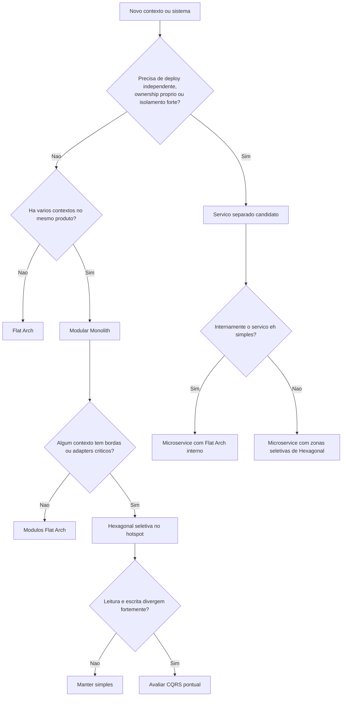

# SPEC-flat-architecture-and-architecture-decision-engine-v1

> **Status:** Draft  
> **Author:** GitHub Copilot CLI  
> **Date:** 2026-05-04  
> **Branch:** `feature/flat-arch-analysis`

---

## 1. Problema

A era da IA reduziu drasticamente o custo de **produzir** arquitetura sofisticada, mas nao reduziu na mesma
proporcao o custo de **manter**, **entender**, **evoluir** e **alimentar** essa arquitetura com contexto.
Hoje eh barato gerar Clean Architecture, Hexagonal, CQRS, DDD tatico, Event Sourcing e dezenas de classes
intermediarias. Continua caro:

- manter a coerencia dessas camadas no tempo;
- navegar na arvore de pacotes e nas fronteiras artificiais;
- pagar o custo cognitivo de indirecao;
- pagar o custo de tokens de classes, interfaces e contratos que nao entregam valor proporcional.

O problema nao eh "arquitetura demais" em abstrato. O problema eh **complexidade estrutural que chega antes
da necessidade real**.

Este documento propoe duas respostas complementares:

1. **Flat Arch** como arquitetura default simples, enxuta e intencional.
2. **Motor de Decisao Arquitetural** para escolher, de forma disciplinada, entre flat arch, modularidade
   maior, hexagonal seletiva e, quando realmente necessario, microservices e CQRS.

---

## 2. Tese central

Arquitetura deve ser **proporcional ao problema** e **evolutiva por necessidade**, nao por antecipacao.

Em termos praticos:

- **Flat Arch** deve ser o ponto de partida para a maioria das aplicacoes e servicos.
- **Modular Monolith** deve ser a forma natural de escalar estrutura sem pagar o imposto distribuido cedo demais.
- **Hexagonal** deve ser aplicada seletivamente em nucleos, bordas e integracoes que realmente pedem isolamento.
- **Microservices** devem ser uma decisao operacional e organizacional, nao a traducao automatica de bounded contexts.
- **CQRS / Event Sourcing** devem ser ferramentas de hotspot, nunca default de projeto.

Esta tese esta alinhada com o racional ja documentado no repositorio:

- **ADR-0001**: abstracoes so quando trazem beneficio concreto.
- **ADR-0008**: coexistencia legitima entre zona hexagonal e zona flat.
- **ADR-0020**: hexagonal agrega valor quando ha dominio relevante, multiplos adapters e necessidade real de
  isolamento.
- **SPEC-context-budget-optimization-v1**: custo de contexto e de tokens virou constraint arquitetural legitima.

---

## 3. O que eh Flat Arch

### 3.1 Definicao

**Flat Arch** eh uma arquitetura de software com:

- poucas camadas;
- pouca profundidade de pacotes;
- fronteiras explicitas por modulo/capacidade;
- dependencias diretas e intencionais;
- abstracoes introduzidas sob demanda;
- composicao simples, mas nao caotica.

Flat Arch **nao** significa:

- ausencia de design;
- ausencia de modulos;
- ausencia de regras de dependencia;
- ausencia de testes ou disciplina;
- misturar tudo em `util/`, `common/` e `shared/`.

Definicao curta:

> Flat Arch = a minima arquitetura necessaria para preservar clareza, coesao e evolucao sem pagar o custo de
> abstracoes especulativas.

### 3.2 Objetivos

- reduzir superficie de codigo e de tokens;
- reduzir indirecao acidental;
- tornar a navegacao obvia;
- preservar evolucao futura sem exigir reescrita ideologica;
- permitir modularidade real antes de distribuicao.

---

## 4. Principios de desenho

### 4.1 Principios

1. **Direto por padrao, abstrato por excecao.**
2. **Separar por coesao, nao por ritual arquitetural.**
3. **Um modulo = uma capacidade de negocio ou tecnica claramente nomeada.**
4. **Toda camada extra precisa pagar aluguel.**
5. **Toda interface precisa justificar seu custo.**
6. **Custo de tokens e carga cognitiva sao constraints de primeira classe.**
7. **Evolucao incremental vence pureza antecipada.**

### 4.2 Guardrails minimos

Flat Arch continua precisando de fronteiras claras. O baseline recomendado eh:

- organizacao por **feature / bounded context / capacidade**, nao por "tipo de classe" global;
- profundidade de pacote **shallow**;
- um modulo com **API publica clara** e internals privados por convencao;
- dependencias entre modulos feitas por contratos simples e bem nomeados;
- `shared` pequeno e estritamente transversal;
- sem base classes genericas e sem interfaces vazias "para o futuro".

### 4.3 Regra de ouro

> Se uma camada, interface, DTO extra, port ou adapter nao melhora testabilidade, substituibilidade,
> isolamento, compliance ou clareza de ownership, ela provavelmente ainda nao deveria existir.

---

## 5. Estrutura recomendada de Flat Arch

### 5.1 Forma canonica

A proposta preferencial eh **feature-first com profundidade rasa**.

```text
src/
  app/                    # bootstrap, wiring, config, entrypoints
  shared/                 # logging, auth helper, observability, utilitarios realmente transversais
  billing/
    BillingController
    BillingService
    BillingPolicy
    BillingRepository
    BillingDto
  customer/
    CustomerController
    CustomerService
    CustomerPolicy
    CustomerRepository
    CustomerDto
```

Quando um modulo cresce, ele pode abrir **uma** subdivisao leve sem virar cerimonial:

```text
src/
  billing/
    api/
    core/
    data/
```

### 5.2 Regras estruturais

- **`app/`** concentra bootstrap, config e composition root.
- **`shared/`** so pode conter preocupacoes transversais; regras de negocio nao entram aqui.
- Cada **modulo de negocio** concentra o fluxo principal da capacidade.
- O mesmo modulo pode conter controller, service, policy e repository no inicio, desde que a coesao seja alta.
- Ports e adapters so aparecem quando houver instabilidade real de borda ou necessidade concreta de isolamento.

### 5.3 O que evitar

- `controller/`, `service/`, `repository/`, `dto/` como pacotes globais do sistema inteiro;
- repositorios base genericos para todo mundo;
- "application service" pass-through;
- interfaces 1:1 com uma unica implementacao sem razao clara;
- modulo "shared-domain" que vira deposito de regra de negocio comum e destrói fronteiras.

---

## 6. Trade-offs explicitos

| Tema | Flat Arch | Ganho | Custo |
| :--- | :--- | :--- | :--- |
| Navegacao | Muito simples | Menos tempo e menos contexto | Menos formalismo de fronteira |
| Tokens | Baixa superficie | Menor custo para humanos e IA | Menos "documentacao estrutural" implicita |
| Testabilidade | Boa em casos simples | Menos mocks e menos boilerplate | Pode piorar se integracoes crescerem sem reestruturacao |
| Evolucao | Boa com disciplina modular | Cresce sem ritual | Pode derivar para bagunca sem guardrails |
| Substituibilidade | Introduzida sob demanda | Sem abstracao especulativa | Pode exigir refactor posterior |
| Compliance / isolamento | Limitado por padrao | Simplicidade | Pode nao bastar para dominios criticos |

Conclusao: Flat Arch eh excelente quando o problema principal eh **clareza + velocidade + baixo custo estrutural**.
Ela perde quando o problema principal passa a ser **isolamento forte de borda, multi-adapter, compliance ou autonomia operacional**.

---

## 7. Quando usar Flat Arch

Flat Arch deve ser a melhor escolha quando a maioria das condicoes abaixo for verdadeira:

- produto ainda esta descobrindo forma;
- 1 time ou poucos times conseguem coordenar o sistema;
- 1 deploy continua aceitavel;
- as integracoes externas sao poucas e estaveis;
- o dominio ainda nao exige isolamento forte;
- a prioridade eh velocidade com clareza;
- o custo de token, boilerplate e indirecao esta alto demais.

### 7.1 Sinais fortes a favor

- CRUDs enriquecidos e fluxos de negocio moderados;
- backoffice, APIs internas, produtos em formacao;
- servicos com uma responsabilidade clara e poucas integracoes;
- ferramentas, CLIs, jobs e automacoes;
- produtos que ainda nao provaram a necessidade de uma arquitetura mais dura.

---

## 8. Quando nao usar Flat Arch como resposta suficiente

Flat Arch deixa de ser suficiente quando aparecem sinais persistentes como:

- varios adapters relevantes para o mesmo nucleo;
- integracoes externas instaveis ou criticas;
- dominio denso com regras que mudam rapido;
- multiplos canais de entrada com comportamentos distintos;
- requisitos fortes de auditoria, compliance ou isolamento;
- necessidade real de substituir implementacoes sem refactor amplo;
- diferentes times precisando de ownership e deploy independentes;
- assimetria grande de escala, latencia ou falha.

Nesses casos, a saida nao precisa ser "virar tudo hexagonal". O passo correto pode ser:

- modularizar melhor;
- hexagonalizar apenas um nucleo ou uma borda;
- extrair apenas um contexto para servico;
- aplicar CQRS apenas em um hotspot.

---

## 9. Bounded Context nao eh Microservice

### 9.1 Distincao fundamental

**Bounded Context** eh uma fronteira semantica e de modelo.  
**Microservice** eh uma fronteira operacional e de deploy.

Misturar as duas coisas cedo demais gera decisoes ruins.

### 9.2 Equivalencias falsas

- bounded context != microservice
- microservice != bounded context
- modulo != servico
- context map != topologia de deploy

### 9.3 Regra recomendada

> O default saudavel eh: bounded context primeiro como modulo claro; microservice so quando houver motivo
> operacional, organizacional ou de risco.

### 9.4 Mapeamentos aceitaveis

| Relacao | Validade | Comentario |
| :--- | :--- | :--- |
| 1 bounded context -> 1 modulo em modular monolith | Excelente default | Mantem fronteira sem pagar custo distribuido |
| 1 bounded context -> 1 microservice | Bom quando justificado | Exige autonomia real, nao apenas preferencia tecnica |
| Varios bounded contexts -> 1 servico | Aceitavel no inicio | Bom para produtos em consolidacao |
| 1 bounded context -> varios microservices | Geralmente sinal amarelo | Pode fragmentar o modelo e criar acoplamento distribuido |

### 9.5 Pergunta-chave do documento

> "Nossos bounded contexts deveriam ser microservices em flat arch?"

Resposta proposta:

- **Nao por definicao.**
- **Talvez em alguns casos.**
- Quando um bounded context precisar virar servico, a melhor aposta inicial geralmente eh
  **um microservice simples por dentro, com flat arch**, e nao um servico que ja nasce com excesso de cerimonial.

Em outras palavras:

- **DDD ajuda a descobrir fronteiras**;
- **microservices materializam algumas fronteiras**;
- **flat arch pode ser a arquitetura interna de um microservice**.

---

## 10. Flat Arch composta: monolito modular e federacao de servicos simples

Existem duas composicoes pragmaticas especialmente fortes.

### 10.1 Modular Monolith com modulos Flat Arch

Default recomendado para produtos com varios contextos, mas ainda sem necessidade operacional de distribuicao.

```text
src/
  app/
  shared/
  catalog/
  billing/
  identity/
  fulfillment/
```

Cada modulo usa flat arch internamente. O sistema inteiro continua com:

- um deploy;
- observabilidade centralizada;
- sem latencia de rede entre contextos;
- sem duplicar concerns operacionais.

### 10.2 Federacao de Microservices com Flat Arch interno

Recomendado quando alguns contextos passam a pedir autonomia real.

```text
services/
  identity-service/      # flat arch interno
  billing-service/       # flat arch interno
  fulfillment-service/   # flat arch interno
```

Cada servico continua simples por dentro, mas a plataforma assume a complexidade distribuida:

- contratos;
- auth service-to-service;
- observabilidade distribuida;
- versionamento;
- retries e idempotencia;
- governance de eventos e APIs.

### 10.3 Tese composicional

> O eixo principal de escala deve ser: flat arch dentro de modulos ou servicos; complexidade distribuida so no
> nivel em que o problema realmente exige.

---

## 11. Motor de Decisao Arquitetural

### 11.1 Objetivo

Evitar duas falhas simetricas:

1. **subarquitetar** um problema que pede isolamento e bordas fortes;
2. **superarquitetar** um problema que ainda pede simplicidade e foco.

### 11.2 Eixos de decisao

Cada eixo recebe nota **0, 1 ou 2**:

| Eixo | 0 | 1 | 2 |
| :--- | :--- | :--- | :--- |
| Complexidade de dominio | Baixa | Moderada | Alta |
| Variabilidade de integracoes | Poucas / estaveis | Algumas | Muitas / instaveis |
| Necessidade de test seams / substituicao | Baixa | Media | Alta |
| Autonomia de times | Um time | Poucos times coordenados | Times independentes |
| Independencia de deploy | Nao precisa | Talvez | Precisa claramente |
| Assimetria de escala / performance | Baixa | Media | Alta |
| Isolamento de dados / compliance | Baixo | Medio | Alto |
| Divergencia de cadencia de mudanca | Baixa | Media | Alta |
| Pressao por baixo custo estrutural / token | Alta | Media | Baixa |

Observacao: o ultimo eixo eh inverso. Quanto maior a pressao por simplicidade, maior a tendencia a flat arch.

### 11.3 Regras eliminatorias

Antes de somar pontos, aplicar estas perguntas:

1. **Existe exigencia regulatoria ou de risco que imponha isolamento forte?**
   - Se sim, flat arch pura pode nao ser suficiente.
2. **Existe necessidade real de deploy independente?**
   - Se sim, considerar servico separado.
3. **Existe nucleo com multiplos adapters ou bordas altamente instaveis?**
   - Se sim, considerar hexagonal seletiva.
4. **Existe divergencia extrema entre escrita e leitura, com beneficio claro de modelos separados?**
   - Se sim, considerar CQRS pontual.

### 11.4 Saidas recomendadas

| Faixa / padrao dominante | Recomendacao |
| :--- | :--- |
| Predominio de 0 e forte pressao por simplicidade | **Flat Arch** |
| Varios modulos/contextos coesos, mas sem razao operacional para distribuicao | **Modular Monolith com modulos Flat Arch** |
| Dominio ou borda critica dentro de um sistema ainda unico | **Flat Arch + Hexagonal seletiva no hotspot** |
| Autonomia de deploy + ownership + dados proprios | **Microservice**, preferencialmente com Flat Arch interno no inicio |
| Read/write radicalmente diferentes + auditoria / replay / throughput assimetrico | **CQRS pontual**, nao global |

### 11.5 Fluxo de decisao



---

## 12. Heuristicas objetivas

### 12.1 Escolher Flat Arch

Escolha Flat Arch quando:

- ha no maximo 1 ou 2 integracoes relevantes;
- 1 deploy resolve o problema;
- o mesmo time responde pela maior parte das mudancas;
- o dominio eh entendivel sem precisar de varios contratos internos;
- velocidade, legibilidade e baixo custo estrutural sao prioridade.

### 12.2 Escolher Modular Monolith

Escolha Modular Monolith quando:

- ja existem varios bounded contexts claros;
- ainda nao existe razao economica para distribuir;
- o produto precisa de fronteiras internas melhores;
- quer-se evitar microservices cedo demais.

### 12.3 Escolher Hexagonal seletiva

Escolha hexagonal seletiva quando:

- um contexto tem muitos adapters;
- um modulo concentra risco tecnico ou regulatorio;
- a testabilidade daquele nucleo esta sofrendo;
- a equipe precisa de contratos mais estaveis naquela borda.

### 12.4 Escolher Microservice

Escolha microservice quando o contexto apresenta combinacao de:

- ownership forte e estavel;
- dados claramente proprios;
- deploy desacoplado com valor real;
- escala ou falha diferente dos demais contextos;
- custo distribuido compensado por autonomia operacional.

### 12.5 Escolher CQRS

Escolha CQRS apenas quando houver beneficio mensuravel, como:

- escrita com invariantes pesadas e leitura altamente otimizada;
- modelos de leitura muito diferentes do modelo transacional;
- auditoria, replay ou trilha de evento com valor de negocio claro.

Se o argumento for apenas "parece mais escalavel", a resposta default deve ser **nao**.

---

## 13. Caminho evolutivo recomendado

### Etapa 1 — Comecar simples

- comecar com flat arch;
- modelar por modulo/capacidade;
- manter composicao clara em `app/`;
- manter `shared/` minimo.

### Etapa 2 — Modularizar sem distribuir

- nomear bounded contexts;
- isolar APIs publicas de modulo;
- reduzir acoplamento cruzado;
- explicitar ownership e dependencias.

### Etapa 3 — Endurecer hotspots

- aplicar ports/adapters apenas onde ha ganho concreto;
- formalizar contratos nas bordas que doem;
- extrair hexagonal apenas em nucleos ou integracoes criticas.

### Etapa 4 — Extrair servicos quando o problema existir

- separar primeiro o contexto mais autonomo;
- iniciar o novo servico com arquitetura interna simples;
- mover complexidade para contratos e plataforma, nao para classes desnecessarias.

### Etapa 5 — Aplicar CQRS apenas se o contexto pedir

- em um modulo ou servico especifico;
- com metricas e ganho esperado claros.

### 13.1 Principio evolutivo

> A trajetoria recomendada eh: **flat arch -> modular monolith -> hexagonal seletiva -> microservices pontuais -> CQRS
> onde houver hotspot real**.

Isso preserva optionalidade sem pagar o custo inteiro antecipadamente.

---

## 14. Guardrails de implementacao

Para que Flat Arch nao degrade em bagunca, adotar os seguintes guardrails:

1. **Organizacao por modulo**, nao por tipo de classe global.
2. **Profundidade rasa** de pacotes.
3. **Dependencias entre modulos so por API publica** ou eventos bem definidos.
4. **Sem interfaces 1:1** salvo quando houver segunda implementacao, borda instavel ou valor claro de teste.
5. **Sem classes base genericas** para esconder comportamento.
6. **`shared/` pequeno** e proibido para regra de negocio de contexto.
7. **Refactor seletivo** quando um modulo comecar a acumular adapters, compliance ou acoplamento estrutural.
8. **Documentar excecoes**: se um modulo ganhar camada extra, isso deve ser decisao consciente.

---

## 15. Decisoes propostas

### D-01

**Flat Arch passa a ser o default recomendado** para novos sistemas, servicos e contextos internos quando nao houver
evidencia forte de necessidade de estrutura mais pesada.

### D-02

**Bounded context deve ser tratado primeiro como fronteira de modelo e ownership**, nao como microservice obrigatorio.

### D-03

**Modular Monolith com modulos Flat Arch** passa a ser o default recomendado para produtos com varios contexts, mas sem
necessidade operacional clara de distribuicao.

### D-04

**Microservices podem usar Flat Arch internamente** como ponto de partida. Separacao de servicos nao implica adotar
hexagonal completa dentro de cada servico.

### D-05

**Hexagonal, CQRS e afins deixam de ser defaults e passam a ser instrumentos seletivos**, aplicados por contexto,
hotspot, borda ou requisito regulatorio.

---

## 16. Riscos e anti-padroes

### 16.1 Riscos

- chamar de "flat" uma estrutura sem ownership nem fronteiras;
- deixar `shared/` virar destino de tudo que "nao se sabe onde por";
- adiar refactors necessarios por apego a simplicidade inicial;
- extrair microservices cedo demais e multiplicar custo operacional;
- usar o motor de decisao como checklist cosmetico, e nao como disciplina real.

### 16.2 Anti-padroes

- microservices por bounded context desde o dia zero;
- hexagonal completa em CRUD simples;
- CQRS como slogan de escalabilidade;
- interfaces em massa para mascarar ausencia de criterio;
- DDD tatico sem DDD estrategico;
- modular monolith com dependencias cruzadas nao controladas;
- flat arch sem naming, sem ownership e sem regras de dependencia.

---

## 17. Perguntas em aberto

1. Quais heuristicas deste motor devem virar checklist formal no gerador?
2. Devemos materializar `architecture.style: flat` como opcao explicita no YAML do projeto?
3. O gerador deve oferecer perfis compostos como:
   - `flat`
   - `modular-flat`
   - `hexagonal`
   - `microservice-flat`
   - `microservice-hex`
4. Quais guardrails automatizados fazem sentido para flat arch sem reproduzir o excesso de cerimonial que ela quer evitar?
5. Quais sinais objetivos devem disparar a promocao de um modulo flat para zona hexagonal ou para servico separado?

---

## 18. Recomendacao final

A recomendacao central desta SPEC eh:

> **Adotar simplicidade arquitetural intencional como default.**
>
> Em termos praticos: começar com flat arch, escalar para modular monolith, endurecer hotspots com hexagonal seletiva
> e extrair microservices apenas quando houver motivacao operacional real. Bounded contexts devem orientar o desenho
> do sistema, mas nao devem ser convertidos automaticamente em fronteiras de deploy.

Se esta direcao for aceita, o proximo passo natural eh transformar este documento em:

1. um conjunto de guardrails objetivos para `architecture.style: flat`;
2. um checklist de decisao arquitetural reutilizavel;
3. perfis geraveis compostos pelo motor de decisao, em vez de catalogos excessivamente ideologicos.
