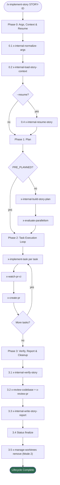

# x-implement-story

> Thin orchestrator (~340 lines — story-0049-0019 refactor) that drives a story end-to-end via 4 delegated phases. Zero inline git/gh/mvn calls; every substantive responsibility is delegated to specialized sub-skills.

| | |
|---|---|
| **Category** | Orchestrator (thin — ADR-0012 + EPIC-0049) |
| **Invocation** | `/x-implement-story STORY-ID [--target-branch <branch>] [--auto-merge <strategy>] [--epic-id <XXXX>] ...` |
| **Delegates to** | `x-internal-normalize-args`, `x-internal-load-story-context`, `x-internal-resume-story`, `x-internal-build-story-plan`, `x-implement-task`, `x-create-pr`, `x-watch-pr-ci`, `x-evaluate-parallelism`, `x-review-codebase`, `x-review-pr`, `x-fix-pr`, `x-internal-verify-story`, `x-internal-write-story-report`, `x-internal-update-status`, `x-manage-worktrees` |

> **Spec**: See [SKILL.md](./SKILL.md) for the complete execution specification.

## Overview

Runs the full story implementation lifecycle as 4 delegated phases. Every substantive responsibility — argv parsing, story loading, planning, TDD, verification, reporting — is delegated to a sub-skill. The orchestrator's inline work is limited to `Read`/`Glob` for local file discovery and `Skill`/`Agent` for delegation.

EPIC-0049 introduced three OO-style flags (`--target-branch`, `--auto-merge`, `--epic-id`) that propagate downward to `x-implement-task` and `x-create-pr`. When the flags are absent, the orchestrator preserves EPIC-0048 behavior exactly (target=develop, auto-merge=none).

## Execution Flow

## Phases

| # | Phase | Description | Delegated To |
|---|-------|-------------|--------------|
| 0 | Args, Context & Resume | Parse argv, load story, detect resume point, worktree decision | `x-internal-normalize-args`, `x-internal-load-story-context`, `x-internal-resume-story`, `x-manage-worktrees detect-context` |
| 1 | Plan | Parallel planning (arch + test + decomposition + security + compliance), parallelism gate | `x-internal-build-story-plan`, `x-evaluate-parallelism` |
| 2 | Task Execution Loop | Per-task TDD + CI watch + PR create (flags propagate OO-style) | `x-implement-task`, `x-watch-pr-ci`, `x-create-pr`, `x-internal-update-status` |
| 3 | Verify, Report & Cleanup | Verify gate, specialist + TL reviews, final report, status finalize, worktree cleanup | `x-internal-verify-story`, `x-review-codebase`, `x-review-pr`, `x-fix-pr`, `x-internal-write-story-report`, `x-internal-update-status`, `x-manage-worktrees remove` |

## EPIC-0049 Flag Propagation

| Flag | Default | Propagation |
| :--- | :--- | :--- |
| `--target-branch <branch>` | `develop` | → `x-implement-task --target-branch`, `x-create-pr --target-branch` |
| `--auto-merge <strategy>` | `none` | → `x-create-pr --auto-merge` (requires `--target-branch` when not `none`) |
| `--epic-id <XXXX>` | auto-derived | → `x-create-pr --epic-id` (adds `epic-XXXX` label) |

With all three flags absent, behavior is identical to EPIC-0048 (backward compat — RULE-008).

## Prerequisites

- Story file exists with acceptance criteria and sub-tasks
- Predecessor stories (dependencies) are complete (validated by `x-internal-load-story-context`)
- Epic directory structure: `ai/epics/epic-XXXX/plans/`, `ai/epics/epic-XXXX/reports/`
- Git working tree is clean on the base branch

## Outputs

| Artifact | Path | Producer |
|----------|------|----------|
| Architecture / Implementation / Test / Task / Security / Compliance Plans | `ai/epics/epic-XXXX/plans/*-story-XXXX-YYYY.md` | `x-internal-build-story-plan` (Phase 1) |
| Story Completion Report | `ai/epics/epic-XXXX/reports/story-completion-report-STORY-ID.md` | `x-internal-write-story-report` (Phase 3.3) |
| Review Dashboard | `ai/epics/epic-XXXX/reviews/dashboard-story-XXXX-YYYY.md` | `x-review-codebase` (Phase 3.2) |
| Per-task PRs | GitHub (targeting `--target-branch` or `develop`) | `x-create-pr` (Phase 2) |
| Story-level PR (`--auto-approve-pr` only) | GitHub (parent `feat/story-...` → `--target-branch`) | `x-create-pr` (Phase 2.2) |

## See Also

- [x-implement-epic](../x-implement-epic/) -- Epic-level orchestrator that dispatches this skill per story
- [x-implement-task](../x-implement-task/) -- TDD implementation engine used in Phase 2
- [x-internal-load-story-context](../../internal/plan/x-internal-load-story-context/) -- Story load + artifact pre-checks
- [x-internal-build-story-plan](../../internal/plan/x-internal-build-story-plan/) -- Parallel planning (Phase 1)
- [x-internal-verify-story](../../internal/plan/x-internal-verify-story/) -- Verify gate (Phase 3.1)
- [x-internal-write-story-report](../../internal/plan/x-internal-write-story-report/) -- Final report (Phase 3.3)
- [x-internal-resume-story](../../internal/plan/x-internal-resume-story/) -- Resume-point detection (Phase 0.4)
- [x-internal-normalize-args](../../internal/ops/x-internal-normalize-args/) -- Argv parsing (Phase 0.1)
