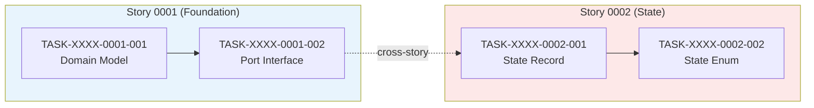

# x-internal-map-epic — Full Protocol

Detailed phase-by-phase reference for `x-internal-map-epic`. The SKILL.md body holds the minimum viable contract per ADR-0012; this document is the canonical procedural reference.

## Workflow — Step-by-Step

### Step P1 — Detect Worktree Context (EPIC-0049 / RULE-001)

<!-- TELEMETRY: phase.start -->
Bash command: `$CLAUDE_PROJECT_DIR/.claude/hooks/telemetry-phase.sh start x-epic-map Phase-P1-Worktree-Detect`

Invoke `x-manage-worktrees` in detect-context mode so downstream steps know whether the current checkout is already inside an epic worktree. Result is advisory only — `x-internal-ensure-epic-branch` (Step P2) owns the authoritative branch decision.

    Skill(skill: "x-manage-worktrees", args: "detect-context")

Fail-open (RULE-006): any detect-context failure is logged and Step P2 proceeds.

<!-- TELEMETRY: phase.end -->
Bash command: `$CLAUDE_PROJECT_DIR/.claude/hooks/telemetry-phase.sh end x-epic-map Phase-P1-Worktree-Detect ok`

### Step P2 — Ensure `epic/<ID>` Branch (EPIC-0049 / RULE-001)

<!-- TELEMETRY: phase.start -->
Bash command: `$CLAUDE_PROJECT_DIR/.claude/hooks/telemetry-phase.sh start x-epic-map Phase-P2-Epic-Branch-Ensure`

Derive the epic ID from the `<EPIC_FILE>` path (`ai/epics/epic-<XXXX>/epic-<XXXX>.md`), then ensure the `epic/<XXXX>` branch exists locally AND on origin.

    Skill(skill: "x-internal-ensure-epic-branch", args: "--epic-id <XXXX>")

On non-zero exit, abort with `EPIC_BRANCH_ENSURE_FAILED`.

<!-- TELEMETRY: phase.end -->
Bash command: `$CLAUDE_PROJECT_DIR/.claude/hooks/telemetry-phase.sh end x-epic-map Phase-P2-Epic-Branch-Ensure ok`

### Step 1 — Build the Dependency Matrix

<!-- TELEMETRY: phase.start -->
Bash command: `$CLAUDE_PROJECT_DIR/.claude/hooks/telemetry-phase.sh start x-epic-map Phase-1-DAG-Build`

Read every story's Section 1 (Dependencias) and the Epic's story index. Also read each story's `**Chave Jira:**` field. Build the complete matrix:

| Story | Titulo | Chave Jira | Blocked By | Blocks | Status |
| :--- | :--- | :--- | :--- | :--- | :--- |

The `Chave Jira` column is between `Titulo` and `Blocked By`. If a story has no Jira key (field is `—` or `<CHAVE-JIRA>`), set the value to `—`.

**Validation checks:**
- Every story in the Epic's index must appear in the matrix
- Dependencies must be symmetric: if A blocks B, then B must list A as blocker
- No circular dependencies (A→B→C→A is invalid)
- Root stories (no blockers) must exist

If inconsistencies are found, fix them and note the corrections. Add a `> **Nota:**` block for implicit dependencies (functionally required but not declared).

<!-- TELEMETRY: phase.end -->
Bash command: `$CLAUDE_PROJECT_DIR/.claude/hooks/telemetry-phase.sh end x-epic-map Phase-1-DAG-Build ok`

### Step 2 — Compute Phases

<!-- TELEMETRY: phase.start -->
Bash command: `$CLAUDE_PROJECT_DIR/.claude/hooks/telemetry-phase.sh start x-epic-map Phase-2-Phase-Computation`

Group stories into phases using the DAG:

1. **Phase 0**: All stories with no dependencies (roots)
2. **Phase 1**: Stories whose dependencies are all in Phase 0
3. **Phase N**: Stories whose dependencies are all in Phase 0..N-1

Within each phase, all stories can run in parallel.

Create the ASCII phase diagram using box-drawing characters. Follow the template — `+=+`, `|`, `+=+` for phase boxes; `+-+`, `|`, `+-+` for story boxes; `|-->`, `v` for arrows. Each story box: ID + short scope (max ~20 chars). Each phase box: phase number + name + "(paralelo)" if multiple stories.

<!-- TELEMETRY: phase.end -->
Bash command: `$CLAUDE_PROJECT_DIR/.claude/hooks/telemetry-phase.sh end x-epic-map Phase-2-Phase-Computation ok`

### Step 3 — Identify the Critical Path

<!-- TELEMETRY: phase.start -->
Bash command: `$CLAUDE_PROJECT_DIR/.claude/hooks/telemetry-phase.sh start x-epic-map Phase-3-Critical-Path`

The critical path is the longest chain of dependencies from any root to any leaf. Count phases, not individual stories.

Render as ASCII:
```
story-0001-0001 -+
            +---> story-0001-0002 -> story-0001-0003 --+
story-0001-0009 -+                              +---> story-0001-0011
                 story-0001-0002 -> story-0001-0010 --+
   Fase 0           Fase 1       Fase 2            Fase 3
```

State: **N phases in the critical path, M stories in the longest chain**. Explain impact: any delay in a critical path story directly delays final delivery.

<!-- TELEMETRY: phase.end -->
Bash command: `$CLAUDE_PROJECT_DIR/.claude/hooks/telemetry-phase.sh end x-epic-map Phase-3-Critical-Path ok`

### Step 4 — Generate the Mermaid Dependency Graph

<!-- TELEMETRY: phase.start -->
Bash command: `$CLAUDE_PROJECT_DIR/.claude/hooks/telemetry-phase.sh start x-epic-map Phase-4-Mermaid`

Create a full `graph TD` with all stories and their dependency edges.

**Naming convention**: `SXXXX_YYYY["story-XXXX-YYYY<br/>Short Title"]`

If Jira keys are available, include them: `SXXXX_YYYY["story-XXXX-YYYY (PROJ-123)<br/>Short Title"]`

**Phase coloring** (exact classDef values for consistency):
```
classDef fase0 fill:#1a1a2e,stroke:#e94560,color:#fff
classDef fase1 fill:#16213e,stroke:#0f3460,color:#fff
classDef fase2 fill:#533483,stroke:#e94560,color:#fff
classDef fase3 fill:#e94560,stroke:#fff,color:#fff
classDef faseQE fill:#0d7377,stroke:#14ffec,color:#fff
classDef faseTD fill:#2d3436,stroke:#fdcb6e,color:#fff
classDef faseCR fill:#6c5ce7,stroke:#a29bfe,color:#fff
```

Assign classDef by phase. Group edges by phase transition (comment with `%% Fase N -> N+1`).

<!-- TELEMETRY: phase.end -->
Bash command: `$CLAUDE_PROJECT_DIR/.claude/hooks/telemetry-phase.sh end x-epic-map Phase-4-Mermaid ok`

### Step 5 — Create the Phase Summary Table

| Fase | Historias | Camada | Paralelismo | Pre-requisito |
| :--- | :--- | :--- | :--- | :--- |
| 0 | story-0001-0001, story-0001-0009 | Infra + API | 2 paralelas | — |

Include total count: **N historias em M fases**. Add notes about transversal phases (QE, Tech Debt) that can execute independently.

### Step 6 — Detail Each Phase

For each phase, create a subsection with:

**Table**: Story | Escopo Principal | Artefatos Chave

**Entregas da Fase N** (bullet list of concrete deliverables — what exists after this phase that did not exist before).

Be specific about artifacts: class names, table names, endpoints, configurations, test infrastructure.

### Step 7 — Write Strategic Observations

These are the highest-value part of the map. Analyze:

**Gargalo Principal**: Which story blocks the most others? Investing extra time pays off. Usually the Layer 1 core story.

**Historias Folha (sem dependentes)**: Stories that do not block anything. They can absorb delays without impacting the critical path. Good candidates for junior developers or parallel streams.

**Otimizacao de Tempo**: Where is parallelism maximized? Which stories can start immediately? How should teams be allocated across phases?

**Dependencias Cruzadas**: Stories in later phases that depend on stories from different branches of the dependency tree. Identify convergence points.

**Marco de Validacao Arquitetural**: Which story should serve as the architectural checkpoint before expanding scope? What does it validate (patterns, pipeline, integration)?

### Step 8 — Task-Level Dependency Graph

If stories contain a **Section 8 (Sub-tarefas / Tasks)** with formal task IDs (`TASK-XXXX-YYYY-NNN`), build a task-level dependency graph across all stories.

#### 8A — Extract Cross-Story Task Dependencies

For each story, read the task list (Section 8) and their `depends on` declarations. Identify cross-story task dependencies. Build a table:

| Task | Depends On | Story Source | Story Target | Type |
| :--- | :--- | :--- | :--- | :--- |
| TASK-XXXX-YYYY-NNN | TASK-XXXX-ZZZZ-MMM | story-XXXX-YYYY | story-XXXX-ZZZZ | data/interface/schema/config |

**Type** indicates the nature of the dependency:
- `data` — depends on data model or entity from another story
- `interface` — depends on a port/interface defined in another story
- `schema` — depends on a DB schema or migration from another story
- `config` — depends on configuration or infrastructure from another story

#### 8B — Validate RULE-012 (Cross-Story Consistency)

For every cross-story task dependency, validate that the corresponding story-level dependency exists:

| Validation | Action |
| :--- | :--- |
| Cross-story task dep without story-level dep | **ERROR**: "TASK-X depends on TASK-Y but story-A does not depend on story-B" |
| Cycle detected in task graph | **ERROR**: "Cycle detected: TASK-A -> TASK-B -> TASK-C -> TASK-A" |
| Story-level dep without cross-story task dep | **WARNING**: "story-A depends on story-B but no cross-story task dependencies found" |

If an ERROR is detected, **abort** generation and report the inconsistency. If only WARNINGs exist, proceed but include them in the output.

#### 8C — Compute Merge Order via Topological Sort

Apply topological sort to the full task dependency graph (intra-story + cross-story):

1. Build the directed graph of all tasks across all stories
2. Detect cycles — if found, abort with cycle description
3. Compute topological order (deterministic: break ties by task ID)
4. Group tasks into execution phases (phase N = tasks whose dependencies are all in phases 0..N-1)
5. Tasks in the same phase with no dependencies between them are **parallelizable**

Produce a merge order table:

| Order | Task ID | Story | Parallelizable With | Phase |
| :--- | :--- | :--- | :--- | :--- |
| 1 | TASK-XXXX-YYYY-NNN | story-XXXX-YYYY | TASK-XXXX-ZZZZ-MMM | 0 |

#### 8D — Generate Mermaid Task Dependency Graph

Create a `graph LR` with tasks as nodes, colored by story:

- **Subgraphs** group tasks by story, each with a distinct fill color
- **Intra-story edges** use solid arrows (`-->`)
- **Cross-story edges** use dashed arrows (`-.->`) with `|cross-story|` label
- **Node labels** include task ID and short description

Use these story colors (cycle through for more stories):
```
style story-1 fill:#e8f4fd
style story-2 fill:#fde8e8
style story-3 fill:#e8fde8
style story-4 fill:#fdf8e8
style story-5 fill:#f0e8fd
style story-6 fill:#e8fdfa
```

Example:


If stories do not contain formal task IDs, **skip this step entirely** and note: "Task-level dependency graph skipped — stories do not contain formal task definitions (TASK-XXXX-YYYY-NNN)."

### Step 8.5 — Parallelism Conflict Analysis (EPIC-0041)

<!-- TELEMETRY: phase.start -->
Bash command: `$CLAUDE_PROJECT_DIR/.claude/hooks/telemetry-phase.sh start x-epic-map Phase-8-5-Parallelism-Eval`

Invoke `/x-evaluate-parallelism --scope=epic` against the epic under analysis to detect file-level collision risks between stories that Step 2 placed in the same phase. The output feeds the "## 8.5 Restrições de Paralelismo" section of the map.

**Fail-open behavior (RULE-005 / RULE-006):** If the `x-evaluate-parallelism` skill is not available in the project (skill file missing under `.claude/skills/x-evaluate-parallelism/` or `src/main/resources/targets/claude/skills/core/plan/x-evaluate-parallelism/`) OR the invocation returns a non-zero exit code, DO NOT abort the map generation. Instead, emit section 8.5 with the following body:

```markdown
## 8.5 Restrições de Paralelismo

> análise pulada — /x-evaluate-parallelism não disponível (RULE-006 fail-open)
```

and continue to Step 9. Log a WARNING with the reason (skill missing, exit code N, etc.) for operator diagnostics.

**Happy-path output** (skill available and returned successfully):

```markdown
## 8.5 Restrições de Paralelismo

> Análise gerada por /x-evaluate-parallelism em <timestamp omitido para determinismo>.

**Conflitos detectados:** <H> hard, <R> regen, <S> soft

### 8.5.1 Pares Serializados Dentro da Fase

| Fase | A | B | Categoria | Motivo |
| :--- | :--- | :--- | :--- | :--- |
| <Phase N> | <story-A> | <story-B> | <hard|regen|soft> | <file shared or regen collision> |

### 8.5.2 Recomendação de Reagrupamento

<Para cada fase com conflitos, descrever a nova ordem após serialização forçada.>
```

**Determinism (RULE-008):** The section MUST be byte-identical across re-runs EXCEPT for the timestamp comment on the header line. The same input epic + story set MUST produce the same collision matrix ordering (sort pairs by Phase ASC → Story-A lexicographic → Story-B lexicographic).

**Invocation shape:** Invoke via the Skill tool (Rule 13 — INLINE-SKILL pattern):

    Skill(skill: "x-evaluate-parallelism", args: "--scope=epic --epic <EPIC_FILE>")

**Degenerate case:** If no conflicts are detected (`0 hard, 0 regen, 0 soft`), emit section 8.5 with "Conflitos detectados: 0" and omit subsections 8.5.1 / 8.5.2.

<!-- TELEMETRY: phase.end -->
Bash command: `$CLAUDE_PROJECT_DIR/.claude/hooks/telemetry-phase.sh end x-epic-map Phase-8-5-Parallelism-Eval ok`

### Step 9 — Save and Report

Save as `IMPLEMENTATION-MAP.md` in the same directory as the Epic and Stories (inside `ai/epics/epic-XXXX/`).

Report: total stories, phases, critical path length, maximum parallelism, main bottleneck. If task-level dependencies were computed, also report: total tasks, task phases, cross-story dependencies count.

### Step P4 — Commit Implementation Map (EPIC-0049 / RULE-007)

<!-- TELEMETRY: phase.start -->
Bash command: `$CLAUDE_PROJECT_DIR/.claude/hooks/telemetry-phase.sh start x-epic-map Phase-P4-Planning-Commit`

If `--dry-run` is set, log `"dry-run, skipping commit"` and skip this step entirely.

Otherwise, delegate the commit to `x-commit-planning` so the refreshed `ai/epics/epic-XXXX/IMPLEMENTATION-MAP.md` is versioned on the canonical `epic/<ID>` branch without triggering the code pre-commit chain:

    Skill(skill: "x-commit-planning",
          args: "--scope docs --epic-id <XXXX> --paths ai/epics/epic-<XXXX>/IMPLEMENTATION-MAP.md --subject \"update implementation map\"")

Idempotency: when the map is byte-identical to the previously committed version, `x-commit-planning` returns `commitSha=null` and `noOp=true` (silent no-op). No additional diff check is required here.

On `COMMIT_FAILED` (exit 4), abort with the same error code.

<!-- TELEMETRY: phase.end -->
Bash command: `$CLAUDE_PROJECT_DIR/.claude/hooks/telemetry-phase.sh end x-epic-map Phase-P4-Planning-Commit ok`

### Step P5 — Push to Origin (optional, EPIC-0049)

<!-- TELEMETRY: phase.start -->
Bash command: `$CLAUDE_PROJECT_DIR/.claude/hooks/telemetry-phase.sh start x-epic-map Phase-P5-Push`

If `--dry-run` is set, log `"dry-run, skipping push"` and skip.

Otherwise, push the canonical epic branch so the updated map is observable on origin:

    Skill(skill: "x-push-branch", args: "--branch epic/<XXXX>")

On push failure, log a WARNING and continue — the local commit is preserved; the operator re-runs manually. Do NOT abort.

<!-- TELEMETRY: phase.end -->
Bash command: `$CLAUDE_PROJECT_DIR/.claude/hooks/telemetry-phase.sh end x-epic-map Phase-P5-Push ok`

## Common Mistakes

- **Phase computation error**: A story can only enter a phase when ALL its dependencies (not just some) are in earlier phases.
- **Missing convergence analysis**: When story-0001-0011 depends on story-0001-0003 AND story-0001-0010 from different branches, this creates a convergence point that deserves a callout.
- **Generic observations**: "story-0001-0002 is important" says nothing. "story-0001-0002 blocks 6 stories and establishes the decision engine pattern that all Phase 2 handlers reuse — investing extra design time here prevents refactoring 6 handlers later" is useful.
- **Inconsistent status**: If a story is marked Done in the matrix but Pending in the phase diagram, that is a bug.
- **Missing leaf analysis**: Leaf stories (no dependents) are strategically important because they can absorb schedule variance. Always identify them.

## Planning Status Propagation (Rule 22 / EPIC-0046)

> V2-gated: only runs when the epic declares `planningSchemaVersion: "2.0"` in its `execution-state.json`. For v1 epics: skip silently (Rule 19).

`x-epic-map` reads story files (it does NOT write to them) and emits/refreshes `ai/epics/epic-XXXX/IMPLEMENTATION-MAP.md` with two lifecycle columns:

- **Planejamento** — mirrors the current `**Status:**` of each story (values: `Pendente`, `Planejada`, `Em Andamento`, `Concluída`, `Falha`, `Bloqueada`).
- **Status** — the execution lifecycle status (same six values; driven by `x-implement-story` / `x-implement-epic` downstream).

Both columns are populated by reading the story files in situ via the CLI. `x-epic-map` never transitions any story — it is a read-only skill with respect to lifecycle status. The `{{PLANNING_STATUS}}` token in the implementation-map template is resolved at render-time by reading each story.

**Steps (end of map generation, BEFORE the final commit):**

1. For each story row being rendered into the map:
   ```bash
   STATUS=$(java -cp $CLAUDE_PROJECT_DIR/java/target/classes \
       dev.iadev.adapter.inbound.cli.StatusFieldParserCli \
       read ai/epics/epic-XXXX/story-XXXX-YYYY.md)
   ```
   Use `$STATUS` to fill the `Planejamento` column for that row. Exit code 20 for any story → abort map generation (source-of-truth invariant RULE-046-01 must hold).
2. The `Status` (execution) column is filled from `execution-state.json` (not from the story file) — the story's `**Status:**` line is authoritative for planning only in v2.
3. Stage and commit the updated map:
   ```bash
   git add ai/epics/epic-XXXX/IMPLEMENTATION-MAP.md
   ```

       Skill(skill: "x-commit-changes", args: "docs(epic-XXXX): refresh implementation map with lifecycle columns")

**Fail-loud:** CLI exit 20 on any story aborts map generation (RULE-046-08). `x-epic-map` never calls `write` on a story — the skill only reads.
